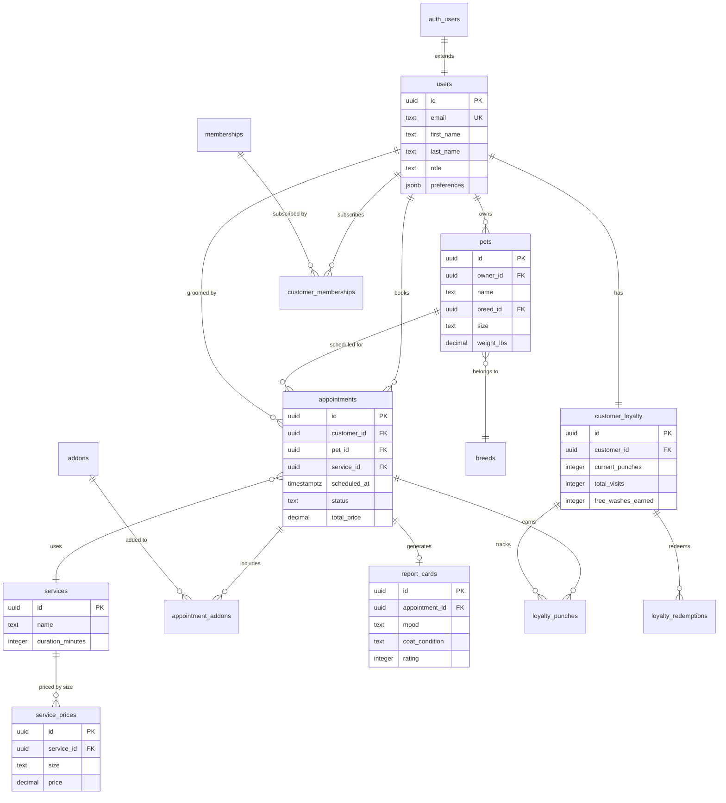
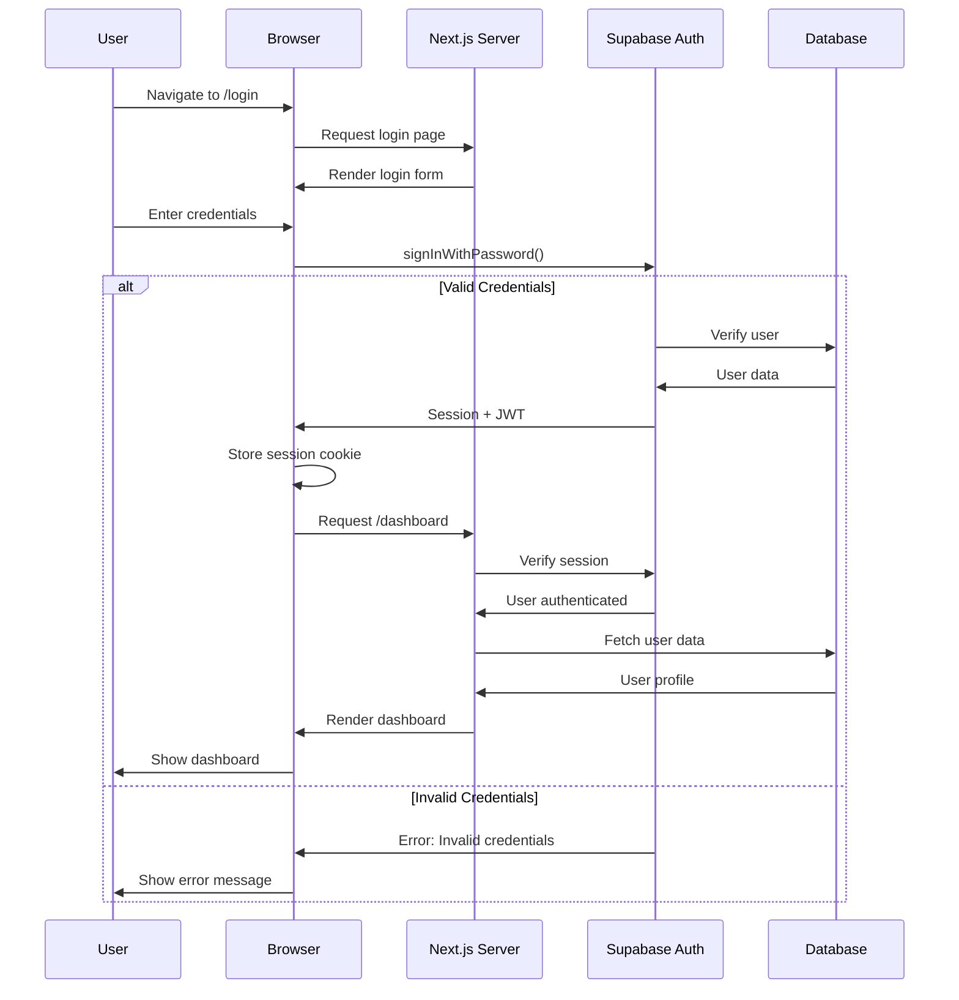
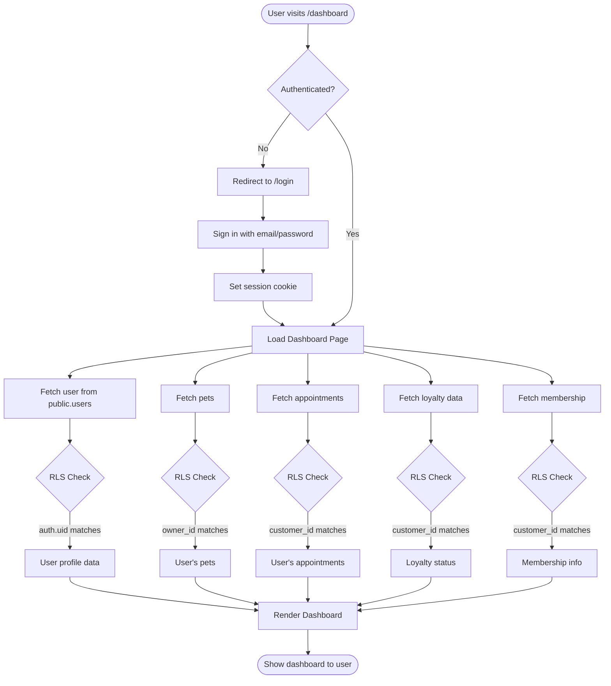
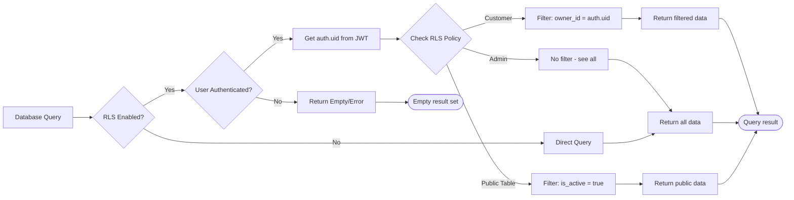
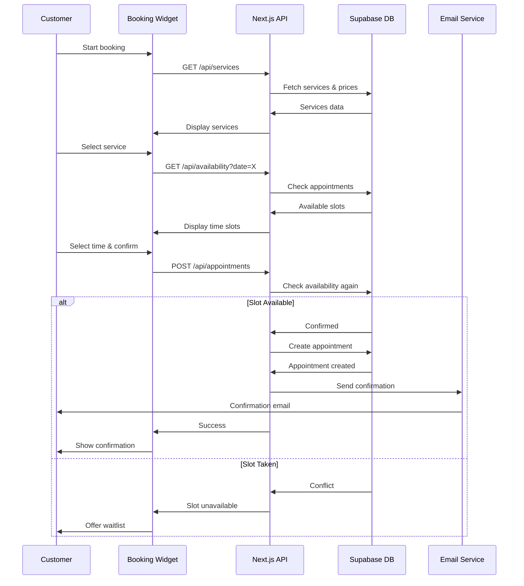
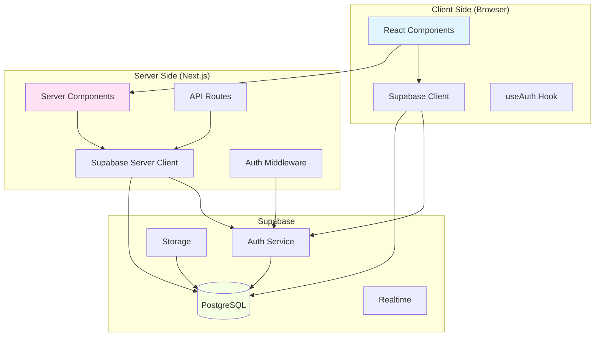
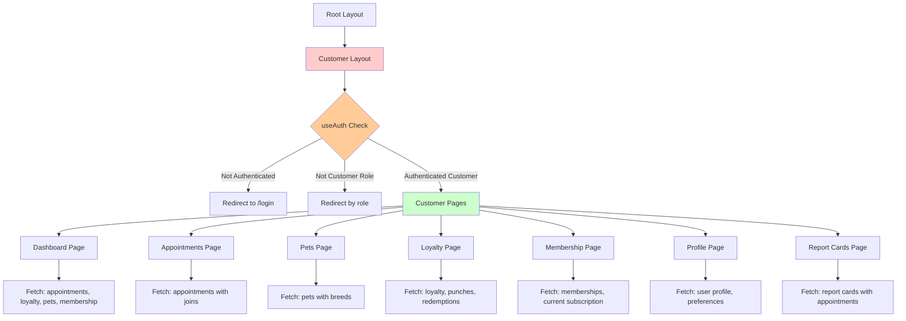
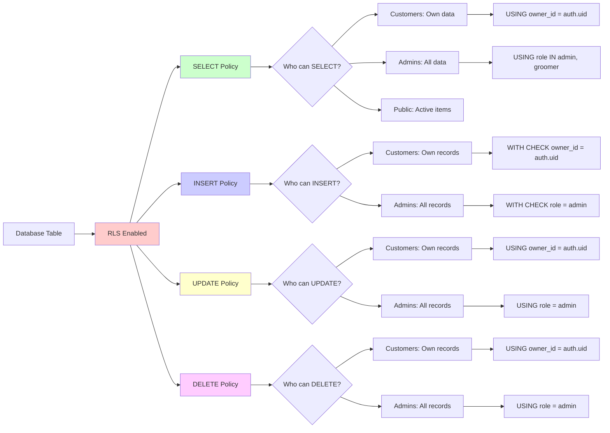
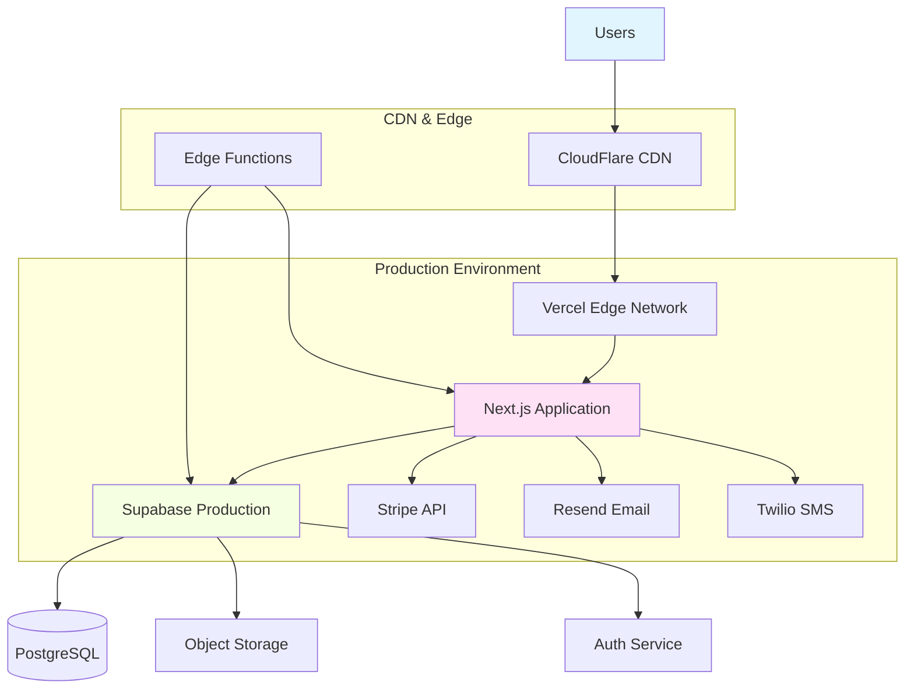

# Architecture Diagrams - The Puppy Day

## Database Schema Diagram



## Authentication Flow



## Customer Portal Data Flow



## Row Level Security (RLS) Flow



## Booking Flow (Future - Phase 3)



## Loyalty System Flow

```mermaid
stateDiagram-v2
    [*] --> NewCustomer: First visit

    NewCustomer --> Active: Create loyalty record
    Active --> Punches: Earn punches

    Punches --> Punches: Visit (punch < threshold)
    Punches --> Earned: Visit (punch = threshold)

    Earned --> Earned: Additional visits
    Earned --> Redeemed: Redeem free wash

    Redeemed --> Active: Reset cycle

    state Punches {
        [*] --> Punch1: Visit 1
        Punch1 --> Punch2: Visit 2
        Punch2 --> Punch3: Visit 3
        Punch3 --> Punch9: ...
        Punch9 --> [*]: Visit 9
    }

    state Earned {
        note right of Earned: Customer has free wash available
    }
```

## Application Architecture



## Customer Portal Page Structure



## RLS Policy Structure



## Deployment Architecture (Future)



## Summary

These diagrams illustrate:

1. **Database Schema** - All tables and relationships
2. **Authentication Flow** - How users sign in and get authenticated
3. **Customer Portal Data Flow** - How data is fetched and filtered
4. **RLS Flow** - How Row Level Security protects data
5. **Booking Flow** - Future booking system implementation
6. **Loyalty System** - State machine for punch card system
7. **Application Architecture** - Client/Server/Database layers
8. **Page Structure** - Customer portal page hierarchy
9. **RLS Policy Structure** - How policies are organized
10. **Deployment Architecture** - Production infrastructure (future)

All diagrams use Mermaid syntax and can be viewed in:
- GitHub (automatic rendering)
- VS Code (with Mermaid preview extension)
- Online tools (mermaid.live)
