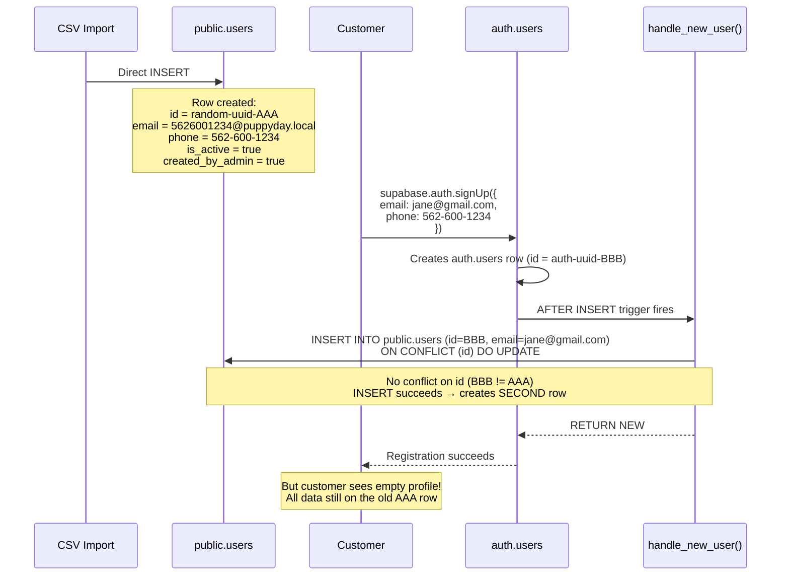
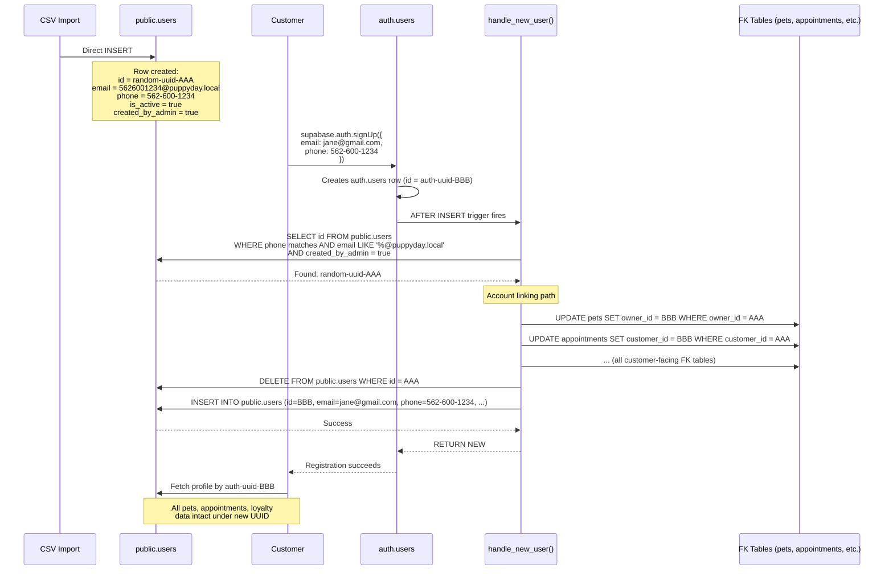
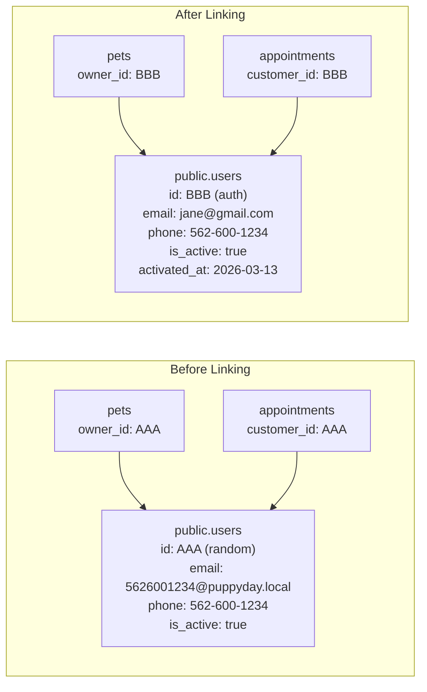

# Account Linking - Technical Design Document

## Overview

### Feature Summary

Replace the existing `handle_new_user()` Postgres trigger function so that when a customer signs up via Supabase Auth and their **phone number** matches an existing CSV-imported profile in `public.users`, their new auth account is seamlessly linked to that profile. All associated data (pets, appointments, loyalty points, etc.) is preserved under the new auth UUID.

### Problem Statement

The current signup flow breaks when a CSV-imported customer tries to register:

1. CSV import script inserted 267 customers directly into `public.users` with `gen_random_uuid()` as the PK, placeholder emails (`{phone}@puppyday.local`), `is_active=true`, `created_by_admin=true`
2. Customer signs up with their **real email** -- Supabase Auth creates an `auth.users` row with a **different** UUID
3. The `handle_new_user` trigger fires and attempts `INSERT INTO public.users ... ON CONFLICT (id) DO UPDATE`
4. The `ON CONFLICT` clause targets the `id` primary key, but the new auth UUID does not conflict with the old random UUID
5. The INSERT succeeds, creating a **second row** for the same person -- one with their real email (no data) and one with the `@puppyday.local` email (all their history)
6. The customer sees an empty profile with no pets or appointment history

**Why email matching won't work**: CSV-imported customers have placeholder emails like `5626001234@puppyday.local` -- their real email addresses are unknown. The only reliable identifier shared between the CSV data and the customer's signup is their **phone number**.

### Business Value

- **Unblocks customer registration**: Customers whose data was pre-imported can self-register and see their full history
- **Preserves data continuity**: Pet profiles, appointment history, and all other customer data remain intact under the new auth UUID
- **Zero admin overhead**: The linking happens transparently in the database trigger -- no manual account merging required
- **No downtime**: The migration replaces a single function; no table schema changes, no data migration

### Scope

**In scope:**
- Replacement of the `handle_new_user()` trigger function with phone-based account-linking logic
- UUID reassignment across all customer-facing FK references
- Field merging: real email from auth replaces `@puppyday.local` placeholder, names updated from auth metadata
- Deletion of the old placeholder profile row

**Out of scope:**
- Frontend/React code changes (none needed -- `use-auth.ts` works unchanged)
- Admin-side account merging UI (separate future feature)
- Customers who sign up without providing a phone number (they get a fresh profile as normal)

---

## Architecture

### Current State of CSV-Imported Data

```
267 customers in public.users:
  - id: random UUID (not linked to auth.users)
  - email: "{phone_digits}@puppyday.local" (placeholder)
  - phone: "XXX-XXX-XXXX" (real phone number)
  - is_active: true
  - created_by_admin: true
  - Associated data: 333 pets, 526 appointments, 4 appointment_addons
```

### Current Behavior (Broken)



### New Behavior (Phone-Based Account Linking)



### Decision: Phone-Based Matching vs. Email-Based

| Approach | Pros | Cons |
|---|---|---|
| **Email matching** (original design) | Simple, unique constraint guarantees one match | Impossible -- CSV-imported emails are placeholders (`@puppyday.local`), not real customer emails |
| **Phone matching** (chosen) | Phone numbers are the real shared identifier between CSV data and customer signups | Requires phone to be provided at signup; phone format normalization needed |

**Rationale**: Phone is the only reliable identifier. The CSV import used real phone numbers from business records. When customers register, the signup form collects their phone number. Matching on normalized phone digits is deterministic.

### Decision: Delete-and-Reinsert vs. Update-in-Place

**Option B: Delete old row, insert new row (chosen)** -- same rationale as before:
- Delete the CSV-imported row after all FK references have been re-pointed
- Insert a fresh row with the auth UUID, carrying over data from the old profile
- The DELETE is safe because all FKs have already been re-pointed away from the old UUID
- Atomic within the trigger's transaction

### Integration Points

| System | Integration | Impact |
|---|---|---|
| **Supabase Auth** | `auth.users` AFTER INSERT trigger | Trigger function replaced; trigger binding unchanged |
| **`use-auth.ts`** | Fetches `public.users` by `auth.user.id` | No change needed -- the linked profile now has the auth UUID |
| **Registration form** | Must collect phone number in signup metadata | Ensure `raw_user_meta_data` includes `phone` |
| **RLS policies** | Filter by `auth.uid() = id` | Work correctly after linking because `users.id` now equals the auth UUID |

---

## Components and Interfaces

### Migration File

A single migration file replaces the `handle_new_user()` function. No new tables, columns, or indexes are created.

**File**: `supabase/migrations/YYYYMMDD_account_linking_handle_new_user.sql`

```sql
-- Migration: Replace handle_new_user() with phone-based account-linking logic
-- Purpose: When a customer signs up with a phone number matching an existing
--          CSV-imported profile (identifiable by @puppyday.local email), link
--          the auth account to that profile by reassigning all FK references
--          to the new auth UUID.

CREATE OR REPLACE FUNCTION public.handle_new_user()
RETURNS trigger
LANGUAGE plpgsql
SECURITY DEFINER
SET search_path TO 'public'
AS $$
DECLARE
  v_old_id        UUID;
  v_old_first     TEXT;
  v_old_last      TEXT;
  v_old_phone     TEXT;
  v_old_avatar    TEXT;
  v_old_prefs     JSONB;
  v_old_created   TIMESTAMPTZ;
  v_old_address   TEXT;
  v_old_city      TEXT;
  v_old_zip       TEXT;
  v_new_first     TEXT;
  v_new_last      TEXT;
  v_new_phone     TEXT;
  v_normalized    TEXT;
BEGIN
  -- ============================================================
  -- 1. Extract phone from auth signup metadata and normalize
  -- ============================================================
  v_new_phone := COALESCE(NEW.raw_user_meta_data->>'phone', NEW.phone, '');
  -- Normalize: strip all non-digit characters for comparison
  v_normalized := regexp_replace(v_new_phone, '\D', '', 'g');

  -- ============================================================
  -- 2. Check for an existing CSV-imported profile matching by phone
  --    CSV-imported profiles are identifiable by:
  --    - email ending in @puppyday.local
  --    - created_by_admin = true
  --    - phone number matches (after normalization)
  -- ============================================================
  IF v_normalized != '' AND length(v_normalized) >= 10 THEN
    SELECT id, first_name, last_name, phone, avatar_url, preferences,
           created_at, address, city, zip
      INTO v_old_id, v_old_first, v_old_last, v_old_phone, v_old_avatar,
           v_old_prefs, v_old_created, v_old_address, v_old_city, v_old_zip
      FROM public.users
     WHERE regexp_replace(phone, '\D', '', 'g') = v_normalized
       AND email LIKE '%@puppyday.local'
       AND created_by_admin = true
     LIMIT 1;
  END IF;

  -- ============================================================
  -- 3A. LINKING PATH: CSV-imported profile found — link accounts
  -- ============================================================
  IF v_old_id IS NOT NULL THEN

    v_new_first := COALESCE(NULLIF(NEW.raw_user_meta_data->>'first_name', ''), v_old_first);
    v_new_last  := COALESCE(NULLIF(NEW.raw_user_meta_data->>'last_name', ''), v_old_last);

    -- --------------------------------------------------------
    -- 3A-1. Re-point all FK references from old UUID → new UUID
    -- --------------------------------------------------------

    -- Core customer data
    UPDATE public.pets
       SET owner_id = NEW.id
     WHERE owner_id = v_old_id;

    UPDATE public.appointments
       SET customer_id = NEW.id
     WHERE customer_id = v_old_id;

    -- Loyalty & memberships
    UPDATE public.customer_memberships
       SET customer_id = NEW.id
     WHERE customer_id = v_old_id;

    UPDATE public.loyalty_points
       SET customer_id = NEW.id
     WHERE customer_id = v_old_id;

    UPDATE public.loyalty_transactions
       SET customer_id = NEW.id
     WHERE customer_id = v_old_id;

    -- Flags & payments
    UPDATE public.customer_flags
       SET customer_id = NEW.id
     WHERE customer_id = v_old_id;

    UPDATE public.customer_flags
       SET created_by = NEW.id
     WHERE created_by = v_old_id;

    UPDATE public.payments
       SET customer_id = NEW.id
     WHERE customer_id = v_old_id;

    -- Waitlist & notifications
    UPDATE public.waitlist
       SET customer_id = NEW.id
     WHERE customer_id = v_old_id;

    UPDATE public.notifications_log
       SET customer_id = NEW.id
     WHERE customer_id = v_old_id;

    -- Marketing & campaigns
    UPDATE public.campaign_sends
       SET customer_id = NEW.id
     WHERE customer_id = v_old_id;

    UPDATE public.marketing_unsubscribes
       SET customer_id = NEW.id
     WHERE customer_id = v_old_id;

    -- Referrals
    UPDATE public.referral_codes
       SET customer_id = NEW.id
     WHERE customer_id = v_old_id;

    UPDATE public.referrals
       SET referrer_id = NEW.id
     WHERE referrer_id = v_old_id;

    UPDATE public.referrals
       SET referee_id = NEW.id
     WHERE referee_id = v_old_id;

    -- Reviews
    UPDATE public.reviews
       SET user_id = NEW.id
     WHERE user_id = v_old_id;

    -- --------------------------------------------------------
    -- 3A-2. Delete the old CSV-imported profile
    -- --------------------------------------------------------
    DELETE FROM public.users WHERE id = v_old_id;

    -- --------------------------------------------------------
    -- 3A-3. Insert the linked profile with the auth UUID
    --
    -- Merge strategy:
    --   - email: use the REAL email from auth signup (replaces @puppyday.local)
    --   - first_name/last_name: prefer auth metadata if non-empty,
    --     else keep CSV-imported values
    --   - phone: keep the CSV phone (known good from business records)
    --   - address/city/zip: carry over from CSV profile
    --   - avatar_url, preferences: carry over from old profile
    --   - created_at: preserve original CSV import date
    --   - is_active: true
    --   - activated_at: now
    --   - created_by_admin: true (preserves history)
    -- --------------------------------------------------------
    INSERT INTO public.users (
      id,
      email,
      first_name,
      last_name,
      phone,
      role,
      avatar_url,
      preferences,
      address,
      city,
      zip,
      is_active,
      created_by_admin,
      activated_at,
      created_at,
      updated_at
    ) VALUES (
      NEW.id,
      LOWER(NEW.email),
      v_new_first,
      v_new_last,
      v_old_phone,         -- Keep CSV phone (formatted, known good)
      'customer',
      v_old_avatar,
      v_old_prefs,
      v_old_address,
      v_old_city,
      v_old_zip,
      true,
      true,                -- Was created by admin originally
      NOW(),               -- Activation timestamp
      v_old_created,       -- Preserve original created_at
      NOW()
    );

    RETURN NEW;
  END IF;

  -- ============================================================
  -- 3B. NEW USER PATH: No CSV profile found — create fresh row
  -- ============================================================
  INSERT INTO public.users (
    id,
    email,
    first_name,
    last_name,
    phone,
    role,
    is_active,
    created_by_admin,
    activated_at,
    created_at,
    updated_at
  ) VALUES (
    NEW.id,
    LOWER(NEW.email),
    COALESCE(NEW.raw_user_meta_data->>'first_name', split_part(NEW.email, '@', 1)),
    COALESCE(NEW.raw_user_meta_data->>'last_name', ''),
    COALESCE(NULLIF(NEW.raw_user_meta_data->>'phone', ''), NULL),
    'customer',
    true,
    false,
    NOW(),
    NOW(),
    NOW()
  )
  ON CONFLICT (id) DO UPDATE SET
    email      = EXCLUDED.email,
    updated_at = NOW();

  RETURN NEW;
END;
$$;

-- Add descriptive comment
COMMENT ON FUNCTION public.handle_new_user() IS
  'Trigger function on auth.users INSERT. If the new user''s phone number matches '
  'an existing CSV-imported profile (identified by @puppyday.local email and '
  'created_by_admin=true), links the auth account by reassigning all FK references '
  'to the new auth UUID, replacing the placeholder email with the real one. '
  'Otherwise creates a fresh public.users row.';
```

### What Does NOT Change

| Component | Reason |
|---|---|
| `src/hooks/use-auth.ts` | Queries `public.users` by `auth.user.id` -- works because the linked profile now has the auth UUID |
| `src/app/(auth)/register/page.tsx` | Calls `supabase.auth.signUp()` -- no change to the client flow (must already collect phone) |
| `create_inactive_user_profile` RPC | Not used by CSV import (script inserted directly), but still works for future admin-created profiles |
| Trigger binding on `auth.users` | The `CREATE OR REPLACE FUNCTION` replaces the function body; the existing `AFTER INSERT` trigger continues to call it |
| RLS policies | All policies use `auth.uid() = id` or `auth.uid() = customer_id` -- correct after linking |

### Registration Form Requirement

The signup form **must** include the phone number in the auth metadata for linking to work:

```typescript
const { data, error } = await supabase.auth.signUp({
  email: formData.email,
  password: formData.password,
  options: {
    data: {
      first_name: formData.firstName,
      last_name: formData.lastName,
      phone: formData.phone, // Required for account linking
    },
  },
});
```

If the customer signs up without providing a phone number (or with a different phone), they get a fresh profile and their CSV-imported data remains on the old placeholder profile. An admin can manually merge these later.

---

## Data Models

### `public.users` Table (Unchanged)

No schema changes are made. The table columns relevant to account linking:

| Column | Type | Relevance |
|---|---|---|
| `id` | `uuid` PK | Reassigned from random UUID to auth UUID during linking |
| `email` | `text` UNIQUE | `@puppyday.local` placeholder replaced with real email from auth signup |
| `phone` | `text` | **Matching key** -- normalized digits compared between CSV profile and auth metadata |
| `is_active` | `boolean` DEFAULT `true` | CSV-imported profiles are already `true`; stays `true` after linking |
| `created_by_admin` | `boolean` DEFAULT `false` | `true` for CSV-imported profiles; preserved after linking |
| `activated_at` | `timestamptz` | Set to `NOW()` when profile is linked via account linking |
| `first_name` | `text` | Merged: auth metadata preferred if non-empty, else CSV-imported value |
| `last_name` | `text` | Merged: auth metadata preferred if non-empty, else CSV-imported value |
| `address` | `text` | Carried over from CSV-imported profile |
| `city` | `text` | Carried over from CSV-imported profile |
| `zip` | `text` | Carried over from CSV-imported profile |
| `avatar_url` | `text` | Carried over from CSV-imported profile |
| `preferences` | `jsonb` | Carried over from CSV-imported profile |
| `created_at` | `timestamptz` | Preserved from original CSV import date |

### Identification of CSV-Imported Profiles

CSV-imported profiles are identified by **two conditions** (both required):

1. `email LIKE '%@puppyday.local'` -- placeholder email pattern from CSV import
2. `created_by_admin = true` -- set during CSV import

This is more specific than checking `is_active` (which is `true` for all users) and prevents false matches against profiles created through other admin workflows.

### FK Reference Map

All FK columns that reference `public.users.id` and need re-pointing during account linking:

| Table | FK Column | ON DELETE | Notes |
|---|---|---|---|
| `pets` | `owner_id` | CASCADE | Core: pets from CSV import (333 records) |
| `appointments` | `customer_id` | (none) | Core: appointments from CSV import (526 records) |
| `appointments` | `created_by_admin_id` | SET NULL | Skipped: references the admin, not the customer |
| `customer_flags` | `customer_id` | (none) | Flags set on the customer |
| `customer_flags` | `created_by` | (none) | Included: could reference the customer |
| `customer_memberships` | `customer_id` | (none) | Memberships assigned to customer |
| `loyalty_points` | `customer_id` | (none) | Loyalty point balance |
| `loyalty_transactions` | `customer_id` | (none) | Loyalty point history |
| `payments` | `customer_id` | (none) | Payment records |
| `waitlist` | `customer_id` | (none) | Waitlist entries |
| `notifications_log` | `customer_id` | (none) | Notification history |
| `campaign_sends` | `customer_id` | CASCADE | Marketing campaign sends |
| `marketing_unsubscribes` | `customer_id` | CASCADE | Unsubscribe records |
| `referral_codes` | `customer_id` | CASCADE | Referral codes owned by customer |
| `referrals` | `referrer_id` | CASCADE | Referrals where customer is the referrer |
| `referrals` | `referee_id` | CASCADE | Referrals where customer is the referee |
| `reviews` | `user_id` | CASCADE | Reviews written by customer |

**Deliberately excluded**: `appointments.created_by_admin_id` -- references the admin user, not the customer being linked.

### Data Flow During Linking



---

## Error Handling

### Phone Normalization

Phone comparison strips all non-digit characters:
- CSV stored: `562-600-1234` → normalized: `5626001234`
- Auth metadata: `(562) 600-1234` or `562.600.1234` → normalized: `5626001234`

The `regexp_replace(phone, '\D', '', 'g')` function handles all formatting variations.

### Edge Case: Customer Signs Up Without Phone

**Scenario**: A CSV-imported customer registers without providing their phone number.

**Handling**: The `v_normalized` check requires at least 10 digits. Without a phone, the linking query is skipped entirely, and the customer gets a fresh profile (path 3B). Their CSV-imported data remains on the old `@puppyday.local` profile for manual admin merging later.

### Edge Case: Phone Matches Multiple CSV Profiles

**Scenario**: Two CSV rows had the same phone number (already deduplicated during import, but theoretically possible from future admin-created profiles).

**Handling**: The `LIMIT 1` selects the first match. Since the CSV import deduplicated by phone, this should not occur for imported data. The `@puppyday.local` email condition further narrows matches.

### Edge Case: Customer Signs Up with Different Phone

**Scenario**: A CSV-imported customer changed their phone number since the business records were created.

**Handling**: No match is found. The customer gets a fresh profile. Admin can manually merge profiles later via the admin panel.

### Edge Case: Non-Customer Signs Up with Phone Matching a CSV Profile

**Scenario**: Someone other than the original customer signs up using the same phone number.

**Handling**: The linking proceeds -- the new account inherits the pet and appointment data. This is acceptable because phone numbers are a reasonably unique identifier, and the trigger only matches `@puppyday.local` placeholder emails (not real customer emails). In practice, this risk is very low.

### Edge Case: Race Condition on Concurrent Signups

**Scenario**: Two users sign up simultaneously with the same email or phone.

**Handling**: Supabase Auth enforces email uniqueness at the `auth.users` level. Only one signup succeeds; the other receives a "User already registered" error before the trigger fires.

### Edge Case: Trigger Failure Mid-Execution

**Scenario**: The trigger fails after some FK updates but before the INSERT.

**Handling**: The trigger runs inside the same transaction as the `INSERT INTO auth.users`. Any exception rolls back the entire transaction -- including all FK updates and the auth user creation. No partial linking is possible.

### Rollback Strategy

If the migration causes issues:

```sql
-- Rollback: Restore the original handle_new_user() function
CREATE OR REPLACE FUNCTION public.handle_new_user()
RETURNS trigger LANGUAGE plpgsql SECURITY DEFINER SET search_path TO 'public'
AS $$
BEGIN
  INSERT INTO public.users (id, email, first_name, last_name, role)
  VALUES (
    NEW.id, NEW.email,
    COALESCE(NEW.raw_user_meta_data->>'first_name', split_part(NEW.email, '@', 1)),
    COALESCE(NEW.raw_user_meta_data->>'last_name', ''),
    'customer'
  )
  ON CONFLICT (id) DO UPDATE SET
    email = EXCLUDED.email, updated_at = NOW();
  RETURN NEW;
END;
$$;
```

### Data Rollback (if needed)

All CSV-imported data can be identified and removed:

```sql
-- Delete imported appointment add-ons
DELETE FROM appointment_addons WHERE appointment_id IN (
  SELECT id FROM appointments WHERE creation_method = 'csv_import'
);
-- Delete imported appointments
DELETE FROM appointments WHERE creation_method = 'csv_import';
-- Delete imported pets
DELETE FROM pets WHERE owner_id IN (
  SELECT id FROM users WHERE email LIKE '%@puppyday.local'
);
-- Delete imported customers
DELETE FROM users WHERE email LIKE '%@puppyday.local';
```

---

## Testing Strategy

### 1. Pre-Migration Verification

```sql
-- Count CSV-imported profiles (these are the ones that benefit from linking)
SELECT COUNT(*) AS csv_imported_profiles
  FROM public.users
 WHERE email LIKE '%@puppyday.local'
   AND created_by_admin = true;
-- Expected: 267

-- Sample profiles with their data counts
SELECT u.id, u.email, u.phone, u.first_name, u.last_name,
       (SELECT COUNT(*) FROM pets WHERE owner_id = u.id) AS pet_count,
       (SELECT COUNT(*) FROM appointments WHERE customer_id = u.id) AS appt_count
  FROM public.users u
 WHERE u.email LIKE '%@puppyday.local'
 ORDER BY u.created_at DESC
 LIMIT 10;
```

### 2. Migration Application

```bash
# Apply via Supabase MCP or SQL editor -- atomic, no downtime
```

Verify the function was replaced:

```sql
SELECT prosrc FROM pg_proc WHERE proname = 'handle_new_user';
-- Should contain 'puppyday.local' and 'regexp_replace' (new function)
```

### 3. End-to-End Test: Account Linking (Manual)

**Target**: Pick a CSV-imported customer with known data, e.g. ANA PAYAN (phone: 562-762-9420, 2 pets, 5 appointments).

**Execute**: Register via the app UI at `/register` with:
- Email: a new test email (e.g., `ana.test@example.com`)
- Phone: `562-762-9420` (must match CSV phone)
- First name: `Ana`
- Last name: `Payan`
- Password: any valid password

**Verify**:

```sql
-- 1. The user should now have the real email and auth UUID
SELECT id, email, phone, is_active, created_by_admin, activated_at
  FROM public.users
 WHERE phone = '562-762-9420';
-- Expected: email=ana.test@example.com, is_active=true, activated_at IS NOT NULL
-- The @puppyday.local row should be GONE

-- 2. Pets should reference the new auth UUID
SELECT p.name, p.owner_id, u.id AS user_id, u.id = p.owner_id AS fk_matches
  FROM pets p
  JOIN users u ON u.id = p.owner_id
 WHERE u.phone = '562-762-9420';
-- Expected: 2 pets (ALLEY, ABBY), both fk_matches = true

-- 3. Appointments should reference the new auth UUID
SELECT COUNT(*) FROM appointments a
  JOIN users u ON u.id = a.customer_id
 WHERE u.phone = '562-762-9420';
-- Expected: 5
```

### 4. End-to-End Test: Normal Registration (Manual)

**Execute**: Register a completely new user with no CSV-imported phone match.

**Verify**:

```sql
SELECT id, email, is_active, created_by_admin
  FROM public.users
 WHERE email = 'brand-new@example.com';
-- Expected: is_active=true, created_by_admin=false
```

### 5. End-to-End Test: No Phone Provided

**Execute**: Register without providing a phone number.

**Verify**: A fresh profile is created (path 3B). No CSV profiles are affected.

### 6. Post-Migration Monitoring

```sql
-- Check for any CSV profiles that were successfully linked
-- (their @puppyday.local email should be replaced with a real email)
SELECT COUNT(*) AS remaining_csv_profiles
  FROM public.users
 WHERE email LIKE '%@puppyday.local';
-- This count should decrease over time as customers register

-- Check for orphaned FK references (should not exist)
SELECT 'pets' AS tbl, COUNT(*)
  FROM pets p
 WHERE NOT EXISTS (SELECT 1 FROM users u WHERE u.id = p.owner_id)
UNION ALL
SELECT 'appointments', COUNT(*)
  FROM appointments a
 WHERE NOT EXISTS (SELECT 1 FROM users u WHERE u.id = a.customer_id);
-- Expected: all counts = 0
```

---

## Implementation Phases

### Phase 1: Migration (Single Step)

1. Create migration file `supabase/migrations/YYYYMMDD_account_linking_handle_new_user.sql`
2. Apply the migration to the live Supabase database
3. Verify the function was replaced (check `pg_proc`)

### Phase 2: Verification

1. Confirm registration form already collects phone in auth metadata
2. Test account linking with a known CSV-imported customer
3. Test normal registration still works
4. Test registration without phone still works
5. Clean up test data

### Phase 3: Documentation

1. Update `docs/architecture/ARCHITECTURE.md` with account linking behavior
2. Update the Database Schema section to document the `handle_new_user` trigger's new logic
3. Add account linking to the auth flow documentation

---

## Security Considerations

### SECURITY DEFINER

The trigger function uses `SECURITY DEFINER` which runs with the privileges of the function owner (typically the `postgres` role). This is necessary because:
- The trigger must update tables across multiple schemas
- RLS policies would otherwise prevent cross-table updates
- The `SET search_path TO 'public'` prevents search-path injection attacks

### Phone-Based Matching Safety

- The trigger only matches profiles with `email LIKE '%@puppyday.local'` -- this is a placeholder pattern that real users will never have
- Combined with `created_by_admin = true`, this limits matches to specifically CSV-imported profiles
- Phone normalization is deterministic (strip non-digits), preventing format-based bypasses
- The `length(v_normalized) >= 10` check prevents matching on partial or empty phone values

### No New Attack Surface

- The trigger only fires on `auth.users` INSERT, which requires a valid Supabase Auth signup
- An attacker cannot use this to "take over" an active account with a real email -- the trigger only matches `@puppyday.local` placeholder profiles
- After linking, the placeholder email is replaced with the real auth email, so the same CSV profile cannot be linked again

### Data Integrity

- All FK updates and the DELETE/INSERT run in a single transaction
- If any step fails, the entire auth signup rolls back
- No data is lost or orphaned in any failure scenario

---

## References

- [Supabase Auth Triggers Documentation](https://supabase.com/docs/guides/auth/managing-user-data)
- [PostgreSQL CREATE OR REPLACE FUNCTION](https://www.postgresql.org/docs/current/sql-createfunction.html)
- [PostgreSQL Trigger Functions](https://www.postgresql.org/docs/current/plpgsql-trigger.html)
- [Supabase RLS with Auth](https://supabase.com/docs/guides/database/postgres/row-level-security)
