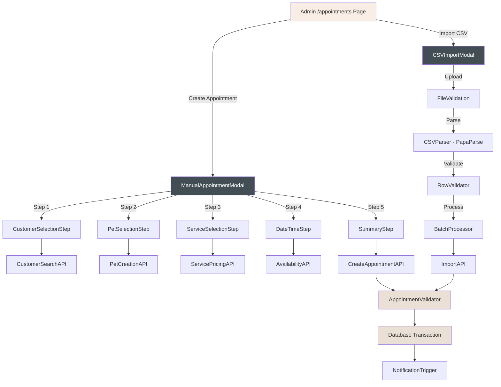
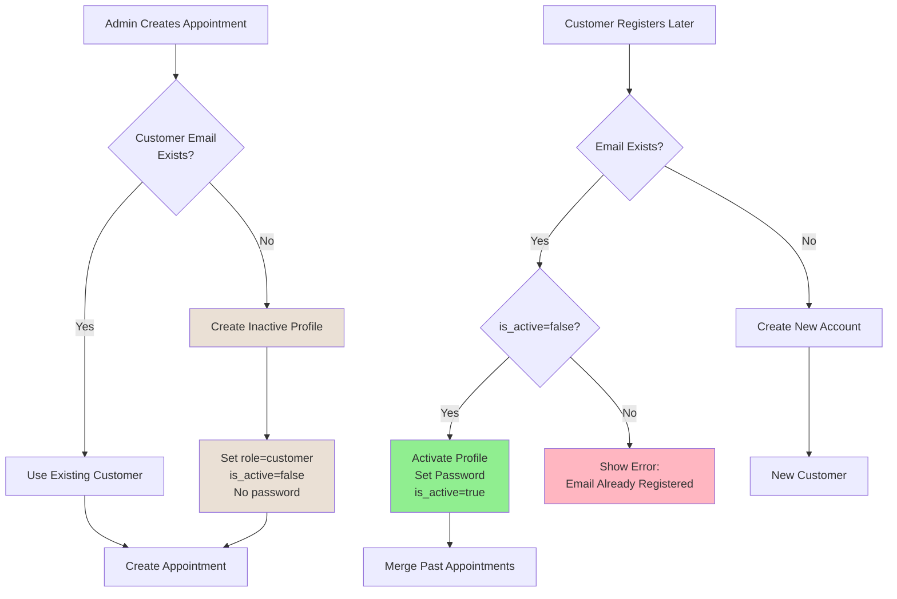

# Admin Appointment Management - Design Document

## Executive Summary

This design document specifies the implementation of two complementary admin features that expand appointment management capabilities: Manual Appointment Creation and CSV Import. These features address critical business needs for appointments created outside the customer booking flow (phone bookings, walk-ins, emergency slots) and enable efficient bulk data migration from legacy systems.

The Manual Appointment Creation feature provides a comprehensive multi-step form that mirrors the customer booking experience while offering additional administrative controls. The CSV Import feature enables scalable batch operations with robust validation, duplicate detection, and detailed error reporting.

### Key Architectural Decisions

1. **Shared Validation Layer**: Both manual and CSV import use identical validation logic to ensure data consistency
2. **Transaction-Based Processing**: CSV imports use database transactions with rollback capability for data integrity
3. **Progressive Enhancement**: Multi-step form provides immediate feedback and validation at each stage
4. **Security-First CSV Handling**: File scanning, input sanitization, and size limits protect against malicious uploads
5. **Audit Trail**: Creation metadata tracks source (manual vs. CSV) and admin user for accountability

### Implementation Timeline

- **Week 1**: Core validation utilities, manual appointment form (steps 1-3)
- **Week 2**: Manual appointment form completion, CSV validation engine
- **Week 3**: CSV import processing, duplicate detection, transaction handling
- **Week 4**: Import UI, error reporting, notification integration, testing

---

## 1. Architecture Overview

### 1.1 System Architecture



### 1.2 Component Responsibilities

| Component | Responsibility |
|-----------|----------------|
| **ManualAppointmentModal** | Multi-step wizard orchestrator, state management, step navigation |
| **CSVImportModal** | File upload, preview display, progress tracking, result summary |
| **AppointmentValidator** | Unified validation logic for both manual and CSV creation |
| **CustomerMatcher** | Finds existing customers by email or creates new ones |
| **PetMatcher** | Finds existing pets by name/customer or creates new ones |
| **PricingCalculator** | Determines service and addon prices based on pet size |
| **AvailabilityChecker** | Validates time slots against business hours and existing bookings |
| **CSVParser** | Parses CSV files using PapaParse with error handling |
| **DuplicateDetector** | Identifies potential duplicate appointments before import |
| **BatchProcessor** | Processes CSV rows in transactions with retry logic |

### 1.3 Data Flow Patterns

#### Manual Appointment Creation
```
User Input → Step Validation → State Update → API Call → Database Write → Notification → UI Refresh
```

#### CSV Import Flow
```
File Upload → File Validation → Parse CSV → Row Validation → Preview → User Confirmation →
Batch Processing → Transaction Commit → Notification (Optional) → Summary Report
```

#### Validation Flow
```
Input Data → Field Validation → Business Rule Validation → Database Constraint Check →
Success/Error Response
```

### 1.4 Customer Account Activation Flow

When admins create appointments (manually or via CSV import) for customers who don't yet have accounts, the system creates **inactive customer profiles** that can later be **claimed and activated** when the customer registers on the website.

#### Email-Based Customer Matching Strategy



#### Database States

**Inactive Customer Profile (Created by Admin)**
```typescript
{
  id: "uuid",
  email: "customer@example.com",
  first_name: "John",
  last_name: "Smith",
  phone: "(555) 123-4567",
  role: "customer",
  is_active: false,  // ← Not activated yet
  password_hash: null,  // ← No password set
  created_at: "2025-01-15T10:00:00Z",
  created_by_admin: true  // ← Flag for admin-created
}
```

**Activated Customer Profile (After Self-Registration)**
```typescript
{
  id: "uuid",  // ← Same UUID
  email: "customer@example.com",
  first_name: "John",
  last_name: "Smith",
  phone: "(555) 123-4567",
  role: "customer",
  is_active: true,  // ← Now activated
  password_hash: "$2a$10$...",  // ← Password set
  created_at: "2025-01-15T10:00:00Z",
  activated_at: "2025-01-20T14:30:00Z"  // ← Activation timestamp
}
```

#### Implementation Logic

**Customer Matching (Admin Create Appointment)**
```typescript
// 1. Search for existing customer by email (case-insensitive)
const { data: existingCustomer } = await supabase
  .from('users')
  .select('id')
  .ilike('email', customerEmail)
  .eq('role', 'customer')
  .maybeSingle();

if (existingCustomer) {
  // Use existing customer (active or inactive)
  customerId = existingCustomer.id;
} else {
  // Create new inactive profile
  const { data: newCustomer } = await supabase
    .from('users')
    .insert({
      email: customerEmail,
      first_name: firstName,
      last_name: lastName,
      phone: phone,
      role: 'customer',
      is_active: false,  // Inactive until customer registers
      password_hash: null,
      created_by_admin: true
    })
    .select()
    .single();

  customerId = newCustomer.id;
}
```

**Customer Registration (Self-Service)**
```typescript
// When customer tries to register
const { data: existingUser } = await supabase
  .from('users')
  .select('id, is_active, created_by_admin')
  .ilike('email', email)
  .eq('role', 'customer')
  .maybeSingle();

if (existingUser) {
  if (existingUser.is_active) {
    // Already activated - show error
    throw new Error('An account with this email already exists. Please sign in.');
  } else if (existingUser.created_by_admin) {
    // Inactive admin-created profile - activate it!
    await supabase
      .from('users')
      .update({
        is_active: true,
        password_hash: hashedPassword,
        activated_at: new Date().toISOString()
      })
      .eq('id', existingUser.id);

    // Customer now has access to past appointments created by admin
    return { message: 'Account activated! You can now access your appointment history.' };
  }
} else {
  // No existing user - create new account
  await supabase.from('users').insert({
    email,
    first_name: firstName,
    last_name: lastName,
    role: 'customer',
    is_active: true,
    password_hash: hashedPassword,
    created_by_admin: false
  });
}
```

#### Benefits of This Approach

1. **Seamless Experience**: Customers who had appointments booked by phone/admin can later claim their profile and see appointment history
2. **Data Integrity**: Email is the unique identifier - no duplicate customer profiles
3. **Security**: Admin-created profiles have no password until customer activates them
4. **Traceability**: `created_by_admin` flag tracks the origin of the customer profile
5. **Flexibility**: Works for both manual appointment creation and CSV imports

#### Edge Cases Handled

- **Customer has multiple appointments before registering**: All appointments linked to same customer_id, visible after activation
- **Admin updates customer info**: Updates apply to inactive profile, customer sees updated info on activation
- **Customer never registers**: Profile remains inactive, doesn't impact admin operations
- **Duplicate emails in CSV**: Email matching prevents duplicates, uses same customer profile

---

## 2. Database Schema & Data Models

### 2.1 Schema Modifications

#### Appointments Table Enhancement

Add metadata fields to track creation source and admin user.

```sql
-- Add new columns to appointments table
ALTER TABLE public.appointments
  ADD COLUMN IF NOT EXISTS creation_method TEXT DEFAULT 'customer_booking'
    CHECK (creation_method IN ('customer_booking', 'manual_admin', 'csv_import')),
  ADD COLUMN IF NOT EXISTS created_by_admin_id UUID REFERENCES public.users(id);

-- Create index for filtering by creation method
CREATE INDEX IF NOT EXISTS idx_appointments_creation_method
  ON public.appointments(creation_method);

-- Create index for admin user lookup
CREATE INDEX IF NOT EXISTS idx_appointments_created_by_admin
  ON public.appointments(created_by_admin_id)
  WHERE created_by_admin_id IS NOT NULL;

COMMENT ON COLUMN public.appointments.creation_method IS 'Source of appointment creation';
COMMENT ON COLUMN public.appointments.created_by_admin_id IS 'Admin user who created the appointment (if manual or CSV)';
```

#### Users Table Enhancement (Account Activation)

Add fields to support the inactive profile → active account flow for admin-created customers.

```sql
-- Add account activation tracking fields to users table
ALTER TABLE public.users
  ADD COLUMN IF NOT EXISTS is_active BOOLEAN DEFAULT true,
  ADD COLUMN IF NOT EXISTS created_by_admin BOOLEAN DEFAULT false,
  ADD COLUMN IF NOT EXISTS activated_at TIMESTAMP WITH TIME ZONE;

-- Create index for finding inactive profiles
CREATE INDEX IF NOT EXISTS idx_users_inactive_customers
  ON public.users(email, role)
  WHERE is_active = false AND role = 'customer';

COMMENT ON COLUMN public.users.is_active IS 'Whether the account is activated (has password set)';
COMMENT ON COLUMN public.users.created_by_admin IS 'Whether this customer profile was created by admin (vs self-registration)';
COMMENT ON COLUMN public.users.activated_at IS 'Timestamp when customer activated their account';

-- Constraint: Active accounts must have password
ALTER TABLE public.users
  ADD CONSTRAINT chk_active_has_password
  CHECK (is_active = false OR password_hash IS NOT NULL);
```

**Migration Note**: Existing users should have `is_active = true` and `created_by_admin = false` set by default in the migration.

### 2.2 TypeScript Data Models

#### Manual Appointment Creation Types

```typescript
// src/types/admin-appointments.ts

export interface ManualAppointmentState {
  currentStep: number;
  customer: SelectedCustomer | null;
  pet: SelectedPet | null;
  service: SelectedService | null;
  addons: SelectedAddon[];
  dateTime: SelectedDateTime | null;
  notes: string;
  paymentStatus: PaymentStatus;
  paymentMethod?: PaymentMethod;
  amountPaid?: number;
}

export interface SelectedCustomer {
  id?: string; // Undefined if new customer
  email: string;
  phone: string;
  first_name: string;
  last_name: string;
  isNew: boolean;
}

export interface SelectedPet {
  id?: string; // Undefined if new pet
  name: string;
  breed_id?: string;
  breed_custom?: string;
  size: PetSize;
  weight?: number;
  isNew: boolean;
}

export interface SelectedService {
  id: string;
  name: string;
  price: number;
  duration_minutes: number;
}

export interface SelectedAddon {
  id: string;
  name: string;
  price: number;
}

export interface SelectedDateTime {
  date: string; // ISO 8601 date
  time: string; // HH:MM format
  scheduled_at: string; // ISO 8601 timestamp
}

export type PaymentStatus = 'pending' | 'paid' | 'partially_paid';
export type PaymentMethod = 'cash' | 'card' | 'other';

export interface CreateAppointmentPayload {
  customer: SelectedCustomer;
  pet: SelectedPet;
  service_id: string;
  addon_ids: string[];
  scheduled_at: string;
  duration_minutes: number;
  total_price: number;
  notes?: string;
  payment_status: PaymentStatus;
  payment_method?: PaymentMethod;
  amount_paid?: number;
  creation_method: 'manual_admin';
  created_by_admin_id: string;
}
```

#### CSV Import Types

```typescript
export interface CSVRow {
  // Required fields
  customer_email: string;
  customer_name: string;
  customer_phone: string;
  pet_name: string;
  pet_breed: string;
  pet_size: string;
  pet_weight: string;
  service_name: string;
  appointment_date: string;
  appointment_time: string;

  // Optional fields
  addons?: string; // Comma-separated
  notes?: string;
  payment_status?: string;
  payment_method?: string;
  amount_paid?: string;
}

export interface ParsedCSVRow extends CSVRow {
  rowNumber: number; // 1-indexed
  originalData: CSVRow;
}

export interface ValidatedCSVRow {
  rowNumber: number;
  isValid: boolean;
  errors: ValidationError[];
  warnings: ValidationWarning[];
  data: {
    customer: SelectedCustomer;
    pet: SelectedPet;
    service_id: string;
    addon_ids: string[];
    scheduled_at: string;
    duration_minutes: number;
    total_price: number;
    notes?: string;
    payment_status: PaymentStatus;
    payment_method?: PaymentMethod;
    amount_paid?: number;
  };
}

export interface ValidationError {
  field: string;
  message: string;
  code: string;
}

export interface ValidationWarning {
  field: string;
  message: string;
  code: string;
}

export interface DuplicateMatch {
  rowNumber: number;
  existingAppointmentId: string;
  matchedOn: {
    customer_email: string;
    pet_name: string;
    appointment_date: string;
    appointment_time: string;
  };
}

export interface CSVImportResult {
  totalRows: number;
  validRows: number;
  invalidRows: number;
  duplicatesFound: number;
  duplicateStrategy?: 'skip' | 'overwrite';
  processedRows: number;
  successfulImports: number;
  failedImports: number;
  errors: Array<{
    rowNumber: number;
    errors: ValidationError[];
  }>;
  duplicates: DuplicateMatch[];
  notificationsSent?: number;
  notificationsFailed?: number;
}

export interface CSVTemplateColumn {
  name: string;
  required: boolean;
  description: string;
  example: string;
  validValues?: string[];
}
```

---

## 3. UI/UX Design

### 3.1 Manual Appointment Form

#### Component Structure

```typescript
// src/components/admin/appointments/ManualAppointmentModal.tsx

interface ManualAppointmentModalProps {
  isOpen: boolean;
  onClose: () => void;
  onSuccess: () => void;
}

// Multi-step wizard with 5 steps
const STEPS = [
  { id: 1, name: 'Customer', component: CustomerSelectionStep },
  { id: 2, name: 'Pet', component: PetSelectionStep },
  { id: 3, name: 'Service', component: ServiceSelectionStep },
  { id: 4, name: 'Date & Time', component: DateTimeStep },
  { id: 5, name: 'Summary', component: SummaryStep },
];
```

#### Step 1: Customer Selection

**Layout:**
```
┌─────────────────────────────────────────────────┐
│  Select Customer                          [1/5] │
├─────────────────────────────────────────────────┤
│                                                 │
│  Search Customer                                │
│  ┌────────────────────────────────────────┐    │
│  │ 🔍 Search by name, email, or phone...  │    │
│  └────────────────────────────────────────┘    │
│                                                 │
│  Results:                                       │
│  ┌────────────────────────────────────────┐    │
│  │ ○ Sarah Johnson                        │    │
│  │   sarah@example.com • (657) 555-0123   │    │
│  ├────────────────────────────────────────┤    │
│  │ ○ John Smith                           │    │
│  │   john@example.com • (714) 555-0456    │    │
│  └────────────────────────────────────────┘    │
│                                                 │
│  Or create new customer:                       │
│  [+ Create New Customer]                       │
│                                                 │
│  If new customer selected:                     │
│  ┌────────────────────────────────────────┐    │
│  │ First Name: [________________]         │    │
│  │ Last Name:  [________________]         │    │
│  │ Email:      [________________]         │    │
│  │ Phone:      [________________]         │    │
│  └────────────────────────────────────────┘    │
│                                                 │
│              [Cancel]    [Next: Select Pet →]  │
└─────────────────────────────────────────────────┘
```

**Features:**
- Real-time search with debouncing (300ms)
- Radio button selection for existing customers
- Expandable "Create New Customer" form
- Email format validation (RFC 5322)
- Phone format validation (US format: (XXX) XXX-XXXX)
- Duplicate email detection
- Loading states and error messages

#### Step 2: Pet Selection

**Layout:**
```
┌─────────────────────────────────────────────────┐
│  Select Pet for Sarah Johnson            [2/5] │
├─────────────────────────────────────────────────┤
│                                                 │
│  Existing Pets:                                 │
│  ┌────────────────────────────────────────┐    │
│  │ ○ Max                                  │    │
│  │   Golden Retriever • Large • 55 lbs    │    │
│  │   [Service: Premium Grooming - $125]   │    │
│  ├────────────────────────────────────────┤    │
│  │ ○ Bella                                │    │
│  │   Poodle • Medium • 25 lbs             │    │
│  │   [Service: Basic Grooming - $55]      │    │
│  └────────────────────────────────────────┘    │
│                                                 │
│  Or create new pet:                            │
│  [+ Add New Pet]                               │
│                                                 │
│  If new pet selected:                          │
│  ┌────────────────────────────────────────┐    │
│  │ Pet Name:  [________________]          │    │
│  │ Breed:     [▾ Search breeds...]        │    │
│  │ Size:      ○ Small  ○ Medium           │    │
│  │            ● Large  ○ X-Large          │    │
│  │ Weight:    [____] lbs (optional)       │    │
│  │                                        │    │
│  │ ⚠️ Weight 55 lbs matches Large size    │    │
│  └────────────────────────────────────────┘    │
│                                                 │
│         [← Back]    [Cancel]    [Next: Service →] │
└─────────────────────────────────────────────────┘
```

**Features:**
- Display all pets for selected customer
- Radio selection with pet details
- Size-based service price preview
- Expandable "Add New Pet" form
- Breed autocomplete with custom breed option
- Size buttons with weight range hints
- Weight validation against size ranges
- Warning (not error) for weight/size mismatch
- Allow admin override for edge cases

#### Step 3: Service Selection

**Layout:**
```
┌─────────────────────────────────────────────────┐
│  Select Service for Max                  [3/5] │
├─────────────────────────────────────────────────┤
│                                                 │
│  Main Service:                                  │
│  ┌────────────────────────────────────────┐    │
│  │ ● Basic Grooming               $65.00  │    │
│  │   Shampoo, nails, ears, sanitary       │    │
│  ├────────────────────────────────────────┤    │
│  │ ○ Premium Grooming            $125.00  │    │
│  │   Basic + styling                      │    │
│  ├────────────────────────────────────────┤    │
│  │ ○ Day Care                     $40.00  │    │
│  │   Supervised playtime                  │    │
│  └────────────────────────────────────────┘    │
│                                                 │
│  Add-ons:                                      │
│  ☐ Long Hair/Sporting              $10.00      │
│  ☐ Teeth Brushing                  $10.00      │
│  ☑ Pawdicure                       $15.00      │
│  ☐ Flea & Tick Treatment           $25.00      │
│  ☐ Tangle Removal                  $5-30       │
│                                                 │
│  ┌────────────────────────────────────────┐    │
│  │ Running Total:               $85.00    │    │
│  │ Service: $65.00                        │    │
│  │ Add-ons: $15.00                        │    │
│  └────────────────────────────────────────┘    │
│                                                 │
│         [← Back]    [Cancel]    [Next: Date & Time →] │
└─────────────────────────────────────────────────┘
```

**Features:**
- Radio buttons for main service
- Checkboxes for add-ons
- Real-time price calculation
- Price display based on pet size
- Service descriptions
- Disabled state if pricing not configured
- Running total with breakdown

#### Step 4: Date & Time Selection

**Layout:**
```
┌─────────────────────────────────────────────────┐
│  Select Date & Time                      [4/5] │
├─────────────────────────────────────────────────┤
│                                                 │
│  ┌──────────────────┬──────────────────────┐   │
│  │   December 2025  │  Available Times     │   │
│  │  S  M  T  W  T  F│                      │   │
│  │     1  2  3  4  5│  ○ 9:00 AM          │   │
│  │  7  8  9 10 11 12│  ○ 10:00 AM         │   │
│  │ 14 [15]16 17 18 19│  ● 11:00 AM         │   │
│  │ 21 22 23 24 25 26│  ○ 1:00 PM          │   │
│  │ 28 29 30 31      │  ○ 2:00 PM          │   │
│  │                  │  ○ 3:00 PM          │   │
│  │  Closed: Sundays │  Full: 12:00 PM     │   │
│  └──────────────────┴──────────────────────┘   │
│                                                 │
│  Selected: Monday, December 15, 2025 at 11:00 AM│
│                                                 │
│  Notes (optional):                             │
│  ┌────────────────────────────────────────┐    │
│  │ Special instructions for the groomer   │    │
│  │                                        │    │
│  │                             978/1000   │    │
│  └────────────────────────────────────────┘    │
│                                                 │
│  Payment Status:                               │
│  ● Pending   ○ Paid   ○ Partially Paid        │
│                                                 │
│  If Paid selected:                             │
│  Payment Method:  ○ Cash  ○ Card  ○ Other     │
│                                                 │
│  If Partially Paid:                            │
│  Amount Paid: $[_____] (Total: $85.00)        │
│                                                 │
│         [← Back]    [Cancel]    [Next: Review →]   │
└─────────────────────────────────────────────────┘
```

**Features:**
- Calendar picker with disabled Sundays
- Availability checking per time slot
- Visual indication of booked slots
- Warning for past dates with override option
- Notes textarea with character counter
- Payment status selection
- Conditional payment method/amount fields
- Validation for partial payment amount

#### Step 5: Summary & Confirmation

**Layout:**
```
┌─────────────────────────────────────────────────┐
│  Review Appointment                      [5/5] │
├─────────────────────────────────────────────────┤
│                                                 │
│  Customer:                                     │
│  Sarah Johnson                                 │
│  sarah@example.com • (657) 555-0123           │
│                                                 │
│  Pet:                                          │
│  Max (Golden Retriever, Large, 55 lbs)        │
│                                                 │
│  Service:                                      │
│  Basic Grooming                       $65.00  │
│                                                 │
│  Add-ons:                                      │
│  • Pawdicure                          $15.00  │
│                                                 │
│  Date & Time:                                  │
│  Monday, December 15, 2025 at 11:00 AM        │
│  Duration: 60 minutes                          │
│                                                 │
│  Notes:                                        │
│  "Special instructions for the groomer..."     │
│                                                 │
│  Payment:                                      │
│  Status: Pending                               │
│                                                 │
│  ┌────────────────────────────────────────┐    │
│  │ Total:                        $85.00  │    │
│  └────────────────────────────────────────┘    │
│                                                 │
│  ⚠️ This appointment is in the past. Continue? │
│                                                 │
│         [← Back]    [Cancel]    [Create Appointment] │
└─────────────────────────────────────────────────┘
```

**Features:**
- Read-only summary of all selections
- Edit capability via back navigation
- Total price display
- Past date warning (if applicable)
- Loading state on submission
- Success/error toast notifications

### 3.2 CSV Import Interface

#### Upload & Preview Modal

**Layout:**
```
┌─────────────────────────────────────────────────┐
│  Import Appointments from CSV            [✕]   │
├─────────────────────────────────────────────────┤
│                                                 │
│  Step 1: Download Template                     │
│  [📥 Download CSV Template]                    │
│                                                 │
│  Step 2: Upload CSV File                       │
│  ┌────────────────────────────────────────┐    │
│  │      Drag & drop CSV file here         │    │
│  │            or click to browse          │    │
│  │                                        │    │
│  │       📄 Accepted: .csv files          │    │
│  │       Max size: 5 MB • Max rows: 1000  │    │
│  └────────────────────────────────────────┘    │
│                                                 │
│  After file selected:                          │
│  ┌────────────────────────────────────────┐    │
│  │ ✓ appointments.csv (2.3 MB, 245 rows)  │    │
│  │                               [Remove]  │    │
│  └────────────────────────────────────────┘    │
│                                                 │
│  Preview (first 5 rows):                       │
│  ┌────────────────────────────────────────┐    │
│  │ Email          Name    Pet   Service   │    │
│  │ sarah@...      Sarah J. Max   Basic    │    │
│  │ john@...       John S.  Bella Premium  │    │
│  │ ...                                    │    │
│  └────────────────────────────────────────┘    │
│                                                 │
│  Validation Results:                           │
│  ✓ 245 rows parsed                             │
│  ✓ 240 rows valid                              │
│  ✗ 5 rows have errors                          │
│  ⚠️  12 potential duplicates found              │
│                                                 │
│  [View Errors] [View Duplicates]               │
│                                                 │
│              [Cancel]    [Continue Import →]   │
└─────────────────────────────────────────────────┘
```

#### Error & Duplicate Review

**Layout:**
```
┌─────────────────────────────────────────────────┐
│  Import Errors (5)                       [✕]   │
├─────────────────────────────────────────────────┤
│                                                 │
│  Row 12: Invalid email format                  │
│  • customer_email: "invalid-email"             │
│                                                 │
│  Row 25: Weight doesn't match size             │
│  • pet_weight: 45 lbs (size: Small, 0-18 lbs)  │
│  • This is a warning - import will proceed     │
│                                                 │
│  Row 67: Service not found                     │
│  • service_name: "Deluxe Grooming"             │
│                                                 │
│  Row 89: Appointment on Sunday                 │
│  • appointment_date: 2025-12-21 (Sunday)       │
│                                                 │
│  Row 134: Invalid phone number                 │
│  • customer_phone: "123456"                    │
│                                                 │
│  [📥 Download Error Report CSV]                │
│                                                 │
│                         [Close]    [Fix & Retry]│
└─────────────────────────────────────────────────┘

┌─────────────────────────────────────────────────┐
│  Duplicate Appointments (12)             [✕]   │
├─────────────────────────────────────────────────┤
│                                                 │
│  Row 5: Matches existing appointment           │
│  • Customer: sarah@example.com                 │
│  • Pet: Max                                    │
│  • Date: 2025-12-15 at 11:00 AM               │
│                                                 │
│  Row 23: Matches existing appointment          │
│  • Customer: john@example.com                  │
│  • Pet: Bella                                  │
│  • Date: 2025-12-18 at 2:00 PM                │
│                                                 │
│  ... (10 more)                                 │
│                                                 │
│  How to handle duplicates?                     │
│  ○ Skip duplicate rows (import 233 new only)   │
│  ○ Overwrite existing appointments (import 245)│
│  ● Cancel import and review file               │
│                                                 │
│                         [Cancel]    [Continue] │
└─────────────────────────────────────────────────┘
```

#### Processing Progress

**Layout:**
```
┌─────────────────────────────────────────────────┐
│  Importing Appointments...               [✕]   │
├─────────────────────────────────────────────────┤
│                                                 │
│  Progress:                                      │
│  ████████████████████░░░░░░░  82% (200/245)   │
│                                                 │
│  Processing row 200...                         │
│                                                 │
│  • Created: 195 appointments                   │
│  • Skipped: 3 duplicates                       │
│  • Failed: 2 errors                            │
│                                                 │
│  Estimated time remaining: 15 seconds          │
│                                                 │
│  [Cancel Import]                               │
└─────────────────────────────────────────────────┘
```

#### Import Summary

**Layout:**
```
┌─────────────────────────────────────────────────┐
│  Import Complete!                        [✕]   │
├─────────────────────────────────────────────────┤
│                                                 │
│  Summary:                                       │
│  ┌────────────────────────────────────────┐    │
│  │ Total rows:           245              │    │
│  │ Successfully imported: 238              │    │
│  │ Duplicates skipped:   5                │    │
│  │ Failed:               2                │    │
│  │                                        │    │
│  │ Notifications sent:   236              │    │
│  │ Notifications failed: 2                │    │
│  └────────────────────────────────────────┘    │
│                                                 │
│  Failed Rows:                                  │
│  • Row 67: Service "Deluxe Grooming" not found │
│  • Row 134: Invalid phone number format        │
│                                                 │
│  [📥 Download Full Report]                     │
│                                                 │
│                         [Close]    [View Appointments] │
└─────────────────────────────────────────────────┘
```

### 3.3 Mobile Responsiveness

**Considerations:**
- Stack form fields vertically on mobile
- Full-width modals on mobile
- Touch-friendly button sizes (min 44x44px)
- Simplified calendar picker for mobile
- Sticky header with progress indicator
- Bottom action bar for primary CTAs
- File upload optimized for mobile camera/gallery

---

## 4. API Specifications

### 4.1 Manual Appointment APIs

#### POST /api/admin/appointments

Create a single appointment manually.

**Authentication:** Required (Admin role)

**Request Body:**
```typescript
{
  customer: {
    id?: string; // Omit for new customer
    email: string;
    phone: string;
    first_name: string;
    last_name: string;
  };
  pet: {
    id?: string; // Omit for new pet
    name: string;
    breed_id?: string;
    breed_custom?: string;
    size: 'small' | 'medium' | 'large' | 'xlarge';
    weight?: number;
  };
  service_id: string;
  addon_ids: string[];
  scheduled_at: string; // ISO 8601 timestamp
  notes?: string;
  payment_status: 'pending' | 'paid' | 'partially_paid';
  payment_method?: 'cash' | 'card' | 'other';
  amount_paid?: number;
  send_notification?: boolean; // Default: true
}
```

**Response (Success 201):**
```typescript
{
  success: true;
  appointment: {
    id: string;
    customer_id: string;
    pet_id: string;
    service_id: string;
    scheduled_at: string;
    duration_minutes: number;
    status: 'pending';
    total_price: number;
    payment_status: 'pending' | 'paid' | 'partially_paid';
    creation_method: 'manual_admin';
    created_by_admin_id: string;
    created_at: string;
  };
  created_customer?: boolean; // True if customer was created
  created_pet?: boolean; // True if pet was created
  notification_sent?: boolean; // True if notification was sent
}
```

**Response (Error 400):**
```typescript
{
  success: false;
  error: string;
  validation_errors?: Array<{
    field: string;
    message: string;
  }>;
}
```

**Validation Logic:**
```typescript
// Customer validation
- email: Valid RFC 5322 format
- phone: US format (XXX) XXX-XXXX or +1XXXXXXXXXX
- first_name, last_name: 1-100 characters
- Duplicate check: Email must be unique if creating new customer

// Pet validation
- name: 1-100 characters
- size: Must be one of allowed values
- weight: If provided, must match size range (warning only)
- Duplicate check: Pet name must be unique per customer

// Service validation
- service_id: Must exist in services table
- Price lookup: Must have price for service + pet size

// Date/Time validation
- scheduled_at: Must be valid ISO 8601 timestamp
- Business hours: Mon-Sat 9am-5pm (configurable)
- Not Sunday: Return error if Sunday
- Past date: Return warning, allow override
- Time slot: Check availability, return error if fully booked

// Payment validation
- payment_status: Must be one of allowed values
- If 'paid': payment_method required
- If 'partially_paid': amount_paid required and 0 < amount_paid < total_price

// Notes validation
- Max 1000 characters
```

#### GET /api/admin/customers/search

Search for customers by name, email, or phone.

**Authentication:** Required (Admin role)

**Query Parameters:**
- `q`: Search query string (min 2 characters)

**Response (200):**
```typescript
{
  customers: Array<{
    id: string;
    email: string;
    phone: string | null;
    first_name: string;
    last_name: string;
    pets: Array<{
      id: string;
      name: string;
      breed_id: string | null;
      breed_custom: string | null;
      size: PetSize;
      weight: number | null;
    }>;
  }>;
}
```

#### GET /api/admin/services/prices

Get all services with prices for all sizes.

**Authentication:** Required (Admin role)

**Response (200):**
```typescript
{
  services: Array<{
    id: string;
    name: string;
    description: string | null;
    duration_minutes: number;
    prices: Array<{
      size: PetSize;
      price: number;
    }>;
  }>;
  addons: Array<{
    id: string;
    name: string;
    description: string | null;
    price: number;
  }>;
}
```

#### GET /api/admin/appointments/availability

Check time slot availability for a specific date.

**Authentication:** Required (Admin role)

**Query Parameters:**
- `date`: ISO 8601 date (YYYY-MM-DD)
- `duration_minutes`: Appointment duration

**Response (200):**
```typescript
{
  date: string;
  business_hours: {
    start: string; // HH:MM
    end: string;   // HH:MM
  };
  is_closed: boolean; // True if Sunday or holiday
  time_slots: Array<{
    time: string; // HH:MM
    available: boolean;
    existing_appointments: number;
  }>;
}
```

### 4.2 CSV Import APIs

#### POST /api/admin/appointments/import

Import appointments from CSV file.

**Authentication:** Required (Admin role)

**Request Body (multipart/form-data):**
```typescript
{
  file: File; // CSV file
  duplicate_strategy: 'skip' | 'overwrite' | 'fail'; // Default: 'skip'
  send_notifications: boolean; // Default: false
}
```

**Response (Success 200):**
```typescript
{
  success: true;
  result: {
    total_rows: number;
    valid_rows: number;
    invalid_rows: number;
    duplicates_found: number;
    duplicate_strategy: 'skip' | 'overwrite';
    processed_rows: number;
    successful_imports: number;
    failed_imports: number;
    notifications_sent?: number;
    notifications_failed?: number;
  };
  errors: Array<{
    row_number: number;
    errors: Array<{
      field: string;
      message: string;
      code: string;
    }>;
  }>;
  duplicates: Array<{
    row_number: number;
    existing_appointment_id: string;
    matched_on: {
      customer_email: string;
      pet_name: string;
      appointment_date: string;
      appointment_time: string;
    };
  }>;
}
```

**Response (Error 400):**
```typescript
{
  success: false;
  error: string;
  details?: {
    invalid_file: string;
    missing_columns: string[];
    file_too_large: boolean;
    too_many_rows: boolean;
  };
}
```

**File Validation:**
```typescript
// File format
- Extension: Must be .csv
- Size: Max 5 MB
- Encoding: UTF-8
- Row limit: Max 1000 rows

// Security
- Virus scan (if available)
- Formula injection prevention (strip =, @, +, - at start of cells)
- XSS prevention (HTML entity encoding)
- SQL injection prevention (parameterized queries)

// Required columns
- customer_email
- customer_name
- customer_phone
- pet_name
- pet_breed
- pet_size
- pet_weight
- service_name
- appointment_date
- appointment_time

// Optional columns
- addons (comma-separated)
- notes
- payment_status
- payment_method
- amount_paid
```

**Row Validation:**
```typescript
// Same as manual appointment validation plus:
- customer_name: Split into first_name and last_name
- pet_breed: Match to breeds table or store as breed_custom
- pet_size: Case-insensitive matching (Small, Medium, Large, X-Large)
- service_name: Case-insensitive matching to services table
- appointment_date: Accept YYYY-MM-DD or MM/DD/YYYY formats
- appointment_time: Accept HH:MM AM/PM or HH:MM 24-hour formats
- addons: Split by comma, match each to addons table
- payment_status: Case-insensitive matching
```

**Duplicate Detection:**
```typescript
// Match criteria (all must match)
- customer_email (case-insensitive)
- pet_name (case-insensitive)
- appointment_date (same day)
- appointment_time (same hour)

// Strategies
- skip: Don't import duplicate rows
- overwrite: Update existing appointment with CSV data
- fail: Abort entire import if duplicates found
```

#### GET /api/admin/appointments/import/template

Download CSV template file.

**Authentication:** Required (Admin role)

**Response (200):**
```
Content-Type: text/csv
Content-Disposition: attachment; filename="appointment_import_template.csv"

customer_email,customer_name,customer_phone,pet_name,pet_breed,pet_size,pet_weight,service_name,appointment_date,appointment_time,addons,notes,payment_status,payment_method,amount_paid
sarah@example.com,Sarah Johnson,(657) 555-0123,Max,Golden Retriever,Large,55,Basic Grooming,2025-12-15,11:00 AM,Pawdicure,Special instructions,Pending,,
john@example.com,John Smith,(714) 555-0456,Bella,Poodle,Medium,25,Premium Grooming,2025-12-18,2:00 PM,"Teeth Brushing,Pawdicure",,Paid,Card,
```

#### POST /api/admin/appointments/import/validate

Validate CSV file without importing (preview).

**Authentication:** Required (Admin role)

**Request Body (multipart/form-data):**
```typescript
{
  file: File; // CSV file
}
```

**Response (200):**
```typescript
{
  success: true;
  file_info: {
    name: string;
    size: number;
    row_count: number;
  };
  preview: Array<CSVRow>; // First 5 rows
  validation: {
    valid_rows: number;
    invalid_rows: number;
    warnings: number;
  };
  errors: Array<{
    row_number: number;
    errors: ValidationError[];
  }>;
  warnings: Array<{
    row_number: number;
    warnings: ValidationWarning[];
  }>;
  duplicates: DuplicateMatch[];
}
```

---

## 5. Implementation Details

### 5.1 Technology Stack

**CSV Parsing:**
- Library: `papaparse` (via `react-papaparse` for React integration)
- Installation: `npm install papaparse @types/papaparse`
- Features: Streaming support, error handling, type inference

**Form Management:**
- Library: `react-hook-form` with `zod` validation (already in project)
- State management: Local component state with Zustand for complex flows

**File Upload:**
- Native HTML5 file input with drag-and-drop
- Client-side validation before server upload
- Progress tracking with streaming

**Date/Time Picker:**
- Library: `react-datepicker` or native HTML5 inputs
- Time slot generation based on business hours
- Availability checking via API

### 5.2 Validation Utilities

```typescript
// src/lib/appointments/validation.ts

import { z } from 'zod';

export const CustomerSchema = z.object({
  id: z.string().uuid().optional(),
  email: z.string().email('Invalid email format'),
  phone: z.string().regex(/^\+?1?\s?\(?\d{3}\)?[\s.-]?\d{3}[\s.-]?\d{4}$/, 'Invalid phone format'),
  first_name: z.string().min(1, 'First name required').max(100),
  last_name: z.string().min(1, 'Last name required').max(100),
});

export const PetSchema = z.object({
  id: z.string().uuid().optional(),
  name: z.string().min(1, 'Pet name required').max(100),
  breed_id: z.string().uuid().optional(),
  breed_custom: z.string().max(100).optional(),
  size: z.enum(['small', 'medium', 'large', 'xlarge']),
  weight: z.number().min(0).max(300).optional(),
});

export const AppointmentSchema = z.object({
  service_id: z.string().uuid(),
  addon_ids: z.array(z.string().uuid()),
  scheduled_at: z.string().datetime(),
  notes: z.string().max(1000).optional(),
  payment_status: z.enum(['pending', 'paid', 'partially_paid']),
  payment_method: z.enum(['cash', 'card', 'other']).optional(),
  amount_paid: z.number().min(0).optional(),
}).refine(
  (data) => {
    if (data.payment_status === 'paid' && !data.payment_method) {
      return false;
    }
    if (data.payment_status === 'partially_paid' && !data.amount_paid) {
      return false;
    }
    return true;
  },
  {
    message: 'Payment method required for paid status, amount required for partially paid',
  }
);

export function validateWeightForSize(weight: number, size: PetSize): ValidationResult {
  const ranges = {
    small: { min: 0, max: 18 },
    medium: { min: 19, max: 35 },
    large: { min: 36, max: 65 },
    xlarge: { min: 66, max: 300 },
  };

  const range = ranges[size];
  const isValid = weight >= range.min && weight <= range.max;

  return {
    isValid,
    isWarning: !isValid, // Weight mismatch is a warning, not an error
    message: isValid
      ? ''
      : `Weight ${weight} lbs does not match ${size} size range (${range.min}-${range.max} lbs)`,
  };
}

export async function validateTimeSlot(
  scheduledAt: string,
  durationMinutes: number,
  supabase: SupabaseClient
): Promise<ValidationResult> {
  const date = new Date(scheduledAt);

  // Check if Sunday
  if (date.getDay() === 0) {
    return {
      isValid: false,
      message: 'The business is closed on Sundays',
    };
  }

  // Check business hours (9am-5pm)
  const hour = date.getHours();
  if (hour < 9 || hour >= 17) {
    return {
      isValid: false,
      message: 'Appointment time must be between 9:00 AM and 5:00 PM',
    };
  }

  // Check if past date
  if (date < new Date()) {
    return {
      isValid: true, // Allow with override
      isWarning: true,
      message: 'This appointment date is in the past',
    };
  }

  // Check availability
  const endTime = new Date(date.getTime() + durationMinutes * 60000);
  const { data: overlapping } = await supabase
    .from('appointments')
    .select('id')
    .gte('scheduled_at', scheduledAt)
    .lt('scheduled_at', endTime.toISOString())
    .in('status', ['pending', 'confirmed', 'checked_in', 'in_progress']);

  // Allow multiple appointments in same time slot (configurable limit)
  const maxConcurrent = 3;
  if (overlapping && overlapping.length >= maxConcurrent) {
    return {
      isValid: false,
      message: 'This time slot is fully booked',
    };
  }

  return { isValid: true };
}
```

### 5.3 CSV Processing Service

```typescript
// src/lib/appointments/csv-processor.ts

import Papa from 'papaparse';
import type { ParseResult } from 'papaparse';

export class CSVProcessor {
  private readonly MAX_FILE_SIZE = 5 * 1024 * 1024; // 5 MB
  private readonly MAX_ROWS = 1000;
  private readonly REQUIRED_COLUMNS = [
    'customer_email',
    'customer_name',
    'customer_phone',
    'pet_name',
    'pet_breed',
    'pet_size',
    'pet_weight',
    'service_name',
    'appointment_date',
    'appointment_time',
  ];

  async parseFile(file: File): Promise<ParseResult<CSVRow>> {
    // Validate file
    this.validateFile(file);

    return new Promise((resolve, reject) => {
      Papa.parse<CSVRow>(file, {
        header: true,
        skipEmptyLines: true,
        transformHeader: (header) => header.trim().toLowerCase().replace(/\s+/g, '_'),
        transform: (value) => this.sanitizeValue(value),
        complete: (results) => {
          // Validate row count
          if (results.data.length > this.MAX_ROWS) {
            reject(new Error(`CSV files must contain ${this.MAX_ROWS} rows or fewer`));
            return;
          }

          // Validate required columns
          const missingColumns = this.validateColumns(results.meta.fields || []);
          if (missingColumns.length > 0) {
            reject(
              new Error(`CSV is missing required columns: ${missingColumns.join(', ')}`)
            );
            return;
          }

          resolve(results);
        },
        error: (error) => {
          reject(new Error(`CSV parsing failed: ${error.message}`));
        },
      });
    });
  }

  private validateFile(file: File): void {
    // Check file extension
    if (!file.name.endsWith('.csv')) {
      throw new Error('Please upload a CSV file');
    }

    // Check file size
    if (file.size > this.MAX_FILE_SIZE) {
      throw new Error('File size must be less than 5MB');
    }

    // Check file type
    if (file.type && !file.type.includes('csv') && !file.type.includes('text')) {
      throw new Error('Invalid file type');
    }
  }

  private validateColumns(headers: string[]): string[] {
    const normalizedHeaders = headers.map((h) =>
      h.trim().toLowerCase().replace(/\s+/g, '_')
    );
    return this.REQUIRED_COLUMNS.filter((col) => !normalizedHeaders.includes(col));
  }

  private sanitizeValue(value: string): string {
    // Prevent CSV injection
    if (value && typeof value === 'string') {
      const trimmed = value.trim();
      // Remove leading special characters used in formula injection
      if (/^[=@+\-]/.test(trimmed)) {
        return trimmed.substring(1);
      }
      return trimmed;
    }
    return value;
  }

  async validateRows(
    rows: CSVRow[],
    supabase: SupabaseClient
  ): Promise<ValidatedCSVRow[]> {
    const validated: ValidatedCSVRow[] = [];

    for (let i = 0; i < rows.length; i++) {
      const row = rows[i];
      const rowNumber = i + 2; // Account for header row + 1-indexed

      const result = await this.validateRow(row, rowNumber, supabase);
      validated.push(result);
    }

    return validated;
  }

  private async validateRow(
    row: CSVRow,
    rowNumber: number,
    supabase: SupabaseClient
  ): Promise<ValidatedCSVRow> {
    const errors: ValidationError[] = [];
    const warnings: ValidationWarning[] = [];

    try {
      // Parse customer name
      const [first_name, ...lastNameParts] = row.customer_name.trim().split(' ');
      const last_name = lastNameParts.join(' ') || first_name;

      // Validate customer
      const customerResult = CustomerSchema.safeParse({
        email: row.customer_email,
        phone: row.customer_phone,
        first_name,
        last_name,
      });

      if (!customerResult.success) {
        customerResult.error.errors.forEach((err) => {
          errors.push({
            field: err.path.join('.'),
            message: err.message,
            code: 'VALIDATION_ERROR',
          });
        });
      }

      // Validate pet size
      const size = this.normalizePetSize(row.pet_size);
      if (!size) {
        errors.push({
          field: 'pet_size',
          message: 'Invalid pet size. Must be Small, Medium, Large, or X-Large',
          code: 'INVALID_SIZE',
        });
      }

      // Validate weight vs size
      const weight = parseFloat(row.pet_weight);
      if (!isNaN(weight) && size) {
        const weightValidation = validateWeightForSize(weight, size);
        if (!weightValidation.isValid) {
          warnings.push({
            field: 'pet_weight',
            message: weightValidation.message,
            code: 'WEIGHT_MISMATCH',
          });
        }
      }

      // Validate service exists
      const { data: service } = await supabase
        .from('services')
        .select('id, name, duration_minutes')
        .ilike('name', row.service_name)
        .single();

      if (!service) {
        errors.push({
          field: 'service_name',
          message: `Service "${row.service_name}" not found`,
          code: 'SERVICE_NOT_FOUND',
        });
      }

      // Validate date and time
      const scheduledAt = this.parseDateTime(row.appointment_date, row.appointment_time);
      if (!scheduledAt) {
        errors.push({
          field: 'appointment_date/appointment_time',
          message: 'Invalid date or time format',
          code: 'INVALID_DATETIME',
        });
      } else {
        const timeValidation = await validateTimeSlot(
          scheduledAt,
          service?.duration_minutes || 60,
          supabase
        );
        if (!timeValidation.isValid) {
          if (timeValidation.isWarning) {
            warnings.push({
              field: 'scheduled_at',
              message: timeValidation.message,
              code: 'PAST_DATE',
            });
          } else {
            errors.push({
              field: 'scheduled_at',
              message: timeValidation.message,
              code: 'INVALID_TIMESLOT',
            });
          }
        }
      }

      // Validate addons if provided
      const addon_ids: string[] = [];
      if (row.addons) {
        const addonNames = row.addons.split(',').map((a) => a.trim());
        for (const addonName of addonNames) {
          const { data: addon } = await supabase
            .from('addons')
            .select('id')
            .ilike('name', addonName)
            .single();

          if (addon) {
            addon_ids.push(addon.id);
          } else {
            errors.push({
              field: 'addons',
              message: `Addon "${addonName}" not found`,
              code: 'ADDON_NOT_FOUND',
            });
          }
        }
      }

      // Calculate pricing
      const { data: servicePrice } = await supabase
        .from('service_prices')
        .select('price')
        .eq('service_id', service?.id)
        .eq('size', size)
        .single();

      if (!servicePrice) {
        errors.push({
          field: 'service_name',
          message: `Pricing not configured for ${row.service_name} - ${size}`,
          code: 'PRICING_NOT_FOUND',
        });
      }

      const total_price = (servicePrice?.price || 0) + addon_ids.length * 10; // Simplified

      return {
        rowNumber,
        isValid: errors.length === 0,
        errors,
        warnings,
        data: {
          customer: {
            email: row.customer_email,
            phone: row.customer_phone,
            first_name,
            last_name,
            isNew: false, // Will be determined during processing
          },
          pet: {
            name: row.pet_name,
            breed_custom: row.pet_breed,
            size: size!,
            weight: !isNaN(weight) ? weight : undefined,
            isNew: false,
          },
          service_id: service?.id || '',
          addon_ids,
          scheduled_at: scheduledAt || '',
          duration_minutes: service?.duration_minutes || 60,
          total_price,
          notes: row.notes || undefined,
          payment_status: this.normalizePaymentStatus(row.payment_status),
          payment_method: this.normalizePaymentMethod(row.payment_method),
          amount_paid: row.amount_paid ? parseFloat(row.amount_paid) : undefined,
        },
      };
    } catch (error) {
      errors.push({
        field: 'row',
        message: error instanceof Error ? error.message : 'Unknown error',
        code: 'PROCESSING_ERROR',
      });

      return {
        rowNumber,
        isValid: false,
        errors,
        warnings,
        data: {} as any,
      };
    }
  }

  private normalizePetSize(size: string): PetSize | null {
    const normalized = size.toLowerCase().replace(/\s+/g, '');
    const mapping: Record<string, PetSize> = {
      small: 'small',
      medium: 'medium',
      large: 'large',
      xlarge: 'xlarge',
      'x-large': 'xlarge',
    };
    return mapping[normalized] || null;
  }

  private normalizePaymentStatus(status?: string): PaymentStatus {
    if (!status) return 'pending';
    const normalized = status.toLowerCase().replace(/\s+/g, '');
    const mapping: Record<string, PaymentStatus> = {
      pending: 'pending',
      paid: 'paid',
      partiallypaid: 'partially_paid',
    };
    return mapping[normalized] || 'pending';
  }

  private normalizePaymentMethod(method?: string): PaymentMethod | undefined {
    if (!method) return undefined;
    const normalized = method.toLowerCase();
    if (normalized.includes('cash')) return 'cash';
    if (normalized.includes('card')) return 'card';
    return 'other';
  }

  private parseDateTime(dateStr: string, timeStr: string): string | null {
    try {
      // Parse date (YYYY-MM-DD or MM/DD/YYYY)
      let date: Date;
      if (dateStr.includes('-')) {
        date = new Date(dateStr);
      } else {
        const [month, day, year] = dateStr.split('/');
        date = new Date(`${year}-${month.padStart(2, '0')}-${day.padStart(2, '0')}`);
      }

      // Parse time (HH:MM AM/PM or HH:MM 24-hour)
      let hours: number;
      let minutes: number;

      if (timeStr.includes('AM') || timeStr.includes('PM')) {
        const [time, period] = timeStr.split(' ');
        const [h, m] = time.split(':');
        hours = parseInt(h);
        minutes = parseInt(m);

        if (period === 'PM' && hours !== 12) {
          hours += 12;
        } else if (period === 'AM' && hours === 12) {
          hours = 0;
        }
      } else {
        const [h, m] = timeStr.split(':');
        hours = parseInt(h);
        minutes = parseInt(m);
      }

      date.setHours(hours, minutes, 0, 0);

      return date.toISOString();
    } catch {
      return null;
    }
  }

  async detectDuplicates(
    validatedRows: ValidatedCSVRow[],
    supabase: SupabaseClient
  ): Promise<DuplicateMatch[]> {
    const duplicates: DuplicateMatch[] = [];

    for (const row of validatedRows) {
      if (!row.isValid) continue;

      const date = new Date(row.data.scheduled_at);
      const startOfDay = new Date(date);
      startOfDay.setHours(0, 0, 0, 0);
      const endOfDay = new Date(date);
      endOfDay.setHours(23, 59, 59, 999);

      const { data: existing } = await supabase
        .from('appointments')
        .select(
          `
          id,
          customer:customer_id(email),
          pet:pet_id(name),
          scheduled_at
        `
        )
        .gte('scheduled_at', startOfDay.toISOString())
        .lte('scheduled_at', endOfDay.toISOString());

      if (existing) {
        for (const appt of existing) {
          const apptTime = new Date(appt.scheduled_at);
          const rowTime = new Date(row.data.scheduled_at);

          if (
            appt.customer.email.toLowerCase() === row.data.customer.email.toLowerCase() &&
            appt.pet.name.toLowerCase() === row.data.pet.name.toLowerCase() &&
            apptTime.getHours() === rowTime.getHours()
          ) {
            duplicates.push({
              rowNumber: row.rowNumber,
              existingAppointmentId: appt.id,
              matchedOn: {
                customer_email: row.data.customer.email,
                pet_name: row.data.pet.name,
                appointment_date: row.data.scheduled_at.split('T')[0],
                appointment_time: `${rowTime.getHours()}:${rowTime.getMinutes()}`,
              },
            });
            break;
          }
        }
      }
    }

    return duplicates;
  }
}
```

### 5.4 Batch Import Processor

```typescript
// src/lib/appointments/batch-processor.ts

export class BatchProcessor {
  private readonly BATCH_SIZE = 10; // Process 10 rows at a time

  async processImport(
    validatedRows: ValidatedCSVRow[],
    duplicateStrategy: 'skip' | 'overwrite',
    duplicates: DuplicateMatch[],
    adminUserId: string,
    sendNotifications: boolean,
    supabase: SupabaseClient,
    onProgress?: (processed: number, total: number) => void
  ): Promise<CSVImportResult> {
    const result: CSVImportResult = {
      totalRows: validatedRows.length,
      validRows: validatedRows.filter((r) => r.isValid).length,
      invalidRows: validatedRows.filter((r) => !r.isValid).length,
      duplicatesFound: duplicates.length,
      duplicateStrategy,
      processedRows: 0,
      successfulImports: 0,
      failedImports: 0,
      errors: [],
      duplicates,
      notificationsSent: 0,
      notificationsFailed: 0,
    };

    const duplicateRowNumbers = new Set(duplicates.map((d) => d.rowNumber));
    const rowsToProcess = validatedRows.filter((row) => {
      if (!row.isValid) return false;
      if (duplicateStrategy === 'skip' && duplicateRowNumbers.has(row.rowNumber)) {
        return false;
      }
      return true;
    });

    // Process in batches
    for (let i = 0; i < rowsToProcess.length; i += this.BATCH_SIZE) {
      const batch = rowsToProcess.slice(i, i + this.BATCH_SIZE);

      for (const row of batch) {
        try {
          // Use transaction for atomic customer/pet/appointment creation
          const appointment = await this.processRow(
            row,
            duplicateRowNumbers.has(row.rowNumber)
              ? duplicates.find((d) => d.rowNumber === row.rowNumber)
              : undefined,
            duplicateStrategy,
            adminUserId,
            supabase
          );

          result.successfulImports++;

          // Send notification if enabled
          if (sendNotifications && appointment) {
            try {
              // Call notification service
              // await notificationService.send({ ... });
              result.notificationsSent!++;
            } catch (error) {
              console.error('Notification failed:', error);
              result.notificationsFailed!++;
            }
          }
        } catch (error) {
          result.failedImports++;
          result.errors.push({
            rowNumber: row.rowNumber,
            errors: [
              {
                field: 'row',
                message: error instanceof Error ? error.message : 'Unknown error',
                code: 'IMPORT_FAILED',
              },
            ],
          });
        }

        result.processedRows++;
        onProgress?.(result.processedRows, rowsToProcess.length);
      }

      // Brief pause between batches to prevent overload
      await new Promise((resolve) => setTimeout(resolve, 100));
    }

    return result;
  }

  private async processRow(
    row: ValidatedCSVRow,
    duplicate: DuplicateMatch | undefined,
    duplicateStrategy: 'skip' | 'overwrite',
    adminUserId: string,
    supabase: SupabaseClient
  ): Promise<string> {
    // Start transaction
    // Note: Supabase doesn't have explicit transaction API in JS client
    // Use RPC function or handle rollback manually

    // 1. Find or create customer
    let customerId: string;
    const { data: existingCustomer } = await supabase
      .from('users')
      .select('id')
      .eq('email', row.data.customer.email)
      .single();

    if (existingCustomer) {
      customerId = existingCustomer.id;
    } else {
      const { data: newCustomer, error } = await supabase
        .from('users')
        .insert({
          email: row.data.customer.email,
          phone: row.data.customer.phone,
          first_name: row.data.customer.first_name,
          last_name: row.data.customer.last_name,
          role: 'customer',
        })
        .select('id')
        .single();

      if (error || !newCustomer) {
        throw new Error(`Failed to create customer: ${error?.message}`);
      }

      customerId = newCustomer.id;
    }

    // 2. Find or create pet
    let petId: string;
    const { data: existingPet } = await supabase
      .from('pets')
      .select('id')
      .eq('owner_id', customerId)
      .ilike('name', row.data.pet.name)
      .single();

    if (existingPet) {
      petId = existingPet.id;
    } else {
      const { data: newPet, error } = await supabase
        .from('pets')
        .insert({
          owner_id: customerId,
          name: row.data.pet.name,
          breed_custom: row.data.pet.breed_custom,
          size: row.data.pet.size,
          weight: row.data.pet.weight,
        })
        .select('id')
        .single();

      if (error || !newPet) {
        throw new Error(`Failed to create pet: ${error?.message}`);
      }

      petId = newPet.id;
    }

    // 3. Create or update appointment
    const appointmentData = {
      customer_id: customerId,
      pet_id: petId,
      service_id: row.data.service_id,
      scheduled_at: row.data.scheduled_at,
      duration_minutes: row.data.duration_minutes,
      status: 'pending' as const,
      payment_status: row.data.payment_status || 'pending',
      total_price: row.data.total_price,
      notes: row.data.notes,
      creation_method: 'csv_import' as const,
      created_by_admin_id: adminUserId,
    };

    let appointmentId: string;

    if (duplicate && duplicateStrategy === 'overwrite') {
      // Update existing appointment
      const { data: updated, error } = await supabase
        .from('appointments')
        .update(appointmentData)
        .eq('id', duplicate.existingAppointmentId)
        .select('id')
        .single();

      if (error || !updated) {
        throw new Error(`Failed to update appointment: ${error?.message}`);
      }

      appointmentId = updated.id;
    } else {
      // Create new appointment
      const { data: created, error } = await supabase
        .from('appointments')
        .insert(appointmentData)
        .select('id')
        .single();

      if (error || !created) {
        throw new Error(`Failed to create appointment: ${error?.message}`);
      }

      appointmentId = created.id;
    }

    // 4. Create appointment_addons
    if (row.data.addon_ids.length > 0) {
      const addonsData = row.data.addon_ids.map((addonId) => ({
        appointment_id: appointmentId,
        addon_id: addonId,
        price: 10, // Should lookup actual price
      }));

      const { error } = await supabase.from('appointment_addons').insert(addonsData);

      if (error) {
        throw new Error(`Failed to create addons: ${error.message}`);
      }
    }

    // 5. Create payment record if paid
    if (row.data.payment_status === 'paid' || row.data.payment_status === 'partially_paid') {
      const { error } = await supabase.from('payments').insert({
        appointment_id: appointmentId,
        customer_id: customerId,
        amount: row.data.amount_paid || row.data.total_price,
        tip_amount: 0,
        status: row.data.payment_status === 'paid' ? 'succeeded' : 'pending',
        payment_method: row.data.payment_method || 'other',
      });

      if (error) {
        console.error('Failed to create payment record:', error);
        // Don't fail the entire import for payment record failure
      }
    }

    return appointmentId;
  }
}
```

---

## 6. Security Considerations

### 6.1 CSV Upload Security

**File Validation:**
```typescript
// Prevent malicious file uploads
1. File type validation (MIME type and extension)
2. File size limits (5 MB max)
3. Virus scanning (if available via third-party service)
4. Row count limits (1000 max)
5. UTF-8 encoding enforcement
```

**Formula Injection Prevention:**
```typescript
// Strip dangerous characters from cell values
function sanitizeCSVValue(value: string): string {
  if (value && typeof value === 'string') {
    const trimmed = value.trim();
    // Remove leading =, @, +, - to prevent formula injection
    if (/^[=@+\-]/.test(trimmed)) {
      return trimmed.substring(1);
    }
    return trimmed;
  }
  return value;
}
```

**Input Sanitization:**
```typescript
// All CSV data is sanitized before database insertion
1. HTML entity encoding for text fields
2. SQL parameterization (automatic with Supabase)
3. Email/phone format validation
4. Size/enum value validation
5. Date/time parsing with error handling
```

### 6.2 Authentication & Authorization

**Admin-Only Access:**
```typescript
// All admin APIs require authentication and admin role
export async function requireAdmin(supabase: SupabaseClient) {
  const { data: { user } } = await supabase.auth.getUser();

  if (!user) {
    throw new Error('Unauthorized: Authentication required');
  }

  const { data: profile } = await supabase
    .from('users')
    .select('role')
    .eq('id', user.id)
    .single();

  if (profile?.role !== 'admin') {
    throw new Error('Unauthorized: Admin access required');
  }

  return user.id;
}
```

**Rate Limiting:**
```typescript
// Prevent abuse of CSV import endpoint
- Max 5 imports per hour per admin user
- Max 1 concurrent import per admin user
- File upload rate limiting via middleware
```

### 6.3 Data Privacy

**PII Handling:**
- Customer emails, phones, names are PII
- Encrypt CSV files in transit (HTTPS)
- Delete uploaded CSV files after processing
- Audit trail for all admin-created appointments
- GDPR/CCPA compliance for data retention

**Audit Logging:**
```typescript
// Track all manual and CSV imports
- creation_method field identifies source
- created_by_admin_id identifies admin user
- created_at timestamp for audit trail
- Log successful imports and failures
```

---

## 7. Testing Strategy

### 7.1 Unit Tests

**Validation Utilities:**
```typescript
describe('AppointmentValidator', () => {
  test('validates email format correctly', () => {
    expect(validateEmail('test@example.com')).toBe(true);
    expect(validateEmail('invalid-email')).toBe(false);
  });

  test('validates phone format correctly', () => {
    expect(validatePhone('(657) 252-2903')).toBe(true);
    expect(validatePhone('+16572522903')).toBe(true);
    expect(validatePhone('123')).toBe(false);
  });

  test('weight validation returns warning for mismatch', () => {
    const result = validateWeightForSize(45, 'small');
    expect(result.isValid).toBe(false);
    expect(result.isWarning).toBe(true);
  });

  test('rejects Sunday appointments', async () => {
    const sunday = '2025-12-21T10:00:00Z';
    const result = await validateTimeSlot(sunday, 60, mockSupabase);
    expect(result.isValid).toBe(false);
    expect(result.message).toContain('closed on Sundays');
  });
});
```

**CSV Parser:**
```typescript
describe('CSVProcessor', () => {
  test('rejects non-CSV files', async () => {
    const txtFile = new File(['content'], 'test.txt');
    await expect(processor.parseFile(txtFile)).rejects.toThrow('upload a CSV file');
  });

  test('rejects files over 5MB', async () => {
    const largeFile = new File([new ArrayBuffer(6 * 1024 * 1024)], 'large.csv');
    await expect(processor.parseFile(largeFile)).rejects.toThrow('less than 5MB');
  });

  test('sanitizes formula injection attempts', () => {
    expect(processor.sanitizeValue('=SUM(A1:A10)')).toBe('SUM(A1:A10)');
    expect(processor.sanitizeValue('@IMPORTXML')).toBe('IMPORTXML');
  });

  test('normalizes pet size correctly', () => {
    expect(processor.normalizePetSize('Small')).toBe('small');
    expect(processor.normalizePetSize('X-Large')).toBe('xlarge');
    expect(processor.normalizePetSize('invalid')).toBe(null);
  });
});
```

### 7.2 Integration Tests

**Manual Appointment Creation:**
```typescript
describe('POST /api/admin/appointments', () => {
  test('creates appointment with new customer and pet', async () => {
    const response = await fetch('/api/admin/appointments', {
      method: 'POST',
      headers: { 'Content-Type': 'application/json' },
      body: JSON.stringify({
        customer: { email: 'new@test.com', phone: '(555) 555-5555', first_name: 'New', last_name: 'Customer' },
        pet: { name: 'Buddy', size: 'medium', weight: 30 },
        service_id: 'service-123',
        addon_ids: [],
        scheduled_at: '2025-12-15T11:00:00Z',
        payment_status: 'pending',
      }),
    });

    expect(response.status).toBe(201);
    const data = await response.json();
    expect(data.created_customer).toBe(true);
    expect(data.created_pet).toBe(true);
    expect(data.appointment.creation_method).toBe('manual_admin');
  });

  test('rejects invalid email', async () => {
    const response = await fetch('/api/admin/appointments', {
      method: 'POST',
      body: JSON.stringify({ customer: { email: 'invalid' }, /* ... */ }),
    });

    expect(response.status).toBe(400);
    const data = await response.json();
    expect(data.validation_errors).toContainEqual({
      field: 'customer.email',
      message: expect.stringContaining('Invalid email'),
    });
  });
});
```

**CSV Import:**
```typescript
describe('POST /api/admin/appointments/import', () => {
  test('successfully imports valid CSV', async () => {
    const csvContent = `customer_email,customer_name,customer_phone,pet_name,pet_breed,pet_size,pet_weight,service_name,appointment_date,appointment_time
test@example.com,Test User,(555) 555-5555,Buddy,Poodle,Medium,25,Basic Grooming,2025-12-15,11:00 AM`;

    const file = new File([csvContent], 'test.csv', { type: 'text/csv' });
    const formData = new FormData();
    formData.append('file', file);
    formData.append('duplicate_strategy', 'skip');

    const response = await fetch('/api/admin/appointments/import', {
      method: 'POST',
      body: formData,
    });

    expect(response.status).toBe(200);
    const data = await response.json();
    expect(data.result.successful_imports).toBe(1);
  });

  test('detects and reports duplicates', async () => {
    // First import
    await importCSV(validCSV);

    // Second import with duplicate
    const response = await importCSV(validCSV);
    const data = await response.json();
    expect(data.result.duplicates_found).toBeGreaterThan(0);
  });
});
```

### 7.3 E2E Tests

**Manual Appointment Flow:**
1. Open /admin/appointments
2. Click "Create Appointment" button
3. Search for existing customer → Select
4. Select existing pet → Verify price shown
5. Select service and addons → Verify total updates
6. Select date and time → Verify availability
7. Review summary → Verify all details correct
8. Create appointment → Verify success message
9. Verify appointment appears in list

**CSV Import Flow:**
1. Open /admin/appointments
2. Click "Import CSV" button
3. Download template → Verify format
4. Upload valid CSV → Verify preview shown
5. Review validation results → Verify counts
6. Click "Continue Import" → Verify progress bar
7. Review summary → Verify success/failure counts
8. Download error report (if any) → Verify format
9. Verify appointments appear in list

### 7.4 Manual Testing Checklist

**Manual Appointment:**
- [ ] Create with new customer and new pet
- [ ] Create with existing customer and new pet
- [ ] Create with existing customer and existing pet
- [ ] Validate email format
- [ ] Validate phone format
- [ ] Validate weight/size mismatch (warning)
- [ ] Select service with addons
- [ ] Verify price calculation
- [ ] Select past date (warning + override)
- [ ] Select Sunday (error)
- [ ] Select time outside business hours (error)
- [ ] Select fully booked slot (error)
- [ ] Add notes (character limit)
- [ ] Set payment status to Paid (require method)
- [ ] Set payment status to Partially Paid (require amount, validate range)
- [ ] Verify notification sent
- [ ] Verify appointment created in database

**CSV Import:**
- [ ] Upload invalid file type (error)
- [ ] Upload file > 5MB (error)
- [ ] Upload file > 1000 rows (error)
- [ ] Upload CSV missing required columns (error)
- [ ] Upload CSV with invalid email (error)
- [ ] Upload CSV with invalid phone (error)
- [ ] Upload CSV with invalid pet size (error)
- [ ] Upload CSV with weight/size mismatch (warning)
- [ ] Upload CSV with invalid service name (error)
- [ ] Upload CSV with Sunday appointment (error)
- [ ] Upload CSV with past date (warning)
- [ ] Upload CSV with duplicates (detect and prompt)
- [ ] Choose "Skip duplicates" strategy
- [ ] Choose "Overwrite duplicates" strategy
- [ ] Verify progress indicator updates
- [ ] Verify summary shows correct counts
- [ ] Download error report CSV
- [ ] Enable notifications option
- [ ] Verify bulk notifications sent
- [ ] Verify appointments created in database with correct creation_method

---

## 8. Performance Optimization

### 8.1 Manual Appointment Form

**Optimization Strategies:**
- Debounce customer search (300ms)
- Cache service prices in component state
- Lazy load breed list (only on dropdown open)
- Memoize price calculations
- Optimistic UI updates (show success immediately)

### 8.2 CSV Import

**Optimization Strategies:**
- Stream parsing with PapaParse (don't load entire file in memory)
- Batch validation (validate 10 rows at a time)
- Batch database inserts (10 rows per transaction)
- Progress updates every 5% (not every row)
- Background processing for large files (optional)

**Performance Targets:**
- Manual form: < 100ms per step transition
- CSV validation: < 5 seconds for 1000 rows
- CSV import: < 30 seconds for 1000 rows
- File upload: Support up to 5MB files
- API response time: < 2 seconds for creation

---

## 9. Future Enhancements

### 9.1 Potential Improvements

**Manual Appointment:**
- Recurring appointments (weekly, monthly)
- Multiple pets in single appointment
- Staff assignment during creation
- Custom service bundles
- Appointment templates (save common configurations)

**CSV Import:**
- Excel (.xlsx) file support
- Drag-and-drop column mapping
- Data transformation rules
- Scheduled imports (recurring)
- Import history and rollback
- Webhook notifications on completion

**Advanced Features:**
- Bulk appointment editing
- Appointment duplication
- Calendar sync (Google Calendar, Outlook)
- SMS appointment creation (text-to-book)
- Voice appointment creation (phone integration)

---

## Appendices

### Appendix A: CSV Template Specification

**Column Definitions:**

| Column Name | Required | Format | Example | Notes |
|-------------|----------|--------|---------|-------|
| customer_email | Yes | Email | sarah@example.com | RFC 5322 format |
| customer_name | Yes | Text | Sarah Johnson | First and last name |
| customer_phone | Yes | Phone | (657) 252-2903 | US format |
| pet_name | Yes | Text | Max | 1-100 characters |
| pet_breed | Yes | Text | Golden Retriever | Matches breed list or custom |
| pet_size | Yes | Enum | Large | Small, Medium, Large, X-Large |
| pet_weight | Yes | Number | 55 | Weight in pounds |
| service_name | Yes | Text | Basic Grooming | Must match service name exactly |
| appointment_date | Yes | Date | 2025-12-15 or 12/15/2025 | YYYY-MM-DD or MM/DD/YYYY |
| appointment_time | Yes | Time | 11:00 AM or 11:00 | 12-hour or 24-hour format |
| addons | No | Text | Pawdicure,Teeth Brushing | Comma-separated addon names |
| notes | No | Text | Special instructions | Max 1000 characters |
| payment_status | No | Enum | Pending | Pending, Paid, Partially Paid |
| payment_method | No | Enum | Cash | Cash, Card, Other |
| amount_paid | No | Number | 42.50 | Decimal number |

### Appendix B: Error Codes Reference

**Validation Error Codes:**

| Code | Description | Severity |
|------|-------------|----------|
| VALIDATION_ERROR | General validation failure | Error |
| INVALID_EMAIL | Email format invalid | Error |
| INVALID_PHONE | Phone format invalid | Error |
| INVALID_SIZE | Pet size not recognized | Error |
| WEIGHT_MISMATCH | Weight doesn't match size range | Warning |
| SERVICE_NOT_FOUND | Service name not in database | Error |
| ADDON_NOT_FOUND | Addon name not in database | Error |
| PRICING_NOT_FOUND | No pricing for service/size | Error |
| INVALID_DATETIME | Date or time format invalid | Error |
| INVALID_TIMESLOT | Time outside business hours or Sunday | Error |
| PAST_DATE | Appointment date is in the past | Warning |
| SLOT_FULL | Time slot is fully booked | Error |
| DUPLICATE_EMAIL | Customer email already exists | Error |
| PROCESSING_ERROR | Unexpected error during processing | Error |
| IMPORT_FAILED | Database insert/update failed | Error |

### Appendix C: API Response Examples

**Successful Manual Creation:**
```json
{
  "success": true,
  "appointment": {
    "id": "apt_abc123",
    "customer_id": "cust_xyz789",
    "pet_id": "pet_def456",
    "service_id": "svc_ghi012",
    "scheduled_at": "2025-12-15T11:00:00Z",
    "duration_minutes": 60,
    "status": "pending",
    "total_price": 85.00,
    "payment_status": "pending",
    "creation_method": "manual_admin",
    "created_by_admin_id": "admin_jkl345",
    "created_at": "2025-12-10T15:30:00Z"
  },
  "created_customer": false,
  "created_pet": false,
  "notification_sent": true
}
```

**CSV Import Success:**
```json
{
  "success": true,
  "result": {
    "total_rows": 245,
    "valid_rows": 240,
    "invalid_rows": 5,
    "duplicates_found": 12,
    "duplicate_strategy": "skip",
    "processed_rows": 233,
    "successful_imports": 230,
    "failed_imports": 3,
    "notifications_sent": 228,
    "notifications_failed": 2
  },
  "errors": [
    {
      "row_number": 67,
      "errors": [
        {
          "field": "service_name",
          "message": "Service 'Deluxe Grooming' not found",
          "code": "SERVICE_NOT_FOUND"
        }
      ]
    }
  ],
  "duplicates": [
    {
      "row_number": 5,
      "existing_appointment_id": "apt_existing123",
      "matched_on": {
        "customer_email": "sarah@example.com",
        "pet_name": "Max",
        "appointment_date": "2025-12-15",
        "appointment_time": "11:00"
      }
    }
  ]
}
```

---

## Summary

This design document provides a comprehensive blueprint for implementing Admin Appointment Management features (Manual Creation and CSV Import) for The Puppy Day grooming SaaS application. The architecture emphasizes:

- **Data Integrity**: Shared validation logic ensures consistency between manual and CSV imports
- **Security**: Multiple layers of protection against malicious file uploads and data injection
- **User Experience**: Multi-step wizard with clear progress and immediate feedback
- **Scalability**: Batch processing with progress tracking handles large CSV imports efficiently
- **Auditability**: Complete audit trail with creation method and admin user tracking
- **Flexibility**: Support for new customers/pets, existing data, and various edge cases

The implementation leverages Next.js 14+ App Router patterns, TypeScript for type safety, PapaParse for robust CSV handling, and integrates seamlessly with the existing Supabase database and DaisyUI component library. Security best practices are followed throughout, including input sanitization, formula injection prevention, and comprehensive validation.

**Sources:**
- [Top 10 Best Practices for CSV Data Transformation in 2025](https://www.topetl.com/blog/top-10-best-practices-for-csv-data-transformation)
- [CSV Export Vulnerability and Safe Handling Guidelines](https://support-splashtoponprem.splashtop.com/hc/en-us/articles/43883010986521-CSV-Export-Vulnerability-and-Safe-Handling-Guidelines)
- [Is that CSV secure? | Fluid Attacks](https://fluidattacks.com/blog/is-csv-secure)
- [react-papaparse - Powerful CSV Parser for React](https://react-papaparse.js.org/)
- [Parsing CSV Files in TypeScript with Papa Parse](https://typescript.tv/hands-on/parsing-csv-files-in-typescript-with-papa-parse/)
