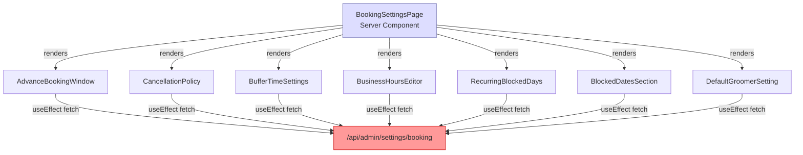
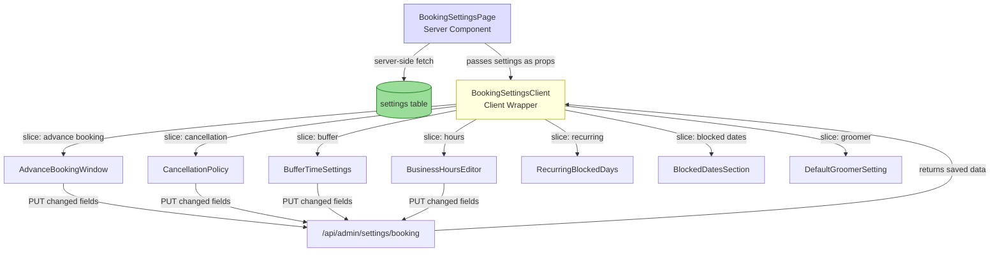
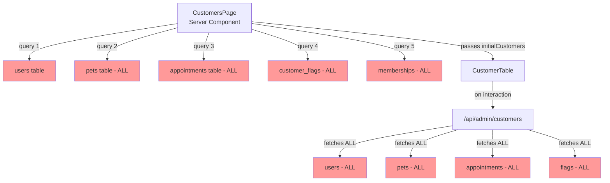
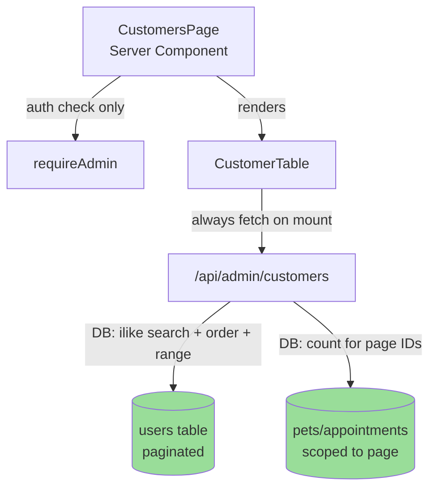
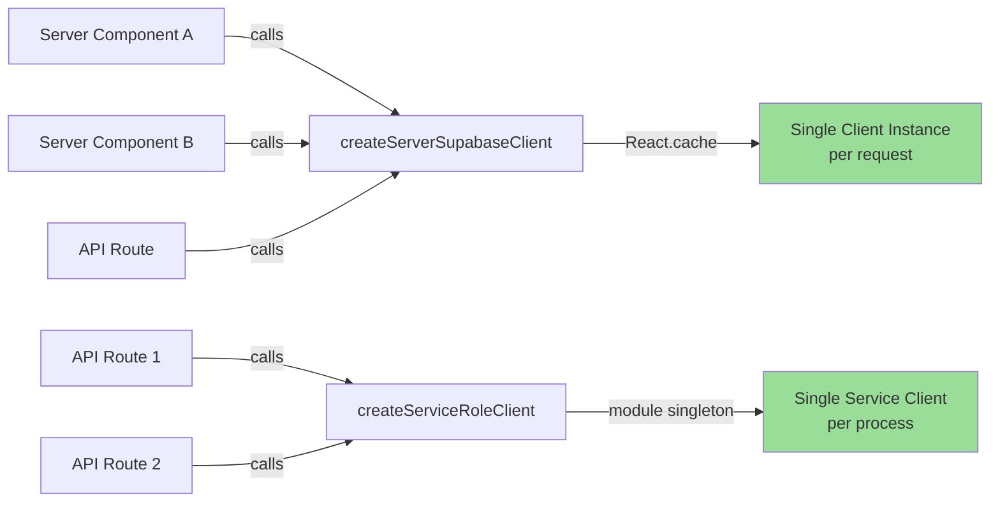

# Admin Pages Audit & Optimization -- Design Document

## Overview

### Problem Statement

The admin panel (~20+ pages, ~95+ API calls) has accumulated several performance and production-readiness issues that must be resolved before the application can handle real customer load. The issues fall into four categories:

1. **Duplicate API requests** -- Pages making 4-7 identical HTTP requests on mount, components re-fetching data already loaded by the server, and save operations performing unnecessary pre/post-fetch cycles.
2. **React best practices violations** -- Missing `React.cache()` deduplication, eager static imports of heavy components, sequential server-side queries, and derived state computed inside `useEffect`.
3. **Database scalability gaps** -- Full-table scans with JavaScript filtering, N+1 query patterns, multi-step writes without transactions, and unescaped search input in `ilike` queries.
4. **Client-side inefficiencies** -- Polling/realtime/visibility-change overlap, deprecated dead code, and 542 unguarded `console.log` calls that will pollute production logs.

### Scope

This audit covers all admin pages, API routes, hooks, and components under:

- `src/app/admin/` (pages)
- `src/app/api/admin/` (API routes)
- `src/components/admin/` (components)
- `src/hooks/admin/` (hooks)
- `src/lib/supabase/server.ts` (shared infrastructure)

### Success Metrics

| Page / Area | Current Requests | Target Requests |
|---|---|---|
| Booking Settings load | 4-7 identical GETs | 1 server-side fetch |
| Booking Settings save | 3 requests (pre+PUT+post) | 1 PUT request |
| Customers page load | 5 server queries + 0-1 API call | 1 API call |
| Staff API (10 staff) | 41+ DB queries | 5 DB queries |
| Appointments priority sort | Full-table fetch | Paginated DB query |
| `createServerSupabaseClient` per request | N instantiations | 1 (cached) |
| JS bundle (analytics) | All charts eager | Heavy charts lazy-loaded |

---

## Architecture

### Current Data Flow: Booking Settings Page



**Problem:** 7 components each independently fetch the same endpoint on mount, producing 4-7 duplicate HTTP requests (browser deduplication may collapse some, but not all since they fire at slightly different times).

### Target Data Flow: Booking Settings Page



**Result:** 1 server-side fetch on load, 1 PUT per save. The PUT response contains the saved data, so no post-fetch is needed.

### Current Data Flow: Customers Page



### Target Data Flow: Customers Page



### Supabase Client Caching Architecture



---

## Components and Interfaces

### Priority 1: CRITICAL -- Eliminate Duplicate Requests

#### 1A. Booking Settings Page -- Single Fetch with Prop Distribution

**Files to modify:**

| File | Change |
|---|---|
| `src/app/admin/settings/booking/page.tsx` | Add server-side fetch, create `BookingSettingsClient` wrapper |
| `src/components/admin/settings/booking/BookingSettingsClient.tsx` | **New file** -- client wrapper that holds state and distributes props |
| `src/components/admin/settings/booking/AdvanceBookingWindow.tsx` | Accept props, remove `useEffect` fetch, simplify save |
| `src/components/admin/settings/booking/CancellationPolicy.tsx` | Same pattern |
| `src/components/admin/settings/booking/BufferTimeSettings.tsx` | Same pattern |
| `src/components/admin/settings/booking/BusinessHoursEditor.tsx` | Same pattern |
| `src/components/admin/settings/booking/RecurringBlockedDays.tsx` | Same pattern |
| `src/components/admin/settings/booking/BlockedDatesSection.tsx` | Same pattern |
| `src/components/admin/settings/booking/DefaultGroomerSetting.tsx` | Same pattern (may have separate API) |
| `src/app/api/admin/settings/booking/route.ts` | Verify PUT returns saved data (already does) |

**Design: BookingSettingsClient wrapper**

```typescript
// src/components/admin/settings/booking/BookingSettingsClient.tsx
'use client';

interface BookingSettingsClientProps {
  initialSettings: BookingSettings;
}

export function BookingSettingsClient({ initialSettings }: BookingSettingsClientProps) {
  const [settings, setSettings] = useState<BookingSettings>(initialSettings);

  // Shared save handler: PUT only changed fields, use response as new state
  const handleSettingsUpdated = useCallback((updatedSettings: BookingSettings) => {
    setSettings(updatedSettings);
  }, []);

  return (
    <div className="space-y-6">
      <AdvanceBookingWindow
        settings={settings}
        onSettingsUpdated={handleSettingsUpdated}
      />
      <CancellationPolicy
        settings={settings}
        onSettingsUpdated={handleSettingsUpdated}
      />
      {/* ... other sections */}
    </div>
  );
}
```

**Design: Updated section component interface**

Each booking settings section component will change from:

```typescript
// BEFORE: No props, self-fetching
export function AdvanceBookingWindow() {
  useEffect(() => { fetch('/api/admin/settings/booking'); }, []);
  // ...
}
```

To:

```typescript
// AFTER: Receives settings via props, no fetch on mount
interface AdvanceBookingWindowProps {
  settings: BookingSettings;
  onSettingsUpdated: (settings: BookingSettings) => void;
}

export function AdvanceBookingWindow({ settings, onSettingsUpdated }: AdvanceBookingWindowProps) {
  const [minAdvanceHours, setMinAdvanceHours] = useState(settings.min_advance_hours);
  const [maxAdvanceDays, setMaxAdvanceDays] = useState(settings.max_advance_days);

  // Save handler: PUT only, use response as new state
  const handleSave = async () => {
    const updatedSettings: BookingSettings = {
      ...settings,
      min_advance_hours: minAdvanceHours,
      max_advance_days: maxAdvanceDays,
    };

    const response = await fetch('/api/admin/settings/booking', {
      method: 'PUT',
      headers: { 'Content-Type': 'application/json' },
      body: JSON.stringify(updatedSettings),
    });

    if (!response.ok) throw new Error('Failed to save');

    const result = await response.json();
    onSettingsUpdated(result.data); // Use PUT response as new state
  };
}
```

**Design: Server component page update**

```typescript
// src/app/admin/settings/booking/page.tsx
export default async function BookingSettingsPage() {
  const supabase = await createServerSupabaseClient();
  await requireAdmin(supabase);

  // Single server-side fetch
  const serviceClient = createServiceRoleClient();
  const { data: settingRecord } = await (serviceClient as any)
    .from('settings')
    .select('value')
    .eq('key', 'booking_settings')
    .single();

  const settings: BookingSettings = settingRecord?.value ?? DEFAULT_BOOKING_SETTINGS;

  return (
    <div className="min-h-screen bg-[#F8EEE5] p-6">
      {/* Breadcrumb, header unchanged */}
      <BookingSettingsClient initialSettings={settings} />
    </div>
  );
}
```

**Key design decisions:**
- The server component fetches settings once using `createServiceRoleClient` (bypasses RLS, consistent with other admin patterns).
- The `BookingSettingsClient` wrapper holds the canonical settings state and passes it down as props.
- Each section component extracts its slice from the full `BookingSettings` object.
- Save handlers call PUT with the full `BookingSettings` object (merging their local changes with the current `settings` prop). The PUT response is used as the new canonical state -- no pre-fetch or post-fetch needed.
- The `onSettingsUpdated` callback propagates saved data back to the parent, keeping all sibling components in sync.

---

#### 1B. Customers Page -- Remove Server-Side Queries

**Files to modify:**

| File | Change |
|---|---|
| `src/app/admin/customers/page.tsx` | Remove 5 queries, remove `initialCustomers` prop |
| `src/components/admin/customers/CustomerTable.tsx` | Always fetch on mount, remove conditional skip |

**Design: Simplified server component**

```typescript
// src/app/admin/customers/page.tsx
export default async function CustomersPage() {
  // Auth check only -- layout already verifies, but kept for defense-in-depth
  const supabase = await createServerSupabaseClient();
  // No data queries -- CustomerTable handles all fetching via API

  return (
    <div className="space-y-6">
      {/* Header unchanged */}
      <CustomerTable />
    </div>
  );
}
```

**Design: CustomerTable always fetches on mount**

Remove the conditional skip at line 58:

```typescript
// BEFORE (line 57-61):
useEffect(() => {
  if (searchQuery || currentPage > 1 || sortBy !== 'name' || sortOrder !== 'asc') {
    fetchCustomers();
  }
}, [searchQuery, currentPage, sortBy, sortOrder]);

// AFTER:
useEffect(() => {
  fetchCustomers();
}, [searchQuery, currentPage, sortBy, sortOrder]);
```

Remove the `initialCustomers` prop entirely. The component always starts with `loading: true` and fetches from the API.

**Rationale:** The "thin server" pattern (server component handles auth, client component handles data) is already used by the Dashboard page and is the cleanest approach. It eliminates the double-load problem where server queries are wasted when the client re-fetches on any interaction.

---

#### 1C. Customers API -- Database-Level Search, Sort, Paginate

**File to modify:** `src/app/api/admin/customers/route.ts`

**Design: Rewritten GET handler**

The current implementation fetches ALL customers, ALL pets, ALL appointments, and ALL flags, then performs search/sort/pagination in JavaScript. The new implementation pushes all filtering to the database.

```typescript
export async function GET(request: NextRequest) {
  const supabase = await createServerSupabaseClient();
  const serviceClient = createServiceRoleClient();
  await requireAdmin(supabase);

  const { searchParams } = new URL(request.url);
  const search = searchParams.get('search') || '';
  const page = parseInt(searchParams.get('page') || '1', 10);
  const limit = parseInt(searchParams.get('limit') || '50', 10);
  const sortBy = searchParams.get('sortBy') || 'name';
  const sortOrder = searchParams.get('sortOrder') || 'asc';
  const offset = (page - 1) * limit;

  // Build query with database-level filtering
  let query = (serviceClient as any)
    .from('users')
    .select('*', { count: 'exact' })
    .eq('role', 'customer');

  // Database-level search with escaped ilike
  if (search) {
    const escaped = escapeLikePattern(search);
    query = query.or(
      `first_name.ilike.%${escaped}%,` +
      `last_name.ilike.%${escaped}%,` +
      `email.ilike.%${escaped}%,` +
      `phone.ilike.%${escaped}%`
    );
  }

  // Database-level sorting
  switch (sortBy) {
    case 'email':
      query = query.order('email', { ascending: sortOrder === 'asc' });
      break;
    case 'join_date':
      query = query.order('created_at', { ascending: sortOrder === 'asc' });
      break;
    case 'name':
    default:
      query = query
        .order('first_name', { ascending: sortOrder === 'asc' })
        .order('last_name', { ascending: sortOrder === 'asc' });
      break;
  }

  // Database-level pagination
  query = query.range(offset, offset + limit - 1);

  const { data: customers, error, count } = await query;

  if (error) {
    return NextResponse.json({ error: 'Failed to fetch customers' }, { status: 500 });
  }

  // Fetch counts scoped to THIS PAGE's customer IDs only
  const customerIds = (customers || []).map((c: any) => c.id);

  if (customerIds.length === 0) {
    return NextResponse.json({
      data: [],
      pagination: { page, limit, total: 0, totalPages: 0 },
    });
  }

  const [petsResult, appointmentsResult, flagsResult] = await Promise.all([
    (serviceClient as any)
      .from('pets')
      .select('owner_id')
      .in('owner_id', customerIds)
      .eq('is_active', true),
    (serviceClient as any)
      .from('appointments')
      .select('customer_id')
      .in('customer_id', customerIds),
    (serviceClient as any)
      .from('customer_flags')
      .select('*')
      .in('customer_id', customerIds)
      .eq('is_active', true),
  ]);

  // Build counts from scoped results
  const petCounts = countBy(petsResult.data || [], 'owner_id');
  const appointmentCounts = countBy(appointmentsResult.data || [], 'customer_id');
  const flagsByCustomer = groupBy(flagsResult.data || [], 'customer_id');

  const customersWithStats = (customers || []).map((customer: any) => ({
    ...customer,
    pets_count: petCounts[customer.id] || 0,
    appointments_count: appointmentCounts[customer.id] || 0,
    flags: flagsByCustomer[customer.id] || [],
  }));

  return NextResponse.json({
    data: customersWithStats,
    pagination: {
      page,
      limit,
      total: count || 0,
      totalPages: Math.ceil((count || 0) / limit),
    },
  });
}
```

**Helper functions** (inline in the same file or in a shared utility):

```typescript
function countBy(items: any[], key: string): Record<string, number> {
  return items.reduce((acc, item) => {
    acc[item[key]] = (acc[item[key]] || 0) + 1;
    return acc;
  }, {} as Record<string, number>);
}

function groupBy(items: any[], key: string): Record<string, any[]> {
  return items.reduce((acc, item) => {
    (acc[item[key]] = acc[item[key]] || []).push(item);
    return acc;
  }, {} as Record<string, any[]>);
}
```

**Design decisions:**
- The `appointments` sort option is removed from database-level sorting since it requires a count aggregation. If needed, it can be implemented via a Supabase RPC with a subquery. For now, sorting by name/email/join_date covers the primary use cases.
- Pet name search is dropped from the database-level search since it requires a cross-table `ilike` join. This is a trade-off for scalability. If pet name search is required, it can be added via an RPC function later.
- Counts for pets/appointments/flags are fetched only for the current page's customer IDs, keeping the query cost proportional to the page size (50), not the total customer count.

---

#### 1D. Staff API -- Batch Queries Instead of N+1

**File to modify:** `src/app/api/admin/settings/staff/route.ts`

**Design: Batched production queries**

Replace the `Promise.all` per-staff-member loop (lines 170-237) with 4 batched queries:

```typescript
// AFTER: 4-5 total queries regardless of staff count
const staffIds = (staffData || []).map((s: User) => s.id);

const [completedResult, upcomingResult, ratingsResult, commissionsResult] = await Promise.all([
  // 1. Completed appointment counts grouped by groomer
  (serviceClient as any)
    .from('appointments')
    .select('groomer_id')
    .in('groomer_id', staffIds)
    .eq('status', 'completed'),

  // 2. Upcoming appointment counts grouped by groomer (next 7 days)
  (serviceClient as any)
    .from('appointments')
    .select('groomer_id')
    .in('groomer_id', staffIds)
    .in('status', ['pending', 'confirmed'])
    .gte('scheduled_at', now.toISOString())
    .lte('scheduled_at', sevenDaysFromNow.toISOString()),

  // 3. Ratings via join: report_cards -> appointments (for groomer_id)
  (serviceClient as any)
    .from('report_cards')
    .select('rating, appointments!inner(groomer_id)')
    .not('rating', 'is', null)
    .in('appointments.groomer_id', staffIds),

  // 4. All commission settings for these staff
  (serviceClient as any)
    .from('staff_commissions')
    .select('*')
    .in('groomer_id', staffIds),
]);

// Build lookup maps
const completedCounts = countBy(completedResult.data || [], 'groomer_id');
const upcomingCounts = countBy(upcomingResult.data || [], 'groomer_id');
const commissionMap = Object.fromEntries(
  (commissionsResult.data || []).map((c: any) => [c.groomer_id, c])
);

// Build ratings map
const ratingsByGroomer: Record<string, number[]> = {};
for (const rc of ratingsResult.data || []) {
  const groomerId = rc.appointments?.groomer_id;
  if (groomerId) {
    (ratingsByGroomer[groomerId] = ratingsByGroomer[groomerId] || []).push(rc.rating);
  }
}

// Assemble response
const enrichedStaff: StaffMemberResponse[] = (staffData || []).map((s: User) => ({
  id: s.id,
  email: s.email,
  first_name: s.first_name,
  last_name: s.last_name,
  phone: s.phone,
  role: s.role,
  avatar_url: s.avatar_url,
  created_at: s.created_at,
  appointment_count: completedCounts[s.id] || 0,
  upcoming_appointments: upcomingCounts[s.id] || 0,
  avg_rating: ratingsByGroomer[s.id]
    ? Math.round(
        (ratingsByGroomer[s.id].reduce((a, b) => a + b, 0) / ratingsByGroomer[s.id].length) * 10
      ) / 10
    : null,
  commission_settings: commissionMap[s.id] || null,
}));
```

**Note on the join query for ratings:** The `report_cards` query uses `appointments!inner(groomer_id)` to join through the appointments table. If Supabase's PostgREST does not support filtering on joined columns via `.in()`, an alternative is to fetch all report cards with their appointment's groomer_id, then filter in JavaScript:

```typescript
// Fallback if join filtering is not supported:
const { data: reportCards } = await (serviceClient as any)
  .from('report_cards')
  .select('rating, appointment_id')
  .not('rating', 'is', null);

const { data: staffAppointments } = await (serviceClient as any)
  .from('appointments')
  .select('id, groomer_id')
  .in('groomer_id', staffIds);

// Build groomer_id lookup from appointments, then map ratings
```

This is still only 5 queries total (constant), versus 4N + 1 in the current implementation.

**Mock mode:** The mock mode code (lines 77-136) should be updated with the same batched pattern for consistency, replacing the per-staff-member `store.select('appointments', {})` calls.

---

#### 1E. Appointments API -- Database-Level Priority Sorting

**Files to modify:**

| File | Change |
|---|---|
| `src/app/api/admin/appointments/route.ts` | Use RPC for priority sorting, always paginate at DB level |
| New Supabase migration | Create `get_appointments_sorted` RPC function |

**Design: RPC function for priority sorting**

```sql
-- Migration: create_get_appointments_sorted_rpc.sql

CREATE OR REPLACE FUNCTION get_appointments_sorted(
  p_sort_mode text,           -- 'status_priority' or 'date_priority'
  p_sort_order text DEFAULT 'asc',
  p_status text DEFAULT NULL,
  p_service_id uuid DEFAULT NULL,
  p_date_from timestamptz DEFAULT NULL,
  p_date_to timestamptz DEFAULT NULL,
  p_limit int DEFAULT 25,
  p_offset int DEFAULT 0
)
RETURNS TABLE (
  id uuid,
  customer_id uuid,
  pet_id uuid,
  service_id uuid,
  groomer_id uuid,
  scheduled_at timestamptz,
  duration_minutes int,
  status text,
  payment_status text,
  total_price numeric,
  notes text,
  booking_reference text,
  creation_method text,
  created_at timestamptz,
  updated_at timestamptz
)
LANGUAGE plpgsql
AS $$
BEGIN
  RETURN QUERY
  SELECT
    a.id, a.customer_id, a.pet_id, a.service_id, a.groomer_id,
    a.scheduled_at, a.duration_minutes, a.status::text, a.payment_status::text,
    a.total_price, a.notes, a.booking_reference, a.creation_method::text,
    a.created_at, a.updated_at
  FROM appointments a
  WHERE
    (p_status IS NULL OR a.status = p_status::appointment_status)
    AND (p_service_id IS NULL OR a.service_id = p_service_id)
    AND (p_date_from IS NULL OR a.scheduled_at >= p_date_from)
    AND (p_date_to IS NULL OR a.scheduled_at <= p_date_to)
  ORDER BY
    CASE WHEN p_sort_mode = 'status_priority' AND p_sort_order = 'asc' THEN
      CASE a.status
        WHEN 'pending' THEN 0
        WHEN 'confirmed' THEN 1
        WHEN 'in_progress' THEN 2
        WHEN 'completed' THEN 3
        WHEN 'cancelled' THEN 4
        WHEN 'no_show' THEN 5
        ELSE 99
      END
    END ASC NULLS LAST,
    CASE WHEN p_sort_mode = 'status_priority' AND p_sort_order = 'desc' THEN
      CASE a.status
        WHEN 'pending' THEN 0
        WHEN 'confirmed' THEN 1
        WHEN 'in_progress' THEN 2
        WHEN 'completed' THEN 3
        WHEN 'cancelled' THEN 4
        WHEN 'no_show' THEN 5
        ELSE 99
      END
    END DESC NULLS LAST,
    CASE WHEN p_sort_mode = 'date_priority' THEN
      CASE
        WHEN a.scheduled_at >= CURRENT_DATE AND a.scheduled_at < CURRENT_DATE + 1 THEN 0
        WHEN a.scheduled_at >= CURRENT_DATE + 1 THEN 1
        ELSE 2
      END
    END ASC NULLS LAST,
    a.scheduled_at ASC
  LIMIT p_limit
  OFFSET p_offset;
END;
$$;
```

**Design: Updated GET handler**

```typescript
// For status_priority or date_priority sort modes:
if (isStatusPrioritySort || isDatePrioritySort) {
  const { data: sortedIds, error: rpcError } = await (serviceClient as any)
    .rpc('get_appointments_sorted', {
      p_sort_mode: sortBy,
      p_sort_order: sortOrder,
      p_status: status || null,
      p_service_id: service || null,
      p_date_from: dateFrom || null,
      p_date_to: dateTo ? new Date(dateTo + 'T23:59:59.999Z').toISOString() : null,
      p_limit: limit,
      p_offset: offset,
    });

  if (rpcError) {
    return NextResponse.json({ error: 'Failed to fetch appointments' }, { status: 500 });
  }

  // Fetch full appointment data with joins for the sorted IDs
  const ids = (sortedIds || []).map((r: any) => r.id);
  // ... fetch with joins using .in('id', ids), then re-sort to match RPC order
}
```

**Design decision:** The RPC function handles sorting and pagination at the database level. The API route then fetches the full appointment data (with customer/pet/service joins) for only the paginated IDs. This ensures the database never returns more than `limit` rows, regardless of sort mode.

**Mock mode:** The existing JavaScript-based sorting for mock mode (lines 65-93) remains unchanged since mock data volumes are small. The RPC path is only used when `NEXT_PUBLIC_USE_MOCKS !== 'true'`.

---

### Priority 2: HIGH -- Vercel React Best Practices

#### 2A. Server-Side Request Deduplication with React.cache()

**File to modify:** `src/lib/supabase/server.ts`

**Design: Cached client creation**

```typescript
import { cache } from 'react';

// Wrap in React.cache() for per-request deduplication in Server Components
export const createServerSupabaseClient = cache(async (): Promise<AppSupabaseClient> => {
  const cookieStore = await cookies();

  if (config.useMocks) {
    return createMockClient({
      cookies: {
        getAll() {
          return cookieStore.getAll();
        },
      },
    });
  }

  return createServerClient(
    config.supabase.url,
    config.supabase.anonKey,
    {
      cookies: {
        getAll() {
          return cookieStore.getAll();
        },
        setAll(cookiesToSet) {
          try {
            cookiesToSet.forEach(({ name, value, options }) =>
              cookieStore.set(name, value, options as CookieOptions)
            );
          } catch {
            // Ignored in Server Components
          }
        },
      },
    }
  );
});
```

**Design decision:** `React.cache()` deduplicates calls within a single server request. When the admin layout calls `createServerSupabaseClient()` and then a child page calls it again, the second call returns the cached instance. This is safe because each HTTP request gets its own cache scope.

**Redundant requireAdmin() removal:** The admin layout (`src/app/admin/layout.tsx`) already calls `requireAdmin()`. Sub-pages that also call it are doing redundant work. However, removing `requireAdmin()` from pages is a defense-in-depth trade-off. The recommendation is to keep it for now but note that with `React.cache()` on `createServerSupabaseClient`, the cost is negligible since the client is reused.

---

#### 2B. Dynamic Imports for Heavy Components

**Files to modify:**

| File | Change |
|---|---|
| `src/components/admin/analytics/AnalyticsDashboard.tsx` | Dynamic imports for chart sections |
| `src/app/admin/appointments/page.tsx` | Dynamic imports for modals |

**Design: Dynamic imports pattern**

```typescript
import dynamic from 'next/dynamic';

// Heavy chart components loaded on demand
const RevenueChart = dynamic(
  () => import('./charts/RevenueChart').then(m => ({ default: m.RevenueChart })),
  { ssr: false, loading: () => <ChartSkeleton /> }
);

const AppointmentsTrendChart = dynamic(
  () => import('./charts/AppointmentsTrendChart').then(m => ({ default: m.AppointmentsTrendChart })),
  { ssr: false, loading: () => <ChartSkeleton /> }
);

// Modals loaded on demand
const AppointmentDetailModal = dynamic(
  () => import('@/components/admin/appointments/AppointmentDetailModal'),
  { ssr: false }
);
```

**Design decision:** `{ ssr: false }` is used for chart components because they depend on browser APIs (Canvas, DOM measurements). Modals are also `ssr: false` since they are only rendered on user interaction.

---

#### 2C. Parallel Server Fetching

**File to modify:** `src/app/admin/settings/page.tsx`

**Current state:** The settings dashboard page already uses `Promise.all()` for its 4 queries (lines 20-49). No change needed.

**Other pages:** The customers page parallel fetch issue is resolved by 1B (removing server-side queries entirely). No additional parallel fetching changes are needed.

---

#### 2D. Suspense Boundaries

**Files to modify:**

| File | Change |
|---|---|
| `src/app/admin/customers/page.tsx` | Wrap `CustomerTable` in `Suspense` with skeleton |
| `src/app/admin/analytics/page.tsx` | Wrap analytics dashboard in `Suspense` with skeleton |

**Design: Suspense with skeleton fallback**

```typescript
import { Suspense } from 'react';

// In customers page:
<Suspense fallback={<CustomerTableSkeleton />}>
  <CustomerTable />
</Suspense>

// In analytics page:
<Suspense fallback={<AnalyticsSkeleton />}>
  <AnalyticsDashboard />
</Suspense>
```

**Design decision:** Since `CustomerTable` is a client component that fetches its own data, the `Suspense` boundary primarily provides a visual loading state during the JavaScript bundle load. For server components that fetch data, `Suspense` enables streaming -- the shell renders immediately while data loads.

---

#### 2E. Derived State Without Effects

**File to modify:** `src/hooks/admin/use-settings-form.ts`

**Design: Replace useEffect + setState with useMemo**

```typescript
// BEFORE (lines 118-127):
const [isDirty, setIsDirty] = useState(false);

useEffect(() => {
  const dirty = JSON.stringify(data) !== JSON.stringify(originalData);
  setIsDirty(dirty);
}, [data, originalData]);

// AFTER:
const isDirty = useMemo(() => {
  return JSON.stringify(data) !== JSON.stringify(originalData);
}, [data, originalData]);
```

**Impact:** Eliminates one unnecessary re-render per data change. The `useEffect` pattern causes: render with stale `isDirty` -> effect runs -> `setIsDirty` -> re-render with correct `isDirty`. The `useMemo` pattern computes the correct value during the render itself.

**Additional change:** Remove `setIsDirty(false)` calls in `save`, `discard`, and `reset` functions since `isDirty` is now derived. The `useMemo` will automatically return `false` when `data` equals `originalData`.

---

### Priority 3: HIGH -- Database Production Readiness

#### 3A. Transaction Safety for Appointment Creation

**Files to modify:**

| File | Change |
|---|---|
| `src/app/api/admin/appointments/route.ts` | Refactor POST to use RPC for critical inserts |
| New Supabase migration | Create `create_appointment_with_addons` RPC |

**Design: Transaction RPC function**

```sql
-- Migration: create_appointment_with_addons_rpc.sql

CREATE OR REPLACE FUNCTION create_appointment_with_addons(
  p_customer_id uuid,
  p_pet_id uuid,
  p_service_id uuid,
  p_groomer_id uuid,
  p_scheduled_at timestamptz,
  p_duration_minutes int,
  p_status text,
  p_payment_status text,
  p_total_price numeric,
  p_notes text,
  p_booking_reference text,
  p_created_by_admin_id uuid,
  p_addon_data jsonb DEFAULT '[]'::jsonb  -- array of {addon_id, price}
)
RETURNS jsonb
LANGUAGE plpgsql
AS $$
DECLARE
  v_appointment_id uuid;
  v_addon jsonb;
  v_result jsonb;
BEGIN
  -- Insert appointment
  INSERT INTO appointments (
    customer_id, pet_id, service_id, groomer_id,
    scheduled_at, duration_minutes, status, payment_status,
    total_price, notes, booking_reference,
    creation_method, created_by_admin_id
  ) VALUES (
    p_customer_id, p_pet_id, p_service_id, p_groomer_id,
    p_scheduled_at, p_duration_minutes, p_status::appointment_status,
    p_payment_status::payment_status, p_total_price, p_notes,
    p_booking_reference, 'manual_admin', p_created_by_admin_id
  )
  RETURNING id INTO v_appointment_id;

  -- Insert addons (if any)
  FOR v_addon IN SELECT * FROM jsonb_array_elements(p_addon_data)
  LOOP
    INSERT INTO appointment_addons (appointment_id, addon_id, price)
    VALUES (
      v_appointment_id,
      (v_addon->>'addon_id')::uuid,
      (v_addon->>'price')::numeric
    );
  END LOOP;

  -- Build result
  v_result := jsonb_build_object(
    'appointment_id', v_appointment_id
  );

  RETURN v_result;
END;
$$;
```

**Design: Updated POST handler**

The POST handler is restructured into three phases:

1. **Pre-transaction** (can fail independently): Customer lookup/creation, pet lookup/creation, service/price validation, booking reference generation
2. **Transaction** (atomic via RPC): Appointment insert + addon inserts
3. **Post-transaction** (non-critical, use `after()`): Payment record, notification, calendar sync

```typescript
// Phase 2: Atomic appointment + addons creation
const addonData = addons.map(addon => ({
  addon_id: addon.id,
  price: addon.price,
}));

const { data: rpcResult, error: rpcError } = await supabase
  .rpc('create_appointment_with_addons', {
    p_customer_id: customerId,
    p_pet_id: petId,
    p_service_id: data.service_id,
    p_groomer_id: data.groomer_id || null,
    p_scheduled_at: scheduledAt.toISOString(),
    p_duration_minutes: service.duration_minutes,
    p_status: data.source === 'walk_in' ? 'in_progress' : 'pending',
    p_payment_status: data.payment_status,
    p_total_price: priceBreakdown.total,
    p_notes: data.notes || null,
    p_booking_reference: bookingReference,
    p_created_by_admin_id: adminUser.id,
    p_addon_data: JSON.stringify(addonData),
  });

if (rpcError) {
  return NextResponse.json({ error: 'Failed to create appointment' }, { status: 500 });
}

const appointmentId = rpcResult.appointment_id;

// Phase 3: Non-critical operations (fire and forget)
after(async () => {
  // Payment record creation
  // Notification trigger
  // Calendar sync
});
```

**Design decision:** Customer and pet creation are kept outside the transaction because they can exist independently (a customer/pet record is valid even if the appointment fails). The critical atomicity requirement is between the appointment row and its addon rows -- if addon insertion fails, the appointment should not exist without its addons.

---

#### 3B. Service Creation Race Condition

**File to modify:** `src/app/api/admin/services/route.ts`

**Design: Atomic service creation RPC**

```sql
-- Migration: create_service_with_prices_rpc.sql

CREATE OR REPLACE FUNCTION create_service_with_prices(
  p_name text,
  p_description text,
  p_duration_minutes int,
  p_image_url text,
  p_is_active boolean,
  p_display_order int,
  p_prices jsonb  -- {small: number, medium: number, large: number, xlarge: number}
)
RETURNS uuid
LANGUAGE plpgsql
AS $$
DECLARE
  v_service_id uuid;
  v_size text;
  v_price numeric;
BEGIN
  -- Insert service
  INSERT INTO services (name, description, duration_minutes, image_url, is_active, display_order)
  VALUES (p_name, p_description, p_duration_minutes, p_image_url, p_is_active, p_display_order)
  RETURNING id INTO v_service_id;

  -- Insert prices for each size
  FOR v_size IN SELECT unnest(ARRAY['small', 'medium', 'large', 'xlarge'])
  LOOP
    v_price := (p_prices->>v_size)::numeric;
    INSERT INTO service_prices (service_id, size, price)
    VALUES (v_service_id, v_size::pet_size, v_price);
  END LOOP;

  RETURN v_service_id;
END;
$$;
```

This replaces the current two-step insert with manual rollback (lines 165-208 in `services/route.ts`), eliminating the race condition window.

---

#### 3C. Search Input Escaping for ilike

**Files to modify:**

| File | Change |
|---|---|
| `src/lib/utils/validation.ts` | Add `escapeLikePattern()` utility |
| `src/app/api/admin/customers/route.ts` | Use utility |
| `src/app/api/admin/appointments/route.ts` | Use utility |
| `src/app/api/admin/notifications/log/route.ts` | Use utility |
| `src/app/api/admin/calendar/import/confirm/route.ts` | Use utility |
| `src/app/api/appointments/route.ts` | Use utility |

**Design: escapeLikePattern utility**

```typescript
// src/lib/utils/validation.ts

/**
 * Escape special characters in SQL LIKE/ILIKE patterns.
 * Prevents user input containing %, _, or \ from being interpreted
 * as wildcard characters in PostgreSQL ilike queries.
 *
 * @param pattern - Raw user input string
 * @returns Escaped string safe for use in ilike patterns
 */
export function escapeLikePattern(pattern: string): string {
  return pattern
    .replace(/\\/g, '\\\\')  // Escape backslashes first
    .replace(/%/g, '\\%')     // Escape percent signs
    .replace(/_/g, '\\_');     // Escape underscores
}
```

**Usage in API routes:**

```typescript
import { escapeLikePattern } from '@/lib/utils/validation';

// Before:
query = query.ilike('name', `%${search}%`);

// After:
query = query.ilike('name', `%${escapeLikePattern(search)}%`);
```

---

#### 3D. Service Role Client Caching

**File to modify:** `src/lib/supabase/server.ts`

**Design: Module-level singleton for service role client**

```typescript
// Module-level singleton -- service role client has no per-request state
// (no cookies, no user session), so it's safe to reuse across requests.
let _serviceRoleClient: SupabaseClient | MockSupabaseClient | null = null;

export function createServiceRoleClient(): SupabaseClient | MockSupabaseClient {
  if (_serviceRoleClient) return _serviceRoleClient;

  if (config.useMocks) {
    _serviceRoleClient = createMockClient();
    return _serviceRoleClient;
  }

  _serviceRoleClient = createSupabaseClient(config.supabase.url, config.supabase.serviceRoleKey, {
    auth: {
      autoRefreshToken: false,
      persistSession: false,
    },
  });

  return _serviceRoleClient;
}
```

**Design decision:** Unlike `createServerSupabaseClient` (which needs per-request cookies), the service role client is stateless -- it uses a fixed service role key with no session. A module-level singleton is appropriate here, avoiding object allocation on every API call. `React.cache()` is not suitable because the service role client is used in API routes (not just Server Components) and should persist across requests.

**Note on mock mode:** The mock client may have mutable state (the mock store). If the mock store is a module-level singleton itself (which it appears to be based on `getMockStore()`), then caching the mock client is safe. If the mock client creates a fresh store per instantiation, this change should not be applied in mock mode.

---

### Priority 4: MEDIUM -- Client-Side Optimization

#### 4A. Dashboard Realtime + Polling Overlap

**File to modify:** `src/hooks/admin/use-dashboard-data.ts`

**Design: Throttled fetch with polling timer reset**

```typescript
// Add a timestamp ref to track the last fetch
const lastFetchRef = useRef<number>(0);
const THROTTLE_MS = 5_000; // Minimum 5 seconds between fetches

// Throttled wrapper around fetchAll
const throttledFetchAll = useCallback(() => {
  const now = Date.now();
  if (now - lastFetchRef.current < THROTTLE_MS) {
    return; // Skip -- too soon since last fetch
  }
  lastFetchRef.current = now;
  fetchAll();
}, [fetchAll]);

// Update the ref to use throttled version
fetchAllRef.current = throttledFetchAll;

// Visibility change handler: fetch AND reset polling timer
const handleVisibilityChange = () => {
  if (!document.hidden) {
    throttledFetchAll();
    // Reset polling timer to avoid near-immediate double fetch
    stopPolling();
    startPolling();
  }
};
```

**Design decision:** A simple timestamp-based throttle is preferred over a full debounce because we want the first call to execute immediately (important for visibility change), just not rapid successive calls. The 5-second throttle window prevents overlapping fetches from visibility change + polling + realtime events.

---

#### 4B. Remove Deprecated Hook

**File to delete:** `src/hooks/admin/use-dashboard-realtime.ts`

**Verification:** The file is marked `@deprecated` at line 2 and the plan states it is not imported anywhere. Before deletion, verify with a grep for `use-dashboard-realtime` across the codebase.

---

#### 4C. Console Logging Cleanup

**Scope:** 542 `console.log/warn/error` calls across 116 admin API files.

**Design: Conditional logging utility**

Rather than wrapping each call individually, create a lightweight logger:

```typescript
// src/lib/utils/logger.ts

const isDev = process.env.NODE_ENV === 'development';

export const logger = {
  debug: (...args: unknown[]) => {
    if (isDev) console.log(...args);
  },
  info: (...args: unknown[]) => {
    if (isDev) console.log(...args);
  },
  warn: (...args: unknown[]) => {
    console.warn(...args); // Warnings always logged
  },
  error: (...args: unknown[]) => {
    console.error(...args); // Errors always logged
  },
};
```

**Application strategy:**
- Replace `console.log` with `logger.debug` or `logger.info` (suppressed in production)
- Keep `console.error` as `logger.error` (always logged)
- Keep `console.warn` as `logger.warn` (always logged)
- This can be done incrementally -- start with the highest-volume files (appointments route has 34 calls)

**Design decision:** Errors and warnings should always be logged in production for debugging. Only debug/info messages (request tracing, data inspection) should be suppressed. A utility function is preferred over inline `if (isDev)` checks because it's less error-prone and more consistent.

---

## Data Models

### New Database Objects

| Object | Type | Purpose |
|---|---|---|
| `get_appointments_sorted` | RPC function | Database-level priority sorting with pagination |
| `create_appointment_with_addons` | RPC function | Atomic appointment + addons creation |
| `create_service_with_prices` | RPC function | Atomic service + prices creation |

### New Utility Functions

| Function | Location | Purpose |
|---|---|---|
| `escapeLikePattern` | `src/lib/utils/validation.ts` | Escape `%`, `_`, `\` in ilike patterns |
| `countBy` | `src/app/api/admin/customers/route.ts` | Count array items by key |
| `groupBy` | `src/app/api/admin/customers/route.ts` | Group array items by key |
| `logger` | `src/lib/utils/logger.ts` | Environment-aware logging |

### New Components

| Component | Location | Purpose |
|---|---|---|
| `BookingSettingsClient` | `src/components/admin/settings/booking/BookingSettingsClient.tsx` | Client wrapper for settings prop distribution |

### Modified Interfaces

```typescript
// Updated: AdvanceBookingWindow, CancellationPolicy, BufferTimeSettings,
// BusinessHoursEditor, RecurringBlockedDays, BlockedDatesSection, DefaultGroomerSetting
interface BookingSettingSectionProps {
  settings: BookingSettings;
  onSettingsUpdated: (settings: BookingSettings) => void;
}

// Updated: CustomerTable
interface CustomerTableProps {
  onCustomerClick?: (customerId: string) => void;
  // Removed: initialCustomers
}

// Updated: useSettingsForm return type
interface UseSettingsFormReturn<T> {
  // isDirty changes from state to derived value (useMemo)
  // No interface change needed -- just implementation change
}
```

---

## Error Handling

### Transaction Rollback Strategy

| Operation | Current Behavior | New Behavior |
|---|---|---|
| Appointment + addons creation | Sequential inserts, no rollback | Atomic RPC -- all or nothing |
| Service + prices creation | Manual delete on failure (race condition) | Atomic RPC -- all or nothing |
| Customer/pet creation | Independent (no rollback needed) | Unchanged -- these records are valid standalone |

### Partial Failure Handling

Non-critical operations after the core transaction should use `after()` (Next.js post-response callback) and should never cause the HTTP response to fail:

- Payment record creation -- log error, continue
- Notification sending -- log error, continue
- Calendar sync -- log error, continue

### API Error Responses

All API routes maintain the existing error response format:

```typescript
// 400: Validation error
{ error: string, details?: ValidationError[] }

// 401: Authentication error
{ error: 'Unauthorized' }

// 500: Server error
{ error: string }
```

### Graceful Degradation

- If `React.cache()` behaves unexpectedly, the fallback is the current behavior (multiple client instantiations -- functionally correct, just slower).
- If the `get_appointments_sorted` RPC is not available (migration not applied), the API route should fall back to the current JavaScript sorting behavior.
- If dynamic imports fail to load, the `loading` fallback component is displayed. A retry mechanism is not needed since Next.js handles chunk loading errors.

---

## Testing Strategy

### Per-Fix Verification

| Fix | Verification Method |
|---|---|
| 1A (Booking settings dedup) | Network tab: 1 request on load (was 4-7), 1 per save (was 3) |
| 1B (Customers page) | Network tab: 0 server queries, 1 API call on mount |
| 1C (Customers API) | Supabase logs: LIMIT/OFFSET in queries. Test with 1000+ rows |
| 1D (Staff N+1) | Supabase logs: constant 4-5 queries regardless of staff count |
| 1E (Appointments sort) | Supabase logs: RPC call with LIMIT. Never fetches all rows |
| 2A (React.cache) | Add logging to `createServerSupabaseClient` -- should log once per request |
| 2B (Dynamic imports) | Bundle analysis: `next build` output shows separate chunks |
| 2D (Suspense) | Visual: skeleton shows during load, content streams in |
| 2E (isDirty useMemo) | React DevTools: one fewer re-render per data change |
| 3A (Transaction) | Simulate addon insert failure -- appointment should not exist |
| 3B (Service transaction) | Simulate price insert failure -- service should not exist |
| 3C (Search escaping) | Search for `%test%` -- should find literal match, not wildcard |
| 3D (Service client cache) | Add counter -- `createServiceRoleClient` instantiates once |
| 4A (Dashboard throttle) | Rapid tab switching -- max 1 fetch per 5 seconds |
| 4B (Deprecated hook) | Grep: no imports of `use-dashboard-realtime` |
| 4C (Console cleanup) | Production build: no debug logs in server output |

### Regression Testing

1. **Build check:** `npm run build` passes with zero errors
2. **Lint check:** `npm run lint` passes
3. **Mock mode:** All changes must work with `NEXT_PUBLIC_USE_MOCKS=true`
4. **Existing tests:** `npm run test` passes (existing test suite)
5. **Manual smoke test:** Navigate all admin pages, verify data loads correctly

### Load Testing (Post-Implementation)

For fixes 1C, 1D, and 1E, verify performance with realistic data volumes:

| Scenario | Data Volume | Expected Response Time |
|---|---|---|
| Customer search | 1000+ customers | < 500ms |
| Staff list | 10-20 staff | < 200ms |
| Appointments priority sort | 5000+ appointments | < 500ms |

### Bundle Size Verification

Before and after dynamic imports (2B):

```bash
# Before implementation, capture baseline:
npm run build 2>&1 | grep -E "^\s*(Route|Size)" > bundle-before.txt

# After implementation:
npm run build 2>&1 | grep -E "^\s*(Route|Size)" > bundle-after.txt

# Compare:
diff bundle-before.txt bundle-after.txt
```

Expected: analytics page bundle size decreases. Individual chart chunks appear in the build output.
