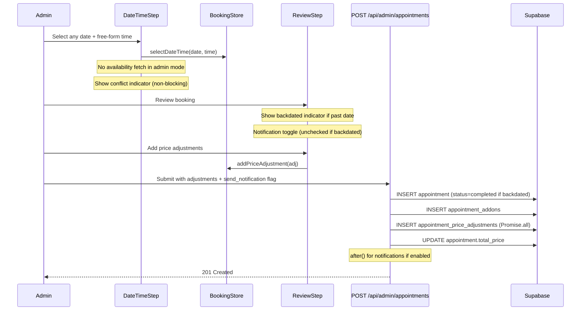

# Design Document: Admin Booking Flexibility

## Overview

This feature enhances the admin booking modal to give staff full control over scheduling and pricing. Currently, admin and customer booking flows share identical date/time restrictions, conflict validation, and pricing logic. This creates friction when admins need to backdate appointments, override pricing, book outside business hours, or double-book slots.

**Changes span five areas:**
1. Unrestricted date/time selection (bypass business hours, blocked dates, advance limits)
2. Double-booking support (skip conflict validation, show non-blocking indicator)
3. Past date booking with automatic status defaulting to "completed"
4. Notification control toggle with smart defaults based on backdating
5. Price adjustments during booking creation (reusing existing `appointment_price_adjustments` infrastructure)

**Key design principle:** All changes are gated on `mode === 'admin'` (or `mode === 'walkin'`). The customer flow remains completely unchanged.

---

## Architecture

### Component Change Map

```mermaid
graph TD
    subgraph "Booking Modal"
        BW[BookingWizard] --> DTS[DateTimeStep]
        BW --> RS[ReviewStep]
    end

    subgraph "New/Modified Components"
        DTS -->|admin mode| AFTI[AdminFreeTimeInput]
        DTS -->|admin mode| ACI[AdminConflictIndicator]
        RS -->|admin mode| PAF[PriceAdjustmentForm]
        RS -->|admin mode| NT[Notification Toggle - existing]
    end

    subgraph "Store"
        BS[bookingStore] -->|new fields| ADJ[priceAdjustments array]
        BS -->|new fields| SN[sendNotification - existing]
    end

    subgraph "API"
        API[POST /api/admin/appointments] -->|new fields| ADJ_TABLE[appointment_price_adjustments]
        API -->|new field| STATUS[status: completed for backdated]
        API -->|new field| SKIP[skip_conflict_check]
    end
```

### Data Flow: Admin Booking Creation



---

## Data Models

### Booking Store Changes (`src/stores/bookingStore.ts`)

Add new state fields and actions:

```typescript
// New state fields
export interface BookingState {
  // ... existing fields ...

  // Admin booking flexibility
  priceAdjustments: PriceAdjustment[];
}

export interface PriceAdjustment {
  id: string;          // Client-side temporary ID (crypto.randomUUID())
  label: string;
  amount: number;      // Positive = surcharge, negative = discount
  note?: string;
}

// New actions
export interface BookingActions {
  // ... existing actions ...

  // Price adjustments
  addPriceAdjustment: (adj: Omit<PriceAdjustment, 'id'>) => void;
  removePriceAdjustment: (id: string) => void;
  clearPriceAdjustments: () => void;
}
```

**Update `calculatePrices`** to include adjustments:

```typescript
calculatePrices: () => {
  const { selectedService, petSize, selectedAddons, priceAdjustments } = get();
  let servicePrice = 0;
  if (selectedService && petSize) {
    const priceEntry = selectedService.prices?.find((p) => p.size === petSize);
    servicePrice = priceEntry?.price || 0;
  }
  const addonsTotal = selectedAddons.reduce((sum, addon) => sum + addon.price, 0);
  const adjustmentsTotal = priceAdjustments.reduce((sum, adj) => sum + adj.amount, 0);
  const totalPrice = servicePrice + addonsTotal + adjustmentsTotal;
  set({ servicePrice, addonsTotal, totalPrice });
},
```

**Update `initialState`:**

```typescript
const initialState: BookingState = {
  // ... existing ...
  priceAdjustments: [],
};
```

**Update `reset`** to clear `priceAdjustments`.

### API Payload Changes (`POST /api/admin/appointments`)

Extend `CreateAppointmentSchema`:

```typescript
const CreateAppointmentSchema = z.object({
  // ... existing fields ...

  // New: price adjustments created during booking
  price_adjustments: z.array(z.object({
    label: z.string().min(1).max(100),
    amount: z.number().refine(n => n !== 0, { message: 'Amount cannot be zero' }),
    note: z.string().max(500).optional(),
  })).default([]),
});
```

No database schema changes are needed -- the existing `appointment_price_adjustments` table is reused as-is.

---

## API Specifications

### `POST /api/admin/appointments` -- Updated Contract

**New request body fields:**

| Field | Type | Default | Description |
|-------|------|---------|-------------|
| `price_adjustments` | `Array<{label, amount, note?}>` | `[]` | Adjustments to apply at creation time |

**Changed server-side behavior:**

1. **Status determination:** If `appointment_date` is before today AND source is not `walk_in`, set `status = 'completed'` instead of `'pending'`.
2. **Conflict validation:** Skipped entirely for admin-created appointments (no change needed -- the API already has no conflict check).
3. **Price adjustments:** After creating the appointment, insert all adjustment records in parallel using `Promise.all()`, then update `total_price` on the appointment.
4. **Notifications:** The existing `send_notification` flag already controls this. No API change needed for notification suppression.

**Updated response** (no changes -- `CreateAppointmentResponse` is sufficient).

### Conflict Check Endpoint (New)

**`GET /api/admin/appointments/conflicts?date=YYYY-MM-DD&time=HH:MM`**

Returns a count of existing appointments at the given date/time for the non-blocking indicator.

```typescript
// Response
{
  count: number;
  appointments: Array<{
    id: string;
    customer_name: string;
    service_name: string;
    status: string;
  }>;
}
```

This is a lightweight query used by `DateTimeStep` in admin mode to show the conflict indicator. It does not block booking.

---

## Component Design

### 1. `DateTimeStep` -- Admin Mode Changes

**Current behavior:** Fetches availability via `useAvailability`, renders `CalendarPicker` with disabled dates and `TimeSlotGrid` with slot-based selection.

**Admin mode behavior:**

- **CalendarPicker:** Pass `disabledDates={[]}`, `minDate={undefined}`, `maxDate={undefined}` -- all dates are selectable.
- **Time input:** Replace `TimeSlotGrid` with `AdminFreeTimeInput` (free-form `<input type="time">`).
- **Skip `useAvailability`:** Do not call the availability hook in admin mode. Instead, use a new lightweight conflict-check fetch.
- **Backdated indicator:** Derive `isBackdated` during render: `const isBackdated = selectedDate ? selectedDate < todayString : false;` (no useEffect).
- **Conflict indicator:** Non-blocking badge showing count of existing appointments.

```tsx
// DateTimeStep.tsx -- admin mode branching (simplified)
export function DateTimeStep() {
  const { mode } = useBookingStore();
  const isAdmin = mode === 'admin';

  // Derive today string during render (not via useEffect)
  const todayString = new Date().toISOString().split('T')[0];

  // Customer mode: use existing availability hook
  const availability = useAvailability({
    date: isAdmin ? null : selectedDate,      // Skip fetch in admin mode
    serviceId: isAdmin ? null : selectedService?.id || null,
  });

  const isBackdated = isAdmin && selectedDate ? selectedDate < todayString : false;

  return (
    <div className="space-y-4">
      <div className="grid md:grid-cols-2 gap-6">
        <CalendarPicker
          selectedDate={selectedDate}
          onDateSelect={handleDateSelect}
          disabledDates={isAdmin ? [] : disabledDates}
          minDate={isAdmin ? undefined : minDate}
          maxDate={isAdmin ? undefined : maxDate}
        />

        <div>
          {isAdmin ? (
            <AdminFreeTimeInput
              selectedDate={selectedDate}
              selectedTime={selectedTimeSlot}
              onTimeChange={handleTimeSelect}
              isBackdated={isBackdated}
            />
          ) : (
            // existing TimeSlotGrid rendering
          )}
        </div>
      </div>
    </div>
  );
}
```

### 2. `AdminFreeTimeInput` -- New Component

Dynamically imported via `next/dynamic` since customer mode never needs it.

```tsx
// src/components/booking/AdminFreeTimeInput.tsx
interface AdminFreeTimeInputProps {
  selectedDate: string | null;
  selectedTime: string | null;
  onTimeChange: (time: string) => void;
  isBackdated: boolean;
}
```

**UI elements:**
- `<input type="time">` with the project's standard input styling (no `input-sm`)
- Backdated indicator: amber badge "Backdating -- this appointment will be marked as completed"
- Conflict indicator: fetched via `GET /api/admin/appointments/conflicts`, shows "N existing appointments at this time" as a non-blocking info badge

**Conflict fetch:** Use a simple `useEffect` + `fetch` triggered by `selectedDate` + `selectedTime` changes (debounced 300ms). Only fetches when both are set.

### 3. `ReviewStep` -- Admin Mode Additions

**Existing admin-only sections** (already present):
- Groomer selection
- Send confirmation email toggle

**New admin-only sections:**

#### 3a. Notification Toggle Enhancement

The toggle already exists. The only change: when `isBackdated` is true, default `sendNotification` to `false`.

Implementation: In `DateTimeStep`, when admin selects a past date, call `setSendNotification(false)`. When switching back to a future date, call `setSendNotification(true)`.

#### 3b. Price Adjustments Section

Render conditionally only in admin mode. Reuse the exact same UI pattern from `AppointmentDetailModal` (lines 900-1001):

- Surcharge/discount toggle
- Label + amount + optional note inputs
- Animated list with `AnimatePresence`
- Color-coded amounts (green for discounts, default for surcharges)
- Hover-reveal delete button

**Price breakdown update:** The existing price breakdown section in ReviewStep must include adjustment line items and recalculated total.

```tsx
{/* Price Adjustments - Admin only */}
{adminMode ? (
  <PriceAdjustmentForm
    adjustments={priceAdjustments}
    onAdd={addPriceAdjustment}
    onRemove={removePriceAdjustment}
  />
) : null}
```

Note: Use ternary `? :` (not `&&`) per Vercel best practices for conditional rendering.

#### 3c. Updated Price Breakdown

```tsx
{/* In the price breakdown section */}
{priceAdjustments.map((adj) => (
  <div key={adj.id} className="flex justify-between text-sm">
    <span className="text-[#434E54]/70">{adj.label}</span>
    <span className={adj.amount < 0 ? 'text-green-600' : 'text-[#434E54]'}>
      {adj.amount < 0 ? `-${formatCurrency(Math.abs(adj.amount))}` : `+${formatCurrency(adj.amount)}`}
    </span>
  </div>
))}
```

### 4. `PriceAdjustmentForm` -- New Component

Extracted as a memoized component (`React.memo`) since the adjustment list can grow and the form has its own local state.

```tsx
// src/components/booking/PriceAdjustmentForm.tsx
interface PriceAdjustmentFormProps {
  adjustments: PriceAdjustment[];
  onAdd: (adj: Omit<PriceAdjustment, 'id'>) => void;
  onRemove: (id: string) => void;
}

const PriceAdjustmentForm = memo(function PriceAdjustmentForm({ ... }: PriceAdjustmentFormProps) {
  // Local form state
  const [showForm, setShowForm] = useState(false);
  const [form, setForm] = useState({ label: '', amount: '', isDiscount: false, note: '' });

  // Use functional setState for form updates
  const handleAdd = () => {
    const numAmount = parseFloat(form.amount);
    if (!form.label || !numAmount) return;
    onAdd({
      label: form.label,
      amount: form.isDiscount ? -numAmount : numAmount,
      note: form.note || undefined,
    });
    setForm({ label: '', amount: '', isDiscount: false, note: '' });
    setShowForm(false);
  };
  // ... same UI as AppointmentDetailModal pattern
});
```

Loaded conditionally with `next/dynamic`:

```tsx
const PriceAdjustmentForm = dynamic(
  () => import('../PriceAdjustmentForm').then(m => m.PriceAdjustmentForm),
  { ssr: false }
);
```

### 5. `createAdminBooking` in ReviewStep -- Updated Payload

```typescript
const payload = {
  // ... existing fields ...
  price_adjustments: priceAdjustments.map(({ label, amount, note }) => ({
    label,
    amount,
    note,
  })),
};
```

### 6. API Route Changes (`POST /api/admin/appointments`)

After the appointment insert and addon insert (in the critical group):

```typescript
// Determine status based on date
const now = new Date();
const scheduledAt = new Date(`${data.appointment_date}T${data.appointment_time}:00`);
const isBackdated = scheduledAt < now;
const status = data.source === 'walk_in'
  ? 'in_progress'
  : isBackdated
    ? 'completed'
    : 'pending';

// ... in the insert:
status: status,

// After appointment + addons created, insert adjustments in parallel
if (data.price_adjustments.length > 0) {
  const adjustmentInserts = data.price_adjustments.map(adj =>
    supabase
      .from('appointment_price_adjustments')
      .insert({
        appointment_id: appointment.id,
        label: adj.label,
        amount: adj.amount,
        note: adj.note || null,
        created_by: adminUser.id,
      })
  );
  const results = await Promise.all(adjustmentInserts);
  const failed = results.filter(r => r.error);
  if (failed.length > 0) {
    throw new Error(`Failed to create ${failed.length} price adjustment(s)`);
  }

  // Recalculate total with adjustments
  const adjustmentsTotal = data.price_adjustments.reduce((sum, a) => sum + a.amount, 0);
  const adjustedTotal = priceBreakdown.total + adjustmentsTotal;
  await supabase
    .from('appointments')
    .update({ total_price: adjustedTotal })
    .eq('id', appointment.id);
}
```

Move notification sending to use `after()` from `next/server` for non-blocking execution:

```typescript
import { after } from 'next/server';

// Replace the current notification block with:
after(async () => {
  if (data.send_notification && customerStatus === 'active') {
    await triggerBookingConfirmation(supabase, { ... });
  }
  await triggerAdminNewBooking(supabase, { ... });
});
```

---

## Performance Considerations

| Pattern | Application |
|---------|-------------|
| `bundle-dynamic-imports` | `AdminFreeTimeInput` and `PriceAdjustmentForm` loaded via `next/dynamic` -- not needed in customer mode |
| `bundle-conditional` | Price adjustment form only loaded when admin mode is active |
| `rerender-derived-state` | `isBackdated` derived during render from `selectedDate < todayString`, not via useEffect |
| `rerender-memo` | `PriceAdjustmentForm` wrapped in `React.memo` to avoid rerenders from parent state changes |
| `rerender-functional-setstate` | Adjustment form uses functional `setForm(f => ...)` for state updates |
| `async-parallel` | Adjustment record inserts use `Promise.all()` in the API |
| `server-after-nonblocking` | Notification sending moved to `after()` so API response is not blocked |
| `rendering-conditional-render` | Admin-only sections use ternary `? :` not `&&` to avoid rendering bugs |

---

## Security Considerations

1. **Admin-only access:** The `POST /api/admin/appointments` route already calls `requireAdmin()`. The new conflict-check endpoint must also call `requireAdmin()`.
2. **No client-side trust:** The API independently determines `status = 'completed'` for backdated appointments based on the date. The client does not send the status.
3. **Price adjustment validation:** The API validates each adjustment with Zod (`label` min 1, `amount` non-zero, `note` max 500 chars).
4. **RLS:** Uses the existing two-client pattern (auth with `createServerSupabaseClient`, query with `createServiceRoleClient`).
5. **Notification suppression:** Only the API controls whether notifications are sent. The `send_notification` flag is validated as boolean.

---

## Error Handling

| Scenario | Handling |
|----------|----------|
| Admin selects invalid time format | `<input type="time">` enforces HH:MM format natively; store validates non-empty |
| Conflict check API fails | Silently catch; conflict indicator shows nothing (non-blocking) |
| Price adjustment insert fails | Part of critical group -- appointment is rolled back (existing rollback pattern) |
| Total price goes negative from adjustments | Allow it (admin responsibility); display warning if total < 0 |
| Backdated date selected then changed to future | `isBackdated` derived during render, auto-updates; notification toggle resets to checked |
| Notification sending fails | Already fire-and-forget (logged, does not fail appointment creation) |

---

## Testing Strategy

### Unit Tests

1. **bookingStore** -- `addPriceAdjustment`, `removePriceAdjustment`, `clearPriceAdjustments` actions; verify `calculatePrices` includes adjustments in total
2. **isBackdated derivation** -- Test that `selectedDate < today` correctly identifies backdated scenarios, including edge cases (today's date, timezone boundaries)
3. **API validation** -- Test `CreateAppointmentSchema` accepts `price_adjustments` array, rejects invalid entries

### Integration Tests

4. **Admin booking with adjustments** -- POST to `/api/admin/appointments` with `price_adjustments`, verify records in `appointment_price_adjustments` table and updated `total_price`
5. **Backdated booking status** -- POST with past date, verify `status = 'completed'`
6. **Notification suppression** -- POST with `send_notification: false`, verify no notification triggers fire
7. **Conflict check endpoint** -- GET `/api/admin/appointments/conflicts` with a date/time that has existing appointments, verify correct count

### E2E Tests

8. **Full admin booking flow** -- Open admin modal, select past date, verify backdated indicator appears, add price adjustment, toggle notification off, confirm booking
9. **Customer flow unchanged** -- Verify customer mode still shows slot grid, enforces business hours, blocks past dates
10. **Double-booking** -- Book two appointments at the same time in admin mode, verify both created successfully

### Manual Verification

11. Verify `<input type="time">` renders correctly on desktop and mobile browsers without clipping
12. Verify the price adjustment form animation matches the existing `AppointmentDetailModal` pattern
13. Verify notification toggle defaults to unchecked when backdating, checked when not
