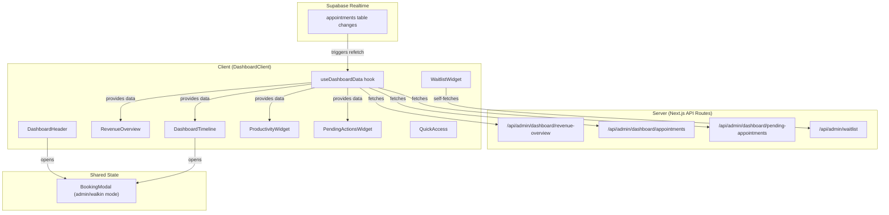
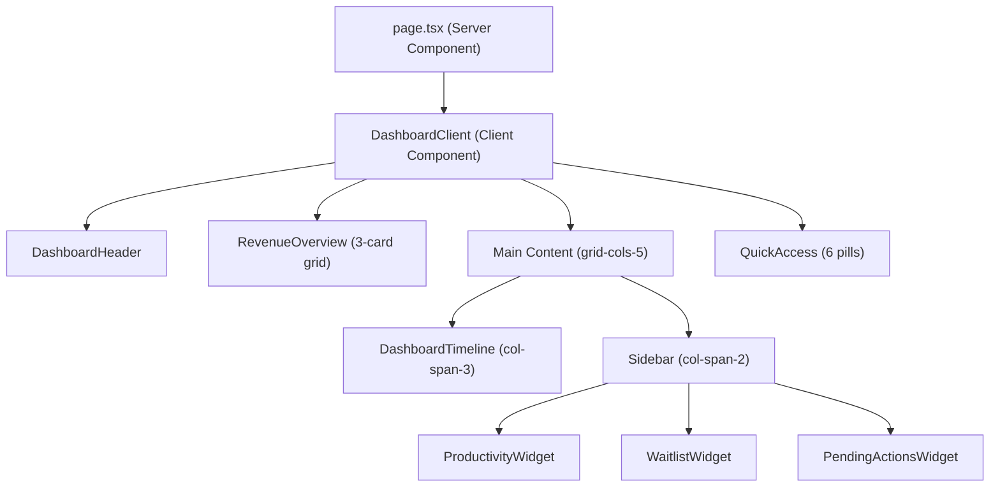
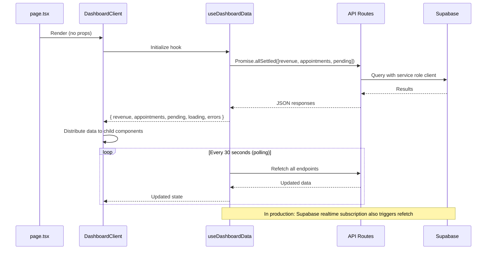

# Admin Dashboard Redesign - Design Document

> **Version**: 1.0
> **Created**: 2026-03-06
> **Status**: Draft
> **Feature**: Admin Dashboard Redesign

---

## 1. Overview

### 1.1 Summary

The Admin Dashboard Redesign transforms the existing admin dashboard from a basic stats-and-list layout into a modern, information-dense command center for The Puppy Day grooming business. The redesign introduces a visual timeline for daily schedule management, multi-period revenue tracking with trend indicators, sidebar productivity widgets, and a streamlined quick-access navigation strip.

### 1.2 Business Value

- **Faster decision-making**: Revenue trends and capacity metrics at a glance reduce the need to navigate to the Analytics page for daily operational decisions.
- **Reduced appointment management time**: The timeline view with inline status actions eliminates navigating to the Appointments page for routine status updates.
- **Improved situational awareness**: The "now" indicator, pending actions widget, and waitlist widget surface time-sensitive information proactively.
- **Cleaner navigation**: Compact quick-access pills reduce visual clutter while maintaining one-click access to the most-used admin sections.

### 1.3 Scope

**In scope**:
- New revenue overview API endpoint with multi-period comparison
- Vertical timeline component for daily schedule visualization
- Sidebar widgets (Productivity, Waitlist, Pending Actions)
- Dashboard header with date display and action buttons
- Quick access redesign from cards to compact pills
- Centralized data hook with polling and realtime support
- Responsive layout for desktop (60/40 grid) and mobile (stacked)

**Out of scope**:
- Changes to the Appointments calendar page
- New database tables or schema changes
- Analytics page modifications
- Mobile-native app considerations

### 1.4 Key Architectural Decisions

| Decision | Rationale |
|----------|-----------|
| Client-side data fetching via `useDashboardData` hook instead of server-side props | Enables realtime/polling updates without full page reloads. Existing `useDashboardRealtime` pattern already proves this approach. |
| Single revenue API endpoint returning all three periods | Reduces HTTP requests from 3 to 1. Period calculations share the same date logic, making server-side aggregation efficient. |
| `Promise.allSettled` for parallel data fetching | One failed endpoint (e.g., waitlist) should not block rendering of other widgets. Each widget handles its own error state. |
| SVG progress ring computed client-side | Productivity metrics derive entirely from the appointments array already in memory -- no additional API call needed. |
| Framer Motion for timeline card animations | Consistent with existing animation patterns throughout the admin panel (`ANIMATION` constants in `calendar/constants.ts`). |

---

## 2. Architecture

### 2.1 High-Level System Design



### 2.2 Page Layout Structure



### 2.3 Data Flow



### 2.4 Responsive Behavior

| Breakpoint | Layout |
|------------|--------|
| `< 768px` (mobile) | Single column stack: Header -> Revenue (1 col) -> Timeline (full width) -> Widgets (stacked) -> Quick Access (2x3 grid) |
| `768px - 1023px` (tablet) | Revenue: 3 cols. Main: single column (timeline full, widgets below). Quick Access: 3x2 grid. |
| `>= 1024px` (desktop) | Revenue: 3 cols. Main: `grid-cols-5` (timeline `col-span-3`, sidebar `col-span-2`). Quick Access: 6 pills inline. |

---

## 3. Components and Interfaces

### 3.1 DashboardHeader

**File**: `src/components/admin/dashboard/DashboardHeader.tsx`
**Status**: NEW

**Purpose**: Displays the page title, current date, and primary action buttons (New Booking, Walk-in).

**Props**:
```typescript
interface DashboardHeaderProps {
  onNewBooking: () => void;
  onWalkIn: () => void;
}
```

**Behavior**:
- Displays "Dashboard" heading and formatted date string (e.g., "Thursday, March 6, 2026") using `formatDateInBusinessTimezone` from `src/lib/utils/timezone.ts`.
- "New Booking" button: charcoal primary style, opens `BookingModal` in `admin` mode.
- "Walk-in" button: outlined/secondary style on desktop, remains as existing FAB pattern on mobile (reuses `WalkInButton` responsive behavior).
- On mobile (`< md`), the date line wraps below the heading. Buttons stack or the Walk-in button becomes the existing FAB.

**Design tokens**:
- Heading: `text-3xl font-bold text-[#434E54]`
- Date: `text-[#434E54]/60 text-sm`
- Buttons: reuse existing `btn` patterns from `WalkInButton.tsx` (`bg-[#434E54] hover:bg-[#363F44] text-white rounded-xl shadow-md`)

### 3.2 RevenueOverview

**File**: `src/components/admin/dashboard/RevenueOverview.tsx`
**Status**: NEW (replaces `DashboardStats.tsx`)

**Purpose**: Displays three revenue metric cards with trend indicators for Today, This Week, and This Month.

**Props**:
```typescript
interface RevenueData {
  today: {
    completed: number;
    pending: number;
    total: number;
    changePercent: number | null;
  };
  thisWeek: {
    total: number;
    changePercent: number | null;
  };
  thisMonth: {
    total: number;
    changePercent: number | null;
  };
}

interface RevenueOverviewProps {
  data: RevenueData | null;
  loading: boolean;
  error: boolean;
  onRetry: () => void;
}
```

**Behavior**:
- Three cards in a `grid-cols-1 md:grid-cols-3 gap-4` layout.
- Each card displays:
  - Label (e.g., "Today's Revenue")
  - Revenue amount in bold (`text-2xl font-bold text-[#434E54]`)
  - Trend badge with icon using the pattern from `KPICard.tsx`: `TrendingUp` (green), `TrendingDown` (red), `Minus` (gray)
  - Comparison text (e.g., "vs yesterday")
- Today's card additionally shows "Completed: $X | Pending: $Y" subtitle in smaller text.
- Animated number transitions reusing the `StatCard` animation pattern from `DashboardStats.tsx` (500ms, 20 steps).
- When `changePercent` is `null`, the trend badge shows "N/A" in gray.
- Loading state: skeleton placeholders matching card dimensions.
- Error state: cards show "--" with retry icon button.

**Design decisions**:
- Reuses the existing `StatCard` animated counter logic rather than introducing a new animation library.
- Trend badge pattern taken directly from `KPICard.tsx` for visual consistency with the Analytics page.

### 3.3 DashboardTimeline

**File**: `src/components/admin/dashboard/DashboardTimeline.tsx`
**Status**: NEW (replaces `TodayAppointments.tsx`)

**Purpose**: Vertical timeline view of today's schedule with time markers, appointment cards, a "now" indicator, and inline status actions.

**Props**:
```typescript
interface DashboardTimelineProps {
  appointments: Appointment[];
  onStatusUpdate: (id: string, newStatus: AppointmentStatus) => void;
  onAppointmentClick: (appointmentId: string) => void;
}
```

**Sub-components**:

#### TimeMarker
Renders hour labels (9 AM - 5 PM) along the left edge of the timeline, sourced from `BUSINESS_HOURS` in `src/components/admin/appointments/calendar/constants.ts`.

#### NowIndicator
- Colored horizontal line (using `THEME.primary` or a distinct accent) positioned proportionally within the timeline based on current time relative to business hours.
- Pulsing dot on the left edge (`animate-pulse`).
- Updates position every 60 seconds via `setInterval`.
- Auto-scrolls into view on mount using `scrollIntoView({ behavior: 'smooth', block: 'center' })`.
- Only visible when current time falls within business hours.

#### TimelineAppointmentCard
- Compact horizontal card positioned at the correct time slot.
- Left color stripe (4px wide) using `STATUS_COLORS` from `calendar/constants.ts`.
- Content: time, customer name, pet name + breed, service name, price.
- Status badge (reuses existing `StatusBadge` component).
- Quick action button (Confirm/Start/Complete) using `getNextAction()` pattern from `TodayAppointments.tsx`.
- Click handler opens `AppointmentDetailModal`.
- Framer Motion entrance: `initial={{ opacity: 0, x: -10 }} animate={{ opacity: 1, x: 0 }}` with staggered delay.

#### Available Slot Gaps
- Time slots without appointments render as subtle dashed-border gaps (`border-dashed border-[#EAE0D5]`).

**Container**:
- White card wrapper: `bg-white rounded-xl shadow-sm p-4 lg:p-5`
- Header: "Today's Schedule" + count badge + "View Calendar" link (matching existing `TodayAppointments` header pattern)
- Scrollable body: `max-h-[calc(100vh-300px)] overflow-y-auto`
- Empty state: dog silhouette icon (from Lucide `Dog` icon or custom SVG), "No appointments scheduled" message

**Design decisions**:
- The timeline uses a relative positioning model where each hour occupies equal vertical space (e.g., 80px per hour). Appointments are placed at their corresponding offset. This keeps layout simple without a full calendar grid system.
- Status actions reuse the exact same API call pattern (`/api/admin/appointments/{id}/status` POST) as the existing `TodayAppointments` component.

### 3.4 ProductivityWidget

**File**: `src/components/admin/dashboard/ProductivityWidget.tsx`
**Status**: NEW

**Purpose**: "Your Day" summary card with a circular progress ring and key productivity metrics.

**Props**:
```typescript
interface ProductivityWidgetProps {
  appointments: Appointment[];
  loading: boolean;
}
```

**Behavior**:
- SVG circular progress ring showing completed vs total appointments.
  - Ring dimensions: 80x80px, stroke width 8px.
  - Background ring: `stroke="#EAE0D5"`, foreground: `stroke="#434E54"`.
  - Center text: "3/7" (completed/total) in bold.
  - Framer Motion `strokeDashoffset` animation on mount.
- Stat row below the ring:
  - **Capacity**: `(completed + in_progress) / total * 100` as percentage.
  - **Avg Revenue/Apt**: total revenue of completed appointments / completed count.
- All values computed client-side from the `appointments` array passed from `useDashboardData`.
- No additional API calls required.
- Loading state: gray placeholder ring and skeleton stat values.

**Design decisions**:
- Pure client-side computation avoids an extra API round-trip. The appointments data is already fetched by the centralized hook.
- The SVG ring uses standard `strokeDasharray`/`strokeDashoffset` technique, animated with Framer Motion's `animate` prop for a smooth entrance.

### 3.5 WaitlistWidget

**File**: `src/components/admin/dashboard/WaitlistWidget.tsx`
**Status**: NEW

**Purpose**: Compact waitlist summary showing active count, fill rate, and top entries.

**Props**: None (self-fetching component).

**Behavior**:
- Self-fetches from `/api/admin/waitlist?status=active&limit=3&sort_by=priority&sort_order=desc`.
- Displays:
  - Header: "Waitlist" with active count badge.
  - Fill rate progress bar: `(booked / total) * 100`. Bar uses `bg-[#434E54]` fill on `bg-[#EAE0D5]` track.
  - Top 3 entries: customer name, pet name, requested date.
  - "View All" link to `/admin/waitlist`.
- Empty state: bone icon (`Bone` from Lucide) with "No active waitlist entries" message.
- Loading state: skeleton rows.
- Error state: brief error message with retry button.
- Auto-refreshes every 60 seconds (mirrors `CalendarSyncWidget` refresh pattern with `visibilitychange` awareness).

**Design decisions**:
- Self-fetching rather than centralized because waitlist data has a different refresh cadence and is not needed by other widgets. This keeps `useDashboardData` focused on appointment-related data.
- Uses the existing `/api/admin/waitlist` endpoint with query parameters -- no new API endpoint needed.

### 3.6 PendingActionsWidget

**File**: `src/components/admin/dashboard/PendingActionsWidget.tsx`
**Status**: NEW (replaces `PendingAppointments.tsx`)

**Purpose**: "Needs Attention" card highlighting appointments requiring action, limited to 5 entries.

**Props**:
```typescript
interface PendingActionsWidgetProps {
  appointments: Appointment[];
  onConfirm: (id: string) => void;
  onAppointmentClick: (appointmentId: string) => void;
}
```

**Behavior**:
- Header: "Needs Attention" with amber count badge (`bg-amber-100 text-amber-800`).
- Lists up to 5 pending appointments, each with:
  - Customer name, pet name, scheduled time.
  - Confirm button (reuses status update pattern from `PendingAppointments.tsx`).
  - Click opens `AppointmentDetailModal`.
- "View All" link to `/admin/appointments?status=pending` when more than 5 exist.
- Empty state: "All caught up!" message with a paw-print checkmark icon.
- Data comes from the `useDashboardData` hook (pending appointments endpoint), not self-fetched.

**Design decisions**:
- Reduces max visible items from 10 (current `PendingAppointments`) to 5, since this is now a sidebar widget rather than a half-page section.
- Reuses the exact same `POST /api/admin/appointments/{id}/status` confirm pattern.

### 3.7 QuickAccess (MODIFIED)

**File**: `src/components/admin/dashboard/QuickAccess.tsx`
**Status**: MODIFY

**Changes**:
- Switch from 8 descriptive cards (`QuickAccessCard` with title + description + icon) to 6 compact icon+label pills.
- Layout: `flex flex-wrap gap-3` horizontal row.
- Each pill: `inline-flex items-center gap-2 px-4 py-2.5 bg-white rounded-xl shadow-sm hover:shadow-md transition-all text-sm font-medium text-[#434E54]`
- Icon size reduced from `w-6 h-6` to `w-4 h-4`.

**Items retained** (6):
| Label | Icon | href |
|-------|------|------|
| Appointments | `Calendar` | `/admin/appointments` |
| Waitlist | `Clock` | `/admin/waitlist` |
| Customers | `Users` | `/admin/customers` |
| Services | `Scissors` | `/admin/services` |
| Analytics | `BarChart3` | `/admin/analytics` |
| Settings | `Settings` | `/admin/settings` |

**Items removed**: Add-ons (`Plus`), Gallery (`Images`) -- less frequently accessed from the dashboard.

### 3.8 useDashboardData Hook

**File**: `src/hooks/admin/use-dashboard-data.ts`
**Status**: NEW (extends pattern from `use-dashboard-realtime.ts`)

**Purpose**: Centralized data fetching for all dashboard widgets with polling, error isolation, and realtime subscription.

**Interface**:
```typescript
interface DashboardData {
  revenue: RevenueData | null;
  appointments: Appointment[];
  pendingAppointments: Appointment[];
  loading: {
    revenue: boolean;
    appointments: boolean;
    pending: boolean;
  };
  errors: {
    revenue: boolean;
    appointments: boolean;
    pending: boolean;
  };
  isConnected: boolean;
  isPolling: boolean;
  refetch: () => void;
}

function useDashboardData(): DashboardData;
```

**Behavior**:
- On mount, fires `Promise.allSettled` for three endpoints:
  - `GET /api/admin/dashboard/revenue-overview`
  - `GET /api/admin/dashboard/appointments`
  - `GET /api/admin/dashboard/pending-appointments`
- Each endpoint's loading and error state is tracked independently.
- 30-second polling interval (configurable).
- In production (non-mock mode), establishes Supabase realtime subscription on `appointments` table filtered to today's date range (same pattern as `useDashboardRealtime`). On any change event, triggers a refetch of all endpoints.
- Falls back to polling when realtime subscription fails (connection status tracking).
- Exposes `refetch()` for manual refresh (e.g., after a booking modal completes).
- Respects `document.visibilityState` -- pauses polling when tab is hidden.

**Design decisions**:
- Replaces `useDashboardRealtime` by consolidating all data fetching into one hook. The old hook only fetched stats and appointments; this hook adds revenue overview and manages all state centrally.
- `Promise.allSettled` ensures partial failures are gracefully handled -- a revenue API failure should not prevent appointments from displaying.

### 3.9 DashboardClient (MODIFIED)

**File**: `src/app/admin/dashboard/DashboardClient.tsx`
**Status**: MODIFY

**Changes**:
- Remove `DashboardClientProps` (no more server-passed initial data).
- Use `useDashboardData()` hook as sole data source.
- Manage `BookingModal` open/close state for header action buttons.
- New layout structure:

```tsx
<>
  {/* Connection status banners (existing pattern) */}
  <DashboardHeader onNewBooking={openBooking} onWalkIn={openWalkIn} />
  <RevenueOverview data={revenue} loading={...} error={...} onRetry={refetch} />

  <div className="grid grid-cols-1 lg:grid-cols-5 gap-6">
    {/* Timeline: 60% */}
    <div className="lg:col-span-3">
      <DashboardTimeline
        appointments={appointments}
        onStatusUpdate={handleStatusUpdate}
        onAppointmentClick={handleAppointmentClick}
      />
    </div>

    {/* Sidebar: 40% */}
    <div className="lg:col-span-2 space-y-6">
      <ProductivityWidget appointments={appointments} loading={...} />
      <WaitlistWidget />
      <PendingActionsWidget
        appointments={pendingAppointments}
        onConfirm={handleConfirm}
        onAppointmentClick={handleAppointmentClick}
      />
    </div>
  </div>

  <QuickAccess />

  {/* Modals */}
  <BookingModal mode={bookingMode} isOpen={isBookingOpen} onClose={closeBooking} />
  <AppointmentDetailModal ... />
</>
```

### 3.10 page.tsx (SIMPLIFIED)

**File**: `src/app/admin/dashboard/page.tsx`
**Status**: MODIFY

**Changes**:
- Remove `getDashboardData()` server function (all fetching moves to client hook).
- Becomes a thin server component:

```tsx
export default function AdminDashboard() {
  return (
    <div className="space-y-6">
      <DashboardClient />
    </div>
  );
}
```

---

## 4. Data Models

### 4.1 Revenue Overview API Response

**Endpoint**: `GET /api/admin/dashboard/revenue-overview`
**File**: `src/app/api/admin/dashboard/revenue-overview/route.ts` (NEW)

```typescript
export interface RevenueOverviewResponse {
  today: {
    completed: number;   // Sum of total_price where status = 'completed'
    pending: number;     // Sum of total_price where status in ('pending','confirmed','in_progress')
    total: number;       // completed + pending
    changePercent: number | null; // % change vs yesterday's total, null if no yesterday data
  };
  thisWeek: {
    total: number;       // Sum of total_price for current Mon-Sat
    changePercent: number | null; // % change vs last week's total
  };
  thisMonth: {
    total: number;       // Sum of total_price for current calendar month
    changePercent: number | null; // % change vs last month's total
  };
}
```

**Query logic**:
- Uses `getTodayInBusinessTimezone()` for "today" boundaries.
- Week boundaries: Monday 00:00 to current time (business timezone), compared with same range last week.
- Month boundaries: 1st of month 00:00 to current time, compared with same day range last month.
- All date calculations use `date-fns-tz` with `BUSINESS_TIMEZONE` constant.
- Excludes `cancelled` and `no_show` statuses.
- Auth: `createServerSupabaseClient()` + `requireAdmin()`, then queries with service role client for RLS bypass (following the admin API + RLS pattern documented in `ARCHITECTURE.md`).

**Mock mode**: Returns static realistic data:
```typescript
{
  today: { completed: 220, pending: 100, total: 320, changePercent: 12 },
  thisWeek: { total: 1840, changePercent: 8 },
  thisMonth: { total: 6200, changePercent: 5 }
}
```

### 4.2 Existing Endpoints (Unchanged)

| Endpoint | Purpose | Used By |
|----------|---------|---------|
| `GET /api/admin/dashboard/appointments` | Today's appointments with relations | `useDashboardData`, `DashboardTimeline`, `ProductivityWidget` |
| `GET /api/admin/dashboard/pending-appointments` | All pending appointments | `useDashboardData`, `PendingActionsWidget` |
| `POST /api/admin/appointments/{id}/status` | Update appointment status | `DashboardTimeline`, `PendingActionsWidget` |
| `GET /api/admin/waitlist` | Waitlist entries with filtering | `WaitlistWidget` |

### 4.3 Appointment Type (Existing)

The `Appointment` type used throughout the dashboard is the joined query result:

```typescript
type Appointment = Tables<'appointments'> & {
  customer?: Tables<'users'> | null;
  pet?: (Tables<'pets'> & {
    breed?: Tables<'breeds'> | null;
  }) | null;
  service?: Tables<'services'> | null;
};
```

Key fields consumed by dashboard components:
- `id`, `scheduled_at`, `status`, `total_price`, `notes`
- `customer.first_name`, `customer.last_name`
- `pet.name`, `pet.size`, `pet.breed.name`
- `service.name`

---

## 5. Error Handling

### 5.1 Error Isolation Strategy

Each data source has independent error tracking in `useDashboardData`:

| Data Source | On Error | User Experience |
|-------------|----------|-----------------|
| Revenue Overview | `errors.revenue = true` | Revenue cards show "--" with retry icon |
| Appointments | `errors.appointments = true` | Timeline shows empty state with error message and retry button |
| Pending Appointments | `errors.pending = true` | Pending widget shows error state with retry |
| Waitlist (self-fetched) | Internal error state | Widget shows error with retry button |

### 5.2 Connection Status

- **Realtime connected**: Green banner with `Wifi` icon (existing pattern from `DashboardClient.tsx`).
- **Realtime disconnected, polling active**: Yellow banner with `WifiOff` icon, "Data refreshes every 30 seconds" message.
- **All connections failed**: Red banner with `AlertCircle` icon, manual retry button.

### 5.3 API Error Responses

The new revenue-overview endpoint follows the existing error response pattern:

```typescript
// 401 Unauthorized
{ error: 'Unauthorized' }

// 500 Internal Server Error
{ error: 'Failed to fetch revenue overview' }
```

### 5.4 Optimistic Updates

Status update actions (Confirm, Start, Complete) use the same optimistic update pattern as the existing components:
1. Disable the action button, show "Updating..." text.
2. Call `POST /api/admin/appointments/{id}/status`.
3. On success: update local state via the `onStatusUpdate` callback, show success toast.
4. On failure: re-enable button, show error toast. No local state change (current behavior).

---

## 6. Testing Strategy

### 6.1 Unit Tests

| Component | Key Test Cases |
|-----------|---------------|
| `RevenueOverview` | Renders three cards with correct values; handles null changePercent; shows loading skeletons; shows error state with retry; animated counter updates on data change |
| `DashboardTimeline` | Renders time markers for all business hours; positions appointments at correct offsets; renders NowIndicator within business hours; hides NowIndicator outside business hours; shows available slot gaps; handles empty appointments array; click triggers `onAppointmentClick` |
| `NowIndicator` | Calculates correct position proportion; auto-scrolls on mount; updates position on interval |
| `ProductivityWidget` | Computes correct completion ratio; handles zero appointments; computes capacity percentage; computes average revenue |
| `WaitlistWidget` | Fetches and displays entries; handles empty state with bone icon; shows error state; retries on failure |
| `PendingActionsWidget` | Renders up to 5 items; shows "View All" when > 5; shows "All caught up" when empty; confirm action calls API |
| `QuickAccess` | Renders 6 pills (not 8); each links to correct href |
| `DashboardHeader` | Renders current date; calls onNewBooking/onWalkIn on button clicks |

### 6.2 Hook Tests

| Hook | Key Test Cases |
|------|---------------|
| `useDashboardData` | Fetches all three endpoints on mount; handles partial failures with `Promise.allSettled`; polls at 30s interval; pauses polling when tab hidden; resumes polling on visibility change; `refetch()` triggers immediate fetch; tracks independent loading/error states |

### 6.3 API Tests

| Endpoint | Key Test Cases |
|----------|---------------|
| `GET /api/admin/dashboard/revenue-overview` | Returns correct structure; calculates today's completed/pending correctly; returns null changePercent when no prior data; rejects non-admin users with 401; handles database errors gracefully |

### 6.4 Integration Tests

- Full dashboard render with mock data: all sections visible, correct layout.
- Booking modal opens in correct mode from header buttons.
- Appointment status update from timeline card updates both timeline and pending widget.
- Realtime subscription triggers data refresh across all widgets.

### 6.5 Visual / Responsive Tests

- Desktop (1280px+): 60/40 grid layout, 3-column revenue row, inline quick access pills.
- Tablet (768px): 3-column revenue, stacked main content, 3x2 quick access grid.
- Mobile (375px): Single column throughout, Walk-in FAB visible, header buttons stack.

---

## 7. Implementation Phases

### Phase A: Foundation (Revenue API + Data Hook + Header)
1. Create `/api/admin/dashboard/revenue-overview/route.ts` with mock mode support.
2. Create `useDashboardData` hook with polling and `Promise.allSettled`.
3. Create `DashboardHeader` component.
4. Update `DashboardClient` to use new hook (remove server props).
5. Simplify `page.tsx` to thin server component.

### Phase B: Revenue Overview Component
1. Create `RevenueOverview.tsx` with three-card grid.
2. Port animated counter from `DashboardStats.tsx`.
3. Implement trend badges from `KPICard.tsx` pattern.
4. Add loading skeletons and error state.

### Phase C: Dashboard Timeline
1. Create `DashboardTimeline.tsx` with time markers.
2. Implement `TimelineAppointmentCard` with status stripe and actions.
3. Implement `NowIndicator` with position calculation and auto-scroll.
4. Add available slot gap rendering.
5. Add Framer Motion entrance animations.
6. Add empty state.

### Phase D: Sidebar Widgets
1. Create `ProductivityWidget.tsx` with SVG progress ring.
2. Create `WaitlistWidget.tsx` with self-fetching.
3. Create `PendingActionsWidget.tsx` with confirm actions.

### Phase E: Quick Access Redesign + Layout Assembly
1. Modify `QuickAccess.tsx` to compact pill layout (6 items).
2. Assemble full layout in `DashboardClient.tsx` (header + revenue + grid + quick access).
3. Wire `BookingModal` for header action buttons.
4. Update `index.ts` exports.

### Phase F: Polish and Testing
1. Responsive testing and adjustments.
2. Animation polish (stagger timing, spring configs).
3. Accessibility audit (ARIA labels, keyboard navigation, focus management).
4. Remove deprecated files (`DashboardStats.tsx`, `TodayAppointments.tsx`, `PendingAppointments.tsx`).
5. Update architecture docs.

---

## 8. Files Affected

### New Files
| File | Description |
|------|-------------|
| `src/app/api/admin/dashboard/revenue-overview/route.ts` | Revenue overview API endpoint |
| `src/components/admin/dashboard/DashboardHeader.tsx` | Dashboard header with date and actions |
| `src/components/admin/dashboard/RevenueOverview.tsx` | Three-card revenue metrics |
| `src/components/admin/dashboard/DashboardTimeline.tsx` | Vertical timeline schedule view |
| `src/components/admin/dashboard/ProductivityWidget.tsx` | Circular progress + stats widget |
| `src/components/admin/dashboard/WaitlistWidget.tsx` | Self-fetching waitlist summary |
| `src/components/admin/dashboard/PendingActionsWidget.tsx` | Pending appointments actions widget |
| `src/hooks/admin/use-dashboard-data.ts` | Centralized dashboard data hook |

### Modified Files
| File | Changes |
|------|---------|
| `src/app/admin/dashboard/page.tsx` | Remove server data fetching, simplify to thin wrapper |
| `src/app/admin/dashboard/DashboardClient.tsx` | Remove props, use new hook, new 4-section layout |
| `src/components/admin/dashboard/QuickAccess.tsx` | Redesign to 6 compact pills |
| `src/components/admin/dashboard/index.ts` | Update exports |

### Files to Remove
| File | Replaced By |
|------|-------------|
| `src/components/admin/dashboard/DashboardStats.tsx` | `RevenueOverview.tsx` |
| `src/components/admin/dashboard/TodayAppointments.tsx` | `DashboardTimeline.tsx` |
| `src/components/admin/dashboard/PendingAppointments.tsx` | `PendingActionsWidget.tsx` |

### Files Retained (Unchanged)
| File | Reason |
|------|--------|
| `src/components/admin/dashboard/ActivityFeed.tsx` | Not part of redesign scope |
| `src/components/admin/dashboard/WalkInButton.tsx` | Mobile FAB behavior reused |
| `src/components/admin/dashboard/CalendarSyncWidget.tsx` | Independent widget, not affected |
| `src/hooks/admin/use-dashboard-realtime.ts` | Superseded by `use-dashboard-data.ts` but retained until migration verified |
