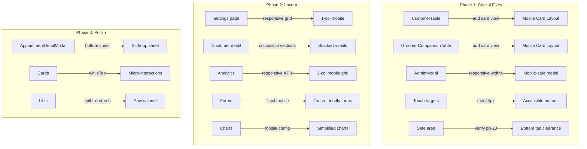

# Admin Mobile Responsiveness — Design Document

> **Feature:** Admin Mobile Responsiveness — Progressive Improvement
> **Status:** Draft
> **Created:** 2026-03-17
> **Requirements:** User-provided improvement plan (no formal requirements.md)

---

## 1. Overview

- **Purpose:** Fix broken/unusable mobile experiences across all admin pages, then progressively enhance with POS-inspired polish. Covers tables (REQ-1a/1b), modals (REQ-1c), touch targets (REQ-1d), safe areas (REQ-1e), layout restructuring (REQ-2a-2d), and polish (REQ-3a-3c).
- **Business Value:** Admin users (groomers, front desk) increasingly use phones/tablets during client interactions. Broken mobile UX forces desktop-only workflows, slowing operations.
- **Scope:** UI-only changes across admin components. No database, API, or business logic modifications.

### Key Design Decisions

| Decision | Rationale |
|----------|-----------|
| `hidden lg:block` table + `lg:hidden` card pattern | Proven pattern already working in `WaitlistTable.tsx`; consistent breakpoint with existing sidebar hide |
| Modify `AdminModal` base component for responsive widths | Single fix propagates to all modals using the shared component; specific modals get overrides only when needed |
| Bottom sheet on mobile only in Phase 3 | Phase 1-2 focus on fixing breakages; bottom sheets are polish and require drag gesture handling |
| Use existing Zustand `currentBreakpoint` state | Already tracked in `admin-store.ts`; avoids new state or hooks |
| `lg:` as primary responsive breakpoint | Matches existing admin layout breakpoint (sidebar hides at `<lg:`); `sm:` added as intermediate |

## 2. Architecture

### High-Level Change Map



### File Modification Summary

| File | Action | Phase | Description |
|------|--------|-------|-------------|
| `src/components/admin/customers/CustomerTable.tsx` | Modify | 1a | Add `hidden lg:block` table + `lg:hidden` mobile card view |
| `src/components/admin/analytics/GroomerComparisonTable.tsx` | Modify | 1b | Add `hidden lg:block` table + `lg:hidden` mobile card view |
| `src/components/admin/shared/AdminModal.tsx` | Modify | 1c | Add responsive width classes, reduce mobile padding |
| `src/components/admin/appointments/AppointmentDetailModal.tsx` | Modify | 1c | Add mobile near-fullscreen behavior |
| `src/components/admin/gallery/GalleryUploadModal.tsx` | Modify | 1c | Add responsive max-width |
| `src/components/admin/gallery/GalleryImageEditModal.tsx` | Modify | 1c | Add responsive max-width |
| `src/components/admin/marketing/CreateCampaignModal.tsx` | Modify | 1c | Add responsive max-width |
| `src/components/admin/calendar/import/ImportWizard.tsx` | Modify | 1c | Add responsive max-width |
| `src/app/admin/settings/page.tsx` | Modify | 2a | Responsive grid |
| `src/app/admin/customers/[id]/page.tsx` | Modify | 2a | Collapsible sections, single-col mobile |
| `src/app/admin/analytics/page.tsx` | Modify | 2a | Responsive KPI grid |
| `src/app/admin/notifications/*/page.tsx` | Modify | 2a | Stack side-by-side layouts on mobile |
| `src/app/admin/staff/page.tsx` | Modify | 2a | Mobile layout audit |
| Various settings forms | Modify | 2b | `grid-cols-1 sm:grid-cols-2` |
| `src/components/admin/dashboard/RevenueOverview.tsx` | Modify | 2c | Mobile chart config |
| Analytics chart components | Modify | 2c | Mobile-optimized legends/ticks |

## 3. Components & Interfaces

### 3a. CustomerTable Mobile Card View

Add below the existing `<div className="overflow-x-auto">` block, wrapping the table in `hidden lg:block` and adding a sibling `lg:hidden` card view.

```typescript
// No new interfaces needed — reuses existing CustomerWithStats

// Mobile card layout structure (inside CustomerTable component):
// <div className="lg:hidden space-y-3">
//   {customers.map(customer => (
//     <div className="rounded-xl bg-white shadow-sm p-4 border border-[#434E54]/5"
//          onClick={() => handleRowClick(customer.id)}>
//       {/* Header: Name + Flag badges */}
//       {/* 2-col grid: Phone | Pets count | Appointments | Join date */}
//     </div>
//   ))}
// </div>
```

Card layout per customer:
- **Header row:** `font-medium text-[#434E54]` name, right-aligned `<CustomerFlagBadge>` (max 2 visible)
- **Details grid:** `grid grid-cols-2 gap-2 text-sm` with phone, pets count, appointments count
- **Tap target:** Entire card is tappable via `onClick={handleRowClick}`, `cursor-pointer`
- **Infinite scroll sentinel:** Moved outside both views so it works in both

### 3b. GroomerComparisonTable Mobile Card View

Same pattern. Each groomer card shows:
- **Header:** Groomer name
- **Stats grid:** `grid grid-cols-2 gap-2` with appointments, revenue, rating, addon rate, completion rate
- **Below-average indicators:** Red text + `TrendingDown` icon for metrics below team average

### 3c. AdminModal Responsive Updates

```typescript
// Updated AdminModal — changes to the motion.div className:
// Before:
className={`bg-white rounded-2xl shadow-2xl ${maxWidth} w-full overflow-hidden max-h-[90vh] flex flex-col`}

// After:
className={`bg-white rounded-2xl shadow-2xl ${maxWidth} w-full max-sm:max-w-[calc(100vw-2rem)] overflow-hidden max-h-[90vh] flex flex-col`}

// Header padding change:
// Before: "p-6 pb-4"
// After:  "p-4 sm:p-6 pb-4"

// Footer padding change:
// Before: "p-6 pt-4"
// After:  "p-4 sm:p-6 pt-4"

// Close button touch target:
// Before: "p-2 rounded-lg"
// After:  "p-2 min-h-[44px] min-w-[44px] flex items-center justify-center rounded-lg"
```

### 3d. AppointmentDetailModal Mobile Treatment

The `AppointmentDetailModal` does not use `AdminModal` — it has its own motion wrapper. Changes:

```typescript
// Current: max-w-[900px]
// Mobile override: add max-sm:max-w-[calc(100vw-1rem)] max-sm:max-h-[calc(100vh-2rem)] max-sm:rounded-b-none
// This makes it near-fullscreen on mobile while maintaining desktop appearance
```

### 3e. Gallery/Campaign Modals

These also have custom wrappers (not `AdminModal`). Add `max-sm:max-w-[calc(100vw-2rem)]` to each:

| Modal | Current max-width | Addition |
|-------|-------------------|----------|
| `GalleryUploadModal` | `max-w-3xl` | `max-sm:max-w-[calc(100vw-2rem)]` |
| `GalleryImageEditModal` | `max-w-4xl` | `max-sm:max-w-[calc(100vw-2rem)]` |
| `CreateCampaignModal` | `max-w-4xl` | `max-sm:max-w-[calc(100vw-2rem)]` |
| `ImportWizard` | `max-w-4xl` | `max-sm:max-w-[calc(100vw-2rem)]` |

## 4. Data Models

No database changes required. This is a UI-only feature.

## 5. State Management

No new Zustand state needed. Existing `currentBreakpoint` in `admin-store.ts` can be used by chart components in Phase 2c to conditionally configure chart options (fewer ticks, legend placement).

```typescript
// Existing in admin-store.ts — no changes needed:
currentBreakpoint: Breakpoint; // 'mobile' | 'tablet' | 'desktop'
```

Usage in chart components:
```typescript
const { currentBreakpoint } = useAdminStore();
const isMobile = currentBreakpoint === 'mobile';

// Chart.js options
const options = {
  scales: {
    x: { ticks: { maxTicksAutoSkip: isMobile ? 5 : 10, font: { size: isMobile ? 10 : 12 } } },
  },
  plugins: {
    legend: { position: isMobile ? 'bottom' as const : 'top' as const },
  },
};
```

## 6. UI Specifications

### Mobile Card View Pattern (reusable across tables)

Based on `WaitlistTable.tsx` reference implementation:

```
┌─────────────────────────────────┐
│ Customer Name          🔴 VIP   │  <- header: name + badges
│ Walk-in (phone only)            │  <- subtitle (email or walk-in)
├─────────────────────────────────┤
│ Phone         │ Pets            │  <- 2-col detail grid
│ (555) 123-... │ 🐾 3           │
│ Appointments  │                 │
│ 12            │                 │
└─────────────────────────────────┘
  Entire card is tappable → detail page
```

- Background: `bg-white rounded-xl shadow-sm`
- Border: `border border-[#434E54]/5`
- Padding: `p-4`
- Spacing between cards: `space-y-3`
- Label text: `text-[#434E54]/40 text-xs`
- Value text: `text-[#434E54] text-sm`

### Modal Mobile Behavior

- Modals on `<sm:` screens: fill width minus 1rem margin each side
- Header/footer padding reduces from `p-6` to `p-4`
- Close button: 44x44px minimum touch target
- `max-h-[90vh]` ensures modal does not extend behind bottom tabs (bottom tabs have `z-50`, modals have `z-50` but are centered in viewport)

### Touch Target Audit

Files requiring 44px minimum touch target fixes:
- `AdminModal.tsx` close button: `p-2` (36px) -> add `min-h-[44px] min-w-[44px]`
- `CustomerTable.tsx` sort header buttons: currently no min-size -> add `min-h-[44px]`
- `AppointmentDetailModal.tsx` close button: audit and fix
- Any action icon buttons in table rows

### Responsive Breakpoint Strategy

| Width | Breakpoint | Layout |
|-------|-----------|--------|
| 320-639px | `max-sm:` / default | Single column, card views, stacked forms |
| 640-767px | `sm:` | 2-column grids for forms, slightly more space |
| 768-1023px | `md:` | Tablet — icon sidebar visible, 2-col layouts |
| 1024px+ | `lg:` | Desktop — full sidebar, table views, side-by-side |

### Safe Area Verification

`AdminMainContent.tsx` already has `pb-20 lg:pb-0` which provides 80px bottom padding on mobile for the bottom tabs. This is confirmed working. No changes needed for REQ-1e.

## 7. Error Handling & Edge Cases

| Edge Case | Design Solution |
|-----------|-----------------|
| Empty customer list on mobile | Reuse existing empty state component, centered in card view container |
| Very long customer names on mobile cards | `truncate` class on name, max 1 line |
| Many flag badges on mobile | `CustomerFlagBadge` already has `maxVisible={2}` — reuse with same prop |
| Modal content taller than viewport | `max-h-[90vh]` + `overflow-y-auto` on body (already present in AdminModal) |
| Infinite scroll sentinel in dual view | Move sentinel div outside both `hidden lg:block` and `lg:hidden` containers |
| Sort controls not accessible on mobile card view | Omit sort from mobile cards; rely on search. Sort is desktop-table-only |
| Charts unreadable on small screens | Reduce tick count, move legend to bottom, increase font slightly for readability |
| Bottom tabs z-index conflict with modals | Both are `z-50` but modals use `fixed inset-0` overlay; no conflict |

## 8. Implementation Phases

### Phase 1: Critical Fixes (Broken/Unusable)

**1a. CustomerTable mobile card view**
- Wrap existing table in `hidden lg:block`
- Add `lg:hidden` card layout below
- Move sentinel div outside both views
- Verify infinite scroll works in card view

**1b. GroomerComparisonTable mobile card view**
- Same pattern as 1a
- Include below-average indicators in card layout

**1c. Modal responsive widths**
- Update `AdminModal.tsx` base: `max-sm:max-w-[calc(100vw-2rem)]`, responsive padding
- Update `AppointmentDetailModal.tsx`: mobile near-fullscreen
- Update `GalleryUploadModal.tsx`, `GalleryImageEditModal.tsx`, `CreateCampaignModal.tsx`, `ImportWizard.tsx`: add `max-sm:max-w-[calc(100vw-2rem)]`

**1d. Touch targets**
- `AdminModal` close button: 44px minimum
- `CustomerTable` sort buttons: 44px minimum
- Audit other action buttons in modified files

**1e. Safe area padding**
- Already verified: `pb-20 lg:pb-0` exists in `AdminMainContent.tsx`. No action needed.

**Verification:** Open each modified component in Chrome DevTools at 375px width. Confirm no horizontal scroll, all content visible, all buttons tappable.

### Phase 2: Layout Improvements

**2a. Content page restructuring**
- Settings index: add responsive grid
- Customer detail: single-column mobile, collapsible sections
- Notifications: stack side-by-side layouts
- Analytics: ensure `grid-cols-2 md:grid-cols-4` for KPIs
- Staff page: mobile audit

**2b. Form optimization**
- All `grid-cols-2` in settings forms -> `grid-cols-1 sm:grid-cols-2`
- Verify all inputs have `py-2.5` minimum

**2c. Charts mobile optimization**
- Use `currentBreakpoint` from Zustand for conditional chart config
- Reduce tick font, move legends below, simplify tooltips

**2d. `sm:` breakpoint sweep**
- Systematic pass through all admin components
- Add intermediate `sm:` / `md:` steps where only `lg:` exists

**Verification:** Test on 375px, 390px, 768px. Verify all grids collapse correctly, forms are single-column on mobile, charts are legible.

### Phase 3: POS-Style Polish

**3a. Bottom sheet modals**
- `AppointmentDetailModal` slides up from bottom on mobile
- Drag handle at top, drag-to-dismiss gesture
- Requires Framer Motion `useDragControls`

**3b. Micro-interactions**
- `whileTap={{ scale: 0.98 }}` on tappable cards
- Status badge transitions
- Paw print loading animations

**3c. Pull-to-refresh**
- Dashboard + appointment list
- Paw-print spinner animation
- Touch event handling for pull gesture

**Verification:** Test on real device or simulator for gesture responsiveness.

## 9. Testing Strategy

### Unit Tests

No unit tests needed — these are CSS/layout changes with no logic changes.

### Integration Tests

| Test Case | Setup | Steps | Expected Result |
|-----------|-------|-------|-----------------|
| CustomerTable mobile card view | Load customers page at 375px | Verify table hidden, cards shown | Cards visible with name, phone, pets, flags |
| CustomerTable desktop table | Load customers page at 1024px+ | Verify cards hidden, table shown | Full table with all columns |
| Infinite scroll mobile | Load 25+ customers at 375px | Scroll to bottom | More cards load via sentinel |
| AdminModal mobile width | Open any modal at 375px | Check modal width | Fills viewport minus 2rem padding |
| Touch target compliance | Open modal at 375px | Measure close button | At least 44x44px |

### Manual Verification

- [ ] CustomerTable shows card view on iPhone SE (375px)
- [ ] CustomerTable shows table view on desktop (1024px+)
- [ ] GroomerComparisonTable shows card view on mobile
- [ ] AdminModal fills mobile width without horizontal scroll
- [ ] AppointmentDetailModal is near-fullscreen on mobile
- [ ] Gallery modals fit within mobile viewport
- [ ] All modal close buttons are at least 44x44px
- [ ] Bottom tabs do not overlap content (pb-20 clearance)
- [ ] Settings page grid is single-column on mobile
- [ ] Analytics KPI cards are 2-column on mobile
- [ ] Charts are legible on 375px width
- [ ] `npm run build` passes after each phase

## 10. Risk Assessment

| Risk | Impact | Mitigation |
|------|--------|------------|
| Card view layout differs from table data | Low | Reuse same data, just different presentation |
| `max-sm:` prefix not available in Tailwind 4 | Medium | Verify Tailwind 4 supports `max-sm:`; fallback to `@media` if needed |
| Infinite scroll breaks when sentinel moves | Medium | Test thoroughly; keep sentinel outside both view containers |
| Chart.js responsive mode conflicts with manual config | Low | Use `maintainAspectRatio: false` with explicit container height |
| Phase 3 drag gestures feel janky | Low | Phase 3 is polish; can ship Phases 1-2 independently |
| Bottom sheet modal accessibility | Medium | Ensure focus trap still works, escape key dismisses, aria attributes correct |
