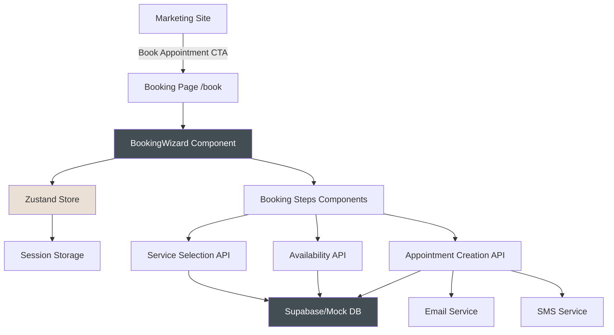
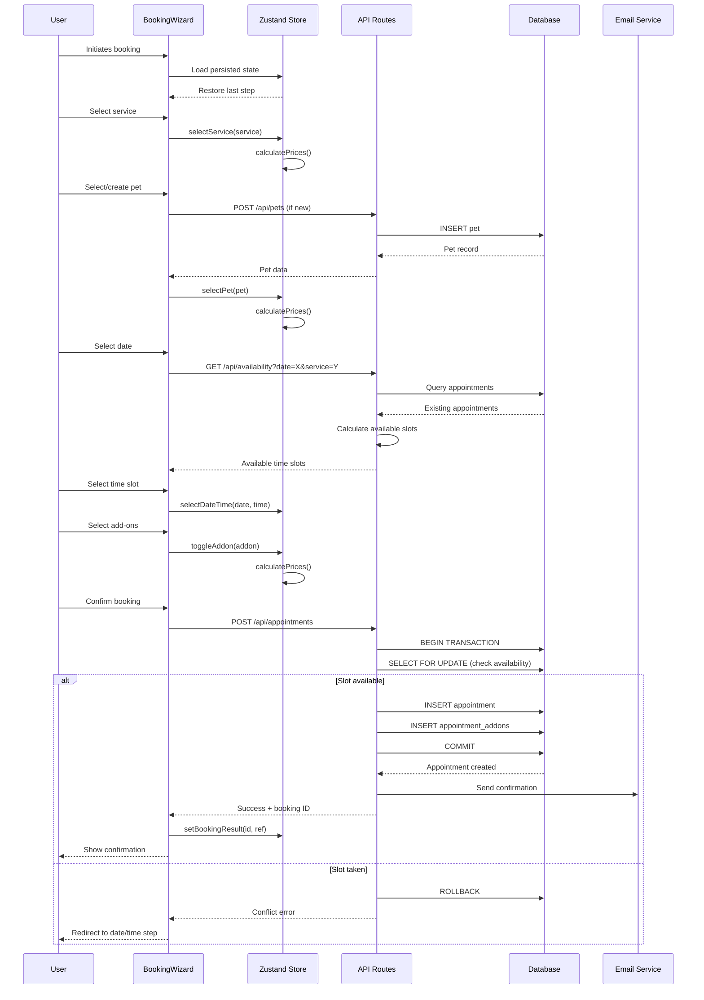

# Design Document - Phase 3: Booking System

## Executive Summary

This document provides the technical design for The Puppy Day's booking system, a multi-step wizard that enables customers to schedule grooming appointments with size-based pricing, add-ons, and waitlist functionality. The system supports both authenticated and guest booking flows, integrates seamlessly with the existing marketing site, and prevents double-booking through database-level safeguards.

### Key Architectural Decisions

1. **Multi-Step Wizard Pattern**: Breaking the booking process into 6 distinct steps (Service → Pet → Date/Time → Add-ons → Review → Confirmation) reduces cognitive load and improves conversion rates
2. **Zustand State Management with Session Persistence**: Client-side state management using Zustand with session storage provides seamless navigation between steps while preserving data on page refresh
3. **Pessimistic Locking Strategy**: Database-level transaction locking prevents race conditions and double-booking during concurrent bookings
4. **Mobile-First Responsive Design**: Touch-optimized UI with large tap targets and single-column layouts ensures excellent mobile booking experience
5. **Guest-First Booking Flow**: Postponing authentication until after booking completion reduces friction and improves conversion rates

### Implementation Timeline

- **Week 1-2**: Core booking wizard components and state management
- **Week 3**: Time slot availability logic and calendar integration
- **Week 4**: API endpoints and database transactions
- **Week 5**: Guest booking flow and waitlist integration
- **Week 6**: Testing, accessibility improvements, and polish

### Business Value

- Reduce booking abandonment through streamlined UX
- Enable 24/7 self-service booking reducing phone call volume
- Improve revenue through strategic add-on upselling
- Capture guest bookings without forcing account creation
- Prevent scheduling conflicts through automated availability management

---

## System Architecture

### High-Level Architecture



### Component Architecture

The booking system is organized into a layered architecture:

**Presentation Layer** (React Components)
- `BookingWizard.tsx` - Main wizard orchestrator
- `BookingProgress.tsx` - Progress indicator
- Step components (6 total)
- Reusable cards (ServiceCard, PetCard, AddonCard)
- Form components (PetForm, GuestInfoForm)
- Utility components (CalendarPicker, TimeSlotGrid, WaitlistModal)

**State Management Layer** (Zustand)
- `bookingStore.ts` - Central booking state with session persistence
- Step validation logic
- Price calculation logic
- Navigation guards

**Business Logic Layer** (Utilities)
- `pricing.ts` - Price calculations and formatting
- `availability.ts` - Time slot generation and conflict detection
- `validation.ts` - Form validation schemas

**Data Access Layer** (API Routes)
- `GET /api/services` - Fetch active services with prices
- `GET /api/pets` - Fetch user's pets
- `POST /api/pets` - Create new pet
- `GET /api/availability` - Get available time slots
- `POST /api/appointments` - Create appointment
- `POST /api/waitlist` - Join waitlist
- `POST /api/users/guest` - Create guest user

**Database Layer** (Supabase/PostgreSQL)
- Existing schema from Phase 1 (services, service_prices, pets, appointments, waitlist, etc.)

### Data Flow Diagram



### Integration Points

#### Existing Systems
- **Marketing Site**: "Book Now" CTAs throughout the marketing site link to `/book` with optional pre-selected service via query parameter
- **Supabase Database**: All booking data persisted to existing tables from Phase 1
- **Authentication System**: Seamlessly integrates with existing `useAuth` hook and auth provider
- **Mock Services**: Fully compatible with mock mode (`NEXT_PUBLIC_USE_MOCKS=true`)

#### External Services (Future Integration)
- **Email Service (Resend)**: Confirmation emails after booking
- **SMS Service (Twilio)**: Optional SMS confirmations
- **Stripe**: Payment processing for deposits (Phase 7)

---

## Components and Interfaces

### Core Components

#### BookingWizard Component

**Location**: `src/components/booking/BookingWizard.tsx`

**Purpose**: Main orchestrator component that manages step transitions, renders current step, and handles overall booking flow.

**Interface**:
```typescript
interface BookingWizardProps {
  initialServiceId?: string; // Pre-select service from URL param
  onComplete?: (bookingId: string) => void; // Callback on successful booking
}
```

**Key Responsibilities**:
- Render current step based on Zustand state
- Provide navigation between steps
- Handle session expiry detection
- Display loading states during API calls
- Manage error boundaries

**State Dependencies**:
```typescript
const {
  currentStep,
  setStep,
  nextStep,
  prevStep,
  canNavigateToStep,
  isSessionExpired,
  reset
} = useBookingStore();
```

#### Step Components

Each step is a self-contained component with consistent interface:

**1. ServiceStep** (`src/components/booking/steps/ServiceStep.tsx`)
```typescript
interface ServiceStepProps {
  onNext: () => void;
}

// Responsibilities:
// - Fetch and display active services
// - Show service details (name, description, price range, duration)
// - Handle service selection
// - Update Zustand store with selected service
```

**2. PetStep** (`src/components/booking/steps/PetStep.tsx`)
```typescript
interface PetStepProps {
  onNext: () => void;
  onBack: () => void;
}

// Responsibilities:
// - Display user's existing pets (if authenticated)
// - Provide "Add New Pet" option
// - Render PetForm for new pet creation
// - Update pricing based on pet size
// - Handle pet selection/creation
```

**3. DateTimeStep** (`src/components/booking/steps/DateTimeStep.tsx`)
```typescript
interface DateTimeStepProps {
  onNext: () => void;
  onBack: () => void;
}

// Responsibilities:
// - Render CalendarPicker for date selection
// - Fetch and display available time slots
// - Show waitlist option for fully booked slots
// - Handle date/time selection
// - Display estimated appointment duration
```

**4. AddonsStep** (`src/components/booking/steps/AddonsStep.tsx`)
```typescript
interface AddonsStepProps {
  onNext: () => void;
  onBack: () => void;
}

// Responsibilities:
// - Fetch and display active add-ons
// - Highlight breed-specific upsells
// - Handle multiple add-on selections
// - Update running total with animations
// - Provide "Skip" option
```

**5. ReviewStep** (`src/components/booking/steps/ReviewStep.tsx`)
```typescript
interface ReviewStepProps {
  onNext: () => void;
  onBack: () => void;
}

// Responsibilities:
// - Display complete booking summary
// - Show itemized pricing breakdown
// - Collect guest info (if not authenticated)
// - Validate all required data before submission
// - Handle appointment creation API call
// - Handle booking conflicts and errors
```

**6. ConfirmationStep** (`src/components/booking/steps/ConfirmationStep.tsx`)
```typescript
interface ConfirmationStepProps {
  // No navigation props - terminal step
}

// Responsibilities:
// - Display booking confirmation with reference number
// - Show appointment details summary
// - Provide next steps (add to calendar, print confirmation)
// - Link to customer portal (if authenticated)
// - Offer to book another appointment
```

### Reusable UI Components

#### ServiceCard
```typescript
interface ServiceCardProps {
  service: ServiceWithPrices;
  isSelected: boolean;
  onSelect: (service: ServiceWithPrices) => void;
}
```
Displays service with image, name, description, price range, and selection state.

#### PetCard
```typescript
interface PetCardProps {
  pet: Pet;
  isSelected: boolean;
  onSelect: (pet: Pet) => void;
  showSize?: boolean; // Display size badge
}
```
Displays pet with name, breed, size, and optional photo.

#### AddonCard
```typescript
interface AddonCardProps {
  addon: Addon;
  isSelected: boolean;
  onToggle: (addon: Addon) => void;
  isUpsell?: boolean; // Highlight as recommended
  upsellMessage?: string;
}
```
Checkbox-style card for add-on selection with price and description.

#### PriceSummary
```typescript
interface PriceSummaryProps {
  servicePrice: number;
  serviceName: string;
  addons: { name: string; price: number }[];
  totalPrice: number;
  showDetails?: boolean; // Expandable details
}
```
Sticky price summary component displayed throughout wizard.

#### CalendarPicker
```typescript
interface CalendarPickerProps {
  selectedDate: string | null;
  onSelectDate: (date: string) => void;
  disabledDates: string[]; // Past dates, closed days
  minDate?: Date;
  maxDate?: Date;
}
```
Calendar component with business hours awareness and date restrictions.

#### TimeSlotGrid
```typescript
interface TimeSlotGridProps {
  date: string;
  slots: TimeSlot[];
  selectedTime: string | null;
  onSelectTime: (time: string) => void;
  onJoinWaitlist: (time: string) => void;
}

interface TimeSlot {
  time: string; // "09:00"
  available: boolean;
  waitlistCount?: number;
}
```
Grid of time slots with availability indicators and waitlist integration.

#### WaitlistModal
```typescript
interface WaitlistModalProps {
  isOpen: boolean;
  onClose: () => void;
  date: string;
  time: string;
  service: ServiceWithPrices;
  pet: Pet | null;
  onJoin: (preference: TimePreference) => Promise<void>;
}
```
Modal for joining waitlist with time preference selection.

#### GuestInfoForm
```typescript
interface GuestInfoFormProps {
  onSubmit: (data: GuestInfo) => void;
  initialData?: Partial<GuestInfo>;
}

interface GuestInfo {
  firstName: string;
  lastName: string;
  email: string;
  phone: string;
}
```
Form component for collecting guest contact information with validation.

#### PetForm
```typescript
interface PetFormProps {
  onSubmit: (data: CreatePetInput) => void;
  onCancel: () => void;
  initialData?: Partial<CreatePetInput>;
}
```
Form component for creating new pet profiles during booking.

### Utility Functions and Hooks

#### usePets Hook
```typescript
interface UsePetsReturn {
  pets: Pet[];
  isLoading: boolean;
  error: Error | null;
  createPet: (data: CreatePetInput) => Promise<Pet>;
  refetch: () => Promise<void>;
}

function usePets(): UsePetsReturn;
```

#### useServices Hook
```typescript
interface UseServicesReturn {
  services: ServiceWithPrices[];
  isLoading: boolean;
  error: Error | null;
  getServiceById: (id: string) => ServiceWithPrices | undefined;
}

function useServices(): UseServicesReturn;
```

#### useAddons Hook
```typescript
interface UseAddonsReturn {
  addons: Addon[];
  isLoading: boolean;
  error: Error | null;
  getUpsellAddons: (breedId: string | null) => Addon[];
}

function useAddons(): UseAddonsReturn;
```

#### useAvailability Hook
```typescript
interface UseAvailabilityParams {
  date: string | null;
  serviceId: string | null;
}

interface UseAvailabilityReturn {
  slots: TimeSlot[];
  isLoading: boolean;
  error: Error | null;
  refetch: () => Promise<void>;
}

function useAvailability(params: UseAvailabilityParams): UseAvailabilityReturn;
```

#### useBookingSubmit Hook
```typescript
interface UseBookingSubmitReturn {
  submit: () => Promise<{ bookingId: string; reference: string }>;
  isSubmitting: boolean;
  error: Error | null;
}

function useBookingSubmit(): UseBookingSubmitReturn;
```

---

## Data Models

### Database Schema (Existing)

The booking system leverages the existing database schema from Phase 1 with no schema modifications required. Key tables:

#### Services & Pricing
```sql
-- services table (existing)
CREATE TABLE services (
  id UUID PRIMARY KEY,
  name TEXT NOT NULL,
  description TEXT,
  image_url TEXT,
  duration_minutes INTEGER NOT NULL,
  is_active BOOLEAN DEFAULT true,
  display_order INTEGER DEFAULT 0,
  created_at TIMESTAMPTZ DEFAULT NOW()
);

-- service_prices table (existing)
CREATE TABLE service_prices (
  id UUID PRIMARY KEY,
  service_id UUID REFERENCES services(id),
  size TEXT CHECK (size IN ('small', 'medium', 'large', 'xlarge')),
  price DECIMAL(10,2) NOT NULL,
  UNIQUE(service_id, size)
);
```

#### Appointments
```sql
-- appointments table (existing)
CREATE TABLE appointments (
  id UUID PRIMARY KEY,
  customer_id UUID REFERENCES users(id),
  pet_id UUID REFERENCES pets(id),
  service_id UUID REFERENCES services(id),
  groomer_id UUID REFERENCES users(id),
  scheduled_at TIMESTAMPTZ NOT NULL,
  duration_minutes INTEGER NOT NULL,
  status TEXT DEFAULT 'pending',
  payment_status TEXT DEFAULT 'pending',
  total_price DECIMAL(10,2) NOT NULL,
  notes TEXT,
  created_at TIMESTAMPTZ DEFAULT NOW(),
  updated_at TIMESTAMPTZ DEFAULT NOW()
);

-- appointment_addons junction table (existing)
CREATE TABLE appointment_addons (
  id UUID PRIMARY KEY,
  appointment_id UUID REFERENCES appointments(id) ON DELETE CASCADE,
  addon_id UUID REFERENCES addons(id),
  price DECIMAL(10,2) NOT NULL,
  UNIQUE(appointment_id, addon_id)
);
```

#### Waitlist
```sql
-- waitlist table (existing)
CREATE TABLE waitlist (
  id UUID PRIMARY KEY,
  customer_id UUID REFERENCES users(id),
  pet_id UUID REFERENCES pets(id),
  service_id UUID REFERENCES services(id),
  requested_date DATE NOT NULL,
  time_preference TEXT DEFAULT 'any',
  status TEXT DEFAULT 'active',
  notified_at TIMESTAMPTZ,
  created_at TIMESTAMPTZ DEFAULT NOW()
);
```

### TypeScript Interfaces

#### Extended from Existing Types

```typescript
// ServiceWithPrices - extends base Service type
export interface ServiceWithPrices extends Service {
  prices: ServicePrice[]; // Joined data
}

// Full appointment data for booking
export interface BookingData {
  customerId: string;
  petId: string;
  serviceId: string;
  scheduledAt: string; // ISO 8601 datetime
  durationMinutes: number;
  addonIds: string[];
  totalPrice: number;
  notes?: string;
}

// API response types
export interface CreateAppointmentResponse {
  success: boolean;
  appointmentId: string;
  reference: string; // Human-readable reference like "APT-2024-001234"
  scheduledAt: string;
}

export interface AvailabilityResponse {
  date: string;
  slots: TimeSlot[];
}

export interface WaitlistEntryResponse {
  success: boolean;
  waitlistId: string;
  position: number; // Position in queue
}
```

### Business Rules Encoding

#### Size-Based Pricing
```typescript
// Weight ranges for size categories (in pounds)
const SIZE_WEIGHT_RANGES = {
  small: { min: 0, max: 18 },
  medium: { min: 19, max: 35 },
  large: { min: 36, max: 65 },
  xlarge: { min: 66, max: Infinity }
} as const;

// Automatic size determination from weight
function determineSizeFromWeight(weight: number): PetSize {
  if (weight <= 18) return 'small';
  if (weight <= 35) return 'medium';
  if (weight <= 65) return 'large';
  return 'xlarge';
}
```

#### Business Hours Configuration
```typescript
// Stored in settings table, default values:
const DEFAULT_BUSINESS_HOURS: BusinessHours = {
  monday: { open: "09:00", close: "17:00", is_open: true },
  tuesday: { open: "09:00", close: "17:00", is_open: true },
  wednesday: { open: "09:00", close: "17:00", is_open: true },
  thursday: { open: "09:00", close: "17:00", is_open: true },
  friday: { open: "09:00", close: "17:00", is_open: true },
  saturday: { open: "09:00", close: "17:00", is_open: true },
  sunday: { open: "00:00", close: "00:00", is_open: false }
};
```

#### Time Slot Configuration
```typescript
const BOOKING_CONFIG = {
  SLOT_INTERVAL_MINUTES: 30,
  ADVANCE_BOOKING_BUFFER_MINUTES: 30, // Can't book within 30 min
  MAX_CONCURRENT_APPOINTMENTS: 3, // Per time slot (future: groomer capacity)
  SESSION_TIMEOUT_MINUTES: 30
} as const;
```

---

## API Specifications

### Endpoints

#### GET /api/services
Fetch all active services with pricing information.

**Query Parameters**: None

**Response**:
```json
{
  "services": [
    {
      "id": "uuid",
      "name": "Basic Grooming",
      "description": "Shampoo, conditioner, nail trimming...",
      "image_url": "/images/basic-grooming.jpg",
      "duration_minutes": 60,
      "is_active": true,
      "display_order": 0,
      "prices": [
        { "size": "small", "price": 40.00 },
        { "size": "medium", "price": 55.00 },
        { "size": "large", "price": 70.00 },
        { "size": "xlarge", "price": 85.00 }
      ]
    }
  ]
}
```

**Error Responses**:
- `500`: Server error fetching services

---

#### GET /api/pets
Fetch authenticated user's pets.

**Authentication**: Required

**Query Parameters**: None

**Response**:
```json
{
  "pets": [
    {
      "id": "uuid",
      "owner_id": "uuid",
      "name": "Max",
      "size": "medium",
      "breed_id": "uuid",
      "breed_custom": null,
      "weight": 25.5,
      "photo_url": "/images/max.jpg",
      "is_active": true
    }
  ]
}
```

**Error Responses**:
- `401`: Unauthorized (not logged in)

---

#### POST /api/pets
Create a new pet profile.

**Authentication**: Required (or guest user ID in session)

**Request Body**:
```json
{
  "name": "Buddy",
  "size": "large",
  "breed_id": "uuid-or-null",
  "breed_custom": "Golden Retriever Mix",
  "weight": 55.0,
  "notes": "Very friendly, loves treats"
}
```

**Response**:
```json
{
  "pet": {
    "id": "uuid",
    "owner_id": "uuid",
    "name": "Buddy",
    "size": "large",
    "weight": 55.0,
    "created_at": "2025-12-10T10:00:00Z"
  }
}
```

**Error Responses**:
- `400`: Validation error (missing required fields)
- `401`: Unauthorized

---

#### GET /api/availability
Get available time slots for a specific date and service.

**Query Parameters**:
- `date` (required): YYYY-MM-DD format
- `service_id` (required): UUID of service

**Response**:
```json
{
  "date": "2025-12-15",
  "slots": [
    {
      "time": "09:00",
      "available": true
    },
    {
      "time": "09:30",
      "available": true
    },
    {
      "time": "10:00",
      "available": false,
      "waitlistCount": 2
    }
  ]
}
```

**Business Logic**:
1. Fetch business hours for the given date's day of week
2. Generate 30-minute slots between open and close times
3. Query existing appointments for that date
4. Check for conflicts using appointment duration
5. Filter out past time slots if date is today
6. Return availability status for each slot

**Error Responses**:
- `400`: Invalid date format or missing parameters
- `404`: Service not found

---

#### POST /api/appointments
Create a new appointment.

**Authentication**: Optional (guest or authenticated)

**Request Body**:
```json
{
  "customer_id": "uuid",
  "pet_id": "uuid",
  "service_id": "uuid",
  "scheduled_at": "2025-12-15T10:00:00Z",
  "duration_minutes": 60,
  "addon_ids": ["uuid1", "uuid2"],
  "total_price": 95.00,
  "notes": "First time customer",
  "guest_info": {
    "first_name": "John",
    "last_name": "Doe",
    "email": "john@example.com",
    "phone": "555-123-4567"
  }
}
```

**Response**:
```json
{
  "success": true,
  "appointment_id": "uuid",
  "reference": "APT-2025-001234",
  "scheduled_at": "2025-12-15T10:00:00Z"
}
```

**Database Transaction Flow**:
```sql
BEGIN;

-- 1. Create/update guest user if guest_info provided
-- 2. Lock time slot to prevent race condition
SELECT id FROM appointments
WHERE scheduled_at = $1
  AND status NOT IN ('cancelled', 'no_show')
FOR UPDATE;

-- 3. Check for conflicts
-- If conflict exists, ROLLBACK and return 409

-- 4. Insert appointment
INSERT INTO appointments (...) VALUES (...);

-- 5. Insert add-ons
INSERT INTO appointment_addons (...) VALUES (...);

COMMIT;
```

**Error Responses**:
- `400`: Validation error (missing fields, invalid data)
- `409`: Conflict (time slot no longer available)
- `500`: Server error

**Post-Creation Actions**:
1. Send confirmation email
2. Send SMS confirmation (if phone provided)
3. Create calendar invite link

---

#### POST /api/waitlist
Join waitlist for a fully booked slot.

**Authentication**: Optional (guest or authenticated)

**Request Body**:
```json
{
  "customer_id": "uuid",
  "pet_id": "uuid",
  "service_id": "uuid",
  "requested_date": "2025-12-15",
  "time_preference": "morning"
}
```

**Response**:
```json
{
  "success": true,
  "waitlist_id": "uuid",
  "position": 3
}
```

**Error Responses**:
- `400`: Validation error
- `409`: Already on waitlist for this date

---

#### POST /api/users/guest
Create a guest user account during booking.

**Request Body**:
```json
{
  "email": "guest@example.com",
  "first_name": "Jane",
  "last_name": "Smith",
  "phone": "555-987-6543"
}
```

**Response**:
```json
{
  "user": {
    "id": "uuid",
    "email": "guest@example.com",
    "first_name": "Jane",
    "last_name": "Smith",
    "role": "customer"
  }
}
```

**Business Logic**:
1. Check if email already exists
2. If exists, return 409 Conflict with message to login
3. If new, create user with role='customer'
4. Send welcome email with account claim instructions

**Error Responses**:
- `400`: Validation error
- `409`: Email already exists (prompt to login)

---

## State Management

### Zustand Store Structure

The booking store is already implemented at `src/stores/bookingStore.ts`. Key design decisions:

#### Session Persistence Strategy
```typescript
persist(
  (set, get) => ({ /* store implementation */ }),
  {
    name: 'booking-session',
    storage: createJSONStorage(() => sessionStorage),
    onRehydrateStorage: () => (state) => {
      // Clear session if expired (30 minutes)
      if (state && state.isSessionExpired()) {
        state.reset();
      }
    }
  }
)
```

**Rationale**: Session storage (vs localStorage) ensures booking data doesn't persist across browser sessions, reducing stale data issues and privacy concerns. The 30-minute timeout balances user convenience with preventing zombie bookings.

#### Step Navigation Guards
```typescript
canNavigateToStep: (step: number) => {
  const state = get();
  // Can always go back
  if (step < state.currentStep) return true;

  // Validate dependencies for forward navigation
  if (step === 1) return state.selectedService !== null;
  if (step === 2) return state.selectedService !== null && state.petSize !== null;
  // ...
}
```

**Rationale**: Prevents users from skipping required steps while allowing backward navigation for edits. Improves data integrity and reduces incomplete bookings.

#### Automatic Price Recalculation
```typescript
calculatePrices: () => {
  const { selectedService, petSize, selectedAddons } = get();

  // Get size-specific service price
  let servicePrice = 0;
  if (selectedService && petSize) {
    const priceEntry = selectedService.prices?.find(p => p.size === petSize);
    servicePrice = priceEntry?.price || 0;
  }

  // Sum add-on prices
  const addonsTotal = selectedAddons.reduce((sum, addon) => sum + addon.price, 0);

  // Calculate total
  const totalPrice = servicePrice + addonsTotal;

  set({ servicePrice, addonsTotal, totalPrice });
}
```

**Rationale**: Reactive pricing ensures price display is always accurate as users change selections. Called automatically after any selection that affects price (service, pet size, add-ons).

### State Synchronization

**Component → Store**:
Components call store actions to update state:
```typescript
const { selectService, selectPet, toggleAddon } = useBookingStore();
```

**Store → Components**:
Components subscribe to specific state slices using selectors:
```typescript
const currentStep = useCurrentStep();
const priceSummary = usePriceSummary();
```

**Store → Session Storage**:
Automatic via Zustand persist middleware on every state change.

**Session Storage → Store**:
Automatic on page load/refresh via middleware rehydration.

### Session Expiry Handling

```typescript
// In BookingWizard component
useEffect(() => {
  if (isSessionExpired()) {
    toast.warning('Your booking session has expired. Starting fresh.');
    reset();
  }
}, []);
```

---

## Error Handling

### Client-Side Validation

#### Form Validation with Zod

**Pet Form Schema**:
```typescript
import { z } from 'zod';

export const petFormSchema = z.object({
  name: z.string()
    .min(1, 'Pet name is required')
    .max(50, 'Pet name must be less than 50 characters'),
  size: z.enum(['small', 'medium', 'large', 'xlarge'], {
    errorMap: () => ({ message: 'Please select a size' })
  }),
  breed_id: z.string().uuid().optional(),
  breed_custom: z.string().max(100).optional(),
  weight: z.number()
    .positive('Weight must be positive')
    .max(300, 'Please enter a valid weight')
    .optional(),
  notes: z.string().max(500, 'Notes must be less than 500 characters').optional()
});

export type PetFormData = z.infer<typeof petFormSchema>;
```

**Guest Info Schema**:
```typescript
export const guestInfoSchema = z.object({
  firstName: z.string()
    .min(1, 'First name is required')
    .max(50, 'First name must be less than 50 characters'),
  lastName: z.string()
    .min(1, 'Last name is required')
    .max(50, 'Last name must be less than 50 characters'),
  email: z.string()
    .email('Please enter a valid email address')
    .max(100),
  phone: z.string()
    .regex(/^\+?1?\s*\(?\d{3}\)?[-.\s]?\d{3}[-.\s]?\d{4}$/,
      'Please enter a valid phone number')
});
```

#### Validation Error Display

```typescript
// In form components
const { register, handleSubmit, formState: { errors } } = useForm({
  resolver: zodResolver(guestInfoSchema)
});

// Error message display
{errors.email && (
  <p className="text-sm text-error mt-1">{errors.email.message}</p>
)}
```

### Server-Side Validation

#### API Route Error Handling Pattern

```typescript
// src/app/api/appointments/route.ts
import { NextRequest, NextResponse } from 'next/server';
import { z } from 'zod';

const createAppointmentSchema = z.object({
  customer_id: z.string().uuid(),
  pet_id: z.string().uuid(),
  service_id: z.string().uuid(),
  scheduled_at: z.string().datetime(),
  // ... other fields
});

export async function POST(req: NextRequest) {
  try {
    const body = await req.json();

    // Validate request body
    const validatedData = createAppointmentSchema.parse(body);

    // Business logic...

    return NextResponse.json({ success: true, /* ... */ });

  } catch (error) {
    if (error instanceof z.ZodError) {
      return NextResponse.json(
        { error: 'Validation error', details: error.errors },
        { status: 400 }
      );
    }

    if (error instanceof ConflictError) {
      return NextResponse.json(
        { error: 'Time slot no longer available' },
        { status: 409 }
      );
    }

    console.error('Appointment creation error:', error);
    return NextResponse.json(
      { error: 'Failed to create appointment' },
      { status: 500 }
    );
  }
}
```

### Race Condition Prevention

**Problem**: Multiple users booking the same time slot simultaneously can cause double-booking.

**Solution**: Pessimistic locking with database transactions.

#### Implementation Strategy

```typescript
// Pessimistic locking approach in appointment creation
async function createAppointment(data: BookingData) {
  const client = await db.connect();

  try {
    await client.query('BEGIN');

    // Lock the time slot by selecting existing appointments FOR UPDATE
    const conflictCheck = await client.query(`
      SELECT id FROM appointments
      WHERE scheduled_at = $1
        AND status NOT IN ('cancelled', 'no_show')
      FOR UPDATE
    `, [data.scheduledAt]);

    // Check if slot is still available
    if (conflictCheck.rows.length >= MAX_CONCURRENT_APPOINTMENTS) {
      await client.query('ROLLBACK');
      throw new ConflictError('Time slot no longer available');
    }

    // Create appointment
    const result = await client.query(`
      INSERT INTO appointments (
        customer_id, pet_id, service_id, scheduled_at,
        duration_minutes, status, total_price
      ) VALUES ($1, $2, $3, $4, $5, 'pending', $6)
      RETURNING id
    `, [
      data.customerId, data.petId, data.serviceId,
      data.scheduledAt, data.durationMinutes, data.totalPrice
    ]);

    // Insert add-ons
    if (data.addonIds.length > 0) {
      // ... insert add-ons
    }

    await client.query('COMMIT');

    return result.rows[0];

  } catch (error) {
    await client.query('ROLLBACK');
    throw error;
  } finally {
    client.release();
  }
}
```

**Alternative Approach (for high-concurrency scenarios)**:
- Use optimistic locking with version numbers
- Implement retry logic with exponential backoff
- Use database-level unique constraints on (scheduled_at, groomer_id)

**Rationale for Pessimistic Locking**:
Based on research, pessimistic locking is appropriate for The Puppy Day's expected traffic volume. For higher-traffic scenarios (100+ concurrent bookings), consider Redis distributed locks or optimistic locking strategies.

### Error Recovery UX

#### Conflict Resolution
```typescript
// In ReviewStep component
const handleBookingConflict = () => {
  toast.error('Sorry, that time slot was just booked. Please select another time.');
  setStep(2); // Return to DateTime step
  clearDateTime(); // Clear selection
};
```

#### Network Error Retry
```typescript
const handleNetworkError = async (retryFn: () => Promise<any>) => {
  toast.error(
    'Connection error. Please check your internet and try again.',
    { action: { label: 'Retry', onClick: retryFn } }
  );
};
```

#### Session Expiry Recovery
```typescript
useEffect(() => {
  const checkSession = () => {
    if (isSessionExpired()) {
      toast.warning('Your session has expired. Your progress has been saved.');
      // State is automatically restored from sessionStorage
    }
  };

  // Check on focus (user returns to tab)
  window.addEventListener('focus', checkSession);
  return () => window.removeEventListener('focus', checkSession);
}, []);
```

### Error Message Standards

**User-Friendly Messages**:
- ❌ "400 Bad Request"
- ✅ "Please fill in all required fields"

**Specific Validation Errors**:
- ❌ "Invalid input"
- ✅ "Please enter a valid email address"

**Actionable Errors**:
- ❌ "Error occurred"
- ✅ "That time slot is no longer available. Please select another time."

---

## Accessibility & Mobile Responsiveness

### WCAG 2.1 AA Compliance

#### Keyboard Navigation
- All interactive elements accessible via keyboard
- Logical tab order through wizard steps
- Clear focus indicators (2px outline in primary color)
- Escape key closes modals
- Arrow keys navigate calendar dates

```typescript
// Example: Calendar keyboard navigation
const handleKeyDown = (e: React.KeyboardEvent, date: string) => {
  switch (e.key) {
    case 'ArrowLeft':
      e.preventDefault();
      navigateToPreviousDay(date);
      break;
    case 'ArrowRight':
      e.preventDefault();
      navigateToNextDay(date);
      break;
    case 'Enter':
    case ' ':
      e.preventDefault();
      selectDate(date);
      break;
  }
};
```

#### Screen Reader Support
- Semantic HTML elements (`<button>`, `<nav>`, `<form>`)
- ARIA labels for dynamic content
- ARIA live regions for price updates and validation errors
- Progress indicator announced on step changes

```tsx
<div role="region" aria-label="Booking wizard">
  <nav aria-label="Booking progress">
    <ol className="steps">
      {STEPS.map((step, index) => (
        <li
          key={step}
          className={currentStep === index ? 'step-active' : ''}
          aria-current={currentStep === index ? 'step' : undefined}
        >
          {step}
        </li>
      ))}
    </ol>
  </nav>

  <div role="main" aria-live="polite" aria-atomic="true">
    {/* Current step content */}
  </div>

  <aside aria-label="Price summary" aria-live="polite">
    <span className="sr-only">Total price: </span>
    {formatCurrency(totalPrice)}
  </aside>
</div>
```

#### Form Accessibility
```tsx
<label htmlFor="pet-name" className="label">
  <span className="label-text">Pet Name</span>
  <span className="text-error" aria-label="required">*</span>
</label>
<input
  id="pet-name"
  type="text"
  aria-required="true"
  aria-invalid={!!errors.name}
  aria-describedby={errors.name ? "name-error" : undefined}
  className="input input-bordered"
/>
{errors.name && (
  <p id="name-error" className="text-error text-sm" role="alert">
    {errors.name.message}
  </p>
)}
```

#### Color Contrast
- Text: #434E54 on #F8EEE5 (AAA rating: 8.2:1)
- Buttons: White text on #434E54 (AAA rating: 12.6:1)
- Error text: DaisyUI error color (meets AA minimum)
- Focus indicators: 2px solid outline with 3:1 contrast

### Mobile Responsiveness

#### Breakpoint Strategy
```css
/* Tailwind breakpoints */
sm: 640px   /* Small tablets */
md: 768px   /* Tablets */
lg: 1024px  /* Desktop */
xl: 1280px  /* Large desktop */
```

#### Mobile-First Components

**Service Cards**:
```tsx
<div className="grid grid-cols-1 md:grid-cols-2 lg:grid-cols-3 gap-4">
  {services.map(service => (
    <ServiceCard key={service.id} service={service} />
  ))}
</div>
```

**Calendar Picker**:
- Mobile: Full-width, swipeable months
- Desktop: Side-by-side month view with larger date cells

**Time Slot Grid**:
```tsx
<div className="grid grid-cols-2 sm:grid-cols-3 lg:grid-cols-4 gap-2">
  {slots.map(slot => (
    <TimeSlotButton
      key={slot.time}
      slot={slot}
      className="h-16 text-base sm:h-12 sm:text-sm"
    />
  ))}
</div>
```

#### Touch Targets
- Minimum 44x44px touch targets (WCAG 2.1 AAA)
- 8px spacing between interactive elements
- Larger buttons on mobile

```tsx
<button className="
  btn btn-primary
  w-full h-16 text-lg
  md:w-auto md:h-12 md:text-base
">
  Continue
</button>
```

#### Mobile Navigation
```tsx
<div className="sticky bottom-0 left-0 right-0 p-4 bg-base-100 border-t md:static md:border-0">
  <div className="flex gap-2">
    {currentStep > 0 && (
      <button onClick={prevStep} className="btn btn-ghost flex-1 md:flex-initial">
        Back
      </button>
    )}
    <button onClick={nextStep} className="btn btn-primary flex-1">
      {currentStep === 4 ? 'Confirm Booking' : 'Continue'}
    </button>
  </div>
</div>
```

#### Viewport Meta Tag
```html
<meta name="viewport" content="width=device-width, initial-scale=1, maximum-scale=5">
```
(Note: Allow zoom up to 5x for accessibility, don't use `user-scalable=no`)

#### Mobile Form Inputs
```tsx
<input
  type="email"
  inputMode="email"
  autoComplete="email"
  className="input input-bordered w-full"
/>

<input
  type="tel"
  inputMode="tel"
  autoComplete="tel"
  className="input input-bordered w-full"
/>
```

### Responsive Testing Checklist
- [ ] Test on iPhone SE (375px) - smallest modern mobile
- [ ] Test on iPhone 12/13 Pro (390px) - common size
- [ ] Test on iPad (768px) - tablet landscape
- [ ] Test on Desktop (1280px+)
- [ ] Test touch interactions (tap, swipe, scroll)
- [ ] Test with screen reader (VoiceOver on iOS, TalkBack on Android)
- [ ] Test keyboard navigation on desktop
- [ ] Test with 200% browser zoom

---

## Testing Strategy

### Unit Tests

**Utility Functions** (`src/lib/booking/*.test.ts`)
```typescript
// pricing.test.ts
describe('getServicePriceForSize', () => {
  it('returns correct price for given size', () => {
    const service = mockServiceWithPrices();
    expect(getServicePriceForSize(service, 'medium')).toBe(55.00);
  });

  it('returns 0 for size without price', () => {
    const service = mockServiceWithPrices({ excludeSizes: ['xlarge'] });
    expect(getServicePriceForSize(service, 'xlarge')).toBe(0);
  });
});

// availability.test.ts
describe('hasConflict', () => {
  it('detects overlapping appointments', () => {
    const existingAppointments = [mockAppointment({ time: '10:00', duration: 60 })];
    expect(hasConflict('10:30', 60, existingAppointments, '2025-12-15')).toBe(true);
  });

  it('allows non-overlapping appointments', () => {
    const existingAppointments = [mockAppointment({ time: '10:00', duration: 60 })];
    expect(hasConflict('11:00', 60, existingAppointments, '2025-12-15')).toBe(false);
  });
});
```

**Store Tests** (`src/stores/bookingStore.test.ts`)
```typescript
describe('bookingStore', () => {
  beforeEach(() => {
    useBookingStore.getState().reset();
  });

  it('calculates price when service and size selected', () => {
    const { selectService, setPetSize, servicePrice } = useBookingStore.getState();

    selectService(mockServiceWithPrices());
    setPetSize('medium');

    expect(servicePrice).toBe(55.00);
  });

  it('recalculates price when add-ons toggled', () => {
    const { selectService, setPetSize, toggleAddon, totalPrice } = useBookingStore.getState();

    selectService(mockServiceWithPrices());
    setPetSize('medium');
    const initialPrice = totalPrice;

    toggleAddon(mockAddon({ price: 10.00 }));

    expect(totalPrice).toBe(initialPrice + 10.00);
  });

  it('prevents navigation to incomplete steps', () => {
    const { canNavigateToStep, selectService } = useBookingStore.getState();

    expect(canNavigateToStep(1)).toBe(false); // Can't go to pet step without service

    selectService(mockServiceWithPrices());
    expect(canNavigateToStep(1)).toBe(true);
  });
});
```

### Integration Tests

**API Routes** (`src/app/api/__tests__/`)
```typescript
describe('POST /api/appointments', () => {
  it('creates appointment with valid data', async () => {
    const response = await POST(mockRequest({
      customer_id: 'user-123',
      pet_id: 'pet-123',
      service_id: 'service-123',
      scheduled_at: '2025-12-15T10:00:00Z',
      duration_minutes: 60,
      addon_ids: ['addon-123'],
      total_price: 65.00
    }));

    const data = await response.json();

    expect(response.status).toBe(200);
    expect(data.success).toBe(true);
    expect(data.appointment_id).toBeDefined();
  });

  it('returns 409 for conflicting appointments', async () => {
    // Create first appointment
    await createMockAppointment({ scheduled_at: '2025-12-15T10:00:00Z' });

    // Try to create overlapping appointment
    const response = await POST(mockRequest({
      scheduled_at: '2025-12-15T10:00:00Z',
      duration_minutes: 60
    }));

    expect(response.status).toBe(409);
  });
});
```

**Booking Flow** (`tests/integration/booking-flow.test.tsx`)
```typescript
describe('Booking Flow', () => {
  it('completes full booking as authenticated user', async () => {
    const { user } = renderWithAuth(<BookingWizard />);

    // Step 1: Select service
    await user.click(screen.getByText('Basic Grooming'));
    await user.click(screen.getByText('Continue'));

    // Step 2: Select pet
    await user.click(screen.getByText('Max'));
    await user.click(screen.getByText('Continue'));

    // Step 3: Select date/time
    await user.click(screen.getByLabelText('December 15, 2025'));
    await user.click(screen.getByText('10:00 AM'));
    await user.click(screen.getByText('Continue'));

    // Step 4: Skip add-ons
    await user.click(screen.getByText('Skip'));

    // Step 5: Confirm booking
    await user.click(screen.getByText('Confirm Booking'));

    // Verify confirmation
    await waitFor(() => {
      expect(screen.getByText(/Booking Confirmed/i)).toBeInTheDocument();
    });
  });
});
```

### Component Tests

**Service Selection** (`tests/components/ServiceStep.test.tsx`)
```typescript
describe('ServiceStep', () => {
  it('displays all active services', async () => {
    render(<ServiceStep onNext={jest.fn()} />);

    await waitFor(() => {
      expect(screen.getByText('Basic Grooming')).toBeInTheDocument();
      expect(screen.getByText('Premium Grooming')).toBeInTheDocument();
    });
  });

  it('enables next button when service selected', async () => {
    const onNext = jest.fn();
    render(<ServiceStep onNext={onNext} />);

    const nextButton = screen.getByText('Continue');
    expect(nextButton).toBeDisabled();

    await user.click(screen.getByText('Basic Grooming'));
    expect(nextButton).toBeEnabled();
  });
});
```

**Accessibility Tests**
```typescript
import { axe, toHaveNoViolations } from 'jest-axe';
expect.extend(toHaveNoViolations);

describe('BookingWizard Accessibility', () => {
  it('has no accessibility violations', async () => {
    const { container } = render(<BookingWizard />);
    const results = await axe(container);
    expect(results).toHaveNoViolations();
  });

  it('announces step changes to screen readers', async () => {
    render(<BookingWizard />);

    const progressRegion = screen.getByRole('region', { name: /booking progress/i });
    expect(progressRegion).toHaveAttribute('aria-live', 'polite');
  });
});
```

### E2E Tests (Cypress/Playwright)

```typescript
// cypress/e2e/booking.cy.ts
describe('Booking System E2E', () => {
  it('guest user can complete booking', () => {
    cy.visit('/book');

    // Select service
    cy.contains('Basic Grooming').click();
    cy.contains('Continue').click();

    // Create new pet
    cy.contains('Add New Pet').click();
    cy.get('[name="name"]').type('Buddy');
    cy.get('[name="size"]').select('Medium');
    cy.contains('Save Pet').click();
    cy.contains('Continue').click();

    // Select date and time
    cy.get('[data-date="2025-12-15"]').click();
    cy.contains('10:00 AM').click();
    cy.contains('Continue').click();

    // Skip add-ons
    cy.contains('Skip').click();

    // Enter guest info
    cy.get('[name="firstName"]').type('John');
    cy.get('[name="lastName"]').type('Doe');
    cy.get('[name="email"]').type('john@example.com');
    cy.get('[name="phone"]').type('5551234567');

    // Confirm
    cy.contains('Confirm Booking').click();

    // Verify confirmation
    cy.contains('Booking Confirmed').should('be.visible');
    cy.contains(/APT-\d{4}-\d{6}/).should('be.visible');
  });

  it('prevents double booking', () => {
    // Create appointment via API
    cy.task('createAppointment', {
      scheduled_at: '2025-12-15T10:00:00Z'
    });

    // Try to book same slot
    cy.visit('/book');
    // ... select service, pet, date
    cy.get('[data-time="10:00"]').should('contain', 'Fully Booked');
    cy.get('[data-time="10:00"]').contains('Join Waitlist');
  });
});
```

### Test Coverage Goals
- Unit tests: 80%+ coverage
- Integration tests: All API routes
- Component tests: All booking step components
- E2E tests: Happy path + critical error scenarios
- Accessibility: All interactive components

### Continuous Testing
```json
// package.json scripts
{
  "test": "jest",
  "test:watch": "jest --watch",
  "test:coverage": "jest --coverage",
  "test:e2e": "cypress run",
  "test:e2e:open": "cypress open",
  "test:a11y": "jest --testMatch='**/*.a11y.test.tsx'"
}
```

---

## Performance Optimizations

### Code Splitting

```typescript
// Lazy load step components
const ServiceStep = dynamic(() => import('./steps/ServiceStep'), {
  loading: () => <StepSkeleton />
});

const DateTimeStep = dynamic(() => import('./steps/DateTimeStep'), {
  loading: () => <StepSkeleton />
});

// Only load current step
const stepComponents = [ServiceStep, PetStep, DateTimeStep, AddonsStep, ReviewStep, ConfirmationStep];
const CurrentStepComponent = stepComponents[currentStep];
```

### Data Fetching Optimization

**React Query for Caching**:
```typescript
// useServices hook with caching
export function useServices() {
  return useQuery({
    queryKey: ['services'],
    queryFn: fetchServices,
    staleTime: 5 * 60 * 1000, // 5 minutes
    cacheTime: 10 * 60 * 1000 // 10 minutes
  });
}

// Prefetch on booking widget mount
useEffect(() => {
  queryClient.prefetchQuery(['services'], fetchServices);
  queryClient.prefetchQuery(['addons'], fetchAddons);
}, []);
```

**Debounced Availability Checks**:
```typescript
const debouncedFetchAvailability = useMemo(
  () => debounce((date: string, serviceId: string) => {
    fetchAvailability(date, serviceId);
  }, 300),
  []
);
```

### Database Query Optimization

**Index Usage**:
```sql
-- Existing indexes from Phase 1
CREATE INDEX idx_appointments_scheduled ON appointments(scheduled_at);
CREATE INDEX idx_appointments_status ON appointments(status);
CREATE INDEX idx_service_prices_service_id ON service_prices(service_id);
```

**Optimized Availability Query**:
```sql
-- Single query with JOIN to fetch service prices
SELECT
  s.id, s.name, s.duration_minutes,
  sp.size, sp.price
FROM services s
LEFT JOIN service_prices sp ON s.id = sp.service_id
WHERE s.is_active = true
ORDER BY s.display_order;
```

### Image Optimization

```tsx
import Image from 'next/image';

<Image
  src={service.image_url}
  alt={service.name}
  width={400}
  height={300}
  loading="lazy"
  placeholder="blur"
  blurDataURL={service.blur_data_url}
/>
```

### Animation Performance

```typescript
// Use CSS transforms for animations (GPU-accelerated)
const cardVariants = {
  hidden: { opacity: 0, y: 20 },
  visible: {
    opacity: 1,
    y: 0,
    transition: { duration: 0.2, ease: 'easeOut' }
  }
};

// Disable animations on reduced motion
const shouldReduceMotion = useReducedMotion();
```

---

## Security Considerations

### Input Sanitization
- All user inputs validated with Zod schemas
- SQL injection prevention via parameterized queries
- XSS prevention: React's built-in escaping + DOMPurify for rich text (if needed)

### Authentication & Authorization
```typescript
// Middleware to check auth for protected endpoints
export async function requireAuth(req: NextRequest) {
  const session = await getSession(req);
  if (!session) {
    return NextResponse.json({ error: 'Unauthorized' }, { status: 401 });
  }
  return session;
}

// Usage in API route
export async function GET(req: NextRequest) {
  const session = await requireAuth(req);
  if (session instanceof NextResponse) return session; // Auth error

  // Proceed with authenticated request
}
```

### Rate Limiting
```typescript
// Simple in-memory rate limiter for booking API
const rateLimiter = new Map<string, { count: number; resetAt: number }>();

export function checkRateLimit(ip: string, limit = 10, windowMs = 60000): boolean {
  const now = Date.now();
  const record = rateLimiter.get(ip);

  if (!record || now > record.resetAt) {
    rateLimiter.set(ip, { count: 1, resetAt: now + windowMs });
    return true;
  }

  if (record.count >= limit) {
    return false;
  }

  record.count++;
  return true;
}
```

### Data Privacy
- Session storage cleared on browser close
- No sensitive data in localStorage
- Phone numbers displayed partially (***-***-1234)
- Email confirmations use BCC for privacy

---

## Deployment & Rollout Strategy

### Phased Rollout

**Phase 1: Internal Testing** (Week 1)
- Deploy to staging environment
- Test with mock services
- Internal team testing with real data

**Phase 2: Beta Users** (Week 2)
- Enable for 10% of traffic
- Monitor error rates and booking completion
- Gather user feedback

**Phase 3: Full Release** (Week 3)
- Enable for 100% of users
- Promote via marketing site banners
- Monitor performance metrics

### Feature Flags

```typescript
// src/lib/feature-flags.ts
export const FEATURE_FLAGS = {
  BOOKING_SYSTEM_ENABLED: process.env.NEXT_PUBLIC_BOOKING_ENABLED === 'true',
  WAITLIST_ENABLED: process.env.NEXT_PUBLIC_WAITLIST_ENABLED === 'true',
  GUEST_BOOKING_ENABLED: process.env.NEXT_PUBLIC_GUEST_BOOKING_ENABLED === 'true'
} as const;

// Conditional rendering in marketing site
{FEATURE_FLAGS.BOOKING_SYSTEM_ENABLED && (
  <button onClick={() => router.push('/book')}>Book Now</button>
)}
```

### Monitoring & Analytics

**Success Metrics**:
- Booking completion rate (target: >70%)
- Average time to complete booking (target: <3 minutes)
- Mobile vs desktop completion rates
- Step abandonment rates (identify friction points)
- Double-booking prevention effectiveness (target: 0 incidents)

**Error Tracking**:
```typescript
// Sentry or similar error tracking
Sentry.captureException(error, {
  tags: { component: 'BookingWizard', step: currentStep },
  extra: { bookingData: sanitizedBookingData }
});
```

**Analytics Events**:
```typescript
// Track booking funnel
analytics.track('Booking Started', { service_id });
analytics.track('Step Completed', { step: 'service', service_id });
analytics.track('Step Completed', { step: 'pet', pet_id });
analytics.track('Booking Completed', { appointment_id, total_price });
analytics.track('Booking Abandoned', { last_step: currentStep });
```

### Rollback Plan

**Criteria for Rollback**:
- Booking completion rate drops below 50%
- Error rate exceeds 5%
- Double-booking incidents detected
- Critical accessibility issues reported

**Rollback Process**:
1. Disable feature flag `NEXT_PUBLIC_BOOKING_ENABLED=false`
2. Display maintenance message on `/book` page
3. Redirect "Book Now" CTAs to phone number/contact form
4. Investigate and fix issues
5. Re-enable with phased rollout

---

## Migration & Data Seeding

### Initial Data Requirements

**Services & Pricing**:
```sql
-- Insert Basic Grooming service
INSERT INTO services (name, description, duration_minutes, is_active, display_order)
VALUES ('Basic Grooming', 'Shampoo, conditioner, nail trimming...', 60, true, 0)
RETURNING id; -- use this ID for prices

-- Insert size-based prices
INSERT INTO service_prices (service_id, size, price) VALUES
  ('service-id', 'small', 40.00),
  ('service-id', 'medium', 55.00),
  ('service-id', 'large', 70.00),
  ('service-id', 'xlarge', 85.00);

-- Repeat for Premium Grooming and other services
```

**Add-ons**:
```sql
INSERT INTO addons (name, description, price, is_active) VALUES
  ('Teeth Brushing', 'Professional dental cleaning', 10.00, true),
  ('Pawdicure', 'Nail filing and paw pad treatment', 15.00, true),
  ('Flea & Tick Treatment', 'Preventative flea and tick treatment', 25.00, true);
```

**Business Hours** (in settings table):
```sql
INSERT INTO settings (key, value) VALUES (
  'business_hours',
  '{
    "monday": {"open": "09:00", "close": "17:00", "is_open": true},
    "tuesday": {"open": "09:00", "close": "17:00", "is_open": true},
    "wednesday": {"open": "09:00", "close": "17:00", "is_open": true},
    "thursday": {"open": "09:00", "close": "17:00", "is_open": true},
    "friday": {"open": "09:00", "close": "17:00", "is_open": true},
    "saturday": {"open": "09:00", "close": "17:00", "is_open": true},
    "sunday": {"open": "00:00", "close": "00:00", "is_open": false}
  }'::jsonb
);
```

### Mock Data for Development

**Location**: `src/mocks/supabase/seed.ts`

```typescript
export function seedBookingData() {
  // Seed services
  mockStore.insert('services', {
    id: 'service-1',
    name: 'Basic Grooming',
    description: 'Complete grooming package...',
    duration_minutes: 60,
    is_active: true
  });

  // Seed service prices
  ['small', 'medium', 'large', 'xlarge'].forEach((size, idx) => {
    mockStore.insert('service_prices', {
      service_id: 'service-1',
      size,
      price: [40, 55, 70, 85][idx]
    });
  });

  // Seed add-ons
  // Seed test appointments
  // etc.
}
```

---

## Appendix: Design Decisions & Rationale

### Why Multi-Step Wizard?

**Research Findings**: Multi-step forms improve completion rates by 10-25% compared to single-page forms for complex processes. Breaking booking into logical steps reduces cognitive load and provides clear progress indicators.

**Sources**:
- [8 Best Multi-Step Form Examples in 2025 + Best Practices](https://www.webstacks.com/blog/multi-step-form)
- [Wizard UI Pattern: When to Use It and How to Get It Right](https://www.eleken.co/blog-posts/wizard-ui-pattern-explained)

### Why Session Storage over Local Storage?

**Research Findings**: Session storage is ideal for temporary data that shouldn't persist beyond a single browser session. This prevents stale bookings and privacy issues while still providing refresh protection.

**Sources**:
- [Understanding Session Storage in Web Development: Pros, Cons, and Implementations](https://dev.to/elizabethsobiya/understanding-session-storage-in-web-development-pros-cons-and-implementations-2b48)
- [Session Storage React: Best Practices For Data Handling](https://www.dhiwise.com/blog/design-converter/session-storage-react-how-to-save-data-in-your-app)

### Why Pessimistic Locking for Double-Booking Prevention?

**Research Findings**: For moderate traffic volumes, pessimistic locking with database transactions provides the strongest consistency guarantees. Alternative solutions (optimistic locking, Redis distributed locks) add complexity best reserved for high-concurrency scenarios.

**Trade-offs**:
- ✅ Strong consistency guarantees
- ✅ Simple implementation
- ✅ Works well for expected traffic (< 100 concurrent bookings)
- ❌ May have performance impact at very high scale
- ❌ Potential for deadlocks (mitigated by consistent lock ordering)

**Sources**:
- [Handling the Double-Booking Problem in Databases](https://adamdjellouli.com/articles/databases_notes/07_concurrency_control/04_double_booking_problem)
- [How to Solve Race Conditions in a Booking System](https://hackernoon.com/how-to-solve-race-conditions-in-a-booking-system)

### Why Guest-First Booking Flow?

**Research Findings**: Allowing guest checkout reduces booking abandonment by eliminating the authentication barrier. Users can complete bookings faster and accounts can be created post-booking with email claim links.

**Implementation**: Collect minimal info (name, email, phone) at review step, create user record on booking confirmation, send welcome email with account activation link.

**Sources**:
- [Booking UX Best Practices to Boost Conversions in 2025](https://ralabs.org/blog/booking-ux-best-practices/)

---

## Research Sources

This design document was informed by industry research and best practices:

**UX/UI Best Practices**:
- [8 Best Multi-Step Form Examples in 2025 + Best Practices](https://www.webstacks.com/blog/multi-step-form)
- [Wizard UI Pattern: When to Use It and How to Get It Right](https://www.eleken.co/blog-posts/wizard-ui-pattern-explained)
- [Booking UX Best Practices to Boost Conversions in 2025](https://ralabs.org/blog/booking-ux-best-practices/)
- [Must-Follow UX Best Practices When Designing A Multi Step Form](https://www.growform.co/must-follow-ux-best-practices-when-designing-a-multi-step-form/)

**Technical Implementation**:
- [Handling the Double-Booking Problem in Databases](https://adamdjellouli.com/articles/databases_notes/07_concurrency_control/04_double_booking_problem)
- [How to Solve Race Conditions in a Booking System](https://hackernoon.com/how-to-solve-race-conditions-in-a-booking-system)
- [Concurrency Conundrum in Booking Systems](https://medium.com/@abhishekranjandev/concurrency-conundrum-in-booking-systems-2e53dc717e8c)
- [Understanding Session Storage in Web Development](https://dev.to/elizabethsobiya/understanding-session-storage-in-web-development-pros-cons-and-implementations-2b48)
- [Session Storage React: Best Practices For Data Handling](https://www.dhiwise.com/blog/design-converter/session-storage-react-how-to-save-data-in-your-app)

---

## Document Version History

| Version | Date | Author | Changes |
|---------|------|--------|---------|
| 1.0 | 2025-12-10 | Kiro Design Agent | Initial comprehensive design document |
