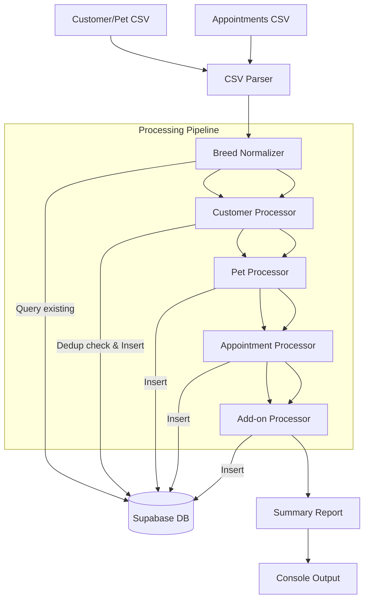
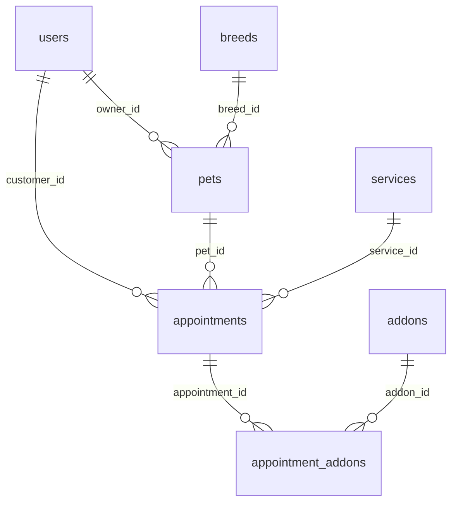

# CSV Data Import - Design Document

## Overview

### Purpose

Import historical business data from two CSV files into the live Supabase database for The Puppy Day dog grooming SaaS. This is a one-time data migration that brings approximately 267 customers, 330 pets, and 525 completed appointments into the system alongside the 66 existing customers.

### Business Value

- Preserves historical customer and appointment records
- Enables accurate loyalty tracking based on visit history
- Provides complete customer profiles for the admin panel
- Eliminates manual data re-entry for existing clients

### Source Files

- `docs/import-files/puppyday-customer-pet-import.csv` -- 331 data rows (customers + pets)
  - Columns: Owner Name, Phone, Email, Address, Pet Name, Breed, Size, Gender, DOB, HOW OLD, COLOR, Aggression?, Notes, Rabies Exp, Bordetella Exp, Allergies, Vaccine Status
- `docs/import-files/puppyday-appointments-import.csv` -- 526 data rows (appointment history)
  - Columns: Date, Owner Name, Pet Name, Service, Grooming Style, Base Price, Add-on Fee, Late Cancel Fee, No-Show Fee, Tip, Tax Rate, Sales Tax, Total, Payment, Rebook, No-Show?, Notes

### Key Architectural Decisions

| Decision | Rationale |
|----------|-----------|
| Single TypeScript script at `scripts/import-csv-data.ts` | Simple, auditable, one-time operation -- no need for a multi-file module system |
| Service role client for DB access | Bypasses RLS for bulk inserts; script runs locally with trusted credentials |
| Idempotent by design | Phone-based deduplication for customers; unique `CSV-` prefixed booking references for appointments |
| Dry-run by default | Script validates all parsing and lookups without writing unless `--execute` flag is passed |
| No schema changes required | All data maps to existing tables; `csv_import` creation method already exists in the enum |
| Claude Code slash command orchestration | The `.claude/commands/import-csv-data.md` command provides a repeatable, documented entry point |

---

## Architecture

### High-Level Data Flow



### Processing Order (Sequential, Dependency-Driven)

1. **Breeds** -- Must exist before pets can reference them via `breed_id`
2. **Customers** -- Must exist before pets and appointments can reference them via `owner_id` / `customer_id`
3. **Pets** -- Must exist before appointments can reference them via `pet_id`
4. **Appointments** -- Must exist before add-ons can reference them via `appointment_id`
5. **Appointment Add-ons** -- Final step, references `appointments` and `addons` tables

### Technology

| Concern | Choice |
|---------|--------|
| Runtime | Node.js with `tsx` for TypeScript execution |
| CSV Parsing | `csv-parse` npm package -- handles quoted fields containing commas |
| Database Client | `@supabase/supabase-js` with service role key |
| Environment | Reads `NEXT_PUBLIC_SUPABASE_URL` and `SUPABASE_SERVICE_ROLE_KEY` from `.env.local` |

### Script Entry Point

```bash
# Dry run (default) -- validate only, no DB writes
npx tsx scripts/import-csv-data.ts

# Execute -- perform actual inserts
npx tsx scripts/import-csv-data.ts --execute
```

---

## Components and Interfaces

### 1. CSV Parser Module

Parses both CSV files into typed row objects using `csv-parse/sync`.

```typescript
interface ParsedCustomerPetRow {
  ownerName: string;
  phone: string;
  email: string;
  address: string;
  petName: string;
  breed: string;
  size: string;
  gender: string;
  dob: string;
  howOld: string;
  color: string;
  aggression: string;
  notes: string;
  rabiesExp: string;
  bordetellaExp: string;
  allergies: string;
  vaccineStatus: string;
}

interface ParsedAppointmentRow {
  date: string;
  ownerName: string;
  petName: string;
  service: string;
  groomingStyle: string;
  basePrice: string;
  addOnFee: string;
  lateCancelFee: string;
  noShowFee: string;
  tip: string;
  taxRate: string;
  salesTax: string;
  total: string;
  payment: string;
  rebook: string;
  noShow: string;
  notes: string;
}
```

Parser configuration: `{ columns: true, skip_empty_lines: true, relax_quotes: true }`.

---

### 2. Breed Normalizer

Maps ~110 unique breed strings from the CSV to canonical breed names. Matches against the 13 existing breeds in the database, and creates new breed records for unmatched canonical names.

**Normalization Map (representative subset):**

```typescript
const BREED_NORMALIZATION_MAP: Record<string, string> = {
  // Existing breeds (13 in DB)
  'SHITZU': 'Shih Tzu',
  'SHIH TZU': 'Shih Tzu',
  'SHITZU MIX': 'Shih Tzu',
  'YORKIE': 'Yorkshire Terrier',
  'YORKIE MIX': 'Yorkshire Terrier',
  'FRENCHI': 'French Bulldog',
  'FRENCHIE': 'French Bulldog',
  'FRENCH BULLDOG': 'French Bulldog',
  'FRENCH BULL DOG': 'French Bulldog',
  'POMERANIAN': 'Pomeranian',
  'POME MIX': 'Pomeranian',
  'CHIHUAHUA': 'Chihuahua',
  'CHI MIX': 'Chihuahua',
  'MALTESE': 'Maltese',
  'POODLE': 'Poodle',
  'PUDDLE': 'Poodle',
  'GOLDEN RETRIEVER': 'Golden Retriever',
  'GERMAN SHEPHERD': 'German Shepherd',
  'LABRADOR': 'Labrador Retriever',
  'LAB': 'Labrador Retriever',
  'COCKER SPANIEL': 'Cocker Spaniel',
  'BICHON FRISE': 'Bichon Frise',
  'BICHON': 'Bichon Frise',
  'MIXED': 'Mixed Breed',
  'MIX': 'Mixed Breed',
  'MUTT': 'Mixed Breed',

  // New breeds to create
  'MALTIPOO': 'Maltipoo',
  'GOLDEN DOODLE': 'Golden Doodle',
  'GOLDENDOODLE': 'Golden Doodle',
  'MINI GOLDEN DOODLE': 'Mini Golden Doodle',
  'COCKAPOO': 'Cockapoo',
  'DOODLE': 'Golden Doodle',
  'MINI DOODLE': 'Mini Golden Doodle',
  'PUG': 'Pug',
  'TERRIER': 'Terrier',
  'BORDER COLLIE': 'Border Collie',
  'AUSSY SHEPHERD': 'Australian Shepherd',
  'AUSTRALIAN SHEPHERD': 'Australian Shepherd',
  'LHASA APSO': 'Lhasa Apso',
  'MINI PINCHER': 'Miniature Pinscher',
  'SILKY TERRIER': 'Silky Terrier',
  'SCHNAUZER': 'Schnauzer',
  'MINI SCHNAUZER': 'Miniature Schnauzer',
  'HAVANESE': 'Havanese',
  'CORGI': 'Corgi',
  'SHIBA INU': 'Shiba Inu',
  'SHIBA': 'Shiba Inu',
  'HUSKY': 'Husky',
  'PITBULL': 'Pitbull',
  'PIT MIX': 'Pitbull',
  'CAVAPOO': 'Cavapoo',
  'MORKIE': 'Morkie',
  'POMSKY': 'Pomsky',
  // Additional mappings discovered during dry-run
};
```

**Logic:**

1. Trim and uppercase the CSV breed string
2. Look up in normalization map
3. If found, check if canonical name exists in DB `breeds` table
4. If canonical name is not in DB, create a new breed record with `grooming_frequency_weeks=6`, `reminder_message=null`
5. If not in map and not empty, log a warning and leave `breed_id` as NULL (the breed string will be preserved in log output for manual review)
6. If empty, leave `breed_id` as NULL

---

### 3. Customer Processor

Inserts unique customers into the `users` table, deduplicating by phone number against both existing DB records and within the CSV itself.

```typescript
interface CustomerInsert {
  email: string;           // "{phone_digits}@puppyday.local"
  phone: string;           // Normalized from CSV
  first_name: string;      // First word of owner name, title-cased
  last_name: string;       // Remaining words, or '.' if single name
  role: 'customer';
  is_active: true;
  created_by_admin: true;
  address: string | null;  // Street portion parsed from address
  city: string | null;     // Parsed from address
  zip: string | null;      // Parsed from address
}
```

**Name Splitting Rules:**

| Input | first_name | last_name | Rule |
|-------|-----------|-----------|------|
| `ALYSSA CAMACHO` | Alyssa | Camacho | Split on first space |
| `ROSE` | Rose | . | Single name, last_name defaults to `.` |
| `ROGER / DAISY` | Roger | Daisy | Slash-separated co-owners: first before slash, first after slash |
| `SUMMER & NICHOLAS WALLACE` | Summer | Wallace | Ampersand names: first word + last word |
| `BARRY K` | Barry | K | Normal split |

All names are title-cased after splitting.

**Address Parsing:**

```typescript
function parseAddress(raw: string): { address: string | null; city: string | null; zip: string | null } {
  if (!raw || !raw.trim()) return { address: null, city: null, zip: null };

  // Extract zip code (5-digit number)
  const zipMatch = raw.match(/\b(\d{5})\b/);
  const zip = zipMatch ? zipMatch[1] : null;

  // Split on commas, trim segments
  const segments = raw.split(',').map(s => s.trim());

  if (segments.length >= 2) {
    const address = segments[0];
    // City is typically in the second segment, possibly with state
    const cityState = segments.length >= 3 ? segments[1] : segments[1].replace(/\s+CA\s*\d*/, '').trim();
    const city = cityState.replace(/\b(CA|ca)\b/, '').replace(/\d{5}/, '').trim() || null;
    return { address: titleCase(address), city: city ? titleCase(city) : null, zip };
  }

  return { address: raw.trim(), city: null, zip };
}
```

**Deduplication:**

1. Query all existing customers from `users` table where `role='customer'`
2. Build `Map<string, string>` of normalized phone -> existing user_id
3. As CSV rows are processed, skip any row whose phone already exists in the map
4. For CSV-internal duplicates (same owner, multiple pets), only insert the customer once; subsequent rows reuse the same user_id

**Phone Normalization:**

Strip all non-digit characters. The CSV format is `XXX-XXX-XXXX`; store as-is for display consistency.

---

### 4. Pet Processor

Inserts pets into the `pets` table, linking each to its owner and breed.

```typescript
interface PetInsert {
  owner_id: string;        // From customer phone -> user_id map
  name: string;            // Title-cased
  breed_id: string | null; // From breed normalizer
  breed_custom: null;      // Always null per requirements
  size: PetSize;           // Mapped from CSV size string
  gender: string;          // 'female' | 'male'
  color: string | null;    // From COLOR column, title-cased
  birth_date: string | null; // ISO date from DOB column
  notes: string | null;    // Combined Notes + Aggression
  medical_info: string | null; // Combined Rabies + Bordetella + Allergies + Vaccine Status
  is_active: true;
}
```

**Size Mapping:**

```typescript
const SIZE_MAP: Record<string, PetSize> = {
  'Small (under 18lbs)': 'small',
  'Medium (19-35lbs)': 'medium',
  'Large (36-65lbs)': 'large',
  'X-Large (66lbs+)': 'xlarge',
};
// Default: 'small' for empty or unrecognized values
```

**Gender Mapping:**

`F` -> `female`, `M` -> `male`, empty -> `male` (default)

**DOB Parsing:**

| Format | Example | Interpretation |
|--------|---------|---------------|
| `MM/DD/YY` | `03/25/13` | 2013-03-25 (YY < 30 -> 2000s) |
| `M/D/YY` | `7/10/20` | 2020-07-10 |
| `MM/DD/YYYY` | `9/5/2025` | 2025-09-05 |
| Year only | `2024` | 2024-01-01 |
| Empty | | null |

Two-digit year rule: YY < 30 -> 20XX, YY >= 30 -> 19XX.

**Notes Composition:**

```typescript
const parts: string[] = [];
if (row.aggression) parts.push(`Aggression: ${row.aggression}`);
if (row.notes) parts.push(row.notes);
const notes = parts.length > 0 ? parts.join(' | ') : null;
```

**Medical Info Composition:**

```typescript
const medParts: string[] = [];
if (row.rabiesExp) medParts.push(`Rabies Exp: ${row.rabiesExp}`);
if (row.bordetellaExp) medParts.push(`Bordetella Exp: ${row.bordetellaExp}`);
if (row.allergies) medParts.push(`Allergies: ${row.allergies}`);
if (row.vaccineStatus) medParts.push(`Vaccine Status: ${row.vaccineStatus}`);
const medical_info = medParts.length > 0 ? medParts.join(' | ') : null;
```

---

### 5. Appointment Processor

Inserts appointments into the `appointments` table, linking each to its customer, pet, and service.

```typescript
interface AppointmentInsert {
  customer_id: string;       // Looked up via owner name -> phone -> user_id
  pet_id: string;            // Looked up via owner_id + pet name
  service_id: string;        // Basic or Premium Grooming UUID
  scheduled_at: string;      // ISO timestamp with staggered time
  duration_minutes: number;  // 60 (Basic) or 90 (Premium)
  status: 'completed';
  payment_status: 'paid';
  total_price: number;       // Base Price from CSV
  notes: string | null;      // Notes column + Grooming Style if present
  booking_reference: string; // Generated unique reference
  creation_method: 'csv_import';
  admin_notes: string | null; // Tip, fees info if present
}
```

**Owner Name to Customer Lookup (Cross-CSV Linkage):**

The appointments CSV references customers by name only (no phone). The linkage works as follows:

1. During customer processing, build `Map<string, string>` of `UPPERCASE_OWNER_NAME -> phone`
2. Use the existing `phone -> user_id` map to resolve to a customer_id
3. This two-step lookup handles the cross-CSV join

**Service Mapping:**

```typescript
const BASIC_SERVICE_ID = 'a83acf24-dcf9-45cd-b189-1e68b6b2af1b';
const PREMIUM_SERVICE_ID = 'bc981fb2-000f-47e3-a05a-1fec4d117f41';

function mapService(service: string): { serviceId: string; duration: number } {
  const s = service.toUpperCase().trim();
  if (s.startsWith('PREMIUM')) return { serviceId: PREMIUM_SERVICE_ID, duration: 90 };
  // BASIC, BASIC+FLEA, NAIL TRIM, FREE BATH all map to Basic Grooming
  return { serviceId: BASIC_SERVICE_ID, duration: 60 };
}
```

**Price Handling:**

- Use the `Base Price` value from CSV as `total_price`
- FREE BATH rows have price `0`
- NAIL TRIM rows have price `15`
- All other prices come directly from the CSV

**Time Staggering:**

Appointments on the same date are assigned staggered start times to avoid identical `scheduled_at` values:

```typescript
const START_HOURS = [9, 10, 11, 12, 13, 14, 15, 16]; // 9 AM to 4 PM

function staggerTime(date: string, indexWithinDay: number): string {
  const hour = START_HOURS[indexWithinDay % START_HOURS.length];
  // Parse date and set hour
  return `${isoDate}T${String(hour).padStart(2, '0')}:00:00-08:00`; // PST
}
```

Group appointments by date, then assign sequential time slots within each day.

**Booking Reference Generation:**

```typescript
function generateBookingRef(date: string, globalIndex: number): string {
  const d = new Date(date);
  const dateStr = d.toISOString().slice(2, 10).replace(/-/g, '');
  return `CSV-${dateStr}-${String(globalIndex).padStart(4, '0')}`;
}
// Example: CSV-251117-0001
```

The `CSV-` prefix ensures no collision with existing booking references.

**FLEA Detection:**

FLEA add-on treatment appears in two different columns depending on the row:

| Pattern | Service Column | Grooming Style Column |
|---------|---------------|----------------------|
| Inline | `BASIC+FLEA` or `PREMIUM+FLEA` | (empty) |
| Separate | `BASIC` or `PREMIUM` | `FLEA` |

```typescript
function hasFleaAddon(service: string, groomingStyle: string): boolean {
  return service.toUpperCase().includes('FLEA') ||
         groomingStyle.toUpperCase().includes('FLEA');
}
```

---

### 6. Add-on Processor

For each appointment flagged with FLEA treatment, insert an `appointment_addons` record:

```typescript
interface AppointmentAddonInsert {
  appointment_id: string;  // From just-inserted appointment
  addon_id: string;        // '8cbaba3c-950b-41a0-ab0e-8f39f533a1e6' (Flea & Tick Treatment)
  price: number;           // 25.00
}
```

There are 4 FLEA appointments in the dataset:
- JULIE HUYNH / GIZMO -- BASIC+FLEA ($50)
- JOSE ZUNIGA / STELLA -- PREMIUM+FLEA ($100)
- MYLISA STEVENSON / BLANKET -- PREMIUM with FLEA in Grooming Style ($85)
- NOAH FELIX / ARCHIE -- BASIC with FLEA in Grooming Style ($55)

---

### 7. Slash Command

File: `.claude/commands/import-csv-data.md`

The slash command instructs Claude Code to:

1. Verify the CSV source files exist at `docs/import-files/`
2. Install `csv-parse` if not already present
3. Run the import script in dry-run mode: `npx tsx scripts/import-csv-data.ts`
4. Review the summary report output
5. If the dry-run looks correct, ask for confirmation and run with `--execute`: `npx tsx scripts/import-csv-data.ts --execute`
6. Run post-import verification queries against the database

---

## Data Models

### Tables Affected

No new tables or migrations are required. The import uses existing tables:

| Table | Action | Estimated Records |
|-------|--------|-------------------|
| `breeds` | INSERT new breeds | ~15-20 new |
| `users` | INSERT customers | ~267 (after dedup with existing 66) |
| `pets` | INSERT pets | ~330 |
| `appointments` | INSERT appointments | ~525 |
| `appointment_addons` | INSERT add-ons | 4 (FLEA only) |

### Existing Data Protection

- Customers are deduplicated by phone number -- existing 66 customers remain untouched
- No UPDATE operations are performed on any existing records
- Unique `booking_reference` values with `CSV-` prefix prevent collision with existing references
- Imported customers are identifiable by `email LIKE '%@puppyday.local'`
- Imported appointments are identifiable by `creation_method = 'csv_import'`

### Key Foreign Key Relationships



---

## Error Handling

### Error Strategy: Skip and Report

Individual row errors do not halt the import. Each error is logged and the row is skipped. A summary report is printed at the end.

```typescript
interface ImportResult {
  phase: string;
  total: number;
  inserted: number;
  skipped: number;
  errors: ImportError[];
}

interface ImportError {
  row: number;
  field: string;
  value: string;
  message: string;
}
```

### Per-Phase Error Handling

| Phase | Error Scenario | Action |
|-------|---------------|--------|
| Breeds | Duplicate breed name in DB | Skip, use existing breed_id |
| Customers | Missing phone number | Skip entire row (and associated pets), log error |
| Customers | Duplicate phone (existing in DB) | Skip, reuse existing user_id for pet/appointment linking |
| Customers | Duplicate phone (within CSV) | Use first occurrence's user_id |
| Pets | Owner not found (no matching phone) | Skip row, log error |
| Pets | Invalid or unrecognized size value | Default to `small`, log warning |
| Pets | Unparseable DOB | Set birth_date to null, log warning |
| Appointments | Owner name not found in name->phone lookup | Skip row, log error |
| Appointments | Pet not found for owner | Skip row, log error |
| Appointments | Invalid or unparseable date | Skip row, log error |
| Appointments | Missing base price | Default to 0, log warning |
| Add-ons | Parent appointment insert failed | Skip (already logged in appointment phase) |

### Dry-Run Mode

- **Default behavior** -- no database writes are performed
- Validates all CSV parsing, normalization mapping, and cross-CSV lookups
- Reports exactly what would be inserted, what would be skipped, and any errors
- Pass `--execute` flag to perform actual database inserts

### Batch Insert Strategy

Records are inserted in batches of 50 using Supabase's `.insert()` with arrays. If a batch fails, fall back to individual row inserts within that batch to isolate the problematic record.

### Rollback Capability

If issues are discovered after import, all imported data can be cleanly removed:

```sql
-- 1. Delete imported appointment add-ons
DELETE FROM appointment_addons WHERE appointment_id IN (
  SELECT id FROM appointments WHERE creation_method = 'csv_import'
);

-- 2. Delete imported appointments
DELETE FROM appointments WHERE creation_method = 'csv_import';

-- 3. Delete imported pets
DELETE FROM pets WHERE owner_id IN (
  SELECT id FROM users WHERE email LIKE '%@puppyday.local'
);

-- 4. Delete imported customers
DELETE FROM users WHERE email LIKE '%@puppyday.local';

-- 5. Delete new breeds (manual review -- only remove breeds not referenced by other pets)
-- SELECT * FROM breeds WHERE id NOT IN (SELECT DISTINCT breed_id FROM pets WHERE breed_id IS NOT NULL);
```

---

## Testing Strategy

### 1. Dry-Run Validation (Primary)

Run the script without `--execute` to validate before any data is written:

- All 331 customer/pet CSV rows parse correctly (no CSV parsing errors)
- All 526 appointment CSV rows parse correctly
- All breed names resolve to either an existing breed or a new breed to create
- All owner names in the appointments CSV match an owner in the customer CSV
- All dates parse to valid ISO timestamps
- No duplicate `booking_reference` values are generated
- Phone numbers normalize consistently
- Size and gender mappings produce valid enum values
- Address parsing extracts city/zip where available

### 2. Post-Import Count Verification

```sql
-- Verify expected counts
SELECT 'imported_users' AS label, COUNT(*) AS count
  FROM users WHERE email LIKE '%@puppyday.local'
UNION ALL
SELECT 'imported_pets', COUNT(*)
  FROM pets WHERE owner_id IN (SELECT id FROM users WHERE email LIKE '%@puppyday.local')
UNION ALL
SELECT 'imported_appointments', COUNT(*)
  FROM appointments WHERE creation_method = 'csv_import'
UNION ALL
SELECT 'imported_addons', COUNT(*)
  FROM appointment_addons WHERE appointment_id IN (
    SELECT id FROM appointments WHERE creation_method = 'csv_import'
  );
```

### 3. Relationship Integrity Checks

```sql
-- Verify no orphaned appointments (customer or pet missing)
SELECT a.id, a.booking_reference
FROM appointments a
WHERE a.creation_method = 'csv_import'
  AND (a.customer_id NOT IN (SELECT id FROM users)
    OR a.pet_id NOT IN (SELECT id FROM pets));

-- Verify no orphaned pets (owner missing)
SELECT p.id, p.name
FROM pets p
WHERE p.owner_id IN (SELECT id FROM users WHERE email LIKE '%@puppyday.local')
  AND p.owner_id NOT IN (SELECT id FROM users);

-- Verify all appointment add-ons reference valid appointments
SELECT aa.id
FROM appointment_addons aa
WHERE aa.appointment_id IN (SELECT id FROM appointments WHERE creation_method = 'csv_import')
  AND aa.appointment_id NOT IN (SELECT id FROM appointments);
```

### 4. Sample Spot Checks

After import, manually verify these specific cases in the admin panel or via SQL:

| Test Case | What to Verify |
|-----------|---------------|
| ANA PAYAN (multi-pet owner) | Has 2 pets: ALLEY (Chihuahua, small) and ABBY (Shih Tzu, small) |
| STEVEN RAMIREZ (frequent visitor) | Has 6 appointments, alternating Basic and Premium |
| JULIE HUYNH / GIZMO (FLEA add-on) | Appointment has BASIC+FLEA service, appointment_addons record with Flea & Tick Treatment at $25 |
| DIANA AKE / YUZU (FREE BATH) | Appointment with Basic Grooming service, total_price = $0 |
| BARRY K / BAILEY (NAIL TRIM) | Appointment with Basic Grooming service, total_price = $15 |
| ROGER / DAISY (edge-case name) | Customer created with first_name="Roger", last_name="Daisy", has pet BRUNO |
| ROSE (single name) | Customer created with first_name="Rose", last_name="." |
| ARNOLD AVALOS / WINNIE (Korean notes) | Pet notes contain Korean text preserved correctly |
| ALYSSA CAMACHO (full address) | Address parsed: street, city="Whittier", zip="90606" |
| ALBERT ROMERO (partial address) | Address "6137 E OLYMPIC BLVD." -- no city/zip parsed |

### 5. Console Summary Report

The script outputs a structured report after each run:

```
============================================
  CSV Data Import Summary
============================================
Mode: DRY RUN (no database changes made)

  Breeds
  - Existing matched:  13
  - New to create:     18
  - Unmatched (NULL):   3
  - Errors:             0

  Customers
  - To insert:        267
  - Already in DB:       0
  - CSV duplicates:      0
  - Errors:              0

  Pets
  - To insert:        330
  - Owner not found:     0
  - Errors:              0

  Appointments
  - To insert:        525
  - With FLEA add-on:    4
  - Owner not found:     0
  - Pet not found:       0
  - Errors:              0

  Add-ons
  - To insert:          4

Warnings: 3
  Row 322: Breed "PUDDLE" normalized to "Poodle"
  Row 106: Name "ROGER / DAISY" split as first="Roger" last="Daisy"
  Row 321: DOB "2011" interpreted as 2011-01-01

To execute the import, run:
  npx tsx scripts/import-csv-data.ts --execute
============================================
```
