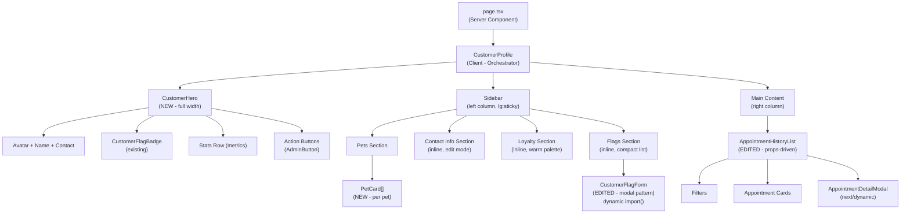
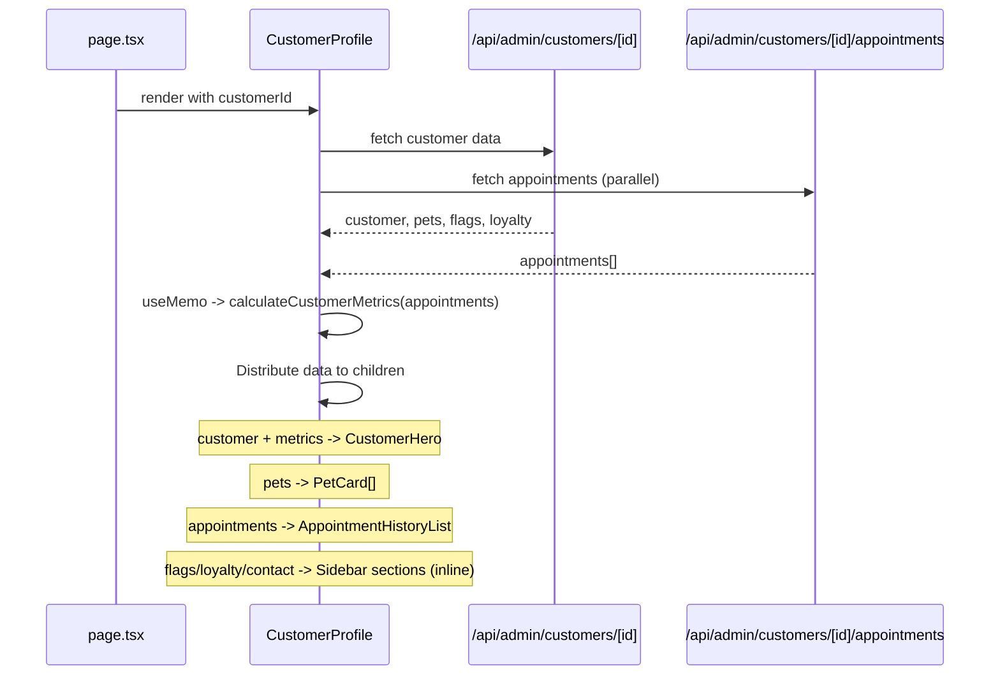

# Customer Detail Page Redesign -- Design Document

## 1. Overview

### 1.1 Feature Summary

Redesign the admin customer detail page (`/admin/customers/[id]`) from a 5-section vertically stacked layout into a hero + 2-column layout. The redesign surfaces safety-critical information (flags, medical info) without scrolling, provides at-a-glance customer metrics, and aligns with the project's admin UI patterns (Framer Motion animations, AdminButton, warm palette, focus-trapped modals).

### 1.2 Goals

| Goal | Measure |
|------|---------|
| Safety-critical info visible on load | Flags appear in hero (zero scroll), medical info always visible in PetCard |
| At-a-glance customer summary | Hero shows metrics (visits, spending, favorite service, frequency) |
| Efficient use of screen real estate | 2-column layout on lg+ (1024px) |
| Design system consistency | All buttons use AdminButton, warm palette throughout, Framer Motion animations |
| Bug fixes | Replace `console.error` with toast notifications, remove `useEffect` phone sync |
| Performance | Parallel data fetching, dynamic imports, memoized metrics |

### 1.3 Scope

**In scope**: CustomerProfile rewrite, CustomerHero (new), PetCard (new), AppointmentHistoryList edits, CustomerFlagForm modal pattern upgrade, page.tsx simplification.

**Out of scope**: New API routes, database schema changes, new features beyond the redesign.

---

## 2. Architecture

### 2.1 Component Tree (After Redesign)



### 2.2 Data Flow



**Key architectural decision**: CustomerProfile fetches both customer data AND appointments in parallel via `Promise.all`. Previously, AppointmentHistoryList fetched its own appointments. This change allows metrics to be computed once at the orchestrator level and shared between the Hero (stats row) and the History list (count display). Both fetches run simultaneously, eliminating the data waterfall.

### 2.3 File Impact Summary

| File | Action | Estimated Lines |
|------|--------|----------------|
| `src/components/admin/customers/CustomerHero.tsx` | **CREATE** | ~120 |
| `src/components/admin/customers/PetCard.tsx` | **CREATE** | ~100 |
| `src/components/admin/customers/CustomerProfile.tsx` | **REWRITE** | ~500 |
| `src/components/admin/customers/AppointmentHistoryList.tsx` | **EDIT** | -70, +30 |
| `src/components/admin/customers/CustomerFlagForm.tsx` | **EDIT** | ~+60 |
| `src/app/admin/customers/[id]/page.tsx` | **EDIT** | -15, +10 |

---

## 3. Components and Interfaces

### 3.1 TypeScript Interfaces

All interfaces are defined in their respective component files. The shared types (`CustomerMetrics`, `AppointmentWithDetails`) are exported from `AppointmentHistoryList.tsx` for cross-component use.

```typescript
// ============================================================
// Shared Types (exported from AppointmentHistoryList.tsx)
// ============================================================

/** Metrics computed from appointment history, displayed in CustomerHero */
export interface CustomerMetrics {
  /** Total number of appointments (all statuses) */
  total_appointments: number;
  /** Sum of total_price for completed appointments */
  total_spent: number;
  /** Name of the most frequently booked service, or null */
  favorite_service: string | null;
  /** Average days between completed visits, or null if < 2 visits */
  avg_visit_frequency_days: number | null;
}

/** Appointment with joined pet, service, addons, and report_card */
export interface AppointmentWithDetails {
  // Base appointment fields (from Supabase 'appointments' table)
  id: string;
  customer_id: string;
  pet_id: string;
  service_id: string;
  groomer_id: string | null;
  scheduled_at: string;
  duration_minutes: number;
  status: string | null;
  total_price: number;
  payment_status: string | null;
  notes: string | null;
  booking_reference: string | null;
  created_at: string | null;
  updated_at: string | null;

  // Joined relations (populated by API)
  pet?: {
    id: string;
    name: string;
    size: string;
    breed_id: string | null;
    breed_custom: string | null;
    [key: string]: any;
  };
  service?: {
    id: string;
    name: string;
    [key: string]: any;
  };
  addons?: Array<{
    id: string;
    appointment_id: string;
    addon_id: string;
    price: number;
    addon?: { id: string; name: string; price: number };
  }>;
  report_card?: {
    id: string;
    appointment_id: string;
    [key: string]: any;
  } | null;
}

// ============================================================
// CustomerDetail (defined in CustomerProfile.tsx)
// ============================================================

/** Extended user with related data, returned by GET /api/admin/customers/[id] */
interface CustomerDetail {
  // Base user fields (from Supabase 'users' table)
  id: string;
  email: string;
  first_name: string;
  last_name: string;
  phone: string | null;
  role: string | null;
  avatar_url: string | null;
  preferences: any;
  address: string | null;
  city: string | null;
  zip: string | null;
  created_at: string | null;
  updated_at: string | null;

  // Joined relations (populated by API)
  pets: PetWithBreed[];
  flags: CustomerFlag[];
  loyalty_points: {
    id: string;
    customer_id: string;
    current_punches: number;
    cards_completed: number;
    [key: string]: any;
  } | null;
  loyalty_transactions: Array<{
    id: string;
    customer_id: string;
    created_at: string;
    [key: string]: any;
  }>;
}

/** Pet with optional joined breed */
interface PetWithBreed {
  id: string;
  name: string;
  size: string;
  owner_id: string;
  breed_id: string | null;
  breed_custom: string | null;
  gender: string;
  color: string | null;
  birth_date: string | null;
  medical_info: string | null;
  notes: string | null;
  photo_url: string | null;
  is_active: boolean | null;
  created_at: string | null;
  updated_at: string | null;
  breed?: { id: string; name: string } | null;
}

/** Customer flag from the customer_flags table */
interface CustomerFlag {
  id: string;
  customer_id: string;
  flag_type: CustomerFlagType;
  description: string;
  color: CustomerFlagColor;
  is_active: boolean;
  flagged_by: string | null;
  created_at: string;
  created_by_user?: { first_name: string; last_name: string } | null;
}

type CustomerFlagType =
  | 'aggressive_dog'
  | 'payment_issues'
  | 'vip'
  | 'special_needs'
  | 'grooming_notes'
  | 'other';

type CustomerFlagColor = 'red' | 'yellow' | 'green';

// ============================================================
// CustomerHero Props (defined in CustomerHero.tsx)
// ============================================================

interface CustomerHeroProps {
  /** Full customer data including name, email, phone, flags, created_at */
  customer: CustomerDetail;
  /** Computed metrics from appointments (visits, spending, etc.) */
  metrics: CustomerMetrics;
  /** Callback to open the booking modal */
  onBookAppointment: () => void;
  /** Callback to navigate to add pet flow */
  onAddPet: () => void;
}

// ============================================================
// PetCard Props (defined in PetCard.tsx)
// ============================================================

interface PetCardProps {
  /** Pet data with optional breed join */
  pet: PetWithBreed;
  /** Index for staggered animation delay */
  index: number;
  /** Date of the pet's last completed groom (ISO string or null) */
  lastGroomDate?: string | null;
  /** Name of the service from the last completed groom */
  lastGroomService?: string | null;
  /** Callback when "Book" quick action is clicked */
  onBook: (petId: string) => void;
}

// ============================================================
// AppointmentHistoryList Props (UPDATED in AppointmentHistoryList.tsx)
// ============================================================

interface AppointmentHistoryListProps {
  /** Appointments data, pre-fetched by parent */
  appointments: AppointmentWithDetails[];
  /** Whether appointments are still loading */
  loading: boolean;
  /** Error message from fetch, or empty string */
  error: string;
  /** Callback to re-fetch appointments (e.g., after status change) */
  onRefresh: () => void;
}

// ============================================================
// CustomerFlagForm Props (UNCHANGED)
// ============================================================

interface CustomerFlagFormProps {
  customerId: string;
  flag?: CustomerFlag | null;
  isOpen: boolean;
  onClose: () => void;
  onSuccess: () => void;
}

interface RemoveFlagConfirmationProps {
  flag: CustomerFlag;
  isOpen: boolean;
  onClose: () => void;
  onConfirm: () => void;
  loading?: boolean;
}
```

---

## 4. Component Specifications

### 4.1 CustomerHero (NEW)

**File**: `src/components/admin/customers/CustomerHero.tsx`

**Purpose**: Full-width hero card at the top of the page. Surfaces customer identity, safety-critical flags, key metrics, and primary actions -- all visible without scrolling.

**Props**: `CustomerHeroProps` (see section 3.1)

**Internal state**: None. This is a pure presentational component.

**Layout (desktop, lg+)**:
```
+-------------------------------------------------------------------+
| h-1.5 accent strip gradient                                       |
+-------------------------------------------------------------------+
|                                                                     |
|  [JK]  Jon Kim              [VIP] [Aggressive Dog]                 |
|        jon@email.com | (213) 555-1234                              |
|        Customer since Mar 2026                                     |
|                                                                     |
|  +----------+-----------+-----------+-----------+   [Book Appt]    |
|  | 3 Visits | $240.00   | Premium   | 45 days   |   [Add Pet]     |
|  |          | Spent     | Grooming  | avg freq  |                  |
|  +----------+-----------+-----------+-----------+                  |
+-------------------------------------------------------------------+
```

**Behavior**:
- Avatar: renders initials from `customer.first_name[0] + customer.last_name[0]` in a rounded-xl box
- Walk-in email: if `isWalkinPlaceholderEmail(customer.email)` is true, show "Walk-in (phone only)" in italic gray instead of the email
- Flag badges: use existing `CustomerFlagBadge` component with `maxVisible={5}` and `size="md"`
- Stats: 4 items separated by vertical dividers. Values: `metrics.total_appointments`, `$${metrics.total_spent.toFixed(2)}`, `metrics.favorite_service || 'N/A'`, `metrics.avg_visit_frequency_days ? '${days} days' : 'N/A'`
- Action buttons: `AdminButton variant="primary" size="sm"` for Book, `AdminButton variant="secondary" size="sm"` for Add Pet

**Responsive (mobile < lg)**:
- Stack vertically: avatar+info row, flags row, stats as 2x2 grid, full-width action buttons

**Animation**: `motion.div` with `initial={{ opacity: 0, y: 16 }}`, `animate={{ opacity: 1, y: 0 }}`, `transition={{ duration: 0.3 }}`

**Imports**:
- `{ User, Mail, Phone, Calendar, Plus } from 'lucide-react'` (direct imports, no barrel)
- `{ CustomerFlagBadge } from './CustomerFlagBadge'`
- `{ AdminButton } from '@/components/admin/ui/AdminButton'`
- `{ isWalkinPlaceholderEmail } from '@/lib/utils'`
- `{ formatPhoneNumber } from '@/hooks/usePhoneMask'`
- `{ format } from 'date-fns'`
- `{ motion } from 'framer-motion'`

---

### 4.2 PetCard (NEW)

**File**: `src/components/admin/customers/PetCard.tsx`

**Purpose**: Individual pet card within the sidebar Pets section. Displays pet identity, size, breed, and -- critically -- always-visible medical info for safety.

**Props**: `PetCardProps` (see section 3.1)

**Internal state**: None. Pure presentational.

**Layout**:
```
+---------------------------------------------+
| h-1.5 accent strip (colored by pet size)    |
+---------------------------------------------+
|  [paw]  Cafe                       [Book >] |
|         Chihuahua . Large . Female . Brown   |
|                                              |
|  +-- Medical ----------------------------+  |
|  | ! Sensitive skin, use hypoallergenic  |  |
|  |   shampoo                             |  |
|  +---------------------------------------+  |
|                                              |
|  Notes: Prefers gentle handling              |
|  Last groom: Mar 10 -- Premium Grooming      |
+---------------------------------------------+
```

**Size-based accent strip colors**:
| Size | Color | Tailwind Class |
|------|-------|---------------|
| Small (0-18 lbs) | Soft blue | `bg-[#7CB9E8]` |
| Medium (19-35 lbs) | Soft green | `bg-[#77BFA3]` |
| Large (36-65 lbs) | Warm tan | `bg-[#D4A574]` |
| X-Large (66+ lbs) | Warm terracotta | `bg-[#C97B63]` |

**Behavior**:
- Medical info box: **always visible** (not collapsed) when `pet.medical_info` is truthy. Uses amber warning styling with `AlertTriangle` icon. This is safety-critical -- groomers must see medical conditions immediately.
- Breed display: `pet.breed?.name || pet.breed_custom || 'Unknown'`
- Details line: breed, size label (via `getSizeLabel`), gender (if present), color (if present) -- joined with ` . ` separator
- Book button: `AdminButton variant="ghost" size="xs"` calling `onBook(pet.id)`
- Last groom: if `lastGroomDate` is provided, show formatted date + service name in muted text

**Animation**: `motion.div` with staggered entrance based on `index` prop: `transition={{ delay: index * 0.05, duration: 0.3 }}`

**Empty state** (rendered by parent, not PetCard itself):
- `PawPrint` icon in gray + "No pets registered" text + `AdminButton` "Add Pet"

**Imports**:
- `{ PawPrint, AlertTriangle } from 'lucide-react'`
- `{ AdminButton } from '@/components/admin/ui/AdminButton'`
- `{ getSizeLabel } from '@/lib/booking/pricing'`
- `{ format } from 'date-fns'`
- `{ motion } from 'framer-motion'`

---

### 4.3 CustomerProfile (REWRITE)

**File**: `src/components/admin/customers/CustomerProfile.tsx`

**Purpose**: Client component orchestrator. Fetches all data, computes metrics, and renders the hero + 2-column layout. Sidebar sections (Contact, Loyalty, Flags) are inline JSX within this component (not separate files) because they are small and tightly coupled to parent state.

**Props**: `CustomerProfileProps` (unchanged: `{ customerId: string }`)

**State**:
```typescript
// Data state
const [customer, setCustomer] = useState<CustomerDetail | null>(null);
const [appointments, setAppointments] = useState<AppointmentWithDetails[]>(EMPTY_APPOINTMENTS);
const [loading, setLoading] = useState(true);
const [error, setError] = useState('');

// Contact editing state
const [isEditingContact, setIsEditingContact] = useState(false);
const [editedContact, setEditedContact] = useState({
  first_name: '',
  last_name: '',
  email: '',
  phone: '',
  address: '',
  city: '',
  zip: '',
});
const [savingContact, setSavingContact] = useState(false);

// Phone masking (for contact edit mode)
const phoneInput = usePhoneMask('');

// Flag modal state (lazy-loaded)
const [isFlagFormOpen, setIsFlagFormOpen] = useState(false);
const [selectedFlag, setSelectedFlag] = useState<CustomerFlag | null>(null);
const [isRemoveFlagOpen, setIsRemoveFlagOpen] = useState(false);
const [removingFlag, setRemovingFlag] = useState(false);
```

**Module-level constants** (hoisted outside component to avoid re-renders):
```typescript
const EMPTY_APPOINTMENTS: AppointmentWithDetails[] = [];

const LoadingState = (
  <div className="flex items-center justify-center py-12">
    <div className="flex items-center gap-2 text-gray-500">
      <div className="w-5 h-5 border-2 border-gray-300 border-t-[#434E54] rounded-full animate-spin" />
      <span>Loading customer profile...</span>
    </div>
  </div>
);
```

**Data fetching** (parallel):
```typescript
useEffect(() => {
  const loadData = async () => {
    setLoading(true);
    setError('');
    try {
      const [customerRes, appointmentsRes] = await Promise.all([
        fetch(`/api/admin/customers/${customerId}`),
        fetch(`/api/admin/customers/${customerId}/appointments`),
      ]);

      const [customerResult, appointmentsResult] = await Promise.all([
        customerRes.json(),
        appointmentsRes.json(),
      ]);

      if (!customerRes.ok) throw new Error(customerResult.error || 'Failed to fetch customer');
      if (!appointmentsRes.ok) throw new Error(appointmentsResult.error || 'Failed to fetch appointments');

      setCustomer(customerResult.data);
      setAppointments(appointmentsResult.data || EMPTY_APPOINTMENTS);
      // ... initialize editedContact and phoneInput
    } catch (err) {
      setError(err instanceof Error ? err.message : 'An error occurred');
    } finally {
      setLoading(false);
    }
  };
  loadData();
}, [customerId]);
```

**Metrics computation** (memoized):
```typescript
const metrics = useMemo(
  () => calculateCustomerMetrics(appointments),
  [appointments]
);
```

**Layout structure**:
```tsx
<div className="space-y-6">
  {/* Full-width Hero */}
  <CustomerHero
    customer={customer}
    metrics={metrics}
    onBookAppointment={handleBookAppointment}
    onAddPet={handleAddPet}
  />

  {/* 2-column layout */}
  <div className="grid grid-cols-1 lg:grid-cols-[360px_1fr] gap-6">
    {/* Left sidebar -- sticky on desktop */}
    <div className="lg:sticky lg:top-6 lg:self-start space-y-6">
      {/* Pets section (renders PetCard[]) */}
      {/* Contact info section (inline, with edit mode) */}
      {/* Loyalty section (inline, warm palette) */}
      {/* Flags section (inline, compact list) */}
    </div>

    {/* Right main content */}
    <div>
      <AppointmentHistoryList
        appointments={appointments}
        loading={appointmentsLoading}
        error={appointmentsError}
        onRefresh={fetchAppointments}
      />
    </div>
  </div>

  {/* Modals (conditionally loaded) */}
  {/* CustomerFlagForm -- dynamic import() */}
  {/* RemoveFlagConfirmation -- dynamic import() */}
</div>
```

**Sidebar section wrapper pattern** (applied to each sidebar card):
```tsx
<motion.div
  initial={{ opacity: 0, y: 16 }}
  animate={{ opacity: 1, y: 0 }}
  transition={{ delay: sectionIndex * 0.05, duration: 0.3 }}
  className="bg-white rounded-2xl shadow-sm overflow-hidden"
>
  <div className="h-1.5 bg-gradient-to-r from-[#D4A574] to-[#E8C49A]" />
  <div className="p-5">
    {/* Section header with title, count, optional action */}
    {/* Section content */}
  </div>
</motion.div>
```

**Bug fixes in this rewrite**:
1. Line 137 `console.error` -> `toast.error('Failed to update customer')` + `toast.success('Customer updated')` on success
2. Line 208 `console.error` -> `toast.error('Failed to remove flag')` + `toast.success('Flag removed')` on success
3. Remove `useEffect` phone sync (lines 82-84) -> derive phone value in `handleSaveContact` using `phoneInput.rawValue`
4. Replace all inline `<button>` elements with `AdminButton`
5. Replace `bg-green-50`/`bg-blue-50` in loyalty section with warm palette (`bg-[#FFFBF7]`)

**Loyalty section redesign** (inline within CustomerProfile):
- Progress bar: `bg-[#EAE0D5]` track with `bg-gradient-to-r from-[#D4A574] to-[#E8C49A]` fill
- Compact layout: progress bar + inline stats (no grid cards)
- Recent activity: simple list with `bg-[#FFFBF7]` background

**Flags section redesign** (inline within CustomerProfile):
- Compact list within sidebar card
- Each flag: `SingleFlagBadge` + description text + `AdminButton variant="ghost" size="xs"` for Remove
- Add button: `AdminButton variant="ghost" size="xs"` with Plus icon

**Dynamic imports**:
```typescript
// AppointmentDetailModal -- loaded when an appointment is clicked
const AppointmentDetailModal = dynamic(
  () => import('@/components/admin/appointments/AppointmentDetailModal')
    .then(mod => mod.AppointmentDetailModal),
  { ssr: false }
);

// CustomerFlagForm -- loaded when flag modal opens
// Uses dynamic import() (not next/dynamic) for conditional loading
const loadFlagForm = () => import('./CustomerFlagForm');
```

**Imports**:
- `{ useState, useEffect, useMemo } from 'react'`
- `dynamic from 'next/dynamic'`
- `{ motion, AnimatePresence } from 'framer-motion'`
- `{ format } from 'date-fns'`
- Icon imports: direct from `lucide-react` (User, Mail, Phone, MapPin, Calendar, Edit2, Save, X, PawPrint, Award, Flag, Plus, ChevronLeft)
- `{ CustomerHero } from './CustomerHero'`
- `{ PetCard } from './PetCard'`
- `{ calculateCustomerMetrics } from './AppointmentHistoryList'`
- `{ CustomerFlagBadge, SingleFlagBadge } from './CustomerFlagBadge'`
- `{ AdminButton } from '@/components/admin/ui/AdminButton'`
- `{ toast } from '@/hooks/use-toast'`
- `{ isWalkinPlaceholderEmail } from '@/lib/utils'`
- `{ getSizeLabel } from '@/lib/booking/pricing'`
- `{ usePhoneMask, formatPhoneNumber } from '@/hooks/usePhoneMask'`

---

### 4.4 AppointmentHistoryList (EDIT)

**File**: `src/components/admin/customers/AppointmentHistoryList.tsx`

**Changes**:
1. **Remove internal data fetching**: Delete `fetchAppointments`, the `useEffect` that calls it, and the `appointments`/`loading`/`error` state. Receive these as props instead.
2. **Remove metrics cards** (current lines 190-246): Metrics are now displayed in CustomerHero.
3. **Export `CustomerMetrics` interface**: Shared with CustomerHero.
4. **Export `calculateCustomerMetrics` function**: Standalone utility for single-pass metrics computation.
5. **Export `AppointmentWithDetails` interface**: Shared with CustomerProfile.
6. **Keep**: filter state, `filteredAppointments` useMemo, appointment card rendering, `AppointmentDetailModal`.

**New props**: `AppointmentHistoryListProps` (see section 3.1)

**Exported utility function**:
```typescript
/**
 * Calculate customer metrics from appointments in a single pass.
 * Combines what was previously filter + reduce + forEach into one loop.
 */
export function calculateCustomerMetrics(
  appointments: AppointmentWithDetails[]
): CustomerMetrics {
  let totalSpent = 0;
  const serviceCounts: Record<string, number> = {};
  const completedDates: number[] = [];

  for (const apt of appointments) {
    if (apt.status === 'completed') {
      totalSpent += apt.total_price || 0;
      if (apt.service) {
        serviceCounts[apt.service.name] =
          (serviceCounts[apt.service.name] || 0) + 1;
      }
      completedDates.push(new Date(apt.scheduled_at).getTime());
    }
  }

  // Favorite service
  let favoriteService: string | null = null;
  let maxCount = 0;
  for (const [name, count] of Object.entries(serviceCounts)) {
    if (count > maxCount) {
      maxCount = count;
      favoriteService = name;
    }
  }

  // Average visit frequency
  let avgFrequency: number | null = null;
  if (completedDates.length >= 2) {
    completedDates.sort((a, b) => a - b);
    let totalGap = 0;
    for (let i = 1; i < completedDates.length; i++) {
      totalGap += completedDates[i] - completedDates[i - 1];
    }
    avgFrequency = Math.round(
      totalGap / (completedDates.length - 1) / (1000 * 60 * 60 * 24)
    );
  }

  return {
    total_appointments: appointments.length,
    total_spent: totalSpent,
    favorite_service: favoriteService,
    avg_visit_frequency_days: avgFrequency,
  };
}
```

**AppointmentDetailModal**: Continue using `next/dynamic` import (already dynamically loaded in current code; ensure it stays that way or migrate if currently static).

---

### 4.5 CustomerFlagForm (EDIT)

**File**: `src/components/admin/customers/CustomerFlagForm.tsx`

**Changes**: Apply the project admin modal pattern (reference: `StaffForm.tsx`).

**Before** (current pattern):
- `if (!isOpen) return null` -- no exit animation
- Plain `<div className="fixed inset-0...">` -- no Framer Motion
- Plain `<button>` elements -- no AdminButton
- No focus trap, no body scroll lock
- Plain white header with border

**After** (admin modal pattern):
1. Wrap with `AnimatePresence` + `motion.div` overlay + `motion.div` modal panel
2. Add `createFocusTrap` from `@/lib/accessibility/focus` via `useEffect`/`useRef`
3. Use `<div role="dialog" aria-modal="true">` (never `<dialog>` element)
4. Warm header: `bg-[#EAE0D5]` with icon in `bg-white/60` rounded-xl container
5. Warm footer: `bg-[#EAE0D5]/30`
6. Replace all `<button>` with `AdminButton`
7. Add body scroll lock: `document.body.style.overflow = 'hidden'` on open, restore on close
8. Add `Escape` key handler to close modal

**Animation pattern**:
```tsx
<AnimatePresence>
  {isOpen && (
    <motion.div
      initial={{ opacity: 0 }}
      animate={{ opacity: 1 }}
      exit={{ opacity: 0 }}
      className="fixed inset-0 z-50 flex items-center justify-center p-4 bg-black/50"
      onClick={(e) => e.target === e.currentTarget && handleClose()}
    >
      <motion.div
        ref={modalRef}
        role="dialog"
        aria-modal="true"
        initial={{ opacity: 0, scale: 0.95, y: 16 }}
        animate={{ opacity: 1, scale: 1, y: 0 }}
        exit={{ opacity: 0, scale: 0.95, y: 16 }}
        className="bg-white rounded-2xl shadow-2xl max-w-md w-full"
      >
        {/* Warm header */}
        <div className="flex items-center gap-3 p-6 bg-[#EAE0D5] rounded-t-2xl">
          <div className="p-2.5 rounded-xl bg-white/60">
            <Flag className="w-5 h-5 text-[#434E54]" />
          </div>
          <h2 className="text-xl font-semibold text-[#434E54] flex-1">
            {isEditing ? 'Edit Flag' : 'Add Customer Flag'}
          </h2>
          <AdminButton variant="ghost" size="xs" onClick={handleClose}>
            <X className="w-4 h-4" />
          </AdminButton>
        </div>

        {/* Form body */}
        <form onSubmit={handleSubmit} className="p-6 space-y-5">
          {/* ... existing form fields ... */}
        </form>

        {/* Warm footer */}
        <div className="flex gap-3 p-6 bg-[#EAE0D5]/30 rounded-b-2xl">
          <AdminButton variant="secondary" onClick={handleClose} className="flex-1">
            Cancel
          </AdminButton>
          <AdminButton
            variant="primary"
            type="submit"
            isLoading={loading}
            loadingText="Saving..."
            className="flex-1"
          >
            {isEditing ? 'Update Flag' : 'Add Flag'}
          </AdminButton>
        </div>
      </motion.div>
    </motion.div>
  )}
</AnimatePresence>
```

**Same pattern applied to `RemoveFlagConfirmation`** with:
- `variant="danger"` for the confirm button
- `AlertTriangle` icon in header instead of `Flag`

**Focus trap implementation**:
```typescript
const modalRef = useRef<HTMLDivElement>(null);

useEffect(() => {
  if (!isOpen || !modalRef.current) return;

  // Body scroll lock
  const originalOverflow = document.body.style.overflow;
  document.body.style.overflow = 'hidden';

  // Focus trap
  const trap = createFocusTrap(modalRef.current);
  trap.activate();

  // Escape key handler
  const handleEscape = (e: KeyboardEvent) => {
    if (e.key === 'Escape') handleClose();
  };
  document.addEventListener('keydown', handleEscape);

  return () => {
    trap.deactivate();
    document.body.style.overflow = originalOverflow;
    document.removeEventListener('keydown', handleEscape);
  };
}, [isOpen]);
```

---

### 4.6 Page Component (EDIT)

**File**: `src/app/admin/customers/[id]/page.tsx`

**Changes**: Simplify to just a back link + CustomerProfile. Remove the "Customer Profile" heading and description text since the hero section now handles customer identification.

**After**:
```tsx
import { CustomerProfile } from '@/components/admin/customers/CustomerProfile';
import { ChevronLeft } from 'lucide-react';
import Link from 'next/link';

interface PageProps {
  params: Promise<{ id: string }>;
}

export const metadata = {
  title: 'Customer Profile | The Puppy Day Admin',
  description: 'View and manage customer information',
};

export default async function CustomerDetailPage({ params }: PageProps) {
  const { id } = await params;

  return (
    <div className="space-y-4">
      <Link
        href="/admin/customers"
        className="inline-flex items-center gap-1 text-sm text-[#434E54]/70 hover:text-[#434E54] transition-colors"
      >
        <ChevronLeft className="w-4 h-4" />
        Back to Customers
      </Link>

      <CustomerProfile customerId={id} />
    </div>
  );
}
```

---

## 5. Data Models

### 5.1 API Contracts (Existing -- No Changes)

**GET `/api/admin/customers/[id]`**

Returns `{ data: CustomerDetail }` where CustomerDetail includes:
- Base user fields from `users` table
- `pets[]` with joined `breed` from `breeds` table
- `flags[]` from `customer_flags` table (active only)
- `loyalty_points` from `customer_loyalty` table (single record or null)
- `loyalty_transactions[]` from `loyalty_punches` table (last 5)

**GET `/api/admin/customers/[id]/appointments`**

Returns `{ data: AppointmentWithDetails[] }` where each appointment includes:
- Base appointment fields from `appointments` table
- Joined `pet` from `pets` table
- Joined `service` from `services` table
- Joined `addons[]` from `appointment_addons` with nested `addon`
- Joined `report_card` from `report_cards` table (or null)

**PATCH `/api/admin/customers/[id]`**

Request body: `{ first_name?, last_name?, email?, phone? }`
Returns `{ data: User }` (updated user record)

**DELETE `/api/admin/customers/[id]/flags/[flagId]`**

Returns `{ data: ... }` on success

**POST `/api/admin/customers/[id]/flags`**

Request body: `{ flag_type, description, color }`
Returns `{ data: CustomerFlag }`

### 5.2 No Database Schema Changes

This redesign is purely a frontend/UI change. No new tables, columns, or RLS policies are needed.

---

## 6. Error Handling

### 6.1 Toast Notification Rules

Every database mutation must show a toast notification per project rules:

| Action | Success Toast | Error Toast |
|--------|--------------|-------------|
| Save contact info | `toast.success('Customer updated')` | `toast.error('Failed to update customer')` |
| Remove flag | `toast.success('Flag removed')` | `toast.error('Failed to remove flag')` |
| Add/edit flag | `toast.success('Flag saved')` (existing) | `toast.error('Failed to save flag')` (existing) |

### 6.2 Data Fetching Errors

- **Customer fetch failure**: Show centered error panel with red background and error message
- **Appointments fetch failure**: Pass error string to AppointmentHistoryList, which renders its own error state
- **Parallel fetch**: If customer fetch fails, show full-page error. If only appointments fetch fails, still show the hero and sidebar with available customer data, but pass the error to the appointment list.

### 6.3 Empty States

| Component | Empty Condition | Display |
|-----------|----------------|---------|
| PetCard (section) | `customer.pets.length === 0` | PawPrint icon + "No pets registered" + "Add Pet" AdminButton |
| AppointmentHistoryList | `filteredAppointments.length === 0` | Calendar icon + "No appointments found" + filter adjustment hint |
| Loyalty section | `customer.loyalty_points === null` | Award icon + "Not enrolled in loyalty program" |
| Flags section | `customer.flags.length === 0` | Flag icon + "No flags set" |

---

## 7. Testing Strategy

### 7.1 Manual Testing Checklist

**Layout and Visual**:
- [ ] Hero section visible without scrolling on desktop (1440px)
- [ ] 2-column layout renders correctly on lg+ (1024px+)
- [ ] Single-column stacked layout on mobile (< 1024px)
- [ ] Sidebar sticky behavior works on desktop when scrolling through long appointment list
- [ ] All sections have accent strip and warm palette (no `bg-green-50`/`bg-blue-50` remnants)
- [ ] All buttons are AdminButton instances (no raw `<button>` elements)

**Safety-Critical Features**:
- [ ] Flags (especially `aggressive_dog`) visible in hero immediately on page load
- [ ] Pet medical info always visible in PetCard (no expand/collapse needed)
- [ ] Flag badges show `aggressive_dog` first (existing sort behavior in CustomerFlagBadge)

**Interactions**:
- [ ] "Book Appointment" button in hero triggers booking flow
- [ ] "Add Pet" button present in hero and in empty pets state
- [ ] Contact edit: inline editing works, save shows `toast.success`, failure shows `toast.error`
- [ ] Flag add: modal opens with warm header, focus trapped, Escape closes
- [ ] Flag remove: confirmation modal opens, `toast.success` on removal, `toast.error` on failure
- [ ] Appointment card click opens AppointmentDetailModal
- [ ] Walk-in customer (placeholder email) shows "Walk-in (phone only)" in hero

**Edge Cases**:
- [ ] New customer: no appointments, no pets, no flags, no loyalty -- all empty states render
- [ ] Customer with many pets (5+): sidebar scrolls properly
- [ ] Customer with many flags (5+): `maxVisible={5}` shows "+N more" badge
- [ ] Customer with no phone number: displays gracefully in hero
- [ ] Long customer name: does not break layout

**Performance**:
- [ ] Both API calls fire in parallel (verify in Network tab)
- [ ] AppointmentDetailModal only loaded when appointment clicked (check bundle in Network)
- [ ] CustomerFlagForm only loaded when flag modal opens

**Accessibility**:
- [ ] Flag modals: focus trapped (Tab cycles within modal)
- [ ] Flag modals: Escape key closes
- [ ] Flag modals: body scroll locked when open
- [ ] All interactive elements keyboard-navigable
- [ ] Flag badges have `title` attribute with description

### 7.2 Build Verification

- [ ] `npm run build` completes without TypeScript errors
- [ ] `npm run lint` passes clean
- [ ] No console warnings about missing keys or invalid props

---

## 8. Vercel React Best Practices Compliance

| Rule ID | Rule | How Addressed |
|---------|------|---------------|
| `async-parallel` | Use Promise.all for independent async operations | CustomerProfile fetches customer + appointments via `Promise.all` |
| `bundle-dynamic-imports` | Use next/dynamic for heavy components | `AppointmentDetailModal` loaded via `next/dynamic` with `{ ssr: false }` |
| `bundle-conditional` | Use dynamic import() for conditionally rendered code | `CustomerFlagForm` loaded via dynamic `import()` only when flag modal opens |
| `bundle-barrel-imports` | Import directly, avoid barrel re-exports | All Lucide icons imported directly: `import { User } from 'lucide-react'` |
| `rerender-memo` | Memoize expensive computations | `metrics = useMemo(() => calculateCustomerMetrics(appointments), [appointments])` |
| `rerender-memo-with-default-value` | Use stable default values for arrays/objects | `EMPTY_APPOINTMENTS` hoisted as module-level constant |
| `rerender-derived-state-no-effect` | Derive state during rendering, not in useEffect | Remove `useEffect` phone sync -- derive phone in `handleSaveContact` from `phoneInput.rawValue` |
| `rendering-conditional-render` | Use ternary not `&&` for conditional rendering | All conditional renders use `condition ? <Component /> : null` pattern |
| `rendering-hoist-jsx` | Hoist static JSX outside component | `LoadingState` JSX hoisted as module-level constant |
| `js-combine-iterations` | Combine multiple iterations into single pass | `calculateCustomerMetrics` uses single `for` loop instead of filter + reduce + forEach |

---

## 9. Design System Tokens Reference

### 9.1 Colors

| Token | Value | Usage |
|-------|-------|-------|
| Background | `#F8EEE5` | Page background (warm cream) |
| Primary text | `#434E54` | Headings, names, values |
| Secondary text | `#434E54/70` | Descriptions, labels |
| Tertiary text | `#434E54/50` | Stat labels, timestamps |
| Card background | `#FFFFFF` | All cards |
| Accent warm | `#D4A574` | Gradient start, accent strip |
| Accent warm light | `#E8C49A` | Gradient end |
| Warm surface | `#EAE0D5` | Avatar bg, badge bg, modal header |
| Warm surface light | `#F0EAE0` | Dividers |
| Warm content bg | `#FFFBF7` | Loyalty stats bg (replaces bg-green-50/bg-blue-50) |
| Required asterisk | `#D4A574` | Form field required indicators |

### 9.2 Component Tokens

| Element | Classes |
|---------|---------|
| Card | `bg-white rounded-2xl shadow-sm overflow-hidden` |
| Accent strip | `h-1.5 bg-gradient-to-r from-[#D4A574] to-[#E8C49A]` |
| Avatar | `w-16 h-16 rounded-xl bg-[#EAE0D5] text-[#434E54] text-xl font-bold` |
| Name | `text-2xl font-bold text-[#434E54]` |
| Stat value | `text-2xl font-bold text-[#434E54]` |
| Stat label | `text-[10px] uppercase tracking-wider text-[#434E54]/50` |
| Stat divider | `w-px h-8 bg-[#F0EAE0]` |
| Medical alert | `bg-amber-50/80 border-l-4 border-amber-400 p-3 rounded-r-lg text-sm text-amber-800` |
| Modal overlay | `fixed inset-0 z-50 bg-black/50` |
| Modal panel | `bg-white rounded-2xl shadow-2xl` |
| Modal header | `bg-[#EAE0D5] rounded-t-2xl p-6` |
| Modal footer | `bg-[#EAE0D5]/30 rounded-b-2xl p-6` |
| Modal icon container | `p-2.5 rounded-xl bg-white/60` |
| Input field | `px-3 py-2.5 rounded-lg border border-[#434E54]/20 focus:ring-2 focus:ring-[#434E54]/30` |
| Animation entrance | `initial={{ opacity: 0, y: 16 }} animate={{ opacity: 1, y: 0 }}` |
| Stagger | `transition={{ delay: index * 0.05, duration: 0.3 }}` |

### 9.3 Pet Size Accent Colors

| Size | Color | Class |
|------|-------|-------|
| Small | `#7CB9E8` | `bg-[#7CB9E8]` |
| Medium | `#77BFA3` | `bg-[#77BFA3]` |
| Large | `#D4A574` | `bg-[#D4A574]` |
| X-Large | `#C97B63` | `bg-[#C97B63]` |

---

## 10. Implementation Sequence

The implementation order is designed to avoid breaking the build at any intermediate step. Each step should result in a buildable, functional (if partially redesigned) page.

### Phase 1: Extract shared utilities (non-breaking)

**Step 1.1**: Edit `AppointmentHistoryList.tsx`
- Export `CustomerMetrics` interface
- Export `AppointmentWithDetails` interface
- Export `calculateCustomerMetrics()` function
- Do NOT change the component's props or behavior yet

**Verification**: `npm run build` passes. Existing page works unchanged.

### Phase 2: Create new components (non-breaking)

**Step 2.1**: Create `PetCard.tsx`
- Implement full component with all styling and animation
- Not imported anywhere yet

**Step 2.2**: Create `CustomerHero.tsx`
- Implement full component with all styling and animation
- Not imported anywhere yet

**Verification**: `npm run build` passes. New files compile but are not rendered.

### Phase 3: Update AppointmentHistoryList (breaking change, coordinated)

**Step 3.1**: Edit `AppointmentHistoryList.tsx`
- Change props to `AppointmentHistoryListProps` (data-driven)
- Remove internal fetching (useState, useEffect, fetchAppointments)
- Remove metrics cards (lines 190-246)
- Keep filter state, filteredAppointments, appointment cards, modal

**Step 3.2**: Rewrite `CustomerProfile.tsx` (coordinated with 3.1)
- Full rewrite with new layout, parallel fetching, metrics computation
- Import and use CustomerHero, PetCard, updated AppointmentHistoryList
- Apply all bug fixes (toast, phone sync, AdminButton, warm palette)

**Step 3.3**: Edit `CustomerFlagForm.tsx`
- Apply admin modal pattern (AnimatePresence, focus trap, warm header/footer, AdminButton)

**Step 3.4**: Edit `page.tsx`
- Simplify to back link + CustomerProfile

**Verification**: `npm run build` passes. Full redesigned page is functional.

### Phase 4: Polish and verify

**Step 4.1**: Manual testing against verification checklist (section 7.1)
**Step 4.2**: Responsive testing at mobile, tablet, desktop breakpoints
**Step 4.3**: Accessibility audit (focus trap, keyboard navigation, screen reader)

---

## 11. Responsive Behavior

| Breakpoint | Layout Description |
|------------|-------------------|
| < 1024px (mobile/tablet) | Single column. Hero stacks vertically (avatar+info, flags, stats 2x2 grid, full-width action buttons). Sidebar sections stack above appointments in natural document order. |
| >= 1024px (lg) | 2-column: 360px sticky sidebar (left) + flex-1 main content (right). Hero spans full width above the 2-column grid. |

**Sidebar sticky behavior**: On lg+, the sidebar column uses `lg:sticky lg:top-6 lg:self-start` so it remains visible while the user scrolls through a long appointment history on the right. On mobile, the sidebar renders above the appointment history in natural document flow.

---

## 12. Accessibility

| Requirement | Implementation |
|-------------|---------------|
| Focus trap in modals | `createFocusTrap()` from `@/lib/accessibility/focus` activated on modal open |
| Modal semantics | `<div role="dialog" aria-modal="true">` (never `<dialog>` element) |
| Keyboard dismissal | `Escape` key handler closes modals |
| Body scroll lock | `document.body.style.overflow = 'hidden'` when modal open, restored on close |
| Screen reader flags | Flag badges have `title` attribute with flag description |
| Color contrast | All text meets WCAG AA against warm backgrounds |
| Action labels | All AdminButtons have descriptive text content (no icon-only buttons without aria-label) |
| Keyboard navigation | All interactive elements reachable via Tab |
