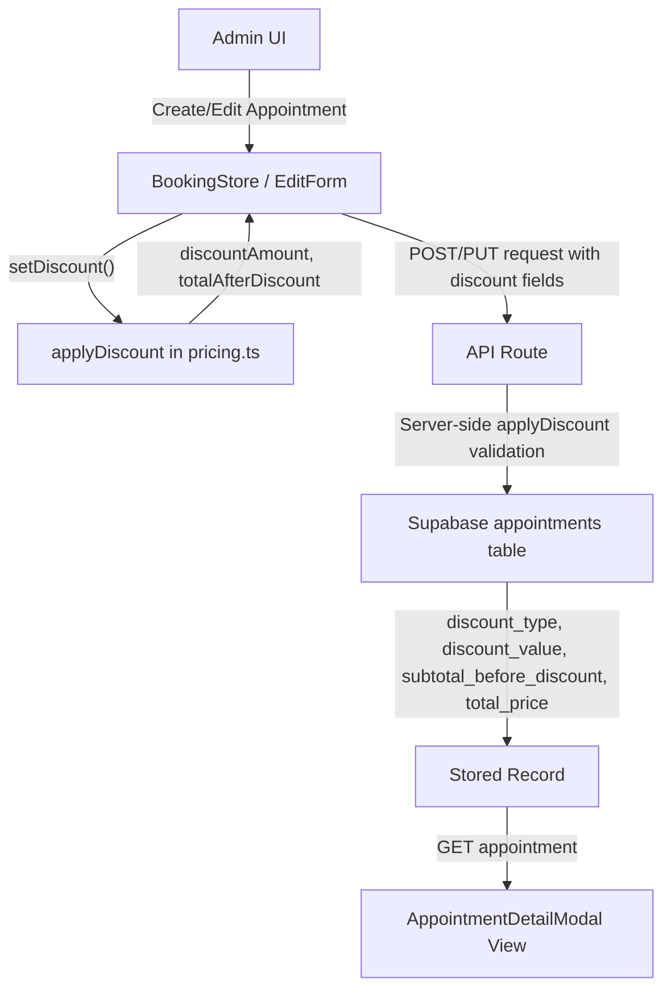
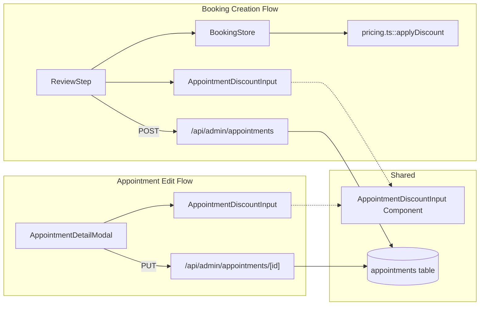

# Discount Support for Admin Appointments - Design Document

## Overview

### Problem Statement

Admins currently have no way to apply discounts when creating or editing appointments. The only discount mechanism exists in the waitlist booking flow (`DiscountInput.tsx`, `BookFromWaitlistModal.tsx`), which is percentage-only, baked directly into `total_price` with no audit trail. Once a waitlist discount is applied, the original price is lost.

### Solution

Add tracked, auditable discount support (both percentage and fixed-amount) to admin appointment creation and editing. This includes:

- Three new nullable columns on the `appointments` table for discount tracking
- A pure pricing function (`applyDiscount`) for consistent discount math
- A reusable `AppointmentDiscountInput` component for the admin UI
- Integration into the booking store, API routes, submission functions, and both the ReviewStep and AppointmentDetailModal UIs

### Business Value

- Enables admins to offer flexible discounts (loyalty, seasonal, first-time, etc.) during appointment creation or editing
- Preserves the original price for financial reporting and audit purposes
- Supports both percentage and fixed-dollar discounts
- Provides a consistent discount experience across all admin workflows

### Key Architectural Decisions

| Decision | Rationale |
|----------|-----------|
| Store discount metadata on `appointments` table (not a separate `discounts` table) | Discounts are tightly coupled to individual appointments; a junction table adds complexity without benefit at this scale |
| Use `subtotal_before_discount` column | Preserves audit trail; `total_price` remains the final charged amount |
| Both `discount_type` and `discount_value` must be set together or both null | Prevents inconsistent state (e.g., a type with no value) |
| Pure `applyDiscount()` function in `pricing.ts` | Single source of truth for discount math; used by both client (store) and server (API) |
| Admin-only feature (not exposed to customer booking) | Discounts are a business decision made by staff, not self-service |

---

## Architecture

### High-Level Data Flow



### Component Integration Map



### Integration Points

| System | Integration |
|--------|------------|
| Database (`appointments` table) | 3 new nullable columns |
| TypeScript types (`database.ts`) | Extended `Appointment` interface + new `DiscountInput` type |
| Pricing module (`pricing.ts`) | New `applyDiscount()` pure function |
| Booking store (`bookingStore.ts`) | New `discount` state + `setDiscount` action + updated `calculatePrices` |
| Admin POST API (`/api/admin/appointments`) | Accept and persist discount fields |
| Admin PUT API (`/api/admin/appointments/[id]`) | Accept and persist discount fields on edit |
| Submit functions (`submit.ts`) | Pass discount from store to API |
| ReviewStep component | Render `AppointmentDiscountInput` in admin/walkin modes |
| AppointmentDetailModal | Show discount in view mode; edit discount in edit mode |

---

## Components and Interfaces

### AppointmentDiscountInput Component

**File:** `src/components/admin/appointments/AppointmentDiscountInput.tsx`

**Purpose:** Reusable, controlled component for discount entry in admin contexts.

**Props Interface:**

```ts
interface AppointmentDiscountInputProps {
  discount: DiscountInput | null;
  subtotal: number;
  onChange: (discount: DiscountInput | null) => void;
}
```

**UI Design:**

- Collapsed state: A toggle button with Tag icon and "Add Discount" label
- Expanded state:
  - Two radio-style toggle buttons for type selection: "%" (percentage) and "$" (fixed amount)
  - Numeric input field with appropriate suffix (% or $)
  - Live preview line: "−$X.XX off" showing calculated discount amount
  - "Remove" text button to clear discount and collapse
- Follows admin UI patterns: charcoal (#434E54) text, cream (#F8EEE5) background tones, accent (#D4A574) for active states
- Input styling: `px-3 py-2.5 rounded-lg border border-[#434E54]/20 focus:ring-2 focus:ring-[#434E54]/30`

**Behavior:**

- Default type is `percentage` when first toggled on
- Default value is `0` (admin must enter a value)
- Percentage values clamped to 0-100
- Fixed values clamped to 0 and above (server enforces max = subtotal)
- Calls `onChange(null)` when "Remove" is clicked
- Calls `onChange({ type, value })` on every type or value change

**Validation:**

- Client-side: value must be a non-negative number; percentage max 100
- Server-side: fixed discount cannot exceed subtotal (capped, not rejected)

### ReviewStep Integration

**File:** `src/components/booking/steps/ReviewStep.tsx`

**Changes:**

- When `adminMode === true` (admin or walk-in mode): render `AppointmentDiscountInput` between the booking summary card and the groomer select section
- Update the price breakdown section to show:
  - Service price line
  - Addon lines (existing)
  - Subtotal line (service + addons) -- new, shown only when discount is active
  - Discount line: "Discount (15%)" or "Discount ($10.00)" with negative amount -- new
  - Total line (existing, now shows discounted total)

### AppointmentDetailModal Integration

**File:** `src/components/admin/appointments/AppointmentDetailModal.tsx`

**View Mode Changes:**

- In the pricing section, when `appointment.discount_type` is present:
  - Show "Subtotal" line with `subtotal_before_discount` value
  - Show "Discount (X%)" or "Discount ($X.XX)" line with negative discount amount
  - Show "Total" line with `total_price` (the discounted total)

**Edit Mode Changes:**

- Add `discount` field to `EditFormState`:
  ```ts
  interface EditFormState {
    // ...existing fields
    discount: DiscountInput | null;
  }
  ```
- Initialize `discount` from appointment data when entering edit mode
- Render `AppointmentDiscountInput` in the edit form
- Include discount in the PUT request body
- Recalculate `total_price` on the server when discount changes

---

## Data Models

### Database Schema Changes

**Migration file:** `supabase/migrations/20260315_add_appointment_discounts.sql`

```sql
-- Add discount tracking columns to appointments table
ALTER TABLE appointments
  ADD COLUMN discount_type text,
  ADD COLUMN discount_value numeric(10,2),
  ADD COLUMN subtotal_before_discount numeric(10,2);

-- Validate discount_type values
ALTER TABLE appointments
  ADD CONSTRAINT appointments_discount_type_check
  CHECK (discount_type IS NULL OR discount_type IN ('percentage', 'fixed'));

-- Ensure discount_type and discount_value are both set or both null
ALTER TABLE appointments
  ADD CONSTRAINT appointments_discount_consistency_check
  CHECK (
    (discount_type IS NULL AND discount_value IS NULL)
    OR
    (discount_type IS NOT NULL AND discount_value IS NOT NULL)
  );

-- Ensure discount_value is non-negative when set
ALTER TABLE appointments
  ADD CONSTRAINT appointments_discount_value_non_negative
  CHECK (discount_value IS NULL OR discount_value >= 0);

-- Ensure subtotal_before_discount is non-negative when set
ALTER TABLE appointments
  ADD CONSTRAINT appointments_subtotal_non_negative
  CHECK (subtotal_before_discount IS NULL OR subtotal_before_discount >= 0);

-- Add comment for documentation
COMMENT ON COLUMN appointments.discount_type IS 'Type of discount applied: percentage or fixed dollar amount';
COMMENT ON COLUMN appointments.discount_value IS 'Raw discount input value (e.g., 15 for 15% or 10.00 for $10)';
COMMENT ON COLUMN appointments.subtotal_before_discount IS 'Original service+addons price before discount, for audit trail';
```

**Design rationale for column choices:**

- `discount_type` as `text` with CHECK constraint (not an enum) to avoid needing a migration to add future types
- `numeric(10,2)` for monetary precision (matches existing `total_price` column pattern)
- All three columns are nullable for backward compatibility with existing appointments
- The consistency constraint ensures we never have partial discount data

### TypeScript Type Changes

**File:** `src/types/database.ts`

New shared type:

```ts
/** Discount specification for admin appointment creation/editing */
export interface DiscountInput {
  type: 'percentage' | 'fixed';
  value: number;
}
```

Extended `Appointment` interface (add after `booking_reference`):

```ts
export interface Appointment extends BaseEntity {
  // ...existing fields
  discount_type: 'percentage' | 'fixed' | null;
  discount_value: number | null;
  subtotal_before_discount: number | null;
  // ...existing joined data
}
```

### Pricing Module

**File:** `src/lib/booking/pricing.ts`

New exported function:

```ts
export interface DiscountResult {
  discountAmount: number;
  totalAfterDiscount: number;
}

/**
 * Apply a discount to a subtotal.
 * Pure function - no side effects.
 *
 * - Percentage: rounds to nearest cent
 * - Fixed: caps at subtotal (total cannot go below $0)
 * - Returns { discountAmount, totalAfterDiscount }
 */
export function applyDiscount(
  subtotal: number,
  discount: { type: 'percentage' | 'fixed'; value: number } | null
): DiscountResult {
  if (!discount || discount.value <= 0) {
    return { discountAmount: 0, totalAfterDiscount: subtotal };
  }

  let discountAmount: number;

  if (discount.type === 'percentage') {
    // Clamp percentage to 0-100
    const pct = Math.min(Math.max(discount.value, 0), 100);
    discountAmount = Math.round(subtotal * (pct / 100) * 100) / 100;
  } else {
    // Fixed: cannot exceed subtotal
    discountAmount = Math.min(discount.value, subtotal);
  }

  const totalAfterDiscount = Math.round((subtotal - discountAmount) * 100) / 100;

  return {
    discountAmount,
    totalAfterDiscount: Math.max(totalAfterDiscount, 0),
  };
}
```

**Design decisions:**

- `Math.round(... * 100) / 100` for cent-level precision (consistent with existing `calculatePrice` tax logic)
- Fixed discount is capped at subtotal, not rejected -- more user-friendly than an error
- Percentage clamped to 0-100 for safety
- Returns both `discountAmount` (for display) and `totalAfterDiscount` (for storage)

---

## State Management

### BookingStore Changes

**File:** `src/stores/bookingStore.ts`

**New state fields:**

```ts
// In BookingState interface:
discount: DiscountInput | null;
discountAmount: number;
```

**New action:**

```ts
// In BookingActions interface:
setDiscount: (discount: DiscountInput | null) => void;
```

**Updated `calculatePrices`:**

```ts
calculatePrices: () => {
  const { selectedService, petSize, selectedAddons, discount } = get();

  let servicePrice = 0;
  if (selectedService && petSize) {
    const priceEntry = selectedService.prices?.find((p) => p.size === petSize);
    servicePrice = priceEntry?.price || 0;
  }

  const addonsTotal = selectedAddons.reduce((sum, addon) => sum + addon.price, 0);
  const subtotal = servicePrice + addonsTotal;

  // Apply discount (admin/walkin mode only)
  const { discountAmount, totalAfterDiscount } = applyDiscount(subtotal, discount);

  set({
    servicePrice,
    addonsTotal,
    discountAmount,
    totalPrice: totalAfterDiscount,
  });
},
```

**Updated `setDiscount` action:**

```ts
setDiscount: (discount: DiscountInput | null) => {
  set({ discount, lastActivityTimestamp: Date.now() });
  get().calculatePrices();
},
```

**Updated `reset`:**

```ts
// Add to initialState:
discount: null,
discountAmount: 0,
```

**Updated `usePriceSummary` selector:**

```ts
export const usePriceSummary = () =>
  useBookingStore((state) => ({
    servicePrice: state.servicePrice,
    addonsTotal: state.addonsTotal,
    discountAmount: state.discountAmount,
    totalPrice: state.totalPrice,
  }));
```

---

## API Specifications

### POST `/api/admin/appointments`

**Changes to request body (new optional fields):**

```ts
// Add to CreateAppointmentSchema:
discount: z.object({
  type: z.enum(['percentage', 'fixed']),
  value: z.number().min(0).max(10000),
}).nullable().optional(),
```

**Server-side logic (after price calculation, before insert):**

```ts
// After calculating priceBreakdown.total (the subtotal):
const subtotal = priceBreakdown.total;
let finalPrice = subtotal;
let discountType: string | null = null;
let discountValue: number | null = null;
let subtotalBeforeDiscount: number | null = null;

if (data.discount && data.discount.value > 0) {
  const { discountAmount, totalAfterDiscount } = applyDiscount(subtotal, data.discount);
  finalPrice = totalAfterDiscount;
  discountType = data.discount.type;
  discountValue = data.discount.value;
  subtotalBeforeDiscount = subtotal;
}

// In the insert call, use:
// total_price: finalPrice,
// discount_type: discountType,
// discount_value: discountValue,
// subtotal_before_discount: subtotalBeforeDiscount,
```

### PUT `/api/admin/appointments/[id]`

**Changes to `AppointmentUpdateRequest`:**

```ts
interface AppointmentUpdateRequest {
  // ...existing fields
  discount?: { type: 'percentage' | 'fixed'; value: number } | null;
}
```

**Server-side logic:**

When `discount` is present in the request body:

1. Fetch the current appointment to get `subtotal_before_discount` (or recalculate from service + addons)
2. If `discount` is `null`: clear all three discount columns and set `total_price` = subtotal
3. If `discount` has a value: apply `applyDiscount()`, update all four columns (`total_price`, `discount_type`, `discount_value`, `subtotal_before_discount`)

**Subtotal recalculation on edit:**

When service or addons change alongside discount, the server must recalculate the subtotal from the new service price + addon prices before applying the discount. The logic flow:

1. Determine final `service_id` and `addon_ids` (from request or existing appointment)
2. Fetch service price for pet size + addon prices
3. Calculate subtotal
4. Apply discount if present
5. Store all four columns

### Response Format

Both POST and PUT responses include the full appointment object with discount fields populated.

---

## Error Handling

### Client-Side Validation

| Scenario | Handling |
|----------|---------|
| Percentage > 100 | Clamp to 100 in component; `applyDiscount` also clamps |
| Negative value | Input `min={0}` attribute; `applyDiscount` treats as no discount |
| Non-numeric input | `type="number"` on input; Zod schema rejects non-numbers |
| Fixed discount > subtotal | Allowed in UI; `applyDiscount` caps at subtotal |

### Server-Side Validation

| Scenario | Handling |
|----------|---------|
| `discount.type` not in `['percentage', 'fixed']` | Zod rejects with 400 |
| `discount.value` < 0 | Zod rejects with 400 |
| `discount.type` set but `discount.value` missing (or vice versa) | Zod object validation rejects |
| Database constraint violation | PostgreSQL CHECK constraint prevents inconsistent data; returns 500 with error |

### Edge Cases

| Edge Case | Behavior |
|-----------|----------|
| 100% discount | Total becomes $0.00; allowed |
| $0 discount value | Treated as no discount; discount columns set to null |
| Editing appointment to remove discount | Send `discount: null` in PUT; clears all discount columns, restores subtotal as total |
| Existing appointments without discount columns | Columns are nullable; null values render as no discount in UI |
| Waitlist discount migration | Out of scope; existing waitlist discounts remain percentage-only with no audit trail |

---

## Testing Strategy

### Unit Tests

**`applyDiscount` function (`src/lib/booking/pricing.test.ts`):**

| Test Case | Input | Expected Output |
|-----------|-------|-----------------|
| No discount (null) | `(100, null)` | `{ discountAmount: 0, totalAfterDiscount: 100 }` |
| 10% discount | `(100, { type: 'percentage', value: 10 })` | `{ discountAmount: 10, totalAfterDiscount: 90 }` |
| 100% discount | `(80, { type: 'percentage', value: 100 })` | `{ discountAmount: 80, totalAfterDiscount: 0 }` |
| $15 fixed discount | `(100, { type: 'fixed', value: 15 })` | `{ discountAmount: 15, totalAfterDiscount: 85 }` |
| Fixed discount > subtotal | `(50, { type: 'fixed', value: 75 })` | `{ discountAmount: 50, totalAfterDiscount: 0 }` |
| Rounding precision | `(99.99, { type: 'percentage', value: 15 })` | `{ discountAmount: 15.00, totalAfterDiscount: 84.99 }` |
| Zero value | `(100, { type: 'percentage', value: 0 })` | `{ discountAmount: 0, totalAfterDiscount: 100 }` |
| Negative value | `(100, { type: 'fixed', value: -5 })` | `{ discountAmount: 0, totalAfterDiscount: 100 }` |

### Component Tests

**`AppointmentDiscountInput` component:**

- Renders collapsed (toggle) state when `discount` is null
- Expands when toggle is clicked
- Switches between percentage and fixed types
- Calls `onChange` with correct `DiscountInput` on value change
- Calls `onChange(null)` when "Remove" is clicked
- Shows correct live preview calculation
- Clamps percentage input to 0-100

### Integration Tests

**API route tests:**

- POST with discount: verify discount columns persisted correctly
- POST without discount: verify discount columns are null
- PUT adding discount: verify total recalculated
- PUT removing discount: verify discount columns cleared
- PUT changing discount type: verify correct recalculation

### Manual Testing Checklist

- [ ] Create appointment with percentage discount and verify price summary
- [ ] Create appointment with fixed discount and verify price summary
- [ ] Create appointment without discount (backward compatibility)
- [ ] Edit appointment to add a discount
- [ ] Edit appointment to remove a discount
- [ ] Edit appointment to change discount type
- [ ] Verify discount displays correctly in AppointmentDetailModal view mode
- [ ] Verify walk-in appointment with discount
- [ ] Verify existing appointments without discount columns render correctly
- [ ] Test 100% discount (zero total)
- [ ] Test fixed discount exceeding subtotal

---

## File Change Summary

| File | Type | Description |
|------|------|-------------|
| `supabase/migrations/20260315_add_appointment_discounts.sql` | New | Database migration adding 3 columns + constraints |
| `src/types/database.ts` | Modify | Add `DiscountInput` type + extend `Appointment` interface |
| `src/lib/booking/pricing.ts` | Modify | Add `applyDiscount()` function + `DiscountResult` interface |
| `src/components/admin/appointments/AppointmentDiscountInput.tsx` | New | Reusable discount input component |
| `src/stores/bookingStore.ts` | Modify | Add `discount` state, `discountAmount`, `setDiscount` action, update `calculatePrices` and `reset` |
| `src/app/api/admin/appointments/route.ts` | Modify | Accept discount in POST, apply to total, persist columns |
| `src/app/api/admin/appointments/[id]/route.ts` | Modify | Accept discount in PUT, recalculate total, persist columns |
| `src/lib/booking/submit.ts` | Modify | Pass `discount` from store to admin/walkin API requests |
| `src/components/booking/steps/ReviewStep.tsx` | Modify | Render `AppointmentDiscountInput` in admin mode, update price breakdown |
| `src/components/admin/appointments/AppointmentDetailModal.tsx` | Modify | Show discount in view mode, edit discount in edit mode |
