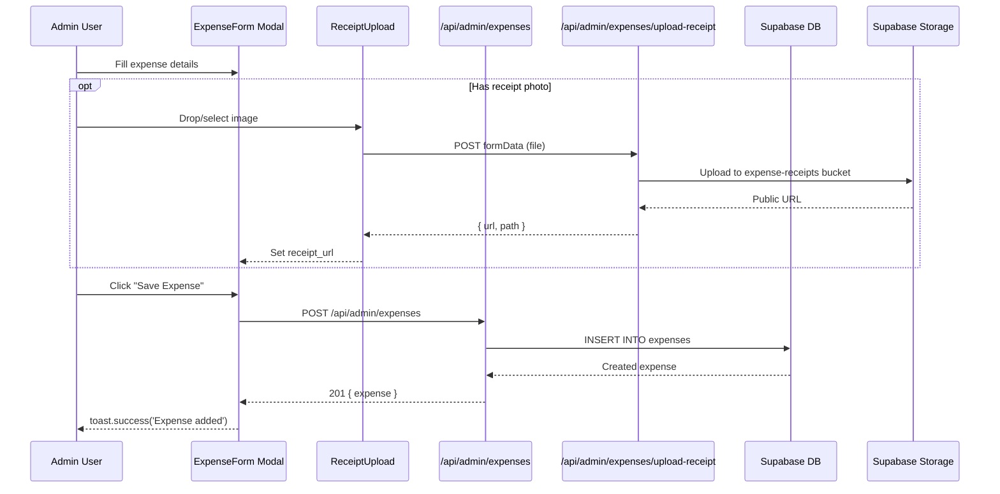

# Expenses Module MVP — Design Document

> **Feature:** Expense Tracking (Admin-Only MVP)
> **Status:** Draft
> **Created:** 2026-03-19
> **Requirements:** `docs/specs/expense-feature/expenses-feature.md` (full spec) + `.claude/plans/curious-spinning-kitten.md` (MVP plan)

---

## 1. Overview

- **Purpose:** Enable the Puppy Day owner to track business expenses, categorize them with grooming-specific categories, upload receipt photos, view spending summaries with charts, and export data as CSV/PDF. This is an admin-only MVP — no multi-tenant, no AI OCR, no integrations, no budgets.
- **Business Value:** Currently zero expense tracking exists in the app. This fills the gap for tax preparation, profit visibility, and financial record-keeping without requiring external tools like QuickBooks.
- **Scope:** New database tables, new API routes, new admin pages and components. No changes to existing tables or components (aside from adding a nav item to AdminSidebar).

### Key Design Decisions

| Decision | Rationale |
|----------|-----------|
| Amounts stored as integers (cents) | Avoids floating-point arithmetic errors |
| Free-text `vendor_name` instead of vendor table | MVP simplicity; vendor management deferred to Phase 2 |
| No AI receipt scanning | Cost and complexity; manual entry + photo upload sufficient for single-location |
| No budget tracking | Deferred to Phase 2 per user decision |
| `requireOwner()` not `requireAdmin()` | Expenses are owner-only; groomers should not access financial data |
| Recharts for charts (not Chart.js) | Recharts already used in admin analytics; composable React components |
| jsPDF for PDF export | Already a project dependency with `jspdf-autotable` |
| Supabase Storage for receipts | Follows existing `report-card-photos` bucket pattern |
| No recurring expenses | Deferred to Phase 2 |
| Single `status` field (draft/confirmed) | No `flagged` status needed without AI extraction |

## 2. Architecture

### High-Level System Context

```mermaid
graph TB
    subgraph Admin UI
        A[ExpenseDashboard] --> B[ExpenseSummaryCard]
        A --> C[CategoryDonutChart]
        A --> D[Recent Expenses List]
        E[ExpenseList Page] --> F[ExpenseRow]
        E --> G[Filters/Search]
        H[ExpenseForm Modal] --> I[CategoryPicker]
        H --> J[ReceiptUpload]
        K[CategoryManager Page]
        L[ExpenseDetail Page]
    end

    subgraph API Routes
        M[/api/admin/expenses]
        N[/api/admin/expenses/id]
        O[/api/admin/expenses/categories]
        P[/api/admin/expenses/categories/id]
        Q[/api/admin/expenses/upload-receipt]
        R[/api/admin/expenses/summary]
        S[/api/admin/expenses/export]
    end

    subgraph Database
        T[(expense_categories)]
        U[(expenses)]
        V[expense-receipts bucket]
    end

    A & E & H & K & L --> M & N & O & P & Q & R & S
    M & N & O & P & R & S --> T & U
    Q --> V
```

### Data Flow — Create Expense



### File Modification Summary

| File | Action | Description |
|------|--------|-------------|
| `src/app/(admin)/admin/expenses/page.tsx` | Create | Dashboard page (summary + chart + recent) |
| `src/app/(admin)/admin/expenses/list/page.tsx` | Create | Full expense list page |
| `src/app/(admin)/admin/expenses/[id]/page.tsx` | Create | Expense detail page |
| `src/app/(admin)/admin/expenses/categories/page.tsx` | Create | Category management page |
| `src/components/admin/expenses/ExpenseDashboard.tsx` | Create | Dashboard layout component |
| `src/components/admin/expenses/ExpenseList.tsx` | Create | Filterable/sortable list |
| `src/components/admin/expenses/ExpenseForm.tsx` | Create | Create/edit modal (RHF + Zod) |
| `src/components/admin/expenses/ExpenseDetail.tsx` | Create | Detail view component |
| `src/components/admin/expenses/ExpenseRow.tsx` | Create | Row with hover action bar |
| `src/components/admin/expenses/ExpenseSummaryCard.tsx` | Create | Monthly total + delta card |
| `src/components/admin/expenses/CategoryDonutChart.tsx` | Create | Recharts PieChart donut |
| `src/components/admin/expenses/CategoryPicker.tsx` | Create | Category selector dropdown |
| `src/components/admin/expenses/CategoryManager.tsx` | Create | Category CRUD component |
| `src/components/admin/expenses/ReceiptUpload.tsx` | Create | Drag-drop receipt upload |
| `src/components/admin/expenses/ExpenseExport.tsx` | Create | CSV/PDF export dropdown |
| `src/app/api/admin/expenses/route.ts` | Create | GET (list) + POST (create) |
| `src/app/api/admin/expenses/[id]/route.ts` | Create | GET + PUT + DELETE |
| `src/app/api/admin/expenses/categories/route.ts` | Create | GET + POST |
| `src/app/api/admin/expenses/categories/[id]/route.ts` | Create | PUT + DELETE |
| `src/app/api/admin/expenses/upload-receipt/route.ts` | Create | POST receipt image |
| `src/app/api/admin/expenses/summary/route.ts` | Create | GET dashboard data |
| `src/app/api/admin/expenses/export/route.ts` | Create | GET CSV/PDF |
| `src/types/expenses.ts` | Create | TypeScript types + Zod schemas |
| `src/lib/admin/expenses.ts` | Create | Utility functions |
| `src/components/admin/AdminSidebar.tsx` | Modify | Add Expenses nav item under Operations |

## 3. Components & Interfaces

### TypeScript Types (`src/types/expenses.ts`)

```typescript
import { z } from 'zod';

// ── Database Row Types ──

export interface ExpenseCategory {
  id: string;
  name: string;
  icon: string;
  color: string;
  description: string | null;
  is_default: boolean;
  is_tax_deductible: boolean;
  schedule_c_line: string | null;
  parent_category_id: string | null;
  display_order: number;
  created_at: string;
}

export interface Expense {
  id: string;
  amount: number; // cents
  date: string; // YYYY-MM-DD
  category_id: string;
  vendor_name: string | null;
  description: string | null;
  receipt_url: string | null;
  payment_method: PaymentMethod;
  is_tax_deductible: boolean;
  status: ExpenseStatus;
  created_by: string;
  created_at: string;
  updated_at: string;
}

export type PaymentMethod = 'cash' | 'card' | 'check' | 'bank_transfer' | 'other';
export type ExpenseStatus = 'draft' | 'confirmed';

// ── API Response Types ──

export interface ExpenseWithCategory extends Expense {
  category: ExpenseCategory;
}

export interface ExpenseListResponse {
  expenses: ExpenseWithCategory[];
  total: number;
  page: number;
  pageSize: number;
  totalPages: number;
}

export interface ExpenseSummary {
  currentMonth: {
    total: number; // cents
    count: number;
  };
  previousMonth: {
    total: number;
    count: number;
  };
  deltaPercent: number; // e.g. 12.5 means +12.5%
  byCategory: CategoryBreakdown[];
  recentExpenses: ExpenseWithCategory[];
}

export interface CategoryBreakdown {
  categoryId: string;
  categoryName: string;
  categoryIcon: string;
  categoryColor: string;
  total: number; // cents
  count: number;
  percent: number;
}

// ── Zod Schemas ──

export const PaymentMethodEnum = z.enum(['cash', 'card', 'check', 'bank_transfer', 'other']);
export const ExpenseStatusEnum = z.enum(['draft', 'confirmed']);

export const CreateExpenseSchema = z.object({
  amount: z.number().int().positive('Amount must be positive'),
  date: z.string().regex(/^\d{4}-\d{2}-\d{2}$/, 'Invalid date format'),
  category_id: z.string().uuid('Invalid category'),
  vendor_name: z.string().max(255).optional().nullable(),
  description: z.string().max(1000).optional().nullable(),
  receipt_url: z.string().url().optional().nullable(),
  payment_method: PaymentMethodEnum.default('card'),
  is_tax_deductible: z.boolean().default(false),
  status: ExpenseStatusEnum.default('confirmed'),
});

export const UpdateExpenseSchema = CreateExpenseSchema.partial();

export const CreateCategorySchema = z.object({
  name: z.string().min(1).max(100),
  icon: z.string().min(1).max(10).default('📦'),
  color: z.string().regex(/^#[0-9A-Fa-f]{6}$/).default('#6B7280'),
  description: z.string().max(500).optional().nullable(),
  is_tax_deductible: z.boolean().default(false),
  schedule_c_line: z.string().max(100).optional().nullable(),
  parent_category_id: z.string().uuid().optional().nullable(),
});

export const UpdateCategorySchema = CreateCategorySchema.partial();

// ── Filter Types ──

export interface ExpenseFilters {
  dateFrom?: string;
  dateTo?: string;
  categoryId?: string;
  paymentMethod?: PaymentMethod;
  status?: ExpenseStatus;
  search?: string;
  sortBy?: 'date' | 'amount';
  sortOrder?: 'asc' | 'desc';
  page?: number;
  pageSize?: number;
}
```

### Utility Functions (`src/lib/admin/expenses.ts`)

```typescript
/**
 * Convert cents to formatted dollar string: 12450 → "$124.50"
 */
export function formatCents(cents: number): string {
  return `$${(cents / 100).toFixed(2)}`;
}

/**
 * Convert dollar string/number to cents: "124.50" → 12450
 */
export function parseDollarsToCents(dollars: string | number): number {
  const num = typeof dollars === 'string' ? parseFloat(dollars) : dollars;
  return Math.round(num * 100);
}

/**
 * Calculate percent delta between two values.
 * Returns 0 if previous is 0.
 */
export function calcDeltaPercent(current: number, previous: number): number {
  if (previous === 0) return current > 0 ? 100 : 0;
  return Math.round(((current - previous) / previous) * 1000) / 10;
}

/**
 * Payment method display labels
 */
export const PAYMENT_METHOD_LABELS: Record<string, string> = {
  cash: 'Cash',
  card: 'Card',
  check: 'Check',
  bank_transfer: 'Bank Transfer',
  other: 'Other',
};
```

### API Route Specifications

All admin expense API routes use the **two-client pattern**:
1. Authenticate with `createServerSupabaseClient()` + `requireOwner()` (owner-only)
2. Query with `createServiceRoleClient()` to bypass RLS

#### `GET /api/admin/expenses` — List Expenses

**Query Parameters:**
| Param | Type | Default | Description |
|-------|------|---------|-------------|
| `page` | number | 1 | Page number |
| `pageSize` | number | 20 | Items per page |
| `dateFrom` | string | — | YYYY-MM-DD start filter |
| `dateTo` | string | — | YYYY-MM-DD end filter |
| `categoryId` | string | — | Filter by category UUID |
| `paymentMethod` | string | — | Filter by payment method |
| `status` | string | — | Filter by status |
| `search` | string | — | Search vendor_name, description |
| `sortBy` | string | `date` | Sort field: `date` or `amount` |
| `sortOrder` | string | `desc` | Sort direction |

**Response:** `200 OK` → `ExpenseListResponse`
**Errors:** `401` Unauthorized, `500` Server Error

#### `POST /api/admin/expenses` — Create Expense

**Request Body:** `CreateExpenseSchema` (Zod validated)
**Response:** `201 Created` → `{ expense: ExpenseWithCategory }`
**Errors:** `400` Validation Error, `401` Unauthorized, `500` Server Error

#### `GET /api/admin/expenses/[id]` — Get Expense

**Response:** `200 OK` → `{ expense: ExpenseWithCategory }`
**Errors:** `401`, `404`, `500`

#### `PUT /api/admin/expenses/[id]` — Update Expense

**Request Body:** `UpdateExpenseSchema` (partial)
**Response:** `200 OK` → `{ expense: ExpenseWithCategory }`
**Errors:** `400`, `401`, `404`, `500`

#### `DELETE /api/admin/expenses/[id]` — Delete Expense

**Response:** `200 OK` → `{ success: true }`
**Errors:** `401`, `404`, `500`

#### `GET /api/admin/expenses/categories` — List Categories

**Response:** `200 OK` → `{ categories: ExpenseCategory[] }` (ordered by `display_order`)

#### `POST /api/admin/expenses/categories` — Create Category

**Request Body:** `CreateCategorySchema`
**Response:** `201 Created` → `{ category: ExpenseCategory }`

#### `PUT /api/admin/expenses/categories/[id]` — Update Category

**Request Body:** `UpdateCategorySchema`
**Response:** `200 OK` → `{ category: ExpenseCategory }`
**Notes:** Default categories (`is_default = true`) can only update `icon`, `color`, `description`.

#### `DELETE /api/admin/expenses/categories/[id]` — Delete Category

**Response:** `200 OK` → `{ success: true }`
**Errors:** `400` if category has associated expenses, `400` if `is_default = true`, `401`, `404`

#### `POST /api/admin/expenses/upload-receipt` — Upload Receipt

**Request Body:** `multipart/form-data` with `file` field (JPEG/PNG/WebP, max 10MB)
**Response:** `200 OK` → `{ success: true, url: string, path: string }`
**Pattern:** Follows `report-cards/upload` route exactly — upload to `expense-receipts` bucket.

#### `GET /api/admin/expenses/summary` — Dashboard Summary

**Query Parameters:** `month` (YYYY-MM, defaults to current month)
**Response:** `200 OK` → `ExpenseSummary`

#### `GET /api/admin/expenses/export` — Export

**Query Parameters:** Same filters as list endpoint + `format` (`csv` | `pdf`)
**Response:**
- CSV: `200 OK` with `Content-Type: text/csv`, `Content-Disposition: attachment`
- PDF: `200 OK` with `Content-Type: application/pdf`, `Content-Disposition: attachment`

## 4. Data Models

### Migration SQL

```sql
-- expense_categories table
CREATE TABLE expense_categories (
  id UUID PRIMARY KEY DEFAULT gen_random_uuid(),
  name TEXT NOT NULL,
  icon TEXT NOT NULL DEFAULT '📦',
  color TEXT NOT NULL DEFAULT '#6B7280',
  description TEXT,
  is_default BOOLEAN NOT NULL DEFAULT false,
  is_tax_deductible BOOLEAN NOT NULL DEFAULT false,
  schedule_c_line TEXT,
  parent_category_id UUID REFERENCES expense_categories(id) ON DELETE SET NULL,
  display_order INTEGER NOT NULL DEFAULT 0,
  created_at TIMESTAMPTZ NOT NULL DEFAULT now()
);

-- expenses table
CREATE TABLE expenses (
  id UUID PRIMARY KEY DEFAULT gen_random_uuid(),
  amount INTEGER NOT NULL CHECK (amount > 0),
  date DATE NOT NULL DEFAULT CURRENT_DATE,
  category_id UUID NOT NULL REFERENCES expense_categories(id) ON DELETE RESTRICT,
  vendor_name TEXT,
  description TEXT,
  receipt_url TEXT,
  payment_method TEXT NOT NULL DEFAULT 'card'
    CHECK (payment_method IN ('cash','card','check','bank_transfer','other')),
  is_tax_deductible BOOLEAN NOT NULL DEFAULT false,
  status TEXT NOT NULL DEFAULT 'confirmed'
    CHECK (status IN ('draft','confirmed')),
  created_by UUID NOT NULL REFERENCES users(id),
  created_at TIMESTAMPTZ NOT NULL DEFAULT now(),
  updated_at TIMESTAMPTZ NOT NULL DEFAULT now()
);

-- Indexes
CREATE INDEX idx_expenses_date ON expenses(date DESC);
CREATE INDEX idx_expenses_category ON expenses(category_id);
CREATE INDEX idx_expenses_status ON expenses(status);

-- RLS policies (admin-only via is_admin())
ALTER TABLE expense_categories ENABLE ROW LEVEL SECURITY;
ALTER TABLE expenses ENABLE ROW LEVEL SECURITY;

CREATE POLICY "Admin full access on expense_categories"
  ON expense_categories FOR ALL
  USING (is_admin())
  WITH CHECK (is_admin());

CREATE POLICY "Admin full access on expenses"
  ON expenses FOR ALL
  USING (is_admin())
  WITH CHECK (is_admin());

-- Updated_at trigger for expenses
CREATE TRIGGER set_expenses_updated_at
  BEFORE UPDATE ON expenses
  FOR EACH ROW
  EXECUTE FUNCTION update_updated_at_column();

-- Seed default categories
INSERT INTO expense_categories (name, icon, color, is_default, is_tax_deductible, schedule_c_line, display_order) VALUES
  ('Grooming Supplies', '🧴', '#F59E0B', true, true, 'Line 22 - Supplies', 1),
  ('Grooming Tools', '🔧', '#8B5CF6', true, true, 'Line 22 - Supplies', 2),
  ('Rent & Utilities', '🏠', '#3B82F6', true, true, 'Line 20b - Rent', 3),
  ('Payroll & Labor', '👥', '#10B981', true, true, 'Line 26 - Wages', 4),
  ('Vehicle', '🚗', '#EF4444', true, true, 'Line 9 - Car/Truck', 5),
  ('Advertising', '📢', '#EC4899', true, true, 'Line 8 - Advertising', 6),
  ('Insurance', '🛡️', '#6366F1', true, true, 'Line 15 - Insurance', 7),
  ('Software & Subscriptions', '💻', '#14B8A6', true, true, 'Line 18 - Office', 8),
  ('Bank Fees', '🏦', '#64748B', true, true, 'Line 10 - Commissions/Fees', 9),
  ('Licenses & Permits', '📋', '#A855F7', true, true, 'Line 12 - Depletion', 10),
  ('Meals & Entertainment', '🍽️', '#F97316', true, false, NULL, 11),
  ('Office & Admin', '📦', '#78716C', true, true, 'Line 18 - Office', 12),
  ('Other', '➕', '#6B7280', true, false, NULL, 13);
```

### Type Mapping: DB → API → Component

| DB Column | API Response Field | Component Prop |
|-----------|-------------------|----------------|
| `expenses.amount` (int cents) | `expense.amount` (number) | Displayed via `formatCents()` |
| `expenses.date` (DATE) | `expense.date` (string "YYYY-MM-DD") | Formatted via `date-fns` |
| `expense_categories.*` | `expense.category` (joined) | `ExpenseRow` category icon/name |
| `expenses.receipt_url` | `expense.receipt_url` | `` in detail, thumbnail in row |

## 5. State Management

No Zustand store changes needed. All expense data is fetched via API calls with `fetch()` in components and pages. Server components will do initial data fetching; client components handle mutations with `fetch` + toast notifications.

Rationale: Expenses are a self-contained admin module with no cross-page state requirements. Using local component state and SWR-style refetching (via router.refresh or key-based re-fetch) keeps complexity low.

## 6. UI Specifications

### Component Hierarchy

```
/admin/expenses (Dashboard)
├── ExpenseDashboard
│   ├── ExpenseSummaryCard (this month total, delta vs prior)
│   ├── CategoryDonutChart (Recharts PieChart, innerRadius=60)
│   ├── Recent 5 ExpenseRow items
│   ├── "View All" link → /admin/expenses/list
│   └── "Add Expense" → opens ExpenseForm modal

/admin/expenses/list
├── ExpenseList
│   ├── Filter bar (date range, category dropdown, payment method, search input)
│   ├── Sort toggle (date/amount, asc/desc)
│   ├── ExpenseRow[] (paginated, 20/page)
│   │   └── Hover action bar: Edit | Delete
│   ├── Pagination controls
│   ├── ExpenseExport dropdown button
│   └── Empty state (dog-themed)

/admin/expenses/[id]
├── ExpenseDetail
│   ├── Receipt image (if present, click to expand)
│   ├── Amount, date, category, vendor, payment, status, tax, description
│   ├── Edit button → opens ExpenseForm modal (edit mode)
│   └── Delete button → confirm → delete

/admin/expenses/categories
├── CategoryManager
│   ├── Category list (drag-to-reorder via @dnd-kit)
│   ├── Default categories: edit icon/color/description only
│   ├── Custom categories: full edit + delete (guarded)
│   └── "Add Category" button
```

### Design System Compliance

- **Background:** `bg-[#F8EEE5]` (warm cream, inherited from admin layout)
- **Cards:** `bg-white rounded-xl shadow-sm p-6`, hover: `shadow-md`
- **Primary text:** `text-[#434E54]`
- **Secondary text:** `text-[#434E54]/60`
- **Accent strip on cards:** `h-1.5 bg-[#D4A574]` top strip
- **Expense amounts:** `text-[#EF4444]` (red for expenses in lists), `text-[#22C55E]` (green for revenue in charts)
- **Buttons:** `AdminButton` component for all actions
- **Icons:** Lucide React (Receipt, DollarSign, PieChart, Download, Plus, Pencil, Trash2, Filter, Search)
- **Modals:** Use `AdminModal` from `src/components/admin/shared/AdminModal.tsx` (handles AnimatePresence, focus trap, backdrop, responsive sizing)
- **Inputs:** `px-3 py-2.5 rounded-lg border border-[#434E54]/20 focus:ring-2 focus:ring-[#434E54]/30`
- **Animations:** `y: 16` slide-up for cards, `delay: index * 0.05` stagger for list items

### ExpenseForm Modal

- Rendered inside `AdminModal` from `src/components/admin/shared/AdminModal.tsx`
- Uses React Hook Form + Zod (`CreateExpenseSchema`)
- Amount input: dollar display with auto-conversion to cents on submit via `parseDollarsToCents()`
- Date input: native `<input type="date">` — **no `input-sm` or `input-xs`**
- Category: CategoryPicker component (dropdown with emoji + color dot + name)
- Receipt: ReceiptUpload component (react-dropzone, image preview, compression via browser-image-compression)
- Payment method: radio group (not select dropdown) per admin UI pattern
- Tax deductible: toggle/checkbox, defaults to category's `is_tax_deductible`

### ExpenseSummaryCard

- Large amount: `text-3xl font-bold text-[#434E54]`
- Delta indicator: green arrow-up / red arrow-down with percent
- Layout: horizontal card with divider, matching existing admin dashboard stat pattern

### CategoryDonutChart

- Recharts `PieChart` with `Pie` component, `innerRadius={60}` `outerRadius={90}`
- Center text: total amount
- Legend below chart: category icon + name + percent + amount
- Colors from category `color` field
- Animate on load

### Mobile-First Layout Strategy

**Mobile (default, <768px):**
- **Dashboard:** Vertical stack — StatsCard row (`grid grid-cols-2 gap-3`) → donut chart (full-width) → recent expenses (card list)
- **Expense list:** Card-based layout (not table), each card shows category emoji + vendor + amount (right-aligned) + date below
- **Filters:** Hidden behind `MobileFilterSheet` (bottom sheet), triggered by filter icon button
- **Quick category filter:** `MobileChipRow` (horizontal scrollable chips) above the list
- **Add expense:** `MobileFAB` (floating action button, bottom-right, above MobileBottomTabs)
- **Form modal:** `AdminModal` renders near-fullscreen (`max-w-[calc(100vw-2rem)]`, `max-h-[90vh]`)
- **Receipt upload:** Full-width drop zone, camera capture via `accept="image/*" capture="environment"`
- **Empty state:** `MobileEmptyState` component (dog-themed)
- **Export:** Bottom sheet with CSV/PDF options (via `MobileFilterSheet`)
- **Category manager:** Card list with swipe-reveal actions or long-press menu
- **View toggle:** `MobileSegmentedControl` for dashboard period (e.g., "This Month" / "Last Month")

**Tablet (md, 768–1023px):**
- **Dashboard:** 2-col grid — summary cards left, donut chart right; recent expenses full-width below
- **Expense list:** Compact table with fewer visible columns (hide description, payment method)
- **Filters:** Inline row (`SearchFilterBar`)

**Desktop (lg, ≥1024px):**
- **Dashboard:** 2-col layout (summary + chart side by side), recent expenses below
- **Expense list:** Full table with all columns, hover action bars
- **Filters:** Inline bar with dropdowns (`SearchFilterBar`)

### ExpenseRow — Dual Render Modes

- **Card mode** (mobile, `lg:hidden`): Rounded card with category emoji, vendor name, amount (right-aligned, `text-[#EF4444]`), date below, tap to navigate to detail
- **Row mode** (desktop, `hidden lg:table-row`): Traditional table row with hover action bar (Edit | Delete)

### ExpenseList — Dual Layout

Follows the `CustomerTable` dual-layout pattern:
- `hidden lg:block` → `<table>` with `<thead>`/`<tbody>`, ExpenseRow in row mode
- `lg:hidden` → `<div className="space-y-3">` card stack, ExpenseRow in card mode

### Dashboard Layout — Responsive Grid

- **Mobile:** `grid grid-cols-2 gap-3` for StatsCards, full-width chart below
- **Desktop:** Existing 2-col layout with summary + chart side by side

### MobileHeader Page Title

Add to `MobileHeader.tsx` PAGE_TITLES map:
- `'/admin/expenses'`: `'Expenses'`
- `'/admin/expenses/list'`: `'Expense List'`
- `'/admin/expenses/categories'`: `'Categories'`

### Touch Target Compliance

All interactive elements must be minimum 44×44px (`min-h-[44px] min-w-[44px]`). Already enforced in `AdminModal` close button — apply same to all expense buttons, filter chips, and FAB.

### 6.1 Shared Admin Mobile Components

The expense feature MUST reuse these existing shared components — do NOT create custom alternatives:

| Component | Path | Usage in Expenses |
|---|---|---|
| `MobileFAB` | `src/components/admin/mobile/MobileFAB.tsx` | "Add Expense" floating button on list + dashboard |
| `MobileFilterSheet` | `src/components/admin/mobile/MobileFilterSheet.tsx` | Filter bottom sheet on expense list (date range, category, payment method, status) |
| `MobileChipRow` | `src/components/admin/mobile/MobileChipRow.tsx` | Quick category filter chips above expense list |
| `MobileEmptyState` | `src/components/admin/mobile/MobileEmptyState.tsx` | Empty state for expense list + dashboard |
| `MobileSegmentedControl` | `src/components/admin/mobile/MobileSegmentedControl.tsx` | Dashboard view toggle (e.g., "This Month" / "Last Month") |
| `AdminModal` | `src/components/admin/shared/AdminModal.tsx` | ExpenseForm modal (replaces custom modal spec) |
| `SearchFilterBar` | `src/components/admin/shared/SearchFilterBar.tsx` | Desktop/tablet filter bar for expense list |
| `StatsCard` / `StatsRow` | `src/components/admin/shared/StatsCard.tsx` | Dashboard summary stats (total, count, delta) |
| `AdminSkeleton` | `src/components/admin/shared/AdminSkeleton.tsx` | Loading states |
| `StatusBadge` | `src/components/admin/shared/StatusBadge.tsx` | Draft/confirmed status badge |
| `ConfirmationModal` | `src/components/ui/ConfirmationModal.tsx` | Delete confirmation |

### Accessibility

- Modal: `role="dialog" aria-modal="true"`, focus trap, Escape to close
- Form inputs: `aria-label`, `aria-required`, `aria-invalid` on validation errors
- Chart: `aria-label` on SVG, text-based legend as alternative
- Keyboard: Tab navigation through all interactive elements
- Color: Never sole indicator — always paired with icon/text

## 7. Error Handling & Edge Cases

### Validation (Zod)

- Amount: must be positive integer (cents)
- Date: must match YYYY-MM-DD format
- Category: must be valid UUID referencing existing category
- Receipt upload: JPEG/PNG/WebP only, max 10MB
- Vendor name: max 255 chars
- Description: max 1000 chars

### Edge Cases

| Edge Case | Design Solution |
|-----------|-----------------|
| Delete category with existing expenses | API returns 400 with message "Category has N expenses. Reassign or delete them first." |
| Delete default category | API returns 400 "Cannot delete default categories" |
| Upload oversized receipt | Client-side compression via browser-image-compression before upload; server rejects >10MB |
| No expenses yet (empty state) | Dog-themed empty state with illustration and "Add your first expense" CTA |
| Month with zero expenses | Summary card shows $0.00, delta shows "N/A", donut chart shows empty state |
| Very long vendor name | Truncated with ellipsis in list view, full in detail view |
| Export with no matching expenses | CSV with headers only; PDF with "No expenses found for this period" |

### Toast Notifications

| Action | Success | Error |
|--------|---------|-------|
| Create expense | `toast.success('Expense added')` | `toast.error('Failed to add expense')` |
| Update expense | `toast.success('Expense updated')` | `toast.error('Failed to update expense')` |
| Delete expense | `toast.success('Expense deleted')` | `toast.error('Failed to delete expense')` |
| Upload receipt | `toast.success('Receipt uploaded')` | `toast.error('Failed to upload receipt')` |
| Create category | `toast.success('Category created')` | `toast.error('Failed to create category')` |
| Update category | `toast.success('Category updated')` | `toast.error('Failed to update category')` |
| Delete category | `toast.success('Category deleted')` | `toast.error('Failed to delete category')` |
| Export | `toast.success('Export downloaded')` | `toast.error('Failed to export')` |

## 8. Implementation Phases

### Phase 1: Database + Types + Utilities
- Run Supabase migration (tables, RLS, indexes, trigger, seed)
- Create `expense-receipts` storage bucket
- Create `src/types/expenses.ts`
- Create `src/lib/admin/expenses.ts`
- **Verify:** Tables visible in Supabase dashboard, 13 seed categories exist, RLS blocks non-admin access

### Phase 2: API Routes
- All 7 API route files (expenses CRUD, categories CRUD, upload, summary, export)
- Auth: `requireOwner()` on all routes
- Pattern: two-client (auth with `createServerSupabaseClient`, query with `createServiceRoleClient`)
- **Verify:** All endpoints testable via curl/browser with admin session

### Phase 3: Core Components
- ExpenseForm (modal), CategoryPicker, ReceiptUpload, ExpenseRow, ExpenseDetail
- **Verify:** Components render in isolation, form validates, upload works

### Phase 4: Expense List Page
- `list/page.tsx` + ExpenseList with filters, sort, pagination, empty state
- ExpenseExport dropdown (CSV/PDF)
- **Verify:** Navigate to `/admin/expenses/list`, create expense, see it in list, filter, export

### Phase 5: Dashboard + Detail + Categories
- Dashboard page with ExpenseSummaryCard, CategoryDonutChart, recent expenses
- Detail page (`[id]/page.tsx`)
- CategoryManager page
- **Verify:** Dashboard shows summary data, donut chart renders, detail page loads, categories manageable

### Phase 6: Navigation + Polish
- Add "Expenses" to AdminSidebar under Operations (`ownerOnly: true`, Receipt icon)
- Loading skeletons for all pages
- Responsive layout adjustments
- **Verify:** Nav appears for owner only, loading states smooth, mobile layout works, `npm run build` passes

## 9. Testing Strategy

### Unit Tests

| Test Case | Input | Expected Output |
|-----------|-------|-----------------|
| `formatCents(12450)` | 12450 | `"$124.50"` |
| `formatCents(0)` | 0 | `"$0.00"` |
| `formatCents(5)` | 5 | `"$0.05"` |
| `parseDollarsToCents("124.50")` | "124.50" | 12450 |
| `parseDollarsToCents("0.99")` | "0.99" | 99 |
| `parseDollarsToCents(50)` | 50 | 5000 |
| `calcDeltaPercent(1100, 1000)` | 1100, 1000 | 10 |
| `calcDeltaPercent(500, 0)` | 500, 0 | 100 |
| `calcDeltaPercent(0, 0)` | 0, 0 | 0 |
| Zod: CreateExpenseSchema rejects negative amount | `{ amount: -100 }` | Validation error |
| Zod: CreateExpenseSchema rejects invalid date | `{ date: "not-a-date" }` | Validation error |
| Zod: CreateExpenseSchema rejects invalid payment method | `{ payment_method: "bitcoin" }` | Validation error |

### Integration Tests

| Test Case | Setup | Steps | Expected Result |
|-----------|-------|-------|-----------------|
| Create expense via API | Auth as owner | POST `/api/admin/expenses` with valid body | 201, expense returned with ID |
| List expenses with filters | 3 expenses in DB | GET `/api/admin/expenses?categoryId=X` | Only matching expenses returned |
| Delete category with expenses | Category + 1 expense | DELETE `/api/admin/expenses/categories/[id]` | 400 error, category not deleted |
| Upload receipt | Auth as owner | POST multipart with JPEG | 200, URL returned, file in storage |
| Non-owner blocked | Auth as groomer | GET `/api/admin/expenses` | 401 Unauthorized |

### Manual Verification

- [ ] Navigate to `/admin/expenses` — dashboard loads with summary and chart
- [ ] Click "Add Expense" — modal opens with form
- [ ] Fill form, upload receipt, save — toast success, appears in list
- [ ] Navigate to expense detail — all fields displayed, receipt image visible
- [ ] Edit expense — modal pre-filled, save updates correctly
- [ ] Delete expense — confirmation, toast success, removed from list
- [ ] Filter list by category, date range, payment method
- [ ] Export CSV — opens download with correct data
- [ ] Export PDF — opens download with branded layout
- [ ] Manage categories — edit icon/color, add custom, attempt delete with expenses (blocked)
- [ ] Verify sidebar shows "Expenses" under Operations (owner only)
- [ ] Login as groomer — "Expenses" not visible in sidebar
- [ ] Mobile responsive — all pages usable on 375px width

## 10. Risk Assessment

| Risk | Impact | Mitigation |
|------|--------|------------|
| Storage bucket creation requires Supabase dashboard access | Low | Document manual bucket creation step; can also use Supabase MCP tools |
| `update_updated_at_column()` function may not exist | Medium | Check for existing trigger function; create if missing in migration |
| Large receipt files slow upload | Low | Client-side compression via browser-image-compression (already a dependency) |
| Recharts bundle size impact | Low | Dynamic import `CategoryDonutChart` with `next/dynamic` |
| Category reordering with @dnd-kit | Low | Already a project dependency; follow existing patterns |
| PDF export for large date ranges | Medium | Limit export to 1000 records; show warning if exceeded |
