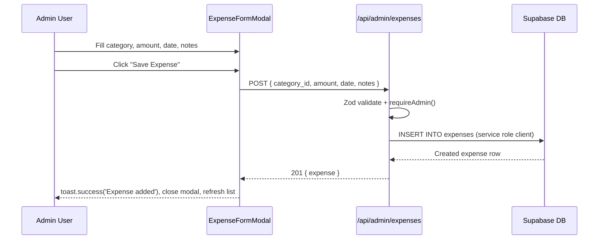

# Expense Tracking — Design Document

> **Feature:** Expense Tracking (Admin-Only)
> **Status:** Draft
> **Created:** 2026-03-27
> **Requirements:** `.claude/plans/expense-tracking-feature.md`

---

## 1. Overview

- **Purpose:** Enable the Puppy Day owner to track business expenses by category, set monthly budgets per category, view analytics with charts and budget progress, and export data as CSV. This is admin-only with manual entry — no receipt uploads, no recurring expenses, no payment method tracking.
- **Business Value:** Currently zero expense tracking exists. This fills the gap between revenue analytics (already built) and spending visibility, enabling profit calculations and budget discipline without external tools.
- **Scope:** Two new database tables (`expense_categories`, `expenses`), budget settings in existing `settings` table, 5 new API route files, 6 new UI components, 1 new page, sidebar/dashboard modifications.

### Key Design Decisions

| Decision | Rationale |
|----------|-----------|
| Amounts stored as `NUMERIC(10,2)` (dollars) | Matches plan spec; simpler than cents conversion for a single-location business |
| No receipt uploads | Plan explicitly excludes; keeps MVP focused |
| No vendor/payment method fields | Plan explicitly excludes; simplifies data model |
| Budget settings in `settings` table (JSON) | Follows existing pattern (loyalty, booking settings use same table) |
| `requireAdmin()` not `requireOwner()` | Plan says "admin-only"; consistent with other admin routes |
| Recharts for charts | Already used in admin analytics; composable React components |
| Single page with tabs/sections | Plan specifies single `/admin/expenses` page, not multi-page |
| No Zustand store | Self-contained admin module; local state + refetch sufficient |

## 2. Architecture

### High-Level System Context

```mermaid
graph TB
    subgraph Admin UI
        A[ExpensesClient Page] --> B[ExpenseAnalytics]
        A --> C[Action Bar]
        A --> D[ExpenseTable]
        E[ExpenseFormModal]
        F[BudgetSettingsModal]
        G[CategoryManagement]
        H[ExpenseWidget - Dashboard]
    end

    subgraph API Routes
        I[/api/admin/expenses]
        J[/api/admin/expenses/id]
        K[/api/admin/expenses/categories]
        L[/api/admin/expenses/categories/id]
        M[/api/admin/expenses/budgets]
        N[/api/admin/expenses/analytics]
        O[/api/admin/expenses/export]
    end

    subgraph Database
        P[(expense_categories)]
        Q[(expenses)]
        R[(settings - expense_budgets key)]
    end

    A & E & F & G --> I & J & K & L & M & N & O
    H --> N
    I & J & K & L --> P & Q
    M --> R
    N --> P & Q & R
    O --> P & Q
```

### Data Flow — Create Expense



### File Modification Summary

| File | Action | Description |
|------|--------|-------------|
| `supabase/migrations/20260327_create_expense_tables.sql` | Create | Migration: tables, indexes, RLS, trigger, seed |
| `src/types/expenses.ts` | Create | TypeScript interfaces + Zod schemas |
| `src/app/api/admin/expenses/route.ts` | Create | GET (list) + POST (create) |
| `src/app/api/admin/expenses/[id]/route.ts` | Create | PUT (update) + DELETE |
| `src/app/api/admin/expenses/categories/route.ts` | Create | GET (list) + POST (create) |
| `src/app/api/admin/expenses/categories/[id]/route.ts` | Create | DELETE (custom only) |
| `src/app/api/admin/expenses/budgets/route.ts` | Create | GET + PUT budget settings |
| `src/app/api/admin/expenses/analytics/route.ts` | Create | GET analytics data |
| `src/app/api/admin/expenses/export/route.ts` | Create | GET CSV download |
| `src/hooks/admin/use-expenses.ts` | Create | Data fetching hook with mutations |
| `src/components/admin/expenses/ExpenseTable.tsx` | Create | Sortable, filterable expense table |
| `src/components/admin/expenses/ExpenseFormModal.tsx` | Create | Create/edit expense modal |
| `src/components/admin/expenses/CategoryManagement.tsx` | Create | Category chips with add/delete |
| `src/components/admin/expenses/ExpenseAnalytics.tsx` | Create | KPI cards + chart + budget bars |
| `src/components/admin/expenses/BudgetSettingsModal.tsx` | Create | Per-category budget input modal |
| `src/app/(admin)/admin/expenses/page.tsx` | Create | Server component with auth + Suspense |
| `src/app/(admin)/admin/expenses/ExpensesClient.tsx` | Create | Client component composing all sections |
| `src/components/admin/dashboard/ExpenseWidget.tsx` | Create | Dashboard widget card |
| `src/components/admin/AdminSidebar.tsx` | Modify | Add Expenses nav item |
| `src/components/admin/AdminMobileNav.tsx` | Modify | Add Expenses nav item |
| `src/app/(admin)/admin/dashboard/DashboardClient.tsx` | Modify | Add ExpenseWidget to grid |
| `src/hooks/admin/use-dashboard-data.ts` | Modify | Add expense summary fetch |

## 3. Components & Interfaces

### TypeScript Types (`src/types/expenses.ts`)

```typescript
import { z } from 'zod';

// ── Database Row Types ──

export interface ExpenseCategory {
  id: string;
  name: string;
  is_preset: boolean;
  created_at: string;
}

export interface Expense {
  id: string;
  category_id: string;
  amount: number; // decimal dollars (NUMERIC(10,2))
  date: string; // YYYY-MM-DD
  notes: string | null;
  created_by: string;
  created_at: string;
  updated_at: string;
}

// ── API Response Types ──

export interface ExpenseWithCategory extends Expense {
  category: ExpenseCategory;
}

export interface ExpenseListResponse {
  expenses: ExpenseWithCategory[];
  total: number;
  page: number;
  pageSize: number;
  totalPages: number;
}

export interface ExpenseAnalyticsResponse {
  grandTotal: number;
  totalsByCategory: CategoryTotal[];
  monthlyTrend: MonthlyTrendPoint[];
  budgetStatus: BudgetStatusItem[];
}

export interface CategoryTotal {
  categoryId: string;
  categoryName: string;
  total: number;
  count: number;
}

export interface MonthlyTrendPoint {
  month: string; // YYYY-MM
  total: number;
}

export interface BudgetStatusItem {
  categoryId: string;
  categoryName: string;
  spent: number;
  budget: number; // 0 if no budget set
  percentUsed: number;
}

export interface BudgetSettings {
  [categoryId: string]: number; // monthly budget amount in dollars
}

export interface ExpenseSummaryWidget {
  monthlyTotal: number;
  budgetUsagePercent: number;
  topCategories: { name: string; total: number }[];
}

// ── Zod Schemas ──

export const CreateExpenseSchema = z.object({
  category_id: z.string().uuid('Invalid category'),
  amount: z.number().positive('Amount must be positive'),
  date: z.string().regex(/^\d{4}-\d{2}-\d{2}$/, 'Invalid date format'),
  notes: z.string().max(1000).optional().nullable(),
});

export const UpdateExpenseSchema = CreateExpenseSchema;

export const CreateCategorySchema = z.object({
  name: z.string().min(1, 'Name is required').max(100),
});

export const BudgetSettingsSchema = z.record(
  z.string().uuid(),
  z.number().min(0)
);

// ── Filter Types ──

export interface ExpenseFilters {
  dateFrom?: string;
  dateTo?: string;
  categoryId?: string;
  sortBy?: 'date' | 'amount';
  sortOrder?: 'asc' | 'desc';
  page?: number;
  pageSize?: number;
}
```

### API Route Specifications

All admin expense API routes use the **two-client pattern**:
1. Authenticate with `createServerSupabaseClient()` + `requireAdmin()`
2. Query with `createServiceRoleClient()` to bypass RLS

#### `GET /api/admin/expenses` — List Expenses

**Query Parameters:**

| Param | Type | Default | Description |
|-------|------|---------|-------------|
| `page` | number | 1 | Page number |
| `pageSize` | number | 20 | Items per page |
| `dateFrom` | string | — | YYYY-MM-DD start filter |
| `dateTo` | string | — | YYYY-MM-DD end filter |
| `categoryId` | string | — | Filter by category UUID |
| `sortBy` | string | `date` | Sort field: `date` or `amount` |
| `sortOrder` | string | `desc` | Sort direction |

**Response:** `200 OK` -> `ExpenseListResponse`
**Errors:** `401` Unauthorized, `500` Server Error

#### `POST /api/admin/expenses` — Create Expense

**Request Body:** `CreateExpenseSchema` (Zod validated)
**Response:** `201 Created` -> `{ expense: ExpenseWithCategory }`
**Errors:** `400` Validation Error, `401` Unauthorized, `500` Server Error

#### `PUT /api/admin/expenses/[id]` — Update Expense

**Request Body:** `UpdateExpenseSchema`
**Response:** `200 OK` -> `{ expense: ExpenseWithCategory }`
**Errors:** `400`, `401`, `404`, `500`

#### `DELETE /api/admin/expenses/[id]` — Delete Expense

**Response:** `200 OK` -> `{ success: true }`
**Errors:** `401`, `404`, `500`

#### `GET /api/admin/expenses/categories` — List Categories

**Response:** `200 OK` -> `{ categories: ExpenseCategory[] }`

#### `POST /api/admin/expenses/categories` — Create Custom Category

**Request Body:** `CreateCategorySchema`
**Response:** `201 Created` -> `{ category: ExpenseCategory }`
**Errors:** `400` (duplicate name), `401`, `500`

#### `DELETE /api/admin/expenses/categories/[id]` — Delete Custom Category

**Response:** `200 OK` -> `{ success: true }`
**Errors:** `400` (is_preset=true or has expenses), `401`, `404`, `500`

#### `GET /api/admin/expenses/budgets` — Get Budget Settings

**Response:** `200 OK` -> `{ budgets: BudgetSettings }` (from `settings` table, key `expense_budgets`)

#### `PUT /api/admin/expenses/budgets` — Save Budget Settings

**Request Body:** `BudgetSettingsSchema`
**Response:** `200 OK` -> `{ success: true }`
**Pattern:** Upsert to `settings` table: `{ key: 'expense_budgets', value: <JSON> }`

#### `GET /api/admin/expenses/analytics` — Analytics Data

**Query Parameters:** `start` (YYYY-MM-DD), `end` (YYYY-MM-DD)
**Response:** `200 OK` -> `ExpenseAnalyticsResponse`
**Logic:** Aggregates expenses by category, computes monthly trend, joins with budget settings for budget status.

#### `GET /api/admin/expenses/export` — CSV Export

**Query Parameters:** Same filters as list (dateFrom, dateTo, categoryId)
**Response:** `200 OK` with `Content-Type: text/csv`, `Content-Disposition: attachment; filename="expenses-YYYY-MM-DD.csv"`
**Columns:** Date, Category, Amount, Notes

## 4. Data Models

### Migration SQL

```sql
-- ============================================================
-- Expense Tracking Tables
-- ============================================================

-- expense_categories: preset + custom categories
CREATE TABLE expense_categories (
  id UUID PRIMARY KEY DEFAULT gen_random_uuid(),
  name TEXT NOT NULL UNIQUE,
  is_preset BOOLEAN NOT NULL DEFAULT false,
  created_at TIMESTAMPTZ NOT NULL DEFAULT now()
);

-- expenses: individual expense records
CREATE TABLE expenses (
  id UUID PRIMARY KEY DEFAULT gen_random_uuid(),
  category_id UUID NOT NULL REFERENCES expense_categories(id) ON DELETE RESTRICT,
  amount NUMERIC(10,2) NOT NULL CHECK (amount > 0),
  date DATE NOT NULL,
  notes TEXT,
  created_by UUID NOT NULL REFERENCES users(id),
  created_at TIMESTAMPTZ NOT NULL DEFAULT now(),
  updated_at TIMESTAMPTZ NOT NULL DEFAULT now()
);

-- Indexes
CREATE INDEX idx_expenses_date ON expenses(date DESC);
CREATE INDEX idx_expenses_category ON expenses(category_id);

-- RLS (admin-only)
ALTER TABLE expense_categories ENABLE ROW LEVEL SECURITY;
ALTER TABLE expenses ENABLE ROW LEVEL SECURITY;

CREATE POLICY "Admin full access on expense_categories"
  ON expense_categories FOR ALL
  USING (is_admin())
  WITH CHECK (is_admin());

CREATE POLICY "Admin full access on expenses"
  ON expenses FOR ALL
  USING (is_admin())
  WITH CHECK (is_admin());

-- Updated_at trigger
CREATE TRIGGER set_expenses_updated_at
  BEFORE UPDATE ON expenses
  FOR EACH ROW
  EXECUTE FUNCTION update_updated_at_column();

-- Seed 8 preset categories
INSERT INTO expense_categories (name, is_preset) VALUES
  ('Grooming Supplies', true),
  ('Staff/Payroll', true),
  ('Equipment & Maintenance', true),
  ('Rent & Utilities', true),
  ('Marketing & Advertising', true),
  ('Insurance', true),
  ('Office Supplies', true),
  ('Other', true);
```

### Type Mapping: DB -> API -> Component

| DB Column | API Response Field | Component Display |
|-----------|-------------------|-------------------|
| `expenses.amount` (NUMERIC) | `expense.amount` (number) | Formatted as `$XX.XX` |
| `expenses.date` (DATE) | `expense.date` (string) | Formatted via `date-fns` |
| `expense_categories.name` | `expense.category.name` | Badge in table |
| `expenses.notes` (TEXT) | `expense.notes` | Truncated in table, full in edit modal |
| `settings.value` (JSONB, key=`expense_budgets`) | `budgets: BudgetSettings` | Budget input fields, progress bars |

## 5. State Management

No Zustand store changes. All expense data managed via the `useExpenses` hook which handles:
- Fetching with filters (expenses list, categories, analytics, budgets)
- Mutations with optimistic refetch
- Loading/error states

Rationale: Self-contained admin module with no cross-page state needs. The dashboard widget makes its own independent fetch to the analytics endpoint.

## 6. UI Specifications

### Component Hierarchy

```
/admin/expenses (page.tsx — server component, auth + Suspense)
└── ExpensesClient (client component)
    ├── ExpenseAnalytics (top section)
    │   ├── KPI Cards: Total Spent (month), Budget Usage %, vs Last Month
    │   ├── Category breakdown bar chart (Recharts BarChart)
    │   └── Budget progress bars per category
    │       ├── Green: <75% used
    │       ├── Yellow: 75-90% used
    │       └── Red: >90% used
    ├── Action Bar
    │   ├── AdminButton "Add Expense" (Plus icon) → opens ExpenseFormModal
    │   ├── AdminButton "Export CSV" (Download icon) → triggers CSV download
    │   ├── AdminButton "Budget Settings" (Settings icon) → opens BudgetSettingsModal
    │   └── AdminButton "Manage Categories" (Tag icon) → toggles CategoryManagement
    ├── CategoryManagement (collapsible section)
    │   ├── Preset categories as non-deletable chips
    │   ├── Custom categories with delete button (confirmation)
    │   └── "Add Category" input with inline add button
    └── ExpenseTable
        ├── Filter bar: date range inputs + category dropdown
        ├── Table: Date | Category (badge) | Amount ($) | Notes (truncated) | Actions (edit/delete)
        ├── Sortable columns: date, amount
        ├── Pagination controls
        └── Empty state (dog-themed)

ExpenseFormModal (rendered via state toggle)
├── Warm bg-[#EAE0D5] header with icon
├── React Hook Form + Zod
├── Fields: Category select, Amount ($ prefix input), Date, Notes textarea
├── Footer with AdminButton Cancel + Save
└── Focus trap, Escape to close

BudgetSettingsModal
├── Warm bg-[#EAE0D5] header
├── List of all categories with monthly budget $ input each
├── Footer with AdminButton Cancel + Save All
└── Focus trap

/admin/dashboard
└── DashboardClient (existing)
    └── ExpenseWidget (new card in grid)
        ├── Monthly total (large number)
        ├── Budget usage progress bar
        ├── Top 3 categories list
        └── "View Details" link → /admin/expenses
```

### Design System Compliance

- **Background:** `bg-[#F8EEE5]` (inherited from admin layout)
- **Cards:** `bg-white rounded-xl shadow-sm p-6`
- **Primary text:** `text-[#434E54]`
- **Accent strip on cards:** `h-1.5 bg-[#D4A574]` top strip
- **Expense amounts:** `text-[#434E54] font-semibold` in table
- **Buttons:** `AdminButton` component for all actions
- **Icons:** Lucide React — Receipt, DollarSign, Download, Plus, Pencil, Trash2, Settings, Tag
- **Modals:** `AnimatePresence` + `fixed inset-0`, Framer Motion scale+fade, `<div role="dialog" aria-modal="true">`, `createFocusTrap`, `bg-white rounded-2xl shadow-2xl`, warm icon header `bg-[#EAE0D5]`, footer `bg-[#EAE0D5]/30` with `AdminButton`
- **Inputs:** `px-3 py-2.5 rounded-lg border border-[#434E54]/20 focus:ring-2 focus:ring-[#434E54]/30`
- **Date inputs:** Native `<input type="date">` — **no `input-sm` or `input-xs`**
- **Animations:** `y: 16` slide-up for cards, `delay: index * 0.05` stagger for list items
- **Budget bars:** `rounded-full h-2` with `bg-green-500` (<75%), `bg-yellow-500` (75-90%), `bg-red-500` (>90%)

### Responsive Behavior

- **Mobile (<768px):** Stack analytics above table, full-width cards, table becomes card-based list
- **Tablet (768-1023px):** 2-column analytics, compact table
- **Desktop (>=1024px):** Full layout with side-by-side analytics, full table with hover actions

### Accessibility

- Modals: `role="dialog" aria-modal="true"`, focus trap, Escape to close
- Form inputs: `aria-label`, `aria-required`, `aria-invalid` on validation errors
- Chart: `aria-label` on SVG container, text legend as alternative
- Keyboard: Tab through all interactive elements
- Budget progress bars: `role="progressbar" aria-valuenow aria-valuemin aria-valuemax`

## 7. Error Handling & Edge Cases

### Validation (Zod)

- Amount: must be positive number
- Date: must match YYYY-MM-DD format
- Category: must be valid UUID referencing existing category
- Category name: 1-100 chars, unique
- Notes: max 1000 chars

### Edge Cases

| Edge Case | Design Solution |
|-----------|-----------------|
| Delete category with existing expenses | API returns 400: "Category has expenses. Delete or reassign them first." |
| Delete preset category | API returns 400: "Cannot delete preset categories" |
| No expenses yet | Dog-themed empty state with "Add your first expense" CTA |
| Month with zero expenses | Analytics shows $0.00, budget bars at 0%, trend chart shows zero point |
| No budget set for a category | Budget status shows "No budget set" instead of progress bar |
| Duplicate category name | API returns 400: "Category name already exists" |
| Export with no matching expenses | CSV with headers only |
| Very long notes | Truncated with ellipsis in table (max ~50 chars), full text in edit modal |

### Toast Notifications

| Action | Success | Error |
|--------|---------|-------|
| Create expense | `toast.success('Expense added')` | `toast.error('Failed to add expense')` |
| Update expense | `toast.success('Expense updated')` | `toast.error('Failed to update expense')` |
| Delete expense | `toast.success('Expense deleted')` | `toast.error('Failed to delete expense')` |
| Create category | `toast.success('Category created')` | `toast.error('Failed to create category')` |
| Delete category | `toast.success('Category deleted')` | `toast.error('Failed to delete category')` |
| Save budgets | `toast.success('Budgets saved')` | `toast.error('Failed to save budgets')` |
| Export CSV | (no toast — browser download) | `toast.error('Failed to export')` |

## 8. Implementation Phases

### Phase 1: Database + Types
- Run migration (tables, indexes, RLS, trigger, seed categories)
- Create `src/types/expenses.ts` with all interfaces and Zod schemas
- **Verify:** Tables exist in Supabase, 8 preset categories seeded, RLS blocks non-admin

### Phase 2: API Routes
- Expenses CRUD (`route.ts` + `[id]/route.ts`)
- Categories CRUD (`categories/route.ts` + `categories/[id]/route.ts`)
- Budget settings (`budgets/route.ts`)
- Analytics (`analytics/route.ts`)
- CSV export (`export/route.ts`)
- All use two-client pattern with `requireAdmin()`
- **Verify:** All endpoints respond correctly via curl with admin session

### Phase 3: Data Hook + Core Components
- `src/hooks/admin/use-expenses.ts` — fetch + mutation functions
- `ExpenseFormModal` — create/edit modal with RHF + Zod
- `ExpenseTable` — sortable, filterable, paginated
- `CategoryManagement` — collapsible chip section
- `BudgetSettingsModal` — per-category budget inputs
- `ExpenseAnalytics` — KPI cards, bar chart, budget progress bars
- **Verify:** Components render, form validates, mutations work with toasts

### Phase 4: Page Assembly + Navigation
- `src/app/(admin)/admin/expenses/page.tsx` — server component
- `src/app/(admin)/admin/expenses/ExpensesClient.tsx` — client composition
- Add "Expenses" to `AdminSidebar.tsx` (Receipt icon, `adminOnly: true` in Operations section)
- Add matching item to `AdminMobileNav.tsx`
- **Verify:** Page accessible at `/admin/expenses`, sidebar link works, mobile nav works

### Phase 5: Dashboard Integration
- `ExpenseWidget` component
- Modify `DashboardClient.tsx` to add widget
- Modify `use-dashboard-data.ts` to fetch expense summary
- **Verify:** Widget shows on `/admin/dashboard` with current month data, links to expenses page

## 9. Testing Strategy

### Unit Tests

| Test Case | Input | Expected Output |
|-----------|-------|-----------------|
| Zod: valid expense | `{ category_id: uuid, amount: 45.99, date: "2026-03-15" }` | Passes |
| Zod: negative amount | `{ amount: -10 }` | Validation error |
| Zod: invalid date | `{ date: "not-a-date" }` | Validation error |
| Zod: valid category | `{ name: "New Cat" }` | Passes |
| Zod: empty category name | `{ name: "" }` | Validation error |
| Zod: valid budget | `{ "uuid": 500 }` | Passes |

### Integration Tests

| Test Case | Setup | Steps | Expected Result |
|-----------|-------|-------|-----------------|
| Create expense | Auth as admin | POST `/api/admin/expenses` | 201, expense with category returned |
| List with filters | 3 expenses | GET with `categoryId` param | Only matching returned |
| Delete preset category | Auth as admin | DELETE preset category | 400 error |
| Delete category with expenses | Category + expense | DELETE category | 400 "has expenses" |
| Save + read budgets | Auth as admin | PUT budgets, then GET | Same data returned |
| Non-admin blocked | Auth as groomer | GET expenses | 401 |
| CSV export | 5 expenses | GET export with date range | CSV file with matching rows |

### Manual Verification

- [ ] Navigate to `/admin/expenses` — analytics + table load
- [ ] Add expense via modal — toast, appears in table
- [ ] Edit expense — modal pre-filled, save updates
- [ ] Delete expense — confirmation, toast, removed
- [ ] Filter by category and date range
- [ ] Sort by date and amount
- [ ] Set budgets — progress bars update
- [ ] Budget >90% shows red bar
- [ ] Export CSV — file downloads
- [ ] Add/delete custom category
- [ ] Attempt delete preset category — blocked
- [ ] Dashboard widget shows monthly data
- [ ] Sidebar shows "Expenses" for admins
- [ ] Mobile layout is usable at 375px
- [ ] `npm run build` succeeds

## 10. Risk Assessment

| Risk | Impact | Mitigation |
|------|--------|------------|
| `update_updated_at_column()` trigger function may not exist | Medium | Check for existing function in migration; create if missing |
| `is_admin()` RLS function may not exist | Medium | Verify exists (used by other tables); document dependency |
| Recharts bundle size | Low | Dynamic import `ExpenseAnalytics` with `next/dynamic` |
| Settings table key collision | Low | Use unique key `expense_budgets`; check no existing key |
| Large expense datasets over time | Low | Pagination (20/page default), date range filters, indexed queries |
| Category deletion with foreign key constraint | Low | ON DELETE RESTRICT prevents orphaned expenses; clear error message |
