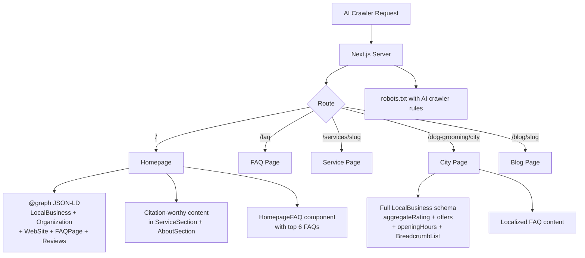

# GEO (Generative Engine Optimization) — Design Document

> **Feature:** GEO Optimization for Marketing Pages
> **Status:** Draft
> **Created:** 2026-03-21
> **Requirements:** `.claude/plans/vectorized-twirling-wand.md`

---

## 1. Overview

- **Purpose:** Optimize the Puppy Day marketing site so AI search engines (Google AI Overviews, ChatGPT, Perplexity, Claude) cite and reference the business when users search for dog grooming in La Mirada and surrounding areas.
- **Business Value:** As AI-powered search increasingly handles local queries like "best dog groomer near me" and "dog grooming cost in La Mirada," businesses that structure content for AI extraction gain a significant competitive advantage in visibility and customer acquisition.
- **Scope:** Marketing pages only — no admin, customer portal, or API route changes. No database schema changes. All changes are to server-rendered content, structured data, and crawler configuration.

### Key Design Decisions

| Decision | Rationale |
|----------|-----------|
| Use `@graph` array on homepage schema | Enables multiple schema types (LocalBusiness, Organization, WebSite, FAQPage) in a single JSON-LD block, which is Google's recommended approach for complex pages |
| Add FAQs to homepage (not just /faq) | AI search engines heavily weight content on the homepage; FAQs on subpages alone are less likely to be extracted for AI answers |
| Embed BreadcrumbList in Breadcrumb component (not per-page) | Already done — the existing `Breadcrumb` component includes JSON-LD. No per-page work needed |
| Use `<blockquote cite="...">` for testimonials | Semantic HTML signals to AI models that content is a quote/review, improving extraction accuracy |
| Explicit AI crawler allow rules in robots.txt | While `*` already allows all crawlers, explicit rules for GPTBot/PerplexityBot/etc. serve as a signal of consent and prevent future accidental blocking |
| Fetch real reviews from DB for Review schema | Individual Review schema markup is more valuable than AggregateRating alone for AI citation |
| Server-rendered citation-worthy text | Static, factual statements with specific numbers are what AI models extract — not dynamic cards or animations |

## 2. Architecture

### High-Level Data Flow



### File Modification Summary

| File | Action | Description |
|------|--------|-------------|
| `src/app/robots.ts` | Modify | Add explicit AI crawler allow rules |
| `src/app/(marketing)/page.tsx` | Modify | Add `@graph` schema, homepage FAQs, Review schema, `dateModified` metadata |
| `src/components/marketing/HomepageFAQ.tsx` | Create | Compact FAQ section for homepage with top 6 FAQs |
| `src/components/marketing/ServiceSection.tsx` | Modify | Add citation-worthy intro paragraph with pricing facts |
| `src/components/marketing/AboutSection.tsx` | Modify | Add E-E-A-T content and last-updated signal |
| `src/components/marketing/TestimonialsSection.tsx` | Modify | Wrap review text in semantic `<blockquote>` elements |
| `src/app/(marketing)/dog-grooming/[city]/page.tsx` | Modify | Upgrade to full LocalBusiness schema with aggregateRating, offers, openingHours |
| `src/app/(marketing)/services/[slug]/page.tsx` | Modify | Add `dateModified` to metadata |
| `src/app/(marketing)/blog/dog-grooming-cost-la-mirada/page.tsx` | Modify | Add `dateModified` to BlogPosting schema and metadata |
| `src/app/(marketing)/blog/goldendoodle-grooming-guide/page.tsx` | Modify | Add `dateModified` to BlogPosting schema and metadata |
| `src/app/(marketing)/blog/signs-dog-needs-grooming/page.tsx` | Modify | Add `dateModified` to BlogPosting schema and metadata |
| `src/components/marketing/index.ts` | Modify | Export HomepageFAQ |

### Already Complete (No Work Needed)

| Original Plan Item | Status | Reason |
|---|---|---|
| Change 2: BreadcrumbList schema on subpages | Already done | `Breadcrumb` component at `src/components/common/Breadcrumb.tsx` already renders BreadcrumbList JSON-LD. All marketing subpages (FAQ, services, city, blog via BlogPostLayout) already use this component. |

## 3. Components & Interfaces

### New Component: HomepageFAQ

**File:** `src/components/marketing/HomepageFAQ.tsx`

```typescript
import type { FAQItem } from '@/data/faq';

interface HomepageFAQProps {
  items: FAQItem[];
}

export function HomepageFAQ({ items }: HomepageFAQProps): JSX.Element;
```

**Behavior:**
- Server component (no `'use client'` — the FAQAccordion it wraps is client, but this wrapper is server)
- Renders a `<section>` with `SectionHeader` title "Frequently Asked Questions"
- Renders the provided FAQ items using the existing `FAQAccordion` component
- Includes a "View All FAQs" link to `/faq`
- Takes exactly 6 items (filtered by the parent page)
- Does NOT include its own SchemaOrg — the parent page handles FAQPage schema in the `@graph`

**Selected FAQ Items** (indices from `FAQ_ITEMS` array in `src/data/faq.ts`):
1. "How much does dog grooming cost in La Mirada?" (index 0)
2. "How often should I get my dog groomed?" (index 1)
3. "What's included in a full dog grooming service?" (index 2)
4. "Is your grooming salon safe for anxious dogs?" (index 3)
5. "Do you offer walk-in nail trimming?" (index 9)
6. "What cities do you serve?" (index 12)

### Modified Component: TestimonialsSection

**Change:** Wrap review text in `<blockquote>` with `cite` attribute.

Current (line 183):
```tsx
<p className="text-[#434E54] text-sm leading-relaxed mt-3 flex-1">
```

New:
```tsx
<blockquote cite={review.yelpUrl} className="text-[#434E54] text-sm leading-relaxed mt-3 flex-1">
```

The closing `</p>` becomes `</blockquote>`. The "Read more" button stays inside since `<blockquote>` allows interactive content.

### Modified Component: ServiceSection

**Change:** Add a citation-worthy paragraph before the service cards.

Insert after `<SectionHeader>` and before the service cards grid:

```tsx
<p className="text-center text-[#6B7280] max-w-3xl mx-auto mb-12 leading-relaxed">
  Puppy Day offers professional dog grooming in La Mirada, CA with bath and brush
  services starting at $40 for small dogs (under 18 lbs) and premium grooming
  packages from $70 to $150. Our size-based pricing covers Small (0–18 lbs),
  Medium (19–35 lbs), Large (36–65 lbs), and X-Large (66+ lbs) dogs.
</p>
```

### Modified Component: AboutSection

**Change:** Add E-E-A-T reinforcing content. Add a `<time>` element for last-updated signal.

Add after the existing description paragraph:

```tsx
<p className="text-sm text-[#6B7280] mt-2">
  Located at 14936 Leffingwell Rd, La Mirada, CA 90638. Open Monday–Saturday, 9 AM – 5 PM.
</p>
<p className="text-xs text-[#6B7280] mt-4">
  Last updated <time dateTime="2026-03-21">March 2026</time>
</p>
```

## 4. Data Models

No database schema changes. All data sources are existing:

| Data Source | Table/File | Usage |
|---|---|---|
| FAQ items | `src/data/faq.ts` → `FAQ_ITEMS` | Homepage FAQ section + FAQPage schema |
| Reviews (schema) | `reviews` table | Individual Review schema on homepage |
| Review stats | `reviews` table | AggregateRating (already fetched) |
| Business info | `site_content` table via `getSiteContent()` | Organization schema, contact details |
| Services | `services` + `service_prices` tables | OfferCatalog schema |
| Business hours | `settings` table | OpeningHoursSpecification schema |

### Review Query for Individual Review Schema

Add to the existing `getMarketingData()` parallel fetch (homepage):

```typescript
// Add to existing Promise.all:
(supabase as any)
  .from('reviews')
  .select('rating, feedback, created_at')
  .eq('is_public', true)
  .not('rating', 'is', null)
  .not('feedback', 'is', null)
  .order('created_at', { ascending: false })
  .limit(5),
```

Return shape: `Array<{ rating: number; feedback: string; created_at: string }>`.

### City Page Data Additions

The city page already fetches `businessInfo` and `services`. It needs additional parallel fetches:

```typescript
// Add to city page:
const [businessInfo, supabase] = await Promise.all([...]);

const [servicesRes, reviewsRes, settingsRes] = await Promise.all([
  // existing services query...
  (supabase as any)
    .from('reviews')
    .select('rating')
    .eq('is_public', true)
    .not('rating', 'is', null),
  (supabase as any)
    .from('settings')
    .select('value')
    .eq('key', 'business_hours')
    .single(),
]);
```

## 5. State Management

No state management changes. All GEO changes are server-rendered content and structured data.

## 6. UI Specifications

### HomepageFAQ Component

**Placement:** Between `TestimonialsSection` and `AboutSection` on the homepage.

**Layout:**
- Full-width section with `py-20 md:py-28` padding (matching other sections)
- `SectionHeader` with title "Frequently Asked Questions" and subtitle "Quick answers about grooming at Puppy Day"
- `FAQAccordion` component (reused from `/faq` page) with 6 items
- "View All FAQs" link centered below, using the same link style as other sections (`text-[#434E54] hover:text-[#C67C4E]` with `ArrowRight` icon)
- Max width: `max-w-3xl mx-auto` to match FAQ page

**Design system compliance:**
- Uses existing `SectionHeader`, `FAQAccordion` components
- Warm cream background (inherits from `grooming-pattern-bg`)
- No new colors, shadows, or spacing values

### Testimonials Semantic Markup

Visual appearance remains identical. The only change is the HTML element from `<p>` to `<blockquote>`. DaisyUI and Tailwind classes remain the same — `<blockquote>` has no default browser styles when Tailwind's preflight is active.

### ServiceSection Citation Paragraph

A single paragraph of plain text, centered, using `text-[#6B7280]` (existing muted text color). No new UI elements — just text content that AI models can extract.

## 7. Error Handling & Edge Cases

| Edge Case | Design Solution |
|-----------|-----------------|
| No public reviews in DB | Review schema array is conditionally included: `...(reviews.length > 0 ? { review: [...] } : {})`. AggregateRating also conditional (already implemented). |
| Review feedback is very long | No truncation in schema — JSON-LD is not visible to users. Full text improves AI extraction. |
| Business hours not configured | OpeningHoursSpecification defaults to empty array (already handled in existing code). |
| AI crawlers blocked by CDN/WAF | Not a code concern — document for user to verify Vercel/Cloudflare settings. |
| FAQ items change in `src/data/faq.ts` | HomepageFAQ uses array indices — if FAQ items are reordered, the homepage selection should be reviewed. Use a `HOMEPAGE_FAQ_INDICES` constant to make this explicit. |

## 8. Implementation Phases

### Phase 1: Robots.txt + Metadata (no UI changes)
- Modify `src/app/robots.ts` to add AI crawler rules
- Add `dateModified` to homepage, service page, and blog page metadata
- **Verify:** `npm run build` succeeds, check `/robots.txt` output

### Phase 2: Homepage Schema Enhancement (JSON-LD only)
- Fetch individual reviews in `getMarketingData()`
- Restructure homepage schema to use `@graph` array with LocalBusiness, Organization, WebSite, FAQPage, and individual Review items
- **Verify:** View page source, validate JSON-LD at Google Rich Results Test

### Phase 3: Homepage FAQ Section (new component)
- Create `HomepageFAQ.tsx` component
- Export from `src/components/marketing/index.ts`
- Add to homepage between TestimonialsSection and AboutSection
- Wire up FAQPage schema in `@graph` with the 6 selected FAQ items
- **Verify:** Homepage renders FAQ accordion, JSON-LD includes FAQPage type

### Phase 4: Citation Content + Semantic HTML
- Add citation paragraph to `ServiceSection.tsx`
- Add E-E-A-T content and `<time>` element to `AboutSection.tsx`
- Change `<p>` to `<blockquote>` in `TestimonialsSection.tsx`
- **Verify:** View source shows `<blockquote>`, pricing text visible on homepage

### Phase 5: City Page Schema Enhancement
- Upgrade city page schema from PetGroomer to full LocalBusiness
- Add aggregateRating, hasOfferCatalog, openingHoursSpecification
- Fetch review stats and business hours in city page
- **Verify:** City page JSON-LD validates with Google Rich Results Test

### Phase 6: Manual Steps (documented, not coded)
- Submit sitemap to Bing Webmaster Tools
- Verify AI crawler access at thepuppyday.com/robots.txt
- Test with ChatGPT/Perplexity before and after

## 9. Testing Strategy

### Unit Tests

No unit tests needed — all changes are static content, JSON-LD output, and component composition. These are best verified through build validation and manual inspection.

### Integration Tests

| Test Case | Setup | Steps | Expected Result |
|-----------|-------|-------|-----------------|
| Homepage schema validates | Build app | Extract JSON-LD from page source, validate at schema.org validator | `@graph` contains LocalBusiness, Organization, WebSite, FAQPage types |
| Robots.txt includes AI crawlers | Build app | Fetch `/robots.txt` | Contains GPTBot, PerplexityBot, ClaudeBot user-agent rules |
| Homepage FAQ renders | Build app | Load homepage | 6 FAQ items visible between Testimonials and About sections |
| City page schema complete | Build app | Extract JSON-LD from `/dog-grooming/norwalk` | Contains aggregateRating, hasOfferCatalog, openingHoursSpecification |
| Blog dateModified present | Build app | Extract JSON-LD from blog post | BlogPosting schema includes `dateModified` field |

### Manual Verification

- [ ] `npm run build` completes without errors
- [ ] View homepage source — `@graph` JSON-LD array present with 4+ schema types
- [ ] View homepage source — individual Review schema items present (if reviews exist in DB)
- [ ] Homepage FAQ section visible with 6 questions, accordion functional
- [ ] "View All FAQs" link navigates to `/faq`
- [ ] ServiceSection shows pricing paragraph text
- [ ] AboutSection shows "Last updated" with `<time>` element
- [ ] TestimonialsSection uses `<blockquote>` elements (inspect in DevTools)
- [ ] `/robots.txt` shows GPTBot, PerplexityBot, ClaudeBot, ChatGPT-User, Google-Extended rules
- [ ] City page (e.g., `/dog-grooming/norwalk`) JSON-LD includes aggregateRating and openingHours
- [ ] Blog post metadata includes `article:modified_time`
- [ ] Validate homepage at https://search.google.com/test/rich-results
- [ ] Validate a city page at https://search.google.com/test/rich-results
- [ ] Submit sitemap to Bing Webmaster Tools

## 10. Risk Assessment

| Risk | Impact | Mitigation |
|------|--------|------------|
| Google penalizes duplicate FAQ schema (homepage + /faq) | Medium | The homepage shows only 6 of 20 FAQs — minimal overlap. Google's documentation permits FAQPage schema on multiple pages with different content. |
| Review schema without `author` field flagged by validator | Low | Google recommends `author` on reviews but does not require it. DB reviews are anonymous. Add `author: { '@type': 'Person', name: 'Anonymous' }` if needed. |
| AI crawlers ignore robots.txt anyway | Low | This is true for training crawlers, but search-specific bots (GPTBot for ChatGPT Search, PerplexityBot) respect robots.txt for retrieval. The explicit allow is still beneficial. |
| ISR cache means dateModified is stale | Low | ISR revalidates every 15 minutes. The `dateModified` reflects when the page was last server-rendered, which is acceptable for content that changes infrequently. |
| City page additional DB queries add latency | Low | Two small queries (review count + settings) added to existing parallel fetch. Marginal latency impact (~10-20ms). |
| HomepageFAQ makes homepage longer | Low | 6 compact accordion items add minimal scroll. FAQ content is high-value for both SEO and user experience. |
