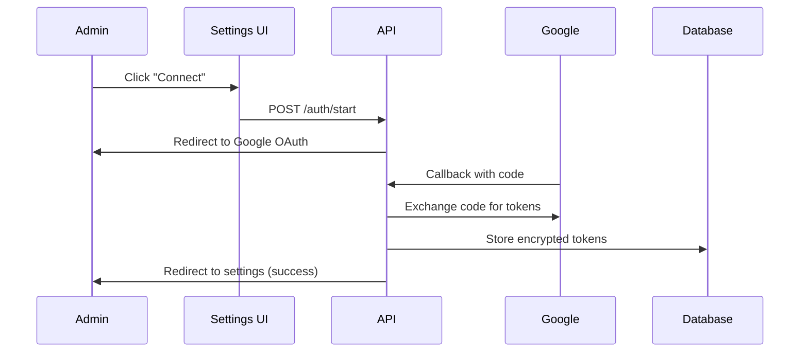
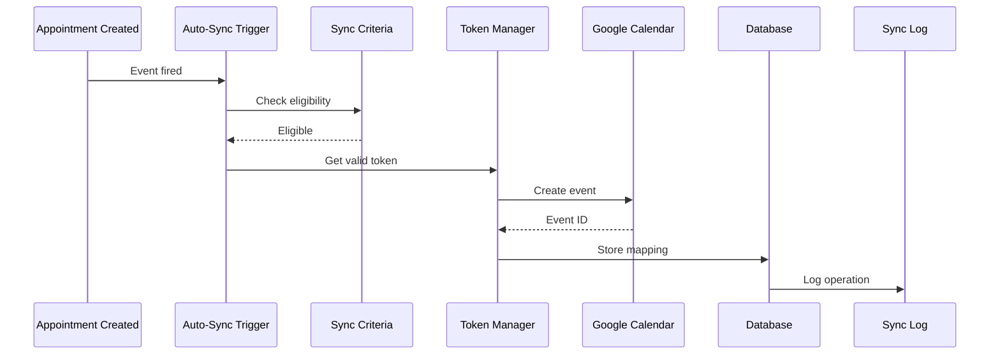
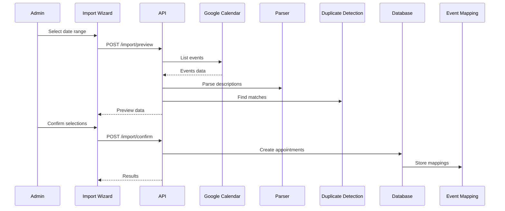

# Task 0063: Update Architecture Documentation

**Phase**: 13 - Documentation and Deployment
**Task ID**: 13
**Status**: Pending

## Description

Update the architecture documentation to include comprehensive information about the calendar integration feature, including data flow diagrams, database schema, API routes, and integration patterns.

## Requirements

- Update `docs/architecture/ARCHITECTURE.md`
- Add calendar integration section with data flow diagrams
- Document new database tables and relationships
- Document new API routes with request/response schemas
- Add to service integration guides
- Include security considerations
- Document webhook architecture

## Acceptance Criteria

- [ ] ARCHITECTURE.md updated with calendar section
- [ ] Data flow diagrams added (OAuth, sync, import)
- [ ] Database schema documented with relationships
- [ ] All API routes documented
- [ ] Service integration patterns documented
- [ ] Security model explained
- [ ] Webhook architecture documented
- [ ] Diagrams created using Mermaid or similar
- [ ] Code examples provided
- [ ] Clear and comprehensive

## Related Requirements

- Req 30.5: Update architecture documentation
- Req 30.6: Include data flow diagrams

## Documentation Structure

### 1. Calendar Integration Overview

```markdown
## Calendar Integration

The Puppy Day integrates with Google Calendar to provide bidirectional sync of grooming appointments. The integration supports:

- **Push Sync**: Appointments → Google Calendar (automatic and manual)
- **Pull Sync**: Google Calendar → Appointments (import wizard)
- **Real-time Updates**: Webhook notifications for calendar changes
- **Smart Matching**: Automatic customer/pet matching during import
- **Error Recovery**: Retry mechanisms and admin notifications

### Architecture Diagram

[Mermaid diagram showing components and data flow]
```

### 2. Data Flow Diagrams

Create Mermaid diagrams for key flows:

**OAuth Flow:**


**Push Sync Flow:**


**Import Flow:**


### 3. Database Schema

Document all calendar tables:

```markdown
### Calendar Tables

#### calendar_connections

Stores OAuth connection info and encrypted tokens.

| Column | Type | Description |
|--------|------|-------------|
| id | uuid | Primary key |
| admin_id | uuid | FK to users (admin) |
| calendar_email | text | Google account email |
| calendar_id | text | Selected calendar ID |
| encrypted_access_token | text | AES-256-GCM encrypted |
| encrypted_refresh_token | text | AES-256-GCM encrypted |
| token_expires_at | timestamptz | Token expiry time |
| is_active | boolean | Connection active |
| webhook_channel_id | text | Push notification channel |
| webhook_expires_at | timestamptz | Webhook expiry |
| last_sync_at | timestamptz | Last successful sync |
| created_at | timestamptz | Created timestamp |
| updated_at | timestamptz | Updated timestamp |

**Indexes:**
- `idx_calendar_connections_admin` on `admin_id`
- `idx_calendar_connections_active` on `is_active`

**RLS Policies:**
- Admins can read/write their own connections only
```

### 4. API Routes

Document all endpoints:

```markdown
### API Endpoints

#### OAuth Endpoints

**POST /api/admin/calendar/auth/start**
- **Description**: Initiate OAuth flow
- **Auth**: Admin required
- **Request**: None
- **Response**: `{ authUrl: string }`
- **Errors**:
  - 409: Connection already exists
  - 401: Not authenticated

**GET /api/admin/calendar/auth/callback**
- **Description**: OAuth callback handler
- **Query Params**: `code`, `state`
- **Response**: Redirect to settings
- **Errors**: 400, 401

[Continue for all endpoints...]
```

### 5. Service Integration Patterns

```markdown
### Integration Patterns

#### Token Management

All Google Calendar API calls use the Token Manager service:

\`\`\`typescript
import { getValidAccessToken } from '@/lib/calendar/token-manager';

const token = await getValidAccessToken(supabase, connectionId);
const calendar = google.calendar({ version: 'v3', auth: oauth2Client });
\`\`\`

The Token Manager automatically:
- Checks token expiry
- Refreshes if needed
- Updates stored tokens
- Handles refresh failures

#### Error Handling

Calendar operations use standardized error handling:

\`\`\`typescript
try {
  await syncAppointmentToGoogle(appointment);
} catch (error) {
  if (isTransientError(error)) {
    await queueForRetry(appointment.id);
  } else {
    await logPermanentFailure(appointment.id, error);
    await notifyAdmin(error);
  }
}
\`\`\`
```

### 6. Security Considerations

```markdown
### Security Model

#### Token Encryption

All OAuth tokens stored using AES-256-GCM:
- Encryption key: `CALENDAR_TOKEN_ENCRYPTION_KEY` (32 bytes)
- Unique IV per token
- Auth tag for integrity verification

#### API Authentication

All calendar endpoints require:
1. Valid session (Supabase Auth)
2. Admin role check via `requireAdmin()` middleware
3. Rate limiting (configurable per endpoint)

#### Data Privacy

- Only admin can access calendar integration
- Customers never see calendar sync status
- Sync logs exclude sensitive customer data
- Webhook notifications validated via channel token
```

### 7. Webhook Architecture

```markdown
### Webhook System

Google Calendar sends push notifications on changes:

\`\`\`
[Google Calendar] --webhook--> [/api/admin/calendar/webhook]
                                      |
                                      v
                               [Webhook Processor]
                                      |
                                      v
                              [Conflict Resolution]
                                      |
                                      v
                           [Re-sync or Log Conflict]
\`\`\`

**Webhook Registration:**
- Registered when connection created
- Renewed every 7 days (automatic)
- Stopped when connection deleted

**Conflict Resolution:**
- App data takes precedence
- Deleted events recreated from app
- Updated events re-synced from app
```

## Testing Checklist

- [ ] All sections written
- [ ] Diagrams created and accurate
- [ ] Database schema complete
- [ ] API routes documented
- [ ] Code examples tested
- [ ] Security model explained
- [ ] Technical review completed
- [ ] Links verified
