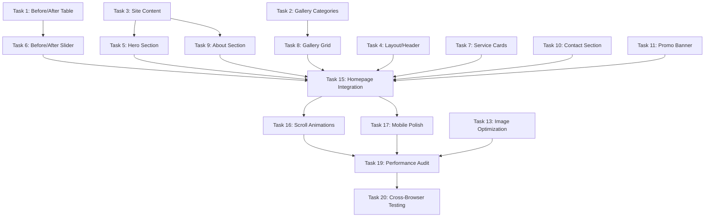

# Marketing Site Implementation Tasks

## Overview

This task list breaks down the marketing site implementation into sequential, manageable chunks. Tasks are organized by dependency order and should be completed in the sequence listed.

---

## Phase 1: Database & Data Layer (Tasks 1-3)

### Task 1: Create Before/After Pairs Table

**Description:** Add database table and TypeScript types for before/after image comparisons.

**Files to modify:**
- `src/types/database.ts` - Add `BeforeAfterPair` interface
- `src/mocks/supabase/store.ts` - Add table initialization
- `src/mocks/supabase/seed.ts` - Add seed data

**Acceptance criteria:**
- [ ] `BeforeAfterPair` interface defined with all required fields
- [ ] Table added to mock store initialization list
- [ ] At least 3 seed before/after pairs created with placeholder images

**Estimated complexity:** Low

---

### Task 2: Extend Gallery Images with Categories

**Description:** Add category field to gallery images to distinguish between regular and featured images.

**Files to modify:**
- `src/types/database.ts` - Update `GalleryImage` interface
- `src/mocks/supabase/seed.ts` - Add categorized gallery images

**Acceptance criteria:**
- [ ] `GalleryImage` has `category` field typed as `'before_after' | 'regular' | 'featured'`
- [ ] Seed data includes images with different categories
- [ ] At least 12 gallery images seeded for homepage display

**Estimated complexity:** Low

---

### Task 3: Create Site Content CMS Structure

**Description:** Create a flexible content management structure for homepage text content.

**Files to modify:**
- `src/types/database.ts` - Add `SiteContent` interface
- `src/mocks/supabase/store.ts` - Add table initialization
- `src/mocks/supabase/seed.ts` - Add marketing content seeds

**Acceptance criteria:**
- [ ] `SiteContent` interface with `key` and `content` fields
- [ ] Seed content for: hero_headline, hero_tagline, hero_image_url, about_description
- [ ] Helper function to retrieve content by key

**Estimated complexity:** Low

---

## Phase 2: Core UI Components (Tasks 4-8)

### Task 4: Create Marketing Layout with Header

**Description:** Build the marketing-specific layout with sticky header and navigation.

**Files to create:**
- `src/app/(marketing)/layout.tsx`
- `src/components/marketing/header.tsx`
- `src/components/marketing/footer.tsx`

**Acceptance criteria:**
- [ ] Header is sticky and changes background on scroll
- [ ] Desktop navigation shows: Home, Services, Gallery, Contact
- [ ] Mobile shows hamburger menu with slide-in drawer
- [ ] Logo links to homepage
- [ ] "Book Now" CTA button always visible
- [ ] Footer includes quick links, social media placeholders, copyright

**Estimated complexity:** Medium

---

### Task 5: Build Hero Section Component

**Description:** Create the homepage hero section with background image and primary CTA.

**Files to create:**
- `src/components/marketing/hero-section.tsx`

**Acceptance criteria:**
- [ ] Full viewport height (min-h-screen)
- [ ] Background image with dark overlay for text readability
- [ ] Headline and tagline with responsive typography
- [ ] Primary "Book Appointment" CTA button
- [ ] Fade-in animation on page load
- [ ] Mobile responsive (stacked layout, smaller text)

**Estimated complexity:** Medium

---

### Task 6: Create Before/After Comparison Slider

**Description:** Build interactive image comparison component with draggable slider.

**Files to create:**
- `src/components/marketing/before-after-slider.tsx`
- `src/components/marketing/before-after-carousel.tsx`

**Acceptance criteria:**
- [ ] Two overlapping images with clip-path effect
- [ ] Draggable handle (mouse drag support)
- [ ] Touch support for mobile devices
- [ ] Visual slider handle with left/right arrow icons
- [ ] Slider starts at 50% position
- [ ] Carousel wrapper to display multiple pairs
- [ ] Smooth transitions and animations

**Estimated complexity:** High

---

### Task 7: Build Service Cards and Grid

**Description:** Create service display components for the services section.

**Files to create:**
- `src/components/marketing/service-card.tsx`
- `src/components/marketing/service-grid.tsx`

**Acceptance criteria:**
- [ ] Service card shows icon/image, name, description, price
- [ ] Price displays range for size-based services (e.g., "$45-$85")
- [ ] Hover animation (scale, shadow)
- [ ] Responsive grid: 3 columns desktop, 2 tablet, 1 mobile
- [ ] "Learn More" action (modal or expand)
- [ ] Loads services from mock data

**Estimated complexity:** Medium

---

### Task 8: Create Gallery Grid with Lightbox

**Description:** Build photo gallery with responsive grid and full-screen lightbox viewer.

**Files to create:**
- `src/components/marketing/gallery-grid.tsx`
- `src/components/marketing/lightbox.tsx`

**Acceptance criteria:**
- [ ] Responsive grid: 4 cols desktop, 3 tablet, 2 mobile
- [ ] Image optimization with Next.js Image component
- [ ] Click image to open lightbox
- [ ] Lightbox: full-screen modal with prev/next navigation
- [ ] Keyboard support: arrow keys navigate, Escape closes
- [ ] Close button and backdrop click to close
- [ ] Displays image caption if available

**Estimated complexity:** Medium

---

## Phase 3: Additional Sections (Tasks 9-11)

### Task 9: Build About Section Component

**Description:** Create about section with business story and differentiators.

**Files to create:**
- `src/components/marketing/about-section.tsx`

**Acceptance criteria:**
- [ ] Displays about text from site_content
- [ ] Shows key differentiators as badge/pill list
- [ ] Includes location info (La Mirada, CA)
- [ ] Optional: "Years in business" stat
- [ ] Responsive layout: image + text side-by-side desktop, stacked mobile

**Estimated complexity:** Low

---

### Task 10: Create Contact Section with Business Hours

**Description:** Build contact information section with live business hours status.

**Files to create:**
- `src/components/marketing/contact-section.tsx`
- `src/components/marketing/business-hours.tsx`
- `src/lib/utils/business-hours.ts`

**Acceptance criteria:**
- [ ] Displays phone (tel: link), email (mailto: link), address (maps link)
- [ ] Business hours listed for all days
- [ ] Real-time "Open Now" or "Closed" status
- [ ] Highlights current day
- [ ] Shows "Opens at [time]" if currently closed
- [ ] Utility functions to check if currently open
- [ ] Mobile: clickable phone/email/address

**Estimated complexity:** Medium

---

### Task 11: Build Promotional Banner System

**Description:** Create dismissible banner system with carousel for multiple promos.

**Files to create:**
- `src/components/marketing/promo-banner.tsx`

**Acceptance criteria:**
- [ ] Banner displays at top of page when active promos exist
- [ ] Shows title, description, optional CTA button
- [ ] If multiple banners: auto-rotate carousel (5s interval)
- [ ] Close button to dismiss
- [ ] Dismissed state saved to localStorage for session
- [ ] Smooth slide animations between banners
- [ ] CTA button navigates to specified URL

**Estimated complexity:** Medium

---

## Phase 4: SEO & Performance (Tasks 12-14)

### Task 12: Implement SEO Meta Tags and Structured Data

**Description:** Add comprehensive SEO optimization with meta tags and JSON-LD.

**Files to create:**
- `src/components/marketing/structured-data.tsx`

**Files to modify:**
- `src/app/(marketing)/page.tsx` - Add metadata export

**Acceptance criteria:**
- [ ] Page metadata with title, description, keywords
- [ ] Open Graph tags for social sharing
- [ ] Twitter Card tags
- [ ] JSON-LD structured data for LocalBusiness schema
- [ ] Includes business name, address, phone, hours, geo coordinates
- [ ] Semantic HTML: proper header, nav, main, section, footer tags

**Estimated complexity:** Medium

---

### Task 13: Optimize Images and Performance

**Description:** Implement image optimization and performance best practices.

**Files to create:**
- `src/lib/utils/image-optimization.ts`

**Files to modify:**
- All image components to use Next.js Image with optimization

**Acceptance criteria:**
- [ ] Hero image uses `priority` prop
- [ ] Gallery images use `loading="lazy"`
- [ ] All images have `alt` text
- [ ] Responsive `sizes` prop configured
- [ ] Blur placeholders for smoother loading
- [ ] Image dimensions specified to prevent layout shift

**Estimated complexity:** Low

---

### Task 14: Add Loading States and Skeleton Screens

**Description:** Create loading states for better perceived performance.

**Files to create:**
- `src/components/ui/skeleton.tsx`
- `src/components/marketing/loading-states.tsx`

**Acceptance criteria:**
- [ ] Skeleton component with shimmer animation
- [ ] Loading states for: service cards, gallery grid, before/after
- [ ] Smooth transition from skeleton to actual content
- [ ] No layout shift when content loads

**Estimated complexity:** Low

---

## Phase 5: Integration & Polish (Tasks 15-17)

### Task 15: Build Marketing Homepage Page

**Description:** Integrate all components into the main marketing page.

**Files to create:**
- `src/app/(marketing)/page.tsx`

**Acceptance criteria:**
- [ ] Server component that fetches all marketing data
- [ ] Sections in order: Hero → Promo Banner → Services → About → Before/After → Gallery → Contact → Final CTA
- [ ] Smooth scroll behavior between sections
- [ ] Proper spacing and visual hierarchy
- [ ] All data passed correctly to components

**Estimated complexity:** Medium

---

### Task 16: Add Scroll Animations

**Description:** Implement scroll-triggered animations using Framer Motion.

**Files to modify:**
- All marketing section components

**Acceptance criteria:**
- [ ] Sections fade in and slide up on scroll into view
- [ ] Animations trigger once (don't repeat)
- [ ] Stagger animations for grid items (services, gallery)
- [ ] Performance: use `whileInView` with `once: true`
- [ ] Respect user's `prefers-reduced-motion` setting

**Estimated complexity:** Medium

---

### Task 17: Mobile Responsiveness Final Pass

**Description:** Comprehensive mobile testing and refinement.

**Acceptance criteria:**
- [ ] Test all breakpoints: mobile (< 640px), tablet (640-1024px), desktop (> 1024px)
- [ ] Touch targets minimum 44x44px
- [ ] Mobile menu works smoothly
- [ ] Before/after slider works on touch devices
- [ ] Gallery lightbox works on mobile
- [ ] No horizontal scroll on any viewport
- [ ] Text is readable at all sizes
- [ ] Images load efficiently on mobile

**Estimated complexity:** Medium

---

## Phase 6: Testing & Deployment (Tasks 18-20)

### Task 18: Add Unit Tests for Utilities

**Description:** Write unit tests for business hours and helper functions.

**Files to create:**
- `src/lib/utils/__tests__/business-hours.test.ts`

**Acceptance criteria:**
- [ ] Test `isCurrentlyOpen()` function with various times
- [ ] Test `getNextOpenTime()` function
- [ ] Test edge cases: midnight, closed all day, 24-hour operation
- [ ] All tests pass

**Estimated complexity:** Low

---

### Task 19: Performance Audit

**Description:** Run Lighthouse audit and optimize for performance score.

**Acceptance criteria:**
- [ ] Lighthouse performance score ≥ 90
- [ ] Lighthouse accessibility score ≥ 95
- [ ] Lighthouse SEO score ≥ 95
- [ ] First Contentful Paint (FCP) < 1.5s
- [ ] Largest Contentful Paint (LCP) < 2.5s
- [ ] Cumulative Layout Shift (CLS) < 0.1
- [ ] Address any critical issues flagged

**Estimated complexity:** Medium

---

### Task 20: Cross-Browser Testing

**Description:** Test in multiple browsers and devices for compatibility.

**Acceptance criteria:**
- [ ] Test in Chrome, Firefox, Safari, Edge (latest versions)
- [ ] Test on iOS Safari (iPhone)
- [ ] Test on Android Chrome
- [ ] Test on tablet (iPad)
- [ ] All features work correctly across browsers
- [ ] No visual regressions
- [ ] Before/after slider works in all browsers

**Estimated complexity:** Low

---

## Summary

**Total tasks:** 20

**By complexity:**
- Low: 7 tasks
- Medium: 11 tasks
- High: 1 task

**By phase:**
- Phase 1 (Database): 3 tasks
- Phase 2 (Core UI): 5 tasks
- Phase 3 (Sections): 3 tasks
- Phase 4 (SEO): 3 tasks
- Phase 5 (Integration): 3 tasks
- Phase 6 (Testing): 3 tasks

**Estimated total time:** 3-4 days for a single developer

---

## Dependencies

---

## Notes

- All placeholder images should use https://placedog.net or similar dog image services
- Consider installing `react-use-gesture` for better drag handling in before/after slider
- Consider installing `yet-another-react-lightbox` or building custom lightbox
- Ensure all components have proper TypeScript types
- Use DaisyUI utility classes where possible to maintain consistency
- Test with mock data before implementing real API integration
