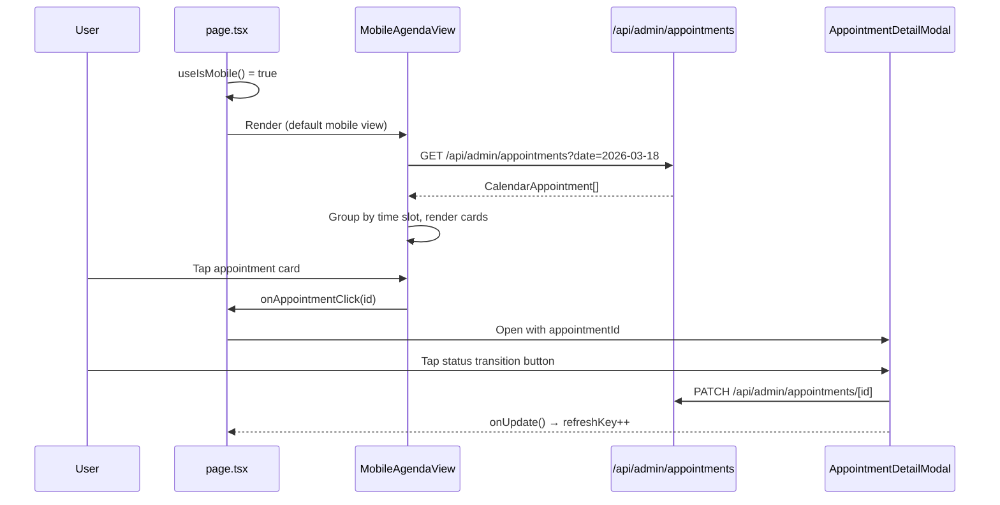

# Mobile Optimization: Admin Appointments Page — Design Document

> **Feature:** Mobile Optimization - Admin Appointments Page
> **Status:** Draft
> **Created:** 2026-03-18
> **Requirements:** User-provided context (no formal requirements.md)

---

## 1. Overview

- **Purpose:** Make the admin appointments page usable on phones (< 768px). The calendar swimlane requires 600px+ horizontal scroll and the list view renders an HTML table — both unusable on mobile. The owner/manager is the primary mobile user whose #1 action is updating appointment status.
- **Business Value:** The business owner manages appointments on-the-go from their phone. A native-feeling mobile experience reduces friction for their most frequent workflow: check today's schedule, tap an appointment, update its status.
- **Scope:** New mobile-specific components; conditional rendering in page.tsx. Desktop views remain untouched.

### Key Design Decisions

| Decision | Rationale |
|----------|-----------|
| Separate mobile components (not responsive CSS) | Desktop calendar/table are complex; hiding columns or reflowing won't work. Separate components are simpler to build and maintain |
| `useIsMobile()` hook for conditional rendering | Already exists in `src/lib/utils/breakpoints.ts`, uses `matchMedia` — no layout shift, SSR-safe with desktop default |
| `next/dynamic` for mobile views | Mobile components loaded via `dynamic(() => import(...), { ssr: false })` so desktop users never download mobile bundle and vice versa. CSS `display:none` does NOT prevent React re-renders — JS conditional + dynamic import is required |
| No barrel exports for mobile dirs | Barrel `index.ts` files add 200-800ms import cost; import each component directly from its file path |
| Parallel data fetching | Groomer list + appointments fetched via `Promise.all` or parallel `useSWR` calls to eliminate waterfalls |
| `content-visibility` on card lists | `content-visibility: auto` + `contain-intrinsic-size` on appointment cards for off-screen rendering skip |
| Agenda view as default mobile calendar replacement | Groups appointments by time slot — scannable on narrow screens without horizontal scroll |
| Card-based list view replacing table | Tables are unusable on 375px screens; cards provide tap targets and information hierarchy |
| FAB for "Create Appointment" | Frees header space on mobile; standard mobile pattern; always accessible |
| Bottom sheet for filters | Reuses the proven pattern from AppointmentDetailModal (drag-dismiss, spring animation) |
| Reusable components in `src/components/admin/mobile/` | MobileSegmentedControl, MobileChipRow, MobileFAB, MobileFilterSheet, MobileEmptyState can be reused for other admin pages |
| No swipe gestures or pull-to-refresh | Keep scope minimal; can be added later |

## 2. Architecture

### High-Level System Context

```mermaid
graph TD
    subgraph "Appointments Page (page.tsx)"
        MQ{useIsMobile?}
        MQ -->|true| MV[Mobile View]
        MQ -->|false| DV[Desktop View - unchanged]
    end

    subgraph "Mobile View"
        MSC[MobileSegmentedControl<br/>Agenda | List]
        MSC -->|Agenda| MAV[MobileAgendaView]
        MSC -->|List| MLV[MobileListView]
        FAB[MobileFAB] -->|tap| BM[BookingModal admin mode]
        MAV -->|tap card| ADM[AppointmentDetailModal]
        MLV -->|tap card| ADM
    end

    subgraph "Shared Mobile Components"
        MCR[MobileChipRow]
        MFS[MobileFilterSheet]
        MES[MobileEmptyState]
        MAC[MobileAppointmentCard]
    end

    MAV --> MAC
    MLV --> MAC
    MLV --> MCR
    MLV --> MFS
    MAV --> MES
    MLV --> MES
```

### Data Flow



### File Modification Summary

| File | Action | Description |
|------|--------|-------------|
| `src/components/admin/mobile/MobileSegmentedControl.tsx` | Create | iOS-style segmented toggle, generic/reusable |
| `src/components/admin/mobile/MobileChipRow.tsx` | Create | Horizontal scroll chip row for filters |
| `src/components/admin/mobile/MobileFAB.tsx` | Create | Floating action button, positioned above bottom tabs |
| `src/components/admin/mobile/MobileFilterSheet.tsx` | Create | Bottom sheet for filter controls |
| `src/components/admin/mobile/MobileEmptyState.tsx` | Create | Dog-themed empty state |
| ~~`src/components/admin/mobile/index.ts`~~ | Skip | No barrel exports — import directly from each file to avoid 200-800ms import cost |
| `src/components/admin/appointments/mobile/MobileAppointmentCard.tsx` | Create | Compact appointment card for mobile |
| `src/components/admin/appointments/mobile/MobileAgendaView.tsx` | Create | Time-slot grouped agenda replacing swimlane calendar |
| `src/components/admin/appointments/mobile/MobileListView.tsx` | Create | Card-based list with search, filters, pagination |
| ~~`src/components/admin/appointments/mobile/index.ts`~~ | Skip | No barrel exports — import directly from each file |
| `src/app/admin/appointments/page.tsx` | Modify | Add `useIsMobile()` conditional rendering; use `next/dynamic` for mobile views (`ssr: false`); desktop stays as-is; add FAB |

## 3. Components & Interfaces

### 3.1 MobileSegmentedControl (Reusable)

```typescript
// src/components/admin/mobile/MobileSegmentedControl.tsx

export interface SegmentOption<T extends string = string> {
  value: T;
  label: string;
  icon?: React.ReactNode;
}

export interface MobileSegmentedControlProps<T extends string = string> {
  options: SegmentOption<T>[];
  value: T;
  onChange: (value: T) => void;
  className?: string;
}
```

**Behavior:**
- Renders a pill-shaped container with sliding highlight indicator
- Animated highlight slides to selected segment using Framer Motion `layoutId`
- Minimum touch target: 44px height
- Full width of parent container, segments divide equally

**Visual spec:**
- Container: `bg-[#EAE0D5]/50 rounded-xl p-1`
- Active segment: `bg-white rounded-lg shadow-sm` with `layoutId` animation
- Text: `text-sm font-medium`, active `text-[#434E54]`, inactive `text-[#434E54]/50`
- Icon (optional): `w-4 h-4` inline before label

### 3.2 MobileChipRow (Reusable)

```typescript
// src/components/admin/mobile/MobileChipRow.tsx

export interface ChipOption {
  value: string;
  label: string;
  count?: number;
}

export interface MobileChipRowProps {
  options: ChipOption[];
  value: string | string[];
  onChange: (value: string) => void;
  multiSelect?: boolean;
  className?: string;
}
```

**Behavior:**
- Horizontally scrollable row with `overflow-x-auto` and `scrollbar-hide`
- Snap scrolling: `scroll-snap-type: x mandatory`, each chip `scroll-snap-align: start`
- Edge fade: gradient mask on right edge when scrollable

**Visual spec:**
- Chip: `px-3 py-2 rounded-full text-sm font-medium whitespace-nowrap` (min 44px height via padding)
- Active: `bg-[#434E54] text-white`
- Inactive: `bg-white text-[#434E54] border border-[#E5E5E5]`
- Count badge: `ml-1 text-xs opacity-70`
- Gap: `gap-2`
- Container: `flex gap-2 overflow-x-auto scrollbar-hide px-1 -mx-1`

### 3.3 MobileFAB (Reusable)

```typescript
// src/components/admin/mobile/MobileFAB.tsx

export interface MobileFABProps {
  icon: React.ReactNode;
  label: string; // sr-only accessible label
  onClick: () => void;
  className?: string;
}
```

**Behavior:**
- Fixed position, bottom-right, above bottom tab bar
- Entry animation: scale from 0 with spring
- Press animation: scale down to 0.9

**Visual spec:**
- Position: `fixed bottom-24 right-4 z-40` (bottom-24 clears the bottom tab bar)
- Size: `w-14 h-14 rounded-full`
- Color: `bg-[#434E54] text-white shadow-lg`
- Icon: `w-6 h-6` centered
- Hover/active: `active:scale-90 transition-transform`
- Label: `<span className="sr-only">{label}</span>`

### 3.4 MobileFilterSheet (Reusable)

```typescript
// src/components/admin/mobile/MobileFilterSheet.tsx

export interface MobileFilterSheetProps {
  isOpen: boolean;
  onClose: () => void;
  title: string;
  children: React.ReactNode;
  onApply?: () => void;
  onReset?: () => void;
}
```

**Behavior:**
- Bottom sheet pattern matching AppointmentDetailModal:
  - Backdrop: `fixed inset-0 bg-black/50 backdrop-blur-sm z-50`
  - Sheet: slides up from bottom with `y: '100%'` → `y: 0`
  - Spring animation: `type: 'spring', damping: 25, stiffness: 300`
  - Drag-to-dismiss: `drag="y"`, `dragConstraints={{ top: 0 }}`, dismiss if `offset.y > 100`
  - Drag handle: `w-10 h-1 rounded-full bg-[#434E54]/20` centered at top
- Max height: `max-h-[70vh]`
- Footer with Apply/Reset buttons using `AdminButton`
- Focus trap using `createFocusTrap` pattern
- `role="dialog"` `aria-modal="true"` (NEVER `<dialog>`)

**Visual spec:**
- Sheet: `bg-[#F8EEE5] rounded-t-2xl shadow-xl`
- Header: `px-5 py-4 border-b border-[#E5E5E5]` with title and close button
- Footer: `bg-[#EAE0D5]/30 px-5 py-4 border-t border-[#E5E5E5]` with AdminButton pair

### 3.5 MobileEmptyState (Reusable)

```typescript
// src/components/admin/mobile/MobileEmptyState.tsx

export interface MobileEmptyStateProps {
  icon?: React.ReactNode;
  title: string;
  description?: string;
  action?: {
    label: string;
    onClick: () => void;
  };
}
```

**Visual spec:**
- Container: `flex flex-col items-center justify-center py-16 px-6 text-center`
- Icon: defaults to `PawPrint` from lucide, `w-16 h-16 text-[#D4A574]/40`
- Title: `text-lg font-semibold text-[#434E54] mt-4`
- Description: `text-sm text-[#434E54]/60 mt-2 max-w-[280px]`
- Action button: `AdminButton` variant, `mt-6`

### 3.6 MobileAppointmentCard

```typescript
// src/components/admin/appointments/mobile/MobileAppointmentCard.tsx

import type { CalendarAppointment } from '../calendar/types';

export interface MobileAppointmentCardProps {
  appointment: CalendarAppointment;
  onClick: (id: string) => void;
  groomerColor?: string;
  index?: number; // for stagger animation
}
```

**Behavior:**
- Tapping the card calls `onClick(appointment.id)` which opens AppointmentDetailModal
- Entry animation: `y: 16` slide-up, `delay: index * 0.05` stagger
- Active state: `active:scale-[0.98]` for tactile feedback
- Entire card is a touch target (min 44px height guaranteed by content)

**Visual spec:**
```
┌─────────────────────────────────┐
│ ▌ 10:00 AM          [Confirmed]│  ← accent strip left (groomer color), time, StatusBadge
│ ▌ Buddy                        │  ← pet name (bold)
│ ▌ Jane Smith · Basic Grooming  │  ← customer · service
│ ▌ 🐾 Sarah M.                  │  ← groomer (if assigned)
└─────────────────────────────────┘
```

- Card: `bg-white rounded-xl shadow-sm overflow-hidden`
- Left accent strip: `w-1 rounded-l-xl` with groomer color (or `bg-[#D4A574]` if unassigned)
- Layout: flex row — accent strip + content padding `px-4 py-3`
- Pet name: `text-base font-semibold text-[#434E54]`
- Customer + service: `text-sm text-[#434E54]/70`
- Groomer: `text-xs text-[#434E54]/50` with `PawPrint` icon `w-3 h-3`
- Time: `text-sm font-medium text-[#434E54]` top-right area
- StatusBadge: existing component, `size="sm"`

### 3.7 MobileAgendaView

```typescript
// src/components/admin/appointments/mobile/MobileAgendaView.tsx

export interface MobileAgendaViewProps {
  onAppointmentClick: (appointmentId: string) => void;
  refreshKey?: number;
}
```

**Behavior:**
- Fetches appointments for the selected date from `/api/admin/appointments/calendar`
- Groups appointments by hour slot with sticky time headers
- Date navigation: left/right arrows + "Today" button in a compact header
- Shows date in format "Wed, Mar 18"
- Loading state: 3 skeleton cards with pulse animation
- Empty state: MobileEmptyState with "No appointments today"
- Groomer filter: MobileChipRow at top (All | groomer names)

**Data fetching:** Reuses the same API endpoint as `AppointmentCalendar` — `/api/admin/appointments/calendar?start=DATE&end=DATE`

**Performance — parallel fetching (`async-parallel`):**
```typescript
// Fetch appointments + groomers in parallel, not sequentially
const [appointments, groomers] = await Promise.all([
  fetchAppointments(currentDate),
  fetchGroomers(),
]);
// Or with SWR: two independent useSWR hooks (SWR deduplicates automatically)
```

**Performance — off-screen rendering skip (`rendering-content-visibility`):**
Appointment cards in the scrolling list use `content-visibility: auto` with `contain-intrinsic-size: 0 88px` to skip layout/paint for off-screen cards. Applied via a Tailwind arbitrary property or a small CSS class.

**Layout:**
```
┌────────────────────────────────┐
│  ◀  Wed, Mar 18  ▶   [Today]  │  ← date nav
├────────────────────────────────┤
│ All | Sarah | Mike | Unassigned│  ← MobileChipRow (groomer filter)
├────────────────────────────────┤
│ 9:00 AM ─────────────────────  │  ← sticky time header
│ [AppointmentCard]              │
│ [AppointmentCard]              │
│ 10:00 AM ────────────────────  │
│ [AppointmentCard]              │
│ 11:00 AM ────────────────────  │
│ [AppointmentCard]              │
└────────────────────────────────┘
```

**Time header spec:**
- Sticky: `sticky top-0 z-10 bg-[#F8EEE5]/95 backdrop-blur-sm`
- Text: `text-xs font-semibold text-[#434E54]/50 uppercase tracking-wider`
- Divider line: `flex-1 h-px bg-[#E5E5E5] ml-3`
- Padding: `py-2 px-1`

### 3.8 MobileListView

```typescript
// src/components/admin/appointments/mobile/MobileListView.tsx

export interface MobileListViewProps {
  onAppointmentClick: (appointmentId: string) => void;
  refreshKey?: number;
}
```

**Behavior:**
- Fetches appointments from `/api/admin/appointments` (same as AppointmentListView)
- Search bar at top (debounced 300ms)
- Status filter chips via MobileChipRow (All, Pending, Confirmed, In Progress, Completed, Cancelled, No Show)
- Date range quick select: Today, Tomorrow, This Week, This Month (via MobileChipRow or filter sheet)
- Card-based list using MobileAppointmentCard
- Pagination: "Load More" button at bottom (not infinite scroll — simpler, no intersection observer needed)
- Loading state: skeleton cards
- Empty state: MobileEmptyState

**Layout:**
```
┌────────────────────────────────┐
│ 🔍 Search customers or pets... │  ← search input
├────────────────────────────────┤
│ All|Pending|Confirmed|InProg...│  ← MobileChipRow (status filter)
├────────────────────────────────┤
│ Today | This Week | This Month │  ← MobileChipRow (date range)
├────────────────────────────────┤
│ [AppointmentCard]              │
│ [AppointmentCard]              │
│ [AppointmentCard]              │
│ [AppointmentCard]              │
│                                │
│      [ Load More (23 more) ]   │
└────────────────────────────────┘
```

**Search input spec:**
- Height: 44px min touch target
- `bg-white rounded-xl border border-[#E5E5E5] px-4 py-3`
- Search icon: `w-5 h-5 text-[#434E54]/30` left
- Clear button: X icon when text present, 44px touch target

## 4. Data Models

No database schema changes required. This feature is purely UI-side. All data is fetched from existing API endpoints:

- **Agenda view:** `GET /api/admin/appointments/calendar?start=DATE&end=DATE` — returns `CalendarAppointment[]`
- **List view:** `GET /api/admin/appointments?search=QUERY&status=STATUS&dateFrom=DATE&dateTo=DATE&page=N&limit=20` — returns `AppointmentListItem[]` with pagination

### Type Mapping

| Source (API Response) | Mobile Component Prop |
|---|---|
| `CalendarAppointment` (from `calendar/types.ts`) | `MobileAppointmentCard.appointment` |
| `CalendarAppointment.status` | `StatusBadge.status` |
| `GroomerColorMap` (from `calendar/types.ts`) | `MobileAppointmentCard.groomerColor` |
| `Groomer[]` (from calendar hooks) | `MobileChipRow.options` (groomer filter) |

## 5. State Management

### Admin Store Changes

No new store fields needed. The existing store already has:
- `appointmentsView: 'calendar' | 'list'` — reused for mobile segment control (maps: `calendar` → Agenda, `list` → List)
- `appointmentFilters: AppointmentFilters` — reused for mobile filter state
- `currentBreakpoint: Breakpoint` — not used directly (we use `useIsMobile()` hook instead for component-level detection)

### Component-Level State

| Component | Local State | Rationale |
|---|---|---|
| `MobileAgendaView` | `currentDate: Date`, `appointments: CalendarAppointment[]`, `loading: boolean`, `selectedGroomerId: string \| null` | Date navigation and data are view-specific, not shared |
| `MobileListView` | `searchQuery: string`, `statusFilter: string`, `dateRange: string`, `appointments: AppointmentListItem[]`, `page: number`, `loading: boolean`, `hasMore: boolean` | Search/filter/pagination are local concerns |
| `MobileFilterSheet` | None (controlled component) | Parent owns open/close state |
| `MobileSegmentedControl` | None (controlled component) | Parent owns selected value |

## 6. UI Specifications

### Component Hierarchy

```
AppointmentsPage
├── {isMobile && ...} — JS conditional, NOT CSS hidden
│   ├── MobileSegmentedControl (Agenda | List)          ← dynamic import, ssr: false
│   ├── MobileAgendaView (when segment = Agenda)        ← dynamic import, ssr: false
│   │   ├── Date navigation header
│   │   ├── MobileChipRow (groomer filter)
│   │   └── Time-grouped sections
│   │       └── MobileAppointmentCard (repeated, content-visibility: auto)
│   ├── MobileListView (when segment = List)             ← dynamic import, ssr: false
│   │   ├── Search input
│   │   ├── MobileChipRow (status filter)
│   │   ├── MobileChipRow (date range)
│   │   └── MobileAppointmentCard (repeated, content-visibility: auto)
│   └── MobileFAB (opens BookingModal in admin mode)     ← dynamic import, ssr: false
├── {!isMobile && ...} — existing desktop view (unchanged, static imports)
└── AppointmentDetailModal (shared, already mobile-optimized)
```

**Code splitting strategy (`bundle-dynamic-imports`):**
```typescript
import dynamic from 'next/dynamic';

// Mobile views — only downloaded on phones
const MobileAgendaView = dynamic(
  () => import('@/components/admin/appointments/mobile/MobileAgendaView'),
  { ssr: false }
);
const MobileListView = dynamic(
  () => import('@/components/admin/appointments/mobile/MobileListView'),
  { ssr: false }
);
const MobileFAB = dynamic(
  () => import('@/components/admin/mobile/MobileFAB'),
  { ssr: false }
);

// Desktop views stay as static imports (they're the SSR default)
```

### Design System Compliance

- Background: `bg-[#F8EEE5]` (page) — inherited from admin layout
- Cards: `bg-white rounded-xl shadow-sm` — matches existing card pattern
- Text: charcoal `text-[#434E54]` primary, `/70` secondary, `/50` tertiary
- Accent: `#D4A574` for highlights, unassigned groomer strip, empty state icon
- Shadows: `shadow-sm` on cards, `shadow-lg` on FAB
- Corners: `rounded-xl` on cards, `rounded-full` on chips and FAB
- Icons: Lucide React only
- No bold borders or chunky elements

### Touch Targets

All interactive elements enforce 44px minimum:
- Chips: `py-2 px-3` = ~40px + text height = 44px+
- FAB: `w-14 h-14` = 56px
- Cards: content naturally exceeds 44px
- Search input: `py-3` = ~44px
- Date nav arrows: `w-11 h-11` = 44px
- Segmented control segments: `min-h-[44px]`

### Responsive Behavior

| Breakpoint | Behavior |
|---|---|
| < 768px (mobile) | Full mobile view: segmented control, agenda/list, FAB |
| >= 768px (md:) | Desktop view: existing calendar/list toggle, create button in header |

No tablet-specific design — tablets get the desktop view (calendar swimlane works at 768px+).

### Accessibility

- `MobileSegmentedControl`: `role="tablist"` with `role="tab"` children, `aria-selected`, keyboard arrow navigation
- `MobileFAB`: `aria-label` from `label` prop, `<span className="sr-only">`
- `MobileFilterSheet`: `role="dialog"` `aria-modal="true"`, focus trap, Escape to close
- `MobileAppointmentCard`: `role="button"` `tabIndex={0}` `onKeyDown={Enter/Space}`, `aria-label` with appointment summary
- `MobileChipRow`: `role="radiogroup"` (single select) or `role="group"` (multi), chips have `role="radio"`/`role="checkbox"`
- Time headers in agenda: `role="heading"` `aria-level={3}`
- Loading states: `aria-busy="true"` on container, skeleton cards have `aria-hidden="true"`

## 7. Error Handling & Edge Cases

| Edge Case | Design Solution |
|---|---|
| No appointments for selected date | MobileEmptyState: "No appointments on [date]" with PawPrint icon |
| API error fetching appointments | Toast error + retry button in empty state area |
| Slow network / loading | Skeleton cards (3 placeholders) with pulse animation |
| Very long pet/customer names | `truncate` class on text, full name visible in detail modal |
| Many appointments in one time slot | Cards stack vertically, natural scroll |
| Groomer has no appointments | Still appears in groomer chip row, shows empty state when filtered |
| Date navigation to far past/future | No restriction — same as desktop calendar |
| Screen rotation during use | Layout reflows naturally; mobile components are full-width |
| SSR initial render | `useIsMobile()` defaults to `false` (desktop) on server; mobile view renders client-side only — no hydration mismatch because desktop markup is the SSR default |

## 8. Implementation Phases

### Phase 1: Reusable Mobile Components
**Files:** `src/components/admin/mobile/` (5 components + barrel export)
**Independently testable:** Render each component in isolation with mock props. Verify touch targets, animations, accessibility attributes.
**Does not break existing:** New files only, no modifications to existing code.

### Phase 2: Mobile Appointment Components
**Files:** `src/components/admin/appointments/mobile/` (3 components + barrel export)
**Independently testable:** Render MobileAppointmentCard with mock CalendarAppointment data. Render MobileAgendaView/MobileListView pointing at real API (in dev). Verify data fetching, grouping, filtering, card tap → callback.
**Does not break existing:** New files only, no modifications to existing code.

### Phase 3: Wire Up in Page
**Files:** `src/app/admin/appointments/page.tsx` (modify)
**Independently testable:** Resize browser to < 768px, verify mobile view appears. Resize to >= 768px, verify desktop view appears unchanged. Test: segment toggle, date navigation, groomer filter, card tap → detail modal, FAB → booking modal.
**Does not break existing:** JS conditional `{isMobile ? <MobileView /> : <DesktopView />}` with `next/dynamic` for mobile components. Desktop code path is unchanged. Mobile bundle only downloads on phones.

## 9. Testing Strategy

### Unit Tests

| Test Case | Input | Expected Output |
|-----------|-------|-----------------|
| MobileSegmentedControl renders options | 2 options, value="agenda" | Both tabs rendered, "agenda" has active style |
| MobileSegmentedControl onChange fires | Click inactive tab | onChange called with new value |
| MobileChipRow renders horizontally | 6 chip options | Horizontal scroll container, all chips visible |
| MobileFAB renders with label | icon + label="Create" | Button rendered, sr-only span with "Create" |
| MobileAppointmentCard shows appointment info | CalendarAppointment mock | Pet name, customer name, time, status badge all visible |
| MobileAppointmentCard click handler | Tap card | onClick called with appointment.id |
| MobileEmptyState renders message | title="No appointments" | Title and PawPrint icon visible |

### Integration Tests

| Test Case | Setup | Steps | Expected Result |
|-----------|-------|-------|-----------------|
| Agenda view loads today's appointments | Mock API returning 3 appointments | Render MobileAgendaView | 3 MobileAppointmentCards grouped by time |
| Groomer filter works | Mock API returning appointments for 2 groomers | Select groomer chip | Only that groomer's appointments shown |
| List view search filters results | Mock API | Type "buddy" in search | API called with search param, results update |
| Card tap opens detail modal | Render page at mobile width | Tap any card | AppointmentDetailModal opens with correct ID |
| FAB opens booking modal | Render page at mobile width | Tap FAB | BookingModal opens in admin mode |
| Mobile/desktop toggle | Render page | Resize from 800px to 600px | Desktop view hides, mobile view shows |

### Manual Verification

- [ ] Open `/admin/appointments` on iPhone Safari (375px width)
- [ ] Verify segmented control toggles between Agenda and List
- [ ] Verify agenda view shows today's appointments grouped by time
- [ ] Verify date navigation arrows change the date
- [ ] Verify "Today" button returns to current date
- [ ] Verify groomer filter chips filter appointments
- [ ] Tap an appointment card — detail modal opens as bottom sheet
- [ ] In detail modal, tap a status transition button — status updates, toast appears
- [ ] Close modal, verify card reflects new status
- [ ] Switch to List view — search, status chips, date range chips work
- [ ] Tap FAB — booking modal opens in admin mode
- [ ] Complete a booking via FAB — appointments list refreshes
- [ ] Verify all touch targets are at least 44px
- [ ] Verify no horizontal scroll on any mobile view
- [ ] Resize to 768px+ — desktop view appears, mobile view hidden
- [ ] Desktop view works exactly as before (regression check)

## 10. Risk Assessment

| Risk | Impact | Mitigation |
|------|--------|------------|
| Hydration mismatch from `useIsMobile()` | Medium | SSR defaults to desktop (false); mobile components only render client-side. Use `block md:hidden` / `hidden md:block` CSS classes as primary mechanism, `useIsMobile()` only for JS logic |
| Performance: bundle size on wrong device | Low | Mobile views use `next/dynamic` with `ssr: false` — desktop users never download mobile code. JS conditional rendering (`{isMobile && ...}`) ensures only one view tree is mounted. CSS `display:none` would NOT prevent re-renders. |
| API latency on mobile networks | Medium | Show skeleton cards immediately; debounce search; cache groomer list |
| FAB overlapping bottom tab bar | Low | Position `bottom-24` (96px) clears the 64px bottom tab bar with margin |
| Filter sheet conflicts with detail modal z-index | Low | Both use z-50; only one is open at a time (filter sheet closes before card tap) |
