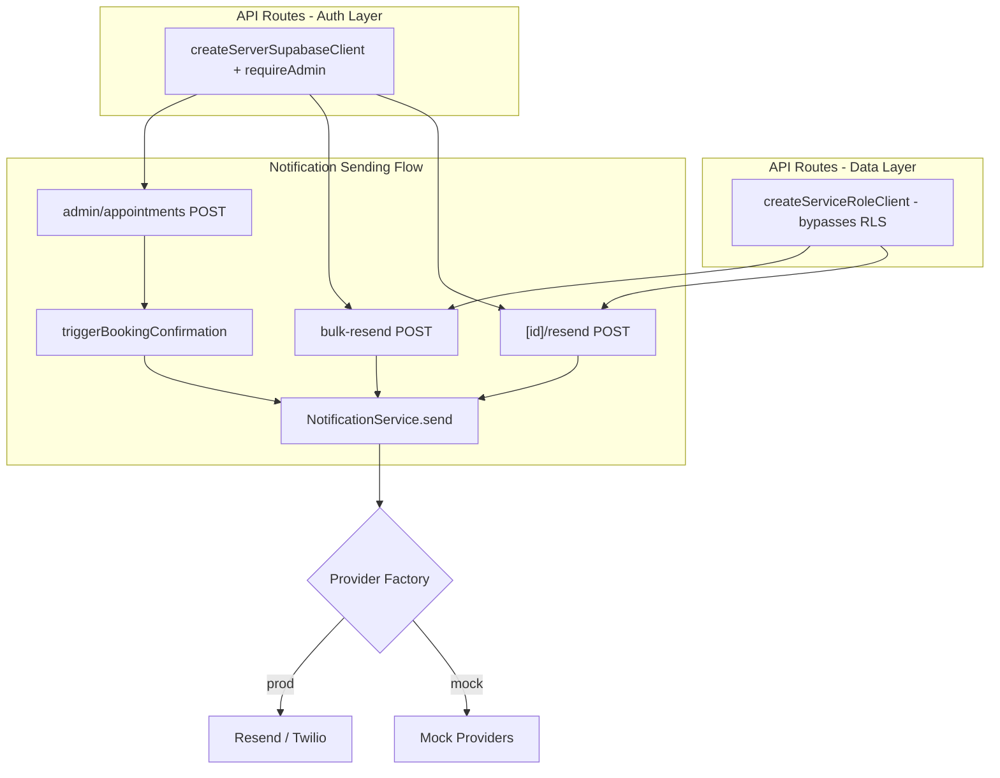
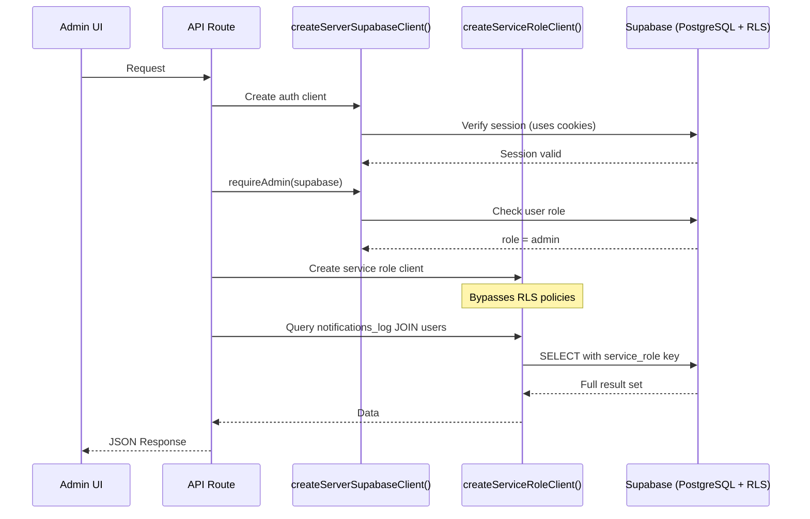

# Notification Module Audit and Fix - Design Document

> **Feature**: Notification Module Audit and Fix
> **Status**: Draft
> **Created**: 2026-03-07
> **Last Updated**: 2026-03-07

---

## Table of Contents

1. [Overview](#overview)
2. [Architecture](#architecture)
3. [Components and Interfaces](#components-and-interfaces)
4. [Data Models](#data-models)
5. [Error Handling](#error-handling)
6. [Testing Strategy](#testing-strategy)
7. [Implementation Phases](#implementation-phases)
8. [Risk Assessment](#risk-assessment)

---

## Overview

### Purpose

This design document specifies the changes required to bring the notification module to full production readiness. The audit identified six categories of issues that prevent notifications from actually being delivered, create security vulnerabilities through improper RLS handling, and degrade frontend performance through React anti-patterns.

### Issue Summary

| # | Issue | Severity | Files Affected |
|---|-------|----------|----------------|
| 1 | Resend endpoints do not actually send notifications | **Critical** | 2 API routes |
| 2 | Admin appointment creation lacks notification integration | **High** | 1 API route |
| 3 | Two-Client Pattern (RLS) inconsistencies in admin routes | **High** | 15+ API routes |
| 4 | React performance violations (missing deps, no memoization) | **Medium** | 4 pages, 6+ components |
| 5 | Provider factory swallows all errors | **Medium** | 1 library file |
| 6 | Test failures and missing test coverage | **Medium** | Multiple test files |

### Scope

- All files under `src/app/api/admin/notifications/`
- All files under `src/app/admin/notifications/`
- `src/app/api/admin/appointments/route.ts` (notification integration only)
- `src/lib/notifications/providers/index.ts`
- Associated component files under `src/app/admin/notifications/components/` and `src/app/admin/notifications/*/components/`
- Test files under `src/lib/notifications/__tests__/`, `src/lib/notifications/triggers/__tests__/`, and `__tests__/`

### Out of Scope

- Database schema changes (none required)
- New notification types or templates
- Customer-facing notification preferences UI
- Notification scheduling or queuing infrastructure

---

## Architecture

### Current Notification System Architecture

```mermaid
graph TB
    subgraph "Entry Points"
        A1[Admin Notification Center]
        A2[Admin Dashboard]
        A3[Admin Log Viewer]
        A4[Booking Flow]
        A5[Admin Appointment Create]
    end

    subgraph "API Routes"
        R1[/api/admin/notifications]
        R2[/api/admin/notifications/dashboard]
        R3[/api/admin/notifications/log]
        R4[/api/admin/notifications/log/id/resend]
        R5["/api/admin/notifications/[id]/resend"]
        R6[/api/admin/notifications/bulk-resend]
        R7[/api/admin/notifications/settings]
        R8[/api/admin/notifications/templates]
        R9[/api/admin/appointments POST]
    end

    subgraph "Notification Service Layer"
        NS[NotificationService.send]
        TL[Template Loader]
        TE[Template Engine]
        NL[Notification Logger]
        RM[Retry Manager]
    end

    subgraph "Providers"
        EP[Email Provider]
        SP[SMS Provider]
        PF{Provider Factory}
        ME[MockResendProvider]
        MR[ResendProvider]
        MT[MockTwilioProvider]
        TP[TwilioProvider]
    end

    subgraph "Database"
        DB[(Supabase PostgreSQL)]
        NLog[notifications_log]
        NT[notification_templates]
        NSett[notification_settings]
        Users[users]
    end

    A1 --> R1
    A2 --> R2
    A3 --> R3
    A3 --> R4
    A1 --> R5
    A1 --> R6
    A4 --> NS
    A5 --> R9

    R4 --> NS
    R5 -.->|BUG: skips NS| DB
    R6 -.->|BUG: skips NS| DB
    R9 -.->|BUG: TODO only| NS

    NS --> TL --> DB
    NS --> TE
    NS --> NL --> DB
    NS --> RM

    NS --> PF
    PF -->|mock mode| ME
    PF -->|mock mode| MT
    PF -->|production| MR
    PF -->|production| TP

    R1 --> DB
    R2 --> DB
    R3 --> DB
    R7 --> DB
    R8 --> DB

    style R5 fill:#ff6b6b,color:#fff
    style R6 fill:#ff6b6b,color:#fff
    style R9 fill:#ff9f43,color:#fff
```

**Legend**: Red nodes are broken (not sending), orange nodes have incomplete integration.

### Target Architecture After Fix



### Two-Client Pattern

The following diagram shows the correct two-client pattern that must be applied to all admin notification API routes.



---

## Components and Interfaces

### Issue 1: Resend Endpoints Must Call NotificationService

#### 1a. `/api/admin/notifications/[id]/resend/route.ts`

**Current behavior**: Creates a new `notifications_log` entry, then immediately marks it as `sent` without calling any provider.

**Required change**: Replace the manual insert-then-update pattern with `notificationService.send()`, matching the pattern in `/api/admin/notifications/log/[id]/resend/route.ts`.

**Changes**:
- Import `getNotificationService` from `@/lib/notifications`
- Import `createServiceRoleClient` from `@/lib/supabase/server` (also fixes Issue 3)
- Use service role client for fetching the original notification
- Call `notificationService.send()` instead of manual insert + fake status update
- Remove the mock-mode setTimeout simulation and use the notification service for both mock and production (the provider factory handles mock vs production switching internally)

**Target interface for the production path** (replacing lines 91-144):

```typescript
// Use service role client for data queries (bypasses RLS)
const serviceClient = createServiceRoleClient();

// Fetch original notification
const { data: notification, error: fetchError } = await (serviceClient as any)
  .from('notifications_log')
  .select('id, customer_id, type, channel, recipient, status, template_data')
  .eq('id', id)
  .single();

if (fetchError || !notification) {
  return NextResponse.json(
    { success: false, error: 'Notification not found' },
    { status: 404 }
  );
}

// Send via notification service (handles mock/production internally)
const notificationService = getNotificationService(serviceClient as any);
const result = await notificationService.send({
  type: notification.type,
  channel: notification.channel,
  recipient: notification.recipient,
  templateData: notification.template_data || {},
  userId: notification.customer_id || undefined,
});

if (!result.success) {
  return NextResponse.json(
    { success: false, error: result.error || 'Failed to resend notification' },
    { status: 500 }
  );
}

return NextResponse.json({
  success: true,
  notificationId: result.logId,
});
```

**Design decision**: Remove the separate mock-mode code block entirely. The `getNotificationService()` factory already handles mock vs production provider selection via the provider factory. This eliminates code duplication and ensures mock mode also exercises the full notification service pipeline.

#### 1b. `/api/admin/notifications/bulk-resend/route.ts`

**Current behavior**: Same issue as 1a, but in a loop for multiple notifications. Creates log entries without sending.

**Required change**: Same approach -- use `notificationService.send()` for each notification in the loop, remove separate mock path.

**Target interface for the loop body** (replacing the inner loop logic):

```typescript
const serviceClient = createServiceRoleClient();
const notificationService = getNotificationService(serviceClient as any);

// Fetch notifications to resend
let query = (serviceClient as any).from('notifications_log')
  .select('id, customer_id, type, channel, recipient, template_data');

// ... apply filters ...

const { data: notifications, error: fetchError } = await query;

// Send each notification
for (const notification of notifications || []) {
  try {
    const result = await notificationService.send({
      type: notification.type,
      channel: notification.channel,
      recipient: notification.recipient,
      templateData: notification.template_data || {},
      userId: notification.customer_id || undefined,
    });

    if (result.success) {
      totalResent++;
    } else {
      totalFailed++;
      errors.push(`Failed to resend ${notification.id}: ${result.error}`);
    }
  } catch (err) {
    totalFailed++;
    errors.push(`Error resending ${notification.id}: ${err instanceof Error ? err.message : 'Unknown error'}`);
  }
}
```

**Design decision**: Sequential sending (not parallel) to avoid rate limiting from Resend/Twilio. A future enhancement could add configurable concurrency with `Promise.allSettled` and a concurrency limiter.

---

### Issue 2: Admin Appointment Creation Notification Integration

#### File: `src/app/api/admin/appointments/route.ts`

**Current behavior** (lines 710-713):
```typescript
if (data.send_notification && customerStatus === 'active') {
  // TODO: Integrate with notification service
  console.log('Would send notification to active customer:', customerId);
}
```

**Required change**: Call `triggerBookingConfirmation()` with the appointment data.

**Target implementation**:

```typescript
if (data.send_notification && customerStatus === 'active') {
  try {
    const { triggerBookingConfirmation } = await import(
      '@/lib/notifications/triggers/booking-confirmation'
    );

    // Gather required data for the trigger
    // customerData, petData, serviceData, and appointment should already be
    // available in scope from earlier in the POST handler
    await triggerBookingConfirmation(supabase, {
      appointmentId: appointment.id,
      customerId: customerId,
      customerName: `${customerData.first_name} ${customerData.last_name}`,
      customerEmail: customerData.email,
      customerPhone: customerData.phone || null,
      petName: petData.name,
      serviceName: serviceData.name,
      scheduledAt: appointment.scheduled_at,
      totalPrice: appointment.total_price || 0,
    });
  } catch (notifError) {
    // Log but do not fail the appointment creation
    console.error('[Admin Appointments] Notification trigger failed:', notifError);
  }
}
```

**Design decisions**:
- Dynamic import to keep the notification module lazy-loaded
- Wrapped in try/catch so notification failure does not roll back the appointment creation
- Uses existing variables from the POST handler scope (`customerData`, `petData`, `serviceData`, `appointment`)
- Passes `supabase` (the service role client already used in this handler) to `triggerBookingConfirmation`

---

### Issue 3: Two-Client Pattern for All Admin Notification Routes

#### Pattern to Apply

Every admin notification API route must follow this pattern:

```typescript
import { createServerSupabaseClient } from '@/lib/supabase/server';
import { createServiceRoleClient } from '@/lib/supabase/server';
import { requireAdmin } from '@/lib/admin/auth';

export async function GET(request: NextRequest) {
  // Step 1: Authenticate with cookie-based client
  const supabase = await createServerSupabaseClient();
  await requireAdmin(supabase);

  // Step 2: Use service role client for data queries
  const serviceClient = createServiceRoleClient();

  // Step 3: All database queries use serviceClient
  const { data, error } = await (serviceClient as any)
    .from('notifications_log')
    .select('*, customer:users!customer_id(first_name, last_name)')
    // ...
}
```

#### Priority Routes (query `notifications_log` joined to `users`)

These routes are most likely to fail under RLS because they query customer data across table joins:

| Route File | Method | Current Client | Fix Required |
|-----------|--------|----------------|--------------|
| `src/app/api/admin/notifications/route.ts` | GET | `createServerSupabaseClient` | Add `createServiceRoleClient` for queries |
| `src/app/api/admin/notifications/log/route.ts` | GET | `createServerSupabaseClient` | Add `createServiceRoleClient` for queries |
| `src/app/api/admin/notifications/log/[id]/route.ts` | GET | `createServerSupabaseClient` | Add `createServiceRoleClient` for queries |
| `src/app/api/admin/notifications/log/[id]/resend/route.ts` | POST | `createServerSupabaseClient` | Add `createServiceRoleClient` for queries |
| `src/app/api/admin/notifications/[id]/resend/route.ts` | POST | `createServerSupabaseClient` | Add `createServiceRoleClient` for queries |
| `src/app/api/admin/notifications/bulk-resend/route.ts` | POST | `createServerSupabaseClient` | Add `createServiceRoleClient` for queries |
| `src/app/api/admin/notifications/dashboard/route.ts` | GET | `createServerSupabaseClient` | Add `createServiceRoleClient` for queries |

#### Lower Priority Routes (template/settings tables)

These may not fail under RLS (admin-owned tables), but should be fixed for consistency:

| Route File | Method | Fix Required |
|-----------|--------|--------------|
| `src/app/api/admin/notifications/settings/route.ts` | GET/PUT | Add `createServiceRoleClient` for queries |
| `src/app/api/admin/notifications/settings/[notification_type]/route.ts` | GET/PUT | Add `createServiceRoleClient` for queries |
| `src/app/api/admin/notifications/templates/route.ts` | GET/POST | Add `createServiceRoleClient` for queries |
| `src/app/api/admin/notifications/templates/[id]/route.ts` | GET/PUT/DELETE | Add `createServiceRoleClient` for queries |
| `src/app/api/admin/notifications/templates/[id]/history/route.ts` | GET | Add `createServiceRoleClient` for queries |
| `src/app/api/admin/notifications/templates/[id]/test/route.ts` | POST | Add `createServiceRoleClient` for queries |
| `src/app/api/admin/notifications/templates/[id]/duplicate/route.ts` | POST | Add `createServiceRoleClient` for queries |
| `src/app/api/admin/notifications/templates/[id]/restore/route.ts` | POST | Add `createServiceRoleClient` for queries |

**Design decision**: Apply the pattern to ALL admin routes (not just the ones that join to `users`) for consistency and to prevent future RLS issues if policies change. The mock-mode code paths also benefit from this since `createServiceRoleClient()` returns an unrestricted mock client.

---

### Issue 4: React Performance Fixes

#### 4a. useEffect Dependency Fixes

All four admin notification pages suppress the `react-hooks/exhaustive-deps` rule. The fix is to use `useCallback` for the fetch functions and include them as proper dependencies.

**Pattern to apply** (example from `notifications/page.tsx`):

```typescript
// Before (broken):
useEffect(() => {
  fetchNotifications();
  // eslint-disable-next-line react-hooks/exhaustive-deps
}, [page, filters]);

async function fetchNotifications() { /* ... */ }

// After (correct):
const fetchNotifications = useCallback(async () => {
  // ... fetch logic ...
}, [page, filters]);

useEffect(() => {
  fetchNotifications();
}, [fetchNotifications]);
```

**Files and specific changes**:

| File | Current Problem | Fix |
|------|----------------|-----|
| `src/app/admin/notifications/page.tsx` | `fetchNotifications` not in deps | Wrap in `useCallback` with `[page, filters]` deps |
| `src/app/admin/notifications/dashboard/page.tsx` | `fetchDashboardData` not in deps | Wrap in `useCallback` with `[selectedPeriod]` deps |
| `src/app/admin/notifications/templates/page.tsx` | `applyFilters` not in deps | Wrap in `useCallback` with `[templates, filters]` deps |
| `src/app/admin/notifications/log/page.tsx` | `fetchLogs` not in deps | Wrap in `useCallback` with `[filters, currentPage]` deps |

#### 4b. Dashboard Component Memoization

The following dashboard child components receive props that change infrequently but re-render on every parent re-render. Wrap each with `React.memo`:

| Component | File |
|-----------|------|
| `OverviewCards` | `src/app/admin/notifications/components/OverviewCards.tsx` |
| `TimelineChart` | `src/app/admin/notifications/components/TimelineChart.tsx` |
| `ChannelBreakdown` | `src/app/admin/notifications/components/ChannelBreakdown.tsx` |
| `TypeBreakdown` | `src/app/admin/notifications/components/TypeBreakdown.tsx` |
| `RecentFailures` | `src/app/admin/notifications/components/RecentFailures.tsx` |

**Pattern**:

```typescript
// Before:
export function OverviewCards({ summary, periodLabel }: OverviewCardsProps) {
  // ...
}

// After:
import { memo } from 'react';

export const OverviewCards = memo(function OverviewCards({ summary, periodLabel }: OverviewCardsProps) {
  // ...
});
```

#### 4c. TemplateCard Memoization

**File**: `src/app/admin/notifications/templates/components/TemplateCard.tsx`

Wrap with `React.memo` since it renders in a list and receives stable props per item.

```typescript
import { memo } from 'react';

export const TemplateCard = memo(function TemplateCard({ template, onTest, onToggleActive }: TemplateCardProps) {
  // ... existing implementation
});
```

The parent `TemplatesPage` should also memoize the `onTest` and `onToggleActive` callbacks with `useCallback` to ensure `React.memo` can skip re-renders.

#### 4d. LogFilters Stale Closure Fix

**File**: `src/app/admin/notifications/log/components/LogFilters.tsx`

**Current code** (lines 27-35):
```typescript
useEffect(() => {
  const timer = setTimeout(() => {
    if (searchInput !== filters.search) {
      onFilterChange({ ...filters, search: searchInput });
    }
  }, 300);
  return () => clearTimeout(timer);
}, [searchInput]);  // Missing: filters, onFilterChange
```

**Problem**: The `filters` and `onFilterChange` references inside the timeout callback are stale -- they capture the values from the render when the effect was created, not the current values.

**Fix**: Add `filters` and `onFilterChange` to the dependency array. Also use a ref for `filters` to avoid re-triggering the debounce timer when non-search filters change:

```typescript
const filtersRef = useRef(filters);
filtersRef.current = filters;

useEffect(() => {
  const timer = setTimeout(() => {
    if (searchInput !== filtersRef.current.search) {
      onFilterChange({ ...filtersRef.current, search: searchInput });
    }
  }, 300);
  return () => clearTimeout(timer);
}, [searchInput, onFilterChange]);
```

**Design decision**: Using a ref for `filters` prevents the debounce timer from resetting every time a non-search filter changes, while still ensuring the callback always has the latest filter values. The `onFilterChange` dependency is kept because it must be the current reference for the call.

#### 4e. TemplateEditor Debounce (if applicable)

If a `TemplateEditor` component exists with a preview that updates on every keystroke, add `useDeferredValue` or debounce the preview rendering:

```typescript
import { useDeferredValue } from 'react';

// In the component:
const deferredContent = useDeferredValue(editorContent);
// Use deferredContent for the preview rendering
```

This is the React 19 recommended approach over manual debounce for UI transitions.

---

### Issue 5: Provider Factory Error Handling

#### File: `src/lib/notifications/providers/index.ts`

**Current code** (lines 15-29):
```typescript
try {
  const resendModule = require('../../resend/provider');
  ResendProvider = resendModule.ResendProvider;
} catch {
  // Production provider not available
}

try {
  const twilioModule = require('../../twilio/provider');
  TwilioProvider = twilioModule.TwilioProvider;
} catch {
  // Production provider not available
}
```

**Problem**: The bare `catch` blocks swallow ALL errors, including syntax errors, missing dependencies of the provider module, configuration errors, etc. Only `MODULE_NOT_FOUND` (for the provider file itself) should be suppressed.

**Fix**:

```typescript
try {
  const resendModule = require('../../resend/provider');
  ResendProvider = resendModule.ResendProvider;
} catch (error: unknown) {
  if (
    error instanceof Error &&
    'code' in error &&
    (error as NodeJS.ErrnoException).code === 'MODULE_NOT_FOUND'
  ) {
    console.debug('[Provider Factory] Resend provider module not found, skipping');
  } else {
    console.error('[Provider Factory] Failed to load Resend provider:', error);
  }
}

try {
  const twilioModule = require('../../twilio/provider');
  TwilioProvider = twilioModule.TwilioProvider;
} catch (error: unknown) {
  if (
    error instanceof Error &&
    'code' in error &&
    (error as NodeJS.ErrnoException).code === 'MODULE_NOT_FOUND'
  ) {
    console.debug('[Provider Factory] Twilio provider module not found, skipping');
  } else {
    console.error('[Provider Factory] Failed to load Twilio provider:', error);
  }
}
```

**Design decision**: Log non-MODULE_NOT_FOUND errors at `error` level so they surface in monitoring. Use `console.debug` for the expected MODULE_NOT_FOUND case so it does not clutter production logs.

---

## Data Models

### No Schema Changes Required

The notification module audit does not require any database schema modifications. All tables (`notifications_log`, `notification_templates`, `notification_settings`, `notification_template_history`, `users`) remain unchanged.

### Query Pattern Changes

The primary data model concern is **how** queries are executed, not what they query.

#### Current Pattern (Broken for RLS)

```
Admin Route -> createServerSupabaseClient() -> authenticate -> query with same client
                                                                 ^-- uses anon key, subject to RLS
```

#### Target Pattern (Correct)

```
Admin Route -> createServerSupabaseClient() -> authenticate
            -> createServiceRoleClient()    -> query with service role
                                                ^-- uses service_role key, bypasses RLS
```

### Key Query Patterns Affected

**1. Notification log with customer join** (used by list and detail endpoints):
```sql
SELECT nl.*, u.first_name, u.last_name, u.email
FROM notifications_log nl
LEFT JOIN users u ON nl.customer_id = u.id
WHERE ...
```
This query fails under RLS because the admin user's anon-key client cannot read other users' rows in the `users` table.

**2. Dashboard aggregation queries** (counts, delivery rates):
```sql
SELECT channel, status, COUNT(*)
FROM notifications_log
WHERE created_at >= $1
GROUP BY channel, status
```
This may work if `notifications_log` has permissive RLS for admin role, but using the service role client is safer and consistent.

**3. Template and settings queries**:
```sql
SELECT * FROM notification_templates WHERE ...
SELECT * FROM notification_settings WHERE ...
```
These tables may have admin-permissive RLS, but should still use service role client for consistency.

---

## Error Handling

### Resend Route Error Handling

The fixed resend routes inherit error handling from `NotificationService.send()`, which provides:

1. **Provider-level errors**: Caught by `ResendProvider.send()` / `TwilioProvider.send()` and returned as `{ success: false, error: string }`
2. **Template errors**: If template loading or rendering fails, the service returns an error result
3. **Logging errors**: The notification logger records the failure in `notifications_log` with status `'failed'` and the error message
4. **Retry logic**: The service's built-in retry manager handles transient failures according to `RetryConfig`

The API routes themselves handle:
- 400: Invalid input (missing ID, invalid UUID format)
- 401: Unauthorized (not admin)
- 404: Notification not found
- 500: Internal errors (provider failures, database errors)

### Provider Factory Error Handling

After the fix, the provider factory:
- Silently skips providers when the module file is not found (expected in some deployment configurations)
- Logs and surfaces all other errors (syntax errors, missing SDK dependencies, configuration errors)
- Throws a clear error at runtime if `getEmailProvider()` or `getSMSProvider()` is called without an available provider

### Admin Appointment Notification Error Handling

The notification trigger is wrapped in a try/catch that:
- Logs the error for debugging
- Does NOT fail the appointment creation
- Does NOT return the notification error to the client

This is the correct pattern: notification delivery is a side effect that should not block the primary operation.

---

## Testing Strategy

### Phase 1: Fix Existing Test Failures

Run the existing test suite and fix any failures:

```bash
npm run test -- --testPathPattern notifications
```

Known test file locations:
- `src/lib/notifications/__tests__/` - Core service tests
- `src/lib/notifications/triggers/__tests__/` - Trigger function tests
- `__tests__/` - Integration tests

### Phase 2: Add Tests for Resend Route Fix

#### Test file: `src/app/api/admin/notifications/[id]/resend/__tests__/route.test.ts`

```typescript
describe('POST /api/admin/notifications/[id]/resend', () => {
  it('should call notificationService.send() with original notification data', async () => {
    // Mock getNotificationService to return a spy
    // POST with a valid notification ID
    // Assert notificationService.send() was called with correct params
  });

  it('should return 404 if notification not found', async () => { /* ... */ });

  it('should return 400 if ID is missing', async () => { /* ... */ });

  it('should return the new log ID on success', async () => {
    // Assert response contains { success: true, notificationId: '...' }
  });

  it('should return 500 if send fails', async () => {
    // Mock notificationService.send() to return { success: false, error: '...' }
    // Assert 500 response
  });
});
```

#### Test file: `src/app/api/admin/notifications/bulk-resend/__tests__/route.test.ts`

```typescript
describe('POST /api/admin/notifications/bulk-resend', () => {
  it('should send each notification via notificationService.send()', async () => {
    // Create 3 mock notifications, POST with their IDs
    // Assert notificationService.send() was called 3 times
  });

  it('should report partial success when some sends fail', async () => {
    // Mock send() to succeed for first, fail for second
    // Assert response has correct totalResent and totalFailed counts
  });

  it('should support filter-based resend', async () => {
    // POST with filters instead of IDs
    // Assert correct notifications were fetched and sent
  });

  it('should return 400 if neither ids nor filters provided', async () => { /* ... */ });
});
```

### Phase 3: Add Tests for Admin Appointment Notification

#### Test file: `src/app/api/admin/appointments/__tests__/notifications.test.ts`

```typescript
describe('POST /api/admin/appointments - notification integration', () => {
  it('should call triggerBookingConfirmation when send_notification is true and customer is active', async () => {
    // Mock triggerBookingConfirmation
    // POST with send_notification: true, active customer
    // Assert trigger was called with correct data
  });

  it('should not call trigger when send_notification is false', async () => {
    // POST with send_notification: false
    // Assert trigger was NOT called
  });

  it('should not call trigger when customer status is not active', async () => {
    // POST with inactive customer
    // Assert trigger was NOT called
  });

  it('should not fail appointment creation if notification trigger throws', async () => {
    // Mock triggerBookingConfirmation to throw
    // Assert appointment was still created successfully
  });
});
```

### Phase 4: Add Tests for Provider Factory Error Handling

#### Test file: `src/lib/notifications/providers/__tests__/index.test.ts`

```typescript
describe('Provider Factory', () => {
  it('should suppress MODULE_NOT_FOUND errors gracefully', async () => {
    // Mock require to throw MODULE_NOT_FOUND
    // Assert no error thrown, provider is null
  });

  it('should log non-MODULE_NOT_FOUND errors', async () => {
    // Mock require to throw a syntax error
    // Assert console.error was called
  });

  it('should return mock providers when NEXT_PUBLIC_USE_MOCKS=true', async () => {
    // Assert getEmailProvider() returns MockResendProvider
    // Assert getSMSProvider() returns MockTwilioProvider
  });

  it('should throw if production provider is not available', async () => {
    // Set NEXT_PUBLIC_USE_MOCKS=false, no provider loaded
    // Assert getEmailProvider() throws
  });
});
```

### Phase 5: Verification

1. **Unit tests**: `npm run test -- --testPathPattern notifications`
2. **Build check**: `npm run build` (ensures no TypeScript or import errors)
3. **Manual smoke test in mock mode**:
   - Create an appointment via admin panel with `send_notification: true` -- verify log entry created
   - Go to Notification Center, resend a notification -- verify new log entry with `sent` status
   - Go to Notification Log, resend a failed notification -- verify new log entry
   - Bulk resend failed notifications -- verify all get new log entries
4. **Email verification with production providers**:
   - Set `NEXT_PUBLIC_USE_MOCKS=false` and `RESEND_API_KEY` to valid key
   - Trigger a booking confirmation -- verify email received
   - Resend a notification -- verify email received

---

## Implementation Phases

### Phase A: Critical Fixes (Issues 1, 2)

**Priority**: Highest -- these are broken features.

**Tasks**:
1. Fix `[id]/resend/route.ts` to use `notificationService.send()`
2. Fix `bulk-resend/route.ts` to use `notificationService.send()`
3. Integrate `triggerBookingConfirmation()` into admin appointment creation
4. Remove separate mock-mode code blocks from resend routes (let provider factory handle it)

**Estimated effort**: 2-3 hours
**Dependencies**: None

### Phase B: Security Fixes (Issue 3)

**Priority**: High -- RLS bypass needed for production.

**Tasks**:
1. Add `createServiceRoleClient` import to all admin notification routes
2. Refactor priority routes (7 files) to use two-client pattern
3. Refactor lower-priority routes (8+ files) to use two-client pattern
4. Verify each route still works in mock mode after refactor

**Estimated effort**: 3-4 hours
**Dependencies**: None (can be done in parallel with Phase A)

### Phase C: React Performance (Issue 4)

**Priority**: Medium -- affects admin UX but not functionality.

**Tasks**:
1. Fix useEffect dependencies in all 4 admin notification pages
2. Add `React.memo` to 5 dashboard child components
3. Add `React.memo` to TemplateCard
4. Fix LogFilters stale closure with ref pattern
5. Add debounce/useDeferredValue to TemplateEditor preview (if applicable)
6. Memoize callback props with `useCallback` where needed for `React.memo` effectiveness

**Estimated effort**: 2-3 hours
**Dependencies**: None (can be done in parallel with Phases A and B)

### Phase D: Provider Factory (Issue 5)

**Priority**: Medium -- masks real errors.

**Tasks**:
1. Fix catch blocks to only suppress MODULE_NOT_FOUND
2. Add error logging for unexpected errors

**Estimated effort**: 30 minutes
**Dependencies**: None

### Phase E: Testing (Issue 6)

**Priority**: Medium -- ensures correctness.

**Tasks**:
1. Run existing tests, fix failures
2. Add tests for resend route fixes
3. Add tests for admin appointment notification integration
4. Add tests for provider factory error handling
5. Run full build check

**Estimated effort**: 3-4 hours
**Dependencies**: Phases A-D (tests validate the fixes)

---

## Risk Assessment

### Technical Risks

| Risk | Likelihood | Impact | Mitigation |
|------|-----------|--------|------------|
| Notification service singleton retains stale Supabase client | Medium | High | The `getNotificationService` singleton caches the first Supabase client passed. For resend routes using `createServiceRoleClient`, ensure the service is created with the service role client, or reset the singleton. Review singleton behavior and consider per-request instantiation for API routes. |
| React.memo breaks components that rely on referential inequality | Low | Medium | Test each memoized component thoroughly. Only memo components with stable prop types (primitives, memoized callbacks). |
| Provider factory change surfaces previously hidden errors | Low | Low | This is actually desirable -- any surfaced errors indicate real problems that should be fixed. |
| Bulk resend rate limiting from providers | Medium | Medium | Sequential sending reduces risk. Add rate limiting documentation. Consider adding a delay between sends for bulk operations. |
| Two-client pattern in mock mode | Low | Low | `createServiceRoleClient()` already returns an unrestricted mock client when `NEXT_PUBLIC_USE_MOCKS=true`. No behavioral change expected. |

### Notification Service Singleton Concern

The `getNotificationService()` function in `src/lib/notifications/index.ts` caches a singleton instance including the Supabase client passed on first call. This means:

- If the singleton was first created with a user-scoped client, subsequent calls with a service-role client still use the original client for logging
- Conversely, if created with a service-role client, it bypasses RLS for all subsequent operations

**Recommended approach**: For the resend and bulk-resend routes, since these are admin-only operations that need service-role access, either:

1. **Option A (Recommended)**: Pass the service role client when calling `getNotificationService()`. Since notification service operations (logging, template loading) all benefit from service-role access, this is safe.
2. **Option B**: Reset the singleton before creating with the desired client (call `resetNotificationService()` first). This has a performance cost and concurrency risk.
3. **Option C**: Modify `getNotificationService` to not cache, or to cache per-client. This is a larger refactor.

We will use **Option A** for this audit. The service-role client is appropriate for admin-initiated notification operations.

### Dependencies and Blockers

- No external dependencies required (Resend SDK and Twilio SDK are already installed or handled by the provider factory)
- Mock mode continues to work unchanged
- No database migrations needed
- No environment variable changes needed

### Performance Considerations

- React.memo additions reduce unnecessary re-renders in the admin dashboard
- useCallback + proper deps eliminate stale closure bugs
- Service role client queries may be marginally faster (no RLS policy evaluation overhead)
- Bulk resend sequential processing may be slow for large batches (acceptable for V1, can optimize later)
