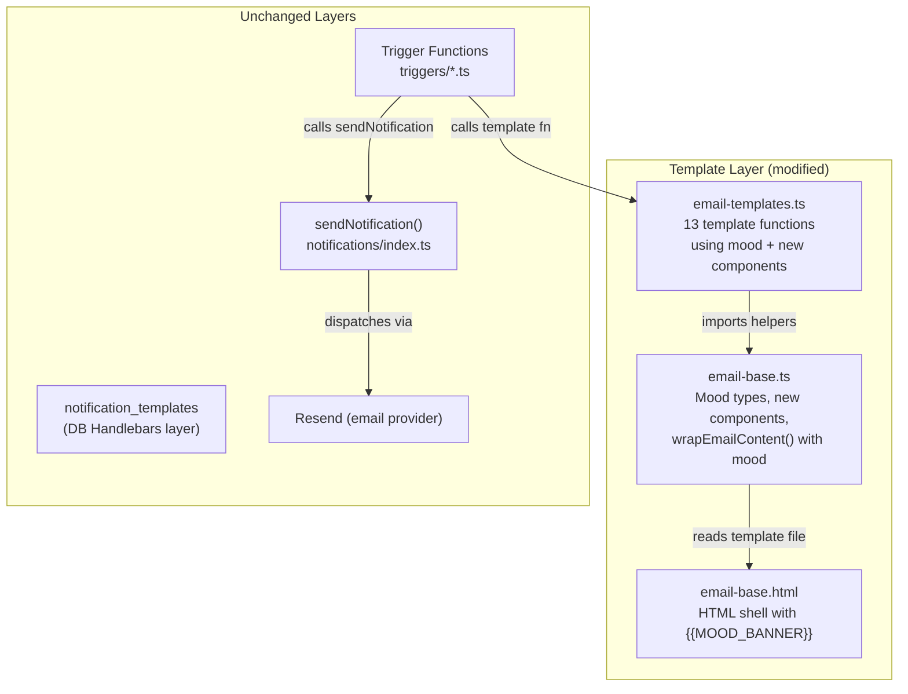
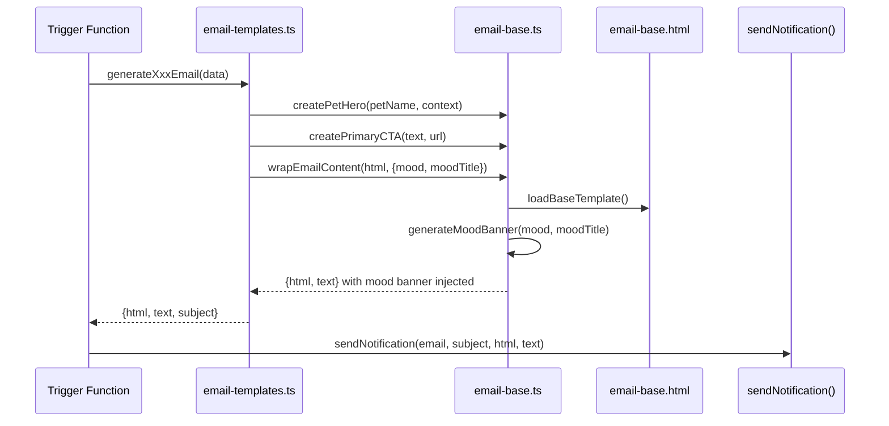

# Shared Email Layout with Mood System - Design Document

> **Feature**: Shared Email Layout with Mood System
> **Status**: Draft
> **Created**: 2026-03-13
> **Last Updated**: 2026-03-13
> **Depends On**: Phase 8 (Notification System), notification-templates spec
> **Requirements**: `docs/specs/notification-templates/requirements.md`

---

## Table of Contents

1. [Overview](#1-overview)
2. [Architecture](#2-architecture)
3. [Components and Interfaces](#3-components-and-interfaces)
4. [Data Models](#4-data-models)
5. [Implementation Details](#5-implementation-details)
6. [Error Handling](#6-error-handling)
7. [Testing Strategy](#7-testing-strategy)

---

## 1. Overview

### Purpose

This feature introduces a mood-based visual differentiation system for The Puppy Day's email notifications. Currently, all 13 email templates produce visually identical layouts regardless of emotional context -- a booking celebration looks the same as a payment failure warning. The mood system adds a single `mood` parameter to `wrapEmailContent()` that controls the banner color, CTA style, and emotional tone of each email, while also redesigning the shared email shell with proper branding.

### Business Value

- **Higher engagement**: Emotionally appropriate emails increase open-to-click rates. A gold celebration banner on booking confirmations feels different from a red-tinted payment warning.
- **Brand reinforcement**: The redesigned header with paw print icon and Georgia serif typography creates a recognizable, professional identity across all customer touchpoints.
- **Mobile readability**: Vertical time comparison layouts and pill-shaped buttons improve tap targets for the 40%+ mobile email audience.
- **Pet personalization**: The `createPetHero()` component centers the pet's name as the emotional anchor of each email.

### Scope

**Modified files (3)**:
- `src/lib/notifications/templates/email-base.html` -- header, mood banner placeholder, footer
- `src/lib/notifications/email-base.ts` -- mood types, new components, updated `wrapEmailContent()`
- `src/lib/notifications/email-templates.ts` -- all 13 template functions updated

**Not modified**: SMS templates, admin UI, DB-stored Handlebars templates, notification service logic, trigger functions.

### Key Design Decisions

| Decision | Rationale |
|----------|-----------|
| UTF-8 paw print emoji instead of inline SVG | Outlook retired inline SVG support in September 2025; Gmail never supported it. UTF-8 emoji renders universally without image blocking. See [Can I email - SVG](https://www.caniemail.com/features/html-svg/). |
| Gold (#D4A574) as primary CTA color | Charcoal CTA buttons blend with body text. Gold provides visual hierarchy and warmth appropriate for a pet business. |
| Pill-shaped buttons (border-radius: 50px) | Friendlier, more approachable feel for a pet grooming brand. Higher perceived clickability than square corners. |
| Vertical stacking for time comparisons | Side-by-side columns break on mobile. Vertical "old -> new" layout works at any width. |
| Solid color fallback for gradients | CSS `linear-gradient()` is unsupported in Outlook and Yahoo Mail. All gradient uses include a `background-color` fallback. See [Litmus - Gradients in Email](https://www.litmus.com/blog/background-colors-html-email). |
| Mood banner via placeholder replacement | Adding `{{MOOD_BANNER}}` to the HTML shell keeps mood logic in TypeScript while the HTML file remains a static template. |
| Backward-compatible `wrapEmailContent()` | The `mood` and `moodTitle` parameters are optional. Existing calls without mood continue to work identically. |

---

## 2. Architecture

### System Context

The mood system operates entirely within the TypeScript template layer. It does not touch the database, notification service, or SMS logic.



### Data Flow



### File Modification Summary

```
src/lib/notifications/
├── templates/
│   └── email-base.html          # MODIFIED - header redesign, {{MOOD_BANNER}}, footer
├── email-base.ts                # MODIFIED - mood types, 7 new components, updated wrapper
└── email-templates.ts           # MODIFIED - all 13 templates updated with mood + components
```

---

## 3. Components and Interfaces

### 3.1 Mood Type System

```typescript
// Added to src/lib/notifications/email-base.ts

/**
 * Email mood types that control visual appearance of the mood banner and CTA styling.
 * Each mood maps to a background color, optional subtitle, and recommended CTA variant.
 */
export type EmailMood = 'celebration' | 'reminder' | 'urgent' | 'info' | 'warning' | 'success';

export interface MoodConfig {
  backgroundColor: string;
  textColor: string;
  emoji: string;
  defaultTitle: string;
}

export const MOOD_CONFIGS: Record<EmailMood, MoodConfig> = {
  celebration: {
    backgroundColor: '#FFF8F0',
    textColor: '#92400E',
    emoji: '\u{1F389}',  // party popper
    defaultTitle: 'Great News!',
  },
  reminder: {
    backgroundColor: '#F0F7FF',
    textColor: '#1E40AF',
    emoji: '\u{1F4C5}',  // calendar
    defaultTitle: 'Friendly Reminder',
  },
  urgent: {
    backgroundColor: '#FFF4E6',
    textColor: '#92400E',
    emoji: '\u{26A1}',   // lightning
    defaultTitle: 'Action Required',
  },
  info: {
    backgroundColor: '#F8FAFB',
    textColor: '#434E54',
    emoji: '\u{2139}\u{FE0F}',  // info
    defaultTitle: 'Update',
  },
  warning: {
    backgroundColor: '#FEF2F2',
    textColor: '#991B1B',
    emoji: '\u{26A0}\u{FE0F}',  // warning
    defaultTitle: 'Important Notice',
  },
  success: {
    backgroundColor: '#F0FDF4',
    textColor: '#166534',
    emoji: '\u{2705}',   // check mark
    defaultTitle: 'Success',
  },
};
```

### 3.2 Updated EmailBaseOptions Interface

```typescript
// Updated in src/lib/notifications/email-base.ts

export interface EmailBaseOptions {
  unsubscribeLink?: string;
  mood?: EmailMood;
  moodTitle?: string;  // Override the default mood title
}
```

### 3.3 New Component Functions

All new components are added to `src/lib/notifications/email-base.ts` and exported.

#### createPetHero(petName, context)

Renders a centered hero block with a dog emoji, the pet's name in Georgia serif, and an optional context subtitle. This is the emotional anchor for personalized emails.

```typescript
/**
 * Create a pet hero section with centered dog emoji, pet name, and context.
 * Used as the emotional anchor at the top of personalized emails.
 *
 * @param petName - Pet's name (will be escaped)
 * @param context - Optional context subtitle, e.g. "Grooming Appointment" (will be escaped)
 */
export function createPetHero(petName: string, context?: string): string {
  const escapedName = escapeHtml(petName);
  const escapedContext = context ? escapeHtml(context) : '';

  return `
    <table role="presentation" width="100%" cellpadding="0" cellspacing="0" border="0">
      <tr>
        <td align="center" style="padding: 24px 0 16px 0;">
          <div style="font-size: 48px; line-height: 1; margin-bottom: 12px;">\u{1F436}</div>
          <h2 style="font-family: Georgia, 'Times New Roman', Times, serif; font-size: 24px; font-weight: 600; color: #434E54; margin: 0 0 4px 0;">
            ${escapedName}
          </h2>
          ${escapedContext ? `<p style="font-size: 14px; color: #434E54; opacity: 0.7; margin: 0;">${escapedContext}</p>` : ''}
        </td>
      </tr>
    </table>
  `;
}
```

#### createPrimaryCTA(text, url)

Gold pill button -- the primary call-to-action for celebration, reminder, and urgent moods.

```typescript
/**
 * Create a gold pill-shaped primary CTA button.
 * Gold (#D4A574) background, white text, 50px border-radius, subtle shadow.
 *
 * @param text - Button label (will be escaped)
 * @param url - Button URL (will be escaped)
 */
export function createPrimaryCTA(text: string, url: string): string {
  const escapedText = escapeHtml(text);
  const escapedUrl = escapeHtml(url);

  return `
    <table role="presentation" width="100%" cellpadding="0" cellspacing="0" border="0">
      <tr>
        <td align="center" style="padding: 8px 0;">
          <!--[if mso]>
          <v:roundrect xmlns:v="urn:schemas-microsoft-com:vml" xmlns:w="urn:schemas-microsoft-com:office:word" href="${escapedUrl}" style="height:50px;v-text-anchor:middle;width:250px;" arcsize="50%" fillcolor="#D4A574" stroke="f">
            <w:anchorlock/>
            <center style="color:#ffffff;font-family:sans-serif;font-size:16px;font-weight:600;">${escapedText}</center>
          </v:roundrect>
          <![endif]-->
          <!--[if !mso]><!-->
          <a href="${escapedUrl}" style="background-color: #D4A574; color: #ffffff !important; text-decoration: none; padding: 14px 40px; border-radius: 50px; display: inline-block; font-weight: 600; font-size: 16px; box-shadow: 0 2px 8px rgba(212, 165, 116, 0.3);">
            ${escapedText}
          </a>
          <!--<![endif]-->
        </td>
      </tr>
    </table>
  `;
}
```

#### createSecondaryCTA(text, url)

Outlined pill button with gold border -- used alongside primary CTA as a secondary action.

```typescript
/**
 * Create an outlined pill-shaped secondary CTA button.
 * Transparent background, gold border, gold text.
 *
 * @param text - Button label (will be escaped)
 * @param url - Button URL (will be escaped)
 */
export function createSecondaryCTA(text: string, url: string): string {
  const escapedText = escapeHtml(text);
  const escapedUrl = escapeHtml(url);

  return `
    <table role="presentation" width="100%" cellpadding="0" cellspacing="0" border="0">
      <tr>
        <td align="center" style="padding: 8px 0;">
          <a href="${escapedUrl}" style="background-color: transparent; color: #D4A574 !important; text-decoration: none; padding: 12px 36px; border-radius: 50px; border: 2px solid #D4A574; display: inline-block; font-weight: 600; font-size: 16px;">
            ${escapedText}
          </a>
        </td>
      </tr>
    </table>
  `;
}
```

#### createDangerCTA(text, url)

Red pill button for warning/urgent actions (payment failures, final notices).

```typescript
/**
 * Create a red pill-shaped danger CTA button.
 * Red (#DC2626) background, white text.
 *
 * @param text - Button label (will be escaped)
 * @param url - Button URL (will be escaped)
 */
export function createDangerCTA(text: string, url: string): string {
  const escapedText = escapeHtml(text);
  const escapedUrl = escapeHtml(url);

  return `
    <table role="presentation" width="100%" cellpadding="0" cellspacing="0" border="0">
      <tr>
        <td align="center" style="padding: 8px 0;">
          <!--[if mso]>
          <v:roundrect xmlns:v="urn:schemas-microsoft-com:vml" xmlns:w="urn:schemas-microsoft-com:office:word" href="${escapedUrl}" style="height:50px;v-text-anchor:middle;width:250px;" arcsize="50%" fillcolor="#DC2626" stroke="f">
            <w:anchorlock/>
            <center style="color:#ffffff;font-family:sans-serif;font-size:16px;font-weight:600;">${escapedText}</center>
          </v:roundrect>
          <![endif]-->
          <!--[if !mso]><!-->
          <a href="${escapedUrl}" style="background-color: #DC2626; color: #ffffff !important; text-decoration: none; padding: 14px 40px; border-radius: 50px; display: inline-block; font-weight: 600; font-size: 16px;">
            ${escapedText}
          </a>
          <!--<![endif]-->
        </td>
      </tr>
    </table>
  `;
}
```

#### createTimeComparison(oldDate, oldTime, newDate, newTime)

Vertical stacked layout showing old and new appointment times. Mobile-safe -- no side-by-side columns.

```typescript
/**
 * Create a vertical time comparison layout for rescheduled appointments.
 * Shows old date/time with strikethrough, arrow, then new date/time highlighted.
 *
 * @param oldDate - Original date string (will be escaped)
 * @param oldTime - Original time string (will be escaped)
 * @param newDate - New date string (will be escaped)
 * @param newTime - New time string (will be escaped)
 */
export function createTimeComparison(
  oldDate: string,
  oldTime: string,
  newDate: string,
  newTime: string
): string {
  return `
    <table role="presentation" width="100%" cellpadding="0" cellspacing="0" border="0" style="margin: 16px 0;">
      <tr>
        <td align="center">
          <div style="background-color: #FFFBF7; border-radius: 12px; padding: 20px; max-width: 320px; margin: 0 auto;">
            <!-- Old time (struck through) -->
            <p style="margin: 0 0 4px 0; font-size: 13px; color: #9CA3AF; text-transform: uppercase; letter-spacing: 0.05em;">Previously</p>
            <p style="margin: 0 0 16px 0; font-size: 16px; color: #9CA3AF; text-decoration: line-through;">
              ${escapeHtml(oldDate)} at ${escapeHtml(oldTime)}
            </p>
            <!-- Arrow -->
            <div style="font-size: 20px; margin: 0 0 16px 0; color: #D4A574;">\u{2193}</div>
            <!-- New time (highlighted) -->
            <p style="margin: 0 0 4px 0; font-size: 13px; color: #D4A574; text-transform: uppercase; letter-spacing: 0.05em; font-weight: 600;">New Time</p>
            <p style="margin: 0; font-size: 18px; color: #434E54; font-weight: 700; font-family: Georgia, 'Times New Roman', Times, serif;">
              ${escapeHtml(newDate)}<br/>at ${escapeHtml(newTime)}
            </p>
          </div>
        </td>
      </tr>
    </table>
  `;
}
```

#### createDivider()

Gold gradient horizontal rule. Falls back to solid gold on Outlook.

```typescript
/**
 * Create a gold gradient divider line.
 * Uses background-color fallback for clients that don't support gradients.
 */
export function createDivider(): string {
  return `
    <table role="presentation" width="100%" cellpadding="0" cellspacing="0" border="0">
      <tr>
        <td style="padding: 16px 0;">
          <div style="height: 2px; background-color: #D4A574; background-image: linear-gradient(to right, transparent, #D4A574, transparent);"></div>
        </td>
      </tr>
    </table>
  `;
}
```

#### createTip(text)

Subtle info callout for helpful tips (e.g., "Arrive 5 minutes early").

```typescript
/**
 * Create a subtle tip/info callout box.
 * Light cream background with a paw print icon prefix.
 *
 * @param text - Tip text (will be escaped)
 */
export function createTip(text: string): string {
  const escapedText = escapeHtml(text);

  return `
    <table role="presentation" width="100%" cellpadding="0" cellspacing="0" border="0">
      <tr>
        <td style="padding: 8px 0;">
          <div style="background-color: #FFFBF7; border-radius: 8px; padding: 14px 16px; border-left: 3px solid #D4A574;">
            <p style="margin: 0; font-size: 14px; color: #434E54; line-height: 1.5;">
              <span style="margin-right: 6px;">\u{1F43E}</span> ${escapedText}
            </p>
          </div>
        </td>
      </tr>
    </table>
  `;
}
```

### 3.4 Updated wrapEmailContent()

```typescript
/**
 * Wrap content HTML in the base email template.
 * Generates both HTML and plain text versions.
 * Optionally injects a mood banner between header and content.
 *
 * @param contentHtml - The HTML content to wrap (should already be escaped)
 * @param options - Configuration: unsubscribe link, mood, moodTitle
 * @returns EmailContent with both HTML and text versions
 */
export function wrapEmailContent(
  contentHtml: string,
  options: EmailBaseOptions = {}
): EmailContent {
  const baseTemplate = loadBaseTemplate();
  const unsubscribeLink = options.unsubscribeLink || '{{UNSUBSCRIBE_LINK}}';

  // Generate mood banner HTML (or empty string if no mood)
  const moodBannerHtml = options.mood
    ? generateMoodBanner(options.mood, options.moodTitle)
    : '';

  // Replace placeholders in base template
  const html = baseTemplate
    .replace('{{MOOD_BANNER}}', moodBannerHtml)
    .replace('{{CONTENT}}', contentHtml)
    .replace('{{UNSUBSCRIBE_LINK}}', unsubscribeLink);

  // Generate plain text version from HTML
  const text = htmlToPlainText(contentHtml);

  return { html, text };
}
```

### 3.5 Mood Banner Generator (Internal)

```typescript
/**
 * Generate a mood banner HTML block.
 * Internal function -- called by wrapEmailContent() when mood is specified.
 *
 * @param mood - The mood type
 * @param title - Optional override for the banner title text
 */
function generateMoodBanner(mood: EmailMood, title?: string): string {
  const config = MOOD_CONFIGS[mood];
  const bannerTitle = title || config.defaultTitle;

  return `
    <tr>
      <td style="padding: 0;">
        <div style="background-color: ${config.backgroundColor}; border-radius: 8px; padding: 14px 20px; margin: 0 0 16px 0; text-align: center;">
          <p style="margin: 0; font-size: 15px; font-weight: 600; color: ${config.textColor};">
            ${config.emoji} ${escapeHtml(bannerTitle)}
          </p>
        </div>
      </td>
    </tr>
  `;
}
```

### 3.6 Button Backward Compatibility

The existing `createButton()` and `createSecondaryButton()` functions are updated to use the new pill styling. The old function names are preserved as-is -- they simply produce the new visual output. No aliases needed since the function signatures are unchanged.

```typescript
// createButton() updated body -- same signature: (text: string, url: string) => string
// Changes: border-radius 8px -> 50px, background #434E54 -> #D4A574, add shadow
// createSecondaryButton() updated body -- same signature
// Changes: border-radius 8px -> 50px, border color #434E54 -> #D4A574, text color -> #D4A574
// createWarmButton() -- already uses gold, update border-radius to 50px only
```

---

## 4. Data Models

### 4.1 Email Base HTML Template Changes

**File**: `src/lib/notifications/templates/email-base.html`

No database changes. The HTML template is a static file read at runtime.

#### Header Redesign

Replace the current plain text header with a charcoal background block containing a paw print emoji (UTF-8, not SVG), business name in Georgia serif, and subtitle in gold.

```html
<!-- NEW Header with Charcoal Background -->
<tr>
  <td align="center" style="background-color: #434E54; border-radius: 12px 12px 0 0; padding: 28px 20px 24px 20px;">
    <!-- Paw print emoji (UTF-8, universal email client support) -->
    <div style="font-size: 36px; line-height: 1; margin-bottom: 10px;">&#x1F43E;</div>
    <h1 style="color: #F8EEE5; margin: 0; font-size: 28px; font-weight: 600; letter-spacing: -0.5px; font-family: Georgia, 'Times New Roman', Times, serif;">
      The Puppy Day
    </h1>
    <p style="color: #D4A574; margin: 6px 0 0 0; font-size: 13px; font-weight: 500; letter-spacing: 0.05em; text-transform: uppercase;">
      Professional Dog Grooming
    </p>
  </td>
</tr>
```

#### Gold Accent Strip

Replace the solid 4px bar with a gradient strip that falls back to solid gold.

```html
<!-- Gold Gradient Strip -->
<tr>
  <td style="padding: 0;">
    <div style="height: 4px; background-color: #D4A574; background-image: linear-gradient(to right, #D4A574, #E8C9A0, #D4A574);"></div>
  </td>
</tr>
```

#### Mood Banner Placeholder

Insert between the gold strip and the content section.

```html
<!-- Mood Banner (injected by wrapEmailContent) -->
{{MOOD_BANNER}}

<!-- Spacer -->
<tr>
  <td style="padding: 16px 0 0 0;"></td>
</tr>
```

#### Footer Redesign

```html
<!-- Footer -->
<tr>
  <td class="footer">
    <!-- Gold gradient divider -->
    <div style="height: 2px; background-color: #D4A574; background-image: linear-gradient(to right, transparent, #D4A574, transparent); margin-top: 32px;"></div>
    <div style="padding-top: 24px;">
      <p style="margin: 0 0 8px 0; color: #434E54; font-size: 14px;">
        <strong>The Puppy Day</strong><br>
        14936 Leffingwell Rd, La Mirada, CA 90638<br>
        <a href="tel:+16572522903" style="color: #434E54;">(657) 252-2903</a> |
        <a href="mailto:puppyday14936@gmail.com" style="color: #434E54;">puppyday14936@gmail.com</a>
      </p>
      <p style="margin: 16px 0 0 0; color: #6B7280; font-size: 12px;">
        Monday-Saturday, 9:00 AM - 5:00 PM
      </p>
      <div class="social-links" style="margin: 16px 0;">
        <a href="https://www.instagram.com/puppyday_lm" style="color: #434E54; text-decoration: none; margin: 0 8px;">Instagram @puppyday_lm</a>
      </div>
      <p style="margin: 16px 0 0 0; color: #6B7280; font-size: 12px;">
        <a href="{{UNSUBSCRIBE_LINK}}" style="color: #6B7280;">Unsubscribe</a> from these emails
      </p>
    </div>
  </td>
</tr>
```

Key changes from current footer:
- Gold gradient divider replaces `border-top: 1px solid #E5E5E5`
- Unsubscribe and muted text color changed from `#9CA3AF` to `#6B7280` (WCAG AA compliant on white)
- Hours text also uses `#6B7280`

### 4.2 Template-to-Mood Mapping

This table defines which mood, components, and CTAs each template function uses after the update.

| Template Function | Mood | Pet Hero | CTA Type | New Components Used |
|---|---|---|---|---|
| `generateBookingConfirmationEmail` | `celebration` | Yes ("Grooming Booked") | `createPrimaryCTA` | petHero, divider |
| `generateReportCardEmail` | `celebration` | Yes ("Looking Fresh") | `createPrimaryCTA` | petHero, photos first |
| `generateRetentionReminderEmail` | `reminder` | Yes ("Time for a Trim") | `createPrimaryCTA` | petHero, tip |
| `generatePaymentFailedEmail` | `warning` | No | `createDangerCTA` | -- |
| `generatePaymentReminderEmail` | `info` | No | None | -- |
| `generatePaymentSuccessEmail` | `success` | No | None | -- |
| `generatePaymentFinalNoticeEmail` | `warning` | No | `createDangerCTA` | urgencyBox |
| `generateAppointmentReminderEmail` | `reminder` | Yes ("Appointment Tomorrow") | `createPrimaryCTA` | petHero, tip |
| `generateAppointmentCancelledEmail` | `info` | Yes ("Appointment Cancelled") | `createPrimaryCTA` | petHero |
| `generateAppointmentRescheduledEmail` | `info` | No | `createPrimaryCTA` | timeComparison |
| `generateReviewRequestEmail` | `celebration` | Yes ("Thanks for Visiting") | `createPrimaryCTA` + `createSecondaryCTA` | petHero |
| `generateWaitlistAddedEmail` | `info` | No | None | badge (position) |
| `generateWaitlistAvailableEmail` | `urgent` | No | `createPrimaryCTA` | urgencyBox |

---

## 5. Implementation Details

### 5.1 Implementation Phases

The implementation is ordered to avoid breaking existing functionality at any step.

**Phase 1: HTML Shell Redesign** (email-base.html)
1. Update the header block (charcoal background, paw emoji, Georgia serif, gold subtitle)
2. Update the gold accent strip to use gradient with fallback
3. Add `{{MOOD_BANNER}}` placeholder after the accent strip
4. Update footer (gold gradient divider, #6B7280 contrast fix)
5. Update CSS `.button` and `.button-secondary` to pill style (border-radius: 50px)
6. Add CSS for `.button-gold` class

**Phase 2: email-base.ts Updates**
1. Add `EmailMood` type, `MoodConfig` interface, `MOOD_CONFIGS` constant
2. Update `EmailBaseOptions` interface with `mood?` and `moodTitle?`
3. Add `generateMoodBanner()` internal function
4. Update `wrapEmailContent()` to handle `{{MOOD_BANNER}}` replacement
5. Add 7 new component functions: `createPetHero`, `createPrimaryCTA`, `createSecondaryCTA`, `createDangerCTA`, `createTimeComparison`, `createDivider`, `createTip`
6. Update `createButton()` body to gold pill style
7. Update `createSecondaryButton()` body to gold outlined pill style
8. Update `createWarmButton()` border-radius to 50px
9. Update fallback template to match new header/footer structure

**Phase 3: Template Updates** (email-templates.ts)
1. Update imports to include new component functions
2. Update each of the 13 template functions per the mapping table:
   - Add `mood` and optional `moodTitle` to the `wrapEmailContent()` call
   - Replace `createButton()` calls with `createPrimaryCTA()` / `createDangerCTA()` as appropriate
   - Add `createPetHero()` to templates that need pet personalization
   - Replace side-by-side date layouts with `createTimeComparison()` in reschedule template
   - Add `createTip()` to reminder and retention templates
   - Add `createDivider()` between content sections

### 5.2 Email Client Compatibility Notes

| Feature | Apple Mail | Gmail | Outlook (Windows) | Yahoo Mail |
|---|---|---|---|---|
| UTF-8 emoji (paw print, party popper) | Full | Full | Full | Full |
| `border-radius: 50px` on buttons | Full | Full | Ignored (square) | Full |
| `linear-gradient()` backgrounds | Full | Partial | Ignored (solid fallback) | Ignored (solid fallback) |
| `box-shadow` on buttons | Full | Stripped | Ignored | Full |
| VML roundrect fallback | N/A | N/A | Full | N/A |
| `line-through` text decoration | Full | Full | Full | Full |

All features degrade gracefully. Outlook users see solid gold backgrounds instead of gradients and square buttons instead of pills. The email remains fully readable and functional.

### 5.3 VML Fallback for Outlook Buttons

The `createPrimaryCTA()` and `createDangerCTA()` functions include VML `<v:roundrect>` conditional comments for Outlook. This ensures Outlook renders pill-shaped, colored buttons instead of plain text links. The pattern:

```html
<!--[if mso]>
  <v:roundrect ... arcsize="50%" fillcolor="#D4A574">
    <center>Button Text</center>
  </v:roundrect>
<![endif]-->
<!--[if !mso]><!-->
  <a href="..." style="border-radius: 50px; ...">Button Text</a>
<!--<![endif]-->
```

### 5.4 Inline SVG Decision (Rejected)

The original plan called for an inline SVG paw print icon in the header. Research revealed that **Microsoft retired inline SVG support in Outlook in September 2025**, and Gmail has never supported embedded SVG. The design uses a UTF-8 paw print emoji (`&#x1F43E;` / `\u{1F43E}`) instead, which renders universally across all email clients without image blocking.

---

## 6. Error Handling

### 6.1 Mood Parameter Validation

If an invalid mood string is passed to `wrapEmailContent()`, the function falls back to no mood banner (empty string replacement). This prevents runtime errors while maintaining email delivery.

```typescript
// In wrapEmailContent()
const moodBannerHtml = options.mood && MOOD_CONFIGS[options.mood]
  ? generateMoodBanner(options.mood, options.moodTitle)
  : '';
```

### 6.2 Template Placeholder Handling

If `{{MOOD_BANNER}}` is missing from the HTML template (e.g., fallback template or corrupted file), the `.replace()` call is a no-op -- no error is thrown, and the content renders without a banner. The fallback template in `getFallbackTemplate()` is updated to include the `{{MOOD_BANNER}}` placeholder.

### 6.3 Escaping

All new component functions (`createPetHero`, `createPrimaryCTA`, etc.) escape user-provided strings via the existing `escapeHtml()` utility. The `createTimeComparison()` function escapes all four date/time parameters. The `createTip()` function escapes the tip text.

### 6.4 Backward Compatibility

- `wrapEmailContent(html)` with no options continues to work (mood defaults to `undefined`, banner is empty)
- `wrapEmailContent(html, { unsubscribeLink: '...' })` continues to work (no mood)
- `createButton(text, url)` continues to work with the same signature, producing updated gold pill styling

---

## 7. Testing Strategy

### 7.1 Unit Tests

**File**: `src/lib/notifications/__tests__/email-base.test.ts` (new or extended)

| Test | Description |
|---|---|
| `wrapEmailContent with no mood` | Verifies `{{MOOD_BANNER}}` is replaced with empty string; output matches current behavior |
| `wrapEmailContent with celebration mood` | Verifies banner contains `#FFF8F0` background and party popper emoji |
| `wrapEmailContent with each mood type` | Parameterized test for all 6 moods; verifies correct backgroundColor and emoji |
| `wrapEmailContent with custom moodTitle` | Verifies custom title overrides default |
| `wrapEmailContent with invalid mood` | Verifies graceful fallback to no banner |
| `createPetHero renders pet name` | Verifies escaped pet name appears in Georgia serif h2 |
| `createPetHero with context` | Verifies context subtitle renders |
| `createPetHero without context` | Verifies no subtitle paragraph when context is omitted |
| `createPetHero escapes HTML` | Verifies `<script>` in pet name is escaped |
| `createPrimaryCTA renders gold button` | Verifies `#D4A574` background, 50px border-radius, VML fallback |
| `createSecondaryCTA renders outlined button` | Verifies gold border, transparent background |
| `createDangerCTA renders red button` | Verifies `#DC2626` background, VML fallback |
| `createTimeComparison renders vertical layout` | Verifies old date has `line-through`, new date has bold serif styling |
| `createTimeComparison escapes all params` | Verifies all 4 date/time params are escaped |
| `createDivider renders gold gradient` | Verifies gradient CSS with solid fallback |
| `createTip renders callout` | Verifies paw emoji prefix, cream background, left border |
| `createTip escapes text` | Verifies HTML in tip text is escaped |
| `createButton uses gold pill style` | Verifies updated styling (backward compat) |

### 7.2 Integration Tests

**File**: `src/lib/notifications/__tests__/email-templates.test.ts` (new or extended)

| Test | Description |
|---|---|
| `generateBookingConfirmationEmail includes celebration mood` | Verifies HTML contains `#FFF8F0` mood banner |
| `generateBookingConfirmationEmail includes pet hero` | Verifies pet name in Georgia serif heading |
| `generatePaymentFailedEmail includes warning mood` | Verifies `#FEF2F2` banner and red CTA |
| `generateAppointmentRescheduledEmail uses time comparison` | Verifies vertical layout with strikethrough old date |
| `generateAppointmentReminderEmail includes tip` | Verifies tip callout with paw emoji |
| `generateReviewRequestEmail includes both CTAs` | Verifies gold primary + outlined secondary |
| `generateWaitlistAvailableEmail includes urgency box` | Verifies urgency styling and gold CTA |
| `All 13 templates produce valid EmailTemplate` | Parameterized: each returns `{html, text, subject}` with non-empty values |
| `All 13 templates include unsubscribe placeholder` | Verifies `{{UNSUBSCRIBE_LINK}}` or actual link present |

### 7.3 Visual Testing

Manual visual verification by rendering each template's HTML output in a browser. Check:
- Header renders with charcoal background, paw emoji, cream text, gold subtitle
- Mood banners show correct background colors
- Pet hero sections center correctly
- Pill buttons render with rounded corners
- Time comparison stacks vertically
- Footer gold divider renders
- Unsubscribe link is readable (#6B7280)

Test in:
- Apple Mail (macOS) -- full rendering
- Gmail (web) -- gradient fallbacks
- Outlook (Windows) -- VML button rendering, emoji support
- Mobile Safari (iOS) -- responsive button widths

### 7.4 Build Verification

```bash
npm run build    # Verify no compilation errors
npm run lint     # Verify no lint errors
npm run test     # Run all unit + integration tests
```

---

## Appendix: Email Visual Structure

```
+--------------------------------------------------+
|          [charcoal #434E54 background]            |
|                                                    |
|              (paw emoji, 36px)                    |
|           The Puppy Day (Georgia serif)           |
|        PROFESSIONAL DOG GROOMING (gold)           |
|                                                    |
+==================================================+ <-- gold gradient strip (4px)
|                                                    |
|  +----------------------------------------------+  |
|  |  (emoji) Mood Banner Title  (mood bg color)  |  | <-- {{MOOD_BANNER}}
|  +----------------------------------------------+  |
|                                                    |
|              (dog emoji, 48px)                    |  |
|           Pet Name (Georgia serif)                |  | <-- createPetHero()
|            Context Subtitle                       |  |
|                                                    |
|  +----------------------------------------------+  |
|  |  Content Card                                 |  |
|  |  - Info rows                                  |  |
|  |  - Alerts                                     |  |
|  +----------------------------------------------+  |
|                                                    |
|  +----------------------------------------------+  |
|  |  (paw) Tip text here                          |  | <-- createTip()
|  +----------------------------------------------+  |
|                                                    |
|         [ Gold Pill CTA Button ]                  |  | <-- createPrimaryCTA()
|         [ Outlined Secondary ]                    |  | <-- createSecondaryCTA()
|                                                    |
+--------------------------------------------------+
|  ~~~~~~~~~~~~ gold gradient divider ~~~~~~~~~~~~  |
|                                                    |
|              The Puppy Day                        |
|    14936 Leffingwell Rd, La Mirada, CA 90638     |
|        (657) 252-2903 | email                     |
|        Mon-Sat, 9:00 AM - 5:00 PM               |
|          Instagram @puppyday_lm                   |
|           Unsubscribe (#6B7280)                   |
+--------------------------------------------------+
```
