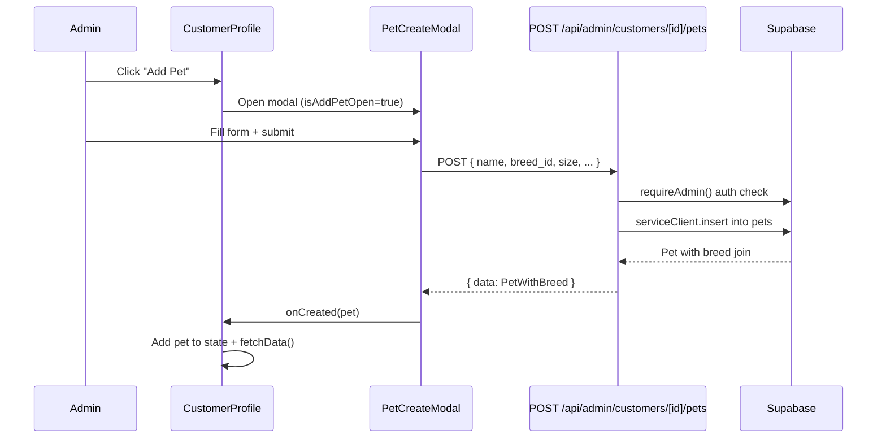

# Design: Add Pet Creation Modal to Customer Profile

## Overview

Add a `PetCreateModal` component to the admin customer profile page, allowing admins to create new pets for a customer directly from their profile. This fills the existing TODO in `CustomerProfile.tsx` where the "Add Pet" button exists but has no handler.

**Business Value**: Admins currently cannot add pets from the customer profile -- they must navigate elsewhere or use workarounds. This feature completes the pet management CRUD on the customer detail page.

**Key Design Decision**: Clone the existing `PetEditModal` pattern to ensure visual and behavioral consistency. The only differences are empty initial state, required size selection (no default), POST instead of PATCH, and a browse-on-focus breed dropdown.

## Architecture



### Component Hierarchy

```
CustomerProfile
  +-- CustomerHero (onAddPet -> setIsAddPetOpen(true))
  +-- PetCard[] (existing)
  +-- Empty state "Add Pet" button (same handler)
  +-- PetCreateModal (dynamic import, rendered when isAddPetOpen)
  +-- PetEditModal (existing, for editing)
```

## Components and Interfaces

### PetCreateModal

**File**: `src/components/admin/customers/PetCreateModal.tsx`

**Props**:
```typescript
interface PetCreateModalProps {
  customerId: string;
  isOpen: boolean;
  onClose: () => void;
  onCreated: (pet: PetWithBreed) => void;
}
```

**Differences from PetEditModal**:

| Aspect | PetEditModal | PetCreateModal |
|--------|-------------|----------------|
| Title | "Edit Pet" | "Add Pet" |
| Initial state | Populated from `pet` prop | All fields empty |
| Size default | Pre-selected from pet | No selection (empty string) |
| Size validation | Already valid | Required -- must select |
| API call | PATCH `.../pets/{petId}` | POST `.../pets` |
| Submit button | "Save Changes" / "Saving..." | "Add Pet" / "Adding..." |
| Toast | "Pet updated" | "Pet added" |
| Form ID | `pet-edit-form` | `pet-create-form` |
| Breed dropdown | Shows on search input | Shows first 10 on focus (browse-on-focus) |
| Submit disabled | `!name.trim()` | `!name.trim() \|\| !size` |

**Behavior Details**:
- Form resets to empty state each time modal opens (useEffect on `isOpen`)
- Breed mode defaults to `'known'`
- Browse-on-focus: When the breed search input is focused and empty, show the first 10 breeds from the full list. This allows quick browsing without typing.
- All other UI patterns identical to PetEditModal: AnimatePresence animation, warm header with PawPrint icon, focus trap, scroll lock, escape key handling, amber-styled medical info field

### CustomerProfile Modifications

**File**: `src/components/admin/customers/CustomerProfile.tsx`

Changes:
1. Add state: `const [isAddPetOpen, setIsAddPetOpen] = useState(false)`
2. Add dynamic import for `PetCreateModal` (same pattern as existing `PetEditModal` import)
3. Wire `onAddPet={() => setIsAddPetOpen(true)}` in CustomerHero (replacing TODO)
4. Wire empty-state "Add Pet" button with same handler
5. Render `PetCreateModal` at bottom of component with `onCreated` callback
6. `onCreated` callback: optimistically add pet to `customer.pets`, then call `fetchData()` for full refresh

### POST API Endpoint

**File**: `src/app/api/admin/customers/[id]/pets/route.ts`

Add a `POST` handler alongside the existing `GET` in this file.

```typescript
export async function POST(
  request: NextRequest,
  { params }: { params: Promise<{ id: string }> }
) {
  // 1. Auth: two-client pattern
  const supabase = await createServerSupabaseClient();
  const serviceClient = createServiceRoleClient();
  await requireAdmin(supabase);

  // 2. Parse & validate
  const { id: customerId } = await params;
  const body = await request.json();
  // name: required, non-empty
  // size: required, must be in ['small', 'medium', 'large', 'xlarge']
  // breed_id, breed_custom, gender, color, notes, medical_info: optional

  // 3. Insert
  const { data, error } = await serviceClient
    .from('pets')
    .insert({
      owner_id: customerId,
      name: body.name.trim(),
      size: body.size,
      breed_id: body.breed_id || null,
      breed_custom: body.breed_custom?.trim() || null,
      gender: body.gender || null,
      color: body.color?.trim() || null,
      notes: body.notes?.trim() || null,
      medical_info: body.medical_info?.trim() || null,
      is_active: true,
    })
    .select('*, breed:breeds(*)')
    .single();

  // 4. Return { data: PetWithBreed }
}
```

**Validation Rules**:
- `name`: Required, non-empty after trim. Return 400 if missing.
- `size`: Required, must be one of `small`, `medium`, `large`, `xlarge`. Return 400 if invalid.
- All other fields: Optional, nullable.

**Error Responses**:
- 400: Missing name or invalid size
- 401: Not authenticated or not admin
- 500: Database insert failure

## Data Models

No new database tables or columns. Uses existing `pets` table:

```sql
-- Existing schema (relevant columns)
pets (
  id          uuid PRIMARY KEY DEFAULT gen_random_uuid(),
  owner_id    uuid REFERENCES users(id),
  name        text NOT NULL,
  breed_id    uuid REFERENCES breeds(id),
  breed_custom text,
  size        pet_size NOT NULL,  -- enum: small, medium, large, xlarge
  gender      text,
  color       text,
  medical_info text,
  notes       text,
  is_active   boolean DEFAULT true,
  created_at  timestamptz DEFAULT now(),
  updated_at  timestamptz DEFAULT now()
)
```

**TypeScript type** (existing):
```typescript
// From PetCard.tsx
interface PetWithBreed extends Pet {
  breed?: { id: string; name: string } | null;
}
```

## Error Handling

| Scenario | Handling |
|----------|----------|
| Validation failure (empty name / no size) | Inline error message in form, submit button stays disabled |
| API returns 400 | Display error message in form error banner |
| API returns 401 | Display error, likely session expired |
| API returns 500 | `toast.error('Failed to add pet')`, error banner in form |
| Network failure | Caught in try/catch, `toast.error('Failed to add pet')` |
| Success | `toast.success('Pet added')`, call `onCreated`, close modal |

## Testing Strategy

### Unit Tests
- `PetCreateModal` renders correctly when open
- Form validation: submit disabled when name empty or size not selected
- Breed search filters correctly
- Browse-on-focus shows first 10 breeds when search is empty and input focused

### Integration Tests
- POST `/api/admin/customers/[id]/pets` returns 201 with valid payload
- POST returns 400 for missing name
- POST returns 400 for invalid size
- POST returns 401 for non-admin
- CustomerProfile opens modal on "Add Pet" click
- New pet appears in pets list after creation

### Manual Testing Checklist
- Open modal from CustomerHero "Add Pet" button
- Open modal from empty-state "Add Pet" button
- Fill all fields and submit successfully
- Verify pet appears in list without page reload
- Verify focus trap works (tab cycling)
- Verify escape key closes modal
- Verify backdrop click closes modal
- Verify scroll lock while modal open
