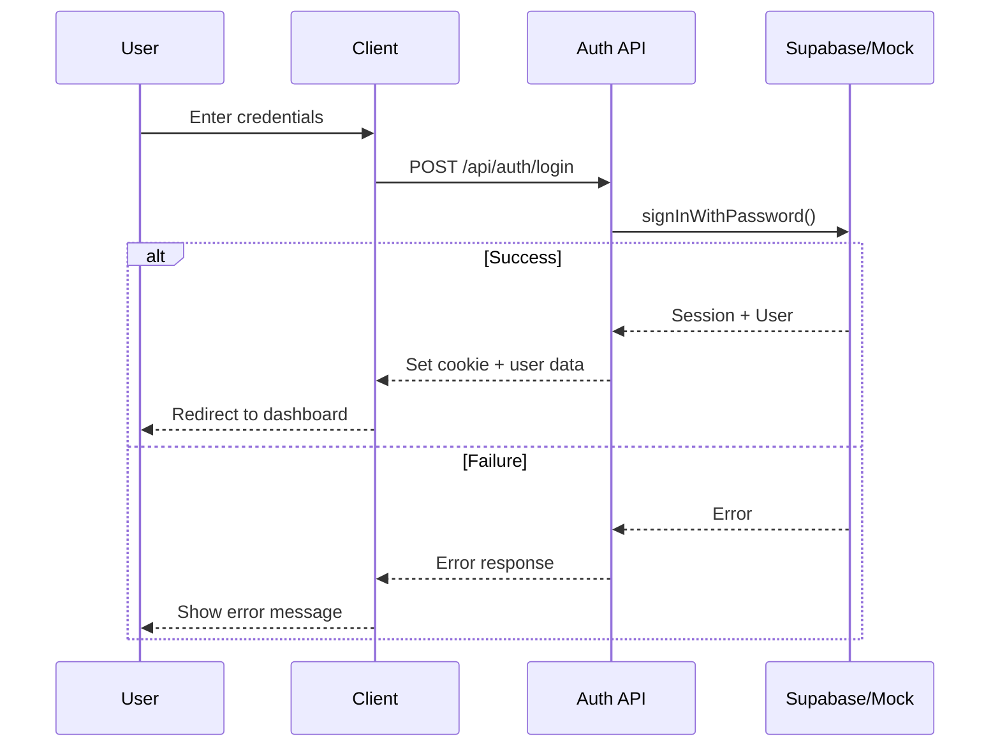
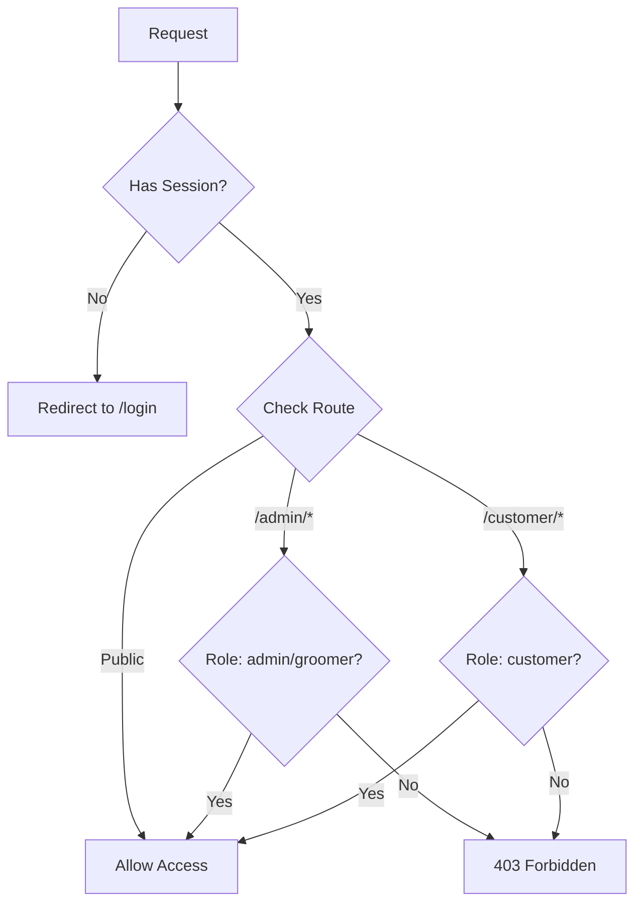
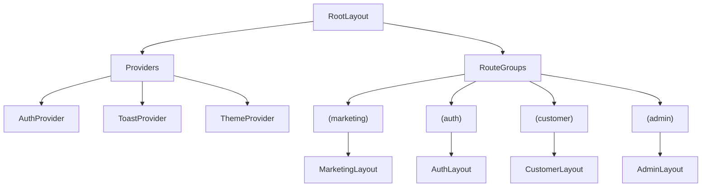

# Design Document - Phase 1: Foundation & Database

## Overview

This document outlines the technical architecture and design decisions for Phase 1 of The Puppy Day SaaS application. The foundation establishes the project structure, database schema, authentication system, mock service layer, and base component library.

## Architecture

### Technology Stack

| Layer | Technology | Version |
|-------|------------|---------|
| Framework | Next.js (App Router) | 16.x |
| Language | TypeScript | 5.x |
| Styling | Tailwind CSS + DaisyUI | 4.x + 5.x |
| Animation | Framer Motion | 12.x |
| Database | Supabase (PostgreSQL) | Latest |
| Auth | Supabase Auth | Latest |
| State | Zustand | 5.x |
| Forms | React Hook Form + Zod | 7.x + 4.x |

### Project Structure

```
src/
├── app/
│   ├── (marketing)/           # Public pages (landing, booking)
│   │   ├── layout.tsx
│   │   └── page.tsx
│   ├── (auth)/                # Authentication pages
│   │   ├── layout.tsx
│   │   ├── login/page.tsx
│   │   ├── register/page.tsx
│   │   └── forgot-password/page.tsx
│   ├── (customer)/            # Customer portal
│   │   ├── layout.tsx
│   │   ├── dashboard/page.tsx
│   │   ├── appointments/page.tsx
│   │   ├── pets/page.tsx
│   │   └── profile/page.tsx
│   ├── (admin)/               # Admin panel
│   │   ├── layout.tsx
│   │   ├── dashboard/page.tsx
│   │   ├── appointments/page.tsx
│   │   ├── customers/page.tsx
│   │   └── services/page.tsx
│   ├── api/                   # API routes
│   │   └── webhooks/
│   ├── layout.tsx             # Root layout
│   ├── page.tsx               # Redirect to marketing
│   └── globals.css
├── components/
│   ├── ui/                    # Base UI components
│   │   ├── button.tsx
│   │   ├── input.tsx
│   │   ├── select.tsx
│   │   ├── card.tsx
│   │   ├── modal.tsx
│   │   ├── toast.tsx
│   │   └── index.ts
│   ├── forms/                 # Form components
│   │   ├── form-field.tsx
│   │   └── form-error.tsx
│   └── layouts/               # Layout components
│       ├── marketing-nav.tsx
│       ├── customer-nav.tsx
│       └── admin-sidebar.tsx
├── lib/
│   ├── supabase/
│   │   ├── client.ts          # Browser client
│   │   ├── server.ts          # Server client
│   │   └── middleware.ts      # Auth middleware
│   ├── stripe/
│   │   └── client.ts
│   ├── resend/
│   │   └── client.ts
│   ├── twilio/
│   │   └── client.ts
│   ├── config.ts              # Environment config
│   └── utils.ts               # Utility functions
├── mocks/
│   ├── supabase/
│   │   ├── client.ts          # Mock Supabase client
│   │   ├── store.ts           # In-memory store
│   │   └── seed.ts            # Seed data
│   ├── stripe/
│   │   └── client.ts
│   ├── resend/
│   │   └── client.ts
│   └── twilio/
│       └── client.ts
├── hooks/
│   ├── use-auth.ts
│   ├── use-toast.ts
│   └── use-media-query.ts
├── stores/
│   ├── auth-store.ts
│   └── toast-store.ts
└── types/
    ├── database.ts            # Database types
    ├── api.ts                 # API types
    └── index.ts
```

## Components and Interfaces

### Service Factory Pattern

```typescript
// src/lib/config.ts
export const config = {
  useMocks: process.env.NEXT_PUBLIC_USE_MOCKS === 'true',
  supabase: {
    url: process.env.NEXT_PUBLIC_SUPABASE_URL!,
    anonKey: process.env.NEXT_PUBLIC_SUPABASE_ANON_KEY!,
  },
  stripe: {
    publishableKey: process.env.NEXT_PUBLIC_STRIPE_PUBLISHABLE_KEY!,
  },
  app: {
    url: process.env.NEXT_PUBLIC_APP_URL!,
    name: process.env.NEXT_PUBLIC_APP_NAME!,
  },
};

// src/lib/supabase/client.ts
import { config } from '@/lib/config';
import { createMockClient } from '@/mocks/supabase/client';
import { createBrowserClient } from '@supabase/ssr';

export const createClient = () => {
  if (config.useMocks) {
    return createMockClient();
  }
  return createBrowserClient(config.supabase.url, config.supabase.anonKey);
};
```

### Mock Store Interface

```typescript
// src/mocks/supabase/store.ts
interface MockStore {
  tables: Map<string, any[]>;

  // CRUD operations
  select<T>(table: string, query?: QueryParams): T[];
  insert<T>(table: string, data: Partial<T>): T;
  update<T>(table: string, id: string, data: Partial<T>): T;
  delete(table: string, id: string): void;

  // Persistence
  save(): void;
  load(): void;
  reset(): void;
  seed(): void;
}
```

### Auth Context Interface

```typescript
// src/hooks/use-auth.ts
interface AuthContext {
  user: User | null;
  isLoading: boolean;
  isAuthenticated: boolean;

  signIn(email: string, password: string): Promise<void>;
  signUp(data: SignUpData): Promise<void>;
  signOut(): Promise<void>;
  resetPassword(email: string): Promise<void>;
}
```

### Component Props Interfaces

```typescript
// Button Component
interface ButtonProps extends React.ButtonHTMLAttributes<HTMLButtonElement> {
  variant?: 'primary' | 'secondary' | 'outline' | 'ghost' | 'error';
  size?: 'xs' | 'sm' | 'md' | 'lg';
  isLoading?: boolean;
  leftIcon?: React.ReactNode;
  rightIcon?: React.ReactNode;
}

// Input Component
interface InputProps extends React.InputHTMLAttributes<HTMLInputElement> {
  label?: string;
  error?: string;
  helperText?: string;
  leftElement?: React.ReactNode;
  rightElement?: React.ReactNode;
}

// Modal Component
interface ModalProps {
  isOpen: boolean;
  onClose: () => void;
  title?: string;
  children: React.ReactNode;
  size?: 'sm' | 'md' | 'lg' | 'xl';
  closeOnOverlayClick?: boolean;
}
```

## Data Models

### Database Schema (SQL)

```sql
-- Enable UUID extension
CREATE EXTENSION IF NOT EXISTS "uuid-ossp";

-- Users table
CREATE TABLE users (
  id UUID PRIMARY KEY DEFAULT uuid_generate_v4(),
  email TEXT UNIQUE NOT NULL,
  phone TEXT,
  first_name TEXT NOT NULL,
  last_name TEXT NOT NULL,
  role TEXT DEFAULT 'customer' CHECK (role IN ('customer', 'admin', 'groomer')),
  avatar_url TEXT,
  preferences JSONB DEFAULT '{}',
  created_at TIMESTAMPTZ DEFAULT NOW(),
  updated_at TIMESTAMPTZ DEFAULT NOW()
);

-- Breeds table (for grooming recommendations)
CREATE TABLE breeds (
  id UUID PRIMARY KEY DEFAULT uuid_generate_v4(),
  name TEXT UNIQUE NOT NULL,
  grooming_frequency_weeks INTEGER DEFAULT 6,
  reminder_message TEXT,
  created_at TIMESTAMPTZ DEFAULT NOW()
);

-- Pets table
CREATE TABLE pets (
  id UUID PRIMARY KEY DEFAULT uuid_generate_v4(),
  owner_id UUID NOT NULL REFERENCES users(id) ON DELETE CASCADE,
  name TEXT NOT NULL,
  breed_id UUID REFERENCES breeds(id),
  breed_custom TEXT,
  size TEXT NOT NULL CHECK (size IN ('small', 'medium', 'large', 'xlarge')),
  weight DECIMAL(5,2),
  birth_date DATE,
  notes TEXT,
  medical_info TEXT,
  photo_url TEXT,
  is_active BOOLEAN DEFAULT true,
  created_at TIMESTAMPTZ DEFAULT NOW(),
  updated_at TIMESTAMPTZ DEFAULT NOW()
);

-- Services table
CREATE TABLE services (
  id UUID PRIMARY KEY DEFAULT uuid_generate_v4(),
  name TEXT NOT NULL,
  description TEXT,
  image_url TEXT,
  duration_minutes INTEGER NOT NULL,
  is_active BOOLEAN DEFAULT true,
  display_order INTEGER DEFAULT 0,
  created_at TIMESTAMPTZ DEFAULT NOW()
);

-- Service prices by size
CREATE TABLE service_prices (
  id UUID PRIMARY KEY DEFAULT uuid_generate_v4(),
  service_id UUID NOT NULL REFERENCES services(id) ON DELETE CASCADE,
  size TEXT NOT NULL CHECK (size IN ('small', 'medium', 'large', 'xlarge')),
  price DECIMAL(10,2) NOT NULL,
  UNIQUE(service_id, size)
);

-- Add-ons table
CREATE TABLE addons (
  id UUID PRIMARY KEY DEFAULT uuid_generate_v4(),
  name TEXT NOT NULL,
  description TEXT,
  price DECIMAL(10,2) NOT NULL,
  upsell_prompt TEXT,
  upsell_breeds UUID[] DEFAULT '{}',
  is_active BOOLEAN DEFAULT true,
  display_order INTEGER DEFAULT 0,
  created_at TIMESTAMPTZ DEFAULT NOW()
);

-- Appointments table
CREATE TABLE appointments (
  id UUID PRIMARY KEY DEFAULT uuid_generate_v4(),
  customer_id UUID NOT NULL REFERENCES users(id),
  pet_id UUID NOT NULL REFERENCES pets(id),
  service_id UUID NOT NULL REFERENCES services(id),
  groomer_id UUID REFERENCES users(id),
  scheduled_at TIMESTAMPTZ NOT NULL,
  duration_minutes INTEGER NOT NULL,
  status TEXT DEFAULT 'pending' CHECK (status IN (
    'pending', 'confirmed', 'checked_in', 'in_progress',
    'ready', 'completed', 'cancelled', 'no_show'
  )),
  payment_status TEXT DEFAULT 'pending' CHECK (payment_status IN (
    'pending', 'deposit_paid', 'paid', 'refunded'
  )),
  total_price DECIMAL(10,2) NOT NULL,
  notes TEXT,
  created_at TIMESTAMPTZ DEFAULT NOW(),
  updated_at TIMESTAMPTZ DEFAULT NOW()
);

-- Appointment add-ons junction table
CREATE TABLE appointment_addons (
  id UUID PRIMARY KEY DEFAULT uuid_generate_v4(),
  appointment_id UUID NOT NULL REFERENCES appointments(id) ON DELETE CASCADE,
  addon_id UUID NOT NULL REFERENCES addons(id),
  price DECIMAL(10,2) NOT NULL,
  UNIQUE(appointment_id, addon_id)
);

-- Waitlist table
CREATE TABLE waitlist (
  id UUID PRIMARY KEY DEFAULT uuid_generate_v4(),
  customer_id UUID NOT NULL REFERENCES users(id),
  pet_id UUID NOT NULL REFERENCES pets(id),
  service_id UUID NOT NULL REFERENCES services(id),
  requested_date DATE NOT NULL,
  time_preference TEXT DEFAULT 'any' CHECK (time_preference IN ('morning', 'afternoon', 'any')),
  status TEXT DEFAULT 'active' CHECK (status IN ('active', 'notified', 'booked', 'expired', 'cancelled')),
  notified_at TIMESTAMPTZ,
  created_at TIMESTAMPTZ DEFAULT NOW()
);

-- Report cards table
CREATE TABLE report_cards (
  id UUID PRIMARY KEY DEFAULT uuid_generate_v4(),
  appointment_id UUID UNIQUE NOT NULL REFERENCES appointments(id),
  mood TEXT CHECK (mood IN ('happy', 'nervous', 'calm', 'energetic')),
  coat_condition TEXT CHECK (coat_condition IN ('excellent', 'good', 'matted', 'needs_attention')),
  behavior TEXT CHECK (behavior IN ('great', 'some_difficulty', 'required_extra_care')),
  health_observations TEXT[] DEFAULT '{}',
  groomer_notes TEXT,
  before_photo_url TEXT,
  after_photo_url TEXT,
  rating INTEGER CHECK (rating BETWEEN 1 AND 5),
  feedback TEXT,
  created_at TIMESTAMPTZ DEFAULT NOW()
);

-- Memberships table
CREATE TABLE memberships (
  id UUID PRIMARY KEY DEFAULT uuid_generate_v4(),
  name TEXT NOT NULL,
  description TEXT,
  price DECIMAL(10,2) NOT NULL,
  billing_frequency TEXT CHECK (billing_frequency IN ('monthly', 'yearly')),
  benefits JSONB DEFAULT '[]',
  is_active BOOLEAN DEFAULT true,
  created_at TIMESTAMPTZ DEFAULT NOW()
);

-- Customer memberships
CREATE TABLE customer_memberships (
  id UUID PRIMARY KEY DEFAULT uuid_generate_v4(),
  customer_id UUID NOT NULL REFERENCES users(id),
  membership_id UUID NOT NULL REFERENCES memberships(id),
  status TEXT DEFAULT 'active' CHECK (status IN ('active', 'paused', 'cancelled')),
  stripe_subscription_id TEXT,
  current_period_end TIMESTAMPTZ,
  created_at TIMESTAMPTZ DEFAULT NOW()
);

-- Loyalty points
CREATE TABLE loyalty_points (
  id UUID PRIMARY KEY DEFAULT uuid_generate_v4(),
  customer_id UUID UNIQUE NOT NULL REFERENCES users(id),
  points_balance INTEGER DEFAULT 0,
  lifetime_points INTEGER DEFAULT 0
);

-- Loyalty transactions
CREATE TABLE loyalty_transactions (
  id UUID PRIMARY KEY DEFAULT uuid_generate_v4(),
  customer_id UUID NOT NULL REFERENCES users(id),
  points INTEGER NOT NULL,
  type TEXT CHECK (type IN ('earned', 'redeemed', 'expired', 'adjusted')),
  reference_id UUID,
  reference_type TEXT,
  notes TEXT,
  created_at TIMESTAMPTZ DEFAULT NOW()
);

-- Customer flags
CREATE TABLE customer_flags (
  id UUID PRIMARY KEY DEFAULT uuid_generate_v4(),
  customer_id UUID NOT NULL REFERENCES users(id),
  reason TEXT NOT NULL,
  notes TEXT,
  flagged_by UUID REFERENCES users(id),
  is_active BOOLEAN DEFAULT true,
  created_at TIMESTAMPTZ DEFAULT NOW()
);

-- Payments
CREATE TABLE payments (
  id UUID PRIMARY KEY DEFAULT uuid_generate_v4(),
  appointment_id UUID REFERENCES appointments(id),
  customer_id UUID NOT NULL REFERENCES users(id),
  stripe_payment_intent_id TEXT,
  amount DECIMAL(10,2) NOT NULL,
  tip_amount DECIMAL(10,2) DEFAULT 0,
  status TEXT DEFAULT 'pending' CHECK (status IN (
    'pending', 'processing', 'succeeded', 'failed', 'refunded'
  )),
  payment_method TEXT,
  created_at TIMESTAMPTZ DEFAULT NOW()
);

-- Site content (CMS)
CREATE TABLE site_content (
  id UUID PRIMARY KEY DEFAULT uuid_generate_v4(),
  section TEXT UNIQUE NOT NULL,
  content JSONB NOT NULL,
  updated_at TIMESTAMPTZ DEFAULT NOW()
);

-- Promo banners
CREATE TABLE promo_banners (
  id UUID PRIMARY KEY DEFAULT uuid_generate_v4(),
  image_url TEXT NOT NULL,
  alt_text TEXT,
  click_url TEXT,
  start_date DATE,
  end_date DATE,
  is_active BOOLEAN DEFAULT true,
  display_order INTEGER DEFAULT 0,
  click_count INTEGER DEFAULT 0,
  created_at TIMESTAMPTZ DEFAULT NOW()
);

-- Gallery images
CREATE TABLE gallery_images (
  id UUID PRIMARY KEY DEFAULT uuid_generate_v4(),
  image_url TEXT NOT NULL,
  dog_name TEXT,
  breed TEXT,
  caption TEXT,
  tags TEXT[] DEFAULT '{}',
  is_before_after BOOLEAN DEFAULT false,
  before_image_url TEXT,
  display_order INTEGER DEFAULT 0,
  is_published BOOLEAN DEFAULT true,
  created_at TIMESTAMPTZ DEFAULT NOW()
);

-- Settings
CREATE TABLE settings (
  id UUID PRIMARY KEY DEFAULT uuid_generate_v4(),
  key TEXT UNIQUE NOT NULL,
  value JSONB NOT NULL,
  updated_at TIMESTAMPTZ DEFAULT NOW()
);

-- Notifications log
CREATE TABLE notifications_log (
  id UUID PRIMARY KEY DEFAULT uuid_generate_v4(),
  customer_id UUID REFERENCES users(id),
  type TEXT NOT NULL,
  channel TEXT CHECK (channel IN ('email', 'sms')),
  recipient TEXT NOT NULL,
  subject TEXT,
  content TEXT,
  status TEXT DEFAULT 'pending' CHECK (status IN ('pending', 'sent', 'failed')),
  error_message TEXT,
  sent_at TIMESTAMPTZ,
  created_at TIMESTAMPTZ DEFAULT NOW()
);

-- Indexes for performance
CREATE INDEX idx_pets_owner ON pets(owner_id);
CREATE INDEX idx_appointments_customer ON appointments(customer_id);
CREATE INDEX idx_appointments_scheduled ON appointments(scheduled_at);
CREATE INDEX idx_appointments_status ON appointments(status);
CREATE INDEX idx_waitlist_date ON waitlist(requested_date);
CREATE INDEX idx_payments_appointment ON payments(appointment_id);
CREATE INDEX idx_notifications_customer ON notifications_log(customer_id);

-- Updated_at trigger function
CREATE OR REPLACE FUNCTION update_updated_at()
RETURNS TRIGGER AS $$
BEGIN
  NEW.updated_at = NOW();
  RETURN NEW;
END;
$$ LANGUAGE plpgsql;

-- Apply updated_at triggers
CREATE TRIGGER users_updated_at BEFORE UPDATE ON users
  FOR EACH ROW EXECUTE FUNCTION update_updated_at();
CREATE TRIGGER pets_updated_at BEFORE UPDATE ON pets
  FOR EACH ROW EXECUTE FUNCTION update_updated_at();
CREATE TRIGGER appointments_updated_at BEFORE UPDATE ON appointments
  FOR EACH ROW EXECUTE FUNCTION update_updated_at();
```

### TypeScript Types

```typescript
// src/types/database.ts
export type UserRole = 'customer' | 'admin' | 'groomer';
export type PetSize = 'small' | 'medium' | 'large' | 'xlarge';
export type AppointmentStatus =
  | 'pending' | 'confirmed' | 'checked_in' | 'in_progress'
  | 'ready' | 'completed' | 'cancelled' | 'no_show';
export type PaymentStatus = 'pending' | 'deposit_paid' | 'paid' | 'refunded';

export interface User {
  id: string;
  email: string;
  phone: string | null;
  first_name: string;
  last_name: string;
  role: UserRole;
  avatar_url: string | null;
  preferences: Record<string, any>;
  created_at: string;
  updated_at: string;
}

export interface Pet {
  id: string;
  owner_id: string;
  name: string;
  breed_id: string | null;
  breed_custom: string | null;
  size: PetSize;
  weight: number | null;
  birth_date: string | null;
  notes: string | null;
  medical_info: string | null;
  photo_url: string | null;
  is_active: boolean;
  created_at: string;
  updated_at: string;
}

export interface Service {
  id: string;
  name: string;
  description: string | null;
  image_url: string | null;
  duration_minutes: number;
  is_active: boolean;
  display_order: number;
  created_at: string;
  // Joined data
  prices?: ServicePrice[];
}

export interface ServicePrice {
  id: string;
  service_id: string;
  size: PetSize;
  price: number;
}

export interface Addon {
  id: string;
  name: string;
  description: string | null;
  price: number;
  upsell_prompt: string | null;
  upsell_breeds: string[];
  is_active: boolean;
  display_order: number;
  created_at: string;
}

export interface Appointment {
  id: string;
  customer_id: string;
  pet_id: string;
  service_id: string;
  groomer_id: string | null;
  scheduled_at: string;
  duration_minutes: number;
  status: AppointmentStatus;
  payment_status: PaymentStatus;
  total_price: number;
  notes: string | null;
  created_at: string;
  updated_at: string;
  // Joined data
  customer?: User;
  pet?: Pet;
  service?: Service;
  groomer?: User;
  addons?: Addon[];
}

export interface ReportCard {
  id: string;
  appointment_id: string;
  mood: 'happy' | 'nervous' | 'calm' | 'energetic' | null;
  coat_condition: 'excellent' | 'good' | 'matted' | 'needs_attention' | null;
  behavior: 'great' | 'some_difficulty' | 'required_extra_care' | null;
  health_observations: string[];
  groomer_notes: string | null;
  before_photo_url: string | null;
  after_photo_url: string | null;
  rating: number | null;
  feedback: string | null;
  created_at: string;
}
```

## Error Handling

### Error Response Format

```typescript
interface ApiError {
  code: string;
  message: string;
  details?: Record<string, any>;
}

// Common error codes
const ErrorCodes = {
  UNAUTHORIZED: 'UNAUTHORIZED',
  FORBIDDEN: 'FORBIDDEN',
  NOT_FOUND: 'NOT_FOUND',
  VALIDATION_ERROR: 'VALIDATION_ERROR',
  CONFLICT: 'CONFLICT',
  INTERNAL_ERROR: 'INTERNAL_ERROR',
} as const;
```

### Form Validation with Zod

```typescript
// Example: Login form validation
const loginSchema = z.object({
  email: z.string().email('Invalid email address'),
  password: z.string().min(8, 'Password must be at least 8 characters'),
});

// Example: Pet form validation
const petSchema = z.object({
  name: z.string().min(1, 'Name is required').max(50),
  size: z.enum(['small', 'medium', 'large', 'xlarge']),
  breed_id: z.string().uuid().optional(),
  breed_custom: z.string().max(100).optional(),
  weight: z.number().positive().optional(),
  notes: z.string().max(500).optional(),
});
```

## Testing Strategy

### Unit Tests
- Utility functions (price calculator, date formatting)
- Zod validation schemas
- Mock store operations

### Integration Tests
- Authentication flow
- Form submissions
- API route handlers

### Component Tests
- UI component rendering
- User interactions
- Accessibility (axe-core)

### Test Structure
```
tests/
├── unit/
│   ├── lib/
│   │   ├── utils.test.ts
│   │   └── price-calculator.test.ts
│   └── mocks/
│       └── store.test.ts
├── integration/
│   ├── auth.test.ts
│   └── api/
│       └── appointments.test.ts
└── components/
    ├── button.test.tsx
    └── modal.test.tsx
```

## Mermaid Diagrams

### Authentication Flow



### Route Protection



### Component Hierarchy


