# Phase 10: Testing & Polish - Technical Design Document

## Executive Summary

Phase 10 focuses on production readiness for The Puppy Day dog grooming SaaS application. This design document details the technical architecture and implementation strategies for performance optimization, security hardening, comprehensive error handling, user experience polish, and complete test coverage.

**Implementation Status**: 42 of 65 tasks completed (65% complete)

### Recent Major Updates

This phase builds on 9 completed phases plus a major **Google Calendar Integration** feature (66 tasks) that was implemented outside the original phase scope. The calendar integration includes OAuth 2.0 authentication, two-way sync, webhook notifications, quota management, error recovery, and an import wizard - all of which require testing coverage in Phase 10.

### Key Architectural Decisions

1. **Performance**: Leverage Next.js 14+ App Router features (ISR, streaming, parallel data fetching) combined with InMemoryCache for strategic caching
2. **Security**: Defense-in-depth approach with RLS policies (in progress), middleware-based rate limiting (✅ implemented), CSRF protection (✅ implemented), and security headers (pending CSP configuration)
3. **Error Handling**: Centralized error boundary hierarchy (✅ implemented) with user-friendly messaging and Sentry integration infrastructure (awaiting package installation)
4. **Testing**: Three-tier testing strategy with Vitest for unit/integration tests (✅ extensive coverage) and Playwright for E2E critical flows (✅ configured, tests in progress)
5. **Accessibility**: WCAG 2.1 AA compliance with focus management utilities (✅ implemented), keyboard navigation patterns (in progress), and screen reader support (pending audit)

### Implementation Timeline

| Milestone | Status | Completion | Critical Gaps |
|-----------|--------|------------|---------------|
| 10.1 Performance | 🟡 In Progress | 70% | Database indexes, Lighthouse baseline, image compression utility |
| 10.2 Security | 🟡 In Progress | 60% | RLS policies (3/7 migrations), CSP headers, Zod validation integration |
| 10.3 Error Handling | 🟢 Mostly Complete | 80% | Sentry package installation, user message mapping |
| 10.4 Final Polish | 🟡 In Progress | 55% | Loading states, empty state presets, keyboard navigation, WCAG audit |
| 10.5 Testing | 🟡 In Progress | 65% | E2E tests for booking/auth/calendar, API integration tests |

---

## System Architecture

### High-Level Architecture Diagram


### Data Flow Patterns


---

## Section 10.1: Performance

### 10.1.1 Lighthouse Optimization Strategy

#### Target Metrics

| Metric | Target | Current Baseline | Strategy |
|--------|--------|------------------|----------|
| Performance | 90+ | TBD | Image optimization, code splitting, caching |
| Accessibility | 90+ | TBD | ARIA labels, focus management, contrast |
| Best Practices | 90+ | TBD | HTTPS, secure headers, no console errors |
| SEO | 90+ | TBD | Meta tags, structured data, semantic HTML |
| FCP | < 1.8s | TBD | Critical CSS, font optimization |
| LCP | < 2.5s | TBD | Priority images, preload critical resources |
| CLS | < 0.1 | TBD | Image dimensions, font-display: swap |
| INP | < 200ms | TBD | Event handler optimization, web workers |

#### Implementation Architecture

```typescript
// src/lib/performance/metrics.ts

export interface PerformanceMetrics {
  fcp: number;
  lcp: number;
  cls: number;
  inp: number;
  ttfb: number;
}

export function reportWebVitals(metric: {
  id: string;
  name: string;
  value: number;
  label: 'web-vital' | 'custom';
}) {
  // Report to analytics or monitoring service
  if (process.env.NODE_ENV === 'production') {
    // Send to Sentry Performance Monitoring
    // or custom analytics endpoint
  }
}
```

### 10.1.2 Image Optimization Architecture

**✅ Implementation Status: IMPLEMENTED (Task 0222)**
- Component: `src/components/common/OptimizedImage.tsx`
- Features: Priority loading, blur placeholders, fallback support, quality settings
- Integration: Next.js Image with WebP/AVIF automatic conversion

#### Next.js Image Component Patterns

```typescript
// src/components/common/OptimizedImage.tsx (IMPLEMENTED)

'use client';

import Image, { ImageProps } from 'next/image';
import { useState } from 'react';

interface OptimizedImageProps extends Omit<ImageProps, 'placeholder'> {
  priority?: boolean;
  enableBlur?: boolean;
  fallbackSrc?: string;
}

export function OptimizedImage({
  alt,
  priority = false,
  enableBlur = true,
  fallbackSrc = '/images/placeholder.jpg',
  onError,
  ...props
}: OptimizedImageProps) {
  const [error, setError] = useState(false);

  const handleError = (e: React.SyntheticEvent<HTMLImageElement, Event>) => {
    setError(true);
    if (onError) onError(e);
  };

  return (
    <Image
      {...props}
      src={error && fallbackSrc ? fallbackSrc : props.src}
      alt={alt}
      priority={priority}
      placeholder={enableBlur ? 'blur' : 'empty'}
      blurDataURL={enableBlur ? 'data:image/png;base64,iVBORw0KGg...' : undefined}
      onError={handleError}
      quality={priority ? 90 : 75}
      loading={priority ? 'eager' : 'lazy'}
      sizes={props.sizes || '(max-width: 768px) 100vw, (max-width: 1200px) 50vw, 33vw'}
    />
  );
}
```

#### Image Upload Compression Pipeline

```typescript
// src/lib/utils/image-optimization.ts

export interface ImageOptimizationConfig {
  maxWidth: number;
  maxHeight: number;
  quality: number;
  format: 'webp' | 'avif' | 'jpeg';
}

export const imageConfigs: Record<string, ImageOptimizationConfig> = {
  hero: { maxWidth: 1920, maxHeight: 1080, quality: 85, format: 'webp' },
  gallery: { maxWidth: 800, maxHeight: 600, quality: 80, format: 'webp' },
  petPhoto: { maxWidth: 400, maxHeight: 400, quality: 75, format: 'webp' },
  reportCard: { maxWidth: 600, maxHeight: 800, quality: 80, format: 'webp' },
  banner: { maxWidth: 1200, maxHeight: 400, quality: 85, format: 'webp' },
};

export async function optimizeImage(
  file: File,
  config: ImageOptimizationConfig
): Promise<Blob> {
  // Implementation uses browser canvas or server-side sharp
  // Returns optimized image blob under 200KB for report cards
}
```

### 10.1.3 Code Splitting Architecture

#### Route-Based Splitting

```typescript
// next.config.mjs enhancements

/** @type {import('next').NextConfig} */
const nextConfig = {
  images: {
    // Existing config...
  },

  // Bundle analyzer for development
  ...(process.env.ANALYZE === 'true' && {
    bundleAnalyzer: {
      enabled: true,
    },
  }),

  // Optimize packages
  experimental: {
    optimizePackageImports: [
      'lucide-react',
      'framer-motion',
      '@supabase/supabase-js',
    ],
  },

  // Webpack configuration for chunk optimization
  webpack: (config, { isServer }) => {
    if (!isServer) {
      config.optimization.splitChunks = {
        chunks: 'all',
        cacheGroups: {
          vendor: {
            test: /[\\/]node_modules[\\/]/,
            name: 'vendors',
            chunks: 'all',
          },
          charts: {
            test: /[\\/]node_modules[\\/](chart\.js|react-chartjs-2)[\\/]/,
            name: 'charts',
            chunks: 'all',
            priority: 10,
          },
        },
      };
    }
    return config;
  },
};

export default nextConfig;
```

#### Dynamic Imports for Heavy Components

```typescript
// src/components/admin/LazyCharts.tsx

import dynamic from 'next/dynamic';

export const RevenueChart = dynamic(
  () => import('./charts/RevenueChart').then((mod) => mod.RevenueChart),
  {
    loading: () => <ChartSkeleton />,
    ssr: false, // Charts don't need SSR
  }
);

export const AppointmentsChart = dynamic(
  () => import('./charts/AppointmentsChart').then((mod) => mod.AppointmentsChart),
  {
    loading: () => <ChartSkeleton />,
    ssr: false,
  }
);
```

### 10.1.4 Database Query Optimization

#### Query Optimization Patterns

```typescript
// src/lib/db/optimized-queries.ts

import { createServerSupabaseClient } from '@/lib/supabase/server';

/**
 * Optimized dashboard query with parallel fetching
 * Target: < 500ms combined query time
 */
export async function getDashboardData(dateRange: { start: string; end: string }) {
  const supabase = await createServerSupabaseClient();

  const startTime = performance.now();

  // Parallel queries using Promise.all
  const [
    statsResult,
    appointmentsResult,
    recentActivityResult,
  ] = await Promise.all([
    // Stats query with aggregation at DB level
    supabase
      .from('appointments')
      .select('status, total_price.sum()')
      .gte('scheduled_at', dateRange.start)
      .lte('scheduled_at', dateRange.end)
      .neq('status', 'cancelled'),

    // Today's appointments with necessary joins only
    supabase
      .from('appointments')
      .select(`
        id,
        scheduled_at,
        status,
        pet:pets(name),
        customer:users!appointments_customer_id_fkey(first_name, last_name)
      `)
      .gte('scheduled_at', dateRange.start)
      .lte('scheduled_at', dateRange.end)
      .order('scheduled_at', { ascending: true })
      .limit(10),

    // Recent activity with cursor pagination
    supabase
      .from('notifications_log')
      .select('id, type, status, created_at')
      .order('created_at', { descending: true })
      .limit(5),
  ]);

  const queryTime = performance.now() - startTime;

  // Log slow queries for optimization
  if (queryTime > 500) {
    console.warn(`[Performance] Dashboard queries took ${queryTime}ms`);
  }

  return {
    stats: statsResult.data,
    appointments: appointmentsResult.data,
    recentActivity: recentActivityResult.data,
    queryTime,
  };
}

/**
 * Cursor-based pagination for large datasets
 */
export async function getCustomersPaginated(
  cursor?: string,
  limit = 20
) {
  const supabase = await createServerSupabaseClient();

  let query = supabase
    .from('users')
    .select('id, email, first_name, last_name, created_at')
    .eq('role', 'customer')
    .order('created_at', { ascending: false })
    .limit(limit + 1); // Fetch one extra to check for more

  if (cursor) {
    query = query.lt('created_at', cursor);
  }

  const { data, error } = await query;

  const hasMore = data && data.length > limit;
  const customers = hasMore ? data.slice(0, -1) : data;
  const nextCursor = hasMore ? customers[customers.length - 1]?.created_at : null;

  return { customers, nextCursor, hasMore };
}
```

### 10.1.5 Caching Architecture

**✅ Implementation Status: IMPLEMENTED (Tasks 0229-0230)**
- Component: `src/lib/cache/index.ts`
- Features: TTL-based expiration, pattern matching invalidation, automatic cleanup
- Usage: getCached() helper with fetcher pattern, invalidateCache() with wildcard support


#### Caching Implementation

```typescript
// src/lib/cache/index.ts (IMPLEMENTED)

export interface CacheEntry<T> {
  data: T;
  expiresAt: number;
}

export class InMemoryCache {
  private cache: Map<string, CacheEntry<any>>;

  constructor() {
    this.cache = new Map();
  }

  get<T>(key: string): T | null {
    const entry = this.cache.get(key);
    if (!entry) return null;

    if (Date.now() > entry.expiresAt) {
      this.cache.delete(key);
      return null;
    }

    return entry.data as T;
  }

  set<T>(key: string, data: T, ttlMs: number): void {
    const expiresAt = Date.now() + ttlMs;
    this.cache.set(key, { data, expiresAt });
  }

  has(key: string): boolean {
    return this.get(key) !== null;
  }

  delete(key: string): boolean {
    return this.cache.delete(key);
  }

  clear(): void {
    this.cache.clear();
  }

  cleanup(): number {
    const now = Date.now();
    let cleaned = 0;

    for (const [key, entry] of this.cache.entries()) {
      if (now > entry.expiresAt) {
        this.cache.delete(key);
        cleaned++;
      }
    }

    return cleaned;
  }
}

// Global cache instance
const globalCache = new InMemoryCache();

// Cache TTL constants (in milliseconds)
export const CACHE_TTL = {
  BREEDS: 24 * 60 * 60 * 1000,     // 24 hours
  SERVICES: 60 * 60 * 1000,         // 1 hour
  SERVICE_PRICES: 60 * 60 * 1000,   // 1 hour
  ADDONS: 60 * 60 * 1000,           // 1 hour
  BANNERS: 15 * 60 * 1000,          // 15 minutes
  GALLERY: 30 * 60 * 1000,          // 30 minutes
  SETTINGS: 15 * 60 * 1000,         // 15 minutes
  BUSINESS_HOURS: 60 * 60 * 1000,   // 1 hour
} as const;

/**
 * Get or fetch with caching
 */
export async function getCached<T>(
  key: string,
  fetcher: () => Promise<T>,
  ttl: number = CACHE_TTL.SERVICES
): Promise<T> {
  const cached = globalCache.get<T>(key);
  if (cached !== null) return cached;

  const data = await fetcher();
  globalCache.set(key, data, ttl);
  return data;
}

/**
 * Invalidate cache by key or pattern (with wildcard support)
 */
export function invalidateCache(keyOrPattern: string): number {
  if (keyOrPattern.includes('*')) {
    const pattern = keyOrPattern.replace(/\*/g, '.*');
    const regex = new RegExp(`^${pattern}$`);
    let invalidated = 0;

    for (const key of Array.from((globalCache as any).cache.keys())) {
      if (regex.test(key)) {
        globalCache.delete(key);
        invalidated++;
      }
    }

    return invalidated;
  } else {
    return globalCache.delete(keyOrPattern) ? 1 : 0;
  }
}

// Auto-cleanup every 5 minutes
if (typeof setInterval !== 'undefined') {
  setInterval(() => {
    const cleaned = globalCache.cleanup();
    if (cleaned > 0) {
      console.log(`Cleaned up ${cleaned} expired cache entries`);
    }
  }, 5 * 60 * 1000);
}

export default globalCache;
```

#### ISR Configuration for Pages

```typescript
// src/app/(marketing)/services/page.tsx

export const revalidate = 3600; // Revalidate every hour

export default async function ServicesPage() {
  const services = await getServicesWithPrices();
  return <ServicesDisplay services={services} />;
}

// src/app/(marketing)/gallery/page.tsx

export const revalidate = 3600; // Revalidate every hour

export default async function GalleryPage() {
  const images = await getPublishedGalleryImages();
  return <GalleryDisplay images={images} />;
}
```

---

## Section 10.2: Security

**Section Status**: 60% Complete
- ✅ RLS migrations created for public, customer, waitlist/loyalty tables (Tasks 0232-0233-0234)
- ✅ Input validation with Zod schemas centralized (Task 0237)
- ✅ CSRF protection middleware (Tasks 0241-0242)
- ✅ Rate limiting with sliding window algorithm (Task 0243)
- ⚠️ Pending: Admin RLS policies verification, CSP headers configuration, Zod integration in API routes

### 10.2.1 Row Level Security (RLS) Policies

**✅ Implementation Status: PARTIAL (3 of 7 migrations created)**
- ✅ `supabase/migrations/20251227_rls_public_tables.sql` - Public table policies (Task 0232)
- ✅ `supabase/migrations/20251227_rls_customer_tables.sql` - Customer policies (Task 0233)
- ✅ `supabase/migrations/20251227_rls_waitlist_loyalty_tables.sql` - Waitlist/loyalty (Task 0234)
- ⚠️ Pending: RLS enablement migration (Task 0231), admin policies verification (Task 0235), testing (Task 0236)

#### RLS Policy Architecture


#### SQL Policy Definitions

```sql
-- src/lib/supabase/migrations/20241219_rls_policies.sql

-- ============================================================================
-- ENABLE RLS ON ALL TABLES
-- ============================================================================

ALTER TABLE users ENABLE ROW LEVEL SECURITY;
ALTER TABLE pets ENABLE ROW LEVEL SECURITY;
ALTER TABLE appointments ENABLE ROW LEVEL SECURITY;
ALTER TABLE waitlist ENABLE ROW LEVEL SECURITY;
ALTER TABLE report_cards ENABLE ROW LEVEL SECURITY;
ALTER TABLE customer_flags ENABLE ROW LEVEL SECURITY;
ALTER TABLE notifications_log ENABLE ROW LEVEL SECURITY;
ALTER TABLE customer_loyalty ENABLE ROW LEVEL SECURITY;
ALTER TABLE loyalty_punches ENABLE ROW LEVEL SECURITY;
ALTER TABLE loyalty_redemptions ENABLE ROW LEVEL SECURITY;

-- ============================================================================
-- HELPER FUNCTIONS
-- ============================================================================

-- Get current user ID from JWT
CREATE OR REPLACE FUNCTION auth.user_id() RETURNS uuid AS $$
  SELECT auth.uid()
$$ LANGUAGE SQL STABLE;

-- Check if current user is admin or groomer
CREATE OR REPLACE FUNCTION auth.is_admin_or_staff() RETURNS boolean AS $$
  SELECT EXISTS (
    SELECT 1 FROM users
    WHERE id = auth.uid()
    AND role IN ('admin', 'groomer')
  )
$$ LANGUAGE SQL STABLE;

-- ============================================================================
-- PUBLIC TABLE POLICIES (Anonymous Access)
-- ============================================================================

-- Services: Anyone can read active services
CREATE POLICY "Public can view active services"
  ON services FOR SELECT
  USING (is_active = true);

-- Addons: Anyone can read active addons
CREATE POLICY "Public can view active addons"
  ON addons FOR SELECT
  USING (is_active = true);

-- Breeds: Anyone can read breeds
CREATE POLICY "Public can view breeds"
  ON breeds FOR SELECT
  USING (true);

-- Service Prices: Anyone can read prices
CREATE POLICY "Public can view service prices"
  ON service_prices FOR SELECT
  USING (true);

-- Gallery Images: Anyone can view published images
CREATE POLICY "Public can view published gallery images"
  ON gallery_images FOR SELECT
  USING (is_published = true);

-- ============================================================================
-- CUSTOMER TABLE POLICIES
-- ============================================================================

-- Users: Customers can only read/update their own profile
CREATE POLICY "Users can view own profile"
  ON users FOR SELECT
  USING (id = auth.uid());

CREATE POLICY "Users can update own profile"
  ON users FOR UPDATE
  USING (id = auth.uid())
  WITH CHECK (id = auth.uid() AND role = 'customer'); -- Prevent role escalation

-- Pets: Customers can CRUD their own pets
CREATE POLICY "Customers can view own pets"
  ON pets FOR SELECT
  USING (owner_id = auth.uid());

CREATE POLICY "Customers can create pets"
  ON pets FOR INSERT
  WITH CHECK (owner_id = auth.uid());

CREATE POLICY "Customers can update own pets"
  ON pets FOR UPDATE
  USING (owner_id = auth.uid())
  WITH CHECK (owner_id = auth.uid());

CREATE POLICY "Customers can delete own pets"
  ON pets FOR DELETE
  USING (owner_id = auth.uid());

-- Appointments: Customers can view/create their own appointments
CREATE POLICY "Customers can view own appointments"
  ON appointments FOR SELECT
  USING (customer_id = auth.uid());

CREATE POLICY "Customers can create appointments"
  ON appointments FOR INSERT
  WITH CHECK (customer_id = auth.uid());

CREATE POLICY "Customers can update own pending appointments"
  ON appointments FOR UPDATE
  USING (customer_id = auth.uid() AND status IN ('pending', 'confirmed'))
  WITH CHECK (customer_id = auth.uid());

-- Waitlist: Customers can manage their own waitlist entries
CREATE POLICY "Customers can view own waitlist entries"
  ON waitlist FOR SELECT
  USING (customer_id = auth.uid());

CREATE POLICY "Customers can create waitlist entries"
  ON waitlist FOR INSERT
  WITH CHECK (customer_id = auth.uid());

CREATE POLICY "Customers can cancel own waitlist entries"
  ON waitlist FOR UPDATE
  USING (customer_id = auth.uid())
  WITH CHECK (customer_id = auth.uid());

-- Loyalty: Customers can view their own loyalty data
CREATE POLICY "Customers can view own loyalty"
  ON customer_loyalty FOR SELECT
  USING (customer_id = auth.uid());

CREATE POLICY "Customers can view own punches"
  ON loyalty_punches FOR SELECT
  USING (
    customer_loyalty_id IN (
      SELECT id FROM customer_loyalty WHERE customer_id = auth.uid()
    )
  );

CREATE POLICY "Customers can view own redemptions"
  ON loyalty_redemptions FOR SELECT
  USING (
    customer_loyalty_id IN (
      SELECT id FROM customer_loyalty WHERE customer_id = auth.uid()
    )
  );

-- ============================================================================
-- ADMIN/STAFF POLICIES
-- ============================================================================

-- Admin full access to all tables
CREATE POLICY "Admins have full access to users"
  ON users FOR ALL
  USING (auth.is_admin_or_staff());

CREATE POLICY "Admins have full access to pets"
  ON pets FOR ALL
  USING (auth.is_admin_or_staff());

CREATE POLICY "Admins have full access to appointments"
  ON appointments FOR ALL
  USING (auth.is_admin_or_staff());

CREATE POLICY "Admins have full access to waitlist"
  ON waitlist FOR ALL
  USING (auth.is_admin_or_staff());

CREATE POLICY "Admins have full access to report_cards"
  ON report_cards FOR ALL
  USING (auth.is_admin_or_staff());

CREATE POLICY "Admins have full access to customer_flags"
  ON customer_flags FOR ALL
  USING (auth.is_admin_or_staff());

CREATE POLICY "Admins have full access to notifications_log"
  ON notifications_log FOR ALL
  USING (auth.is_admin_or_staff());

-- Admin full access to services (including inactive)
CREATE POLICY "Admins can manage all services"
  ON services FOR ALL
  USING (auth.is_admin_or_staff());

CREATE POLICY "Admins can manage all addons"
  ON addons FOR ALL
  USING (auth.is_admin_or_staff());

CREATE POLICY "Admins can manage gallery"
  ON gallery_images FOR ALL
  USING (auth.is_admin_or_staff());
```

### 10.2.2 Input Validation with Zod

**✅ Implementation Status: IMPLEMENTED (Task 0237)**
- Component: `src/lib/validations/` directory with domain-specific schemas
- Schemas: auth, booking, customer, admin, common, calendar
- File upload validation schema with size/type checks included
- ⚠️ Pending: Integration into all API routes (Tasks 0238-0240)

#### Centralized Validation Schemas

```typescript
// src/lib/validations/index.ts (IMPLEMENTED)

export * from './auth';
export * from './booking';
export * from './customer';
export * from './admin';
export * from './common';
export * from './calendar';

// src/lib/validations/common.ts

import { z } from 'zod';

/**
 * Common validation patterns
 */
export const emailSchema = z
  .string()
  .min(1, 'Email is required')
  .email('Please enter a valid email address')
  .max(255, 'Email is too long');

export const phoneSchema = z
  .string()
  .min(10, 'Please enter a valid phone number')
  .max(20, 'Phone number is too long')
  .regex(/^\+?[\d\s\-\(\)]+$/, 'Please enter a valid phone number')
  .transform((val) => val.replace(/\D/g, '')); // Normalize to digits only

export const uuidSchema = z.string().uuid('Invalid ID format');

export const dateSchema = z
  .string()
  .regex(/^\d{4}-\d{2}-\d{2}$/, 'Invalid date format. Use YYYY-MM-DD');

export const futureDateSchema = dateSchema.refine(
  (date) => new Date(date) > new Date(),
  'Date must be in the future'
);

export const paginationSchema = z.object({
  page: z.coerce.number().int().positive().default(1),
  limit: z.coerce.number().int().min(1).max(100).default(20),
  cursor: z.string().optional(),
});

export const searchSchema = z.object({
  query: z.string().max(100, 'Search query is too long').optional(),
  ...paginationSchema.shape,
});
```

#### API Route Validation Wrapper

```typescript
// src/lib/api/validate.ts

import { NextRequest, NextResponse } from 'next/server';
import { z, ZodError, ZodSchema } from 'zod';
import { createApiError, ApiErrorCode } from './errors';

/**
 * Validate request body against a Zod schema
 */
export async function validateBody<T>(
  request: NextRequest,
  schema: ZodSchema<T>
): Promise<T> {
  try {
    const body = await request.json();
    return schema.parse(body);
  } catch (error) {
    if (error instanceof ZodError) {
      throw createApiError(
        ApiErrorCode.VALIDATION_ERROR,
        'Validation failed',
        formatZodErrors(error)
      );
    }
    throw error;
  }
}

/**
 * Validate query parameters against a Zod schema
 */
export function validateQuery<T>(
  request: NextRequest,
  schema: ZodSchema<T>
): T {
  try {
    const { searchParams } = new URL(request.url);
    const params = Object.fromEntries(searchParams.entries());
    return schema.parse(params);
  } catch (error) {
    if (error instanceof ZodError) {
      throw createApiError(
        ApiErrorCode.VALIDATION_ERROR,
        'Invalid query parameters',
        formatZodErrors(error)
      );
    }
    throw error;
  }
}

/**
 * Format Zod errors for API response
 */
function formatZodErrors(error: ZodError): Record<string, string[]> {
  const fieldErrors: Record<string, string[]> = {};

  for (const issue of error.issues) {
    const path = issue.path.join('.');
    if (!fieldErrors[path]) {
      fieldErrors[path] = [];
    }
    fieldErrors[path].push(issue.message);
  }

  return fieldErrors;
}
```

### 10.2.3 CSRF Protection

**✅ Implementation Status: IMPLEMENTED (Tasks 0241-0242)**
- Component: `src/lib/security/csrf.ts`
- Features: Origin/Referer header validation, allowed domains configuration
- Cookie config: Secure/HttpOnly flags, SameSite policy
- Usage: withCsrfProtection() wrapper for API routes

#### CSRF Middleware Implementation

```typescript
// src/lib/security/csrf.ts (IMPLEMENTED)

import { NextRequest, NextResponse } from 'next/server';
import { ApiError, ApiErrorCode } from '../api/errors';

const SAFE_METHODS = ['GET', 'HEAD', 'OPTIONS'];
const ALLOWED_ORIGINS = [
  process.env.NEXT_PUBLIC_APP_URL || 'http://localhost:3000',
  'https://thepuppyday.com',
  'https://www.thepuppyday.com',
];

/**
 * Validate CSRF token for state-changing requests
 */
export function validateCsrf(request: NextRequest): boolean {
  // Safe methods don't need CSRF protection
  if (SAFE_METHODS.includes(request.method)) {
    return true;
  }

  // Check Origin header first
  const origin = request.headers.get('origin');
  if (origin && ALLOWED_ORIGINS.includes(origin)) {
    return true;
  }

  // Fallback to Referer header
  const referer = request.headers.get('referer');
  if (referer) {
    try {
      const refererUrl = new URL(referer);
      if (ALLOWED_ORIGINS.some(allowed =>
        allowed && refererUrl.origin === new URL(allowed).origin
      )) {
        return true;
      }
    } catch {
      // Invalid referer URL
    }
  }

  return false;
}

/**
 * CSRF validation for API routes (to be called in route handlers)
 */
export function withCsrfProtection(
  handler: (req: NextRequest) => Promise<NextResponse>
) {
  return async (request: NextRequest): Promise<NextResponse> => {
    if (!validateCsrf(request)) {
      return NextResponse.json(
        {
          error: 'CSRF validation failed',
          code: 'CSRF_ERROR',
        },
        { status: 403 }
      );
    }

    return handler(request);
  };
}
```

### 10.2.4 Rate Limiting Enhancement

**✅ Implementation Status: IMPLEMENTED (Task 0243)**
- Component: `src/lib/security/rate-limit.ts`
- Features: Sliding window algorithm, IP-based limiting, X-RateLimit-* headers
- Configurations: auth (5/min), booking (10/min), availability (30/min), admin (100/min), webhook (500/min)
- Auto-cleanup: Expired entries purged every 5 minutes

#### Enhanced Rate Limiter

```typescript
// src/lib/security/rate-limit.ts (IMPLEMENTED)

import { NextRequest, NextResponse } from 'next/server';
import { ApiError, ApiErrorCode } from '../api/errors';

interface RateLimitConfig {
  maxRequests: number;
  windowMs: number;
}

// Predefined rate limit configurations
export const RATE_LIMITS: Record<string, RateLimitConfig> = {
  auth: { maxRequests: 5, windowMs: 60 * 1000 },         // 5 requests per minute
  booking: { maxRequests: 10, windowMs: 60 * 1000 },     // 10 per minute
  availability: { maxRequests: 30, windowMs: 60 * 1000 }, // 30 per minute
  waitlist: { maxRequests: 5, windowMs: 60 * 1000 },     // 5 per minute
  admin: { maxRequests: 100, windowMs: 60 * 1000 },      // 100 per minute
  webhook: { maxRequests: 500, windowMs: 60 * 1000 },    // 500 per minute
  default: { maxRequests: 20, windowMs: 60 * 1000 },     // 20 per minute
};

/**
 * Create rate limit headers for response
 */
export function createRateLimitHeaders(
  result: RateLimitResult
): Record<string, string> {
  return {
    'X-RateLimit-Limit': result.limit.toString(),
    'X-RateLimit-Remaining': Math.max(0, result.limit - result.currentCount).toString(),
    'X-RateLimit-Reset': result.resetTime.toString(),
    ...(result.allowed ? {} : { 'Retry-After': Math.ceil((result.resetTime - Date.now()) / 1000).toString() }),
  };
}

/**
 * Rate limit middleware wrapper for API routes
 */
export function withRateLimit(
  config: RateLimitConfig,
  handler: (req: NextRequest) => Promise<NextResponse>
) {
  return async (request: NextRequest): Promise<NextResponse> => {
    const ip = getClientIp(request);
    const key = `${config.keyPrefix || 'default'}:${ip}`;

    const result = checkRateLimit(key, config);

    if (!result.allowed) {
      // Log rate limit hit for security monitoring
      console.warn(`[Rate Limit] IP ${ip} exceeded limit on ${config.keyPrefix}`);

      return NextResponse.json(
        {
          error: 'Too many requests. Please try again later.',
          code: 'RATE_LIMIT_EXCEEDED',
          retryAfter: Math.ceil((result.resetTime - Date.now()) / 1000),
        },
        {
          status: 429,
          headers: createRateLimitHeaders(result),
        }
      );
    }

    const response = await handler(request);

    // Add rate limit headers to successful responses
    const headers = createRateLimitHeaders(result);
    Object.entries(headers).forEach(([key, value]) => {
      response.headers.set(key, value);
    });

    return response;
  };
}
```

### 10.2.5 Security Headers Configuration

#### Next.js Security Headers

```typescript
// next.config.mjs (security headers)

const securityHeaders = [
  {
    key: 'X-DNS-Prefetch-Control',
    value: 'on',
  },
  {
    key: 'Strict-Transport-Security',
    value: 'max-age=31536000; includeSubDomains',
  },
  {
    key: 'X-Frame-Options',
    value: 'SAMEORIGIN',
  },
  {
    key: 'X-Content-Type-Options',
    value: 'nosniff',
  },
  {
    key: 'Referrer-Policy',
    value: 'strict-origin-when-cross-origin',
  },
  {
    key: 'Permissions-Policy',
    value: 'camera=(), microphone=(), geolocation=(self), interest-cohort=()',
  },
  {
    key: 'Content-Security-Policy',
    value: [
      "default-src 'self'",
      "script-src 'self' 'unsafe-eval' 'unsafe-inline' https://js.stripe.com",
      "style-src 'self' 'unsafe-inline' https://fonts.googleapis.com",
      "font-src 'self' https://fonts.gstatic.com",
      "img-src 'self' data: blob: https://*.supabase.co https://images.unsplash.com",
      "connect-src 'self' https://*.supabase.co wss://*.supabase.co https://api.stripe.com",
      "frame-src 'self' https://js.stripe.com",
      "object-src 'none'",
      "base-uri 'self'",
      "form-action 'self'",
      "upgrade-insecure-requests",
    ].join('; '),
  },
];

/** @type {import('next').NextConfig} */
const nextConfig = {
  // ... existing config

  async headers() {
    return [
      {
        // Apply to all routes
        source: '/:path*',
        headers: securityHeaders,
      },
    ];
  },
};

export default nextConfig;
```

---

## Section 10.3: Error Handling

**Section Status**: 80% Complete
- ✅ Global and route-specific error boundaries (Tasks 0246-0247)
- ✅ API error standardization with ApiError class (Tasks 0249-0250)
- ✅ Error tracking infrastructure (Tasks 0251-0252)
- ⚠️ Pending: Sentry @sentry/nextjs package installation, custom 404 page (Task 0248), user message mapping (Tasks 0253-0255)

### 10.3.1 Error Boundary Hierarchy

**✅ Implementation Status: IMPLEMENTED (Tasks 0246-0247)**
- ✅ `src/app/error.tsx` - Global error boundary
- ✅ `src/app/(customer)/error.tsx` - Customer portal error boundary
- ✅ `src/app/(admin)/error.tsx` - Admin panel error boundary
- ✅ `src/app/(auth)/error.tsx` - Authentication error boundary
- ⚠️ Pending: `src/app/not-found.tsx` custom 404 page (Task 0248)

```mermaid
graph TB
    subgraph "Error Boundary Hierarchy (IMPLEMENTED)"
        A[Root Error Boundary] --> B[Route Group Boundaries]
        B --> C["(marketing)/error.tsx"]
        B --> D["(customer)/error.tsx ✅"]
        B --> E["(admin)/error.tsx ✅"]
        B --> F["(auth)/error.tsx ✅"]

        C --> G[Page-level Error UI]
        D --> H[Portal Error UI with navigation ✅]
        E --> I[Admin Error UI with support ✅]
        F --> J[Auth Error UI with retry ✅]
    end
```



#### Global Error Boundary

```typescript
// src/app/error.tsx (IMPLEMENTED)

'use client';

import { useEffect } from 'react';
import Link from 'next/link';
import { captureException } from '@/lib/error-tracking';

interface ErrorPageProps {
  error: Error & { digest?: string };
  reset: () => void;
}

export default function GlobalError({ error, reset }: ErrorPageProps) {
  useEffect(() => {
    // Log error to error tracking service
    captureException(error, {
      tags: { boundary: 'global' },
    });
  }, [error]);

  return (
    <div className="min-h-screen bg-[#F8EEE5] flex items-center justify-center px-4">
      <div className="max-w-md w-full text-center">
        <div className="bg-white p-8 lg:p-12 rounded-xl shadow-lg">
          {/* Error Icon */}
          <div className="w-20 h-20 bg-[#EAE0D5] rounded-full flex items-center justify-center mx-auto mb-6">
            <svg className="w-10 h-10 text-[#434E54]" fill="none" viewBox="0 0 24 24" stroke="currentColor">
              <path strokeLinecap="round" strokeLinejoin="round" strokeWidth={2}
                    d="M12 9v2m0 4h.01m-6.938 4h13.856c1.54 0 2.502-1.667 1.732-3L13.732 4c-.77-1.333-2.694-1.333-3.464 0L3.34 16c-.77 1.333.192 3 1.732 3z" />
            </svg>
          </div>

          <h1 className="text-2xl font-bold text-[#434E54] mb-3">
            Something went wrong
          </h1>

          <p className="text-[#6B7280] mb-8">
            We apologize for the inconvenience. Our team has been notified and is working to fix this issue.
          </p>

          <div className="space-y-3">
            <button
              onClick={reset}
              className="block w-full bg-[#434E54] text-white font-medium py-3 px-6 rounded-lg
                       hover:bg-[#363F44] transition-colors duration-200"
            >
              Try Again
            </button>
            <Link
              href="/"
              className="block w-full bg-[#EAE0D5] text-[#434E54] font-medium py-3 px-6 rounded-lg
                       hover:bg-[#F8EEE5] transition-colors duration-200"
            >
              Go to Homepage
            </Link>
          </div>

          {/* Error ID for support */}
          {error.digest && (
            <p className="mt-6 text-xs text-[#6B7280]">
              Error ID: {error.digest}
            </p>
          )}
        </div>
      </div>
    </div>
  );
}
```

#### Route-Specific Error Boundaries

```typescript
// src/app/(customer)/error.tsx

'use client';

import { useEffect } from 'react';
import Link from 'next/link';
import { captureException } from '@/lib/error-tracking';

export default function CustomerPortalError({
  error,
  reset,
}: {
  error: Error & { digest?: string };
  reset: () => void;
}) {
  useEffect(() => {
    captureException(error, {
      tags: { boundary: 'customer-portal' },
    });
  }, [error]);

  return (
    <div className="flex flex-col items-center justify-center min-h-[60vh] px-4">
      <div className="text-center max-w-md">
        <div className="w-16 h-16 bg-[#EAE0D5] rounded-full flex items-center justify-center mx-auto mb-6">
          <svg className="w-8 h-8 text-[#434E54]" fill="none" viewBox="0 0 24 24" stroke="currentColor">
            <path strokeLinecap="round" strokeLinejoin="round" strokeWidth={2}
                  d="M12 8v4m0 4h.01M21 12a9 9 0 11-18 0 9 9 0 0118 0z" />
          </svg>
        </div>

        <h2 className="text-xl font-bold text-[#434E54] mb-2">
          Unable to load this page
        </h2>

        <p className="text-[#6B7280] mb-6">
          There was a problem loading this section. Please try again or navigate to a different page.
        </p>

        <div className="flex flex-col sm:flex-row gap-3 justify-center">
          <button
            onClick={reset}
            className="px-6 py-2.5 bg-[#434E54] text-white font-medium rounded-lg
                     hover:bg-[#363F44] transition-colors"
          >
            Try Again
          </button>
          <Link
            href="/dashboard"
            className="px-6 py-2.5 bg-[#EAE0D5] text-[#434E54] font-medium rounded-lg
                     hover:bg-[#F8EEE5] transition-colors"
          >
            Back to Dashboard
          </Link>
        </div>
      </div>
    </div>
  );
}
```

### 10.3.2 API Error Response Standardization

**✅ Implementation Status: IMPLEMENTED (Tasks 0249-0250)**
- Component: `src/lib/api/errors.ts` - ApiError class and error codes
- Component: `src/lib/api/handler.ts` - withErrorHandling wrapper
- Features: Consistent error format, status code mapping, sanitized production errors
- Usage: Used across API routes with structured error responses

#### Error Response Interface

```typescript
// src/lib/api/errors.ts (IMPLEMENTED)

export enum ApiErrorCode {
  // 400 Bad Request
  VALIDATION_ERROR = 'VALIDATION_ERROR',
  INVALID_REQUEST = 'INVALID_REQUEST',

  // 401 Unauthorized
  UNAUTHORIZED = 'UNAUTHORIZED',
  SESSION_EXPIRED = 'SESSION_EXPIRED',

  // 403 Forbidden
  FORBIDDEN = 'FORBIDDEN',
  CSRF_ERROR = 'CSRF_ERROR',

  // 404 Not Found
  NOT_FOUND = 'NOT_FOUND',
  RESOURCE_NOT_FOUND = 'RESOURCE_NOT_FOUND',

  // 409 Conflict
  CONFLICT = 'CONFLICT',
  ALREADY_EXISTS = 'ALREADY_EXISTS',

  // 422 Unprocessable Entity
  BUSINESS_RULE_VIOLATION = 'BUSINESS_RULE_VIOLATION',

  // 429 Too Many Requests
  RATE_LIMIT_EXCEEDED = 'RATE_LIMIT_EXCEEDED',

  // 500 Internal Server Error
  INTERNAL_ERROR = 'INTERNAL_ERROR',
  DATABASE_ERROR = 'DATABASE_ERROR',
  EXTERNAL_SERVICE_ERROR = 'EXTERNAL_SERVICE_ERROR',
}

export interface ApiErrorResponse {
  error: string;
  code: ApiErrorCode;
  message: string;
  details?: Record<string, unknown>;
  timestamp: string;
  requestId?: string;
}

export class ApiError extends Error {
  constructor(
    public code: ApiErrorCode,
    message: string,
    public statusCode: number,
    public details?: Record<string, unknown>
  ) {
    super(message);
    this.name = 'ApiError';
  }
}

export function createApiError(
  code: ApiErrorCode,
  message: string,
  details?: Record<string, unknown>
): ApiError {
  const statusCode = getStatusCodeForError(code);
  return new ApiError(code, message, statusCode, details);
}

function getStatusCodeForError(code: ApiErrorCode): number {
  const statusMap: Record<ApiErrorCode, number> = {
    [ApiErrorCode.VALIDATION_ERROR]: 400,
    [ApiErrorCode.INVALID_REQUEST]: 400,
    [ApiErrorCode.UNAUTHORIZED]: 401,
    [ApiErrorCode.SESSION_EXPIRED]: 401,
    [ApiErrorCode.FORBIDDEN]: 403,
    [ApiErrorCode.CSRF_ERROR]: 403,
    [ApiErrorCode.NOT_FOUND]: 404,
    [ApiErrorCode.RESOURCE_NOT_FOUND]: 404,
    [ApiErrorCode.CONFLICT]: 409,
    [ApiErrorCode.ALREADY_EXISTS]: 409,
    [ApiErrorCode.BUSINESS_RULE_VIOLATION]: 422,
    [ApiErrorCode.RATE_LIMIT_EXCEEDED]: 429,
    [ApiErrorCode.INTERNAL_ERROR]: 500,
    [ApiErrorCode.DATABASE_ERROR]: 500,
    [ApiErrorCode.EXTERNAL_SERVICE_ERROR]: 500,
  };
  return statusMap[code] || 500;
}

/**
 * Format API error response
 */
export function formatErrorResponse(error: ApiError): ApiErrorResponse {
  return {
    error: error.code,
    code: error.code,
    message: error.message,
    details: error.details,
    timestamp: new Date().toISOString(),
  };
}
```

#### API Route Error Handler

```typescript
// src/lib/api/handler.ts

import { NextRequest, NextResponse } from 'next/server';
import { ApiError, formatErrorResponse, ApiErrorCode } from './errors';
import { captureException } from '@/lib/error-tracking';

type ApiHandler = (
  request: NextRequest,
  context?: { params: Record<string, string> }
) => Promise<NextResponse>;

/**
 * Wrapper for API routes with standardized error handling
 */
export function withErrorHandling(handler: ApiHandler): ApiHandler {
  return async (request, context) => {
    try {
      return await handler(request, context);
    } catch (error) {
      // Handle known API errors
      if (error instanceof ApiError) {
        return NextResponse.json(
          formatErrorResponse(error),
          { status: error.statusCode }
        );
      }

      // Log and track unexpected errors
      console.error('[API Error]', error);
      captureException(error, {
        tags: { endpoint: request.url, method: request.method },
      });

      // Return generic error for unexpected errors (don't expose internals)
      const genericError = new ApiError(
        ApiErrorCode.INTERNAL_ERROR,
        'An unexpected error occurred. Please try again later.',
        500
      );

      return NextResponse.json(
        formatErrorResponse(genericError),
        { status: 500 }
      );
    }
  };
}
```

### 10.3.3 Sentry Integration

#### Error Tracking Configuration

```typescript
// src/lib/error-tracking/index.ts

import * as Sentry from '@sentry/nextjs';

/**
 * Initialize Sentry for error tracking
 */
export function initErrorTracking() {
  if (process.env.NODE_ENV !== 'production') {
    return;
  }

  Sentry.init({
    dsn: process.env.NEXT_PUBLIC_SENTRY_DSN,

    // Performance monitoring sample rate
    tracesSampleRate: 0.1,

    // Session replay sample rate
    replaysSessionSampleRate: 0.1,
    replaysOnErrorSampleRate: 1.0,

    // Filter sensitive data
    beforeSend(event) {
      // Scrub PII from error reports
      if (event.request) {
        if (event.request.headers) {
          delete event.request.headers.authorization;
          delete event.request.headers.cookie;
        }
        if (event.request.data) {
          event.request.data = scrubSensitiveData(event.request.data);
        }
      }
      return event;
    },

    // Ignore certain errors
    ignoreErrors: [
      // Browser extensions
      'top.GLOBALS',
      'originalCreateNotification',
      // Network errors that are user-side
      'Network request failed',
      'Failed to fetch',
      // Cancelled requests
      'AbortError',
    ],
  });
}

/**
 * Capture exception with context
 */
export function captureException(
  error: unknown,
  context?: {
    tags?: Record<string, string>;
    extra?: Record<string, unknown>;
    user?: { id: string; email?: string };
  }
) {
  if (process.env.NODE_ENV !== 'production') {
    console.error('[Error]', error, context);
    return;
  }

  Sentry.withScope((scope) => {
    if (context?.tags) {
      Object.entries(context.tags).forEach(([key, value]) => {
        scope.setTag(key, value);
      });
    }

    if (context?.extra) {
      scope.setExtras(context.extra);
    }

    if (context?.user) {
      scope.setUser({
        id: context.user.id,
        email: context.user.email,
      });
    }

    Sentry.captureException(error);
  });
}

/**
 * Scrub sensitive data from objects
 */
function scrubSensitiveData(data: unknown): unknown {
  if (typeof data !== 'object' || data === null) {
    return data;
  }

  const sensitiveFields = [
    'password',
    'token',
    'secret',
    'creditCard',
    'ssn',
    'apiKey',
  ];

  if (Array.isArray(data)) {
    return data.map(scrubSensitiveData);
  }

  const scrubbed: Record<string, unknown> = {};

  for (const [key, value] of Object.entries(data)) {
    if (sensitiveFields.some((field) => key.toLowerCase().includes(field))) {
      scrubbed[key] = '[REDACTED]';
    } else {
      scrubbed[key] = scrubSensitiveData(value);
    }
  }

  return scrubbed;
}
```

### 10.3.4 User-Friendly Error Messages

#### Error Message Mapping

```typescript
// src/lib/errors/user-messages.ts

/**
 * Map technical errors to user-friendly messages
 */
export const errorMessages: Record<string, string> = {
  // Network errors
  'Failed to fetch': 'Unable to connect. Please check your internet connection and try again.',
  'Network request failed': 'Network error. Please check your connection.',
  'timeout': 'Request timed out. Please try again.',

  // Authentication errors
  'Invalid credentials': 'The email or password you entered is incorrect.',
  'Session expired': 'Your session has expired. Please log in again.',
  'Unauthorized': 'Please log in to continue.',

  // Booking errors
  'Slot unavailable': 'This time slot is no longer available. Please select another time.',
  'Invalid date': 'Please select a valid date.',
  'Past date': 'Appointments cannot be booked in the past.',

  // Payment errors
  'Payment declined': 'Your payment was declined. Please try another payment method.',
  'Card expired': 'Your card has expired. Please use a different card.',
  'Insufficient funds': 'Insufficient funds. Please try another payment method.',

  // File upload errors
  'File too large': 'The file is too large. Maximum size is 5MB.',
  'Invalid file type': 'This file type is not supported. Please use JPG, PNG, or WebP.',

  // Generic
  'Something went wrong': 'Something went wrong. Please try again.',
  'Server error': 'We\'re experiencing technical difficulties. Please try again later.',
};

/**
 * Get user-friendly error message
 */
export function getUserFriendlyMessage(error: unknown): string {
  const message = error instanceof Error ? error.message : String(error);

  // Check for exact match
  if (errorMessages[message]) {
    return errorMessages[message];
  }

  // Check for partial matches
  for (const [key, friendlyMessage] of Object.entries(errorMessages)) {
    if (message.toLowerCase().includes(key.toLowerCase())) {
      return friendlyMessage;
    }
  }

  // Default message
  return 'An unexpected error occurred. Please try again.';
}

/**
 * Get field-specific error messages for form validation
 */
export function getFieldErrorMessage(field: string, error: string): string {
  const fieldMessages: Record<string, Record<string, string>> = {
    email: {
      required: 'Please enter your email address.',
      invalid: 'Please enter a valid email address.',
      exists: 'An account with this email already exists.',
    },
    phone: {
      required: 'Please enter your phone number.',
      invalid: 'Please enter a valid phone number.',
      format: 'Phone number should be 10 digits.',
    },
    password: {
      required: 'Please enter a password.',
      short: 'Password must be at least 8 characters.',
      weak: 'Password must include uppercase, lowercase, and a number.',
    },
  };

  return fieldMessages[field]?.[error] || error;
}
```

---

## Section 10.4: Final Polish

### 10.4.1 Loading States Component Library

#### Loading State Components

```typescript
// src/components/ui/skeletons/index.ts

export { Skeleton } from './Skeleton';
export { AppointmentCardSkeleton } from './AppointmentCardSkeleton';
export { PetCardSkeleton } from './PetCardSkeleton';
export { DashboardSkeleton, LoyaltyCardSkeleton, QuickActionsSkeleton } from './DashboardSkeleton';
export { TableSkeleton } from './TableSkeleton';
export { FormSkeleton } from './FormSkeleton';
export { CardGridSkeleton } from './CardGridSkeleton';
export { AnalyticsSkeleton } from './AnalyticsSkeleton';
```

#### Table Skeleton Component

```typescript
// src/components/ui/skeletons/TableSkeleton.tsx

import { Skeleton } from './Skeleton';

interface TableSkeletonProps {
  columns: number;
  rows?: number;
  showHeader?: boolean;
}

export function TableSkeleton({
  columns,
  rows = 5,
  showHeader = true
}: TableSkeletonProps) {
  return (
    <div className="w-full">
      {/* Header */}
      {showHeader && (
        <div className="flex gap-4 pb-3 border-b border-gray-200 mb-3">
          {Array.from({ length: columns }).map((_, i) => (
            <Skeleton
              key={`header-${i}`}
              className="h-4 flex-1"
              style={{ maxWidth: i === 0 ? '200px' : '150px' }}
            />
          ))}
        </div>
      )}

      {/* Rows */}
      <div className="space-y-3">
        {Array.from({ length: rows }).map((_, rowIndex) => (
          <div key={`row-${rowIndex}`} className="flex gap-4 py-2">
            {Array.from({ length: columns }).map((_, colIndex) => (
              <Skeleton
                key={`cell-${rowIndex}-${colIndex}`}
                className="h-5 flex-1"
                style={{ maxWidth: colIndex === 0 ? '200px' : '150px' }}
              />
            ))}
          </div>
        ))}
      </div>
    </div>
  );
}
```

#### Button Loading State

```typescript
// src/components/ui/button.tsx (enhanced)

import { forwardRef } from 'react';
import { cn } from '@/lib/utils';

interface ButtonProps extends React.ButtonHTMLAttributes<HTMLButtonElement> {
  variant?: 'primary' | 'secondary' | 'outline' | 'ghost' | 'danger';
  size?: 'sm' | 'md' | 'lg';
  isLoading?: boolean;
  loadingText?: string;
}

export const Button = forwardRef<HTMLButtonElement, ButtonProps>(
  ({
    className,
    variant = 'primary',
    size = 'md',
    isLoading = false,
    loadingText,
    disabled,
    children,
    ...props
  }, ref) => {
    return (
      <button
        ref={ref}
        disabled={disabled || isLoading}
        className={cn(
          'inline-flex items-center justify-center font-medium rounded-lg transition-all duration-200',
          'disabled:opacity-50 disabled:cursor-not-allowed',
          // Variant styles
          variant === 'primary' && 'bg-[#434E54] text-white hover:bg-[#363F44]',
          variant === 'secondary' && 'bg-[#EAE0D5] text-[#434E54] hover:bg-[#F8EEE5]',
          variant === 'outline' && 'border border-[#434E54] text-[#434E54] hover:bg-[#434E54]/5',
          variant === 'ghost' && 'text-[#434E54] hover:bg-[#EAE0D5]',
          variant === 'danger' && 'bg-red-600 text-white hover:bg-red-700',
          // Size styles
          size === 'sm' && 'text-sm px-3 py-1.5',
          size === 'md' && 'text-sm px-4 py-2.5',
          size === 'lg' && 'text-base px-6 py-3',
          className
        )}
        {...props}
      >
        {isLoading ? (
          <>
            <svg
              className="animate-spin -ml-1 mr-2 h-4 w-4"
              fill="none"
              viewBox="0 0 24 24"
            >
              <circle
                className="opacity-25"
                cx="12"
                cy="12"
                r="10"
                stroke="currentColor"
                strokeWidth="4"
              />
              <path
                className="opacity-75"
                fill="currentColor"
                d="M4 12a8 8 0 018-8V0C5.373 0 0 5.373 0 12h4z"
              />
            </svg>
            {loadingText || children}
          </>
        ) : (
          children
        )}
      </button>
    );
  }
);

Button.displayName = 'Button';
```

### 10.4.2 Empty States Library

#### Enhanced Empty State Component

```typescript
// src/components/ui/EmptyState.tsx (enhanced)

'use client';

import React from 'react';
import { motion } from 'framer-motion';
import Link from 'next/link';

export type EmptyStateIcon =
  | 'calendar'
  | 'dog'
  | 'file'
  | 'gift'
  | 'search'
  | 'photo'
  | 'notification'
  | 'chart'
  | 'settings'
  | 'users';

interface EmptyStateAction {
  label: string;
  href?: string;
  onClick?: () => void;
  variant?: 'primary' | 'secondary';
}

interface EmptyStateProps {
  icon?: EmptyStateIcon;
  title: string;
  description: string;
  actions?: EmptyStateAction[];
  className?: string;
  size?: 'sm' | 'md' | 'lg';
}

const icons: Record<EmptyStateIcon, React.ReactElement> = {
  calendar: (/* SVG */),
  dog: (/* SVG */),
  file: (/* SVG */),
  gift: (/* SVG */),
  search: (/* SVG */),
  photo: (/* SVG */),
  notification: (/* SVG - bell icon */),
  chart: (/* SVG - chart icon */),
  settings: (/* SVG - settings icon */),
  users: (/* SVG - users icon */),
};

// Predefined empty states for common scenarios
export const emptyStates = {
  noAppointments: {
    icon: 'calendar' as const,
    title: 'No appointments yet',
    description: 'Book your first grooming appointment to keep your furry friend looking their best.',
    actions: [{ label: 'Book Appointment', href: '/book', variant: 'primary' as const }],
  },
  noPets: {
    icon: 'dog' as const,
    title: 'No pets added',
    description: 'Add your pets to easily book grooming appointments and track their care history.',
    actions: [{ label: 'Add Your First Pet', href: '/pets/new', variant: 'primary' as const }],
  },
  noSearchResults: {
    icon: 'search' as const,
    title: 'No results found',
    description: 'Try adjusting your search terms or clearing filters to see more results.',
  },
  noNotifications: {
    icon: 'notification' as const,
    title: 'All caught up!',
    description: 'You have no new notifications. Check back later for updates about your appointments.',
  },
  noReportCards: {
    icon: 'file' as const,
    title: 'No report cards yet',
    description: 'After your pet\'s grooming session, you\'ll receive a digital report card with photos and notes.',
  },
  noGalleryImages: {
    icon: 'photo' as const,
    title: 'Gallery is empty',
    description: 'Upload images to showcase your work and attract more customers.',
    actions: [{ label: 'Upload Images', onClick: () => {}, variant: 'primary' as const }],
  },
  noAnalyticsData: {
    icon: 'chart' as const,
    title: 'No data yet',
    description: 'Analytics will appear here once you have appointments and activity to track.',
  },
  noWaitlistEntries: {
    icon: 'calendar' as const,
    title: 'Waitlist is empty',
    description: 'Customers can join the waitlist when their preferred time slots are fully booked.',
  },
};

export function EmptyState({
  icon = 'search',
  title,
  description,
  actions = [],
  className = '',
  size = 'md',
}: EmptyStateProps) {
  const sizeClasses = {
    sm: { container: 'py-8 px-4', icon: 'w-14 h-14', title: 'text-lg', desc: 'text-sm' },
    md: { container: 'py-12 px-6', icon: 'w-20 h-20', title: 'text-xl', desc: 'text-base' },
    lg: { container: 'py-16 px-8', icon: 'w-24 h-24', title: 'text-2xl', desc: 'text-lg' },
  };

  const sizes = sizeClasses[size];

  return (
    <motion.div
      initial={{ opacity: 0, y: 20 }}
      animate={{ opacity: 1, y: 0 }}
      transition={{ duration: 0.4 }}
      className={`flex flex-col items-center justify-center text-center ${sizes.container} ${className}`}
    >
      {/* Icon */}
      <motion.div
        initial={{ scale: 0.8 }}
        animate={{ scale: 1 }}
        transition={{ duration: 0.3, delay: 0.1 }}
        className={`${sizes.icon} rounded-full bg-[#EAE0D5] flex items-center justify-center text-[#434E54]/60 mb-6`}
      >
        {icons[icon]}
      </motion.div>

      {/* Title */}
      <h3 className={`${sizes.title} font-bold text-[#434E54] mb-2`}>{title}</h3>

      {/* Description */}
      <p className={`${sizes.desc} text-[#434E54]/70 max-w-sm mb-6`}>{description}</p>

      {/* Actions */}
      {actions.length > 0 && (
        <div className="flex flex-wrap gap-3 justify-center">
          {actions.map((action, index) => {
            const buttonClass = action.variant === 'primary'
              ? 'bg-[#434E54] text-white hover:bg-[#363F44]'
              : 'bg-[#EAE0D5] text-[#434E54] hover:bg-[#F8EEE5]';

            if (action.href) {
              return (
                <Link
                  key={index}
                  href={action.href}
                  className={`px-6 py-3 font-semibold rounded-lg transition-colors ${buttonClass}`}
                >
                  {action.label}
                </Link>
              );
            }

            return (
              <button
                key={index}
                onClick={action.onClick}
                className={`px-6 py-3 font-semibold rounded-lg transition-colors ${buttonClass}`}
              >
                {action.label}
              </button>
            );
          })}
        </div>
      )}
    </motion.div>
  );
}
```

### 10.4.3 Keyboard Navigation Patterns

#### Focus Management Utilities

```typescript
// src/lib/accessibility/focus.ts

/**
 * Get all focusable elements within a container
 */
export function getFocusableElements(container: HTMLElement): HTMLElement[] {
  const focusableSelectors = [
    'a[href]',
    'button:not([disabled])',
    'input:not([disabled])',
    'select:not([disabled])',
    'textarea:not([disabled])',
    '[tabindex]:not([tabindex="-1"])',
  ];

  return Array.from(
    container.querySelectorAll<HTMLElement>(focusableSelectors.join(','))
  ).filter((el) => !el.closest('[hidden]') && el.offsetParent !== null);
}

/**
 * Trap focus within a container (for modals)
 */
export function createFocusTrap(container: HTMLElement) {
  const focusableElements = getFocusableElements(container);
  const firstElement = focusableElements[0];
  const lastElement = focusableElements[focusableElements.length - 1];

  const handleKeyDown = (event: KeyboardEvent) => {
    if (event.key !== 'Tab') return;

    if (event.shiftKey) {
      if (document.activeElement === firstElement) {
        event.preventDefault();
        lastElement?.focus();
      }
    } else {
      if (document.activeElement === lastElement) {
        event.preventDefault();
        firstElement?.focus();
      }
    }
  };

  container.addEventListener('keydown', handleKeyDown);

  // Focus first element
  firstElement?.focus();

  return () => {
    container.removeEventListener('keydown', handleKeyDown);
  };
}

/**
 * Skip to content link handler
 */
export function setupSkipToContent() {
  const skipLink = document.querySelector<HTMLAnchorElement>('#skip-to-content');
  const mainContent = document.querySelector<HTMLElement>('#main-content');

  if (skipLink && mainContent) {
    skipLink.addEventListener('click', (event) => {
      event.preventDefault();
      mainContent.focus();
      mainContent.scrollIntoView({ behavior: 'smooth' });
    });
  }
}
```

#### Accessible Modal Component

```typescript
// src/components/ui/Modal.tsx

'use client';

import { useEffect, useRef, useCallback } from 'react';
import { motion, AnimatePresence } from 'framer-motion';
import { createFocusTrap } from '@/lib/accessibility/focus';

interface ModalProps {
  isOpen: boolean;
  onClose: () => void;
  title: string;
  children: React.ReactNode;
  size?: 'sm' | 'md' | 'lg' | 'xl';
}

export function Modal({ isOpen, onClose, title, children, size = 'md' }: ModalProps) {
  const modalRef = useRef<HTMLDivElement>(null);
  const previousFocusRef = useRef<HTMLElement | null>(null);

  const handleEscape = useCallback((event: KeyboardEvent) => {
    if (event.key === 'Escape') {
      onClose();
    }
  }, [onClose]);

  useEffect(() => {
    if (isOpen) {
      // Store previously focused element
      previousFocusRef.current = document.activeElement as HTMLElement;

      // Add escape key listener
      document.addEventListener('keydown', handleEscape);

      // Prevent body scroll
      document.body.style.overflow = 'hidden';

      // Setup focus trap
      let cleanup: (() => void) | undefined;
      if (modalRef.current) {
        cleanup = createFocusTrap(modalRef.current);
      }

      return () => {
        document.removeEventListener('keydown', handleEscape);
        document.body.style.overflow = '';
        cleanup?.();

        // Restore focus
        previousFocusRef.current?.focus();
      };
    }
  }, [isOpen, handleEscape]);

  const sizeClasses = {
    sm: 'max-w-sm',
    md: 'max-w-md',
    lg: 'max-w-lg',
    xl: 'max-w-xl',
  };

  return (
    <AnimatePresence>
      {isOpen && (
        <div
          className="fixed inset-0 z-50 flex items-center justify-center p-4"
          role="dialog"
          aria-modal="true"
          aria-labelledby="modal-title"
        >
          {/* Backdrop */}
          <motion.div
            initial={{ opacity: 0 }}
            animate={{ opacity: 1 }}
            exit={{ opacity: 0 }}
            className="absolute inset-0 bg-black/50"
            onClick={onClose}
            aria-hidden="true"
          />

          {/* Modal content */}
          <motion.div
            ref={modalRef}
            initial={{ opacity: 0, scale: 0.95, y: 20 }}
            animate={{ opacity: 1, scale: 1, y: 0 }}
            exit={{ opacity: 0, scale: 0.95, y: 20 }}
            transition={{ duration: 0.2 }}
            className={`relative bg-white rounded-xl shadow-xl w-full ${sizeClasses[size]} max-h-[90vh] overflow-auto`}
            tabIndex={-1}
          >
            {/* Header */}
            <div className="flex items-center justify-between p-4 border-b border-gray-200">
              <h2 id="modal-title" className="text-lg font-semibold text-[#434E54]">
                {title}
              </h2>
              <button
                onClick={onClose}
                className="p-1 rounded-full hover:bg-gray-100 transition-colors"
                aria-label="Close modal"
              >
                <svg className="w-5 h-5" fill="none" viewBox="0 0 24 24" stroke="currentColor">
                  <path strokeLinecap="round" strokeLinejoin="round" strokeWidth={2} d="M6 18L18 6M6 6l12 12" />
                </svg>
              </button>
            </div>

            {/* Content */}
            <div className="p-4">
              {children}
            </div>
          </motion.div>
        </div>
      )}
    </AnimatePresence>
  );
}
```

### 10.4.4 WCAG 2.1 AA Compliance Checklist

```typescript
// src/lib/accessibility/audit-checklist.ts

export interface A11yCheckItem {
  id: string;
  category: string;
  criterion: string;
  level: 'A' | 'AA';
  description: string;
  testMethod: string;
}

export const wcagChecklist: A11yCheckItem[] = [
  // Perceivable
  {
    id: '1.1.1',
    category: 'Perceivable',
    criterion: 'Non-text Content',
    level: 'A',
    description: 'All images have alt text',
    testMethod: 'Automated (axe-core) + Manual review',
  },
  {
    id: '1.4.3',
    category: 'Perceivable',
    criterion: 'Contrast (Minimum)',
    level: 'AA',
    description: 'Text has 4.5:1 contrast ratio (3:1 for large text)',
    testMethod: 'Automated (axe-core)',
  },
  {
    id: '1.4.4',
    category: 'Perceivable',
    criterion: 'Resize text',
    level: 'AA',
    description: 'Text can be resized to 200% without loss of functionality',
    testMethod: 'Manual browser zoom test',
  },
  {
    id: '1.4.10',
    category: 'Perceivable',
    criterion: 'Reflow',
    level: 'AA',
    description: 'Content reflows at 320px without horizontal scrolling',
    testMethod: 'Manual responsive test',
  },

  // Operable
  {
    id: '2.1.1',
    category: 'Operable',
    criterion: 'Keyboard',
    level: 'A',
    description: 'All functionality available via keyboard',
    testMethod: 'Manual keyboard navigation test',
  },
  {
    id: '2.4.3',
    category: 'Operable',
    criterion: 'Focus Order',
    level: 'A',
    description: 'Focus order is logical and intuitive',
    testMethod: 'Manual tab navigation test',
  },
  {
    id: '2.4.7',
    category: 'Operable',
    criterion: 'Focus Visible',
    level: 'AA',
    description: 'Keyboard focus is clearly visible',
    testMethod: 'Manual visual inspection',
  },
  {
    id: '2.5.3',
    category: 'Operable',
    criterion: 'Label in Name',
    level: 'A',
    description: 'Button/link text matches accessible name',
    testMethod: 'Automated (axe-core)',
  },

  // Understandable
  {
    id: '3.1.1',
    category: 'Understandable',
    criterion: 'Language of Page',
    level: 'A',
    description: 'Page language is specified',
    testMethod: 'Automated (axe-core)',
  },
  {
    id: '3.2.3',
    category: 'Understandable',
    criterion: 'Consistent Navigation',
    level: 'AA',
    description: 'Navigation is consistent across pages',
    testMethod: 'Manual comparison',
  },
  {
    id: '3.3.1',
    category: 'Understandable',
    criterion: 'Error Identification',
    level: 'A',
    description: 'Form errors are clearly identified',
    testMethod: 'Manual form validation test',
  },
  {
    id: '3.3.2',
    category: 'Understandable',
    criterion: 'Labels or Instructions',
    level: 'A',
    description: 'Form inputs have labels',
    testMethod: 'Automated (axe-core)',
  },

  // Robust
  {
    id: '4.1.2',
    category: 'Robust',
    criterion: 'Name, Role, Value',
    level: 'A',
    description: 'Custom components have proper ARIA',
    testMethod: 'Automated (axe-core) + Manual screen reader test',
  },
];
```

---

## Section 10.5: Testing

### 10.5.1 E2E Test Architecture

#### Test Structure

```
e2e/
  ├── fixtures/
  │   ├── auth.ts           # Authentication fixtures
  │   ├── database.ts       # Test data seeding
  │   └── mocks.ts          # API mocking utilities
  ├── pages/
  │   ├── booking.spec.ts   # Booking flow tests
  │   ├── login.spec.ts     # Authentication tests
  │   └── admin/
  │       ├── dashboard.spec.ts
  │       ├── appointments.spec.ts
  │       └── settings.spec.ts
  ├── utils/
  │   ├── helpers.ts        # Common test helpers
  │   └── selectors.ts      # Data-testid selectors
  └── playwright.config.ts  # Playwright configuration
```

#### Playwright Configuration

```typescript
// playwright.config.ts

import { defineConfig, devices } from '@playwright/test';

export default defineConfig({
  testDir: './e2e',
  fullyParallel: true,
  forbidOnly: !!process.env.CI,
  retries: process.env.CI ? 2 : 0,
  workers: process.env.CI ? 1 : undefined,
  reporter: [
    ['html', { open: 'never' }],
    ['json', { outputFile: 'test-results/results.json' }],
  ],

  use: {
    baseURL: process.env.PLAYWRIGHT_BASE_URL || 'http://localhost:3000',
    trace: 'on-first-retry',
    screenshot: 'only-on-failure',
    video: 'on-first-retry',
  },

  projects: [
    // Desktop Chrome
    {
      name: 'chromium',
      use: { ...devices['Desktop Chrome'] },
    },
    // Mobile Safari
    {
      name: 'Mobile Safari',
      use: { ...devices['iPhone 13'] },
    },
  ],

  webServer: {
    command: 'npm run dev',
    url: 'http://localhost:3000',
    reuseExistingServer: !process.env.CI,
    timeout: 120 * 1000,
  },
});
```

#### Critical Flow E2E Tests

```typescript
// e2e/pages/booking.spec.ts

import { test, expect } from '@playwright/test';
import { loginAsCustomer, seedTestData } from '../fixtures';

test.describe('Complete Booking Flow', () => {
  test.beforeEach(async ({ page }) => {
    await seedTestData();
  });

  test('guest can complete full booking flow', async ({ page }) => {
    // Step 1: Navigate to booking page
    await page.goto('/book');
    await expect(page.locator('h1')).toContainText('Book an Appointment');

    // Step 2: Select service
    await page.click('[data-testid="service-basic-grooming"]');
    await expect(page.locator('[data-testid="selected-service"]')).toBeVisible();
    await page.click('[data-testid="next-step"]');

    // Step 3: Select date
    const tomorrow = new Date();
    tomorrow.setDate(tomorrow.getDate() + 1);
    const dateStr = tomorrow.toISOString().split('T')[0];
    await page.click(`[data-testid="date-${dateStr}"]`);

    // Step 4: Select time slot
    await page.click('[data-testid="time-slot-10:00"]');
    await page.click('[data-testid="next-step"]');

    // Step 5: Enter pet information
    await page.fill('[data-testid="pet-name"]', 'Buddy');
    await page.selectOption('[data-testid="pet-size"]', 'medium');
    await page.click('[data-testid="next-step"]');

    // Step 6: Enter contact information
    await page.fill('[data-testid="first-name"]', 'John');
    await page.fill('[data-testid="last-name"]', 'Doe');
    await page.fill('[data-testid="email"]', 'john.doe@example.com');
    await page.fill('[data-testid="phone"]', '5551234567');
    await page.click('[data-testid="next-step"]');

    // Step 7: Review and confirm
    await expect(page.locator('[data-testid="booking-summary"]')).toBeVisible();
    await expect(page.locator('[data-testid="summary-service"]')).toContainText('Basic Grooming');
    await expect(page.locator('[data-testid="summary-pet"]')).toContainText('Buddy');

    await page.click('[data-testid="confirm-booking"]');

    // Step 8: Verify confirmation
    await expect(page.locator('[data-testid="booking-confirmation"]')).toBeVisible();
    await expect(page.locator('[data-testid="confirmation-number"]')).toBeVisible();
  });

  test('registered customer can book with saved pet', async ({ page }) => {
    await loginAsCustomer(page, 'customer@example.com', 'password123');

    await page.goto('/book');

    // Select saved pet
    await page.click('[data-testid="saved-pet-buddy"]');
    await expect(page.locator('[data-testid="selected-pet"]')).toContainText('Buddy');

    // Continue with booking...
  });

  test('handles fully booked slots with waitlist option', async ({ page }) => {
    await page.goto('/book');

    // Navigate to date with no availability
    await page.click('[data-testid="service-basic-grooming"]');
    await page.click('[data-testid="next-step"]');

    // All slots should show waitlist option
    const slots = page.locator('[data-testid^="time-slot-"]');
    const unavailableSlot = slots.first();

    await expect(unavailableSlot.locator('[data-testid="join-waitlist"]')).toBeVisible();

    // Join waitlist
    await unavailableSlot.locator('[data-testid="join-waitlist"]').click();
    await expect(page.locator('[data-testid="waitlist-modal"]')).toBeVisible();
  });
});
```

#### Admin Flow E2E Tests

```typescript
// e2e/pages/admin/appointments.spec.ts

import { test, expect } from '@playwright/test';
import { loginAsAdmin, seedTestData } from '../../fixtures';

test.describe('Admin Appointment Management', () => {
  test.beforeEach(async ({ page }) => {
    await seedTestData();
    await loginAsAdmin(page);
  });

  test('can view and filter appointments', async ({ page }) => {
    await page.goto('/admin/appointments');

    // Verify appointments table is visible
    await expect(page.locator('[data-testid="appointments-table"]')).toBeVisible();

    // Filter by status
    await page.selectOption('[data-testid="status-filter"]', 'confirmed');
    await expect(page.locator('[data-testid="appointment-row"]')).toHaveCount(3);

    // Filter by date
    await page.fill('[data-testid="date-filter"]', '2024-01-15');
    await expect(page.locator('[data-testid="appointment-row"]')).toHaveCount(1);
  });

  test('can update appointment status', async ({ page }) => {
    await page.goto('/admin/appointments');

    // Click first appointment
    await page.click('[data-testid="appointment-row"]:first-child');

    // Update status to checked_in
    await page.selectOption('[data-testid="status-select"]', 'checked_in');
    await page.click('[data-testid="save-status"]');

    // Verify toast notification
    await expect(page.locator('[data-testid="toast-success"]')).toBeVisible();
    await expect(page.locator('[data-testid="toast-success"]')).toContainText('Status updated');
  });

  test('can complete appointment and create report card', async ({ page }) => {
    await page.goto('/admin/appointments');

    // Navigate to in-progress appointment
    await page.click('[data-testid="appointment-row"][data-status="in_progress"]');

    // Complete appointment
    await page.click('[data-testid="complete-appointment"]');

    // Fill report card
    await page.selectOption('[data-testid="mood-select"]', 'happy');
    await page.selectOption('[data-testid="coat-condition"]', 'excellent');
    await page.selectOption('[data-testid="behavior"]', 'great');
    await page.fill('[data-testid="groomer-notes"]', 'Great session!');

    // Upload photos (mock)
    await page.setInputFiles('[data-testid="before-photo"]', 'e2e/fixtures/test-dog.jpg');
    await page.setInputFiles('[data-testid="after-photo"]', 'e2e/fixtures/test-dog.jpg');

    // Save report card
    await page.click('[data-testid="save-report-card"]');

    // Verify success
    await expect(page.locator('[data-testid="toast-success"]')).toContainText('Report card created');
  });
});
```

### 10.5.2 Unit Test Coverage Strategy

#### Coverage Targets

| Module | Target Coverage | Priority |
|--------|----------------|----------|
| `src/lib/booking/*` | 90% | High |
| `src/lib/validations/*` | 95% | High |
| `src/lib/notifications/*` | 80% | Medium |
| `src/lib/utils/*` | 85% | Medium |
| `src/lib/admin/*` | 75% | Medium |

#### Unit Test Examples

```typescript
// src/lib/booking/__tests__/pricing.test.ts

import { describe, it, expect } from 'vitest';
import { calculateServicePrice, calculateTotalWithAddons } from '../pricing';

describe('Pricing Calculations', () => {
  describe('calculateServicePrice', () => {
    it('returns correct price for small dog', () => {
      const price = calculateServicePrice('basic-grooming', 'small');
      expect(price).toBe(40);
    });

    it('returns correct price for xlarge dog', () => {
      const price = calculateServicePrice('premium-grooming', 'xlarge');
      expect(price).toBe(150);
    });

    it('throws error for invalid service', () => {
      expect(() => calculateServicePrice('invalid', 'small'))
        .toThrow('Service not found');
    });
  });

  describe('calculateTotalWithAddons', () => {
    it('calculates total with multiple addons', () => {
      const total = calculateTotalWithAddons(
        70, // base price
        ['teeth-brushing', 'pawdicure'] // addon IDs
      );
      expect(total).toBe(95); // 70 + 10 + 15
    });

    it('returns base price when no addons', () => {
      const total = calculateTotalWithAddons(70, []);
      expect(total).toBe(70);
    });
  });
});

// src/lib/validations/__tests__/auth.test.ts

import { describe, it, expect } from 'vitest';
import { loginSchema, registerSchema } from '../auth';

describe('Auth Validation Schemas', () => {
  describe('loginSchema', () => {
    it('validates correct credentials', () => {
      const result = loginSchema.safeParse({
        email: 'user@example.com',
        password: 'password123',
      });
      expect(result.success).toBe(true);
    });

    it('rejects invalid email', () => {
      const result = loginSchema.safeParse({
        email: 'invalid-email',
        password: 'password123',
      });
      expect(result.success).toBe(false);
      expect(result.error?.issues[0].path).toContain('email');
    });

    it('rejects short password', () => {
      const result = loginSchema.safeParse({
        email: 'user@example.com',
        password: '123',
      });
      expect(result.success).toBe(false);
    });
  });

  describe('registerSchema', () => {
    const validData = {
      firstName: 'John',
      lastName: 'Doe',
      email: 'john@example.com',
      phone: '5551234567',
      password: 'Password123',
      confirmPassword: 'Password123',
    };

    it('validates complete registration data', () => {
      const result = registerSchema.safeParse(validData);
      expect(result.success).toBe(true);
    });

    it('rejects weak password', () => {
      const result = registerSchema.safeParse({
        ...validData,
        password: 'password',
        confirmPassword: 'password',
      });
      expect(result.success).toBe(false);
    });

    it('rejects mismatched passwords', () => {
      const result = registerSchema.safeParse({
        ...validData,
        confirmPassword: 'DifferentPassword123',
      });
      expect(result.success).toBe(false);
    });
  });
});
```

### 10.5.3 API Integration Test Patterns

```typescript
// __tests__/api/booking.test.ts

import { describe, it, expect, beforeEach, afterEach } from 'vitest';
import { createMocks } from 'node-mocks-http';
import { GET, POST } from '@/app/api/availability/route';

describe('/api/availability', () => {
  describe('GET', () => {
    it('returns available slots for valid date', async () => {
      const { req } = createMocks({
        method: 'GET',
        url: '/api/availability?date=2024-02-15&service_id=service-123',
      });

      const response = await GET(req as any);
      const data = await response.json();

      expect(response.status).toBe(200);
      expect(data).toHaveProperty('date', '2024-02-15');
      expect(data).toHaveProperty('slots');
      expect(Array.isArray(data.slots)).toBe(true);
    });

    it('returns 400 for missing parameters', async () => {
      const { req } = createMocks({
        method: 'GET',
        url: '/api/availability',
      });

      const response = await GET(req as any);
      const data = await response.json();

      expect(response.status).toBe(400);
      expect(data).toHaveProperty('error');
    });

    it('returns 400 for past date', async () => {
      const { req } = createMocks({
        method: 'GET',
        url: '/api/availability?date=2020-01-01&service_id=service-123',
      });

      const response = await GET(req as any);
      const data = await response.json();

      expect(response.status).toBe(400);
      expect(data.error).toContain('past');
    });

    it('returns 404 for invalid service', async () => {
      const { req } = createMocks({
        method: 'GET',
        url: '/api/availability?date=2024-02-15&service_id=invalid-service',
      });

      const response = await GET(req as any);

      expect(response.status).toBe(404);
    });
  });
});

// __tests__/api/admin/appointments.test.ts

describe('/api/admin/appointments', () => {
  describe('PATCH /api/admin/appointments/[id]/status', () => {
    it('updates appointment status with valid transition', async () => {
      // Test confirmed -> checked_in transition
    });

    it('rejects invalid status transition', async () => {
      // Test cancelled -> completed (invalid)
    });

    it('returns 403 for non-admin user', async () => {
      // Test authorization
    });
  });
});
```

### 10.5.4 Google Calendar Integration Testing

**❌ Implementation Status: NOT IMPLEMENTED (NEW REQUIREMENT)**

The Google Calendar integration is a major feature (66 tasks) implemented outside the original Phase 10 scope. Comprehensive testing is required to ensure reliability of the two-way sync system.

#### Testing Requirements

**Critical Test Coverage Needed:**
1. OAuth 2.0 authentication flow and token refresh
2. Service account connection and fallback handling
3. Calendar event mapping (Supabase ↔ Google)
4. Two-way sync (push/pull) with conflict resolution
5. Webhook notification processing
6. Sync error classification and recovery
7. Quota tracking and enforcement
8. Import wizard functionality
9. Manual sync triggers
10. Pause/resume sync operations

#### Unit Tests for Calendar Utilities

```typescript
// src/lib/calendar/__tests__/sync-logic.test.ts (TO BE CREATED)

import { describe, it, expect } from 'vitest';
import { mapAppointmentToGoogleEvent, mapGoogleEventToAppointment } from '../mapping';
import { classifyError, shouldRetry } from '../sync/error-classifier';
import { checkQuota, trackQuotaUsage } from '../quota/tracker';

describe('Calendar Event Mapping', () => {
  it('maps Supabase appointment to Google event correctly', () => {
    const appointment = { /* test data */ };
    const googleEvent = mapAppointmentToGoogleEvent(appointment);

    expect(googleEvent.summary).toBe(appointment.service_name);
    expect(googleEvent.start.dateTime).toBe(appointment.scheduled_at);
  });

  it('maps Google event to Supabase appointment correctly', () => {
    const googleEvent = { /* test data */ };
    const appointment = mapGoogleEventToAppointment(googleEvent);

    expect(appointment.service_name).toBe(googleEvent.summary);
  });
});

describe('Error Classification', () => {
  it('classifies quota exceeded errors correctly', () => {
    const error = { code: 429, message: 'Quota exceeded' };
    const classification = classifyError(error);

    expect(classification.type).toBe('quota_exceeded');
    expect(classification.recoverable).toBe(true);
  });

  it('classifies token refresh errors correctly', () => {
    const error = { code: 401, message: 'Invalid credentials' };
    const classification = classifyError(error);

    expect(classification.type).toBe('auth_failure');
    expect(shouldRetry(classification)).toBe(true);
  });
});

describe('Quota Management', () => {
  it('tracks quota usage correctly', () => {
    const initialQuota = checkQuota();
    trackQuotaUsage('read', 1);
    const updatedQuota = checkQuota();

    expect(updatedQuota.reads).toBe(initialQuota.reads + 1);
  });

  it('warns when approaching quota limits', () => {
    // Test quota warning at 80% threshold
  });
});
```

#### E2E Tests for Calendar Flows

```typescript
// e2e/admin/calendar-integration.spec.ts (TO BE CREATED)

import { test, expect } from '@playwright/test';
import { loginAsAdmin, seedTestData } from '../fixtures';

test.describe('Google Calendar OAuth Flow', () => {
  test('admin can connect via OAuth', async ({ page, context }) => {
    await loginAsAdmin(page);
    await page.goto('/admin/settings/calendar');

    // Click connect button
    await page.click('[data-testid="connect-google-oauth"]');

    // Handle OAuth redirect (mock)
    await expect(page).toHaveURL(/accounts\.google\.com/);

    // Simulate OAuth callback
    await page.goto('/admin/settings/calendar?code=test_auth_code');

    // Verify connection success
    await expect(page.locator('[data-testid="calendar-connected"]')).toBeVisible();
  });

  test('admin can disconnect calendar', async ({ page }) => {
    await loginAsAdmin(page);
    await page.goto('/admin/settings/calendar');

    await page.click('[data-testid="disconnect-calendar"]');
    await page.click('[data-testid="confirm-disconnect"]');

    await expect(page.locator('[data-testid="connect-google-oauth"]')).toBeVisible();
  });
});

test.describe('Calendar Import Wizard', () => {
  test('admin can import appointments from date range', async ({ page }) => {
    await loginAsAdmin(page);
    await page.goto('/admin/settings/calendar');

    // Start import wizard
    await page.click('[data-testid="import-appointments"]');

    // Select date range
    await page.fill('[data-testid="import-start-date"]', '2025-01-01');
    await page.fill('[data-testid="import-end-date"]', '2025-01-31');
    await page.click('[data-testid="next-step"]');

    // Preview appointments
    await expect(page.locator('[data-testid="preview-table"]')).toBeVisible();
    const rowCount = await page.locator('[data-testid="appointment-preview-row"]').count();
    expect(rowCount).toBeGreaterThan(0);

    // Confirm import
    await page.click('[data-testid="confirm-import"]');

    // Verify success message
    await expect(page.locator('[data-testid="import-success"]')).toBeVisible();
  });
});

test.describe('Manual Sync Operations', () => {
  test('admin can manually sync single appointment', async ({ page }) => {
    await loginAsAdmin(page);
    await page.goto('/admin/appointments');

    // Click sync button on appointment row
    await page.click('[data-testid="sync-appointment-123"]');

    // Verify sync status updates
    await expect(page.locator('[data-testid="sync-status-123"]')).toContainText('synced');
  });

  test('admin can trigger bulk sync', async ({ page }) => {
    await loginAsAdmin(page);
    await page.goto('/admin/appointments');

    await page.click('[data-testid="bulk-sync"]');
    await expect(page.locator('[data-testid="bulk-sync-progress"]')).toBeVisible();
  });
});

test.describe('Sync Error Recovery', () => {
  test('displays error recovery UI when sync fails', async ({ page }) => {
    await loginAsAdmin(page);
    await page.goto('/admin/appointments');

    // Simulate sync error (via test data)
    await expect(page.locator('[data-testid="sync-error-banner"]')).toBeVisible();

    // Retry failed sync
    await page.click('[data-testid="retry-sync"]');

    // Verify error clears
    await expect(page.locator('[data-testid="sync-error-banner"]')).not.toBeVisible();
  });

  test('pauses sync after consecutive failures', async ({ page }) => {
    await loginAsAdmin(page);
    await page.goto('/admin/settings/calendar');

    // Verify paused state
    await expect(page.locator('[data-testid="sync-paused-banner"]')).toBeVisible();

    // Resume sync
    await page.click('[data-testid="resume-sync"]');

    await expect(page.locator('[data-testid="sync-active"]')).toBeVisible();
  });
});
```

#### API Integration Tests

```typescript
// __tests__/api/admin/calendar.test.ts (TO BE CREATED)

import { describe, it, expect, beforeEach } from 'vitest';
import { createMocks } from 'node-mocks-http';
import { POST as syncManual } from '@/app/api/admin/calendar/sync/manual/route';
import { POST as webhookHandler } from '@/app/api/admin/calendar/webhook/route';

describe('/api/admin/calendar/sync/manual', () => {
  it('triggers manual sync for appointment', async () => {
    const { req } = createMocks({
      method: 'POST',
      body: { appointment_id: 'test-123' },
    });

    const response = await syncManual(req as any);
    const data = await response.json();

    expect(response.status).toBe(200);
    expect(data).toHaveProperty('sync_result');
  });

  it('returns 404 for non-existent appointment', async () => {
    const { req } = createMocks({
      method: 'POST',
      body: { appointment_id: 'invalid' },
    });

    const response = await syncManual(req as any);
    expect(response.status).toBe(404);
  });
});

describe('/api/admin/calendar/webhook', () => {
  it('processes Google webhook notification', async () => {
    const { req } = createMocks({
      method: 'POST',
      headers: {
        'x-goog-channel-id': 'test-channel',
        'x-goog-resource-state': 'exists',
      },
    });

    const response = await webhookHandler(req as any);
    expect(response.status).toBe(200);
  });

  it('validates webhook signature', async () => {
    const { req } = createMocks({
      method: 'POST',
      headers: {
        'x-goog-channel-id': 'invalid',
      },
    });

    const response = await webhookHandler(req as any);
    expect(response.status).toBe(401);
  });
});
```

### 10.5.5 CI/CD Integration

**✅ Implementation Status: IMPLEMENTED**
- Component: `.github/workflows/ci.yml`
- Jobs: lint, test, build, deploy, performance-check
- Features: Unit test coverage, E2E tests, bundle size reporting
- ⚠️ Pending: Lighthouse CI job, security scanning job

```yaml
# .github/workflows/test.yml (EXISTING)

name: Tests

on:
  push:
    branches: [main, develop]
  pull_request:
    branches: [main]

jobs:
  unit-tests:
    runs-on: ubuntu-latest
    steps:
      - uses: actions/checkout@v4

      - name: Setup Node.js
        uses: actions/setup-node@v4
        with:
          node-version: '20'
          cache: 'npm'

      - name: Install dependencies
        run: npm ci

      - name: Run unit tests
        run: npm run test:coverage

      - name: Upload coverage
        uses: codecov/codecov-action@v3
        with:
          files: ./coverage/coverage-final.json
          fail_ci_if_error: true

  e2e-tests:
    runs-on: ubuntu-latest
    steps:
      - uses: actions/checkout@v4

      - name: Setup Node.js
        uses: actions/setup-node@v4
        with:
          node-version: '20'
          cache: 'npm'

      - name: Install dependencies
        run: npm ci

      - name: Install Playwright browsers
        run: npx playwright install --with-deps

      - name: Build application
        run: npm run build

      - name: Run E2E tests
        run: npm run test:e2e
        env:
          NEXT_PUBLIC_USE_MOCKS: 'true'

      - name: Upload test artifacts
        if: failure()
        uses: actions/upload-artifact@v3
        with:
          name: playwright-report
          path: playwright-report/

  lighthouse:
    runs-on: ubuntu-latest
    steps:
      - uses: actions/checkout@v4

      - name: Setup Node.js
        uses: actions/setup-node@v4
        with:
          node-version: '20'
          cache: 'npm'

      - name: Install dependencies
        run: npm ci

      - name: Build application
        run: npm run build

      - name: Run Lighthouse CI
        run: |
          npm install -g @lhci/cli
          lhci autorun
        env:
          LHCI_GITHUB_APP_TOKEN: ${{ secrets.LHCI_GITHUB_APP_TOKEN }}

  security-scan:
    runs-on: ubuntu-latest
    steps:
      - uses: actions/checkout@v4

      - name: Run npm audit
        run: npm audit --production

      - name: Run security headers check
        run: npx security-headers-check https://thepuppyday.com
```

---

## Data Models

### Error Log Schema

```typescript
// src/types/error-log.ts

export interface ErrorLog {
  id: string;
  timestamp: string;
  level: 'error' | 'warning' | 'info';
  source: 'client' | 'server' | 'api';
  message: string;
  stack?: string;
  context: {
    url?: string;
    method?: string;
    userId?: string;
    userAgent?: string;
    requestId?: string;
    [key: string]: unknown;
  };
  metadata: {
    version: string;
    environment: string;
    browser?: string;
    os?: string;
  };
  resolved: boolean;
  resolvedAt?: string;
  resolvedBy?: string;
}
```

### Performance Metrics Schema

```typescript
// src/types/performance.ts

export interface PerformanceLog {
  id: string;
  timestamp: string;
  page: string;
  metrics: {
    fcp: number;
    lcp: number;
    cls: number;
    inp: number;
    ttfb: number;
  };
  connection: {
    effectiveType: string;
    rtt: number;
    downlink: number;
  };
  device: {
    deviceMemory?: number;
    hardwareConcurrency?: number;
  };
}
```

---

## Risk Assessment

### Technical Risks

| Risk | Probability | Impact | Mitigation |
|------|-------------|--------|------------|
| Bundle size exceeds targets | Medium | High | Bundle analyzer, tree shaking, dynamic imports |
| RLS policies break existing queries | Medium | High | Thorough testing with all user roles |
| E2E tests flaky in CI | High | Medium | Retry logic, stable selectors, wait strategies |
| Lighthouse scores vary | Medium | Medium | Consistent test environment, multiple runs |
| Security headers break functionality | Low | High | Staged rollout, thorough CSP testing |

### Dependencies

| Dependency | Risk | Contingency |
|------------|------|-------------|
| Sentry availability | Low | Fallback to console logging |
| CI/CD pipeline | Medium | Local testing capabilities |
| Mock services | Low | Real service integration as backup |

---

## Appendix A: Implementation Status Summary

### Completed Components (✅)

**Performance (70%)**
- ✅ OptimizedImage component with WebP/AVIF support
- ✅ InMemoryCache with TTL and pattern-based invalidation
- ✅ Image optimization utilities (6 preset configurations)
- ✅ Bundle optimization (webpack splitChunks configuration)
- ✅ Dynamic imports for heavy components (LazyCharts, LazyComponents)
- ✅ Optimized database queries with parallel fetching
- ✅ ISR configuration for marketing pages

**Security (60%)**
- ✅ RLS migrations for public, customer, waitlist/loyalty tables
- ✅ Centralized Zod validation schemas (auth, booking, customer, admin, calendar)
- ✅ CSRF protection middleware with Origin/Referer validation
- ✅ Rate limiting with sliding window algorithm
- ✅ Security utilities (password hashing, token generation)

**Error Handling (80%)**
- ✅ Global error boundary (src/app/error.tsx)
- ✅ Route-specific error boundaries (customer, admin, auth)
- ✅ ApiError class with standardized error codes
- ✅ Error handler wrapper (withErrorHandling)
- ✅ Error tracking infrastructure (awaiting Sentry installation)

**Final Polish (55%)**
- ✅ Skeleton components (Appointment, Pet, Dashboard)
- ✅ EmptyState component with icon support
- ✅ Focus management utilities (getFocusableElements, createFocusTrap)
- ✅ StepperFocusManager for wizard components

**Testing (65%)**
- ✅ Playwright E2E configuration (5 browsers/devices)
- ✅ Extensive unit test coverage (pricing, availability, notifications, loyalty)
- ✅ Comprehensive API integration tests (admin settings, notifications)
- ✅ GitHub Actions CI/CD pipeline

### Pending Implementation (⚠️ / ❌)

**Performance**
- ⚠️ Database indexes migration (Task 0228)
- ⚠️ Lighthouse baseline audit and optimization targets (Task 0221)
- ⚠️ Image upload compression utility (client/server-side)

**Security**
- ⚠️ RLS enablement migration (Task 0231)
- ⚠️ Admin RLS policies verification (Task 0235)
- ⚠️ RLS horizontal privilege escalation testing (Task 0236)
- ⚠️ Zod validation integration in API routes (Tasks 0238-0240)
- ⚠️ CSP headers configuration in next.config.mjs (Tasks 0244-0245)

**Error Handling**
- ❌ Custom not-found.tsx page (Task 0248)
- ⚠️ Sentry @sentry/nextjs package installation (Task 0251)
- ❌ User-friendly error message mapping (Tasks 0253-0255)

**Final Polish**
- ❌ Button loading state enhancement (Task 0258)
- ❌ loading.tsx files for route groups (Task 0259)
- ❌ EmptyState presets and additional icons (Task 0260)
- ❌ Empty states implementation across app (Tasks 0261-0262)
- ❌ Skip to Content link (Task 0267)
- ❌ Modal keyboard navigation (Tasks 0265-0266)
- ❌ Screen reader ARIA audit (Task 0268)
- ❌ WCAG 2.1 AA compliance verification (Task 0269)
- ❌ Console error elimination audit (Task 0270)

**Testing**
- ❌ E2E tests for booking flow (Task 0273)
- ❌ E2E tests for authentication (Task 0274)
- ❌ E2E tests for customer portal (Task 0275)
- ❌ E2E tests for admin settings (Task 0277)
- ❌ Unit tests for Zod validation schemas (Task 0278)
- ❌ Unit tests for date/time utilities (Task 0280)
- ❌ API integration tests for booking routes (Task 0281)
- ❌ API integration tests for auth/customer routes (Task 0282)
- ❌ **Google Calendar integration tests (NEW - Priority)** - Unit, E2E, and API tests for the 66-task calendar feature

### Critical Path to Completion

**Priority 1: Security & Testing (Must Have)**
1. Complete RLS migrations and testing (Tasks 0231, 0235-0236)
2. Integrate Zod validation in all API routes (Tasks 0238-0240)
3. Configure CSP headers (Tasks 0244-0245)
4. Create E2E tests for booking and auth flows (Tasks 0273-0274)
5. **Create Google Calendar integration tests** (NEW)

**Priority 2: Performance & Quality (Should Have)**
6. Run Lighthouse baseline and optimize (Task 0221)
7. Create database indexes (Task 0228)
8. Install and configure Sentry (Task 0251)
9. Implement user-friendly error messages (Tasks 0253-0255)
10. Create custom 404 page (Task 0248)

**Priority 3: UX Polish (Nice to Have)**
11. Complete keyboard navigation (Tasks 0265-0267)
12. WCAG 2.1 AA audit and fixes (Task 0269)
13. Implement empty states across app (Tasks 0260-0262)
14. Add loading states to buttons and routes (Tasks 0258-0259)
15. Console error elimination (Task 0270)

## Appendix B: Google Calendar Integration Impact

The Google Calendar integration (66 tasks, completed December 2025) significantly expands Phase 10 testing requirements:

**New Test Coverage Required:**
- OAuth 2.0 authentication flow and token management
- Service account connection and fallback mechanisms
- Two-way sync engine (push/pull)
- Webhook notification processing
- Error classification and recovery system
- Quota management and enforcement
- Import wizard (date selection, preview, confirmation)
- Manual sync operations and bulk sync
- Pause/resume sync functionality

**Testing Complexity:**
- Integration with external Google Calendar API (mocking required)
- OAuth flow requires handling redirects and callback simulations
- Webhook testing requires signature validation
- Sync conflicts and race conditions need edge case coverage
- Quota limits require simulating throttling scenarios

**Recommendation**: Allocate 3-4 days for Google Calendar testing to ensure production readiness of this critical feature.

## Appendix C: Implementation Checklist

### Pre-Implementation

- [x] Review existing test coverage (extensive unit/integration tests found)
- [ ] Audit current Lighthouse scores (Task 0221)
- [x] Document current API error formats (ApiError class implemented)
- [x] Review existing RLS policies (3 migrations created, 4 pending)
- [x] Inventory all form validations (Zod schemas centralized)

### Post-Implementation

- [ ] All Lighthouse scores >= 90
- [ ] Zero console errors in production
- [ ] E2E tests pass for all critical flows (booking, auth, customer, admin, calendar)
- [ ] Unit test coverage meets targets (95% validations, 90% booking, 80% notifications)
- [ ] Security headers properly configured (CSP, HSTS, X-Frame-Options)
- [ ] Error tracking operational (Sentry integrated)
- [ ] Accessibility audit passed (WCAG 2.1 AA)
- [ ] RLS policies prevent horizontal privilege escalation
- [ ] Google Calendar integration fully tested
