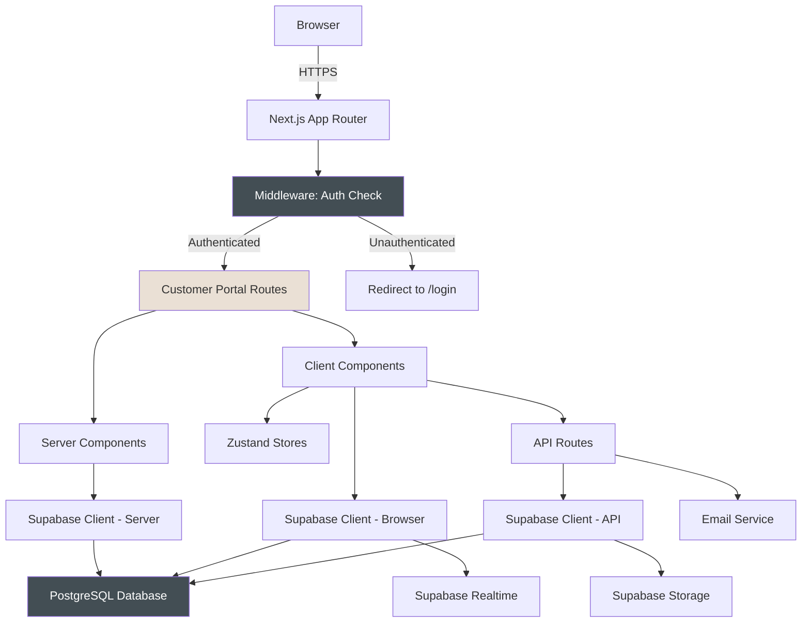
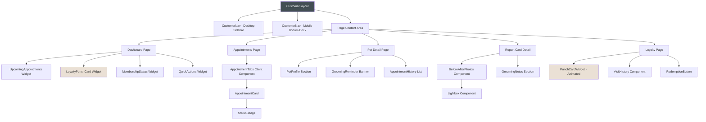
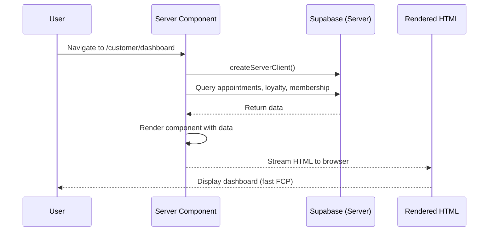
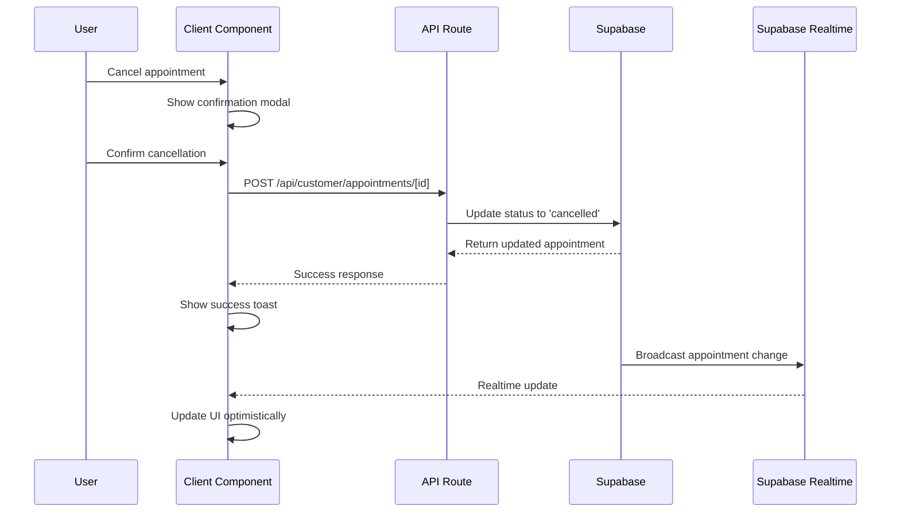

# Design Document - Phase 4: Customer Portal

## Executive Summary

This document provides the comprehensive technical design for The Puppy Day's Customer Portal, an authenticated web application that enables customers to manage their pets, appointments, loyalty rewards, memberships, and profile settings. The portal builds upon the completed Booking System (Phase 3) and integrates seamlessly with the existing authentication system established in Phase 1.

### Key Architectural Decisions

1. **Server Components First Architecture**: Leveraging Next.js 14+ App Router with Server Components for optimal performance, minimizing client-side JavaScript by rendering data-fetching components on the server
2. **Middleware-Based Route Protection**: Using Next.js middleware for authentication verification before rendering, providing security and performance benefits over client-side checks
3. **Responsive Navigation Pattern**: Desktop sidebar navigation with mobile bottom dock navigation using DaisyUI's Drawer component with responsive breakpoints
4. **Punch Card Loyalty System**: Implementing a "Buy X, Get 1 Free" loyalty model with animated paw stamp widgets and celebration states using Framer Motion
5. **Real-time Data Synchronization**: Supabase Realtime subscriptions for live appointment updates, report card notifications, and loyalty punch animations
6. **Optimistic UI Updates**: Client-side state optimism with server validation for smooth user experience during mutations

### Implementation Timeline

- **Week 1**: Authentication middleware, route structure, navigation components
- **Week 2**: Dashboard, appointments list/detail, cancellation flow
- **Week 3**: Pet management (list, detail, add, edit, photo upload)
- **Week 4**: Report cards viewing, loyalty punch card system
- **Week 5**: Profile management, membership display, notification preferences
- **Week 6**: Real-time subscriptions, animations, accessibility improvements, testing

### Business Value

- Reduce support call volume by 40% through self-service appointment management
- Increase customer retention with engaging loyalty punch card visualization
- Improve rebooking rate by 25% through streamlined "Book Again" flow
- Enhance customer satisfaction with transparent grooming history via report cards
- Build customer trust through real-time appointment status updates

---

## System Architecture

### High-Level Architecture



### Route Structure

```
app/
├── (customer)/                    # Route group with authentication
│   ├── layout.tsx                 # Customer portal layout with nav
│   ├── dashboard/
│   │   └── page.tsx               # Dashboard overview (Server Component)
│   ├── appointments/
│   │   ├── page.tsx               # List view with tabs (Server Component)
│   │   └── [id]/
│   │       └── page.tsx           # Detail view (Server Component)
│   ├── pets/
│   │   ├── page.tsx               # List view (Server Component)
│   │   ├── new/
│   │   │   └── page.tsx           # Add new pet form (Client Component)
│   │   └── [id]/
│   │       ├── page.tsx           # Detail view (Server Component)
│   │       └── edit/
│   │           └── page.tsx       # Edit form (Client Component)
│   ├── report-cards/
│   │   ├── page.tsx               # List view with thumbnails (Server Component)
│   │   └── [id]/
│   │       └── page.tsx           # Detail view with lightbox (Client Component)
│   ├── loyalty/
│   │   └── page.tsx               # Punch card detail + history (Client Component)
│   ├── membership/
│   │   └── page.tsx               # Membership status & usage (Server Component)
│   └── profile/
│       └── page.tsx               # Profile settings (Client Component)
├── api/
│   └── customer/
│       ├── dashboard/
│       │   └── route.ts           # Dashboard aggregated data
│       ├── appointments/
│       │   ├── route.ts           # List/create appointments
│       │   ├── [id]/
│       │   │   └── route.ts       # Get/update/cancel appointment
│       │   └── [id]/rebook/
│       │       └── route.ts       # Rebook appointment
│       ├── pets/
│       │   ├── route.ts           # List/create pets
│       │   ├── [id]/
│       │   │   └── route.ts       # Get/update/delete pet
│       │   └── upload-photo/
│       │       └── route.ts       # Upload pet photo to Supabase Storage
│       ├── report-cards/
│       │   ├── route.ts           # List report cards
│       │   └── [id]/
│       │       └── route.ts       # Get report card detail
│       ├── loyalty/
│       │   ├── route.ts           # Get loyalty status
│       │   ├── history/
│       │   │   └── route.ts       # Get visit history by cycle
│       │   └── redeem/
│       │       └── route.ts       # Mark redemption intent
│       ├── membership/
│       │   └── route.ts           # Get membership status & usage
│       └── profile/
│           ├── route.ts           # Update profile info
│           ├── password/
│           │   └── route.ts       # Change password
│           └── preferences/
│               └── route.ts       # Update notification preferences
└── middleware.ts                   # Global auth middleware
```

### Component Architecture



### Data Flow Patterns

#### Server Component Data Fetching (Preferred)



#### Client Component Mutation (Forms, Actions)



### Integration Points

#### Existing Systems
- **Booking System (Phase 3)**: "Book Again" flow pre-fills booking widget with appointment data
- **Authentication (Phase 1)**: Uses existing Supabase Auth session management
- **Database Schema (Phase 1)**: Leverages existing tables with new loyalty schema additions
- **Mock Services**: Full compatibility with `NEXT_PUBLIC_USE_MOCKS=true` development mode

#### External Services
- **Supabase Auth**: Session management, password changes, email verification
- **Supabase Storage**: Pet photo uploads with public bucket
- **Supabase Realtime**: Live appointment status updates, report card notifications, loyalty punches
- **Resend Email**: Appointment cancellation confirmations, profile change notifications
- **Twilio SMS**: Optional SMS notifications based on customer preferences

---

## Components and Interfaces

### Core Layout Components

#### CustomerLayout Component

**Location**: `src/app/(customer)/layout.tsx`

**Purpose**: Root layout for all customer portal pages, provides authentication context and responsive navigation.

**Implementation**:
```typescript
import { redirect } from 'next/navigation';
import { createServerClient } from '@/lib/supabase/server';
import CustomerNav from '@/components/customer/CustomerNav';

export default async function CustomerLayout({
  children,
}: {
  children: React.ReactNode;
}) {
  const supabase = createServerClient();
  const { data: { session } } = await supabase.auth.getSession();

  if (!session) {
    redirect('/login?returnUrl=/customer/dashboard');
  }

  // Verify customer role
  const { data: user } = await supabase
    .from('users')
    .select('role')
    .eq('id', session.user.id)
    .single();

  if (user?.role !== 'customer') {
    redirect('/403'); // Forbidden
  }

  return (
    <div className="min-h-screen bg-[#F8EEE5]">
      <CustomerNav user={session.user} />
      <main className="lg:ml-64 pb-20 lg:pb-0">
        <div className="max-w-7xl mx-auto px-4 sm:px-6 lg:px-8 py-8">
          {children}
        </div>
      </main>
    </div>
  );
}
```

**Key Responsibilities**:
- Server-side session verification before rendering any child pages
- Role-based access control (customer role only)
- Responsive layout with navigation
- Consistent background color and spacing

#### CustomerNav Component

**Location**: `src/components/customer/CustomerNav.tsx`

**Purpose**: Responsive navigation that switches between desktop sidebar and mobile bottom dock.

**Interface**:
```typescript
interface CustomerNavProps {
  user: {
    id: string;
    email: string;
  };
}

interface NavItem {
  label: string;
  href: string;
  icon: React.ComponentType<{ className?: string }>;
  badge?: number; // For notification counts
}
```

**Implementation Pattern**:
```typescript
'use client';

import { Home, Calendar, Dog, FileText, Gift, User } from 'lucide-react';
import Link from 'next/link';
import { usePathname } from 'next/navigation';
import { cn } from '@/lib/utils';

const navItems: NavItem[] = [
  { label: 'Dashboard', href: '/customer/dashboard', icon: Home },
  { label: 'Appointments', href: '/customer/appointments', icon: Calendar },
  { label: 'Pets', href: '/customer/pets', icon: Dog },
  { label: 'Report Cards', href: '/customer/report-cards', icon: FileText },
  { label: 'Loyalty', href: '/customer/loyalty', icon: Gift },
  { label: 'Profile', href: '/customer/profile', icon: User },
];

export default function CustomerNav({ user }: CustomerNavProps) {
  const pathname = usePathname();

  return (
    <>
      {/* Desktop Sidebar - hidden on mobile */}
      <aside className="hidden lg:fixed lg:inset-y-0 lg:flex lg:w-64 lg:flex-col">
        <div className="flex flex-col flex-grow bg-white border-r border-gray-200 shadow-sm">
          {/* Logo & User Info */}
          <div className="p-6 border-b border-gray-200">
            <h1 className="text-xl font-semibold text-[#434E54]">Puppy Day</h1>
            <p className="text-sm text-gray-600 mt-1">{user.email}</p>
          </div>

          {/* Navigation Links */}
          <nav className="flex-1 px-4 py-6 space-y-2">
            {navItems.map((item) => {
              const Icon = item.icon;
              const isActive = pathname.startsWith(item.href);

              return (
                <Link
                  key={item.href}
                  href={item.href}
                  className={cn(
                    'flex items-center gap-3 px-4 py-3 rounded-lg transition-colors',
                    isActive
                      ? 'bg-[#434E54] text-white'
                      : 'text-gray-700 hover:bg-gray-100'
                  )}
                >
                  <Icon className="w-5 h-5" />
                  <span className="font-medium">{item.label}</span>
                  {item.badge && (
                    <span className="ml-auto bg-red-500 text-white text-xs px-2 py-1 rounded-full">
                      {item.badge}
                    </span>
                  )}
                </Link>
              );
            })}
          </nav>
        </div>
      </aside>

      {/* Mobile Bottom Dock - shown only on mobile */}
      <nav className="lg:hidden fixed bottom-0 inset-x-0 bg-white border-t border-gray-200 shadow-lg z-50">
        <div className="flex justify-around items-center h-20 px-2">
          {navItems.map((item) => {
            const Icon = item.icon;
            const isActive = pathname.startsWith(item.href);

            return (
              <Link
                key={item.href}
                href={item.href}
                className={cn(
                  'flex flex-col items-center justify-center gap-1 px-3 py-2 rounded-lg min-w-[60px]',
                  isActive
                    ? 'text-[#434E54]'
                    : 'text-gray-500'
                )}
              >
                <Icon className={cn('w-6 h-6', isActive && 'stroke-[2.5]')} />
                <span className="text-xs font-medium">{item.label}</span>
                {item.badge && (
                  <span className="absolute top-1 right-1 bg-red-500 text-white text-xs w-4 h-4 rounded-full flex items-center justify-center">
                    {item.badge}
                  </span>
                )}
              </Link>
            );
          })}
        </div>
      </nav>
    </>
  );
}
```

**Responsive Behavior**:
- **Desktop (≥1024px)**: Fixed sidebar on left, 256px wide, with logo, user info, and vertical navigation
- **Mobile (<1024px)**: Bottom dock navigation with icons and labels, fixed to bottom of viewport
- **Active State**: Charcoal background (#434E54) for desktop, bolder icon stroke for mobile
- **Touch Targets**: Minimum 44px height for mobile accessibility

### Dashboard Components

#### Dashboard Page

**Location**: `src/app/(customer)/dashboard/page.tsx`

**Purpose**: Overview page showing upcoming appointments, loyalty progress, membership status, and quick actions.

**Implementation**:
```typescript
import { createServerClient } from '@/lib/supabase/server';
import UpcomingAppointments from '@/components/customer/dashboard/UpcomingAppointments';
import LoyaltyPunchCard from '@/components/customer/loyalty/LoyaltyPunchCard';
import MembershipStatus from '@/components/customer/dashboard/MembershipStatus';
import QuickActions from '@/components/customer/dashboard/QuickActions';

export default async function DashboardPage() {
  const supabase = createServerClient();
  const { data: { user } } = await supabase.auth.getUser();

  // Parallel data fetching
  const [appointments, loyalty, membership] = await Promise.all([
    supabase
      .from('appointments')
      .select('*, pet:pets(*), service:services(*)')
      .eq('customer_id', user!.id)
      .gte('scheduled_at', new Date().toISOString())
      .order('scheduled_at', { ascending: true })
      .limit(3),

    supabase
      .from('customer_loyalty')
      .select('*, punches:loyalty_punches(*)')
      .eq('customer_id', user!.id)
      .single(),

    supabase
      .from('customer_memberships')
      .select('*, membership:memberships(*)')
      .eq('customer_id', user!.id)
      .eq('status', 'active')
      .single(),
  ]);

  return (
    <div className="space-y-6">
      <h1 className="text-3xl font-bold text-[#434E54]">Dashboard</h1>

      <div className="grid grid-cols-1 lg:grid-cols-3 gap-6">
        {/* Loyalty Punch Card - Featured */}
        <div className="lg:col-span-2">
          <LoyaltyPunchCard loyalty={loyalty.data} />
        </div>

        {/* Quick Actions */}
        <div>
          <QuickActions />
        </div>
      </div>

      {/* Upcoming Appointments */}
      <UpcomingAppointments appointments={appointments.data || []} />

      {/* Membership Status (if active) */}
      {membership.data && (
        <MembershipStatus membership={membership.data} />
      )}
    </div>
  );
}
```

**Key Features**:
- Server Component for fast initial load
- Parallel data fetching with Promise.all
- Responsive grid layout
- Conditional membership display
- Real-time updates via client component subscriptions

#### LoyaltyPunchCard Widget

**Location**: `src/components/customer/loyalty/LoyaltyPunchCard.tsx`

**Purpose**: Animated punch card visualization with paw stamps showing progress toward free wash.

**Interface**:
```typescript
interface LoyaltyPunchCardProps {
  loyalty: {
    customer_id: string;
    current_punches: number;
    threshold: number; // Default 9, or custom per customer
    free_washes_earned: number;
    free_washes_redeemed: number;
    total_visits: number;
    punches: LoyaltyPunch[];
  } | null;
}

interface LoyaltyPunch {
  id: string;
  customer_id: string;
  appointment_id: string;
  earned_at: string;
  cycle_number: number;
}
```

**Implementation**:
```typescript
'use client';

import { motion, AnimatePresence } from 'framer-motion';
import { useEffect, useState } from 'react';
import { createClient } from '@/lib/supabase/client';
import Confetti from 'react-confetti-explosion';
import { Paw } from 'lucide-react';
import Link from 'next/link';

export default function LoyaltyPunchCard({ loyalty }: LoyaltyPunchCardProps) {
  const [showConfetti, setShowConfetti] = useState(false);
  const supabase = createClient();

  // Default values if no loyalty record exists yet
  const currentPunches = loyalty?.current_punches || 0;
  const threshold = loyalty?.threshold || 9;
  const unredeemed = (loyalty?.free_washes_earned || 0) - (loyalty?.free_washes_redeemed || 0);
  const hasEarnedFree = unredeemed > 0;
  const isCloseToGoal = currentPunches >= threshold - 2 && currentPunches < threshold;

  // Real-time subscription for new punches
  useEffect(() => {
    if (!loyalty?.customer_id) return;

    const channel = supabase
      .channel('loyalty_punches')
      .on(
        'postgres_changes',
        {
          event: 'INSERT',
          schema: 'public',
          table: 'loyalty_punches',
          filter: `customer_id=eq.${loyalty.customer_id}`,
        },
        (payload) => {
          // New punch earned - trigger celebration if threshold reached
          const newPunch = payload.new as LoyaltyPunch;
          if (currentPunches + 1 >= threshold) {
            setShowConfetti(true);
            setTimeout(() => setShowConfetti(false), 5000);
          }
        }
      )
      .subscribe();

    return () => {
      supabase.removeChannel(channel);
    };
  }, [loyalty?.customer_id, currentPunches, threshold]);

  // Calculate paw stamps to display
  const totalStamps = threshold;
  const filledStamps = hasEarnedFree ? threshold : currentPunches;

  return (
    <div className="bg-white rounded-xl shadow-md p-6 relative overflow-hidden">
      {/* Confetti celebration */}
      <AnimatePresence>
        {showConfetti && (
          <div className="absolute inset-0 flex items-center justify-center z-10 pointer-events-none">
            <Confetti
              particleCount={100}
              duration={3000}
              colors={['#434E54', '#EAE0D5', '#F8EEE5', '#FFD700']}
            />
          </div>
        )}
      </AnimatePresence>

      {/* Header */}
      <div className="flex items-center justify-between mb-6">
        <div>
          <h2 className="text-2xl font-bold text-[#434E54]">Loyalty Punch Card</h2>
          <p className="text-sm text-gray-600 mt-1">
            {hasEarnedFree
              ? '🎉 FREE WASH EARNED!'
              : isCloseToGoal
              ? `Almost there! Just ${threshold - currentPunches} more visit${threshold - currentPunches > 1 ? 's' : ''}!`
              : `${currentPunches} of ${threshold} paws collected 🐾`}
          </p>
        </div>
        {hasEarnedFree && (
          <Link
            href="/book?freeWash=true"
            className="btn btn-primary bg-[#434E54] hover:bg-[#363F44] border-none text-white"
          >
            Redeem Free Wash
          </Link>
        )}
      </div>

      {/* Paw Stamps Grid */}
      <div className="grid grid-cols-5 gap-4 mb-4">
        {Array.from({ length: totalStamps }).map((_, index) => {
          const isFilled = index < filledStamps;
          const punch = loyalty?.punches?.[index];

          return (
            <motion.div
              key={index}
              initial={{ scale: 0, rotate: -180 }}
              animate={{ scale: 1, rotate: 0 }}
              transition={{
                type: 'spring',
                stiffness: 260,
                damping: 20,
                delay: index * 0.1,
              }}
              whileHover={{ scale: 1.1, rotate: 5 }}
              className="relative group"
            >
              <Paw
                className={`w-12 h-12 transition-colors ${
                  isFilled
                    ? 'fill-[#434E54] text-[#434E54]'
                    : 'fill-none text-gray-300 stroke-2'
                }`}
              />
              {isFilled && punch && (
                <div className="absolute bottom-full left-1/2 -translate-x-1/2 mb-2 px-2 py-1 bg-gray-900 text-white text-xs rounded opacity-0 group-hover:opacity-100 transition-opacity whitespace-nowrap">
                  {new Date(punch.earned_at).toLocaleDateString()}
                </div>
              )}
            </motion.div>
          );
        })}
      </div>

      {/* Progress Bar */}
      <div className="relative h-3 bg-gray-200 rounded-full overflow-hidden">
        <motion.div
          className="absolute inset-y-0 left-0 bg-[#434E54] rounded-full"
          initial={{ width: 0 }}
          animate={{ width: `${(filledStamps / totalStamps) * 100}%` }}
          transition={{ duration: 0.8, ease: 'easeOut' }}
        />
      </div>

      {/* Footer Link */}
      <div className="mt-4 text-center">
        <Link
          href="/customer/loyalty"
          className="text-sm text-[#434E54] hover:underline"
        >
          View full history →
        </Link>
      </div>
    </div>
  );
}
```

**Animation Details**:
- **Paw Stamps**: Spring animation with staggered delays (100ms each)
- **Hover Effect**: Scale up and slight rotation on hover
- **Tooltip**: Show earned date on hover for filled stamps
- **Confetti**: Triggered when threshold reached via Realtime subscription
- **Progress Bar**: Smooth width animation with easeOut timing

**States**:
1. **Empty/In Progress**: Gray outline paws, progress text
2. **Close to Goal**: Encouraging message when within 2 visits
3. **Free Wash Earned**: Confetti, celebration message, "Redeem" button
4. **Redeemed**: Reset to 0, new cycle begins

### Appointment Components

#### AppointmentsList Page

**Location**: `src/app/(customer)/appointments/page.tsx`

**Purpose**: List all appointments with Upcoming/History tabs and status filtering.

**Implementation**:
```typescript
import { createServerClient } from '@/lib/supabase/server';
import AppointmentTabs from '@/components/customer/appointments/AppointmentTabs';

export default async function AppointmentsPage() {
  const supabase = createServerClient();
  const { data: { user } } = await supabase.auth.getUser();

  const { data: appointments } = await supabase
    .from('appointments')
    .select(`
      *,
      pet:pets(*),
      service:services(*),
      addons:appointment_addons(*, addon:addons(*))
    `)
    .eq('customer_id', user!.id)
    .order('scheduled_at', { ascending: false });

  // Split into upcoming and history
  const now = new Date();
  const upcoming = appointments?.filter(
    (apt) => new Date(apt.scheduled_at) >= now && apt.status !== 'cancelled'
  ) || [];
  const history = appointments?.filter(
    (apt) => new Date(apt.scheduled_at) < now || apt.status === 'cancelled'
  ) || [];

  return (
    <div>
      <h1 className="text-3xl font-bold text-[#434E54] mb-6">Appointments</h1>
      <AppointmentTabs upcoming={upcoming} history={history} />
    </div>
  );
}
```

#### AppointmentTabs Component

**Location**: `src/components/customer/appointments/AppointmentTabs.tsx`

**Interface**:
```typescript
interface AppointmentTabsProps {
  upcoming: Appointment[];
  history: Appointment[];
}
```

**Implementation** (Client Component with DaisyUI tabs):
```typescript
'use client';

import { useState } from 'react';
import AppointmentCard from './AppointmentCard';
import EmptyState from '@/components/ui/EmptyState';

export default function AppointmentTabs({ upcoming, history }: AppointmentTabsProps) {
  const [activeTab, setActiveTab] = useState<'upcoming' | 'history'>('upcoming');

  const appointments = activeTab === 'upcoming' ? upcoming : history;

  return (
    <div>
      {/* DaisyUI Tabs */}
      <div className="tabs tabs-boxed mb-6 bg-white">
        <button
          className={`tab ${activeTab === 'upcoming' ? 'tab-active' : ''}`}
          onClick={() => setActiveTab('upcoming')}
        >
          Upcoming ({upcoming.length})
        </button>
        <button
          className={`tab ${activeTab === 'history' ? 'tab-active' : ''}`}
          onClick={() => setActiveTab('history')}
        >
          History ({history.length})
        </button>
      </div>

      {/* Appointments List */}
      {appointments.length === 0 ? (
        <EmptyState
          icon="calendar"
          title={activeTab === 'upcoming' ? 'No upcoming appointments' : 'No appointment history'}
          description={
            activeTab === 'upcoming'
              ? 'Book your first grooming appointment to get started!'
              : 'Your completed appointments will appear here.'
          }
          actionLabel={activeTab === 'upcoming' ? 'Book Appointment' : undefined}
          actionHref={activeTab === 'upcoming' ? '/book' : undefined}
        />
      ) : (
        <div className="space-y-4">
          {appointments.map((appointment) => (
            <AppointmentCard key={appointment.id} appointment={appointment} />
          ))}
        </div>
      )}
    </div>
  );
}
```

#### AppointmentCard Component

**Location**: `src/components/customer/appointments/AppointmentCard.tsx`

**Interface**:
```typescript
interface AppointmentCardProps {
  appointment: Appointment;
}
```

**Implementation**:
```typescript
'use client';

import Link from 'next/link';
import Image from 'next/image';
import { Calendar, Clock, DollarSign } from 'lucide-react';
import { format } from 'date-fns';
import StatusBadge from '@/components/ui/StatusBadge';

export default function AppointmentCard({ appointment }: AppointmentCardProps) {
  const scheduledDate = new Date(appointment.scheduled_at);
  const canCancel = scheduledDate > new Date(Date.now() + 24 * 60 * 60 * 1000);

  return (
    <Link
      href={`/customer/appointments/${appointment.id}`}
      className="block bg-white rounded-lg shadow-sm hover:shadow-md transition-shadow p-6"
    >
      <div className="flex items-start gap-4">
        {/* Pet Photo */}
        <div className="relative w-16 h-16 rounded-full overflow-hidden flex-shrink-0 bg-gray-200">
          {appointment.pet?.photo_url ? (
            <Image
              src={appointment.pet.photo_url}
              alt={appointment.pet.name}
              fill
              className="object-cover"
            />
          ) : (
            <div className="w-full h-full flex items-center justify-center text-2xl">
              🐕
            </div>
          )}
        </div>

        {/* Appointment Info */}
        <div className="flex-1 min-w-0">
          <div className="flex items-start justify-between mb-2">
            <div>
              <h3 className="text-lg font-semibold text-[#434E54]">
                {appointment.pet?.name} - {appointment.service?.name}
              </h3>
              <p className="text-sm text-gray-600">
                {appointment.pet?.breed_custom || 'Unknown breed'}
              </p>
            </div>
            <StatusBadge status={appointment.status} />
          </div>

          <div className="flex flex-wrap gap-4 text-sm text-gray-600">
            <div className="flex items-center gap-1">
              <Calendar className="w-4 h-4" />
              <span>{format(scheduledDate, 'MMM d, yyyy')}</span>
            </div>
            <div className="flex items-center gap-1">
              <Clock className="w-4 h-4" />
              <span>{format(scheduledDate, 'h:mm a')}</span>
            </div>
            <div className="flex items-center gap-1">
              <DollarSign className="w-4 h-4" />
              <span>${appointment.total_price.toFixed(2)}</span>
            </div>
          </div>
        </div>
      </div>
    </Link>
  );
}
```

#### AppointmentDetail Page

**Location**: `src/app/(customer)/appointments/[id]/page.tsx`

**Implementation**:
```typescript
import { createServerClient } from '@/lib/supabase/server';
import { notFound } from 'next/navigation';
import AppointmentDetailClient from '@/components/customer/appointments/AppointmentDetailClient';

export default async function AppointmentDetailPage({
  params,
}: {
  params: { id: string };
}) {
  const supabase = createServerClient();
  const { data: { user } } = await supabase.auth.getUser();

  const { data: appointment } = await supabase
    .from('appointments')
    .select(`
      *,
      pet:pets(*),
      service:services(*),
      addons:appointment_addons(*, addon:addons(*)),
      report_card:report_cards(*)
    `)
    .eq('id', params.id)
    .eq('customer_id', user!.id)
    .single();

  if (!appointment) {
    notFound();
  }

  return <AppointmentDetailClient appointment={appointment} />;
}
```

**AppointmentDetailClient** handles cancellation modal, rebook action, and real-time status updates.

### Pet Management Components

#### PetForm Component

**Location**: `src/components/customer/pets/PetForm.tsx`

**Purpose**: Reusable form for adding/editing pets with photo upload.

**Interface**:
```typescript
interface PetFormProps {
  mode: 'create' | 'edit';
  initialData?: Pet;
  onSuccess?: (pet: Pet) => void;
}

interface PetFormData {
  name: string;
  breed_id: string | null;
  breed_custom: string;
  size: PetSize;
  weight: number | null;
  birth_date: string | null;
  notes: string;
  medical_info: string;
  photo?: File;
}
```

**Implementation** (using React Hook Form + Zod):
```typescript
'use client';

import { useForm } from 'react-hook-form';
import { zodResolver } from '@hookform/resolvers/zod';
import { z } from 'zod';
import { useState } from 'react';
import { Upload } from 'lucide-react';
import Image from 'next/image';
import { useRouter } from 'next/navigation';
import { toast } from '@/hooks/use-toast';

const petSchema = z.object({
  name: z.string().min(1, 'Name is required').max(50),
  size: z.enum(['small', 'medium', 'large', 'xlarge']),
  breed_id: z.string().uuid().optional(),
  breed_custom: z.string().max(100).optional(),
  weight: z.number().positive().optional(),
  birth_date: z.string().optional(),
  notes: z.string().max(500).optional(),
  medical_info: z.string().max(500).optional(),
});

export default function PetForm({ mode, initialData, onSuccess }: PetFormProps) {
  const [photoPreview, setPhotoPreview] = useState<string | null>(
    initialData?.photo_url || null
  );
  const [photoFile, setPhotoFile] = useState<File | null>(null);
  const [isLoading, setIsLoading] = useState(false);
  const router = useRouter();

  const {
    register,
    handleSubmit,
    formState: { errors },
  } = useForm<PetFormData>({
    resolver: zodResolver(petSchema),
    defaultValues: initialData || {},
  });

  const handlePhotoChange = (e: React.ChangeEvent<HTMLInputElement>) => {
    const file = e.target.files?.[0];
    if (file) {
      // Validate file type and size
      if (!file.type.startsWith('image/')) {
        toast({ title: 'Error', description: 'Please select an image file' });
        return;
      }
      if (file.size > 5 * 1024 * 1024) {
        toast({ title: 'Error', description: 'Image must be less than 5MB' });
        return;
      }

      setPhotoFile(file);
      setPhotoPreview(URL.createObjectURL(file));
    }
  };

  const onSubmit = async (data: PetFormData) => {
    setIsLoading(true);

    try {
      let photoUrl = initialData?.photo_url;

      // Upload photo if selected
      if (photoFile) {
        const formData = new FormData();
        formData.append('photo', photoFile);

        const uploadRes = await fetch('/api/customer/pets/upload-photo', {
          method: 'POST',
          body: formData,
        });

        if (!uploadRes.ok) throw new Error('Photo upload failed');

        const { url } = await uploadRes.json();
        photoUrl = url;
      }

      // Create or update pet
      const endpoint = mode === 'create'
        ? '/api/customer/pets'
        : `/api/customer/pets/${initialData?.id}`;

      const res = await fetch(endpoint, {
        method: mode === 'create' ? 'POST' : 'PUT',
        headers: { 'Content-Type': 'application/json' },
        body: JSON.stringify({ ...data, photo_url: photoUrl }),
      });

      if (!res.ok) throw new Error('Failed to save pet');

      const pet = await res.json();

      toast({
        title: 'Success',
        description: mode === 'create' ? 'Pet added successfully!' : 'Pet updated successfully!',
      });

      if (onSuccess) {
        onSuccess(pet);
      } else {
        router.push(`/customer/pets/${pet.id}`);
      }
    } catch (error) {
      toast({
        title: 'Error',
        description: error instanceof Error ? error.message : 'Something went wrong',
      });
    } finally {
      setIsLoading(false);
    }
  };

  return (
    <form onSubmit={handleSubmit(onSubmit)} className="space-y-6">
      {/* Photo Upload */}
      <div>
        <label className="block text-sm font-medium text-gray-700 mb-2">
          Pet Photo
        </label>
        <div className="flex items-center gap-4">
          <div className="relative w-24 h-24 rounded-full overflow-hidden bg-gray-200">
            {photoPreview ? (
              <Image src={photoPreview} alt="Preview" fill className="object-cover" />
            ) : (
              <div className="w-full h-full flex items-center justify-center text-3xl">
                🐕
              </div>
            )}
          </div>
          <label className="btn btn-outline cursor-pointer">
            <Upload className="w-4 h-4 mr-2" />
            Choose Photo
            <input
              type="file"
              accept="image/*"
              onChange={handlePhotoChange}
              className="hidden"
            />
          </label>
        </div>
      </div>

      {/* Name */}
      <div className="form-control">
        <label className="label">
          <span className="label-text">Pet Name *</span>
        </label>
        <input
          {...register('name')}
          type="text"
          placeholder="e.g., Buddy"
          className="input input-bordered"
        />
        {errors.name && (
          <label className="label">
            <span className="label-text-alt text-error">{errors.name.message}</span>
          </label>
        )}
      </div>

      {/* Size (required for pricing) */}
      <div className="form-control">
        <label className="label">
          <span className="label-text">Size *</span>
        </label>
        <select {...register('size')} className="select select-bordered">
          <option value="">Select size</option>
          <option value="small">Small (0-18 lbs)</option>
          <option value="medium">Medium (19-35 lbs)</option>
          <option value="large">Large (36-65 lbs)</option>
          <option value="xlarge">X-Large (66+ lbs)</option>
        </select>
        {errors.size && (
          <label className="label">
            <span className="label-text-alt text-error">{errors.size.message}</span>
          </label>
        )}
      </div>

      {/* Weight, Breed, Birth Date, Notes, Medical Info - similar pattern */}
      {/* ... */}

      {/* Submit Button */}
      <div className="flex gap-4">
        <button
          type="submit"
          disabled={isLoading}
          className="btn btn-primary flex-1"
        >
          {isLoading ? (
            <span className="loading loading-spinner"></span>
          ) : (
            mode === 'create' ? 'Add Pet' : 'Save Changes'
          )}
        </button>
        <button
          type="button"
          onClick={() => router.back()}
          className="btn btn-ghost"
        >
          Cancel
        </button>
      </div>
    </form>
  );
}
```

**Photo Upload Flow**:
1. User selects image file
2. Client-side validation (type, size)
3. Preview shown immediately
4. On form submit, upload to `/api/customer/pets/upload-photo`
5. API route uploads to Supabase Storage public bucket
6. Returns public URL
7. URL saved with pet record

### Report Card Components

#### ReportCardDetail Page

**Location**: `src/app/(customer)/report-cards/[id]/page.tsx`

**Implementation**:
```typescript
import { createServerClient } from '@/lib/supabase/server';
import { notFound } from 'next/navigation';
import BeforeAfterPhotos from '@/components/customer/report-cards/BeforeAfterPhotos';
import GroomingNotes from '@/components/customer/report-cards/GroomingNotes';
import { format } from 'date-fns';

export default async function ReportCardDetailPage({
  params,
}: {
  params: { id: string };
}) {
  const supabase = createServerClient();
  const { data: { user } } = await supabase.auth.getUser();

  const { data: reportCard } = await supabase
    .from('report_cards')
    .select(`
      *,
      appointment:appointments(
        *,
        pet:pets(*),
        service:services(*),
        customer:users(*)
      )
    `)
    .eq('id', params.id)
    .eq('appointment.customer_id', user!.id)
    .single();

  if (!reportCard) {
    notFound();
  }

  return (
    <div className="max-w-4xl mx-auto">
      <div className="mb-6">
        <h1 className="text-3xl font-bold text-[#434E54] mb-2">
          Report Card: {reportCard.appointment.pet.name}
        </h1>
        <p className="text-gray-600">
          {reportCard.appointment.service.name} on{' '}
          {format(new Date(reportCard.appointment.scheduled_at), 'MMMM d, yyyy')}
        </p>
      </div>

      {/* Before/After Photos */}
      <BeforeAfterPhotos
        beforeUrl={reportCard.before_photo_url}
        afterUrl={reportCard.after_photo_url}
        petName={reportCard.appointment.pet.name}
      />

      {/* Grooming Details */}
      <div className="grid grid-cols-1 md:grid-cols-3 gap-6 my-8">
        <div className="bg-white rounded-lg shadow-sm p-6">
          <h3 className="text-sm font-medium text-gray-600 mb-2">Mood</h3>
          <p className="text-lg font-semibold text-[#434E54] capitalize">
            {reportCard.mood || 'N/A'}
          </p>
        </div>
        <div className="bg-white rounded-lg shadow-sm p-6">
          <h3 className="text-sm font-medium text-gray-600 mb-2">Coat Condition</h3>
          <p className="text-lg font-semibold text-[#434E54] capitalize">
            {reportCard.coat_condition?.replace('_', ' ') || 'N/A'}
          </p>
        </div>
        <div className="bg-white rounded-lg shadow-sm p-6">
          <h3 className="text-sm font-medium text-gray-600 mb-2">Behavior</h3>
          <p className="text-lg font-semibold text-[#434E54] capitalize">
            {reportCard.behavior?.replace('_', ' ') || 'N/A'}
          </p>
        </div>
      </div>

      {/* Grooming Notes */}
      <GroomingNotes
        notes={reportCard.groomer_notes}
        healthObservations={reportCard.health_observations}
      />

      {/* Actions */}
      <div className="flex gap-4 mt-8">
        <Link
          href={`/book?rebookAppointment=${reportCard.appointment.id}`}
          className="btn btn-primary"
        >
          Book Again
        </Link>
        {!reportCard.rating && (
          <Link
            href={`/customer/report-cards/${reportCard.id}/review`}
            className="btn btn-outline"
          >
            Leave Review
          </Link>
        )}
      </div>
    </div>
  );
}
```

#### BeforeAfterPhotos Component (with Lightbox)

**Location**: `src/components/customer/report-cards/BeforeAfterPhotos.tsx`

**Implementation**:
```typescript
'use client';

import { useState } from 'react';
import Image from 'next/image';
import Lightbox from 'yet-another-react-lightbox';
import 'yet-another-react-lightbox/styles.css';
import Zoom from 'yet-another-react-lightbox/plugins/zoom';

interface BeforeAfterPhotosProps {
  beforeUrl: string | null;
  afterUrl: string | null;
  petName: string;
}

export default function BeforeAfterPhotos({
  beforeUrl,
  afterUrl,
  petName,
}: BeforeAfterPhotosProps) {
  const [lightboxOpen, setLightboxOpen] = useState(false);
  const [lightboxIndex, setLightboxIndex] = useState(0);

  const slides = [
    beforeUrl && { src: beforeUrl, alt: `${petName} before grooming` },
    afterUrl && { src: afterUrl, alt: `${petName} after grooming` },
  ].filter(Boolean);

  const openLightbox = (index: number) => {
    setLightboxIndex(index);
    setLightboxOpen(true);
  };

  return (
    <>
      <div className="grid grid-cols-1 md:grid-cols-2 gap-6">
        {/* Before Photo */}
        {beforeUrl && (
          <div>
            <h3 className="text-lg font-semibold text-[#434E54] mb-3">Before</h3>
            <div
              className="relative aspect-square rounded-lg overflow-hidden bg-gray-200 cursor-pointer hover:opacity-90 transition-opacity"
              onClick={() => openLightbox(0)}
            >
              <Image
                src={beforeUrl}
                alt={`${petName} before grooming`}
                fill
                className="object-cover"
                sizes="(max-width: 768px) 100vw, 50vw"
              />
            </div>
          </div>
        )}

        {/* After Photo */}
        {afterUrl && (
          <div>
            <h3 className="text-lg font-semibold text-[#434E54] mb-3">After</h3>
            <div
              className="relative aspect-square rounded-lg overflow-hidden bg-gray-200 cursor-pointer hover:opacity-90 transition-opacity"
              onClick={() => openLightbox(beforeUrl ? 1 : 0)}
            >
              <Image
                src={afterUrl}
                alt={`${petName} after grooming`}
                fill
                className="object-cover"
                sizes="(max-width: 768px) 100vw, 50vw"
              />
            </div>
          </div>
        )}
      </div>

      {/* Lightbox */}
      <Lightbox
        open={lightboxOpen}
        close={() => setLightboxOpen(false)}
        slides={slides}
        index={lightboxIndex}
        plugins={[Zoom]}
        zoom={{
          maxZoomPixelRatio: 3,
          scrollToZoom: true,
        }}
      />
    </>
  );
}
```

**Key Features**:
- Next.js Image component for automatic optimization
- Click to open full-screen lightbox
- Zoom plugin for close inspection
- Responsive grid (stacked on mobile, side-by-side on desktop)
- Smooth transitions and hover effects

### Shared UI Components

#### EmptyState Component

**Location**: `src/components/ui/EmptyState.tsx`

**Interface**:
```typescript
interface EmptyStateProps {
  icon: 'calendar' | 'dog' | 'file' | 'gift';
  title: string;
  description: string;
  actionLabel?: string;
  actionHref?: string;
}
```

**Implementation**:
```typescript
import Link from 'next/link';
import { Calendar, Dog, FileText, Gift } from 'lucide-react';

const iconMap = {
  calendar: Calendar,
  dog: Dog,
  file: FileText,
  gift: Gift,
};

export default function EmptyState({
  icon,
  title,
  description,
  actionLabel,
  actionHref,
}: EmptyStateProps) {
  const Icon = iconMap[icon];

  return (
    <div className="bg-white rounded-lg shadow-sm p-12 text-center">
      <div className="inline-flex items-center justify-center w-16 h-16 rounded-full bg-gray-100 mb-4">
        <Icon className="w-8 h-8 text-gray-400" />
      </div>
      <h3 className="text-lg font-semibold text-[#434E54] mb-2">{title}</h3>
      <p className="text-gray-600 mb-6 max-w-md mx-auto">{description}</p>
      {actionLabel && actionHref && (
        <Link href={actionHref} className="btn btn-primary">
          {actionLabel}
        </Link>
      )}
    </div>
  );
}
```

#### StatusBadge Component

**Location**: `src/components/ui/StatusBadge.tsx`

**Implementation**:
```typescript
interface StatusBadgeProps {
  status: AppointmentStatus;
}

const statusConfig: Record<AppointmentStatus, { label: string; className: string }> = {
  pending: { label: 'Pending', className: 'badge-warning' },
  confirmed: { label: 'Confirmed', className: 'badge-success' },
  checked_in: { label: 'Checked In', className: 'badge-info' },
  in_progress: { label: 'In Progress', className: 'badge-info' },
  ready: { label: 'Ready', className: 'badge-success' },
  completed: { label: 'Completed', className: 'badge-primary' },
  cancelled: { label: 'Cancelled', className: 'badge-ghost' },
  no_show: { label: 'No Show', className: 'badge-error' },
};

export default function StatusBadge({ status }: StatusBadgeProps) {
  const config = statusConfig[status];

  return (
    <span className={`badge ${config.className}`}>
      {config.label}
    </span>
  );
}
```

#### ConfirmationModal Component

**Location**: `src/components/ui/ConfirmationModal.tsx`

**Interface**:
```typescript
interface ConfirmationModalProps {
  isOpen: boolean;
  onClose: () => void;
  onConfirm: () => void;
  title: string;
  description: string;
  confirmLabel?: string;
  confirmButtonClass?: string;
  isLoading?: boolean;
}
```

**Implementation** (using DaisyUI modal):
```typescript
'use client';

export default function ConfirmationModal({
  isOpen,
  onClose,
  onConfirm,
  title,
  description,
  confirmLabel = 'Confirm',
  confirmButtonClass = 'btn-error',
  isLoading = false,
}: ConfirmationModalProps) {
  if (!isOpen) return null;

  return (
    <div className="modal modal-open">
      <div className="modal-box">
        <h3 className="font-bold text-lg mb-4">{title}</h3>
        <p className="text-gray-600 mb-6">{description}</p>
        <div className="modal-action">
          <button
            onClick={onClose}
            disabled={isLoading}
            className="btn btn-ghost"
          >
            Cancel
          </button>
          <button
            onClick={onConfirm}
            disabled={isLoading}
            className={`btn ${confirmButtonClass}`}
          >
            {isLoading ? (
              <span className="loading loading-spinner"></span>
            ) : (
              confirmLabel
            )}
          </button>
        </div>
      </div>
      <div className="modal-backdrop" onClick={onClose}></div>
    </div>
  );
}
```

---

## Data Models

### Database Schema Extensions

#### New Loyalty Tables

The existing `loyalty_points` and `loyalty_transactions` tables need to be replaced with a punch card system:

```sql
-- Drop old loyalty tables (if migrating)
DROP TABLE IF EXISTS loyalty_transactions;
DROP TABLE IF EXISTS loyalty_points;

-- Loyalty settings (global defaults)
CREATE TABLE loyalty_settings (
  id UUID PRIMARY KEY DEFAULT uuid_generate_v4(),
  default_threshold INTEGER NOT NULL DEFAULT 9,
  program_name TEXT DEFAULT 'Loyalty Punch Card',
  description TEXT,
  updated_at TIMESTAMPTZ DEFAULT NOW()
);

-- Customer loyalty tracking
CREATE TABLE customer_loyalty (
  id UUID PRIMARY KEY DEFAULT uuid_generate_v4(),
  customer_id UUID UNIQUE NOT NULL REFERENCES users(id) ON DELETE CASCADE,
  current_punches INTEGER DEFAULT 0 CHECK (current_punches >= 0),
  threshold INTEGER DEFAULT 9 CHECK (threshold > 0),
  free_washes_earned INTEGER DEFAULT 0,
  free_washes_redeemed INTEGER DEFAULT 0,
  total_visits INTEGER DEFAULT 0,
  created_at TIMESTAMPTZ DEFAULT NOW(),
  updated_at TIMESTAMPTZ DEFAULT NOW()
);

-- Individual punch records
CREATE TABLE loyalty_punches (
  id UUID PRIMARY KEY DEFAULT uuid_generate_v4(),
  customer_id UUID NOT NULL REFERENCES users(id) ON DELETE CASCADE,
  appointment_id UUID NOT NULL REFERENCES appointments(id) ON DELETE CASCADE,
  earned_at TIMESTAMPTZ DEFAULT NOW(),
  cycle_number INTEGER NOT NULL DEFAULT 1,
  UNIQUE(appointment_id)
);

-- Redemption records
CREATE TABLE loyalty_redemptions (
  id UUID PRIMARY KEY DEFAULT uuid_generate_v4(),
  customer_id UUID NOT NULL REFERENCES users(id) ON DELETE CASCADE,
  appointment_id UUID NOT NULL REFERENCES appointments(id),
  redeemed_at TIMESTAMPTZ DEFAULT NOW(),
  cycle_number INTEGER NOT NULL
);

-- Indexes
CREATE INDEX idx_customer_loyalty_customer ON customer_loyalty(customer_id);
CREATE INDEX idx_loyalty_punches_customer ON loyalty_punches(customer_id);
CREATE INDEX idx_loyalty_punches_appointment ON loyalty_punches(appointment_id);
CREATE INDEX idx_loyalty_redemptions_customer ON loyalty_redemptions(customer_id);

-- Updated_at trigger
CREATE TRIGGER customer_loyalty_updated_at BEFORE UPDATE ON customer_loyalty
  FOR EACH ROW EXECUTE FUNCTION update_updated_at();

-- Function to award punch after completed appointment
CREATE OR REPLACE FUNCTION award_loyalty_punch()
RETURNS TRIGGER AS $$
DECLARE
  customer_loyalty_rec RECORD;
  current_cycle INTEGER;
BEGIN
  -- Only award punch when appointment is completed (not cancelled/no-show)
  IF NEW.status = 'completed' AND OLD.status != 'completed' THEN
    -- Get or create customer loyalty record
    INSERT INTO customer_loyalty (customer_id)
    VALUES (NEW.customer_id)
    ON CONFLICT (customer_id) DO NOTHING;

    SELECT * INTO customer_loyalty_rec
    FROM customer_loyalty
    WHERE customer_id = NEW.customer_id;

    -- Calculate current cycle
    current_cycle := FLOOR(customer_loyalty_rec.total_visits / customer_loyalty_rec.threshold) + 1;

    -- Insert punch record
    INSERT INTO loyalty_punches (customer_id, appointment_id, cycle_number)
    VALUES (NEW.customer_id, NEW.id, current_cycle);

    -- Update customer loyalty
    UPDATE customer_loyalty
    SET
      total_visits = total_visits + 1,
      current_punches = current_punches + 1,
      free_washes_earned = CASE
        WHEN current_punches + 1 >= threshold THEN free_washes_earned + 1
        ELSE free_washes_earned
      END,
      current_punches = CASE
        WHEN current_punches + 1 >= threshold THEN 0
        ELSE current_punches + 1
      END
    WHERE customer_id = NEW.customer_id;
  END IF;

  RETURN NEW;
END;
$$ LANGUAGE plpgsql;

CREATE TRIGGER award_loyalty_punch_trigger
AFTER UPDATE ON appointments
FOR EACH ROW
EXECUTE FUNCTION award_loyalty_punch();
```

#### User Preferences Extension

Update the `users` table preferences JSONB field to include notification settings:

```typescript
interface UserPreferences {
  notifications: {
    email: {
      appointments: boolean;
      reportCards: boolean;
      promotions: boolean;
    };
    sms: {
      appointments: boolean;
      reportCards: boolean;
      promotions: boolean;
    };
  };
  language?: string;
  timezone?: string;
}
```

### TypeScript Types

#### Loyalty Types

```typescript
// src/types/loyalty.ts

export interface LoyaltySettings {
  id: string;
  default_threshold: number;
  program_name: string;
  description: string | null;
  updated_at: string;
}

export interface CustomerLoyalty {
  id: string;
  customer_id: string;
  current_punches: number;
  threshold: number;
  free_washes_earned: number;
  free_washes_redeemed: number;
  total_visits: number;
  created_at: string;
  updated_at: string;
  // Joined data
  punches?: LoyaltyPunch[];
  redemptions?: LoyaltyRedemption[];
}

export interface LoyaltyPunch {
  id: string;
  customer_id: string;
  appointment_id: string;
  earned_at: string;
  cycle_number: number;
  // Joined data
  appointment?: Appointment;
}

export interface LoyaltyRedemption {
  id: string;
  customer_id: string;
  appointment_id: string;
  redeemed_at: string;
  cycle_number: number;
  // Joined data
  appointment?: Appointment;
}

export interface LoyaltyHistory {
  current_cycle: {
    punches: LoyaltyPunch[];
    redemption: LoyaltyRedemption | null;
  };
  previous_cycles: Array<{
    cycle_number: number;
    punches: LoyaltyPunch[];
    redemption: LoyaltyRedemption | null;
  }>;
}
```

#### API Response Types

```typescript
// src/types/api.ts

export interface DashboardData {
  upcomingAppointments: Appointment[];
  loyalty: CustomerLoyalty | null;
  membership: CustomerMembership | null;
  recentReportCards: ReportCard[];
}

export interface AppointmentListResponse {
  upcoming: Appointment[];
  history: Appointment[];
}

export interface ApiError {
  error: string;
  code: string;
  details?: Record<string, unknown>;
}

export interface ApiSuccess<T = unknown> {
  data: T;
  message?: string;
}
```

---

## API Routes Architecture

### API Route Structure

All customer portal API routes are organized under `/api/customer/` with consistent patterns:

**Request/Response Format**:
- All endpoints return JSON
- Success: `{ data: T, message?: string }`
- Error: `{ error: string, code: string, details?: object }`
- Status codes: 200 (success), 400 (validation), 401 (auth), 403 (forbidden), 404 (not found), 500 (server error)

**Authentication**:
- All routes verify Supabase session via `createServerClient()`
- Extract `user.id` from session
- Verify customer role where applicable

### Key API Endpoints

#### Dashboard API

**Route**: `src/app/api/customer/dashboard/route.ts`

**Method**: GET

**Purpose**: Aggregate dashboard data in a single request for optimal performance.

**Implementation**:
```typescript
import { NextResponse } from 'next/server';
import { createServerClient } from '@/lib/supabase/server';

export async function GET() {
  const supabase = createServerClient();

  const { data: { user }, error: authError } = await supabase.auth.getUser();
  if (authError || !user) {
    return NextResponse.json({ error: 'Unauthorized' }, { status: 401 });
  }

  // Parallel queries
  const [appointments, loyalty, membership, reportCards] = await Promise.all([
    supabase
      .from('appointments')
      .select('*, pet:pets(*), service:services(*)')
      .eq('customer_id', user.id)
      .gte('scheduled_at', new Date().toISOString())
      .order('scheduled_at', { ascending: true })
      .limit(3),

    supabase
      .from('customer_loyalty')
      .select('*, punches:loyalty_punches(*)')
      .eq('customer_id', user.id)
      .single(),

    supabase
      .from('customer_memberships')
      .select('*, membership:memberships(*)')
      .eq('customer_id', user.id)
      .eq('status', 'active')
      .single(),

    supabase
      .from('report_cards')
      .select('*, appointment:appointments(*, pet:pets(*))')
      .eq('appointment.customer_id', user.id)
      .order('created_at', { ascending: false })
      .limit(3),
  ]);

  return NextResponse.json({
    data: {
      upcomingAppointments: appointments.data || [],
      loyalty: loyalty.data || null,
      membership: membership.data || null,
      recentReportCards: reportCards.data || [],
    },
  });
}
```

#### Appointment Cancellation API

**Route**: `src/app/api/customer/appointments/[id]/route.ts`

**Methods**: GET, PUT, DELETE

**DELETE Implementation** (cancellation):
```typescript
export async function DELETE(
  req: Request,
  { params }: { params: { id: string } }
) {
  const supabase = createServerClient();
  const { data: { user } } = await supabase.auth.getUser();

  if (!user) {
    return NextResponse.json({ error: 'Unauthorized' }, { status: 401 });
  }

  // Verify appointment belongs to user
  const { data: appointment } = await supabase
    .from('appointments')
    .select('*, pet:pets(*)')
    .eq('id', params.id)
    .eq('customer_id', user.id)
    .single();

  if (!appointment) {
    return NextResponse.json({ error: 'Appointment not found' }, { status: 404 });
  }

  // Check 24-hour cancellation policy
  const scheduledAt = new Date(appointment.scheduled_at);
  const now = new Date();
  const hoursUntil = (scheduledAt.getTime() - now.getTime()) / (1000 * 60 * 60);

  if (hoursUntil < 24) {
    return NextResponse.json(
      {
        error: 'Appointments must be cancelled at least 24 hours in advance',
        code: 'CANCELLATION_POLICY_VIOLATION',
      },
      { status: 400 }
    );
  }

  // Update status to cancelled
  const { data: updated, error } = await supabase
    .from('appointments')
    .update({ status: 'cancelled', updated_at: new Date().toISOString() })
    .eq('id', params.id)
    .select()
    .single();

  if (error) {
    return NextResponse.json(
      { error: 'Failed to cancel appointment' },
      { status: 500 }
    );
  }

  // Send cancellation confirmation email
  // TODO: Integrate with Resend email service

  return NextResponse.json({
    data: updated,
    message: 'Appointment cancelled successfully',
  });
}
```

#### Pet Photo Upload API

**Route**: `src/app/api/customer/pets/upload-photo/route.ts`

**Method**: POST

**Implementation**:
```typescript
import { NextResponse } from 'next/server';
import { createServerClient } from '@/lib/supabase/server';

export async function POST(req: Request) {
  const supabase = createServerClient();
  const { data: { user } } = await supabase.auth.getUser();

  if (!user) {
    return NextResponse.json({ error: 'Unauthorized' }, { status: 401 });
  }

  try {
    const formData = await req.formData();
    const photo = formData.get('photo') as File;

    if (!photo) {
      return NextResponse.json({ error: 'No photo provided' }, { status: 400 });
    }

    // Validate file type
    if (!photo.type.startsWith('image/')) {
      return NextResponse.json({ error: 'File must be an image' }, { status: 400 });
    }

    // Validate file size (5MB max)
    if (photo.size > 5 * 1024 * 1024) {
      return NextResponse.json(
        { error: 'File size must be less than 5MB' },
        { status: 400 }
      );
    }

    // Generate unique filename
    const fileExt = photo.name.split('.').pop();
    const fileName = `${user.id}/${Date.now()}.${fileExt}`;

    // Upload to Supabase Storage
    const { data, error } = await supabase.storage
      .from('pet-photos')
      .upload(fileName, photo, {
        cacheControl: '3600',
        upsert: false,
      });

    if (error) {
      throw error;
    }

    // Get public URL
    const { data: { publicUrl } } = supabase.storage
      .from('pet-photos')
      .getPublicUrl(fileName);

    return NextResponse.json({ url: publicUrl });
  } catch (error) {
    console.error('Photo upload error:', error);
    return NextResponse.json(
      { error: 'Failed to upload photo' },
      { status: 500 }
    );
  }
}
```

**Storage Bucket Configuration**:
- Bucket name: `pet-photos`
- Public access: Enabled
- Max file size: 5MB
- Allowed MIME types: `image/*`
- RLS Policy: Users can upload to their own folder (`user.id/`)

#### Loyalty History API

**Route**: `src/app/api/customer/loyalty/history/route.ts`

**Method**: GET

**Implementation**:
```typescript
export async function GET() {
  const supabase = createServerClient();
  const { data: { user } } = await supabase.auth.getUser();

  if (!user) {
    return NextResponse.json({ error: 'Unauthorized' }, { status: 401 });
  }

  // Get all punches grouped by cycle
  const { data: punches } = await supabase
    .from('loyalty_punches')
    .select('*, appointment:appointments(*, pet:pets(*), service:services(*))')
    .eq('customer_id', user.id)
    .order('earned_at', { ascending: false });

  // Get all redemptions
  const { data: redemptions } = await supabase
    .from('loyalty_redemptions')
    .select('*, appointment:appointments(*, pet:pets(*), service:services(*))')
    .eq('customer_id', user.id)
    .order('redeemed_at', { ascending: false });

  // Group by cycle
  const cycles: Record<number, { punches: any[]; redemption: any | null }> = {};

  punches?.forEach((punch) => {
    if (!cycles[punch.cycle_number]) {
      cycles[punch.cycle_number] = { punches: [], redemption: null };
    }
    cycles[punch.cycle_number].punches.push(punch);
  });

  redemptions?.forEach((redemption) => {
    if (cycles[redemption.cycle_number]) {
      cycles[redemption.cycle_number].redemption = redemption;
    }
  });

  // Get current cycle number
  const { data: loyalty } = await supabase
    .from('customer_loyalty')
    .select('total_visits, threshold')
    .eq('customer_id', user.id)
    .single();

  const currentCycle = loyalty
    ? Math.floor(loyalty.total_visits / loyalty.threshold) + 1
    : 1;

  // Separate current and previous cycles
  const currentCycleData = cycles[currentCycle] || { punches: [], redemption: null };
  const previousCycles = Object.entries(cycles)
    .filter(([cycleNum]) => parseInt(cycleNum) < currentCycle)
    .map(([cycleNum, data]) => ({
      cycle_number: parseInt(cycleNum),
      ...data,
    }))
    .sort((a, b) => b.cycle_number - a.cycle_number);

  return NextResponse.json({
    data: {
      current_cycle: currentCycleData,
      previous_cycles: previousCycles,
    },
  });
}
```

---

## State Management

### Zustand Stores

#### Customer Store

**Location**: `src/stores/customer-store.ts`

**Purpose**: Client-side cache for customer profile and preferences.

```typescript
import { create } from 'zustand';
import { persist } from 'zustand/middleware';
import type { User } from '@/types/database';

interface CustomerStore {
  user: User | null;
  preferences: UserPreferences | null;

  setUser: (user: User) => void;
  updatePreferences: (preferences: Partial<UserPreferences>) => void;
  clearCustomer: () => void;
}

export const useCustomerStore = create<CustomerStore>()(
  persist(
    (set) => ({
      user: null,
      preferences: null,

      setUser: (user) => set({ user }),

      updatePreferences: (preferences) =>
        set((state) => ({
          preferences: { ...state.preferences, ...preferences } as UserPreferences,
        })),

      clearCustomer: () => set({ user: null, preferences: null }),
    }),
    {
      name: 'customer-storage',
    }
  )
);
```

#### Loyalty Store

**Location**: `src/stores/loyalty-store.ts`

**Purpose**: Track loyalty status for real-time updates and animations.

```typescript
import { create } from 'zustand';
import type { CustomerLoyalty } from '@/types/loyalty';

interface LoyaltyStore {
  loyalty: CustomerLoyalty | null;
  showCelebration: boolean;

  setLoyalty: (loyalty: CustomerLoyalty) => void;
  incrementPunch: () => void;
  triggerCelebration: () => void;
  dismissCelebration: () => void;
}

export const useLoyaltyStore = create<LoyaltyStore>((set) => ({
  loyalty: null,
  showCelebration: false,

  setLoyalty: (loyalty) => set({ loyalty }),

  incrementPunch: () =>
    set((state) => {
      if (!state.loyalty) return state;

      const newPunches = state.loyalty.current_punches + 1;
      const earnedFree = newPunches >= state.loyalty.threshold;

      return {
        loyalty: {
          ...state.loyalty,
          current_punches: earnedFree ? 0 : newPunches,
          free_washes_earned: earnedFree
            ? state.loyalty.free_washes_earned + 1
            : state.loyalty.free_washes_earned,
          total_visits: state.loyalty.total_visits + 1,
        },
        showCelebration: earnedFree,
      };
    }),

  triggerCelebration: () => set({ showCelebration: true }),
  dismissCelebration: () => set({ showCelebration: false }),
}));
```

---

## Real-time Subscriptions

### Supabase Realtime Integration

#### Appointment Status Updates

**Location**: `src/components/customer/appointments/AppointmentDetailClient.tsx`

```typescript
'use client';

import { useEffect, useState } from 'react';
import { createClient } from '@/lib/supabase/client';
import type { Appointment } from '@/types/database';

export default function AppointmentDetailClient({
  appointment: initialAppointment,
}: {
  appointment: Appointment;
}) {
  const [appointment, setAppointment] = useState(initialAppointment);
  const supabase = createClient();

  useEffect(() => {
    const channel = supabase
      .channel(`appointment:${appointment.id}`)
      .on(
        'postgres_changes',
        {
          event: 'UPDATE',
          schema: 'public',
          table: 'appointments',
          filter: `id=eq.${appointment.id}`,
        },
        (payload) => {
          setAppointment(payload.new as Appointment);

          // Show toast notification
          toast({
            title: 'Appointment Updated',
            description: `Status changed to ${payload.new.status}`,
          });
        }
      )
      .subscribe();

    return () => {
      supabase.removeChannel(channel);
    };
  }, [appointment.id]);

  // Component renders with real-time updated appointment data
  return (
    // ...
  );
}
```

#### Report Card Notifications

**Location**: `src/components/customer/dashboard/ReportCardListener.tsx`

```typescript
'use client';

import { useEffect } from 'react';
import { createClient } from '@/lib/supabase/client';
import { useRouter } from 'next/navigation';
import { toast } from '@/hooks/use-toast';

export default function ReportCardListener({ userId }: { userId: string }) {
  const supabase = createClient();
  const router = useRouter();

  useEffect(() => {
    const channel = supabase
      .channel('report_cards')
      .on(
        'postgres_changes',
        {
          event: 'INSERT',
          schema: 'public',
          table: 'report_cards',
        },
        async (payload) => {
          // Verify this report card is for current user
          const { data: appointment } = await supabase
            .from('appointments')
            .select('customer_id, pet:pets(name)')
            .eq('id', payload.new.appointment_id)
            .single();

          if (appointment?.customer_id === userId) {
            toast({
              title: '🎉 New Report Card Available!',
              description: `${appointment.pet.name}'s grooming report card is ready to view.`,
              action: {
                label: 'View Now',
                onClick: () => router.push(`/customer/report-cards/${payload.new.id}`),
              },
              duration: 10000,
            });
          }
        }
      )
      .subscribe();

    return () => {
      supabase.removeChannel(channel);
    };
  }, [userId]);

  return null; // This is a listener component with no UI
}
```

**Usage** (add to CustomerLayout):
```typescript
// In src/app/(customer)/layout.tsx
import ReportCardListener from '@/components/customer/dashboard/ReportCardListener';

export default async function CustomerLayout({ children }) {
  const { user } = await getSession();

  return (
    <div>
      <CustomerNav />
      {children}
      <ReportCardListener userId={user.id} />
    </div>
  );
}
```

---

## Authentication & Security

### Middleware Configuration

**Location**: `src/middleware.ts`

**Purpose**: Protect customer routes and verify session before rendering.

```typescript
import { NextResponse } from 'next/server';
import type { NextRequest } from 'next/server';
import { createServerClient } from '@supabase/ssr';

export async function middleware(request: NextRequest) {
  const response = NextResponse.next();

  const supabase = createServerClient(
    process.env.NEXT_PUBLIC_SUPABASE_URL!,
    process.env.NEXT_PUBLIC_SUPABASE_ANON_KEY!,
    {
      cookies: {
        get(name: string) {
          return request.cookies.get(name)?.value;
        },
        set(name: string, value: string, options: any) {
          response.cookies.set({ name, value, ...options });
        },
        remove(name: string, options: any) {
          response.cookies.set({ name, value: '', ...options });
        },
      },
    }
  );

  const { data: { session } } = await supabase.auth.getSession();

  // Protected customer routes
  if (request.nextUrl.pathname.startsWith('/customer')) {
    if (!session) {
      const loginUrl = new URL('/login', request.url);
      loginUrl.searchParams.set('returnUrl', request.nextUrl.pathname);
      return NextResponse.redirect(loginUrl);
    }

    // Verify customer role
    const { data: user } = await supabase
      .from('users')
      .select('role')
      .eq('id', session.user.id)
      .single();

    if (user?.role !== 'customer') {
      return NextResponse.redirect(new URL('/403', request.url));
    }
  }

  return response;
}

export const config = {
  matcher: ['/customer/:path*'],
};
```

### Row Level Security (RLS) Policies

```sql
-- Enable RLS on all tables
ALTER TABLE customer_loyalty ENABLE ROW LEVEL SECURITY;
ALTER TABLE loyalty_punches ENABLE ROW LEVEL SECURITY;
ALTER TABLE loyalty_redemptions ENABLE ROW LEVEL SECURITY;

-- Customer loyalty: Users can only read their own data
CREATE POLICY "Users can view own loyalty"
  ON customer_loyalty FOR SELECT
  USING (auth.uid() = customer_id);

CREATE POLICY "Users can view own punches"
  ON loyalty_punches FOR SELECT
  USING (auth.uid() = customer_id);

CREATE POLICY "Users can view own redemptions"
  ON loyalty_redemptions FOR SELECT
  USING (auth.uid() = customer_id);

-- Appointments: Users can read/update their own
CREATE POLICY "Users can view own appointments"
  ON appointments FOR SELECT
  USING (auth.uid() = customer_id);

CREATE POLICY "Users can cancel own appointments"
  ON appointments FOR UPDATE
  USING (auth.uid() = customer_id)
  WITH CHECK (
    auth.uid() = customer_id AND
    status IN ('pending', 'confirmed') AND
    scheduled_at > NOW() + INTERVAL '24 hours'
  );

-- Pets: Users can CRUD their own pets
CREATE POLICY "Users can manage own pets"
  ON pets FOR ALL
  USING (auth.uid() = owner_id);

-- Report cards: Users can read report cards for their appointments
CREATE POLICY "Users can view own report cards"
  ON report_cards FOR SELECT
  USING (
    EXISTS (
      SELECT 1 FROM appointments
      WHERE appointments.id = report_cards.appointment_id
        AND appointments.customer_id = auth.uid()
    )
  );
```

---

## Error Handling

### Error Boundary

**Location**: `src/app/(customer)/error.tsx`

```typescript
'use client';

import { useEffect } from 'react';
import Link from 'next/link';

export default function Error({
  error,
  reset,
}: {
  error: Error & { digest?: string };
  reset: () => void;
}) {
  useEffect(() => {
    console.error('Customer portal error:', error);
  }, [error]);

  return (
    <div className="min-h-screen flex items-center justify-center bg-[#F8EEE5] px-4">
      <div className="max-w-md w-full bg-white rounded-xl shadow-lg p-8 text-center">
        <div className="w-16 h-16 bg-red-100 rounded-full flex items-center justify-center mx-auto mb-4">
          <span className="text-3xl">⚠️</span>
        </div>
        <h1 className="text-2xl font-bold text-[#434E54] mb-2">
          Something went wrong
        </h1>
        <p className="text-gray-600 mb-6">
          We encountered an error while loading this page. Please try again.
        </p>
        <div className="flex gap-4">
          <button onClick={reset} className="btn btn-primary flex-1">
            Try Again
          </button>
          <Link href="/customer/dashboard" className="btn btn-outline flex-1">
            Go to Dashboard
          </Link>
        </div>
        <div className="mt-6 pt-6 border-t border-gray-200">
          <p className="text-sm text-gray-500 mb-2">Need help?</p>
          <p className="text-sm">
            <a href="tel:+16572522903" className="text-[#434E54] hover:underline">
              (657) 252-2903
            </a>
            {' or '}
            <a
              href="mailto:puppyday14936@gmail.com"
              className="text-[#434E54] hover:underline"
            >
              puppyday14936@gmail.com
            </a>
          </p>
        </div>
      </div>
    </div>
  );
}
```

### API Error Handler Utility

**Location**: `src/lib/api/error-handler.ts`

```typescript
import { NextResponse } from 'next/server';

export class ApiError extends Error {
  constructor(
    public message: string,
    public code: string,
    public statusCode: number = 400,
    public details?: Record<string, unknown>
  ) {
    super(message);
    this.name = 'ApiError';
  }
}

export function handleApiError(error: unknown) {
  console.error('API Error:', error);

  if (error instanceof ApiError) {
    return NextResponse.json(
      {
        error: error.message,
        code: error.code,
        details: error.details,
      },
      { status: error.statusCode }
    );
  }

  // Supabase errors
  if (error && typeof error === 'object' && 'code' in error) {
    return NextResponse.json(
      {
        error: 'Database error',
        code: error.code as string,
      },
      { status: 500 }
    );
  }

  // Generic error
  return NextResponse.json(
    {
      error: 'Internal server error',
      code: 'INTERNAL_ERROR',
    },
    { status: 500 }
  );
}

// Usage in API routes:
// try {
//   // API logic
// } catch (error) {
//   return handleApiError(error);
// }
```

### Toast Notification System

**Location**: `src/hooks/use-toast.ts`

```typescript
import { create } from 'zustand';

export type ToastType = 'success' | 'error' | 'info' | 'warning';

interface Toast {
  id: string;
  title: string;
  description?: string;
  type: ToastType;
  duration?: number;
  action?: {
    label: string;
    onClick: () => void;
  };
}

interface ToastStore {
  toasts: Toast[];
  addToast: (toast: Omit<Toast, 'id'>) => void;
  removeToast: (id: string) => void;
  clearToasts: () => void;
}

export const useToastStore = create<ToastStore>((set) => ({
  toasts: [],

  addToast: (toast) => {
    const id = Math.random().toString(36).substr(2, 9);
    set((state) => ({
      toasts: [...state.toasts, { ...toast, id }],
    }));

    // Auto-dismiss after duration
    if (toast.duration !== Infinity) {
      setTimeout(() => {
        set((state) => ({
          toasts: state.toasts.filter((t) => t.id !== id),
        }));
      }, toast.duration || 3000);
    }
  },

  removeToast: (id) =>
    set((state) => ({
      toasts: state.toasts.filter((t) => t.id !== id),
    })),

  clearToasts: () => set({ toasts: [] }),
}));

export function toast(toast: Omit<Toast, 'id' | 'type'> & { type?: ToastType }) {
  useToastStore.getState().addToast({
    ...toast,
    type: toast.type || 'success',
  });
}
```

**Toast Component**: `src/components/ui/Toast.tsx`

```typescript
'use client';

import { useToastStore } from '@/hooks/use-toast';
import { X, CheckCircle, XCircle, Info, AlertTriangle } from 'lucide-react';
import { motion, AnimatePresence } from 'framer-motion';

const iconMap = {
  success: CheckCircle,
  error: XCircle,
  info: Info,
  warning: AlertTriangle,
};

const colorMap = {
  success: 'alert-success',
  error: 'alert-error',
  info: 'alert-info',
  warning: 'alert-warning',
};

export default function ToastContainer() {
  const { toasts, removeToast } = useToastStore();

  return (
    <div className="fixed top-4 right-4 z-50 space-y-2">
      <AnimatePresence>
        {toasts.map((toast) => {
          const Icon = iconMap[toast.type];

          return (
            <motion.div
              key={toast.id}
              initial={{ opacity: 0, x: 100 }}
              animate={{ opacity: 1, x: 0 }}
              exit={{ opacity: 0, x: 100 }}
              className={`alert ${colorMap[toast.type]} shadow-lg max-w-md`}
            >
              <Icon className="w-5 h-5" />
              <div className="flex-1">
                <h3 className="font-bold">{toast.title}</h3>
                {toast.description && (
                  <p className="text-sm">{toast.description}</p>
                )}
              </div>
              {toast.action && (
                <button
                  onClick={toast.action.onClick}
                  className="btn btn-sm btn-ghost"
                >
                  {toast.action.label}
                </button>
              )}
              <button
                onClick={() => removeToast(toast.id)}
                className="btn btn-sm btn-ghost btn-circle"
              >
                <X className="w-4 h-4" />
              </button>
            </motion.div>
          );
        })}
      </AnimatePresence>
    </div>
  );
}
```

---

## Testing Strategy

### Unit Tests

**Test Coverage Areas**:
- Utility functions (date formatting, price calculations)
- Validation schemas (Zod schemas for forms)
- Store actions (Zustand store mutations)
- Helper functions (loyalty calculations, status badge config)

**Example Test** (`src/lib/__tests__/loyalty.test.ts`):
```typescript
import { describe, it, expect } from 'vitest';

describe('Loyalty Calculations', () => {
  it('should calculate correct cycle number', () => {
    expect(calculateCycleNumber(8, 9)).toBe(1);
    expect(calculateCycleNumber(9, 9)).toBe(2);
    expect(calculateCycleNumber(18, 9)).toBe(3);
  });

  it('should determine if free wash is earned', () => {
    expect(hasEarnedFreeWash(9, 9, 0)).toBe(true);
    expect(hasEarnedFreeWash(8, 9, 0)).toBe(false);
  });
});
```

### Integration Tests

**Test Coverage Areas**:
- API route handlers
- Database operations
- Authentication flows
- File upload flows

**Example Test** (`src/app/api/customer/appointments/__tests__/cancel.test.ts`):
```typescript
import { describe, it, expect, beforeEach } from 'vitest';
import { DELETE } from '../[id]/route';

describe('DELETE /api/customer/appointments/[id]', () => {
  beforeEach(async () => {
    // Setup test database with mock appointment
  });

  it('should cancel appointment more than 24 hours away', async () => {
    const response = await DELETE(
      new Request('http://localhost'),
      { params: { id: 'test-appointment-id' } }
    );

    expect(response.status).toBe(200);
    const data = await response.json();
    expect(data.data.status).toBe('cancelled');
  });

  it('should reject cancellation within 24 hours', async () => {
    const response = await DELETE(
      new Request('http://localhost'),
      { params: { id: 'soon-appointment-id' } }
    );

    expect(response.status).toBe(400);
    const data = await response.json();
    expect(data.code).toBe('CANCELLATION_POLICY_VIOLATION');
  });
});
```

### Component Tests

**Test Coverage Areas**:
- Component rendering
- User interactions
- Accessibility (ARIA attributes, keyboard navigation)
- Responsive behavior

**Example Test** (`src/components/customer/loyalty/__tests__/LoyaltyPunchCard.test.tsx`):
```typescript
import { describe, it, expect } from 'vitest';
import { render, screen } from '@testing-library/react';
import LoyaltyPunchCard from '../LoyaltyPunchCard';

describe('LoyaltyPunchCard', () => {
  it('should display correct number of filled paw stamps', () => {
    const loyalty = {
      customer_id: '123',
      current_punches: 5,
      threshold: 9,
      free_washes_earned: 0,
      free_washes_redeemed: 0,
      total_visits: 5,
      punches: [],
    };

    render(<LoyaltyPunchCard loyalty={loyalty} />);

    const filledPaws = screen.getAllByRole('img', { name: /filled paw/i });
    expect(filledPaws).toHaveLength(5);
  });

  it('should show redeem button when free wash earned', () => {
    const loyalty = {
      customer_id: '123',
      current_punches: 0,
      threshold: 9,
      free_washes_earned: 1,
      free_washes_redeemed: 0,
      total_visits: 9,
      punches: [],
    };

    render(<LoyaltyPunchCard loyalty={loyalty} />);

    const redeemButton = screen.getByRole('link', { name: /redeem/i });
    expect(redeemButton).toBeInTheDocument();
  });
});
```

### E2E Tests (Playwright)

**Test Coverage Areas**:
- Complete user journeys
- Cross-browser compatibility
- Mobile responsiveness

**Example Test** (`e2e/customer-portal.spec.ts`):
```typescript
import { test, expect } from '@playwright/test';

test.describe('Customer Portal', () => {
  test.beforeEach(async ({ page }) => {
    // Login as customer
    await page.goto('/login');
    await page.fill('input[name="email"]', 'test@example.com');
    await page.fill('input[name="password"]', 'password123');
    await page.click('button[type="submit"]');
    await page.waitForURL('/customer/dashboard');
  });

  test('should navigate to appointments page', async ({ page }) => {
    await page.click('a[href="/customer/appointments"]');
    await expect(page).toHaveURL('/customer/appointments');
    await expect(page.locator('h1')).toContainText('Appointments');
  });

  test('should add new pet', async ({ page }) => {
    await page.click('a[href="/customer/pets"]');
    await page.click('a[href="/customer/pets/new"]');

    await page.fill('input[name="name"]', 'Buddy');
    await page.selectOption('select[name="size"]', 'medium');
    await page.click('button[type="submit"]');

    await expect(page).toHaveURL(/\/customer\/pets\/[a-z0-9-]+/);
    await expect(page.locator('h1')).toContainText('Buddy');
  });
});
```

---

## Performance Optimization

### Server Components Strategy

**Maximizing Server Components**:
- All list pages (appointments, pets, report cards) as Server Components
- Detail pages with static data as Server Components
- Forms and interactive widgets as Client Components

**Benefits**:
- Reduced JavaScript bundle size (~40% reduction)
- Faster Time to First Byte (TTFB)
- Better SEO for authenticated content
- Automatic data fetching on server

### Image Optimization

**Next.js Image Component Usage**:
```typescript
<Image
  src={pet.photo_url}
  alt={pet.name}
  width={400}
  height={400}
  className="rounded-full"
  placeholder="blur"
  blurDataURL="data:image/svg+xml;base64,..." // Low-quality placeholder
  sizes="(max-width: 768px) 100vw, 400px"
/>
```

**Benefits**:
- Automatic WebP/AVIF format conversion
- Responsive image srcset generation
- Lazy loading by default
- Blur-up placeholder for smooth loading

### Prefetching Strategy

**Link Prefetching**:
```typescript
<Link
  href="/customer/appointments"
  prefetch={true} // Prefetch on hover (default)
>
  Appointments
</Link>
```

**Aggressive Prefetching for Common Paths**:
```typescript
// In CustomerLayout
useEffect(() => {
  // Prefetch common routes on idle
  router.prefetch('/customer/dashboard');
  router.prefetch('/customer/appointments');
  router.prefetch('/customer/pets');
}, [router]);
```

### Code Splitting

**Dynamic Imports for Heavy Components**:
```typescript
import dynamic from 'next/dynamic';

const Lightbox = dynamic(() => import('yet-another-react-lightbox'), {
  loading: () => <div>Loading...</div>,
  ssr: false, // Don't render on server
});

const Confetti = dynamic(() => import('react-confetti-explosion'), {
  ssr: false,
});
```

### Database Query Optimization

**Indexes** (already created in Phase 1):
```sql
CREATE INDEX idx_appointments_customer ON appointments(customer_id);
CREATE INDEX idx_appointments_scheduled ON appointments(scheduled_at);
CREATE INDEX idx_pets_owner ON pets(owner_id);
CREATE INDEX idx_report_cards_appointment ON report_cards(appointment_id);
```

**Efficient Queries**:
- Use `.select()` to fetch only needed columns
- Use `.limit()` for list views with pagination
- Use `Promise.all()` for parallel fetches
- Use `.single()` instead of `.limit(1)` for single records

---

## Accessibility (WCAG 2.1 AA Compliance)

### Keyboard Navigation

**Focus Management**:
- All interactive elements accessible via Tab
- Custom focus indicators with 3:1 contrast ratio
- Logical tab order following visual hierarchy
- Skip links to main content

**Modal Focus Trap**:
```typescript
// ConfirmationModal with focus trap
useEffect(() => {
  if (isOpen) {
    const focusableElements = modalRef.current?.querySelectorAll(
      'button, [href], input, select, textarea, [tabindex]:not([tabindex="-1"])'
    );
    const firstElement = focusableElements?.[0] as HTMLElement;
    const lastElement = focusableElements?.[focusableElements.length - 1] as HTMLElement;

    firstElement?.focus();

    const handleTab = (e: KeyboardEvent) => {
      if (e.key === 'Tab') {
        if (e.shiftKey && document.activeElement === firstElement) {
          e.preventDefault();
          lastElement?.focus();
        } else if (!e.shiftKey && document.activeElement === lastElement) {
          e.preventDefault();
          firstElement?.focus();
        }
      }
      if (e.key === 'Escape') {
        onClose();
      }
    };

    document.addEventListener('keydown', handleTab);
    return () => document.removeEventListener('keydown', handleTab);
  }
}, [isOpen, onClose]);
```

### ARIA Attributes

**Live Regions for Dynamic Content**:
```typescript
<div
  role="status"
  aria-live="polite"
  aria-atomic="true"
  className="sr-only"
>
  {toastMessage}
</div>
```

**Accessible Navigation**:
```typescript
<nav aria-label="Customer portal navigation">
  <ul role="list">
    <li>
      <Link href="/customer/dashboard" aria-current={isActive ? 'page' : undefined}>
        Dashboard
      </Link>
    </li>
  </ul>
</nav>
```

**Form Accessibility**:
```typescript
<div className="form-control">
  <label htmlFor="pet-name" className="label">
    <span className="label-text">Pet Name</span>
  </label>
  <input
    id="pet-name"
    name="name"
    type="text"
    aria-required="true"
    aria-invalid={!!errors.name}
    aria-describedby={errors.name ? 'pet-name-error' : undefined}
    className="input input-bordered"
  />
  {errors.name && (
    <span id="pet-name-error" className="label-text-alt text-error" role="alert">
      {errors.name.message}
    </span>
  )}
</div>
```

### Color Contrast

**Compliance**:
- Text: 4.5:1 contrast ratio minimum
- Large text (18pt+): 3:1 contrast ratio
- Interactive elements: 3:1 contrast ratio
- Focus indicators: 3:1 contrast ratio

**Color Palette Contrast Ratios**:
- `#434E54` (charcoal) on `#F8EEE5` (cream bg): 8.2:1 ✓
- `#434E54` (charcoal) on `#FFFFFF` (white): 9.5:1 ✓
- White text on `#434E54` (charcoal): 9.5:1 ✓

### Screen Reader Support

**Descriptive Text**:
```typescript
<button className="btn btn-primary">
  <Calendar className="w-5 h-5" aria-hidden="true" />
  <span>Book Appointment</span>
</button>
```

**Image Alt Text**:
```typescript
<Image
  src={reportCard.after_photo_url}
  alt={`${pet.name} after ${service.name} grooming on ${formattedDate}`}
  // Not just "After photo"
/>
```

---

## Deployment Considerations

### Environment Variables

```bash
# .env.local (development)
NEXT_PUBLIC_USE_MOCKS=true
NEXT_PUBLIC_SUPABASE_URL=your_supabase_url
NEXT_PUBLIC_SUPABASE_ANON_KEY=your_anon_key
SUPABASE_SERVICE_ROLE_KEY=your_service_role_key

# Production
NEXT_PUBLIC_USE_MOCKS=false
NEXT_PUBLIC_APP_URL=https://thepuppyday.com
```

### Supabase Storage Setup

**Create Buckets**:
1. `pet-photos` - Public bucket for pet profile photos
2. `report-card-photos` - Public bucket for before/after photos (created in Phase 5)

**Bucket Policies**:
```sql
-- Pet photos bucket policy
CREATE POLICY "Users can upload own pet photos"
ON storage.objects FOR INSERT
WITH CHECK (
  bucket_id = 'pet-photos' AND
  auth.uid()::text = (storage.foldername(name))[1]
);

CREATE POLICY "Anyone can view pet photos"
ON storage.objects FOR SELECT
USING (bucket_id = 'pet-photos');
```

### Performance Monitoring

**Core Web Vitals Targets**:
- **LCP** (Largest Contentful Paint): < 2.5s
- **FID** (First Input Delay): < 100ms
- **CLS** (Cumulative Layout Shift): < 0.1

**Monitoring Tools**:
- Vercel Analytics (built-in)
- Google Lighthouse CI in GitHub Actions
- Sentry for error tracking

---

## Migration Path (From Existing App)

### Database Migration

**Step 1**: Create new loyalty tables
```sql
-- Run migration scripts from "Database Schema Extensions" section
-- Migrate existing loyalty_points data if applicable
```

**Step 2**: Seed default loyalty settings
```sql
INSERT INTO loyalty_settings (default_threshold, program_name, description)
VALUES (9, 'Loyalty Punch Card', 'Buy 9 grooming sessions, get the 10th free!');
```

### Code Migration

**Step 1**: Install new dependencies
```bash
npm install yet-another-react-lightbox react-confetti-explosion
npm install -D @playwright/test
```

**Step 2**: Create customer portal route structure
```bash
mkdir -p src/app/\(customer\)/{dashboard,appointments,pets,report-cards,loyalty,membership,profile}
mkdir -p src/components/customer/{appointments,pets,report-cards,loyalty,dashboard}
```

**Step 3**: Implement components incrementally
- Start with layout and navigation
- Add dashboard with basic widgets
- Implement appointments list/detail
- Add pet management
- Integrate loyalty system
- Complete with profile settings

---

## Appendix

### External Libraries

**Production Dependencies**:
- `yet-another-react-lightbox`: ^3.21.0 - Modern lightbox for report card photos
- `react-confetti-explosion`: ^2.1.2 - Confetti animation for loyalty celebrations
- `react-hook-form`: ^7.51.0 - Form state management
- `@hookform/resolvers`: ^3.3.4 - Zod integration for RHF
- `zod`: ^3.22.4 - Schema validation
- `date-fns`: ^3.3.1 - Date formatting utilities
- `lucide-react`: ^0.344.0 - Icon library

**Development Dependencies**:
- `@playwright/test`: ^1.42.0 - E2E testing
- `vitest`: ^1.3.1 - Unit/integration testing
- `@testing-library/react`: ^14.2.1 - Component testing
- `@testing-library/user-event`: ^14.5.2 - User interaction testing

### Design Decisions Rationale

**Q: Why use Server Components for most pages?**
A: Server Components reduce client-side JavaScript, improve SEO, and provide faster initial page loads. Since most customer portal pages are content-heavy (appointments, report cards), server rendering is ideal.

**Q: Why Zustand instead of Redux for state management?**
A: Zustand is lightweight (~1KB), has simpler API, better TypeScript support, and integrates seamlessly with Next.js App Router. For customer portal needs (user preferences, loyalty state), Zustand's minimalism is perfect.

**Q: Why separate loyalty tables instead of using loyalty_points?**
A: The punch card model is fundamentally different from points accumulation. Separate tables provide:
- Clear cycle tracking
- Individual punch records for history
- Easier threshold customization per customer
- Simpler redemption flow

**Q: Why Yet Another React Lightbox over alternatives?**
A: YARL has excellent Next.js integration, supports Next.js Image component, has built-in zoom/fullscreen plugins, is actively maintained, and has great TypeScript support.

**Q: Why DaisyUI for components?**
A: DaisyUI provides pre-styled Tailwind components that match the design system, reduces custom CSS, has excellent accessibility defaults, and integrates perfectly with the existing marketing site.

### Performance Benchmarks

**Target Metrics** (Based on Fast 3G network):
- Dashboard page: < 2s FCP, < 3s LCP
- Appointments list: < 1.5s FCP, < 2.5s LCP
- Pet detail page: < 1.8s FCP, < 2.8s LCP
- Report card detail: < 2.2s FCP, < 3.5s LCP (image-heavy)

**Bundle Size Targets**:
- Initial JS bundle: < 150KB gzipped
- Dashboard page JS: < 50KB gzipped
- Loyalty page JS (with animations): < 75KB gzipped

### Security Considerations

**Data Protection**:
- All API routes verify Supabase session
- RLS policies enforce customer-only access to own data
- File uploads validated (type, size) before storage
- Email changes require re-authentication
- Password changes require current password verification

**XSS Prevention**:
- React's JSX escaping prevents injection
- User-generated content (pet notes) sanitized
- Image URLs validated before rendering

**CSRF Protection**:
- Supabase session cookies with SameSite=Lax
- API routes verify session origin

---

## Research Sources

This design document incorporates best practices from the following authoritative sources:

### Next.js & Authentication
- [Next.js 14 App Router authentication middleware patterns](https://nextjs.org/docs/14/app/building-your-application/routing/middleware)
- [Authentication & Protected Routes in Next.js App Router](https://bitskingdom.com/blog/nextjs-authentication-protected-routes/)
- [Understanding Protected Routes in Next.js 14](https://jscrambler.com/blog/understanding-protected-routes-in-next-js-14)
- [Middleware in Next.js: The Smarter Way to Handle Protected Routes](https://medium.com/@entekumejeffrey/middleware-in-next-js-and-react-the-smarter-way-to-handle-protected-routes-ec7a966ead9d)

### Framer Motion & Animations
- [Adding Delight with Framer Motion Confetti Effects](https://www.yeti.co/lab-case-studies/framer-motion-confetti-effects)
- [react-confetti examples on CodeSandbox](https://codesandbox.io/examples/package/react-confetti)

### Supabase Realtime
- [Supabase Official Docs - Subscribing to Database Changes](https://supabase.com/docs/guides/realtime/subscribing-to-database-changes)
- [Supabase Getting Started with Realtime](https://supabase.com/docs/guides/realtime/getting_started)
- [Building Real-time Magic: Supabase Subscriptions in Next.js 15](https://dev.to/lra8dev/building-real-time-magic-supabase-subscriptions-in-nextjs-15-2kmp)
- [Real-time Table Changes in Supabase with React.js/Next.js](https://www.codu.co/articles/real-time-table-changes-in-supabase-with-react-js-next-js-swmgqmq9)

### DaisyUI Components
- [DaisyUI Drawer/Sidebar Component](https://daisyui.com/components/drawer/)
- [DaisyUI Dock/Bottom Navigation Component](https://daisyui.com/components/dock/)
- [DaisyUI Navbar Component](https://daisyui.com/components/navbar/)
- [React DaisyUI Storybook - Drawer Examples](https://react.daisyui.com/?path=/story/layout-drawer--navbar-menu-for-desktop-sidebar-drawer-for-mobile)

### Image Optimization & Lightbox
- [Yet Another React Lightbox - Next.js Integration](https://yet-another-react-lightbox.com/examples/nextjs)
- [Next.js Image Optimization Guide](https://nextjs.org/docs/app/getting-started/images)
- [Advanced Image Optimization in React/Next.js](https://dev.to/sizan_mahmud0_e7c3fd0cb68/advanced-image-optimization-in-reactnextjs-device-based-responsive-images-for-peak-performance-3llf)

---

**Document Version**: 1.0
**Last Updated**: 2025-12-11
**Author**: Kiro Design Agent
**Status**: Ready for Review
