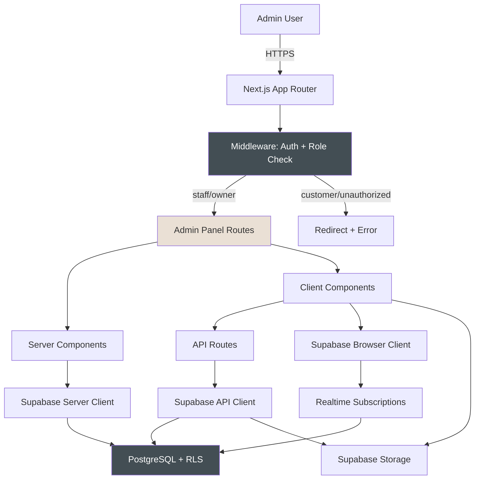

# Design Document - Phase 5: Admin Panel Core

## Executive Summary

This document provides the technical design for The Puppy Day's Admin Panel Core, a role-protected web application enabling staff and owners to manage daily business operations. The admin panel builds upon the Customer Portal (Phase 4) and Booking System (Phase 3), providing comprehensive management interfaces for appointments, customers, services, and gallery content.

### Key Architectural Decisions

1. **Server Components First**: Leveraging Next.js 14+ App Router with Server Components for data-heavy admin pages, reducing client bundle size
2. **Role-Based Middleware Protection**: Next.js middleware enforcing authentication and role checks (staff/owner) before rendering any admin route
3. **Full Calendar Integration**: Using `@fullcalendar/react` for calendar views with day/week/month perspectives and drag-drop rescheduling
4. **Real-time Dashboard**: Supabase Realtime subscriptions for live appointment updates, status changes, and activity feed
5. **Optimistic UI with Server Validation**: Client-side optimism for mutations with server-side RLS enforcement for security
6. **Responsive Sidebar Navigation**: Collapsible desktop sidebar with mobile hamburger menu using DaisyUI Drawer component

### Implementation Timeline

- **Week 1**: Middleware, auth guards, layout, navigation, dashboard scaffold
- **Week 2**: Dashboard stats, today's appointments, activity feed, real-time subscriptions
- **Week 3**: Calendar view (FullCalendar), list view, appointment detail modal, status transitions
- **Week 4**: Customer list, customer profile, appointment history, flag system
- **Week 5**: Services CRUD, add-ons CRUD, size-based pricing forms
- **Week 6**: Gallery management, image upload, metadata editing, report card integration
- **Week 7**: Loading states, error handling, accessibility, performance optimization

### Business Value

- Reduce manual scheduling time by 60% through visual calendar interface
- Improve customer service response with real-time appointment status visibility
- Streamline service catalog management with intuitive CRUD interfaces
- Enhance marketing capabilities with easy gallery management
- Increase staff efficiency with customer flag system for important notes

---

## System Architecture

### High-Level Architecture



### Server vs Client Components

**Server Components** (Data Fetching, Read-Heavy):
- Dashboard page (initial data load)
- Customer list page
- Customer profile page
- Services list page
- Gallery grid page
- Appointment list view (server-rendered table)

**Client Components** (Interactivity, Mutations):
- Appointment calendar (FullCalendar)
- Appointment detail modal
- Status transition buttons
- Customer flag management
- Service/add-on forms
- Gallery upload modal
- Navigation sidebar
- Toast notifications
- Confirmation modals

---

## Routes

| Route | Component Type | Auth | Description |
|-------|---------------|------|-------------|
| `/admin/dashboard` | Server | staff/owner | Dashboard with stats, today's appointments, activity feed |
| `/admin/appointments` | Client | staff/owner | Calendar + list view with filters |
| `/admin/customers` | Server | staff/owner | Customer list with search/filters |
| `/admin/customers/[id]` | Server | staff/owner | Customer profile with appointments, pets, flags |
| `/admin/services` | Server | owner | Services list with CRUD |
| `/admin/services/new` | Client | owner | Create service form |
| `/admin/services/[id]/edit` | Client | owner | Edit service form |
| `/admin/addons` | Server | owner | Add-ons list with CRUD |
| `/admin/addons/new` | Client | owner | Create add-on form |
| `/admin/addons/[id]/edit` | Client | owner | Edit add-on form |
| `/admin/gallery` | Server | staff/owner | Gallery grid with upload |

---

## Database Schema

### Existing Tables (No Changes)

All core tables exist from Phase 1. Key tables used:
- `users` (role column: customer/staff/owner)
- `appointments` (status, scheduled_at, customer_id, pet_id, service_id)
- `pets` (owner_id, name, breed_id, size, photo_url)
- `services`, `service_prices`, `addons`
- `gallery_images` (image_url, dog_name, breed, caption, tags, is_published)
- `notifications_log` (customer_id, type, channel, status, sent_at)

### Customer Flags Table (Already Exists)

```typescript
interface CustomerFlag {
  id: string;
  customer_id: string;
  reason: string;              // "Aggressive Dog", "Payment Issues", "VIP", etc.
  notes: string | null;
  flagged_by: string | null;   // Admin user ID who created flag
  is_active: boolean;
  created_at: string;
}
```

### Indexes Required

```sql
-- Appointments by status + date (for dashboard queries)
CREATE INDEX idx_appointments_status_date
  ON appointments(status, scheduled_at);

-- Appointments by customer (for profile page)
CREATE INDEX idx_appointments_customer
  ON appointments(customer_id, scheduled_at DESC);

-- Customer flags by customer
CREATE INDEX idx_customer_flags_customer
  ON customer_flags(customer_id) WHERE is_active = true;

-- Notifications log by created date (for activity feed)
CREATE INDEX idx_notifications_log_created
  ON notifications_log(created_at DESC);
```

---

## Components

### Layout & Navigation

| Component | Path | Type | Description |
|-----------|------|------|-------------|
| `AdminLayout` | `app/(admin)/layout.tsx` | Server | Root layout with sidebar nav |
| `AdminSidebar` | `components/admin/AdminSidebar.tsx` | Client | Collapsible sidebar with route highlighting |
| `AdminMobileNav` | `components/admin/AdminMobileNav.tsx` | Client | Hamburger menu for mobile |

### Dashboard Components

| Component | Type | Description |
|-----------|------|-------------|
| `DashboardStats` | Client | Four stat cards with real-time updates |
| `TodayAppointments` | Client | Chronological list with status buttons |
| `ActivityFeed` | Client | Recent activity from notifications_log |

### Appointments Components

| Component | Type | Description |
|-----------|------|-------------|
| `AppointmentCalendar` | Client | FullCalendar with day/week/month views |
| `AppointmentListView` | Server | Table with search, filters, pagination |
| `AppointmentDetailModal` | Client | Full details with status actions |
| `StatusTransitionButton` | Client | Context-aware action button |
| `AppointmentTimelineHistory` | Client | Status change history with timestamps |

### Customer Components

| Component | Type | Description |
|-----------|------|-------------|
| `CustomerTable` | Server | Searchable table with flags and member status |
| `CustomerProfile` | Server | Contact info, pets, appointment history |
| `CustomerFlagBadge` | Client | Color-coded flag with icon |
| `CustomerFlagForm` | Client | Add/edit flag modal |
| `AppointmentHistoryList` | Server | Filterable list of past appointments |

### Services & Add-ons Components

| Component | Type | Description |
|-----------|------|-------------|
| `ServicesList` | Server | List with active/inactive toggle |
| `ServiceForm` | Client | CRUD form with size-based pricing inputs |
| `AddOnsList` | Server | List with breed upsell indicators |
| `AddOnForm` | Client | CRUD form with breed multi-select |
| `SizeBasedPricingInputs` | Client | Four price inputs (S/M/L/XL) |

### Gallery Components

| Component | Type | Description |
|-----------|------|-------------|
| `GalleryGrid` | Server | Image grid with publish status |
| `GalleryUploadModal` | Client | Drag-drop multi-file upload |
| `GalleryImageEditModal` | Client | Metadata form with publish toggle |
| `ReportCardAddToGallery` | Client | Button to copy report card photos |

### Shared UI Components

| Component | Type | Description |
|-----------|------|-------------|
| `ConfirmationModal` | Client | Reusable confirmation dialog |
| `StatusBadge` | Client | Color-coded appointment status |
| `EmptyState` | Server | Icon + message + action for empty lists |
| `ErrorState` | Client | Error message with retry button |
| `LoadingSkeleton` | Server | Pulsing skeleton matching layout |
| `Toast` | Client | Success/error notifications |

---

## API Routes

| Method | Path | Auth | Description |
|--------|------|------|-------------|
| GET | `/api/admin/dashboard/stats` | staff/owner | Today's revenue, confirmations, total, completed |
| GET | `/api/admin/dashboard/appointments` | staff/owner | Today's appointments with joins |
| GET | `/api/admin/dashboard/activity` | staff/owner | Recent 10 activities from notifications_log |
| GET | `/api/admin/appointments` | staff/owner | List with filters (status, date range, search) |
| GET | `/api/admin/appointments/[id]` | staff/owner | Single appointment with full details |
| PATCH | `/api/admin/appointments/[id]/status` | staff/owner | Update status, trigger notifications |
| PATCH | `/api/admin/appointments/[id]` | staff/owner | Update date/time, special requests |
| GET | `/api/admin/customers` | staff/owner | List with search, pagination |
| GET | `/api/admin/customers/[id]` | staff/owner | Profile with pets, appointments, flags |
| PATCH | `/api/admin/customers/[id]` | staff/owner | Update contact info |
| POST | `/api/admin/customers/[id]/flags` | staff/owner | Create customer flag |
| PATCH | `/api/admin/customers/[id]/flags/[flagId]` | staff/owner | Update flag |
| DELETE | `/api/admin/customers/[id]/flags/[flagId]` | staff/owner | Soft-delete flag (set is_active=false) |
| GET | `/api/admin/services` | owner | List all services with prices |
| POST | `/api/admin/services` | owner | Create service + service_prices rows |
| PATCH | `/api/admin/services/[id]` | owner | Update service + prices |
| PATCH | `/api/admin/services/[id]/active` | owner | Toggle is_active |
| GET | `/api/admin/addons` | owner | List all add-ons |
| POST | `/api/admin/addons` | owner | Create add-on |
| PATCH | `/api/admin/addons/[id]` | owner | Update add-on |
| PATCH | `/api/admin/addons/[id]/active` | owner | Toggle is_active |
| GET | `/api/admin/gallery` | staff/owner | List gallery images with filters |
| POST | `/api/admin/gallery/upload` | staff/owner | Upload to Supabase Storage, insert rows |
| PATCH | `/api/admin/gallery/[id]` | staff/owner | Update metadata, publish status |
| DELETE | `/api/admin/gallery/[id]` | staff/owner | Soft-delete image, remove from storage |

---

## Calendar Implementation

### Library: `@fullcalendar/react`

**Dependencies:**
```json
{
  "@fullcalendar/react": "^6.1.10",
  "@fullcalendar/daygrid": "^6.1.10",
  "@fullcalendar/timegrid": "^6.1.10",
  "@fullcalendar/interaction": "^6.1.10"
}
```

**Features:**
- Day view: Time-slotted grid 9 AM - 5 PM (business hours)
- Week view: 7-day grid with appointment blocks
- Month view: Traditional calendar with appointment counts
- Click event opens appointment detail modal
- Drag-drop to reschedule (updates scheduled_at)
- Color-coded by appointment status:
  - Pending: Gray
  - Confirmed: Blue
  - Checked In: Yellow
  - In Progress: Green
  - Completed: Dark Green
  - Cancelled/No-Show: Red

**Integration:**
```typescript
// components/admin/AppointmentCalendar.tsx
'use client';

import FullCalendar from '@fullcalendar/react';
import dayGridPlugin from '@fullcalendar/daygrid';
import timeGridPlugin from '@fullcalendar/timegrid';
import interactionPlugin from '@fullcalendar/interaction';

export function AppointmentCalendar({ appointments }: Props) {
  const events = appointments.map(apt => ({
    id: apt.id,
    title: `${apt.pet?.name} - ${apt.customer?.first_name}`,
    start: apt.scheduled_at,
    end: new Date(new Date(apt.scheduled_at).getTime() + apt.duration_minutes * 60000),
    backgroundColor: getStatusColor(apt.status),
    extendedProps: { appointment: apt }
  }));

  return (
    <FullCalendar
      plugins={[dayGridPlugin, timeGridPlugin, interactionPlugin]}
      initialView="timeGridDay"
      headerToolbar={{
        left: 'prev,next today',
        center: 'title',
        right: 'timeGridDay,timeGridWeek,dayGridMonth'
      }}
      slotMinTime="09:00:00"
      slotMaxTime="17:00:00"
      events={events}
      eventClick={handleEventClick}
      editable={true}
      eventDrop={handleEventDrop}
    />
  );
}
```

---

## Data Models

### Dashboard Stats

```typescript
interface DashboardStats {
  todayRevenue: number;        // Sum of payments where status='completed' and date=today
  pendingConfirmations: number; // Count appointments where status='pending' and date=today
  totalAppointments: number;   // Count appointments where date=today and status NOT IN ('cancelled', 'no_show')
  completedAppointments: number; // Count appointments where status='completed' and date=today
}
```

### Appointment with Joins

```typescript
interface AppointmentDetail extends Appointment {
  customer: {
    id: string;
    first_name: string;
    last_name: string;
    email: string;
    phone: string | null;
    flags?: CustomerFlag[];
  };
  pet: {
    id: string;
    name: string;
    breed?: { name: string };
    breed_custom?: string;
    size: PetSize;
    weight: number | null;
    photo_url: string | null;
  };
  service: {
    id: string;
    name: string;
    duration_minutes: number;
  };
  addons?: Array<{
    addon: { name: string };
    price: number;
  }>;
  groomer?: {
    first_name: string;
    last_name: string;
  };
}
```

### Activity Feed Item

```typescript
interface ActivityItem {
  id: string;
  type: 'appointment_created' | 'appointment_cancelled' | 'no_show' | 'customer_registered' | 'payment_received';
  message: string;
  created_at: string;
  customer_id?: string;
  appointment_id?: string;
  icon: LucideIcon; // Derived from type
}
```

### Customer Flag Type

```typescript
type FlagType =
  | 'Aggressive Dog'
  | 'Payment Issues'
  | 'VIP'
  | 'Special Needs'
  | 'Grooming Notes'
  | 'Other';

interface CustomerFlagInput {
  customer_id: string;
  reason: FlagType;
  notes?: string;
  flagged_by: string; // Current admin user ID
}
```

### Service with Pricing

```typescript
interface ServiceWithPricing {
  id: string;
  name: string;
  description: string | null;
  image_url: string | null;
  duration_minutes: number;
  is_active: boolean;
  display_order: number;
  prices: {
    small: number;   // 0-18 lbs
    medium: number;  // 19-35 lbs
    large: number;   // 36-65 lbs
    xlarge: number;  // 66+ lbs
  };
}
```

---

## Status Transitions

### Allowed Transitions

```typescript
const ALLOWED_TRANSITIONS: Record<AppointmentStatus, AppointmentStatus[]> = {
  pending: ['confirmed', 'cancelled', 'no_show'],
  confirmed: ['checked_in', 'cancelled', 'no_show'],
  checked_in: ['in_progress', 'cancelled', 'no_show'],
  in_progress: ['completed', 'cancelled'],
  ready: ['completed'],
  completed: [], // Terminal state
  cancelled: [], // Terminal state
  no_show: []    // Terminal state
};
```

### Notification Triggers

| Status Transition | Email | SMS | Content |
|------------------|-------|-----|---------|
| pending → confirmed | ✅ | ✅ (if enabled) | Confirmation with date/time, add-to-calendar link |
| * → cancelled | ✅ | ✅ (if enabled) | Cancellation notice with reason |
| in_progress → completed | ✅ | ❌ | Thank you email with review routing link |
| * → no_show | ❌ | ❌ | No notification (internal only) |

---

## Error Handling

### Error Types

```typescript
type AdminError =
  | { type: 'auth'; message: 'Session expired' }
  | { type: 'forbidden'; message: 'Insufficient permissions' }
  | { type: 'network'; message: 'Network error. Check connection.' }
  | { type: 'validation'; field: string; message: string }
  | { type: 'server'; message: 'Something went wrong' };
```

### Error Display Strategy

| Context | Display Method | Auto-Dismiss | Retry Option |
|---------|---------------|--------------|--------------|
| Data fetch | Error state component | No | Yes |
| Mutation | Toast notification | 8 seconds | No |
| Form validation | Inline field errors | No | N/A |
| Image upload | Toast + inline | 8 seconds | Yes |
| Auth failure | Redirect to /login | N/A | N/A |
| 403 Forbidden | Toast + disable actions | No | No |

---

## Testing Strategy

### Unit Tests

- Status transition validation logic
- Flag color calculation from flag type
- Activity feed icon mapping
- Pricing calculation with add-ons
- Date/time formatting utilities

### Integration Tests

- API routes with role-based access
- Appointment status update flow
- Customer flag CRUD operations
- Service creation with price rows
- Gallery image upload to Supabase Storage

### E2E Tests (Playwright)

- Login as staff → access dashboard → see today's appointments
- Login as owner → create service → verify in booking widget
- Update appointment status → verify notification sent
- Add customer flag → verify displayed on appointment card
- Upload gallery image → verify published on marketing site

### Accessibility Tests

- Keyboard navigation through sidebar and modals
- Screen reader announcements for loading states
- Focus trap in modals
- Color contrast ratios (WCAG AA)
- Form error associations

---

## Performance Targets

| Metric | Target | Measurement |
|--------|--------|-------------|
| Dashboard FCP | < 1.5s | Lighthouse |
| Calendar render | < 500ms | Chrome DevTools |
| Appointment list (50 items) | < 300ms | Chrome DevTools |
| Customer search results | < 400ms | Network tab |
| Image upload (5MB) | < 3s | Progress indicator |
| Real-time update latency | < 500ms | Supabase Realtime |

### Optimization Techniques

- Server Components for data-heavy pages (dashboard, customer list)
- React.memo for pure components (StatusBadge, CustomerFlagBadge)
- useMemo for expensive calculations (stats aggregation)
- Debounced search inputs (300ms)
- Virtualized lists for large datasets (react-window)
- Next.js Image component for all images
- Supabase Image Transformation for thumbnails
- Prefetch calendar data on view change hover

---

## Real-time Subscriptions

### Dashboard Real-time

```typescript
// Subscribe to today's appointments
useEffect(() => {
  const channel = supabase
    .channel('dashboard-appointments')
    .on(
      'postgres_changes',
      {
        event: '*',
        schema: 'public',
        table: 'appointments',
        filter: `scheduled_at=gte.${todayStart}&scheduled_at=lt.${tomorrowStart}`
      },
      handleAppointmentChange
    )
    .subscribe();

  return () => {
    supabase.removeChannel(channel);
  };
}, [todayStart, tomorrowStart]);
```

### Calendar Real-time

```typescript
// Subscribe to visible date range
useEffect(() => {
  const channel = supabase
    .channel('calendar-appointments')
    .on(
      'postgres_changes',
      {
        event: '*',
        schema: 'public',
        table: 'appointments',
        filter: `scheduled_at=gte.${rangeStart}&scheduled_at=lt.${rangeEnd}`
      },
      handleCalendarUpdate
    )
    .subscribe();

  return () => {
    supabase.removeChannel(channel);
  };
}, [rangeStart, rangeEnd]);
```

---

## Accessibility (WCAG 2.1 AA)

### Keyboard Navigation

- **Tab order**: Sidebar → main content → modals
- **Shortcuts**:
  - `Ctrl+K` or `Cmd+K`: Global search
  - `Esc`: Close modal
  - `Enter`: Confirm action
  - `Arrow keys`: Navigate calendar

### Screen Reader Support

- `aria-live="polite"` for loading states
- `aria-label` for icon-only buttons
- `aria-describedby` for form error messages
- `role="status"` for toast notifications
- Semantic HTML (`<nav>`, `<main>`, `<dialog>`)

### Visual Considerations

- Minimum color contrast: 4.5:1 for text, 3:1 for large text
- Status conveyed by color + icon + text label
- Focus indicators: 2px solid ring with offset
- Responsive text sizing: 16px minimum
- No information conveyed by color alone

---

## Security Considerations

### Row-Level Security (RLS)

All database queries enforce RLS policies:

```sql
-- Appointments: Staff/owner can view all
CREATE POLICY "Admin read appointments" ON appointments
  FOR SELECT TO authenticated
  USING (
    EXISTS (
      SELECT 1 FROM users
      WHERE id = auth.uid()
      AND role IN ('staff', 'owner')
    )
  );

-- Services: Owner-only write access
CREATE POLICY "Owner manage services" ON services
  FOR ALL TO authenticated
  USING (
    EXISTS (
      SELECT 1 FROM users
      WHERE id = auth.uid()
      AND role = 'owner'
    )
  );
```

### API Route Protection

```typescript
// middleware: /api/admin/*
export async function middleware(req: NextRequest) {
  const supabase = createMiddlewareClient({ req, res });
  const { data: { user } } = await supabase.auth.getUser();

  if (!user) {
    return NextResponse.redirect(new URL('/login', req.url));
  }

  const { data: userData } = await supabase
    .from('users')
    .select('role')
    .eq('id', user.id)
    .single();

  if (!userData || !['staff', 'owner'].includes(userData.role)) {
    return NextResponse.json({ error: 'Forbidden' }, { status: 403 });
  }

  return NextResponse.next();
}
```

### Input Validation

- Server-side validation for all mutations
- Zod schemas for type-safe validation
- SQL injection prevention via parameterized queries (Supabase client)
- XSS prevention via React auto-escaping
- File upload validation: type, size, sanitize filename

---

## Design System Application

### Colors (Clean & Elegant Professional)

```css
--background: #F8EEE5;        /* Warm cream */
--primary: #434E54;           /* Charcoal */
--primary-hover: #363F44;
--secondary: #EAE0D5;         /* Lighter cream */
--card-bg: #FFFFFF;
--card-bg-alt: #FFFBF7;

/* Status colors */
--status-pending: #9CA3AF;    /* Gray */
--status-confirmed: #3B82F6;  /* Blue */
--status-checked-in: #F59E0B; /* Yellow */
--status-in-progress: #10B981;/* Green */
--status-completed: #059669;  /* Dark green */
--status-cancelled: #EF4444;  /* Red */
--status-no-show: #DC2626;    /* Dark red */

/* Flag colors */
--flag-warning: #EF4444;      /* Red - Aggressive Dog, Payment Issues */
--flag-note: #F59E0B;         /* Yellow - Special Needs, Grooming Notes */
--flag-positive: #10B981;     /* Green - VIP */
```

### Typography

- **Headings**: Nunito, 600-700 weight
- **Body**: Inter, 400-500 weight
- **Monospace**: JetBrains Mono (for IDs, dates)

### Shadows & Borders

- Cards: `shadow-sm` (soft, subtle)
- Modals: `shadow-lg` (elevated)
- Borders: 1px solid `border-gray-200` or none
- Corners: `rounded-lg` (8px) or `rounded-xl` (12px)

### Component Examples

**DaisyUI Usage:**
- `btn btn-primary` for primary actions
- `card card-compact bg-base-100 shadow-sm`
- `drawer drawer-mobile` for sidebar
- `modal modal-bottom sm:modal-middle`
- `badge badge-primary` for status badges
- `skeleton` for loading states

---

## Implementation Checklist

### Phase 1: Foundation (Week 1)
- [ ] Set up `/admin` route group with layout
- [ ] Create middleware for auth + role verification
- [ ] Build AdminSidebar component (desktop)
- [ ] Build AdminMobileNav component (hamburger)
- [ ] Create AdminLayout with navigation
- [ ] Implement route protection logic
- [ ] Set up Zustand store for admin state

### Phase 2: Dashboard (Week 2)
- [ ] Create DashboardStats component
- [ ] Build TodayAppointments widget
- [ ] Implement ActivityFeed component
- [ ] Set up Supabase Realtime subscriptions
- [ ] Add API routes for dashboard data
- [ ] Implement loading skeletons
- [ ] Add error states with retry

### Phase 3: Appointments (Week 3)
- [ ] Install and configure FullCalendar
- [ ] Build AppointmentCalendar component
- [ ] Create AppointmentListView (table)
- [ ] Implement AppointmentDetailModal
- [ ] Add status transition buttons
- [ ] Build AppointmentTimelineHistory
- [ ] Implement search and filters
- [ ] Add notification triggers

### Phase 4: Customers (Week 4)
- [ ] Create CustomerTable component
- [ ] Build CustomerProfile page
- [ ] Implement AppointmentHistoryList
- [ ] Create CustomerFlagBadge component
- [ ] Build CustomerFlagForm modal
- [ ] Add API routes for customer CRUD
- [ ] Implement flag management logic

### Phase 5: Services & Add-ons (Week 5)
- [ ] Create ServicesList component
- [ ] Build ServiceForm with size-based pricing
- [ ] Implement AddOnsList component
- [ ] Create AddOnForm with breed multi-select
- [ ] Add API routes for services CRUD
- [ ] Add API routes for add-ons CRUD
- [ ] Implement active/inactive toggle
- [ ] Add drag-drop reordering

### Phase 6: Gallery (Week 6)
- [ ] Create GalleryGrid component
- [ ] Build GalleryUploadModal (drag-drop)
- [ ] Implement GalleryImageEditModal
- [ ] Add Supabase Storage integration
- [ ] Create ReportCardAddToGallery button
- [ ] Add API routes for gallery CRUD
- [ ] Implement publish/unpublish toggle

### Phase 7: Polish (Week 7)
- [ ] Add loading skeletons for all pages
- [ ] Implement empty states for all lists
- [ ] Add error handling and retry logic
- [ ] Implement toast notifications
- [ ] Add confirmation modals for destructive actions
- [ ] Conduct accessibility audit (WCAG AA)
- [ ] Optimize performance (bundle size, images)
- [ ] Write unit tests for critical logic
- [ ] Write E2E tests for key flows
- [ ] Documentation updates

---

## Migration from Mock to Production

When transitioning from mock services to production Supabase:

1. **Environment Variables**: Update `.env.local` with production Supabase keys
2. **RLS Policies**: Apply all security policies to production database
3. **Indexes**: Create all performance indexes
4. **Storage Buckets**: Create `service-images` and `gallery-images` buckets
5. **Seed Data**: Populate breeds, services, addons via admin panel
6. **User Roles**: Manually set initial staff/owner roles in database

---

## Appendix: Useful Resources

- [FullCalendar React Docs](https://fullcalendar.io/docs/react)
- [Supabase Realtime Guide](https://supabase.com/docs/guides/realtime)
- [Next.js Middleware Docs](https://nextjs.org/docs/app/building-your-application/routing/middleware)
- [DaisyUI Components](https://daisyui.com/components/)
- [WCAG 2.1 Guidelines](https://www.w3.org/WAI/WCAG21/quickref/)
