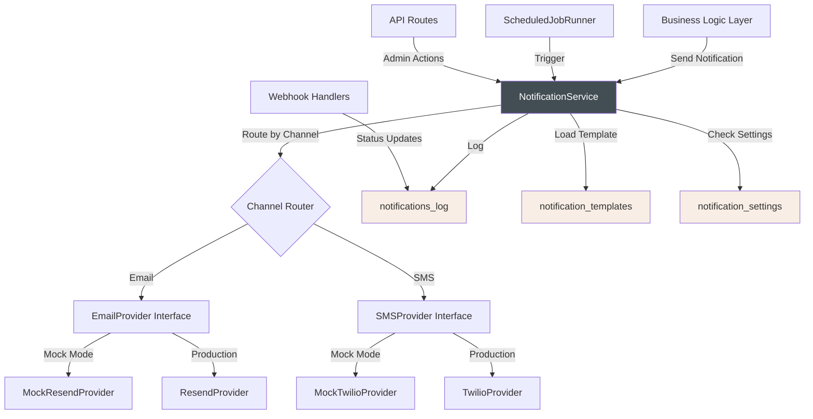

# Phase 8: Notifications & Integrations - Design Document

## Executive Summary

Phase 8 establishes a comprehensive notification system for The Puppy Day dog grooming SaaS application. This phase creates a robust, scalable notification infrastructure that supports both email (via Resend) and SMS (via Twilio) channels. The design implements a notification abstraction layer following the Strategy and Adapter patterns, providing a unified interface for multi-channel notifications while maintaining flexibility for future channel additions.

### Key Architectural Decisions

1. **Abstraction Layer**: Unified `NotificationService` interface decouples business logic from provider implementations
2. **Template Management**: Database-backed template system with variable substitution and versioning
3. **Retry Strategy**: Exponential backoff with jitter for transient failures (30s → 5min → fail)
4. **Scheduled Jobs**: Vercel Cron for appointment reminders (hourly) and retention campaigns (daily at 9 AM)
5. **Mock-First Development**: Complete mock implementations for development without external API dependencies

### Implementation Timeline

- **Week 1**: Core abstraction layer, database schema, and mock services
- **Week 2**: Email/SMS provider implementations and template system
- **Week 3**: Scheduled jobs, retry logic, and notification triggers
- **Week 4**: Admin UI, testing, and template management interface

---

## 1. Architecture Overview

### 1.1 System Architecture



### 1.2 Component Responsibilities

| Component | Responsibility |
|-----------|----------------|
| **NotificationService** | Orchestrates notification sending, template rendering, retry logic, and logging |
| **EmailProvider** | Abstracts email delivery (Resend in production, mock in development) |
| **SMSProvider** | Abstracts SMS delivery (Twilio in production, mock in development) |
| **TemplateEngine** | Renders templates with variable substitution and validation |
| **RetryManager** | Handles exponential backoff retry logic with jitter |
| **ScheduledJobRunner** | Executes time-based notification triggers (reminders, retention) |
| **NotificationLogger** | Persists all notification attempts and results to database |

### 1.3 Data Flow Patterns

#### Transactional Notifications (Booking Confirmation)
```
User Action → API Route → NotificationService → Provider → Log → Response
```

#### Scheduled Notifications (Reminders)
```
Cron Trigger → JobRunner → Query Due Records → Batch Process → NotificationService
```

#### Retry Flow
```
Send Attempt → Failure → RetryManager → Wait (exponential) → Retry → Success/Fail
```

---

## 2. Database Schema Design

### 2.1 New Tables

#### notification_templates

Stores reusable notification templates with variable placeholders.

```sql
CREATE TABLE IF NOT EXISTS public.notification_templates (
  id UUID PRIMARY KEY DEFAULT uuid_generate_v4(),
  name TEXT NOT NULL UNIQUE,
  description TEXT,
  type TEXT NOT NULL CHECK (type IN ('email', 'sms', 'both')),
  trigger_event TEXT NOT NULL, -- e.g., 'booking_confirmation', 'appointment_reminder'
  channel TEXT NOT NULL CHECK (channel IN ('email', 'sms')),

  -- Email-specific fields
  subject_template TEXT, -- For emails only
  html_template TEXT,    -- For emails only
  text_template TEXT,    -- Plain text version or SMS content

  -- Template metadata
  variables JSONB NOT NULL DEFAULT '[]', -- Array of {name, description, required, example}
  is_active BOOLEAN DEFAULT true,
  version INTEGER DEFAULT 1,

  -- Audit fields
  created_by UUID REFERENCES public.users(id),
  updated_by UUID REFERENCES public.users(id),
  created_at TIMESTAMPTZ DEFAULT NOW(),
  updated_at TIMESTAMPTZ DEFAULT NOW()
);

-- Index for fast lookups by trigger event and channel
CREATE INDEX IF NOT EXISTS idx_notification_templates_trigger
  ON public.notification_templates(trigger_event, channel) WHERE is_active = true;

-- Index for template versioning
CREATE INDEX IF NOT EXISTS idx_notification_templates_name_version
  ON public.notification_templates(name, version DESC);

COMMENT ON TABLE public.notification_templates IS 'Stores reusable notification templates with variable substitution';
COMMENT ON COLUMN public.notification_templates.variables IS 'JSON array of template variables with metadata';
COMMENT ON COLUMN public.notification_templates.trigger_event IS 'Event that triggers this notification';
```

**Example Variables JSON:**
```json
[
  {
    "name": "customer_name",
    "description": "Customer's first name",
    "required": true,
    "example": "Sarah"
  },
  {
    "name": "pet_name",
    "description": "Name of the pet",
    "required": true,
    "example": "Max"
  },
  {
    "name": "appointment_date",
    "description": "Formatted appointment date",
    "required": true,
    "example": "Monday, December 18, 2025"
  }
]
```

#### notification_settings

Stores notification toggles and configuration.

```sql
CREATE TABLE IF NOT EXISTS public.notification_settings (
  id UUID PRIMARY KEY DEFAULT uuid_generate_v4(),
  notification_type TEXT NOT NULL UNIQUE, -- e.g., 'booking_confirmation', 'appointment_reminder'

  -- Channel enablement
  email_enabled BOOLEAN DEFAULT true,
  sms_enabled BOOLEAN DEFAULT true,

  -- Template references
  email_template_id UUID REFERENCES public.notification_templates(id),
  sms_template_id UUID REFERENCES public.notification_templates(id),

  -- Scheduling (for scheduled notifications)
  schedule_cron TEXT, -- Cron expression, e.g., '0 * * * *' for hourly
  schedule_enabled BOOLEAN DEFAULT true,

  -- Retry configuration
  max_retries INTEGER DEFAULT 2,
  retry_delays_seconds INTEGER[] DEFAULT ARRAY[30, 300], -- [30s, 5min]

  -- Statistics (updated by triggers)
  last_sent_at TIMESTAMPTZ,
  total_sent_count INTEGER DEFAULT 0,
  total_failed_count INTEGER DEFAULT 0,

  created_at TIMESTAMPTZ DEFAULT NOW(),
  updated_at TIMESTAMPTZ DEFAULT NOW()
);

-- Seed default notification settings
INSERT INTO public.notification_settings (notification_type, email_enabled, sms_enabled, schedule_cron) VALUES
  ('booking_confirmation', true, true, NULL),
  ('appointment_reminder', false, true, '0 * * * *'), -- Hourly
  ('status_checked_in', false, true, NULL),
  ('status_ready', false, true, NULL),
  ('report_card_ready', true, true, NULL),
  ('waitlist_available', false, true, NULL),
  ('retention_reminder', true, true, '0 9 * * *'), -- Daily at 9 AM
  ('payment_failed', true, false, NULL),
  ('payment_reminder', true, false, NULL)
ON CONFLICT (notification_type) DO NOTHING;

COMMENT ON TABLE public.notification_settings IS 'Configuration and toggles for each notification type';
COMMENT ON COLUMN public.notification_settings.schedule_cron IS 'Cron expression for scheduled notifications';
```

#### notification_template_history

Version history for template changes (rollback capability).

```sql
CREATE TABLE IF NOT EXISTS public.notification_template_history (
  id UUID PRIMARY KEY DEFAULT uuid_generate_v4(),
  template_id UUID NOT NULL REFERENCES public.notification_templates(id) ON DELETE CASCADE,
  version INTEGER NOT NULL,

  -- Snapshot of template at this version
  name TEXT NOT NULL,
  subject_template TEXT,
  html_template TEXT,
  text_template TEXT,
  variables JSONB,

  -- Change metadata
  changed_by UUID REFERENCES public.users(id),
  change_reason TEXT,
  created_at TIMESTAMPTZ DEFAULT NOW(),

  UNIQUE(template_id, version)
);

CREATE INDEX IF NOT EXISTS idx_notification_template_history_template
  ON public.notification_template_history(template_id, version DESC);

COMMENT ON TABLE public.notification_template_history IS 'Version history for notification templates';
```

### 2.2 Schema Modifications

#### notifications_log Enhancements

Add retry tracking and template reference to existing table.

```sql
-- Add new columns to existing notifications_log table
ALTER TABLE public.notifications_log
  ADD COLUMN IF NOT EXISTS template_id UUID REFERENCES public.notification_templates(id),
  ADD COLUMN IF NOT EXISTS template_data JSONB, -- Variables used for rendering
  ADD COLUMN IF NOT EXISTS retry_count INTEGER DEFAULT 0,
  ADD COLUMN IF NOT EXISTS retry_after TIMESTAMPTZ,
  ADD COLUMN IF NOT EXISTS is_test BOOLEAN DEFAULT false;

-- Create indexes for retry processing
CREATE INDEX IF NOT EXISTS idx_notifications_log_retry
  ON public.notifications_log(retry_after)
  WHERE status = 'failed' AND retry_count < 3;

CREATE INDEX IF NOT EXISTS idx_notifications_log_template
  ON public.notifications_log(template_id);

COMMENT ON COLUMN public.notifications_log.template_data IS 'Variables used to render the template';
COMMENT ON COLUMN public.notifications_log.retry_count IS 'Number of retry attempts made';
COMMENT ON COLUMN public.notifications_log.retry_after IS 'Timestamp when next retry should occur';
COMMENT ON COLUMN public.notifications_log.is_test IS 'True if this was a test notification from admin';
```

#### users Preferences Enhancement

Add notification preferences to user profiles.

```sql
-- User preferences structure (stored in users.preferences JSONB column)
-- No schema change needed, just document expected structure:
```

**Example User Preferences JSON:**
```json
{
  "notifications": {
    "marketing_enabled": true,
    "email_appointment_reminders": true,
    "sms_appointment_reminders": true,
    "email_retention_reminders": true,
    "sms_retention_reminders": false
  }
}
```

### 2.3 Database Functions

#### Track Notification Statistics

```sql
-- Function to update notification statistics in settings table
CREATE OR REPLACE FUNCTION update_notification_stats()
RETURNS TRIGGER AS $$
BEGIN
  IF NEW.status = 'sent' AND OLD.status = 'pending' THEN
    UPDATE public.notification_settings
    SET
      last_sent_at = NOW(),
      total_sent_count = total_sent_count + 1
    WHERE notification_type = NEW.type;
  ELSIF NEW.status = 'failed' THEN
    UPDATE public.notification_settings
    SET total_failed_count = total_failed_count + 1
    WHERE notification_type = NEW.type;
  END IF;

  RETURN NEW;
END;
$$ LANGUAGE plpgsql;

-- Create trigger on notifications_log
DROP TRIGGER IF EXISTS trigger_update_notification_stats ON public.notifications_log;
CREATE TRIGGER trigger_update_notification_stats
  AFTER UPDATE ON public.notifications_log
  FOR EACH ROW
  WHEN (OLD.status IS DISTINCT FROM NEW.status)
  EXECUTE FUNCTION update_notification_stats();
```

#### Save Template Version

```sql
-- Function to save template history on update
CREATE OR REPLACE FUNCTION save_template_version()
RETURNS TRIGGER AS $$
BEGIN
  -- Only save if content changed
  IF (OLD.subject_template IS DISTINCT FROM NEW.subject_template) OR
     (OLD.html_template IS DISTINCT FROM NEW.html_template) OR
     (OLD.text_template IS DISTINCT FROM NEW.text_template) OR
     (OLD.variables IS DISTINCT FROM NEW.variables) THEN

    -- Increment version
    NEW.version = OLD.version + 1;

    -- Save old version to history
    INSERT INTO public.notification_template_history (
      template_id, version, name, subject_template, html_template,
      text_template, variables, changed_by
    ) VALUES (
      OLD.id, OLD.version, OLD.name, OLD.subject_template,
      OLD.html_template, OLD.text_template, OLD.variables, NEW.updated_by
    );
  END IF;

  RETURN NEW;
END;
$$ LANGUAGE plpgsql;

-- Create trigger on notification_templates
DROP TRIGGER IF EXISTS trigger_save_template_version ON public.notification_templates;
CREATE TRIGGER trigger_save_template_version
  BEFORE UPDATE ON public.notification_templates
  FOR EACH ROW
  EXECUTE FUNCTION save_template_version();
```

---

## 3. API Specifications

### 3.1 Admin Notification Management APIs

#### GET /api/admin/notifications/templates

List all notification templates.

**Query Parameters:**
- `type`: Filter by type (`email`, `sms`, `both`)
- `trigger_event`: Filter by trigger event
- `active_only`: Boolean, default `true`

**Response:**
```typescript
{
  templates: Array<{
    id: string;
    name: string;
    description: string;
    type: 'email' | 'sms' | 'both';
    trigger_event: string;
    channel: 'email' | 'sms';
    is_active: boolean;
    version: number;
    variables: Array<{
      name: string;
      description: string;
      required: boolean;
      example: string;
    }>;
    created_at: string;
    updated_at: string;
  }>
}
```

#### GET /api/admin/notifications/templates/:id

Get single template with full content.

**Response:**
```typescript
{
  template: {
    id: string;
    name: string;
    description: string;
    type: 'email' | 'sms' | 'both';
    trigger_event: string;
    channel: 'email' | 'sms';
    subject_template: string | null;
    html_template: string | null;
    text_template: string | null;
    variables: Array<Variable>;
    is_active: boolean;
    version: number;
    created_at: string;
    updated_at: string;
  }
}
```

#### PUT /api/admin/notifications/templates/:id

Update template content.

**Request Body:**
```typescript
{
  subject_template?: string;
  html_template?: string;
  text_template?: string;
  variables?: Array<Variable>;
  is_active?: boolean;
  change_reason?: string; // For version history
}
```

**Response:**
```typescript
{
  template: Template;
  version: number; // New version number
}
```

#### POST /api/admin/notifications/templates/:id/preview

Preview rendered template with sample data.

**Request Body:**
```typescript
{
  sample_data: Record<string, string>; // Variable values
}
```

**Response:**
```typescript
{
  preview: {
    subject?: string; // For emails
    html?: string;    // For emails
    text: string;     // For SMS or plain text
  };
  character_count: number; // For SMS
  segment_count: number;   // For SMS (160 chars per segment)
}
```

#### POST /api/admin/notifications/templates/:id/test

Send test notification.

**Request Body:**
```typescript
{
  recipient_email?: string; // For email tests
  recipient_phone?: string; // For SMS tests
  sample_data: Record<string, string>;
}
```

**Response:**
```typescript
{
  success: boolean;
  message_id?: string;
  error?: string;
  log_entry_id: string; // Reference to notifications_log
}
```

#### GET /api/admin/notifications/templates/:id/history

Get template version history.

**Response:**
```typescript
{
  history: Array<{
    id: string;
    version: number;
    changed_by?: {
      id: string;
      first_name: string;
      last_name: string;
    };
    change_reason?: string;
    created_at: string;
  }>
}
```

#### POST /api/admin/notifications/templates/:id/rollback

Rollback to a previous version.

**Request Body:**
```typescript
{
  version: number;
  reason: string;
}
```

### 3.2 Notification Settings APIs

#### GET /api/admin/notifications/settings

Get all notification settings.

**Response:**
```typescript
{
  settings: Array<{
    id: string;
    notification_type: string;
    email_enabled: boolean;
    sms_enabled: boolean;
    schedule_enabled: boolean;
    schedule_cron: string | null;
    last_sent_at: string | null;
    total_sent_count: number;
    total_failed_count: number;
  }>
}
```

#### PUT /api/admin/notifications/settings/:notification_type

Update notification settings.

**Request Body:**
```typescript
{
  email_enabled?: boolean;
  sms_enabled?: boolean;
  schedule_enabled?: boolean;
  max_retries?: number;
  retry_delays_seconds?: number[];
}
```

### 3.3 Notification Log APIs

#### GET /api/admin/notifications/log

Get notification logs with filtering and pagination.

**Query Parameters:**
- `page`: Page number (default: 1)
- `limit`: Items per page (default: 50)
- `type`: Filter by notification type
- `channel`: Filter by channel (`email`, `sms`)
- `status`: Filter by status (`pending`, `sent`, `failed`)
- `customer_id`: Filter by customer
- `start_date`: Filter by date range (ISO 8601)
- `end_date`: Filter by date range (ISO 8601)
- `search`: Search recipient email/phone

**Response:**
```typescript
{
  logs: Array<{
    id: string;
    customer_id: string;
    customer_name?: string; // Joined from users table
    type: string;
    channel: 'email' | 'sms';
    recipient: string;
    subject: string | null;
    status: 'pending' | 'sent' | 'failed';
    retry_count: number;
    error_message: string | null;
    message_id: string | null;
    tracking_id: string | null;
    is_test: boolean;
    created_at: string;
    sent_at: string | null;
    clicked_at: string | null;
    delivered_at: string | null;
  }>;
  pagination: {
    page: number;
    limit: number;
    total: number;
    total_pages: number;
  }
}
```

#### GET /api/admin/notifications/log/:id

Get detailed log entry.

**Response:**
```typescript
{
  log: {
    id: string;
    customer: {
      id: string;
      first_name: string;
      last_name: string;
      email: string;
      phone: string | null;
    };
    type: string;
    channel: 'email' | 'sms';
    recipient: string;
    subject: string | null;
    content: string;
    template_data: Record<string, any> | null;
    status: 'pending' | 'sent' | 'failed';
    retry_count: number;
    error_message: string | null;
    message_id: string | null;
    created_at: string;
    sent_at: string | null;
  }
}
```

#### POST /api/admin/notifications/log/:id/resend

Manually retry failed notification.

**Response:**
```typescript
{
  success: boolean;
  new_log_id: string;
  error?: string;
}
```

### 3.4 Dashboard Analytics APIs

#### GET /api/admin/notifications/dashboard

Get notification metrics and analytics.

**Query Parameters:**
- `start_date`: ISO 8601 date
- `end_date`: ISO 8601 date
- `period`: `7d`, `30d`, `90d` (default: `30d`)

**Response:**
```typescript
{
  summary: {
    total_sent: number;
    total_delivered: number;
    total_failed: number;
    delivery_rate: number; // Percentage
    click_rate: number;    // Percentage
    total_cost_dollars: number;
  };
  by_channel: {
    email: {
      sent: number;
      delivered: number;
      failed: number;
      delivery_rate: number;
    };
    sms: {
      sent: number;
      delivered: number;
      failed: number;
      delivery_rate: number;
      total_segments: number;
      cost_dollars: number;
    };
  };
  by_type: Array<{
    type: string;
    sent: number;
    failed: number;
    success_rate: number;
  }>;
  timeline: Array<{
    date: string; // ISO 8601 date
    sent: number;
    delivered: number;
    failed: number;
  }>;
  failure_reasons: Array<{
    reason: string;
    count: number;
    percentage: number;
  }>;
}
```

### 3.5 Scheduled Job Trigger APIs (Development Only)

#### POST /api/admin/notifications/jobs/reminders/trigger

Manually trigger appointment reminder job.

**Response:**
```typescript
{
  success: boolean;
  processed: number;
  sent: number;
  failed: number;
  errors: Array<{ appointment_id: string; error: string }>;
}
```

#### POST /api/admin/notifications/jobs/retention/trigger

Manually trigger retention reminder job.

**Response:**
```typescript
{
  success: boolean;
  processed: number;
  sent: number;
  failed: number;
  errors: Array<{ pet_id: string; error: string }>;
}
```

---

## 4. Component Design

### 4.1 NotificationService Architecture

```typescript
// src/lib/notifications/service.ts

export interface NotificationMessage {
  type: string; // e.g., 'booking_confirmation'
  channel: 'email' | 'sms';
  recipient: {
    email?: string;
    phone?: string;
    userId?: string;
  };
  templateData: Record<string, any>;
  priority?: 'high' | 'normal' | 'low';
  scheduledFor?: Date;
}

export interface NotificationResult {
  success: boolean;
  messageId?: string;
  error?: string;
  logId: string;
}

export interface NotificationService {
  // Core sending
  send(message: NotificationMessage): Promise<NotificationResult>;
  sendBatch(messages: NotificationMessage[]): Promise<NotificationResult[]>;

  // Template rendering
  renderTemplate(templateId: string, data: Record<string, any>): Promise<RenderedTemplate>;

  // Retry management
  processRetries(): Promise<void>;

  // Analytics
  getMetrics(options: MetricsOptions): Promise<NotificationMetrics>;
}

export class DefaultNotificationService implements NotificationService {
  constructor(
    private emailProvider: EmailProvider,
    private smsProvider: SMSProvider,
    private templateEngine: TemplateEngine,
    private logger: NotificationLogger,
    private supabase: AppSupabaseClient
  ) {}

  async send(message: NotificationMessage): Promise<NotificationResult> {
    // 1. Check if notification type is enabled
    const settings = await this.getSettings(message.type);
    if (!this.isEnabled(settings, message.channel)) {
      return { success: false, error: 'Notification disabled', logId: '' };
    }

    // 2. Check user preferences
    if (message.recipient.userId) {
      const allowed = await this.checkUserPreferences(
        message.recipient.userId,
        message.type,
        message.channel
      );
      if (!allowed) {
        await this.logger.log({
          ...message,
          status: 'skipped',
          error_message: 'User opted out'
        });
        return { success: false, error: 'User opted out', logId: '' };
      }
    }

    // 3. Load and render template
    const template = await this.loadTemplate(message.type, message.channel);
    const rendered = await this.templateEngine.render(template, message.templateData);

    // 4. Validate rendered content
    if (message.channel === 'sms') {
      this.validateSmsLength(rendered.text);
    }

    // 5. Create log entry (pending)
    const logEntry = await this.logger.create({
      customer_id: message.recipient.userId,
      type: message.type,
      channel: message.channel,
      recipient: message.channel === 'email' ? message.recipient.email : message.recipient.phone,
      subject: rendered.subject,
      content: rendered.html || rendered.text,
      template_data: message.templateData,
      status: 'pending'
    });

    try {
      // 6. Send via appropriate provider
      let result;
      if (message.channel === 'email') {
        result = await this.emailProvider.send({
          to: message.recipient.email!,
          subject: rendered.subject!,
          html: rendered.html!,
          text: rendered.text
        });
      } else {
        result = await this.smsProvider.send({
          to: message.recipient.phone!,
          body: rendered.text
        });
      }

      // 7. Update log entry (success)
      await this.logger.update(logEntry.id, {
        status: 'sent',
        message_id: result.id,
        sent_at: new Date().toISOString()
      });

      return {
        success: true,
        messageId: result.id,
        logId: logEntry.id
      };

    } catch (error) {
      // 8. Handle failure
      const errorMessage = error instanceof Error ? error.message : 'Unknown error';

      // Determine if error is transient
      const isTransient = this.isTransientError(error);

      if (isTransient && settings.max_retries > 0) {
        // Schedule retry
        const retryDelay = settings.retry_delays_seconds[0];
        await this.logger.update(logEntry.id, {
          status: 'failed',
          error_message: errorMessage,
          retry_count: 0,
          retry_after: new Date(Date.now() + retryDelay * 1000).toISOString()
        });
      } else {
        // Permanent failure
        await this.logger.update(logEntry.id, {
          status: 'failed',
          error_message: errorMessage
        });
      }

      return {
        success: false,
        error: errorMessage,
        logId: logEntry.id
      };
    }
  }

  private isTransientError(error: any): boolean {
    // Network errors, rate limits, timeouts
    const transientCodes = [408, 429, 500, 502, 503, 504];
    if (error.statusCode && transientCodes.includes(error.statusCode)) {
      return true;
    }

    // Network-related errors
    if (error.code === 'ECONNRESET' || error.code === 'ETIMEDOUT') {
      return true;
    }

    return false;
  }
}
```

### 4.2 Provider Interfaces

```typescript
// src/lib/notifications/providers/types.ts

export interface EmailProvider {
  send(params: EmailParams): Promise<EmailResult>;
}

export interface EmailParams {
  to: string | string[];
  subject: string;
  html: string;
  text?: string;
  replyTo?: string;
  attachments?: EmailAttachment[];
}

export interface EmailAttachment {
  filename: string;
  content: Buffer | string;
  contentType?: string;
}

export interface EmailResult {
  id: string; // Message ID from provider
  error: Error | null;
}

export interface SMSProvider {
  send(params: SMSParams): Promise<SMSResult>;
}

export interface SMSParams {
  to: string; // E.164 format: +16572522903
  body: string;
  mediaUrls?: string[]; // For MMS
}

export interface SMSResult {
  sid: string; // Message SID from provider
  segmentCount?: number; // Number of SMS segments
  error: Error | null;
}
```

### 4.3 Template Engine

```typescript
// src/lib/notifications/template-engine.ts

export interface TemplateEngine {
  render(template: NotificationTemplate, data: Record<string, any>): Promise<RenderedTemplate>;
  validate(template: NotificationTemplate): ValidationResult;
}

export interface NotificationTemplate {
  id: string;
  subject_template?: string;
  html_template?: string;
  text_template: string;
  variables: TemplateVariable[];
}

export interface TemplateVariable {
  name: string;
  description: string;
  required: boolean;
  example: string;
  defaultValue?: string;
}

export interface RenderedTemplate {
  subject?: string;
  html?: string;
  text: string;
  characterCount: number;
  segmentCount?: number; // For SMS
}

export class HandlebarsTemplateEngine implements TemplateEngine {
  async render(template: NotificationTemplate, data: Record<string, any>): Promise<RenderedTemplate> {
    // 1. Validate required variables
    this.validateRequiredVariables(template.variables, data);

    // 2. Add default values for missing optional variables
    const completeData = this.addDefaults(template.variables, data);

    // 3. Add business context (always available)
    const contextData = {
      ...completeData,
      business: {
        name: 'The Puppy Day',
        address: '14936 Leffingwell Rd, La Mirada, CA 90638',
        phone: '(657) 252-2903',
        email: 'puppyday14936@gmail.com',
        instagram: '@puppyday_lm',
        hours: 'Monday-Saturday, 9:00 AM - 5:00 PM',
        website: process.env.NEXT_PUBLIC_APP_URL
      }
    };

    // 4. Render templates using simple variable substitution
    const rendered: RenderedTemplate = {
      text: this.substitute(template.text_template, contextData)
    };

    if (template.subject_template) {
      rendered.subject = this.substitute(template.subject_template, contextData);
    }

    if (template.html_template) {
      rendered.html = this.substitute(template.html_template, contextData);
    }

    // 5. Calculate character count (for SMS)
    rendered.characterCount = rendered.text.length;
    rendered.segmentCount = Math.ceil(rendered.characterCount / 160);

    return rendered;
  }

  private substitute(template: string, data: Record<string, any>): string {
    // Simple {{variable}} replacement
    return template.replace(/\{\{([^}]+)\}\}/g, (match, key) => {
      const value = this.getNestedValue(data, key.trim());
      return value !== undefined ? String(value) : match;
    });
  }

  private getNestedValue(obj: any, path: string): any {
    return path.split('.').reduce((curr, key) => curr?.[key], obj);
  }

  validate(template: NotificationTemplate): ValidationResult {
    const errors: string[] = [];

    // Validate required fields
    if (!template.text_template) {
      errors.push('text_template is required');
    }

    // Extract variables from templates
    const usedVariables = new Set<string>();
    [template.subject_template, template.html_template, template.text_template]
      .filter(Boolean)
      .forEach(t => {
        const matches = t!.matchAll(/\{\{([^}]+)\}\}/g);
        for (const match of matches) {
          usedVariables.add(match[1].trim());
        }
      });

    // Check all required variables are defined
    template.variables
      .filter(v => v.required)
      .forEach(v => {
        if (!usedVariables.has(v.name)) {
          errors.push(`Required variable ${v.name} not used in template`);
        }
      });

    return {
      valid: errors.length === 0,
      errors
    };
  }
}
```

### 4.4 Retry Manager

```typescript
// src/lib/notifications/retry-manager.ts

export interface RetryManager {
  processRetries(): Promise<RetryResult>;
}

export interface RetryResult {
  processed: number;
  succeeded: number;
  failed: number;
  errors: Array<{ logId: string; error: string }>;
}

export class ExponentialBackoffRetryManager implements RetryManager {
  constructor(
    private notificationService: NotificationService,
    private supabase: AppSupabaseClient
  ) {}

  async processRetries(): Promise<RetryResult> {
    // 1. Find notifications ready for retry
    const { data: retryEntries } = await this.supabase
      .from('notifications_log')
      .select('*')
      .eq('status', 'failed')
      .lte('retry_after', new Date().toISOString())
      .lt('retry_count', 3) // Max 3 retries (initial + 2 retries)
      .order('created_at', { ascending: true })
      .limit(100); // Process in batches

    if (!retryEntries || retryEntries.length === 0) {
      return { processed: 0, succeeded: 0, failed: 0, errors: [] };
    }

    const result: RetryResult = {
      processed: retryEntries.length,
      succeeded: 0,
      failed: 0,
      errors: []
    };

    // 2. Process each retry with jitter
    for (const entry of retryEntries) {
      try {
        // Reconstruct notification message
        const message: NotificationMessage = {
          type: entry.type,
          channel: entry.channel,
          recipient: {
            email: entry.channel === 'email' ? entry.recipient : undefined,
            phone: entry.channel === 'sms' ? entry.recipient : undefined,
            userId: entry.customer_id
          },
          templateData: entry.template_data || {}
        };

        // Add jitter to prevent thundering herd
        const jitter = Math.random() * 1000; // 0-1000ms
        await new Promise(resolve => setTimeout(resolve, jitter));

        // Attempt resend
        const sendResult = await this.notificationService.send(message);

        if (sendResult.success) {
          result.succeeded++;

          // Update original log entry
          await this.supabase
            .from('notifications_log')
            .update({
              status: 'sent',
              retry_count: entry.retry_count + 1,
              message_id: sendResult.messageId,
              sent_at: new Date().toISOString()
            })
            .eq('id', entry.id);
        } else {
          result.failed++;

          // Check if we should retry again
          const newRetryCount = entry.retry_count + 1;
          const settings = await this.getNotificationSettings(entry.type);

          if (newRetryCount < settings.max_retries) {
            // Schedule next retry with exponential backoff
            const nextDelay = settings.retry_delays_seconds[newRetryCount];
            const nextRetryTime = new Date(Date.now() + nextDelay * 1000);

            await this.supabase
              .from('notifications_log')
              .update({
                retry_count: newRetryCount,
                retry_after: nextRetryTime.toISOString(),
                error_message: sendResult.error
              })
              .eq('id', entry.id);
          } else {
            // Max retries exceeded - permanent failure
            await this.supabase
              .from('notifications_log')
              .update({
                retry_count: newRetryCount,
                retry_after: null,
                error_message: `Max retries exceeded: ${sendResult.error}`
              })
              .eq('id', entry.id);

            result.errors.push({
              logId: entry.id,
              error: `Max retries exceeded for ${entry.type}`
            });
          }
        }
      } catch (error) {
        result.errors.push({
          logId: entry.id,
          error: error instanceof Error ? error.message : 'Unknown error'
        });
      }
    }

    return result;
  }
}
```

---

## 5. Scheduled Jobs Design

### 5.1 Vercel Cron Configuration

```json
// vercel.json
{
  "crons": [
    {
      "path": "/api/cron/notifications/reminders",
      "schedule": "0 * * * *"
    },
    {
      "path": "/api/cron/notifications/retention",
      "schedule": "0 9 * * *"
    },
    {
      "path": "/api/cron/notifications/retry",
      "schedule": "*/5 * * * *"
    }
  ]
}
```

### 5.2 Appointment Reminder Job

```typescript
// src/app/api/cron/notifications/reminders/route.ts

export async function GET(request: Request) {
  // Verify cron secret for security
  const authHeader = request.headers.get('authorization');
  if (authHeader !== `Bearer ${process.env.CRON_SECRET}`) {
    return new Response('Unauthorized', { status: 401 });
  }

  const supabase = createClient();
  const notificationService = getNotificationService();

  // Find appointments 24 hours from now
  const reminderTime = new Date();
  reminderTime.setHours(reminderTime.getHours() + 24);

  const startWindow = new Date(reminderTime);
  startWindow.setMinutes(0, 0, 0); // Start of hour

  const endWindow = new Date(reminderTime);
  endWindow.setMinutes(59, 59, 999); // End of hour

  const { data: appointments } = await supabase
    .from('appointments')
    .select(`
      id,
      scheduled_at,
      customer:customer_id(id, first_name, phone, preferences),
      pet:pet_id(name)
    `)
    .gte('scheduled_at', startWindow.toISOString())
    .lte('scheduled_at', endWindow.toISOString())
    .in('status', ['pending', 'confirmed']);

  if (!appointments || appointments.length === 0) {
    return Response.json({ processed: 0, sent: 0 });
  }

  // Check which appointments haven't received reminders yet
  const { data: alreadySent } = await supabase
    .from('notifications_log')
    .select('id')
    .eq('type', 'appointment_reminder')
    .in('customer_id', appointments.map(a => a.customer.id))
    .eq('status', 'sent');

  const sentCustomerIds = new Set(alreadySent?.map(log => log.customer_id) || []);

  const results = {
    processed: appointments.length,
    sent: 0,
    failed: 0,
    errors: [] as any[]
  };

  // Send reminders
  for (const appt of appointments) {
    if (sentCustomerIds.has(appt.customer.id)) {
      continue; // Already sent reminder
    }

    try {
      const result = await notificationService.send({
        type: 'appointment_reminder',
        channel: 'sms',
        recipient: {
          phone: appt.customer.phone,
          userId: appt.customer.id
        },
        templateData: {
          customer_name: appt.customer.first_name,
          pet_name: appt.pet.name,
          appointment_date: format(new Date(appt.scheduled_at), 'EEEE, MMMM d'),
          appointment_time: format(new Date(appt.scheduled_at), 'h:mm a'),
          business_phone: '(657) 252-2903',
          business_address: '14936 Leffingwell Rd, La Mirada, CA 90638'
        }
      });

      if (result.success) {
        results.sent++;
      } else {
        results.failed++;
        results.errors.push({ appointment_id: appt.id, error: result.error });
      }
    } catch (error) {
      results.failed++;
      results.errors.push({
        appointment_id: appt.id,
        error: error instanceof Error ? error.message : 'Unknown error'
      });
    }
  }

  return Response.json(results);
}
```

### 5.3 Retention Reminder Job

```typescript
// src/app/api/cron/notifications/retention/route.ts

export async function GET(request: Request) {
  // Verify cron secret
  const authHeader = request.headers.get('authorization');
  if (authHeader !== `Bearer ${process.env.CRON_SECRET}`) {
    return new Response('Unauthorized', { status: 401 });
  }

  const supabase = createClient();
  const notificationService = getNotificationService();

  // Find pets due for grooming based on breed intervals
  const { data: pets } = await supabase
    .from('pets')
    .select(`
      id,
      name,
      owner:owner_id(id, first_name, email, phone, preferences),
      breed:breed_id(name, grooming_frequency_weeks, reminder_message),
      appointments(scheduled_at, status)
    `)
    .eq('is_active', true)
    .order('scheduled_at', {
      foreignTable: 'appointments',
      ascending: false
    })
    .limit(1, { foreignTable: 'appointments' });

  if (!pets || pets.length === 0) {
    return Response.json({ processed: 0, sent: 0 });
  }

  const results = {
    processed: 0,
    sent: 0,
    failed: 0,
    skipped: 0,
    errors: [] as any[]
  };

  for (const pet of pets) {
    // Check if customer opted out of marketing
    const prefs = pet.owner.preferences as any;
    if (prefs?.notifications?.marketing_enabled === false) {
      results.skipped++;
      continue;
    }

    // Calculate if due for grooming
    const lastAppointment = pet.appointments?.[0];
    if (!lastAppointment || !pet.breed) {
      continue;
    }

    const lastGroomDate = new Date(lastAppointment.scheduled_at);
    const weeksSinceLast = Math.floor(
      (Date.now() - lastGroomDate.getTime()) / (7 * 24 * 60 * 60 * 1000)
    );

    if (weeksSinceLast < pet.breed.grooming_frequency_weeks) {
      continue; // Not due yet
    }

    // Check if we already sent a reminder recently (within 7 days)
    const { data: recentReminder } = await supabase
      .from('notifications_log')
      .select('id')
      .eq('type', 'retention_reminder')
      .eq('customer_id', pet.owner.id)
      .gte('created_at', new Date(Date.now() - 7 * 24 * 60 * 60 * 1000).toISOString())
      .limit(1);

    if (recentReminder && recentReminder.length > 0) {
      results.skipped++;
      continue;
    }

    results.processed++;

    // Send both email and SMS
    const bookingUrl = `${process.env.NEXT_PUBLIC_APP_URL}/book`;

    try {
      // Send email
      const emailResult = await notificationService.send({
        type: 'retention_reminder',
        channel: 'email',
        recipient: {
          email: pet.owner.email,
          userId: pet.owner.id
        },
        templateData: {
          customer_name: pet.owner.first_name,
          pet_name: pet.name,
          breed_name: pet.breed.name,
          weeks_since_last: weeksSinceLast,
          booking_url: bookingUrl
        }
      });

      // Send SMS
      if (pet.owner.phone) {
        const smsResult = await notificationService.send({
          type: 'retention_reminder',
          channel: 'sms',
          recipient: {
            phone: pet.owner.phone,
            userId: pet.owner.id
          },
          templateData: {
            customer_name: pet.owner.first_name,
            pet_name: pet.name,
            booking_url: bookingUrl
          }
        });
      }

      results.sent++;
    } catch (error) {
      results.failed++;
      results.errors.push({
        pet_id: pet.id,
        error: error instanceof Error ? error.message : 'Unknown error'
      });
    }
  }

  return Response.json(results);
}
```

### 5.4 Retry Processing Job

```typescript
// src/app/api/cron/notifications/retry/route.ts

export async function GET(request: Request) {
  // Verify cron secret
  const authHeader = request.headers.get('authorization');
  if (authHeader !== `Bearer ${process.env.CRON_SECRET}`) {
    return new Response('Unauthorized', { status: 401 });
  }

  const retryManager = getRetryManager();
  const result = await retryManager.processRetries();

  return Response.json(result);
}
```

---

## 6. Admin UI Component Design

### 6.1 Notification Dashboard

**Component:** `src/app/admin/notifications/page.tsx`

**Features:**
- Overview cards: Total sent (30d), Delivery rate, Failed count, Cost
- Chart: Notifications sent over time (line chart)
- Breakdown by channel (email vs SMS)
- Breakdown by type (table with sparklines)
- Recent failures (last 10 with error messages)

**Layout:**
```
┌─────────────────────────────────────────────────┐
│  Notifications Dashboard                        │
├─────────┬─────────┬─────────┬─────────┐
│ Total   │ Delivery│ Failed  │ Cost    │
│ 1,234   │ 98.5%   │ 18      │ $12.50  │
├─────────────────────────────────────────────────┤
│                                                 │
│  [Line Chart: Notifications Over Time]         │
│                                                 │
├──────────────────────┬──────────────────────────┤
│ By Channel           │ By Type                  │
│ ┌──────────────┐    │ ┌──────────────────────┐│
│ │ Email: 800   │    │ │ Booking Conf: 450    ││
│ │ SMS: 434     │    │ │ Reminders: 320       ││
│ └──────────────┘    │ │ Status: 280          ││
│                      │ └──────────────────────┘│
├──────────────────────┴──────────────────────────┤
│ Recent Failures                                 │
│ ┌─────────────────────────────────────────────┐│
│ │ • Booking SMS - Invalid phone               ││
│ │ • Reminder Email - Bounce                   ││
│ └─────────────────────────────────────────────┘│
└─────────────────────────────────────────────────┘
```

### 6.2 Template Management Interface

**Component:** `src/app/admin/notifications/templates/page.tsx`

**Features:**
- List view with filters (channel, type, status)
- Template cards showing name, trigger, last updated
- Quick actions: Edit, Test, Duplicate, Deactivate
- Search by name or trigger event

**Layout:**
```
┌─────────────────────────────────────────────────┐
│  Notification Templates                         │
├─────────────────────────────────────────────────┤
│  [Search] [Filter: All] [Filter: Email/SMS]    │
├─────────────────────────────────────────────────┤
│  ┌──────────────────────────────────────────┐  │
│  │ Booking Confirmation - Email        [Edit]│  │
│  │ Trigger: booking_confirmation             │  │
│  │ Updated: 2 days ago • Version 3           │  │
│  │ [Test] [Preview] [History]                │  │
│  └──────────────────────────────────────────┘  │
│  ┌──────────────────────────────────────────┐  │
│  │ Appointment Reminder - SMS          [Edit]│  │
│  │ Trigger: appointment_reminder             │  │
│  │ Updated: 1 week ago • Version 1           │  │
│  │ [Test] [Preview] [History]                │  │
│  └──────────────────────────────────────────┘  │
└─────────────────────────────────────────────────┘
```

### 6.3 Template Editor

**Component:** `src/app/admin/notifications/templates/[id]/edit/page.tsx`

**Features:**
- Split pane: Editor on left, preview on right
- Live preview with sample data
- Variable picker (insert variables easily)
- Character counter for SMS
- Validation errors display
- Version history sidebar

**Layout:**
```
┌─────────────────────────────────────────────────┐
│  Edit Template: Booking Confirmation - Email    │
├──────────────────────┬──────────────────────────┤
│  Editor              │  Preview                 │
│                      │                          │
│  Subject:            │  Subject: Booking        │
│  [Input field]       │  Confirmed - The Puppy   │
│                      │  Day                     │
│  Body:               │                          │
│  [Rich text editor]  │  Hi Sarah,               │
│                      │                          │
│  Variables:          │  Your grooming           │
│  • customer_name     │  appointment for Max...  │
│  • pet_name          │                          │
│  • appointment_date  │  [Full preview]          │
│                      │                          │
│  [Insert Variable ▾] │                          │
│                      │                          │
│  Character Count:    │  [Send Test]             │
│  145 / 160           │                          │
│                      │                          │
│  [Save] [Cancel]     │                          │
└──────────────────────┴──────────────────────────┘
```

### 6.4 Notification Settings

**Component:** `src/app/admin/notifications/settings/page.tsx`

**Features:**
- Toggle switches for each notification type
- Channel enablement (email/sms per type)
- Schedule configuration for automated notifications
- Statistics: last sent, total sent, failure rate

**Layout:**
```
┌─────────────────────────────────────────────────┐
│  Notification Settings                          │
├─────────────────────────────────────────────────┤
│  Booking Confirmation                           │
│  ┌─────────────────────────────────────────┐   │
│  │ Email [ON]  SMS [ON]                    │   │
│  │ Last sent: 2 hours ago                  │   │
│  │ Sent (30d): 234 • Failed: 2 (0.9%)      │   │
│  └─────────────────────────────────────────┘   │
│                                                 │
│  Appointment Reminders                          │
│  ┌─────────────────────────────────────────┐   │
│  │ Email [OFF]  SMS [ON]                   │   │
│  │ Schedule: Hourly [Edit]                 │   │
│  │ Last sent: 15 minutes ago               │   │
│  │ Sent (30d): 567 • Failed: 8 (1.4%)      │   │
│  └─────────────────────────────────────────┘   │
│                                                 │
│  Retention Reminders                            │
│  ┌─────────────────────────────────────────┐   │
│  │ Email [ON]  SMS [ON]                    │   │
│  │ Schedule: Daily at 9 AM [Edit]          │   │
│  │ Last sent: Yesterday 9:00 AM            │   │
│  │ Sent (30d): 123 • Failed: 4 (3.2%)      │   │
│  └─────────────────────────────────────────┘   │
└─────────────────────────────────────────────────┘
```

### 6.5 Notification Log Viewer

**Component:** `src/app/admin/notifications/log/page.tsx`

**Features:**
- Filterable table (type, channel, status, date range)
- Search by recipient email/phone
- Expandable rows showing full content
- Resend button for failed notifications
- Export to CSV

**Layout:**
```
┌─────────────────────────────────────────────────┐
│  Notification Log                               │
├─────────────────────────────────────────────────┤
│  [Search] [Type ▾] [Channel ▾] [Status ▾]      │
│  [Date Range: Last 30 days ▾]     [Export CSV] │
├─────────────────────────────────────────────────┤
│  Date       │Type    │Ch.│Recipient    │Status │
│  ────────────────────────────────────────────── │
│  12/15 2:30p│Booking │EM │sarah@...    │Sent   │
│  12/15 2:15p│Reminder│SMS│+1657252...  │Sent   │
│  12/15 2:00p│Status  │SMS│+1714555...  │Failed │
│             │  Error: Invalid phone number      │
│             │  [Resend]                         │
│  12/15 1:45p│Report  │EM │john@...     │Sent   │
├─────────────────────────────────────────────────┤
│  Showing 1-50 of 1,234  [< 1 2 3 ... 25 >]     │
└─────────────────────────────────────────────────┘
```

---

## 7. Mock Service Implementation

### 7.1 Mock Resend Provider

```typescript
// src/mocks/resend/provider.ts

export class MockResendProvider implements EmailProvider {
  private sentEmails: EmailLog[] = [];

  async send(params: EmailParams): Promise<EmailResult> {
    console.log('[Mock Resend] Sending email:', {
      to: params.to,
      subject: params.subject,
      textPreview: params.text?.substring(0, 100)
    });

    // Simulate network delay
    await new Promise(resolve => setTimeout(resolve, 100 + Math.random() * 200));

    // Simulate occasional failures (5% failure rate)
    if (Math.random() < 0.05) {
      const error = new Error('Mock email send failed');
      console.error('[Mock Resend] Error:', error);
      return {
        id: '',
        error
      };
    }

    // Generate mock message ID
    const messageId = `mock_email_${Date.now()}_${Math.random().toString(36).substring(7)}`;

    // Store for inspection
    this.sentEmails.push({
      id: messageId,
      to: params.to,
      subject: params.subject,
      html: params.html,
      text: params.text,
      sentAt: new Date().toISOString()
    });

    console.log('[Mock Resend] Email sent successfully:', messageId);

    return {
      id: messageId,
      error: null
    };
  }

  // Helper for testing/debugging
  getSentEmails(): EmailLog[] {
    return [...this.sentEmails];
  }

  clearSentEmails(): void {
    this.sentEmails = [];
  }
}
```

### 7.2 Mock Twilio Provider

```typescript
// src/mocks/twilio/provider.ts

export class MockTwilioProvider implements SMSProvider {
  private sentMessages: SMSLog[] = [];

  async send(params: SMSParams): Promise<SMSResult> {
    console.log('[Mock Twilio] Sending SMS:', {
      to: params.to,
      body: params.body,
      length: params.body.length
    });

    // Validate phone format
    if (!params.to.startsWith('+1')) {
      return {
        sid: '',
        error: new Error('Invalid phone number format. Must start with +1')
      };
    }

    // Simulate network delay
    await new Promise(resolve => setTimeout(resolve, 150 + Math.random() * 250));

    // Simulate occasional failures (3% failure rate)
    if (Math.random() < 0.03) {
      const error = new Error('Mock SMS send failed');
      console.error('[Mock Twilio] Error:', error);
      return {
        sid: '',
        error
      };
    }

    // Calculate segment count (160 chars per segment)
    const segmentCount = Math.ceil(params.body.length / 160);

    // Generate mock SID
    const sid = `SM${Date.now()}${Math.random().toString(36).substring(7)}`;

    // Store for inspection
    this.sentMessages.push({
      sid,
      to: params.to,
      body: params.body,
      segmentCount,
      sentAt: new Date().toISOString()
    });

    console.log('[Mock Twilio] SMS sent successfully:', sid, `(${segmentCount} segments)`);

    return {
      sid,
      segmentCount,
      error: null
    };
  }

  // Helper for testing/debugging
  getSentMessages(): SMSLog[] {
    return [...this.sentMessages];
  }

  clearSentMessages(): void {
    this.sentMessages = [];
  }
}
```

---

## 8. Error Handling & Retry Logic

### 8.1 Error Classification

```typescript
export enum ErrorType {
  TRANSIENT = 'transient',     // Retry automatically
  PERMANENT = 'permanent',     // Don't retry
  RATE_LIMIT = 'rate_limit',   // Retry with backoff
  VALIDATION = 'validation'    // Don't retry
}

export interface ClassifiedError {
  type: ErrorType;
  message: string;
  retryable: boolean;
  statusCode?: number;
}

export function classifyError(error: any): ClassifiedError {
  // Network errors
  if (error.code === 'ECONNRESET' || error.code === 'ETIMEDOUT') {
    return {
      type: ErrorType.TRANSIENT,
      message: 'Network timeout',
      retryable: true
    };
  }

  // HTTP status codes
  if (error.statusCode) {
    switch (error.statusCode) {
      case 429:
        return {
          type: ErrorType.RATE_LIMIT,
          message: 'Rate limit exceeded',
          retryable: true,
          statusCode: 429
        };

      case 500:
      case 502:
      case 503:
      case 504:
        return {
          type: ErrorType.TRANSIENT,
          message: 'Server error',
          retryable: true,
          statusCode: error.statusCode
        };

      case 400:
      case 404:
        return {
          type: ErrorType.VALIDATION,
          message: 'Invalid request',
          retryable: false,
          statusCode: error.statusCode
        };

      default:
        return {
          type: ErrorType.PERMANENT,
          message: error.message || 'Unknown error',
          retryable: false,
          statusCode: error.statusCode
        };
    }
  }

  // Validation errors
  if (error.message?.includes('invalid') || error.message?.includes('required')) {
    return {
      type: ErrorType.VALIDATION,
      message: error.message,
      retryable: false
    };
  }

  // Default to permanent
  return {
    type: ErrorType.PERMANENT,
    message: error.message || 'Unknown error',
    retryable: false
  };
}
```

### 8.2 Exponential Backoff with Jitter

```typescript
export interface RetryConfig {
  maxRetries: number;
  baseDelay: number;      // Initial delay in seconds
  maxDelay: number;       // Cap on delay in seconds
  jitterFactor: number;   // 0-1, amount of randomness
}

export function calculateRetryDelay(
  attemptNumber: number,
  config: RetryConfig
): number {
  // Exponential backoff: baseDelay * 2^attemptNumber
  const exponentialDelay = config.baseDelay * Math.pow(2, attemptNumber);

  // Cap at maximum
  const cappedDelay = Math.min(exponentialDelay, config.maxDelay);

  // Add jitter: +/- (jitterFactor * delay)
  const jitterRange = cappedDelay * config.jitterFactor;
  const jitter = (Math.random() * 2 - 1) * jitterRange; // -jitterRange to +jitterRange

  const finalDelay = Math.max(0, cappedDelay + jitter);

  return Math.floor(finalDelay);
}

// Default configuration
export const DEFAULT_RETRY_CONFIG: RetryConfig = {
  maxRetries: 2,        // Total of 3 attempts (initial + 2 retries)
  baseDelay: 30,        // Start with 30 seconds
  maxDelay: 300,        // Cap at 5 minutes
  jitterFactor: 0.3     // +/- 30% randomness
};

// Example delays:
// Attempt 0 (initial): immediate
// Attempt 1: 30s * 2^0 = 30s (+/- 9s) = 21-39s
// Attempt 2: 30s * 2^1 = 60s (+/- 18s) = 42-78s
// Attempt 3: 30s * 2^2 = 120s (+/- 36s) = 84-156s
```

---

## 9. Testing Strategy

### 9.1 Unit Tests

**Template Engine Tests**
- Variable substitution with nested objects
- Missing required variables throw errors
- Optional variables use defaults
- HTML escaping for security
- Character counting for SMS

**Retry Manager Tests**
- Exponential backoff calculation
- Jitter randomization
- Max retry enforcement
- Error classification logic

**Provider Tests**
- Mock providers simulate successes and failures
- Mock providers track sent messages
- Real providers (when configured) send test messages

### 9.2 Integration Tests

**End-to-End Notification Flow**
1. Trigger notification from business logic
2. Template loaded from database
3. Variables substituted correctly
4. Provider sends successfully
5. Log entry created with correct status

**Retry Flow**
1. Notification fails with transient error
2. Retry scheduled with correct delay
3. Retry job processes after delay
4. Success updates log entry
5. Metrics updated correctly

**Scheduled Job Tests**
1. Reminder job finds appointments 24h ahead
2. Only sends to customers who haven't received reminder
3. Respects notification settings toggles
4. Handles failures gracefully

### 9.3 Manual Testing Checklist

**Admin UI**
- [ ] Create new template
- [ ] Edit existing template with live preview
- [ ] Send test email to personal address
- [ ] Send test SMS to personal phone
- [ ] Toggle notification type on/off
- [ ] View notification log with filters
- [ ] Resend failed notification
- [ ] View dashboard metrics
- [ ] Export log to CSV
- [ ] Rollback template to previous version

**Notification Triggers**
- [ ] Book appointment → Confirmation email + SMS
- [ ] Appointment 24h away → Reminder SMS
- [ ] Update status to "Checked In" → SMS sent
- [ ] Update status to "Ready" → SMS sent
- [ ] Complete report card → Email + SMS
- [ ] Waitlist spot opens → SMS to next customer
- [ ] Pet due for grooming → Retention email + SMS
- [ ] Payment fails → Email notification

---

## 10. Security Considerations

### 10.1 Data Protection

**PII Handling**
- Email addresses and phone numbers are PII - store securely
- Notification content may contain customer names and pet details
- Implement proper access controls on notification log
- Consider GDPR/CCPA requirements for data retention

**Template Security**
- Sanitize HTML in email templates to prevent XSS
- Validate template variables to prevent injection attacks
- Restrict template editing to admin role only
- Version history for audit trail

### 10.2 API Security

**Cron Job Protection**
```typescript
// Verify cron secret on all scheduled job endpoints
const authHeader = request.headers.get('authorization');
if (authHeader !== `Bearer ${process.env.CRON_SECRET}`) {
  return new Response('Unauthorized', { status: 401 });
}
```

**Admin API Protection**
- All admin APIs require authentication
- Role-based access control (admin only)
- Rate limiting on test notification endpoints
- Input validation on all user-provided data

### 10.3 Provider Credentials

**Environment Variables**
```bash
# Resend
RESEND_API_KEY=re_xxxxxxxxxxxx

# Twilio
TWILIO_ACCOUNT_SID=ACxxxxxxxxxxxx
TWILIO_AUTH_TOKEN=xxxxxxxxxxxx
TWILIO_PHONE_NUMBER=+16572522903

# Cron Security
CRON_SECRET=random_secure_string_here
```

**Best Practices**
- Never commit credentials to version control
- Rotate API keys periodically
- Use different keys for production and staging
- Monitor usage for anomalies

---

## 11. Performance Optimization

### 11.1 Database Indexing

```sql
-- Critical indexes for notification performance
CREATE INDEX idx_notifications_log_customer_type
  ON notifications_log(customer_id, type);

CREATE INDEX idx_notifications_log_created_status
  ON notifications_log(created_at DESC, status);

CREATE INDEX idx_notification_templates_trigger_active
  ON notification_templates(trigger_event, channel)
  WHERE is_active = true;

-- Partial index for retry processing
CREATE INDEX idx_notifications_retry_pending
  ON notifications_log(retry_after)
  WHERE status = 'failed' AND retry_count < 3;
```

### 11.2 Caching Strategy

**Template Caching**
```typescript
// Cache templates in memory for 5 minutes
const templateCache = new Map<string, { template: Template; expiresAt: number }>();

async function getTemplate(trigger: string, channel: string): Promise<Template> {
  const cacheKey = `${trigger}:${channel}`;
  const cached = templateCache.get(cacheKey);

  if (cached && cached.expiresAt > Date.now()) {
    return cached.template;
  }

  const template = await fetchTemplateFromDB(trigger, channel);

  templateCache.set(cacheKey, {
    template,
    expiresAt: Date.now() + 5 * 60 * 1000 // 5 minutes
  });

  return template;
}
```

**Settings Caching**
- Cache notification settings for 10 minutes
- Invalidate cache on settings update
- Use singleton pattern for NotificationService

### 11.3 Batch Processing

**Bulk Notifications**
```typescript
async function sendBulkNotifications(messages: NotificationMessage[]): Promise<void> {
  // Process in chunks of 10
  const chunkSize = 10;

  for (let i = 0; i < messages.length; i += chunkSize) {
    const chunk = messages.slice(i, i + chunkSize);

    // Send chunk concurrently
    await Promise.all(chunk.map(msg => notificationService.send(msg)));

    // Brief pause between chunks to respect rate limits
    await new Promise(resolve => setTimeout(resolve, 100));
  }
}
```

---

## 12. Monitoring & Observability

### 12.1 Logging

**Structured Logging**
```typescript
logger.info('notification_sent', {
  notification_id: logEntry.id,
  type: message.type,
  channel: message.channel,
  customer_id: message.recipient.userId,
  message_id: result.messageId,
  duration_ms: endTime - startTime
});

logger.error('notification_failed', {
  notification_id: logEntry.id,
  type: message.type,
  channel: message.channel,
  error_type: classifiedError.type,
  error_message: error.message,
  retryable: classifiedError.retryable
});
```

### 12.2 Metrics to Track

**Delivery Metrics**
- Total sent (by type, channel)
- Delivery rate (sent vs. delivered)
- Failure rate (permanent vs. transient)
- Retry success rate

**Performance Metrics**
- Average send time per channel
- Template rendering time
- Retry processing time
- Cron job execution time

**Business Metrics**
- Reminder effectiveness (bookings after reminder)
- Retention campaign conversion rate
- Customer engagement with notifications
- Cost per notification (SMS segments)

### 12.3 Alerting

**Critical Alerts**
- Delivery rate below 95% for 1 hour
- Cron job hasn't run in 2 hours
- Retry queue growing (>100 pending)
- Provider errors increasing

**Warning Alerts**
- SMS cost exceeds budget threshold
- Unusual spike in failures for specific type
- Template rendering errors

---

## 13. Deployment Strategy

### 13.1 Migration Plan

**Phase 1: Database Setup**
1. Run migrations to create new tables
2. Seed notification_settings with defaults
3. Verify indexes created

**Phase 2: Core Infrastructure**
1. Deploy NotificationService with mock providers
2. Deploy template engine
3. Deploy retry manager
4. Test with manual triggers

**Phase 3: Templates**
1. Create default email templates
2. Create default SMS templates
3. Test template rendering
4. Test variable substitution

**Phase 4: Scheduled Jobs**
1. Deploy cron job endpoints
2. Configure Vercel cron schedules
3. Test with manual triggers
4. Enable automated execution

**Phase 5: Admin UI**
1. Deploy template management UI
2. Deploy notification settings UI
3. Deploy notification log viewer
4. Deploy dashboard analytics

**Phase 6: Integration**
1. Update booking flow to send confirmations
2. Update appointment status changes to trigger notifications
3. Update report card completion to send notifications
4. Enable all notification types

### 13.2 Rollback Plan

**If critical issues arise:**
1. Disable notification types via settings (don't send)
2. Revert API route changes
3. Disable cron jobs
4. Roll back database migrations if necessary

**Monitoring during rollout:**
- Watch error rates in notification log
- Monitor provider API status
- Check cron job execution logs
- Verify customer notifications received correctly

---

## 14. Future Enhancements

### 14.1 Potential Improvements

**Advanced Features**
- Push notifications (mobile app)
- In-app notifications
- WhatsApp integration
- Multi-language support
- A/B testing for templates
- Unsubscribe preference center

**Analytics Enhancements**
- Customer engagement scoring
- Notification fatigue detection
- Optimal send time prediction
- Conversion attribution

**Technical Improvements**
- Message queue (Redis/Bull) for high volume
- Webhook handlers for delivery tracking
- Real-time notification status updates
- Advanced template builder UI

### 14.2 Scalability Considerations

**Current Design Handles:**
- Up to 1,000 notifications/day
- Retry queue up to 100 pending
- Template cache for 100 templates

**For Higher Scale:**
- Move to dedicated message queue
- Implement worker processes for sending
- Use CDN for template assets
- Implement read replicas for analytics

---

## Appendices

### Appendix A: Default Template Examples

**Booking Confirmation - Email**
```
Subject: Appointment Confirmed - The Puppy Day

Hi {{customer_name}},

Your grooming appointment for {{pet_name}} has been confirmed!

Date: {{appointment_date}}
Time: {{appointment_time}}
Service: {{service_name}}
Price: {{total_price}}

Location:
{{business.address}}

We look forward to pampering {{pet_name}}! If you need to make any changes,
please call us at {{business.phone}}.

Best regards,
The Puppy Day Team
```

**Appointment Reminder - SMS**
```
Hi {{customer_name}}, reminder: {{pet_name}}'s grooming tomorrow at {{appointment_time}}.
See you at {{business.address}}! Need to cancel? Call {{business.phone}}
```

**Status Update - SMS**
```
Good news! {{pet_name}} is ready for pickup at The Puppy Day.
{{business.address}}. See you soon!
```

### Appendix B: Environment Variables

```bash
# Required for production
RESEND_API_KEY=re_xxxxxxxxxxxx
TWILIO_ACCOUNT_SID=ACxxxxxxxxxxxx
TWILIO_AUTH_TOKEN=xxxxxxxxxxxx
TWILIO_PHONE_NUMBER=+16572522903
CRON_SECRET=random_secure_string

# Optional
NOTIFICATION_LOG_RETENTION_DAYS=90
SMS_COST_PER_SEGMENT_CENTS=75
MAX_SMS_LENGTH=320
```

### Appendix C: Database ERD

```
┌─────────────────────┐
│ notification_       │
│ templates           │
├─────────────────────┤
│ id                  │
│ name                │
│ trigger_event       │
│ channel             │
│ subject_template    │
│ html_template       │
│ text_template       │
│ variables (JSONB)   │
│ is_active           │
│ version             │
└─────────────────────┘
         │
         │ 1:N
         ▼
┌─────────────────────┐
│ notification_       │
│ template_history    │
├─────────────────────┤
│ id                  │
│ template_id (FK)    │
│ version             │
│ [snapshot fields]   │
│ changed_by (FK)     │
└─────────────────────┘

┌─────────────────────┐
│ notification_       │
│ settings            │
├─────────────────────┤
│ id                  │
│ notification_type   │
│ email_enabled       │
│ sms_enabled         │
│ email_template_id   │
│ sms_template_id     │
│ schedule_cron       │
│ max_retries         │
│ retry_delays        │
└─────────────────────┘

┌─────────────────────┐
│ notifications_log   │
├─────────────────────┤
│ id                  │
│ customer_id (FK)    │
│ type                │
│ channel             │
│ recipient           │
│ subject             │
│ content             │
│ template_id (FK)    │
│ template_data       │
│ status              │
│ retry_count         │
│ retry_after         │
│ message_id          │
│ tracking_id         │
│ error_message       │
│ sent_at             │
│ clicked_at          │
│ delivered_at        │
└─────────────────────┘
```

---

## Summary

This design document provides a comprehensive blueprint for implementing Phase 8: Notifications & Integrations. The architecture leverages proven design patterns (Strategy, Adapter, Factory) to create a flexible, maintainable notification system that supports both email and SMS channels with room for future expansion.

Key highlights:
- **Unified abstraction** decouples business logic from providers
- **Database-driven templates** enable non-technical content updates
- **Robust retry logic** ensures reliable delivery
- **Comprehensive admin UI** provides full control and visibility
- **Mock-first approach** enables development without external dependencies
- **Scalable design** handles current needs with clear upgrade path

The implementation follows Next.js 14+ App Router patterns, TypeScript best practices, and integrates seamlessly with the existing Supabase infrastructure.
