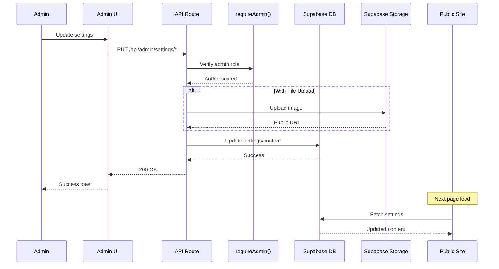

# Phase 9: Admin Settings & Content Management - Technical Design Document

## Overview

Phase 9 implements a comprehensive admin settings and content management system for The Puppy Day dog grooming SaaS application. This phase provides administrators with intuitive tools to manage public website content, promotional banners, booking system configuration, loyalty program settings, and staff management.

### Business Value

- **Operational Independence**: Enables non-technical administrators to manage business configuration without developer assistance
- **Marketing Agility**: Allows quick updates to promotions and website content
- **Scheduling Flexibility**: Provides control over booking rules, availability, and blocked dates
- **Customer Retention**: Configurable loyalty program to incentivize repeat visits
- **Multi-Groomer Support**: Foundation for scaling to multiple staff members

### Key Design Decisions

| Decision | Choice | Rationale |
|----------|--------|-----------|
| Settings Storage | `settings` table with key-value JSONB | Flexible schema, matches existing patterns |
| Site Content Storage | `site_content` table with key-value structure | Already exists, supports arbitrary content types |
| Image Storage | Supabase Storage buckets | Consistent with gallery implementation |
| API Pattern | Next.js API Routes with `requireAdmin()` | Matches existing admin API patterns |
| State Management | React useState + form state | Appropriate for settings pages; no global state needed |
| Real-time Updates | Immediate database writes | Changes reflect on public site without deployment |

---

## Architecture

### System Architecture Diagram

```mermaid
graph TB
    subgraph "Admin Panel"
        AD[Admin Dashboard]
        SC[Site Content Manager]
        PB[Promo Banner Manager]
        BS[Booking Settings]
        LS[Loyalty Settings]
        SM[Staff Management]
    end

    subgraph "API Layer"
        API_SC[/api/admin/settings/site-content]
        API_PB[/api/admin/settings/banners]
        API_BS[/api/admin/settings/booking]
        API_LS[/api/admin/settings/loyalty]
        API_SM[/api/admin/settings/staff]
        API_UP[/api/admin/settings/upload]
    end

    subgraph "Database Layer"
        DB_SET[(settings)]
        DB_SC[(site_content)]
        DB_PB[(promo_banners)]
        DB_USER[(users)]
        DB_LOYALTY[(loyalty_settings)]
    end

    subgraph "Storage"
        SB_HERO[hero-images bucket]
        SB_BANNER[banner-images bucket]
    end

    subgraph "Public Site"
        MKT[Marketing Pages]
        BOOK[Booking Widget]
        LOYALTY[Loyalty Display]
    end

    AD --> SC & PB & BS & LS & SM

    SC --> API_SC --> DB_SC
    SC --> API_UP --> SB_HERO

    PB --> API_PB --> DB_PB
    PB --> API_UP --> SB_BANNER

    BS --> API_BS --> DB_SET
    LS --> API_LS --> DB_SET & DB_LOYALTY
    SM --> API_SM --> DB_USER

    DB_SC --> MKT
    DB_PB --> MKT
    DB_SET --> BOOK
    DB_LOYALTY --> LOYALTY
```

### Component Hierarchy

```
src/app/admin/settings/
  page.tsx                    # Settings dashboard/hub
  SettingsClient.tsx          # Existing - extend with new tabs

  site-content/
    page.tsx                  # Site content manager page
    SiteContentClient.tsx     # Client component
    components/
      HeroEditor.tsx          # Hero section editor
      SeoSettings.tsx         # SEO metadata editor
      BusinessInfoEditor.tsx  # Business info editor

  banners/
    page.tsx                  # Promo banner manager page
    BannersClient.tsx         # Client component
    components/
      BannerList.tsx          # Sortable banner list
      BannerEditor.tsx        # Banner create/edit form
      BannerAnalytics.tsx     # Click analytics view

  booking/
    page.tsx                  # Booking settings page
    BookingSettingsClient.tsx # Client component
    components/
      AdvanceBookingWindow.tsx
      CancellationPolicy.tsx
      BufferTimeSettings.tsx
      BusinessHoursEditor.tsx # Enhanced from existing
      BlockedDatesManager.tsx

  loyalty/
    page.tsx                  # Loyalty settings page
    LoyaltySettingsClient.tsx # Client component
    components/
      PunchCardConfig.tsx
      EarningRules.tsx
      RedemptionRules.tsx
      ReferralProgram.tsx

  staff/
    page.tsx                  # Staff management page
    StaffClient.tsx           # Client component
    components/
      StaffDirectory.tsx
      StaffForm.tsx
      CommissionSettings.tsx
      EarningsReport.tsx
```

### Data Flow



---

## Database Design

### Existing Tables (No Changes Required)

The following tables already exist and are sufficient for Phase 9:

- `settings` - Key-value store for configuration
- `site_content` - Key-value store for CMS content
- `promo_banners` - Banner records with scheduling
- `users` - Staff members (role: 'groomer' | 'admin')
- `loyalty_settings` - Punch card configuration
- `customer_loyalty` - Per-customer loyalty records

### New Settings Keys

Settings will be stored in the `settings` table using these keys:

```typescript
// Booking Settings
interface BookingSettings {
  min_advance_hours: number;        // Default: 24
  max_advance_days: number;         // Default: 30
  cancellation_cutoff_hours: number; // Default: 24
  buffer_minutes: number;           // Default: 15
  blocked_dates: BlockedDate[];     // Array of blocked dates
  recurring_blocked_days: number[]; // 0=Sunday, 1=Monday, etc.
}

interface BlockedDate {
  date: string;        // YYYY-MM-DD
  end_date?: string;   // Optional for ranges
  reason?: string;
}

// Loyalty Earning Rules
interface LoyaltyEarningRules {
  qualifying_services: string[];  // Service IDs, empty = all
  minimum_spend: number;          // Default: 0
  first_visit_bonus: number;      // Default: 0
}

// Loyalty Redemption Rules
interface LoyaltyRedemptionRules {
  eligible_services: string[];    // Service IDs eligible for free service
  expiration_days: number;        // 0 = never expires
  max_value?: number;             // Optional cap on free service value
}

// Referral Program
interface ReferralProgram {
  is_enabled: boolean;
  referrer_bonus_punches: number;  // Default: 1
  referee_bonus_punches: number;   // Default: 0
}

// Staff Commission (stored per-groomer)
interface StaffCommission {
  groomer_id: string;
  rate_type: 'percentage' | 'flat';
  rate: number;
  include_addons: boolean;
  service_overrides?: {
    service_id: string;
    rate: number;
  }[];
}
```

### Site Content Keys

Content stored in `site_content` table:

```typescript
// Hero Section
interface HeroContent {
  headline: string;           // Max 100 chars
  subheadline: string;        // Max 200 chars
  background_image_url: string;
  cta_buttons: {
    text: string;
    url: string;
    style: 'primary' | 'secondary';
  }[];
}

// SEO Settings
interface SeoSettings {
  page_title: string;         // Max 60 chars
  meta_description: string;   // Max 160 chars
  og_title: string;
  og_description: string;
  og_image_url: string;
}

// Business Info
interface BusinessInfo {
  name: string;
  address: string;
  city: string;
  state: string;
  zip: string;
  phone: string;
  email: string;
  social_links: {
    instagram?: string;
    facebook?: string;
    yelp?: string;
  };
}
```

### Promo Banner Table Enhancement

Add a column for tracking impressions:

```sql
-- Migration: Add impression tracking to promo_banners
ALTER TABLE public.promo_banners
ADD COLUMN IF NOT EXISTS impression_count INTEGER DEFAULT 0;

-- Add index for active banner queries
CREATE INDEX IF NOT EXISTS idx_promo_banners_active_dates
ON public.promo_banners(is_active, start_date, end_date);
```

### Staff Commission Table (New)

```sql
-- Migration: Create staff_commissions table
CREATE TABLE IF NOT EXISTS public.staff_commissions (
  id UUID PRIMARY KEY DEFAULT uuid_generate_v4(),
  groomer_id UUID NOT NULL REFERENCES public.users(id) ON DELETE CASCADE,
  rate_type TEXT DEFAULT 'percentage' CHECK (rate_type IN ('percentage', 'flat')),
  rate DECIMAL(10,2) DEFAULT 0,
  include_addons BOOLEAN DEFAULT false,
  service_overrides JSONB DEFAULT '[]',
  created_at TIMESTAMPTZ DEFAULT NOW(),
  updated_at TIMESTAMPTZ DEFAULT NOW(),
  UNIQUE(groomer_id)
);

-- RLS Policies
ALTER TABLE public.staff_commissions ENABLE ROW LEVEL SECURITY;

DROP POLICY IF EXISTS "Admins can manage commissions" ON public.staff_commissions;
CREATE POLICY "Admins can manage commissions" ON public.staff_commissions
  FOR ALL
  USING (
    EXISTS (
      SELECT 1 FROM public.users
      WHERE users.id = auth.uid()
      AND users.role = 'admin'
    )
  );

-- Groomers can view their own commission
DROP POLICY IF EXISTS "Groomers can view own commission" ON public.staff_commissions;
CREATE POLICY "Groomers can view own commission" ON public.staff_commissions
  FOR SELECT
  USING (groomer_id = auth.uid());

-- Trigger for updated_at
CREATE TRIGGER staff_commissions_updated_at
  BEFORE UPDATE ON public.staff_commissions
  FOR EACH ROW EXECUTE FUNCTION update_updated_at();
```

### Referral Codes Table (New)

```sql
-- Migration: Create referral_codes table
CREATE TABLE IF NOT EXISTS public.referral_codes (
  id UUID PRIMARY KEY DEFAULT uuid_generate_v4(),
  customer_id UUID NOT NULL REFERENCES public.users(id) ON DELETE CASCADE,
  code TEXT UNIQUE NOT NULL,
  uses_count INTEGER DEFAULT 0,
  max_uses INTEGER DEFAULT NULL, -- NULL = unlimited
  is_active BOOLEAN DEFAULT true,
  created_at TIMESTAMPTZ DEFAULT NOW()
);

-- Referral tracking
CREATE TABLE IF NOT EXISTS public.referrals (
  id UUID PRIMARY KEY DEFAULT uuid_generate_v4(),
  referrer_id UUID NOT NULL REFERENCES public.users(id),
  referee_id UUID NOT NULL REFERENCES public.users(id),
  referral_code_id UUID NOT NULL REFERENCES public.referral_codes(id),
  status TEXT DEFAULT 'pending' CHECK (status IN ('pending', 'completed', 'expired')),
  referrer_bonus_awarded BOOLEAN DEFAULT false,
  referee_bonus_awarded BOOLEAN DEFAULT false,
  completed_at TIMESTAMPTZ,
  created_at TIMESTAMPTZ DEFAULT NOW(),
  UNIQUE(referee_id) -- Each customer can only be referred once
);

-- RLS Policies
ALTER TABLE public.referral_codes ENABLE ROW LEVEL SECURITY;
ALTER TABLE public.referrals ENABLE ROW LEVEL SECURITY;

CREATE POLICY "Customers can view own referral code" ON public.referral_codes
  FOR SELECT USING (customer_id = auth.uid() OR EXISTS (
    SELECT 1 FROM public.users WHERE users.id = auth.uid() AND users.role = 'admin'
  ));

CREATE POLICY "Admins can manage referrals" ON public.referrals
  FOR ALL USING (EXISTS (
    SELECT 1 FROM public.users WHERE users.id = auth.uid() AND users.role = 'admin'
  ));
```

### Audit Log Table (New)

For tracking sensitive settings changes:

```sql
-- Migration: Create settings_audit_log table
CREATE TABLE IF NOT EXISTS public.settings_audit_log (
  id UUID PRIMARY KEY DEFAULT uuid_generate_v4(),
  admin_id UUID NOT NULL REFERENCES public.users(id),
  setting_type TEXT NOT NULL, -- 'booking', 'loyalty', 'site_content', 'banner', 'staff'
  setting_key TEXT NOT NULL,
  old_value JSONB,
  new_value JSONB,
  created_at TIMESTAMPTZ DEFAULT NOW()
);

CREATE INDEX idx_audit_log_admin ON public.settings_audit_log(admin_id);
CREATE INDEX idx_audit_log_type ON public.settings_audit_log(setting_type);
CREATE INDEX idx_audit_log_created ON public.settings_audit_log(created_at DESC);

ALTER TABLE public.settings_audit_log ENABLE ROW LEVEL SECURITY;

CREATE POLICY "Admins can view audit log" ON public.settings_audit_log
  FOR SELECT USING (EXISTS (
    SELECT 1 FROM public.users WHERE users.id = auth.uid() AND users.role = 'admin'
  ));

CREATE POLICY "System can insert audit log" ON public.settings_audit_log
  FOR INSERT WITH CHECK (true);
```

---

## API Design

### API Route Structure

```
src/app/api/admin/settings/
  site-content/
    route.ts              # GET, PUT - Site content CRUD
    upload/
      route.ts            # POST - Hero image upload

  banners/
    route.ts              # GET, POST - List and create banners
    [id]/
      route.ts            # GET, PUT, DELETE - Individual banner
      analytics/
        route.ts          # GET - Banner analytics
    reorder/
      route.ts            # PUT - Update display order
    upload/
      route.ts            # POST - Banner image upload

  booking/
    route.ts              # GET, PUT - Booking settings
    blocked-dates/
      route.ts            # GET, POST, DELETE - Blocked dates management

  loyalty/
    route.ts              # GET, PUT - Loyalty program settings
    earning-rules/
      route.ts            # GET, PUT - Earning rules
    redemption-rules/
      route.ts            # GET, PUT - Redemption rules
    referral/
      route.ts            # GET, PUT - Referral program settings

  staff/
    route.ts              # GET, POST - Staff list and create
    [id]/
      route.ts            # GET, PUT, DELETE - Individual staff
      commission/
        route.ts          # GET, PUT - Staff commission
    earnings/
      route.ts            # GET - Earnings report
```

### API Specifications

#### Site Content API

**GET /api/admin/settings/site-content**
```typescript
// Response
{
  hero: HeroContent;
  seo: SeoSettings;
  business_info: BusinessInfo;
  last_updated: string;
}
```

**PUT /api/admin/settings/site-content**
```typescript
// Request
{
  section: 'hero' | 'seo' | 'business_info';
  data: HeroContent | SeoSettings | BusinessInfo;
}

// Response
{
  success: true;
  updated_at: string;
}
```

**POST /api/admin/settings/site-content/upload**
```typescript
// Request: FormData with 'file' field
// Max size: 5MB
// Accepted types: image/jpeg, image/png, image/webp

// Response
{
  url: string;
  width: number;
  height: number;
}
```

#### Promo Banners API

**GET /api/admin/settings/banners**
```typescript
// Query params: status=all|active|scheduled|expired|draft

// Response
{
  banners: PromoBanner[];
  total: number;
}
```

**POST /api/admin/settings/banners**
```typescript
// Request
{
  image_url: string;
  alt_text: string;
  click_url?: string;
  start_date?: string; // ISO date
  end_date?: string;   // ISO date
  is_active?: boolean;
}

// Response
{
  banner: PromoBanner;
}
```

**PUT /api/admin/settings/banners/[id]**
```typescript
// Request - partial update
{
  alt_text?: string;
  click_url?: string;
  start_date?: string;
  end_date?: string;
  is_active?: boolean;
}

// Response
{
  banner: PromoBanner;
}
```

**PUT /api/admin/settings/banners/reorder**
```typescript
// Request
{
  order: {
    id: string;
    display_order: number;
  }[];
}

// Response
{
  success: true;
}
```

**GET /api/admin/settings/banners/[id]/analytics**
```typescript
// Query params: period=7d|30d|90d|custom&start=YYYY-MM-DD&end=YYYY-MM-DD

// Response
{
  banner_id: string;
  total_clicks: number;
  total_impressions: number;
  ctr: number; // Click-through rate
  clicks_by_date: {
    date: string;
    clicks: number;
  }[];
  comparison: {
    previous_period_clicks: number;
    change_percent: number;
  };
}
```

#### Booking Settings API

**GET /api/admin/settings/booking**
```typescript
// Response
{
  min_advance_hours: number;
  max_advance_days: number;
  cancellation_cutoff_hours: number;
  buffer_minutes: number;
  business_hours: BusinessHours;
  blocked_dates: BlockedDate[];
  recurring_blocked_days: number[];
}
```

**PUT /api/admin/settings/booking**
```typescript
// Request - partial update
{
  min_advance_hours?: number;
  max_advance_days?: number;
  cancellation_cutoff_hours?: number;
  buffer_minutes?: number;
  business_hours?: BusinessHours;
  recurring_blocked_days?: number[];
}

// Response
{
  success: true;
  settings: BookingSettings;
}
```

**POST /api/admin/settings/booking/blocked-dates**
```typescript
// Request
{
  date: string;        // YYYY-MM-DD
  end_date?: string;   // For ranges
  reason?: string;
}

// Response
{
  success: true;
  blocked_date: BlockedDate;
  affected_appointments: number; // Count of existing appointments
}
```

**DELETE /api/admin/settings/booking/blocked-dates**
```typescript
// Request
{
  date: string; // or dates: string[] for multiple
}

// Response
{
  success: true;
}
```

#### Loyalty Settings API

**GET /api/admin/settings/loyalty**
```typescript
// Response
{
  is_enabled: boolean;
  punch_threshold: number;
  earning_rules: LoyaltyEarningRules;
  redemption_rules: LoyaltyRedemptionRules;
  referral_program: ReferralProgram;
  stats: {
    active_customers: number;
    total_rewards_redeemed: number;
    pending_rewards: number;
  };
}
```

**PUT /api/admin/settings/loyalty**
```typescript
// Request - partial update
{
  is_enabled?: boolean;
  punch_threshold?: number;
}

// Response
{
  success: true;
  settings: LoyaltySettings;
}
```

**PUT /api/admin/settings/loyalty/earning-rules**
```typescript
// Request
{
  qualifying_services: string[];
  minimum_spend: number;
  first_visit_bonus: number;
}

// Response
{
  success: true;
  affected_customers: number; // Informational
}
```

#### Staff Management API

**GET /api/admin/settings/staff**
```typescript
// Query params: status=all|active|inactive

// Response
{
  staff: (User & {
    appointment_count: number;
    upcoming_appointments: number;
    avg_rating?: number;
    commission?: StaffCommission;
  })[];
}
```

**POST /api/admin/settings/staff**
```typescript
// Request
{
  email: string;
  first_name: string;
  last_name: string;
  phone?: string;
  role: 'groomer' | 'admin';
}

// Response
{
  staff: User;
}
```

**PUT /api/admin/settings/staff/[id]/commission**
```typescript
// Request
{
  rate_type: 'percentage' | 'flat';
  rate: number;
  include_addons: boolean;
  service_overrides?: {
    service_id: string;
    rate: number;
  }[];
}

// Response
{
  commission: StaffCommission;
}
```

**GET /api/admin/settings/staff/earnings**
```typescript
// Query params:
// groomer_id (optional)
// start_date=YYYY-MM-DD
// end_date=YYYY-MM-DD
// group_by=day|week|month

// Response
{
  summary: {
    total_services: number;
    total_revenue: number;
    total_commission: number;
    total_tips: number;
  };
  by_groomer: {
    groomer_id: string;
    groomer_name: string;
    services: number;
    revenue: number;
    commission: number;
    tips: number;
    avg_appointment_value: number;
  }[];
  timeline: {
    period: string;
    services: number;
    revenue: number;
    commission: number;
  }[];
}
```

### Error Handling

All API routes follow consistent error response format:

```typescript
// Error Response
{
  error: string;           // User-friendly message
  code?: string;           // Machine-readable code
  details?: unknown;       // Additional context
}

// HTTP Status Codes
// 400 - Bad Request (validation errors)
// 401 - Unauthorized (not authenticated)
// 403 - Forbidden (not admin)
// 404 - Not Found
// 409 - Conflict (e.g., date already blocked)
// 500 - Internal Server Error
```

### Rate Limiting

Apply rate limiting to prevent abuse:

```typescript
// Rate limits per route group
const RATE_LIMITS = {
  settings_read: { window: '1m', max: 60 },
  settings_write: { window: '1m', max: 30 },
  file_upload: { window: '1m', max: 10 },
  analytics: { window: '1m', max: 20 },
};
```

---

## UI Components

### Settings Dashboard (Requirement 21)

The main settings hub with navigation cards:

```tsx
// src/app/admin/settings/page.tsx
interface SettingsSection {
  id: string;
  title: string;
  description: string;
  icon: LucideIcon;
  href: string;
  status: 'configured' | 'needs_attention' | 'not_configured';
  lastUpdated?: string;
  summary?: string;
}

const sections: SettingsSection[] = [
  {
    id: 'site-content',
    title: 'Site Content',
    description: 'Hero section, SEO, and business info',
    icon: FileText,
    href: '/admin/settings/site-content',
    status: 'configured',
    summary: 'Last updated 2 days ago'
  },
  // ... more sections
];
```

### Site Content Manager

#### Hero Editor Component

```tsx
interface HeroEditorProps {
  initialData: HeroContent;
  onSave: (data: HeroContent) => Promise<void>;
}

// Features:
// - Character counters for headline (100) and subheadline (200)
// - Image upload with drag-drop
// - Live preview panel
// - CTA button editor (up to 2 buttons)
// - Image dimension validation (1920x800 min)
```

#### SEO Settings Component

```tsx
interface SeoSettingsProps {
  initialData: SeoSettings;
  onSave: (data: SeoSettings) => Promise<void>;
}

// Features:
// - Character counters for title (60) and description (160)
// - Google search result preview
// - Open Graph preview
// - Validation warnings for empty fields
```

### Promo Banner Manager

#### Banner List with Drag-Drop

```tsx
interface BannerListProps {
  banners: PromoBanner[];
  onReorder: (newOrder: { id: string; display_order: number }[]) => void;
  onToggleActive: (id: string, isActive: boolean) => void;
  onEdit: (id: string) => void;
  onDelete: (id: string) => void;
}

// Status badges:
// - "Draft" - not active, no dates
// - "Scheduled" - has start_date in future
// - "Active" - is_active and within date range
// - "Expired" - end_date has passed
```

#### Banner Editor Modal

```tsx
interface BannerEditorProps {
  banner?: PromoBanner; // undefined for create
  onSave: (data: Partial<PromoBanner>) => Promise<void>;
  onClose: () => void;
}

// Features:
// - Image upload with preview
// - Alt text input (required)
// - Click URL with validation
// - Date pickers for scheduling
// - Preview of banner appearance
```

### Booking Settings

#### Advance Booking Window

```tsx
interface AdvanceBookingWindowProps {
  minHours: number;
  maxDays: number;
  onChange: (settings: { minHours?: number; maxDays?: number }) => void;
}

// UI:
// - Slider + input for min hours (0-168)
// - Slider + input for max days (7-365)
// - Warning when min_hours > 24 (disables same-day)
```

#### Blocked Dates Manager

```tsx
interface BlockedDatesManagerProps {
  blockedDates: BlockedDate[];
  recurringBlocked: number[];
  onAddDate: (date: BlockedDate) => void;
  onRemoveDate: (date: string) => void;
  onToggleRecurring: (day: number) => void;
}

// Features:
// - Calendar view with blocked dates highlighted
// - Click to add/remove single dates
// - Date range picker for multi-day blocks
// - Reason input for documentation
// - Recurring day toggles (e.g., always closed Sunday)
// - Warning when appointments exist on selected date
```

### Loyalty Settings

#### Punch Card Configuration

```tsx
interface PunchCardConfigProps {
  isEnabled: boolean;
  threshold: number;
  onToggle: () => void;
  onThresholdChange: (value: number) => void;
  stats: {
    activeCustomers: number;
    totalRedeemed: number;
  };
}

// UI:
// - Enable/disable toggle with confirmation
// - Threshold selector (5-20) with visual punch card preview
// - Stats summary cards
```

#### Earning Rules Form

```tsx
interface EarningRulesFormProps {
  rules: LoyaltyEarningRules;
  services: Service[];
  onChange: (rules: LoyaltyEarningRules) => void;
}

// Features:
// - Multi-select for qualifying services
// - Minimum spend threshold input
// - First visit bonus toggle with punch count
// - Preview of affected customers count
```

### Staff Management

#### Staff Directory

```tsx
interface StaffDirectoryProps {
  staff: StaffMember[];
  onEdit: (id: string) => void;
  onDeactivate: (id: string) => void;
  viewMode: 'grid' | 'list';
}

// Features:
// - Card or table view toggle
// - Status indicators (active/inactive)
// - Quick stats per groomer
// - Search/filter functionality
```

#### Commission Settings

```tsx
interface CommissionSettingsProps {
  groomer: User;
  commission: StaffCommission | null;
  services: Service[];
  onSave: (commission: StaffCommission) => void;
}

// Features:
// - Rate type selector (percentage/flat)
// - Base rate input
// - Per-service override table
// - Include addons toggle
// - Preview calculation example
```

#### Earnings Report

```tsx
interface EarningsReportProps {
  dateRange: { start: Date; end: Date };
  groupBy: 'day' | 'week' | 'month';
  groomerId?: string;
}

// Features:
// - Date range picker
// - Groomer filter dropdown
// - Summary cards (total services, revenue, commission)
// - Bar chart for timeline view
// - Detailed table with export (CSV/PDF)
// - Previous period comparison
```

### Form Patterns

All settings forms follow consistent patterns:

```tsx
interface SettingsFormProps<T> {
  initialData: T;
  onSave: (data: T) => Promise<void>;
  validationSchema: ZodSchema<T>;
}

// Shared behaviors:
// - Unsaved changes indicator
// - Leave page confirmation dialog
// - Inline validation errors
// - Optimistic UI updates
// - Error state with retry
// - Success toast notifications
```

---

## Integration Points

### Booking System Integration

Settings affect availability calculation:

```typescript
// Enhanced availability.ts
export async function getAvailableSlots(
  date: string,
  serviceDuration: number,
  existingAppointments: Appointment[],
  settings: BookingSettings
): TimeSlot[] {
  const {
    business_hours,
    buffer_minutes,
    blocked_dates,
    recurring_blocked_days,
    min_advance_hours,
    max_advance_days
  } = settings;

  // Check if date is blocked
  if (isDateBlocked(date, blocked_dates, recurring_blocked_days)) {
    return [];
  }

  // Check if date is within booking window
  if (!isWithinBookingWindow(date, min_advance_hours, max_advance_days)) {
    return [];
  }

  // Existing logic with buffer time applied
  return slots.map(slot => ({
    ...slot,
    available: !hasConflict(
      slot.time,
      serviceDuration + buffer_minutes,
      existingAppointments,
      date
    )
  }));
}
```

### Public Site Integration

Site content updates immediately reflect:

```tsx
// Marketing page server component
export default async function HomePage() {
  const supabase = await createServerSupabaseClient();

  // Fetch site content (no caching for real-time updates)
  const { data: heroContent } = await supabase
    .from('site_content')
    .select('content')
    .eq('key', 'hero')
    .single();

  const { data: activeBanners } = await supabase
    .from('promo_banners')
    .select('*')
    .eq('is_active', true)
    .lte('start_date', new Date().toISOString())
    .or('end_date.is.null,end_date.gte.' + new Date().toISOString())
    .order('display_order');

  return (
    <>
      <HeroSection content={heroContent?.content} />
      <PromoBannerCarousel banners={activeBanners || []} />
    </>
  );
}
```

### Loyalty System Integration

Earning rules checked on appointment completion:

```typescript
// In appointment completion handler
async function awardLoyaltyPunch(
  appointment: Appointment,
  loyaltySettings: LoyaltySettings
) {
  const { earning_rules, is_enabled } = loyaltySettings;

  if (!is_enabled) return;

  // Check if service qualifies
  if (
    earning_rules.qualifying_services.length > 0 &&
    !earning_rules.qualifying_services.includes(appointment.service_id)
  ) {
    return;
  }

  // Check minimum spend
  if (appointment.total_price < earning_rules.minimum_spend) {
    return;
  }

  // Award punch (existing logic)
  await awardPunch(appointment.customer_id, appointment.id);
}
```

### Notification System Integration

Business info changes update notification templates:

```typescript
// When business info is updated
async function onBusinessInfoUpdate(newInfo: BusinessInfo) {
  // Update template variables that use business info
  await updateTemplateVariables({
    business_name: newInfo.name,
    business_phone: newInfo.phone,
    business_email: newInfo.email,
    business_address: formatAddress(newInfo),
  });
}
```

---

## Security Considerations

### Authentication & Authorization

All settings endpoints require admin authentication:

```typescript
// Standard pattern for all settings API routes
export async function PUT(request: NextRequest) {
  try {
    const supabase = await createServerSupabaseClient();
    const { user } = await requireAdmin(supabase); // Throws if not admin

    // Audit log for sensitive changes
    await logSettingsChange({
      admin_id: user.id,
      setting_type: 'booking',
      setting_key: 'buffer_minutes',
      old_value: existingValue,
      new_value: newValue,
    });

    // Process request...
  } catch (error) {
    if (error.message.includes('Unauthorized')) {
      return NextResponse.json({ error: 'Unauthorized' }, { status: 403 });
    }
    throw error;
  }
}
```

### Input Validation

All inputs validated with Zod schemas:

```typescript
import { z } from 'zod';

const HeroContentSchema = z.object({
  headline: z.string().min(1).max(100),
  subheadline: z.string().max(200),
  background_image_url: z.string().url(),
  cta_buttons: z.array(z.object({
    text: z.string().min(1).max(30),
    url: z.string().url(),
    style: z.enum(['primary', 'secondary']),
  })).max(2),
});

const BookingSettingsSchema = z.object({
  min_advance_hours: z.number().min(0).max(168),
  max_advance_days: z.number().min(7).max(365),
  cancellation_cutoff_hours: z.number().min(0).max(72),
  buffer_minutes: z.number().min(0).max(60),
});
```

### File Upload Security

```typescript
// Validate uploads
const ALLOWED_TYPES = ['image/jpeg', 'image/png', 'image/webp', 'image/gif'];
const MAX_FILE_SIZE = 5 * 1024 * 1024; // 5MB

function validateUpload(file: File): { valid: boolean; error?: string } {
  if (!ALLOWED_TYPES.includes(file.type)) {
    return { valid: false, error: 'Invalid file type' };
  }

  if (file.size > MAX_FILE_SIZE) {
    return { valid: false, error: 'File too large (max 5MB)' };
  }

  return { valid: true };
}

// Additional server-side validation
async function processUpload(file: File) {
  // Verify file is actually an image
  const buffer = await file.arrayBuffer();
  const fileType = await fileTypeFromBuffer(buffer);

  if (!fileType || !ALLOWED_TYPES.includes(fileType.mime)) {
    throw new Error('Invalid file content');
  }

  // Generate safe filename
  const ext = fileType.ext;
  const filename = `${crypto.randomUUID()}.${ext}`;

  // Upload to storage
  return uploadToStorage(filename, buffer);
}
```

### XSS Prevention

All user input sanitized before storage:

```typescript
import DOMPurify from 'isomorphic-dompurify';

function sanitizeText(input: string): string {
  return DOMPurify.sanitize(input, { ALLOWED_TAGS: [] });
}

function sanitizeHtml(input: string): string {
  return DOMPurify.sanitize(input, {
    ALLOWED_TAGS: ['b', 'i', 'em', 'strong', 'a'],
    ALLOWED_ATTR: ['href'],
  });
}
```

---

## Error Handling

### Client-Side Error States

```tsx
interface FormState {
  status: 'idle' | 'loading' | 'success' | 'error';
  error?: string;
  retryCount: number;
}

function useSettingsForm<T>(
  fetchFn: () => Promise<T>,
  saveFn: (data: T) => Promise<void>
) {
  const [state, setState] = useState<FormState>({
    status: 'idle',
    retryCount: 0
  });

  const save = async (data: T) => {
    setState({ status: 'loading', retryCount: state.retryCount });
    try {
      await saveFn(data);
      setState({ status: 'success', retryCount: 0 });
    } catch (error) {
      setState({
        status: 'error',
        error: error.message,
        retryCount: state.retryCount + 1
      });
    }
  };

  return { state, save };
}
```

### Server-Side Error Handling

```typescript
// Consistent error response builder
function errorResponse(
  message: string,
  status: number,
  code?: string
): NextResponse {
  console.error(`[Settings API] ${message}`);
  return NextResponse.json(
    { error: message, code },
    { status }
  );
}

// Try-catch wrapper for all endpoints
async function withErrorHandling(
  handler: () => Promise<NextResponse>
): Promise<NextResponse> {
  try {
    return await handler();
  } catch (error) {
    if (error.message.includes('Unauthorized')) {
      return errorResponse('Admin access required', 403, 'UNAUTHORIZED');
    }
    if (error.code === 'PGRST116') { // Row not found
      return errorResponse('Resource not found', 404, 'NOT_FOUND');
    }
    console.error('[Settings API] Unhandled error:', error);
    return errorResponse('Internal server error', 500, 'INTERNAL_ERROR');
  }
}
```

---

## Testing Strategy

### Unit Tests

```typescript
// Settings validation tests
describe('BookingSettings validation', () => {
  it('rejects min_advance_hours > 168', () => {
    expect(() =>
      BookingSettingsSchema.parse({ min_advance_hours: 200 })
    ).toThrow();
  });

  it('validates buffer_minutes in 5-minute increments', () => {
    expect(validateBufferMinutes(15)).toBe(true);
    expect(validateBufferMinutes(17)).toBe(false);
  });
});

// Availability calculation tests
describe('getAvailableSlots with blocked dates', () => {
  it('returns empty for blocked dates', () => {
    const settings = {
      blocked_dates: [{ date: '2024-12-25', reason: 'Holiday' }],
    };
    const slots = getAvailableSlots('2024-12-25', 60, [], settings);
    expect(slots).toHaveLength(0);
  });
});
```

### Integration Tests

```typescript
// API endpoint tests
describe('POST /api/admin/settings/banners', () => {
  it('creates banner with valid data', async () => {
    const response = await fetch('/api/admin/settings/banners', {
      method: 'POST',
      headers: { 'Content-Type': 'application/json' },
      body: JSON.stringify({
        image_url: 'https://example.com/banner.jpg',
        alt_text: 'Holiday Sale',
      }),
    });

    expect(response.status).toBe(201);
    const data = await response.json();
    expect(data.banner.id).toBeDefined();
  });

  it('rejects unauthorized requests', async () => {
    // Without auth cookie
    const response = await fetch('/api/admin/settings/banners');
    expect(response.status).toBe(403);
  });
});
```

### E2E Tests

```typescript
// Playwright tests for settings UI
test.describe('Site Content Manager', () => {
  test.beforeEach(async ({ page }) => {
    await loginAsAdmin(page);
    await page.goto('/admin/settings/site-content');
  });

  test('updates hero headline', async ({ page }) => {
    await page.fill('[data-testid="hero-headline"]', 'New Headline');
    await page.click('[data-testid="save-button"]');
    await expect(page.locator('.toast-success')).toBeVisible();

    // Verify on public site
    await page.goto('/');
    await expect(page.locator('h1')).toContainText('New Headline');
  });

  test('validates character limits', async ({ page }) => {
    const longText = 'a'.repeat(101);
    await page.fill('[data-testid="hero-headline"]', longText);
    await expect(page.locator('.char-counter')).toContainText('101/100');
    await expect(page.locator('.validation-error')).toBeVisible();
  });
});
```

---

## Implementation Phases

### Phase 9.1: Settings Dashboard & Site Content (Requirements 1-3, 21)

**Tasks:**
1. Create settings dashboard hub page with navigation cards
2. Implement site content manager with hero editor
3. Add SEO settings with Google preview
4. Create business info editor with validation
5. Set up hero image upload with Supabase Storage bucket
6. Add audit logging for content changes

**Estimated effort:** 3-4 days

### Phase 9.2: Promo Banner Manager (Requirements 4-7)

**Tasks:**
1. Create banner list with drag-drop reordering
2. Implement banner creation with image upload
3. Add scheduling with date pickers
4. Build analytics dashboard with charts
5. Add banner click tracking endpoint
6. Implement impression tracking

**Estimated effort:** 3-4 days

### Phase 9.3: Booking Settings (Requirements 8-12)

**Tasks:**
1. Enhance existing business hours editor
2. Add advance booking window settings
3. Implement cancellation policy settings
4. Add buffer time configuration
5. Create blocked dates manager with calendar
6. Integrate settings with availability API

**Estimated effort:** 3-4 days

### Phase 9.4: Loyalty Program Settings (Requirements 13-16)

**Tasks:**
1. Create punch card configuration UI
2. Implement earning rules editor
3. Add redemption rules settings
4. Build referral program configuration
5. Create referral codes table and API
6. Integrate with existing loyalty system

**Estimated effort:** 3-4 days

### Phase 9.5: Staff Management (Requirements 17-20)

**Tasks:**
1. Create staff directory with grid/list views
2. Implement staff create/edit forms
3. Add commission settings per groomer
4. Build earnings report with charts
5. Create appointment assignment UI enhancements
6. Add groomer filtering to calendar

**Estimated effort:** 4-5 days

### Phase 9.6: Testing & Polish

**Tasks:**
1. Write unit tests for validation logic
2. Add integration tests for API endpoints
3. Create E2E tests for critical flows
4. Performance optimization
5. Documentation updates
6. Bug fixes and refinements

**Estimated effort:** 2-3 days

**Total estimated effort:** 18-24 days

---

## Appendix

### Migration Scripts

```sql
-- Full migration script for Phase 9
-- File: supabase/migrations/20241217_phase9_admin_settings.sql

-- 1. Add impression_count to promo_banners
ALTER TABLE public.promo_banners
ADD COLUMN IF NOT EXISTS impression_count INTEGER DEFAULT 0;

-- 2. Create staff_commissions table
CREATE TABLE IF NOT EXISTS public.staff_commissions (
  id UUID PRIMARY KEY DEFAULT uuid_generate_v4(),
  groomer_id UUID NOT NULL REFERENCES public.users(id) ON DELETE CASCADE,
  rate_type TEXT DEFAULT 'percentage' CHECK (rate_type IN ('percentage', 'flat')),
  rate DECIMAL(10,2) DEFAULT 0,
  include_addons BOOLEAN DEFAULT false,
  service_overrides JSONB DEFAULT '[]',
  created_at TIMESTAMPTZ DEFAULT NOW(),
  updated_at TIMESTAMPTZ DEFAULT NOW(),
  UNIQUE(groomer_id)
);

-- 3. Create referral tables
CREATE TABLE IF NOT EXISTS public.referral_codes (
  id UUID PRIMARY KEY DEFAULT uuid_generate_v4(),
  customer_id UUID NOT NULL REFERENCES public.users(id) ON DELETE CASCADE,
  code TEXT UNIQUE NOT NULL,
  uses_count INTEGER DEFAULT 0,
  max_uses INTEGER DEFAULT NULL,
  is_active BOOLEAN DEFAULT true,
  created_at TIMESTAMPTZ DEFAULT NOW()
);

CREATE TABLE IF NOT EXISTS public.referrals (
  id UUID PRIMARY KEY DEFAULT uuid_generate_v4(),
  referrer_id UUID NOT NULL REFERENCES public.users(id),
  referee_id UUID NOT NULL REFERENCES public.users(id),
  referral_code_id UUID NOT NULL REFERENCES public.referral_codes(id),
  status TEXT DEFAULT 'pending' CHECK (status IN ('pending', 'completed', 'expired')),
  referrer_bonus_awarded BOOLEAN DEFAULT false,
  referee_bonus_awarded BOOLEAN DEFAULT false,
  completed_at TIMESTAMPTZ,
  created_at TIMESTAMPTZ DEFAULT NOW(),
  UNIQUE(referee_id)
);

-- 4. Create settings audit log
CREATE TABLE IF NOT EXISTS public.settings_audit_log (
  id UUID PRIMARY KEY DEFAULT uuid_generate_v4(),
  admin_id UUID NOT NULL REFERENCES public.users(id),
  setting_type TEXT NOT NULL,
  setting_key TEXT NOT NULL,
  old_value JSONB,
  new_value JSONB,
  created_at TIMESTAMPTZ DEFAULT NOW()
);

-- 5. Create indexes
CREATE INDEX IF NOT EXISTS idx_promo_banners_active_dates
ON public.promo_banners(is_active, start_date, end_date);

CREATE INDEX IF NOT EXISTS idx_audit_log_admin ON public.settings_audit_log(admin_id);
CREATE INDEX IF NOT EXISTS idx_audit_log_type ON public.settings_audit_log(setting_type);
CREATE INDEX IF NOT EXISTS idx_audit_log_created ON public.settings_audit_log(created_at DESC);

CREATE INDEX IF NOT EXISTS idx_referral_codes_customer ON public.referral_codes(customer_id);
CREATE INDEX IF NOT EXISTS idx_referrals_referrer ON public.referrals(referrer_id);

-- 6. Enable RLS
ALTER TABLE public.staff_commissions ENABLE ROW LEVEL SECURITY;
ALTER TABLE public.referral_codes ENABLE ROW LEVEL SECURITY;
ALTER TABLE public.referrals ENABLE ROW LEVEL SECURITY;
ALTER TABLE public.settings_audit_log ENABLE ROW LEVEL SECURITY;

-- 7. RLS Policies for staff_commissions
CREATE POLICY "Admins can manage commissions" ON public.staff_commissions
  FOR ALL USING (EXISTS (
    SELECT 1 FROM public.users WHERE users.id = auth.uid() AND users.role = 'admin'
  ));

CREATE POLICY "Groomers can view own commission" ON public.staff_commissions
  FOR SELECT USING (groomer_id = auth.uid());

-- 8. RLS Policies for referrals
CREATE POLICY "Customers can view own referral code" ON public.referral_codes
  FOR SELECT USING (customer_id = auth.uid() OR EXISTS (
    SELECT 1 FROM public.users WHERE users.id = auth.uid() AND users.role = 'admin'
  ));

CREATE POLICY "Admins can manage referral codes" ON public.referral_codes
  FOR ALL USING (EXISTS (
    SELECT 1 FROM public.users WHERE users.id = auth.uid() AND users.role = 'admin'
  ));

CREATE POLICY "Admins can manage referrals" ON public.referrals
  FOR ALL USING (EXISTS (
    SELECT 1 FROM public.users WHERE users.id = auth.uid() AND users.role = 'admin'
  ));

-- 9. RLS Policies for audit log
CREATE POLICY "Admins can view audit log" ON public.settings_audit_log
  FOR SELECT USING (EXISTS (
    SELECT 1 FROM public.users WHERE users.id = auth.uid() AND users.role = 'admin'
  ));

CREATE POLICY "System can insert audit log" ON public.settings_audit_log
  FOR INSERT WITH CHECK (true);

-- 10. Triggers
CREATE TRIGGER staff_commissions_updated_at
  BEFORE UPDATE ON public.staff_commissions
  FOR EACH ROW EXECUTE FUNCTION update_updated_at();

-- 11. Insert default settings
INSERT INTO public.settings (key, value) VALUES
  ('booking_settings', '{
    "min_advance_hours": 24,
    "max_advance_days": 30,
    "cancellation_cutoff_hours": 24,
    "buffer_minutes": 15,
    "blocked_dates": [],
    "recurring_blocked_days": []
  }'),
  ('loyalty_earning_rules', '{
    "qualifying_services": [],
    "minimum_spend": 0,
    "first_visit_bonus": 0
  }'),
  ('loyalty_redemption_rules', '{
    "eligible_services": [],
    "expiration_days": 0
  }'),
  ('referral_program', '{
    "is_enabled": false,
    "referrer_bonus_punches": 1,
    "referee_bonus_punches": 0
  }')
ON CONFLICT (key) DO NOTHING;

-- 12. Insert default site content
INSERT INTO public.site_content (key, content) VALUES
  ('hero', '{
    "headline": "Professional Dog Grooming in La Mirada",
    "subheadline": "Where every pup gets the royal treatment",
    "background_image_url": "",
    "cta_buttons": [
      {"text": "Book Now", "url": "/book", "style": "primary"}
    ]
  }'),
  ('seo', '{
    "page_title": "Puppy Day - Dog Grooming La Mirada, CA",
    "meta_description": "Professional dog grooming services in La Mirada. Basic and premium grooming packages for all sizes.",
    "og_title": "Puppy Day Dog Grooming",
    "og_description": "",
    "og_image_url": ""
  }'),
  ('business_info', '{
    "name": "Puppy Day",
    "address": "14936 Leffingwell Rd",
    "city": "La Mirada",
    "state": "CA",
    "zip": "90638",
    "phone": "(657) 252-2903",
    "email": "puppyday14936@gmail.com",
    "social_links": {
      "instagram": "https://instagram.com/puppyday_lm",
      "yelp": ""
    }
  }')
ON CONFLICT (key) DO NOTHING;
```

### TypeScript Type Definitions

```typescript
// src/types/settings.ts - Add to existing file

// Booking Settings
export interface BookingSettings {
  min_advance_hours: number;
  max_advance_days: number;
  cancellation_cutoff_hours: number;
  buffer_minutes: number;
  blocked_dates: BlockedDate[];
  recurring_blocked_days: number[];
}

export interface BlockedDate {
  date: string;
  end_date?: string;
  reason?: string;
}

// Site Content
export interface HeroContent {
  headline: string;
  subheadline: string;
  background_image_url: string;
  cta_buttons: {
    text: string;
    url: string;
    style: 'primary' | 'secondary';
  }[];
}

export interface SeoSettings {
  page_title: string;
  meta_description: string;
  og_title: string;
  og_description: string;
  og_image_url: string;
}

export interface BusinessInfo {
  name: string;
  address: string;
  city: string;
  state: string;
  zip: string;
  phone: string;
  email: string;
  social_links: {
    instagram?: string;
    facebook?: string;
    yelp?: string;
  };
}

// Loyalty Settings
export interface LoyaltyEarningRules {
  qualifying_services: string[];
  minimum_spend: number;
  first_visit_bonus: number;
}

export interface LoyaltyRedemptionRules {
  eligible_services: string[];
  expiration_days: number;
  max_value?: number;
}

export interface ReferralProgram {
  is_enabled: boolean;
  referrer_bonus_punches: number;
  referee_bonus_punches: number;
}

// Staff Commission
export interface StaffCommission {
  id: string;
  groomer_id: string;
  rate_type: 'percentage' | 'flat';
  rate: number;
  include_addons: boolean;
  service_overrides?: {
    service_id: string;
    rate: number;
  }[];
  created_at: string;
  updated_at: string;
}

// Referral
export interface ReferralCode {
  id: string;
  customer_id: string;
  code: string;
  uses_count: number;
  max_uses: number | null;
  is_active: boolean;
  created_at: string;
}

export interface Referral {
  id: string;
  referrer_id: string;
  referee_id: string;
  referral_code_id: string;
  status: 'pending' | 'completed' | 'expired';
  referrer_bonus_awarded: boolean;
  referee_bonus_awarded: boolean;
  completed_at: string | null;
  created_at: string;
}

// Audit Log
export interface SettingsAuditLog {
  id: string;
  admin_id: string;
  setting_type: 'booking' | 'loyalty' | 'site_content' | 'banner' | 'staff';
  setting_key: string;
  old_value: unknown;
  new_value: unknown;
  created_at: string;
}
```

### Supabase Storage Bucket Configuration

```typescript
// Storage buckets needed for Phase 9

const PHASE_9_BUCKETS = [
  {
    name: 'hero-images',
    public: true,
    allowedMimeTypes: ['image/jpeg', 'image/png', 'image/webp'],
    fileSizeLimit: 5 * 1024 * 1024, // 5MB
  },
  {
    name: 'banner-images',
    public: true,
    allowedMimeTypes: ['image/jpeg', 'image/png', 'image/webp', 'image/gif'],
    fileSizeLimit: 2 * 1024 * 1024, // 2MB
  },
];

// Bucket policies (in Supabase dashboard or migration)
// - Public read access (objects are publicly accessible via URL)
// - Authenticated upload (only logged-in users can upload)
// - Admin delete (only admins can delete via RLS)
```

---

## Document History

| Version | Date | Author | Changes |
|---------|------|--------|---------|
| 1.0 | 2024-12-17 | System | Initial design document |
