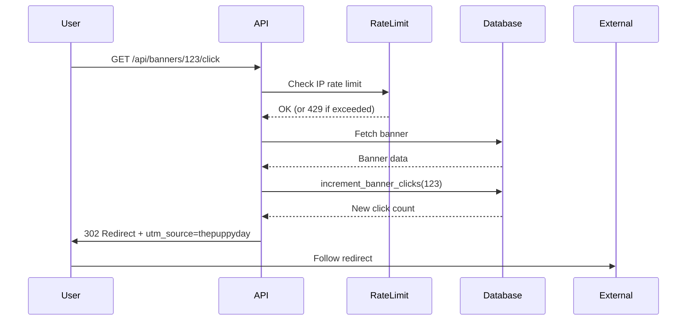

# Banner Click Tracking - Developer Guide

## Quick Start

### Basic Usage

```tsx
// In your banner component
<a href={`/api/banners/${bannerId}/click`}>
  
</a>
```

That's it! The endpoint handles:
- Click tracking
- Redirect to target URL
- UTM parameter injection
- Rate limiting
- Analytics logging

## How It Works



## Rate Limiting

**Default Limits:**
- 100 clicks per IP address
- Per 60-second window
- Automatic cleanup of old entries

**Response when limited:**
```json
HTTP/1.1 429 Too Many Requests
Retry-After: 45

{
  "error": "Too many requests",
  "message": "Rate limit exceeded. Please try again later."
}
```

## Error Handling

| Status | Meaning | User Impact |
|--------|---------|-------------|
| 302 | Success | Redirected to target URL |
| 404 | Banner not found/inactive | No redirect |
| 429 | Rate limited | Try again later |
| 500 | Server error | Logged, user may see error |

**Important:** The endpoint always tries to redirect even if tracking fails.

## UTM Parameter Injection

All redirects automatically include `utm_source=thepuppyday`.

**Examples:**

Original URL: `https://example.com/promo`
Redirect to: `https://example.com/promo?utm_source=thepuppyday`

Original URL: `https://example.com/sale?discount=20`
Redirect to: `https://example.com/sale?discount=20&utm_source=thepuppyday`

Original URL: `https://example.com/page#section`
Redirect to: `https://example.com/page?utm_source=thepuppyday#section`

## Database Schema

### Promo Banners Table

```sql
CREATE TABLE promo_banners (
  id UUID PRIMARY KEY,
  image_url TEXT NOT NULL,
  alt_text TEXT,
  click_url TEXT,  -- Where users are redirected
  is_active BOOLEAN DEFAULT true,
  click_count INTEGER DEFAULT 0,  -- Auto-incremented
  impression_count INTEGER DEFAULT 0,
  created_at TIMESTAMPTZ DEFAULT NOW(),
  updated_at TIMESTAMPTZ DEFAULT NOW()
);
```

### RPC Function

```sql
CREATE FUNCTION increment_banner_clicks(banner_id UUID)
RETURNS INTEGER;
```

Atomically increments `click_count` and returns new value.

## Testing

### Manual Testing

```bash
# Test click tracking
curl -I http://localhost:3000/api/banners/YOUR_BANNER_ID/click

# Should return:
# HTTP/1.1 302 Found
# Location: https://target-url.com?utm_source=thepuppyday
```

### Test Rate Limiting

```bash
# Make 101 requests rapidly
for i in {1..101}; do
  curl -I http://localhost:3000/api/banners/YOUR_BANNER_ID/click
done

# 101st request should return 429
```

### Unit Tests

```bash
# Run all banner click tests
npm test -- "__tests__/api/banners/[id]/click/route.test.ts"

# Run rate limit tests
npm test -- "__tests__/lib/rate-limit.test.ts"
```

## Analytics Queries

### Click-Through Rate by Banner

```sql
SELECT
  id,
  alt_text,
  impression_count,
  click_count,
  CASE
    WHEN impression_count > 0
    THEN ROUND((click_count::DECIMAL / impression_count * 100), 2)
    ELSE 0
  END as ctr_percent
FROM promo_banners
WHERE is_active = true
ORDER BY ctr_percent DESC;
```

### Most Clicked Banners (Last 7 Days)

```sql
SELECT
  id,
  alt_text,
  click_count,
  updated_at
FROM promo_banners
WHERE
  is_active = true
  AND updated_at >= NOW() - INTERVAL '7 days'
ORDER BY click_count DESC
LIMIT 10;
```

### Click Velocity (Clicks per Hour)

```sql
SELECT
  id,
  alt_text,
  click_count,
  CASE
    WHEN updated_at >= NOW() - INTERVAL '1 hour'
    THEN click_count / GREATEST(EXTRACT(EPOCH FROM (NOW() - created_at))/3600, 1)
    ELSE 0
  END as clicks_per_hour
FROM promo_banners
WHERE is_active = true
ORDER BY clicks_per_hour DESC;
```

## Common Issues

### Issue: Clicks not being tracked

**Possible causes:**
1. Banner is inactive (`is_active = false`)
2. Banner doesn't have `click_url` set
3. Database migration not run
4. Rate limit exceeded

**Debug:**
```sql
-- Check banner status
SELECT id, is_active, click_url, click_count
FROM promo_banners
WHERE id = 'YOUR_BANNER_ID';

-- Check if RPC function exists
SELECT routine_name
FROM information_schema.routines
WHERE routine_name = 'increment_banner_clicks';
```

### Issue: Users not being redirected

**Possible causes:**
1. `click_url` is null
2. Invalid URL format
3. Browser blocking redirects

**Fix:**
```sql
-- Ensure click_url is set
UPDATE promo_banners
SET click_url = 'https://example.com/promo'
WHERE id = 'YOUR_BANNER_ID';
```

### Issue: Too many 429 errors

**Possible causes:**
1. Bot traffic
2. Rate limit too restrictive
3. Shared IP (corporate network)

**Solutions:**
1. Increase rate limit (modify `RATE_LIMIT` constant)
2. Implement allowlist for known IPs
3. Add user-agent filtering

## Configuration

### Rate Limit Settings

Edit `src/app/api/banners/[id]/click/route.ts`:

```typescript
const RATE_LIMIT = {
  limit: 100,        // Increase/decrease as needed
  windowMs: 60000,   // 60 seconds (in milliseconds)
};
```

### Production Recommendations

**For high-traffic sites:**
- Use Redis for distributed rate limiting
- Increase limits: 500 clicks/IP/minute
- Add CDN caching for redirect responses
- Monitor click patterns for fraud

**For low-traffic sites:**
- Current in-memory rate limiting is sufficient
- Keep limits: 100 clicks/IP/minute
- Monitor logs for suspicious activity

## Security Best Practices

1. **Never expose banner IDs in URLs if they contain sensitive information**
2. **Always validate click_url on banner creation** (admin endpoint)
3. **Monitor for click fraud patterns:**
   - Many clicks from same IP
   - Clicks with no impressions
   - Unusual time patterns (all at night, etc.)
4. **Use HTTPS for redirect URLs** to prevent MITM attacks
5. **Set proper CORS headers** if calling from external sites

## Integration Examples

### React Component

```tsx
import { useState } from 'react';

export function PromoBanner({ banner }) {
  const [clicked, setClicked] = useState(false);

  const handleClick = () => {
    setClicked(true);
    // Analytics can be added here
  };

  return (
    <a
      href={`/api/banners/${banner.id}/click`}
      onClick={handleClick}
      target="_blank"
      rel="noopener noreferrer"
      className={clicked ? 'opacity-50' : ''}
    >
      
    </a>
  );
}
```

### Next.js Server Component

```tsx
import { createServerSupabaseClient } from '@/lib/supabase/server';

export default async function BannerSection() {
  const supabase = await createServerSupabaseClient();

  const { data: banners } = await supabase
    .from('promo_banners')
    .select('*')
    .eq('is_active', true)
    .order('display_order');

  return (
    <div className="banner-grid">
      {banners?.map((banner) => (
        <a key={banner.id} href={`/api/banners/${banner.id}/click`}>
          
        </a>
      ))}
    </div>
  );
}
```

### Email Template (HTML)

```html
<!DOCTYPE html>
<html>
<body>
  <h1>Special Offer!</h1>
  <p>Click below to claim your discount:</p>
  <a href="https://thepuppyday.com/api/banners/BANNER_ID/click">
    
  </a>
</body>
</html>
```

## Monitoring

### Key Metrics to Track

1. **Total Clicks per Day**
   ```sql
   SELECT DATE(updated_at), SUM(click_count)
   FROM promo_banners
   GROUP BY DATE(updated_at)
   ORDER BY DATE(updated_at) DESC;
   ```

2. **Average CTR**
   ```sql
   SELECT AVG(
     CASE WHEN impression_count > 0
     THEN (click_count::DECIMAL / impression_count * 100)
     ELSE 0 END
   ) as avg_ctr
   FROM promo_banners
   WHERE is_active = true;
   ```

3. **Rate Limit Violations**
   - Check application logs for "Rate limit exceeded" warnings
   - Track 429 response counts

4. **Redirect Failures**
   - Monitor 404 responses
   - Check for inactive banners being clicked

### Logging

All click events are logged:

```
[Banner Click] Tracked click for banner abc123 from IP 192.168.1.1,
redirecting to https://example.com/promo?utm_source=thepuppyday
```

Warning logs for issues:

```
[Banner Click] Rate limit exceeded for IP 192.168.1.1: 101/100
[Banner Click] Banner not found: abc123
[Banner Click] Banner not active: abc123
```

## Support

For issues or questions:
1. Check logs for error messages
2. Verify database migration is applied
3. Test with curl to isolate frontend issues
4. Review test files for expected behavior

## Changelog

### 2024-12-18 - Initial Implementation
- Created public click tracking endpoint
- Added rate limiting (100 clicks/IP/minute)
- Implemented atomic SQL increment
- Added UTM parameter injection
- Created comprehensive test suite
