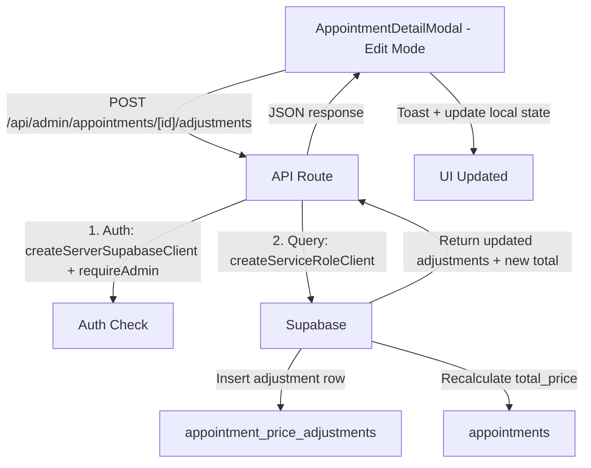

# Price Adjustments for Appointments - Design Document

## Overview

### Problem Statement

Admins currently have no way to modify appointment pricing after creation. The `total_price` field on the `appointments` table is set at booking time and never updated. Real-world scenarios like de-matting surcharges, loyalty discounts, or corrective adjustments require post-creation price modifications with an audit trail.

### Solution

Add a separate `appointment_price_adjustments` table for line-item adjustments (surcharges and discounts). Each adjustment has a label, amount, optional note, and records who created it and when. The `appointments.total_price` is recalculated server-side whenever adjustments change. The AppointmentDetailModal gains a new adjustments section in its pricing area for both view and edit modes.

### Business Value

- Enables accurate billing for real-world pricing variations (matting, loyalty, corrections)
- Provides complete audit trail for financial accountability
- Keeps pricing transparent with itemized line items visible to admins

### Key Architectural Decisions

| Decision | Rationale |
|----------|-----------|
| Separate table (not columns on `appointments`) | Supports multiple adjustments per appointment with full audit trail per item |
| Immutable adjustments (no update, only add/delete) | Simpler audit trail; to correct an adjustment, delete and re-add |
| Server-side recalculation only | Prevents client-side price tampering; total is always authoritative |
| Immediate persistence (not batched) | Each adjustment saves instantly with toast feedback, matching existing admin patterns |
| No RLS on new table (service role only) | Admin-only feature accessed via service role client through API routes |

---

## Architecture

### High-Level Data Flow



### Integration Points

1. **AppointmentDetailModal** - Primary UI surface (view + edit pricing section)
2. **GET /api/admin/appointments/[id]** - Extended to include `price_adjustments` in response
3. **New API route** - `/api/admin/appointments/[id]/adjustments` for CRUD operations
4. **database.ts** - New `AppointmentPriceAdjustment` type

---

## Components and Interfaces

### API Route: `/api/admin/appointments/[id]/adjustments/route.ts`

**POST** - Add an adjustment

```typescript
// Request
{
  label: string;    // Required, e.g. "De-matting fee"
  amount: number;   // Required, non-zero. Positive = surcharge, negative = discount
  note?: string;    // Optional explanation
}

// Response 200
{
  adjustment: AppointmentPriceAdjustment;
  total_price: number; // Recalculated total
}
```

**DELETE** - Remove an adjustment

```typescript
// Request
{
  adjustment_id: string; // UUID of adjustment to remove
}

// Response 200
{
  total_price: number; // Recalculated total
}
```

**Recalculation Logic** (server-side, in both POST and DELETE handlers):

```typescript
// 1. Get base price + addons total from appointment
// 2. Sum all adjustment amounts for this appointment
// 3. Update appointments.total_price = base + addons + adjustments
// Use Promise.all for parallel fetch of appointment data + adjustments sum
```

### UI Component: Adjustments Section in AppointmentDetailModal

**View Mode** - Read-only list between add-ons and total:

```
Base Service (Medium)           $60.00
  Extras Added
  - Teeth Brushing              $10.00
  Adjustments
  + De-matting fee              $10.00
  - Loyalty discount            -$5.00
  ─────────────────────────────────────
  Total                         $75.00
```

**Edit Mode** - Same list with delete buttons + inline add form:

- Each existing adjustment shows a trash icon button to remove
- Below the list: inline form with label input, amount input (with +/- toggle or sign prefix), optional note input, and "Add" button
- Amount input accepts positive numbers; a toggle or prefix selects surcharge (+) vs discount (-)
- Framer Motion `AnimatePresence` for add/remove animations (y:16 slide-up, stagger)

**Component structure** (no new file -- integrated directly into AppointmentDetailModal):

```typescript
// Inside the existing pricing <div> in AppointmentDetailModal:
// 1. After addons section, before total
// 2. Conditionally render add form when isEditing
// 3. adjustments state: AppointmentPriceAdjustment[]
// 4. Fetched alongside appointment data (included in GET response)
```

### Inline Add Form Design

Following admin UI patterns from MEMORY.md:

- Inputs: `px-3 py-2.5 rounded-lg border border-[#434E54]/20 focus:ring-2 focus:ring-[#434E54]/30`
- Label input: text, placeholder "e.g. De-matting fee"
- Amount input: number, with a small toggle button for +/- direction
- Note input: text, placeholder "Optional note", smaller/secondary styling
- Add button: `AdminButton` size="xs"
- Delete button: `Trash2` icon from lucide-react, `text-red-400 hover:text-red-600`

---

## Data Models

### New Table: `appointment_price_adjustments`

```sql
CREATE TABLE public.appointment_price_adjustments (
  id UUID PRIMARY KEY DEFAULT gen_random_uuid(),
  appointment_id UUID NOT NULL REFERENCES public.appointments(id) ON DELETE CASCADE,
  label TEXT NOT NULL,
  amount NUMERIC(10,2) NOT NULL,  -- positive = surcharge, negative = discount
  note TEXT,
  created_by UUID NOT NULL REFERENCES public.users(id),
  created_at TIMESTAMPTZ NOT NULL DEFAULT now()
);

-- Index for efficient lookup by appointment
CREATE INDEX idx_price_adjustments_appointment_id
  ON public.appointment_price_adjustments(appointment_id);

-- No RLS policies (accessed only via service role client in admin API routes)
ALTER TABLE public.appointment_price_adjustments ENABLE ROW LEVEL SECURITY;
```

### TypeScript Type

```typescript
// In src/types/database.ts
export interface AppointmentPriceAdjustment {
  id: string;
  appointment_id: string;
  label: string;
  amount: number; // positive = surcharge, negative = discount
  note: string | null;
  created_by: string;
  created_at: string;
  // Joined data
  created_by_user?: User;
}
```

### Extended Appointment Type

The existing `Appointment` interface gains an optional joined field:

```typescript
export interface Appointment extends BaseEntity {
  // ... existing fields ...
  price_adjustments?: AppointmentPriceAdjustment[];
}
```

---

## Error Handling

| Scenario | HTTP Status | Error Message | Client Handling |
|----------|-------------|---------------|-----------------|
| Missing label | 400 | "Label is required" | `toast.error('Label is required')` |
| Zero amount | 400 | "Amount must not be zero" | `toast.error('Amount must not be zero')` |
| Appointment not found | 404 | "Appointment not found" | `toast.error('Appointment not found')` |
| Not admin | 403 | "Forbidden" | Redirect / `toast.error('Unauthorized')` |
| DB error on insert | 500 | "Failed to add adjustment" | `toast.error('Failed to add adjustment')` |
| DB error on delete | 500 | "Failed to remove adjustment" | `toast.error('Failed to remove adjustment')` |
| Adjustment not found (delete) | 404 | "Adjustment not found" | `toast.error('Adjustment not found')` |

### Validation (Zod schema in API route)

```typescript
import { z } from 'zod';

const addAdjustmentSchema = z.object({
  label: z.string().min(1, 'Label is required').max(100),
  amount: z.number().refine(v => v !== 0, 'Amount must not be zero'),
  note: z.string().max(500).optional(),
});

const deleteAdjustmentSchema = z.object({
  adjustment_id: z.string().uuid(),
});
```

---

## Testing Strategy

### Unit Tests

1. **Zod validation schemas** - Valid/invalid inputs for add and delete
2. **Price recalculation logic** - Various combinations of base price, addons, positive and negative adjustments, edge cases (adjustment makes total negative -- should that be allowed?)

### Integration Tests (API routes)

3. **POST /adjustments** - Happy path: adds adjustment, returns updated total
4. **POST /adjustments** - Validation: rejects missing label, zero amount
5. **DELETE /adjustments** - Happy path: removes adjustment, returns updated total
6. **DELETE /adjustments** - 404: adjustment doesn't exist
7. **Auth** - Non-admin gets 403

### Component Tests

8. **View mode** - Renders adjustments list with correct formatting (surcharges positive, discounts negative)
9. **Edit mode** - Shows add form, handles submit, shows delete buttons
10. **Optimistic UI** - Toast appears on success/failure
11. **Empty state** - No adjustments section when list is empty (or subtle "No adjustments" text)

### Manual QA Checklist

- Add surcharge, verify total updates
- Add discount, verify total updates
- Remove adjustment, verify total recalculates
- Reopen modal, verify adjustments persist
- Verify audit trail (created_by, created_at displayed)

---

## Files to Create/Modify

| File | Action | Description |
|------|--------|-------------|
| `src/types/database.ts` | Modify | Add `AppointmentPriceAdjustment` type, add `price_adjustments?` to `Appointment` |
| `src/app/api/admin/appointments/[id]/adjustments/route.ts` | **Create** | POST + DELETE handlers with auth, validation, recalculation |
| `src/app/api/admin/appointments/[id]/route.ts` | Modify | Include `price_adjustments` in GET select query |
| `src/components/admin/appointments/AppointmentDetailModal.tsx` | Modify | Add adjustments display (view) and inline add/delete form (edit) to pricing section |
| `docs/architecture/ARCHITECTURE.md` | Modify | Document `appointment_price_adjustments` table |

### Migration SQL

```sql
-- Migration: add_appointment_price_adjustments
CREATE TABLE public.appointment_price_adjustments (
  id UUID PRIMARY KEY DEFAULT gen_random_uuid(),
  appointment_id UUID NOT NULL REFERENCES public.appointments(id) ON DELETE CASCADE,
  label TEXT NOT NULL,
  amount NUMERIC(10,2) NOT NULL,
  note TEXT,
  created_by UUID NOT NULL REFERENCES public.users(id),
  created_at TIMESTAMPTZ NOT NULL DEFAULT now()
);

CREATE INDEX idx_price_adjustments_appointment_id
  ON public.appointment_price_adjustments(appointment_id);

ALTER TABLE public.appointment_price_adjustments ENABLE ROW LEVEL SECURITY;
-- No RLS policies needed (service role access only)
```
