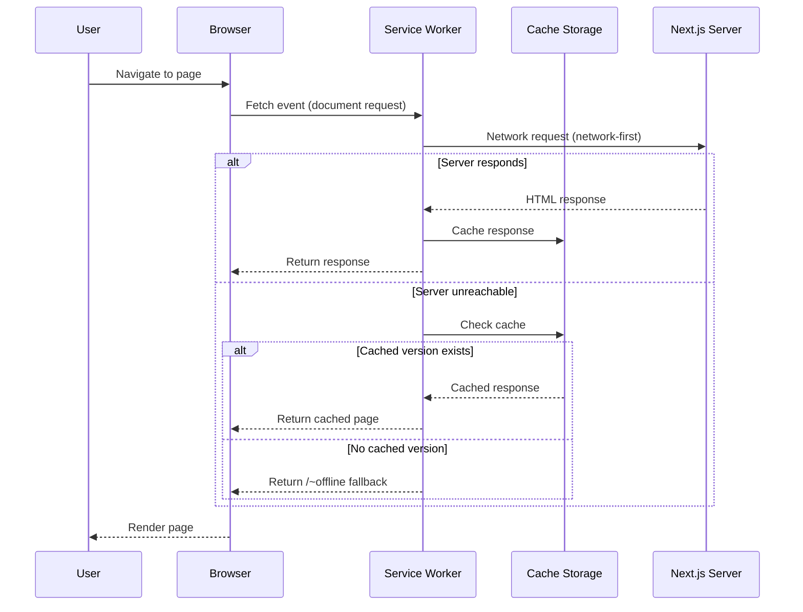

# PWA Implementation - Technical Design Document

## Overview

### Feature Summary

Convert The Puppy Day web application into a Progressive Web App (PWA) to enable installability on mobile and desktop devices for both customers and staff, with basic offline support via a branded fallback page and cached static assets.

### Business Value

- **Customers**: One-tap access from home screen, app-like experience for booking grooming appointments, branded splash screen reinforcing brand identity
- **Staff**: Quick dashboard access on salon tablets/phones without navigating to the URL each time
- **Retention**: Home screen presence increases return visits; offline fallback prevents blank-screen frustration on spotty connections
- **SEO**: Lighthouse PWA audit compliance contributes to overall site quality signals

### Scope (MVP)

**In scope:**
- Web app manifest with branded icons and theme colors
- Service worker with precaching of static assets and runtime caching
- Offline fallback page for uncached navigation requests
- Metadata and viewport updates for installability
- CSP and TypeScript configuration updates

**Out of scope (future phases):**
- Push notifications (Phase 2)
- IndexedDB offline data storage (Phase 3)
- Background sync for offline mutations (Phase 4)

### Technology Choice: Serwist

**Serwist** (v9.x) is the actively maintained successor to `next-pwa`, built on Workbox. It was chosen for:

1. **Turbopack compatibility** -- works with Next.js 16's default bundler for development, and Webpack for production builds (which Next.js 16 still uses for `next build`)
2. **First-class App Router support** -- designed for the `app/` directory convention
3. **Sensible defaults** -- `defaultCache` provides production-ready caching strategies out of the box
4. **Active maintenance** -- regular releases, currently at v9.5.x
5. **Minimal configuration** -- wraps `next.config.mjs` with a single function call

---

## Architecture

### High-Level System Design

```mermaid
graph TB
    subgraph "Browser"
        A[Next.js App] -->|registers| B[Service Worker - sw.js]
        B -->|reads| C[Cache Storage]
        B -->|intercepts| D[Network Requests]
        A -->|references| E[Web App Manifest]
    end

    subgraph "Service Worker Strategies"
        D --> F{Request Type}
        F -->|Static Assets JS/CSS/fonts| G[Cache-First]
        F -->|Pages SSR/ISR| H[Network-First / SWR]
        F -->|API Routes| I[Network-Only]
        F -->|Uncached Navigation| J[Offline Fallback Page]
    end

    subgraph "Build Pipeline"
        K[src/sw.ts] -->|Serwist Plugin| L[public/sw.js]
        M[next.config.mjs] -->|withSerwist wrapper| L
        N[src/app/manifest.ts] -->|Next.js| O[/manifest.webmanifest]
    end
```

### Integration Points

| System | Integration | Notes |
|---|---|---|
| **Next.js Config** | `withSerwistInit` wraps `nextConfig` | Single entry point; all existing config preserved |
| **Root Layout** | `Viewport` export + updated `metadata.icons` | Non-breaking addition to existing exports |
| **CSP Headers** | Add `worker-src 'self'` directive | Required for service worker registration |
| **TypeScript** | Add `webworker` lib + Serwist typings | Isolated to `src/worker-env.d.ts` to avoid DOM conflicts |
| **Build Output** | `public/sw.js` + `public/sw.js.map` generated at build time | Gitignored; regenerated on every build |

### Request Flow



---

## Components and Interfaces

### 1. Web App Manifest (`src/app/manifest.ts`)

Next.js auto-discovers `manifest.ts` in the `app/` directory and serves it at `/manifest.webmanifest`. No manual `<link>` tag is required.

```typescript
// src/app/manifest.ts
import type { MetadataRoute } from 'next';

export default function manifest(): MetadataRoute.Manifest {
  return {
    name: 'The Puppy Day - Dog Grooming',
    short_name: 'Puppy Day',
    description: 'Professional dog grooming services in La Mirada, CA. Book appointments online.',
    start_url: '/',
    display: 'standalone',
    orientation: 'portrait-primary',
    background_color: '#F8EEE5',
    theme_color: '#434E54',
    icons: [
      {
        src: '/icons/icon-192x192.png',
        sizes: '192x192',
        type: 'image/png',
      },
      {
        src: '/icons/icon-384x384.png',
        sizes: '384x384',
        type: 'image/png',
      },
      {
        src: '/icons/icon-512x512.png',
        sizes: '512x512',
        type: 'image/png',
      },
      {
        src: '/icons/maskable-icon-512x512.png',
        sizes: '512x512',
        type: 'image/png',
        purpose: 'maskable',
      },
    ],
  };
}
```

**Design decisions:**
- Using `manifest.ts` (dynamic) instead of `manifest.json` (static) for type safety via `MetadataRoute.Manifest`
- `display: 'standalone'` removes browser chrome for an app-like feel
- `orientation: 'portrait-primary'` matches the mobile-first booking flow
- `background_color: '#F8EEE5'` (warm cream) ensures the splash screen matches the app's design system
- `theme_color: '#434E54'` (charcoal) styles the OS status bar / title bar

### 2. Service Worker (`src/sw.ts`)

The service worker source is compiled by the Serwist webpack plugin into `public/sw.js` at build time. It is never served directly from `src/`.

```typescript
// src/sw.ts
import { defaultCache } from '@serwist/next/worker';
import type { PrecacheEntry, SerwistGlobalConfig } from 'serwist';
import { Serwist } from 'serwist';

declare global {
  interface WorkerGlobalScope extends SerwistGlobalConfig {
    __SW_MANIFEST: (PrecacheEntry | string)[] | undefined;
  }
}

declare const self: ServiceWorkerGlobalScope;

const serwist = new Serwist({
  precacheEntries: self.__SW_MANIFEST,
  skipWaiting: true,
  clientsClaim: true,
  navigationPreload: true,
  runtimeCaching: defaultCache,
  fallbacks: {
    entries: [
      {
        url: '/~offline',
        matcher({ request }) {
          return request.destination === 'document';
        },
      },
    ],
  },
});

serwist.addEventListeners();
```

**Design decisions:**
- `skipWaiting: true` + `clientsClaim: true` -- new service worker versions activate immediately without requiring the user to close all tabs. This is appropriate for an MVP where cache-busting edge cases are acceptable.
- `navigationPreload: true` -- allows the browser to start network requests in parallel with service worker boot, reducing navigation latency.
- `defaultCache` -- Serwist's opinionated default provides the exact caching matrix needed (see Caching Strategy section below). No custom `RuntimeCaching` rules are needed for MVP.
- `fallbacks.entries` -- only document requests fall back to `/~offline`. CSS/JS/image failures are handled by the browser's native error behavior.

### 3. Offline Fallback Page (`src/app/~offline/page.tsx`)

A client component that mirrors the visual design of `src/app/not-found.tsx` with offline-specific messaging.

```typescript
// src/app/~offline/page.tsx
'use client';

// Client component because:
// 1. Uses window.location.reload() for the retry button
// 2. Served from service worker cache, not SSR'd

// Visual design:
// - Same gradient background as not-found.tsx: from-[#FFFBF7] via-[#F8EEE5] to-[#FFFBF7]
// - WifiOff icon (from lucide-react) in circular bg-[#EAE0D5] container
// - PawPrint accent overlay (consistent with 404 page)
// - White card with rounded-xl shadow-lg
// - "You're Offline" heading in text-[#434E54]
// - Descriptive paragraph
// - "Try Again" button calling window.location.reload()
// - Link back to homepage (/)
// - Help text footer with puppyday14936@gmail.com contact
```

**Design decisions:**
- `'use client'` is required because the page uses `window.location.reload()` and is served from cache (not server-rendered)
- The `~offline` route prefix (with tilde) is a Serwist convention that avoids collision with real route names
- Visual consistency with the 404 page ensures a cohesive error experience
- The "Try Again" button provides immediate recourse without navigating away

### 4. Next.js Configuration Changes (`next.config.mjs`)

```javascript
// next.config.mjs
import withSerwistInit from '@serwist/next';

const withSerwist = withSerwistInit({
  swSrc: 'src/sw.ts',
  swDest: 'public/sw.js',
  disable: process.env.NODE_ENV === 'development',
  additionalPrecacheEntries: [{ url: '/~offline', revision: crypto.randomUUID() }],
});

/** @type {import('next').NextConfig} */
const nextConfig = {
  // ... all existing config preserved exactly as-is ...
  async headers() {
    return [
      {
        source: '/:path*',
        headers: [
          {
            key: 'Content-Security-Policy',
            value: [
              // ... all existing CSP directives ...
              // NEW: Add worker-src directive
              "worker-src 'self'",
            ].join('; '),
          },
          // ... all other existing headers unchanged ...
        ],
      },
    ];
  },
};

export default withSerwist(nextConfig);
```

**Design decisions:**
- `disable: process.env.NODE_ENV === 'development'` -- service workers interfere with hot module replacement during development. Disabled in dev, active in production.
- `additionalPrecacheEntries` with `revision: crypto.randomUUID()` -- ensures the offline page is always precached and the cache is busted on each build (since the offline page content may change between deploys).
- `swSrc: 'src/sw.ts'` -- keeps the service worker source in the `src/` directory alongside other application code, consistent with the project structure.
- `swDest: 'public/sw.js'` -- the compiled service worker must be in `public/` to be served at the root path, which is required for its scope to cover the entire app.
- The `withSerwist()` wrapper is the outermost layer, wrapping the complete `nextConfig` object.

### 5. Root Layout Updates (`src/app/layout.tsx`)

```typescript
// src/app/layout.tsx -- changes only, not full file

import type { Metadata, Viewport } from 'next';

// NEW: Viewport export (separate from metadata per Next.js convention)
export const viewport: Viewport = {
  themeColor: '#434E54',
};

// UPDATED: metadata export
export const metadata: Metadata = {
  // ... all existing fields preserved ...
  applicationName: 'Puppy Day',
  icons: {
    icon: '/icons/icon-192x192.png',
    apple: '/icons/apple-touch-icon.png',
  },
  appleWebApp: {
    capable: true,
    statusBarStyle: 'default',
    title: 'Puppy Day',
  },
  formatDetection: {
    telephone: false,
  },
};
```

**Design decisions:**
- `viewport` is exported separately from `metadata` as required by Next.js 16 (they were split in Next.js 14+)
- `applicationName` enables the OS to display "Puppy Day" in app switchers and task managers
- `appleWebApp.capable: true` enables full-screen standalone mode on iOS Safari
- `appleWebApp.statusBarStyle: 'default'` uses the standard dark-text-on-light status bar, matching the warm cream background
- `formatDetection.telephone: false` prevents iOS from auto-linking phone numbers, which can interfere with the booking UI

### 6. TypeScript Configuration

To avoid potential conflicts between `dom` and `webworker` lib types in the main tsconfig, a dedicated declaration file is used:

```typescript
// src/worker-env.d.ts
/// <reference lib="webworker" />
```

Additionally, update `tsconfig.json`:
```json
{
  "compilerOptions": {
    "types": ["@serwist/next/typings"]
  },
  "exclude": ["public/sw.js"]
}
```

**Design decisions:**
- Using `src/worker-env.d.ts` with a `/// <reference>` directive instead of adding `"webworker"` to `tsconfig.json`'s `lib` array. This avoids type conflicts where `ServiceWorkerGlobalScope` clashes with `Window` in regular app code.
- Excluding `public/sw.js` from TypeScript compilation since it is a build artifact, not source code.
- Adding `@serwist/next/typings` provides type augmentations for Serwist's global config interface.

---

## Data Models

### Web App Manifest Schema

The manifest follows the [W3C Web Application Manifest](https://www.w3.org/TR/appmanifest/) specification. The key fields and their values for The Puppy Day:

| Field | Value | Rationale |
|---|---|---|
| `name` | `"The Puppy Day - Dog Grooming"` | Full name shown in install dialogs |
| `short_name` | `"Puppy Day"` | Shown under home screen icon (12 char limit recommended) |
| `start_url` | `"/"` | App opens to marketing homepage |
| `display` | `"standalone"` | Removes browser chrome for app-like feel |
| `orientation` | `"portrait-primary"` | Matches mobile-first booking flow |
| `background_color` | `"#F8EEE5"` | Warm cream -- splash screen bg matches app |
| `theme_color` | `"#434E54"` | Charcoal -- OS status bar color |
| `icons` | Array of 4 entries | See Icon Assets section |

### Icon Asset Specifications

All icons are derived from the source logo at `public/images/logo.png`.

| File | Dimensions | Purpose | Notes |
|---|---|---|---|
| `public/icons/icon-192x192.png` | 192 x 192 | Android home screen, manifest required minimum | Standard icon |
| `public/icons/icon-384x384.png` | 384 x 384 | Android splash screen (2x density) | Standard icon |
| `public/icons/icon-512x512.png` | 512 x 512 | PWA install prompt, splash screen | Standard icon |
| `public/icons/maskable-icon-512x512.png` | 512 x 512 | Android adaptive icon with safe zone | 10% padding; `purpose: "maskable"` |
| `public/icons/apple-touch-icon.png` | 180 x 180 | iOS home screen | Referenced in metadata.icons.apple |

**Generation approach:** Use `sharp` in a one-time Node.js script (`scripts/generate-pwa-icons.ts`) to resize the source logo. The script is run manually during setup, not during builds.

### Caching Strategy Matrix

Serwist's `defaultCache` provides these runtime caching strategies:

| Content Type | Strategy | Max Entries | Max Age | Rationale |
|---|---|---|---|---|
| Static assets (JS, CSS) | **Cache-First** | -- | -- | Content-hashed filenames; safe to cache indefinitely |
| Font files | **Cache-First** | -- | 365 days | Fonts rarely change; cache aggressively |
| Image assets | **Cache-First** | 64 | 30 days | Balance storage with performance |
| Marketing pages (ISR) | **Stale-While-Revalidate** | 32 | -- | Show cached instantly, refresh in background |
| Admin/customer pages (SSR) | **Network-First** | 32 | -- | Always prefer fresh data, fall back to cache |
| API routes (`/api/*`) | **Network-Only** | -- | -- | Mutations and real-time data must never be cached |
| Uncached navigation | **Offline Fallback** | -- | -- | Branded `/~offline` page |

**Design decision:** Using `defaultCache` unmodified for MVP. Custom caching rules (e.g., longer cache for the service menu, shorter for appointment data) can be added in future phases by extending the `runtimeCaching` array.

---

## File Structure Changes

### New Files

```
src/
  app/
    manifest.ts              # Web app manifest (auto-discovered by Next.js)
    ~offline/
      page.tsx               # Offline fallback page (client component)
  sw.ts                      # Service worker source (compiled by Serwist)
  worker-env.d.ts            # WebWorker type declarations

public/
  icons/
    icon-192x192.png         # Android home screen icon
    icon-384x384.png         # Android splash icon
    icon-512x512.png         # PWA install / splash icon
    maskable-icon-512x512.png # Maskable adaptive icon
    apple-touch-icon.png     # iOS home screen icon

scripts/
  generate-pwa-icons.ts      # One-time icon generation script
```

### Modified Files

| File | Changes |
|---|---|
| `next.config.mjs` | Import Serwist, wrap export with `withSerwist()`, add `worker-src 'self'` to CSP |
| `src/app/layout.tsx` | Add `Viewport` export, update `metadata.icons`, add `appleWebApp` and `applicationName` |
| `tsconfig.json` | Add `"@serwist/next/typings"` to `types`, add `"public/sw.js"` to `exclude` |
| `.gitignore` | Add `public/sw.js`, `public/sw.js.map`, `public/swe-worker-*.js` |
| `package.json` | Add `@serwist/next` (dependency) and `serwist` (devDependency) |

### Build Artifacts (Gitignored)

```
public/
  sw.js                      # Compiled service worker (generated by Serwist plugin)
  sw.js.map                  # Source map for service worker
  swe-worker-*.js            # Serwist worker chunks (if any)
```

---

## Error Handling

### Service Worker Registration Failure

If the service worker fails to register (e.g., browser doesn't support service workers, or the file is corrupted):
- **Behavior**: The app functions normally as a standard web app. No PWA features are available.
- **No user-visible error**: Registration failure is silent by design -- the app degrades gracefully.
- **Logging**: Serwist logs registration errors to the browser console for debugging.

### Offline Navigation

When the user navigates to a page while offline:
1. Service worker intercepts the fetch event
2. Attempts network request (network-first for SSR pages)
3. On network failure, checks cache for a stored version
4. If no cached version exists, serves the `/~offline` fallback page
5. The offline page provides:
   - Clear messaging: "You're Offline"
   - "Try Again" button (`window.location.reload()`)
   - Link to homepage (may work if cached)
   - Contact email as last-resort help

### Cache Storage Errors

If Cache Storage is unavailable (e.g., storage quota exceeded, private browsing restrictions):
- **Behavior**: Service worker operates in pass-through mode; all requests go directly to the network
- **No data loss**: Cache is purely supplementary; the app never depends on it for correctness

### Service Worker Update Conflicts

With `skipWaiting: true` and `clientsClaim: true`:
- New service worker versions activate immediately
- All open tabs switch to the new service worker
- **Risk**: In-flight requests from the old version may get different caching behavior
- **Mitigation**: Acceptable for MVP. Future phases may implement a "New version available, click to refresh" toast pattern.

---

## Testing Strategy

### 1. Build Verification

```bash
npm run build
```

**Assertions:**
- Build completes without errors from the Serwist plugin
- `public/sw.js` is generated
- `public/sw.js` contains precache manifest entries
- No TypeScript errors related to service worker types

### 2. Service Worker Registration (Manual)

```bash
npm run build && npm start
```

Open Chrome DevTools > Application tab:

| Check | Expected |
|---|---|
| Manifest section | Shows "The Puppy Day - Dog Grooming", correct icons, theme colors |
| Service Worker section | Status: "activated and is running" |
| Cache Storage section | Contains precached static assets |

### 3. Offline Fallback (Manual)

1. Visit the app at `localhost:3000`, navigate a few pages
2. DevTools > Network tab > toggle "Offline"
3. Navigate to an unvisited page

**Assertions:**
- The `/~offline` fallback page renders (not browser's default offline page)
- The page shows the branded offline design with WifiOff icon
- "Try Again" button is present and functional (after re-enabling network)
- Previously visited pages load from cache while offline

### 4. Installability (Manual)

**Chrome Desktop:**
- Install icon appears in the address bar
- Clicking it opens install dialog with correct app name and icon
- Installed app opens in standalone window (no browser chrome)

**Android Chrome:**
- "Add to Home Screen" banner or menu option available
- Home screen icon uses the 192x192 icon
- App opens in standalone mode with charcoal status bar

**iOS Safari:**
- Share > "Add to Home Screen" uses apple-touch-icon
- App opens in standalone mode
- Status bar style matches `default` setting

### 5. Lighthouse PWA Audit

Run Lighthouse in Chrome DevTools on the production build:

**Target:** All core PWA checks passing:
- [x] Installable (valid manifest + service worker)
- [x] Has a `<meta name="theme-color">` or `theme_color` in manifest
- [x] Redirects HTTP to HTTPS (handled by hosting, not app code)
- [x] Configured for a custom splash screen
- [x] Sets an address-bar theme color
- [x] Content is sized correctly for the viewport
- [x] Has a maskable icon

### 6. Automated Tests (Vitest)

Since the service worker and manifest are primarily configuration, automated tests focus on:

**Manifest validation (`__tests__/pwa/manifest.test.ts`):**
```typescript
// Import the manifest function and validate its output
// - Required fields present (name, short_name, start_url, display, icons)
// - At least one 192x192 icon
// - At least one 512x512 icon
// - At least one maskable icon
// - Colors match design system (#F8EEE5, #434E54)
```

**Offline page rendering (`__tests__/pwa/offline-page.test.tsx`):**
```typescript
// Render the offline page component
// - "You're Offline" heading is present
// - "Try Again" button is present
// - Homepage link is present
// - Contact email is present
```

### 7. Cross-Browser Compatibility

| Browser | PWA Install | Service Worker | Offline Fallback |
|---|---|---|---|
| Chrome (Desktop) | Yes | Yes | Yes |
| Chrome (Android) | Yes | Yes | Yes |
| Safari (iOS 16.4+) | Home screen only | Yes | Yes |
| Safari (macOS) | Yes | Yes | Yes |
| Firefox | No install prompt | Yes | Yes |
| Edge | Yes | Yes | Yes |

---

## Security Considerations

### Content Security Policy

The `worker-src 'self'` directive is added to CSP to allow the service worker to load from the same origin. This is the minimum required permission -- no external worker sources are allowed.

### Service Worker Scope

The service worker is served from `/sw.js` at the root, giving it scope over the entire application. This is intentional -- all routes should benefit from caching. The Serwist configuration does not expose any admin or customer data through caching:
- API routes use `Network-Only` strategy (never cached)
- SSR pages use `Network-First` (fresh data preferred; cached version only on network failure)

### Cache Poisoning

Risk is mitigated by:
- Service worker only caches responses from the same origin (default Serwist behavior)
- HTTPS enforcement ensures responses cannot be tampered with in transit
- `Cache-Control: no-cache, no-store, must-revalidate` on `sw.js` itself ensures the latest service worker is always fetched

---

## Implementation Phases

### Phase 1: Foundation (Steps 1-3)
- Install `@serwist/next` and `serwist`
- Generate PWA icons from source logo
- Create `src/app/manifest.ts`

### Phase 2: Service Worker (Steps 4-6)
- Create `src/sw.ts` with Serwist configuration
- Update `next.config.mjs` with Serwist wrapper + CSP
- Create `src/worker-env.d.ts` and update `tsconfig.json`

### Phase 3: UI and Metadata (Steps 7-8)
- Create `src/app/~offline/page.tsx` with branded design
- Update `src/app/layout.tsx` with Viewport export and PWA metadata

### Phase 4: Housekeeping (Step 9)
- Update `.gitignore` with build artifacts
- Build verification and manual testing
- Lighthouse PWA audit

### Phase 5: Testing (Step 10)
- Write manifest validation test
- Write offline page rendering test
- Cross-browser manual testing

---

## References

- [Serwist Getting Started Guide](https://serwist.pages.dev/docs/next/getting-started)
- [Serwist @serwist/next Documentation](https://serwist.pages.dev/docs/next)
- [Next.js PWA Guide (v16)](https://nextjs.org/docs/app/guides/progressive-web-apps)
- [Build a Next.js 16 PWA with Serwist - LogRocket](https://blog.logrocket.com/nextjs-16-pwa-offline-support/)
- [W3C Web Application Manifest Spec](https://www.w3.org/TR/appmanifest/)
- [@serwist/next on npm (v9.5.6)](https://www.npmjs.com/package/@serwist/next)
