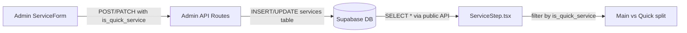

# Quick Service Flag (`is_quick_service`) — Design Document

> **Feature:** is_quick_service database column and admin toggle
> **Status:** Draft
> **Created:** 2026-03-21
> **Requirements:** User-provided inline requirements (no separate requirements.md)

---

## 1. Overview

- **Purpose:** Replace the hardcoded `QUICK_SERVICE_NAMES = ['Nail Trim']` array in `ServiceStep.tsx` with a database-driven `is_quick_service` boolean column on the `services` table, and expose it as a toggle in the admin ServiceForm.
- **Business Value:** Admins can mark any service as a "quick service" without code changes. New quick services (e.g., teeth brushing, ear cleaning) can be added and categorized instantly.
- **Scope:** Small, targeted change across 6 files. No pricing changes, no new components, no new API routes.

### Key Design Decisions

| Decision | Rationale |
|----------|-----------|
| Boolean column with `DEFAULT false` | Simple, no migration risk — all existing services default to main grooming |
| Checkbox toggle matching `is_active` pattern | Consistent admin UI, no new component needed |
| Data migration for Nail Trim in same SQL | Ensures immediate correctness after migration |
| No changes to public GET `/api/services` | Column is already returned by `select('*')` |

## 2. Architecture

No architectural changes. This is a column addition with UI plumbing.



### File Modification Summary

| File | Action | Description |
|------|--------|-------------|
| `src/types/database.ts` | Modify | Add `is_quick_service: boolean` to `Service` interface |
| `src/components/admin/services/ServiceForm.tsx` | Modify | Add `is_quick_service` to FormData, checkbox toggle, and payload |
| `src/app/api/admin/services/route.ts` | Modify | Accept `is_quick_service` in POST body, include in insert |
| `src/app/api/admin/services/[id]/route.ts` | Modify | Accept `is_quick_service` in PATCH body, include in update |
| `src/components/booking/steps/ServiceStep.tsx` | Modify | Replace hardcoded filter with `s.is_quick_service` |
| Supabase migration (run via dashboard/CLI) | Create | `ALTER TABLE` + `UPDATE` for Nail Trim |

## 3. Components & Interfaces

### Updated `Service` interface

```typescript
// src/types/database.ts line ~184
export interface Service extends BaseEntity {
  name: string;
  description: string | null;
  image_url: string | null;
  duration_minutes: number;
  is_active: boolean;
  is_quick_service: boolean;
  display_order: number;
  updated_at: string;
  // Joined data
  prices?: ServicePrice[];
}
```

### Updated ServiceForm `FormData`

```typescript
interface FormData {
  name: string;
  description: string;
  duration_minutes: number;
  image_url: string;
  is_active: boolean;
  is_quick_service: boolean;
  prices: Record<PetSize, number>;
}
```

### Admin POST payload addition

```typescript
// Destructured from body in POST handler
const { name, description, duration_minutes, image_url, is_active = true, is_quick_service = false, prices } = body;
```

### Admin PATCH payload addition

```typescript
// In PATCH handler, after existing is_active check
if (is_quick_service !== undefined) {
  serviceUpdate.is_quick_service = is_quick_service;
}
```

No new API routes. No request/response schema changes beyond the added field.

## 4. Data Models

### Migration SQL

```sql
-- Add is_quick_service column to services table
ALTER TABLE services ADD COLUMN is_quick_service BOOLEAN NOT NULL DEFAULT false;

-- Migrate existing Nail Trim service
UPDATE services SET is_quick_service = true WHERE name = 'Nail Trim';
```

### Column specification

| Column | Type | Nullable | Default | Description |
|--------|------|----------|---------|-------------|
| `is_quick_service` | `BOOLEAN` | `NOT NULL` | `false` | When true, displayed in compact "Quick Services" section of booking |

No RLS policy changes needed — the column follows the same access patterns as `is_active`.

## 5. State Management

No Zustand store changes. The `is_quick_service` field flows through existing data paths:
- `useServices()` hook fetches from `/api/services` which returns `select('*')` — new column included automatically
- `useBookingStore` does not filter by service type; filtering happens in `ServiceStep` render logic

## 6. UI Specifications

### ServiceForm toggle

Add a checkbox identical to the existing `is_active` toggle, placed directly below it:

```tsx
{/* Quick Service */}
<div className="flex items-center gap-3">
  <input
    type="checkbox"
    id="is_quick_service"
    checked={formData.is_quick_service}
    onChange={(e) => handleChange('is_quick_service', e.target.checked)}
    className="w-5 h-5 rounded border-gray-300 text-[#434E54]
      focus:ring-2 focus:ring-[#434E54]/30"
  />
  <label htmlFor="is_quick_service" className="text-sm font-medium text-[#434E54]">
    Quick service (shown in compact section during booking)
  </label>
</div>
```

This goes after the `is_active` checkbox (line ~411) and before the Actions footer. No other UI changes.

## 7. Error Handling & Edge Cases

| Edge Case | Design Solution |
|-----------|-----------------|
| All services marked as quick | Main services grid is empty; only quick section renders (existing conditional handles this) |
| No services marked as quick | Quick services section hidden (existing `quickServices.length > 0` guard) |
| Existing Nail Trim renamed | DB flag persists — no longer name-dependent |
| `is_quick_service` missing from old cached data | TypeScript default in interface; `?? false` fallback in ServiceStep filter if needed |
| Boolean validation on API | Supabase casts to boolean; non-boolean values rejected by PostgreSQL |

## 8. Implementation Phases

### Phase 1: Database migration
- Run `ALTER TABLE` SQL in Supabase dashboard
- Verify column exists and Nail Trim is flagged
- **Independently testable:** Query `SELECT name, is_quick_service FROM services` in SQL editor

### Phase 2: Type update
- Add `is_quick_service: boolean` to `Service` interface in `src/types/database.ts`
- **Independently testable:** `npm run build` passes (no runtime behavior change)

### Phase 3: API routes
- Add `is_quick_service` to POST destructuring and insert in `src/app/api/admin/services/route.ts`
- Add `is_quick_service` to PATCH handler in `src/app/api/admin/services/[id]/route.ts`
- **Independently testable:** cURL POST/PATCH with `is_quick_service: true`, verify in DB

### Phase 4: Admin form
- Add to FormData, initial state, `useEffect` loader, payload, and checkbox UI in `ServiceForm.tsx`
- **Independently testable:** Open admin service form, toggle appears, saves correctly

### Phase 5: Booking step
- Replace `QUICK_SERVICE_NAMES` filter with `s.is_quick_service` in `ServiceStep.tsx`
- Remove the `QUICK_SERVICE_NAMES` constant
- **Independently testable:** Booking modal shows Nail Trim in quick section, other services in main grid

## 9. Testing Strategy

### Manual Verification

- [ ] Run migration SQL in Supabase dashboard
- [ ] Verify `SELECT name, is_quick_service FROM services` shows Nail Trim as `true`, others as `false`
- [ ] Open admin Settings > Services, edit Nail Trim — toggle should be checked
- [ ] Create a new service with quick service toggled on — verify it saves
- [ ] Open booking modal — Nail Trim appears in "Quick Services" section
- [ ] Mark another service as quick in admin — it moves to quick section in booking
- [ ] Uncheck quick service on Nail Trim — it moves to main grid in booking
- [ ] `npm run build` completes without errors

## 10. Risk Assessment

| Risk | Impact | Mitigation |
|------|--------|------------|
| Migration fails on live DB | Low | Simple `ALTER TABLE ADD COLUMN` with default — zero-downtime DDL |
| Cached service data missing field | Low | `select('*')` returns all columns; browser refresh clears stale data |
| Admin forgets to flag services | Low | Existing Nail Trim migrated automatically; new services default to `false` (main) which is the safe default |
