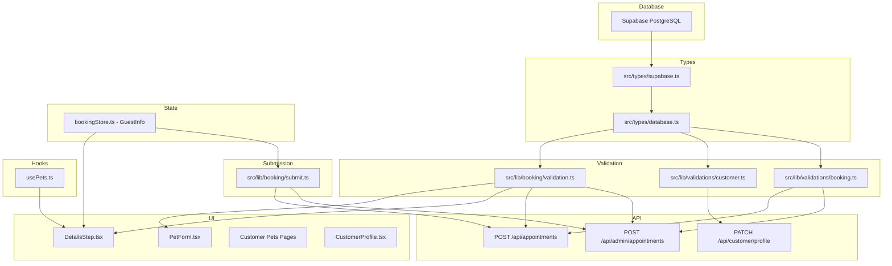
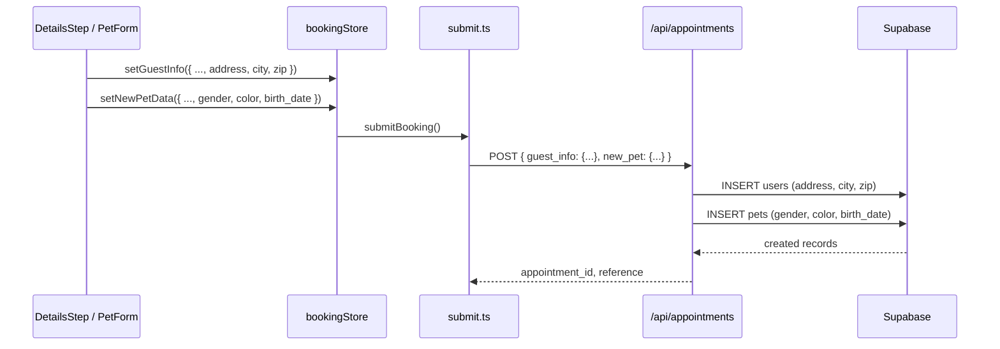

# Design Document: Customer Address Fields + Pet Schema Changes

## Overview

### Motivation

Before importing real customer and pet data into the production database, two schema gaps need to be addressed:

1. **Users table**: The business operates exclusively in La Mirada, CA. Customer addresses are needed for record-keeping and potential future features (service area validation, mailing). Since all customers are in California, only `address`, `city`, and `zip` are required -- no state column.

2. **Pets table**: The current `weight` column is redundant with the `size` column (Small/Medium/Large/X-Large), which already drives pricing. Meanwhile, `gender` and `color` are missing but needed for pet identification and grooming records. The `birth_date` column already exists in the database but is not exposed in any UI form.

### Business Value

- Enables bulk import of existing customer/pet records without data loss
- Removes confusing redundant field (weight) that has no business logic impact
- Adds gender and color fields used in real grooming operations for pet identification
- Exposes birth_date for age-aware grooming recommendations

### Key Architectural Decisions

| Decision | Rationale |
|---|---|
| No `state` column on users | Business is CA-only; reduces form friction |
| `gender` as CHECK constraint, not enum | Simpler migration; only two values (`male`, `female`) |
| Default `gender` to `'male'` for existing rows | Avoids migration failure on NOT NULL; admin corrects after import |
| Remove `weight` entirely | Redundant with `size`; no business logic references weight for pricing |
| `color` as free-text | Too many color/pattern combinations for an enum |

---

## Architecture

### Affected System Layers



### Data Flow: New Customer with Pet (Booking)



---

## Components and Interfaces

### 1. Database Migration

**File**: `supabase/migrations/20260313_users_address_pets_gender_color.sql`

```sql
-- =============================================================================
-- Users: add optional address fields (CA-only business, no state needed)
-- =============================================================================
ALTER TABLE users ADD COLUMN IF NOT EXISTS address text;
ALTER TABLE users ADD COLUMN IF NOT EXISTS city text;
ALTER TABLE users ADD COLUMN IF NOT EXISTS zip text;

-- =============================================================================
-- Pets: remove redundant weight, add gender (required) + color (optional)
-- =============================================================================
ALTER TABLE pets DROP COLUMN IF EXISTS weight;

ALTER TABLE pets ADD COLUMN IF NOT EXISTS gender text NOT NULL DEFAULT 'male';
ALTER TABLE pets ADD COLUMN IF NOT EXISTS color text;

-- Constrain gender to known values
ALTER TABLE pets ADD CONSTRAINT chk_pets_gender CHECK (gender IN ('male', 'female'));
```

**Migration Notes**:
- All address fields are nullable (optional for existing and new customers).
- `gender` defaults to `'male'` so existing pet rows satisfy the NOT NULL constraint. The admin should update genders after the data import.
- `weight` is dropped entirely. Any existing weight data is discarded (it was not used in pricing logic -- `size` drives pricing).
- No index is needed on the new columns at this time (no queries filter by address, gender, or color).

### 2. Type Definition Changes

#### `src/types/supabase.ts` -- pets table

**Remove** from Row/Insert/Update:
```
weight: number | null       (Row)
weight?: number | null      (Insert)
weight?: number | null      (Update)
```

**Add** to Row:
```typescript
gender: string              // NOT NULL, default 'male'
color: string | null
```

**Add** to Insert:
```typescript
gender?: string             // defaults to 'male' in DB
color?: string | null
```

**Add** to Update:
```typescript
gender?: string
color?: string | null
```

#### `src/types/supabase.ts` -- users table

**Add** to Row:
```typescript
address: string | null
city: string | null
zip: string | null
```

**Add** to Insert:
```typescript
address?: string | null
city?: string | null
zip?: string | null
```

**Add** to Update:
```typescript
address?: string | null
city?: string | null
zip?: string | null
```

#### `src/stores/bookingStore.ts` -- GuestInfo interface

```typescript
export interface GuestInfo {
  firstName: string;
  lastName: string;
  email: string;
  phone: string;
  address?: string;    // NEW
  city?: string;       // NEW
  zip?: string;        // NEW
}
```

### 3. Validation Schema Changes

#### `src/lib/booking/validation.ts`

**`guestInfoSchema`** -- add optional address fields:
```typescript
export const guestInfoSchema = z.object({
  firstName: z.string().trim().min(1).max(50).regex(/^[a-zA-Z\s\-']+$/),
  lastName: z.string().trim().min(1).max(50).regex(/^[a-zA-Z\s\-']+$/),
  email: z.string().trim().min(1).email(),
  phone: z.string().min(10).max(20).regex(/^\+?[\d\s\-\(\)]+$/)
    .refine(phone => {
      const cleaned = phone.replace(/\D/g, '');
      return cleaned.length >= 10 && cleaned.length <= 15;
    }, { message: 'Phone number must contain 10-15 digits' }),
  // NEW address fields
  address: z.string().max(200).optional(),
  city: z.string().max(100).optional(),
  zip: z.string().regex(/^\d{5}(-\d{4})?$/, 'Invalid ZIP code').optional().or(z.literal('')),
});
```

**`petFormSchema`** -- remove weight, add gender/color/birth_date:
```typescript
export const petFormSchema = z.object({
  name: z.string().min(1).max(50),
  size: z.enum(['small', 'medium', 'large', 'xlarge']),
  breed_id: z.string().optional(),
  breed_custom: z.string().max(100).optional(),
  // REMOVED: weight
  gender: z.enum(['male', 'female'], { message: 'Please select a gender' }),  // NEW, required
  color: z.string().max(100).optional(),                                       // NEW, optional
  birth_date: z.string().optional(),                                           // NEW, optional (expose existing DB column)
  notes: z.string().max(500).optional(),
});
```

#### `src/lib/validations/customer.ts`

**`profileUpdateSchema`** -- add address fields:
```typescript
export const profileUpdateSchema = z.object({
  first_name: z.string().min(1).max(50).optional(),
  last_name: z.string().min(1).max(50).optional(),
  phone: phoneSchema,
  avatar_url: z.string().url().optional(),
  address: z.string().max(200).optional(),         // NEW
  city: z.string().max(100).optional(),             // NEW
  zip: z.string().regex(/^\d{5}(-\d{4})?$/).optional().or(z.literal('')),  // NEW
}).refine(
  (data) => Object.keys(data).length > 0,
  'At least one field must be provided'
);
```

**`createPetSchema`** -- remove weight, add gender/color:
```typescript
export const createPetSchema = z.object({
  name: z.string().min(1).max(50),
  breed_id: uuidSchema.optional(),
  breed_custom: z.string().max(100).optional(),
  size: z.enum(['small', 'medium', 'large', 'xlarge']),
  // REMOVED: weight
  gender: z.enum(['male', 'female']),               // NEW, required
  color: z.string().max(100).optional(),             // NEW
  birth_date: z.string().optional(),
  medical_info: z.string().max(1000).optional(),
  notes: z.string().max(500).optional(),
  photo_url: z.string().url().optional(),
}).refine(
  (data) => data.breed_id || data.breed_custom,
  { message: 'Either select a breed or enter a custom breed', path: ['breed_id'] }
);
```

#### `src/lib/validations/booking.ts`

**`petInfoSchema`** -- remove weight, add gender/color:
```typescript
export const petInfoSchema = z.object({
  name: z.string().min(1).max(50),
  breed_id: z.string().uuid().optional(),
  breed_custom: z.string().max(100).optional(),
  size: petSizeSchema,
  // REMOVED: weight
  gender: z.enum(['male', 'female']),               // NEW
  color: z.string().max(100).optional(),             // NEW
  birth_date: z.string().optional(),
  medical_info: z.string().max(1000).optional(),
  notes: z.string().max(500).optional(),
});
```

### 4. API Route Changes

#### `POST /api/appointments` (`src/app/api/appointments/route.ts`)

In the `appointmentRequestSchema`:

**`guest_info` object** -- add optional address fields:
```typescript
guest_info: z.object({
  firstName: z.string().min(1),
  lastName: z.string().min(1),
  email: z.string().email(),
  phone: z.string().min(10),
  address: z.string().max(200).optional(),   // NEW
  city: z.string().max(100).optional(),       // NEW
  zip: z.string().optional(),                 // NEW
}).optional(),
```

**`new_pet` object** -- remove weight, add gender/color:
```typescript
new_pet: z.object({
  name: z.string().min(1),
  breed_id: z.string().uuid().optional(),
  size: z.enum(['small', 'medium', 'large', 'xlarge']),
  // REMOVED: weight
  gender: z.enum(['male', 'female']).default('male'),  // NEW
  color: z.string().optional(),                         // NEW
  breed_custom: z.string().optional(),
}).optional(),
```

**User insert logic** -- include address fields from guest_info:
```typescript
// When creating user from guest_info:
const userData = {
  first_name: guest_info.firstName,
  last_name: guest_info.lastName,
  email: guest_info.email,
  phone: guest_info.phone,
  address: guest_info.address || null,    // NEW
  city: guest_info.city || null,          // NEW
  zip: guest_info.zip || null,            // NEW
};
```

**Pet insert logic** -- include gender/color, remove weight:
```typescript
// When creating pet from new_pet:
const petData = {
  name: new_pet.name,
  breed_id: new_pet.breed_id || null,
  breed_custom: new_pet.breed_custom || null,
  size: new_pet.size,
  gender: new_pet.gender,    // NEW
  color: new_pet.color || null, // NEW
  owner_id: customerId,
  is_active: true,
};
```

#### `POST /api/admin/appointments` (`src/app/api/admin/appointments/route.ts`)

Same pattern as above. The admin appointment creation also handles new customer and new pet creation. Apply identical changes to the customer and pet schema/insert blocks within this route.

Additionally, when building the customer object for new customers, pass through address fields:
```typescript
if (customer.isNew) {
  // Insert new customer with address fields
  const newUser = {
    first_name: customer.first_name,
    last_name: customer.last_name,
    email: customer.email,
    phone: customer.phone,
    address: customer.address || null,   // NEW
    city: customer.city || null,         // NEW
    zip: customer.zip || null,           // NEW
  };
}
```

#### `PATCH /api/customer/profile` (`src/app/api/customer/profile/route.ts`)

**`updateProfileSchema`** -- add address fields:
```typescript
const updateProfileSchema = z.object({
  first_name: z.string().min(1).max(50).trim().optional(),
  last_name: z.string().min(1).max(50).trim().optional(),
  phone: z.string().max(20).nullable().optional(),
  address: z.string().max(200).nullable().optional(),   // NEW
  city: z.string().max(100).nullable().optional(),       // NEW
  zip: z.string().max(10).nullable().optional(),         // NEW
});
```

No other changes needed in this route -- the existing `update(updateData)` call will automatically include address fields when present.

### 5. Booking Submission Logic

#### `src/lib/booking/submit.ts`

**`submitCustomerAppointment`** -- update `newPet` object:
```typescript
const newPet = newPetData
  ? {
      name: newPetData.name,
      breed_id: newPetData.breed_id,
      size: newPetData.size,
      // REMOVED: weight
      gender: newPetData.gender || 'male',     // NEW
      color: newPetData.color || undefined,     // NEW
      breed_custom: newPetData.breed_custom,
    }
  : undefined;
```

**`submitCustomerAppointment`** -- pass address from guestInfo:
```typescript
if (guestInfo) {
  requestBody.guest_info = {
    ...guestInfo,
    // address, city, zip are already in guestInfo if set
  };
}
```

**`submitAdminAppointment`** and **`submitWalkinAppointment`** -- update pet object building:
```typescript
// Existing pet
if (selectedPet) {
  pet.id = selectedPet.id;
  pet.name = selectedPet.name;
  pet.breed_id = selectedPet.breed_id;
  pet.size = selectedPet.size;
  // REMOVED: pet.weight = selectedPet.weight;
  pet.gender = selectedPet.gender;     // NEW
  pet.color = selectedPet.color;       // NEW
}

// New pet
if (newPetData) {
  pet.isNew = true;
  pet.name = newPetData.name;
  pet.breed_id = newPetData.breed_id;
  pet.breed_name = newPetData.breed_custom;
  pet.size = newPetData.size;
  // REMOVED: pet.weight = newPetData.weight;
  pet.gender = newPetData.gender || 'male';   // NEW
  pet.color = newPetData.color;               // NEW
}
```

**Customer object for admin/walk-in** -- add address fields:
```typescript
if (selectedCustomerId === 'new' && guestInfo) {
  customer.isNew = true;
  customer.first_name = guestInfo.firstName;
  customer.last_name = guestInfo.lastName;
  customer.email = guestInfo.email;
  customer.phone = guestInfo.phone;
  customer.address = guestInfo.address;   // NEW
  customer.city = guestInfo.city;         // NEW
  customer.zip = guestInfo.zip;           // NEW
}
```

### 6. Additional Hooks & Type Files (discovered in audit)

#### `src/hooks/useBooking.ts`

**Lines 134, 274-278**: Mock booking path creates pet with `weight`. Remove weight references, add gender/color:

```typescript
// Line ~134 (mock pet insert):
// REMOVED: weight: newPetData.weight || null,
gender: newPetData.gender || 'male',   // NEW
color: newPetData.color || null,        // NEW

// Lines ~274-278 (guest pet payload):
// REMOVED: weight block
if (newPetData.gender) petPayload.gender = newPetData.gender;  // NEW
if (newPetData.color) petPayload.color = newPetData.color;     // NEW
```

#### `src/types/admin-appointments.ts`

**Line 37**: `SelectedPet` interface has `weight: number`. Remove weight, add gender/color:
```typescript
export interface SelectedPet {
  id?: string;
  name: string;
  breed_id: string | null;
  breed_name?: string;
  size: 'small' | 'medium' | 'large' | 'x-large';
  // REMOVED: weight: number;
  gender: string;         // NEW
  color?: string | null;  // NEW
  isNew: boolean;
}
```

**Line 110**: `pet_weight: string` in the CSV import row interface. Update to `pet_gender` and `pet_color`:
```typescript
// REMOVED: pet_weight: string;
pet_gender: string;   // NEW
pet_color: string;    // NEW
```

#### `src/components/admin/appointments/calendar/types.ts`

**Line 35**: Remove `weight` from pet type, add gender/color:
```typescript
pet: {
  name: string;
  breed?: string;
  size?: string;
  // REMOVED: weight?: number | null;
  gender?: string;        // NEW
  color?: string | null;  // NEW
} | null;
```

#### `src/app/api/pets/route.ts`

**Line 104**: Pet insert includes `weight`. Remove and add gender/color:
```typescript
.insert({
  owner_id: userId,
  name: validated.name,
  breed_id: validated.breed_id || null,
  breed_custom: validated.breed_custom || null,
  size: validated.size,
  // REMOVED: weight: validated.weight || null,
  gender: validated.gender || 'male',   // NEW
  color: validated.color || null,       // NEW
  birth_date: null,
  notes: validated.notes || null,
  // ...
})
```

#### `src/app/api/admin/customers/[id]/pets/route.ts`

**Lines 24, 33**: Mock data has `weight`. Remove weight, add gender/color:
```typescript
const mockPets = [
  { id: 'pet-1', name: 'Max', size: 'large', gender: 'male', color: 'Golden', ... },
  { id: 'pet-2', name: 'Bella', size: 'small', gender: 'female', color: 'White', ... },
];
```

### 7. Review Step UI Updates

#### `src/components/booking/steps/ReviewStep.tsx`

**Line 149**: Remove weight from pet review data, add gender/color:
```typescript
pet: {
  id: selectedPet?.id,
  name: pet.name,
  breed_id: selectedPet?.breed_id || newPetData?.breed_id,
  breed_name: selectedPet?.breed_custom || newPetData?.breed_custom,
  size: petSize || pet.size,
  // REMOVED: weight: selectedPet?.weight || newPetData?.weight,
  gender: selectedPet?.gender || newPetData?.gender,   // NEW
  color: selectedPet?.color || newPetData?.color,       // NEW
},
```

#### `src/components/booking/steps/WalkinReviewStep.tsx`

**Line 115**: Same change as ReviewStep -- remove weight, add gender/color.

#### `src/app/(customer)/appointments/[id]/page.tsx`

**Line 25**: Update select query to remove weight, add gender/color:
```typescript
.select('*, services(name, description, duration_minutes), pets(id, name, photo_url, breed_custom, gender, color, size)')
```

**Line 254**: Remove weight display, optionally show gender/color:
```typescript
// REMOVED: {appointment.pets?.weight && ` • ${appointment.pets.weight} lbs`}
{appointment.pets?.gender && ` • ${appointment.pets.gender}`}
{appointment.pets?.color && ` • ${appointment.pets.color}`}
```

#### `src/components/admin/appointments/AppointmentDetailModal.tsx`

**Line 668**: Remove weight display, add gender/color:
```typescript
// REMOVED: {appointment.pet?.weight && <span>{appointment.pet.weight} lbs</span>}
{appointment.pet?.gender && <span className="capitalize">{appointment.pet.gender}</span>}
{appointment.pet?.color && <span>{appointment.pet.color}</span>}
```

### 8. Customer Profile Page + Editor (address fields)

#### `src/app/(customer)/profile/page.tsx`

Pass address fields to `ProfileInfoEditor`:
```typescript
<ProfileInfoEditor
  user={{
    first_name: user.first_name,
    last_name: user.last_name,
    email: user.email,
    phone: user.phone,
    avatar_url: user.avatar_url,
    address: user.address,     // NEW
    city: user.city,           // NEW
    zip: user.zip,             // NEW
  }}
/>
```

#### `src/components/customer/ProfileInfoEditor.tsx`

**Update `ProfileUser` interface** to include address fields:
```typescript
interface ProfileUser {
  first_name: string | null;
  last_name: string | null;
  email: string;
  phone: string | null;
  avatar_url: string | null;
  address?: string | null;   // NEW
  city?: string | null;      // NEW
  zip?: string | null;       // NEW
}
```

**Add address fields to display mode** (read-only row after Phone):
```tsx
<div>
  <p className="text-xs text-[#434E54]/50 uppercase tracking-wide mb-1">Address</p>
  <p className="font-semibold text-[#434E54]">
    {[currentUser.address, currentUser.city, currentUser.zip].filter(Boolean).join(', ') || '-'}
  </p>
</div>
```

**Add address fields to edit mode** (after Phone input):
- Address text input (full width)
- City + ZIP on same row (2-column grid)

**Update `handleSave`** to include address/city/zip in PATCH body:
```typescript
body: JSON.stringify({
  first_name: form.first_name.trim(),
  last_name: form.last_name.trim(),
  phone: phoneInput.rawValue || null,
  address: form.address?.trim() || null,   // NEW
  city: form.city?.trim() || null,         // NEW
  zip: form.zip?.trim() || null,           // NEW
}),
```

### 9. CSV Import System Updates

#### `src/app/api/admin/appointments/import/template/route.ts`

**Line 23**: CSV template header includes `pet_weight`. Replace with `pet_gender,pet_color`:
```typescript
const template = `customer_name,customer_email,customer_phone,pet_name,pet_breed,pet_size,pet_gender,pet_color,service_name,date,time,addons,notes,payment_status,payment_method,amount_paid`;
```

#### `src/lib/admin/appointments/csv-validation.ts`

- **Lines 33, 50**: Remove `pet_weight` from CSV row schemas, add `pet_gender` and `pet_color`
- **Lines 203-223**: Remove `validateWeightForSize` function entirely (weight no longer exists)

#### `src/lib/admin/appointments/csv-processor.ts`

- **Lines 192, 220-226**: Remove `pet_weight` references and weight-size validation
- **Lines 355, 371, 448**: Replace `pet_weight` with `pet_gender` and `pet_color` in row mapping

#### `src/lib/admin/appointments/batch-processor.ts`

- **Lines 202, 219**: Remove weight parsing, add gender/color to pet insert:
```typescript
// REMOVED: const weight = row.pet_weight ? parseFloat(row.pet_weight) : null;
const gender = row.pet_gender || 'male';   // NEW
const color = row.pet_color || null;       // NEW

// In insert:
// REMOVED: weight: !isNaN(weight!) ? weight : null,
gender,   // NEW
color,    // NEW
```

#### `PetForm.tsx` (`src/components/booking/PetForm.tsx`)

**Remove**: Weight input section (lines 132-158)

**Add** (after breed section, before size section):

1. **Gender select** (required):
```tsx
<div className="space-y-2">
  <label className="block">
    <span className="text-sm font-semibold text-[#434E54]">Gender *</span>
  </label>
  <select
    className={`w-full px-4 py-3 rounded-lg border-2 transition-colors duration-200
               focus:outline-none focus:ring-2 focus:ring-[#434E54]/50 focus:ring-offset-1
               ${errors.gender ? 'border-[#434E54] bg-[#434E54]/5' : 'border-[#EAE0D5] hover:border-[#434E54]/40 bg-white'}`}
    {...register('gender')}
  >
    <option value="">Select gender</option>
    <option value="male">Male</option>
    <option value="female">Female</option>
  </select>
  {errors.gender && (
    <p className="text-sm text-[#434E54] font-medium mt-1.5">{errors.gender.message}</p>
  )}
</div>
```

2. **Color input** (optional):
```tsx
<div className="space-y-2">
  <label className="block">
    <div className="flex items-center justify-between mb-2">
      <span className="text-sm font-semibold text-[#434E54]">Color / Markings</span>
      <span className="text-xs text-[#434E54]/60">Optional</span>
    </div>
  </label>
  <input
    type="text"
    placeholder="e.g. Golden, Black & White, Brown with spots"
    className="w-full px-4 py-3 rounded-lg border-2 border-[#EAE0D5]
             hover:border-[#434E54]/40 bg-white transition-colors duration-200
             focus:outline-none focus:ring-2 focus:ring-[#434E54]/50 focus:ring-offset-1"
    {...register('color')}
  />
</div>
```

3. **Birth date input** (optional, after color):
```tsx
<div className="space-y-2">
  <label className="block">
    <div className="flex items-center justify-between mb-2">
      <span className="text-sm font-semibold text-[#434E54]">Birth Date</span>
      <span className="text-xs text-[#434E54]/60">Optional</span>
    </div>
  </label>
  <input
    type="date"
    max={new Date().toISOString().split('T')[0]}
    className="w-full px-4 py-3 rounded-lg border-2 border-[#EAE0D5]
             hover:border-[#434E54]/40 bg-white transition-colors duration-200
             focus:outline-none focus:ring-2 focus:ring-[#434E54]/50 focus:ring-offset-1"
    {...register('birth_date')}
  />
</div>
```

**Update `defaultValues`**:
```typescript
defaultValues: {
  name: initialData?.name || '',
  size: initialData?.size,
  breed_id: initialData?.breed_id || '',
  breed_custom: initialData?.breed_custom || '',
  // REMOVED: weight
  gender: initialData?.gender || '',       // NEW
  color: initialData?.color || '',         // NEW
  birth_date: initialData?.birth_date || '', // NEW
  notes: initialData?.notes || '',
},
```

#### `DetailsStep.tsx` (`src/components/booking/steps/DetailsStep.tsx`)

**Update `newCustomerForm` state** to include address fields:
```typescript
const [newCustomerForm, setNewCustomerForm] = useState({
  first_name: guestInfo?.firstName || '',
  last_name: guestInfo?.lastName || '',
  email: guestInfo?.email || '',
  phone: guestInfo?.phone || '',
  address: guestInfo?.address || '',    // NEW
  city: guestInfo?.city || '',          // NEW
  zip: guestInfo?.zip || '',            // NEW
});
```

**Update `handleNewCustomerSubmit`** to pass address to guestInfo:
```typescript
setGuestInfo({
  firstName: newCustomerForm.first_name,
  lastName: newCustomerForm.last_name,
  email: newCustomerForm.email,
  phone: newCustomerForm.phone,
  address: newCustomerForm.address || undefined,   // NEW
  city: newCustomerForm.city || undefined,          // NEW
  zip: newCustomerForm.zip || undefined,            // NEW
});
```

**Update `handlePetFormSubmit`** to pass gender/color/birth_date:
```typescript
const handlePetFormSubmit = (data: PetFormData) => {
  const petInput: CreatePetInput = {
    owner_id: user?.id || '',
    name: data.name,
    size: data.size,
    breed_id: data.breed_id || undefined,
    breed_custom: data.breed_custom || undefined,
    // REMOVED: weight
    gender: data.gender,                          // NEW
    color: data.color || undefined,               // NEW
    birth_date: data.birth_date || undefined,     // NEW
    notes: data.notes || undefined,
  };
  setNewPetData(petInput);
  setShowPetForm(false);
};
```

**Add address form fields** to `renderNewCustomerFormFields()` (after the Phone field):
```tsx
{/* Address fields */}
<div>
  <label className="block text-sm font-medium text-[#434E54] mb-2">
    Address
  </label>
  <input
    type="text"
    value={newCustomerForm.address}
    onChange={(e) => setNewCustomerForm({ ...newCustomerForm, address: e.target.value })}
    className="input input-bordered w-full h-12 bg-white rounded-lg border-[#E5E5E5]
             focus:border-[#434E54] focus:outline-none focus:ring-2 focus:ring-[#434E54]/20"
    placeholder="123 Main St"
  />
</div>

<div className="grid grid-cols-1 md:grid-cols-2 gap-3">
  <div>
    <label className="block text-sm font-medium text-[#434E54] mb-2">City</label>
    <input
      type="text"
      value={newCustomerForm.city}
      onChange={(e) => setNewCustomerForm({ ...newCustomerForm, city: e.target.value })}
      className="input input-bordered w-full h-12 bg-white rounded-lg border-[#E5E5E5]
               focus:border-[#434E54] focus:outline-none focus:ring-2 focus:ring-[#434E54]/20"
      placeholder="La Mirada"
    />
  </div>
  <div>
    <label className="block text-sm font-medium text-[#434E54] mb-2">ZIP Code</label>
    <input
      type="text"
      value={newCustomerForm.zip}
      onChange={(e) => setNewCustomerForm({ ...newCustomerForm, zip: e.target.value })}
      className="input input-bordered w-full h-12 bg-white rounded-lg border-[#E5E5E5]
               focus:border-[#434E54] focus:outline-none focus:ring-2 focus:ring-[#434E54]/20"
      placeholder="90638"
      maxLength={10}
    />
    {formErrors.zip && (
      <p className="text-sm text-[#EF4444] mt-1">{formErrors.zip}</p>
    )}
  </div>
</div>
```

#### Customer Pets Pages

**`src/app/(customer)/pets/page.tsx`** -- In pet card display:
- Remove weight display
- Add gender display (e.g., "Male" / "Female" badge or icon)
- Add color display if present

**`src/app/(customer)/pets/[id]/page.tsx`** -- In pet detail view:
- Remove weight field
- Add gender field
- Add color field
- birth_date is likely already displayed (column exists in DB)

#### `CustomerProfile.tsx` (`src/components/admin/customers/CustomerProfile.tsx`)

- In the pet info section: remove weight display, add gender and color
- In the customer info section: add address/city/zip display if present

### 10. Hooks, Mocks & Tests

#### `src/hooks/usePets.ts`

In the mock `createPet` path, update the insert call:
```typescript
const newPet = store.insert('pets', {
  owner_id: data.owner_id,
  name: data.name,
  breed_id: data.breed_id || null,
  breed_custom: data.breed_custom || null,
  size: data.size,
  // REMOVED: weight
  gender: data.gender || 'male',        // NEW
  color: data.color || null,            // NEW
  birth_date: data.birth_date || null,
  notes: data.notes || null,
  medical_info: data.medical_info || null,
  photo_url: data.photo_url || null,
  is_active: true,
});
```

#### `src/mocks/supabase/seed.ts`

**Lines 325, 341**: Mock seed pets have `weight`. Remove weight, add gender/color:
```typescript
{ name: 'Buddy', size: 'large', gender: 'male', color: 'Golden', /* REMOVED: weight: 65 */ ... },
{ name: 'Bella', size: 'small', gender: 'female', color: 'White & Tan', /* REMOVED: weight: 12 */ ... },
```

#### `src/hooks/__tests__/usePets.test.ts`

Extensive weight references (~20 lines). All mock pet objects need:
- Remove `weight` property
- Add `gender: 'male'` or `'female'`
- Add `color: 'Golden'` or similar

All `CreatePetInput` test data needs same treatment. The `createdPet?.weight` assertion (line 616) must be replaced with gender/color assertions.

#### `src/lib/booking/__tests__/validation.test.ts`

- **Line 233**: Sample pet data has `weight: 25` -- remove
- **Lines 346-404**: Entire `weight validation` describe block -- **delete** and replace with `gender validation` tests:
  ```typescript
  describe('gender validation', () => {
    it('should require gender', () => { ... });
    it('should accept male', () => { ... });
    it('should accept female', () => { ... });
    it('should reject invalid gender', () => { ... });
  });
  ```

---

## Data Models

### Users Table (after migration)

| Column | Type | Nullable | Default | Notes |
|---|---|---|---|---|
| id | uuid | NO | gen_random_uuid() | PK |
| email | text | NO | - | Unique |
| first_name | text | NO | - | |
| last_name | text | NO | - | |
| phone | text | YES | null | |
| avatar_url | text | YES | null | |
| role | text | YES | null | 'admin' or null |
| preferences | jsonb | YES | null | |
| **address** | **text** | **YES** | **null** | **NEW** |
| **city** | **text** | **YES** | **null** | **NEW** |
| **zip** | **text** | **YES** | **null** | **NEW** |
| created_at | timestamptz | YES | now() | |
| updated_at | timestamptz | YES | now() | |

### Pets Table (after migration)

| Column | Type | Nullable | Default | Notes |
|---|---|---|---|---|
| id | uuid | NO | gen_random_uuid() | PK |
| owner_id | uuid | NO | - | FK -> users.id |
| name | text | NO | - | |
| breed_id | uuid | YES | null | FK -> breeds.id |
| breed_custom | text | YES | null | |
| size | text | NO | - | small/medium/large/xlarge |
| ~~weight~~ | ~~numeric~~ | ~~YES~~ | ~~null~~ | **REMOVED** |
| **gender** | **text** | **NO** | **'male'** | **NEW** - CHECK (male, female) |
| **color** | **text** | **YES** | **null** | **NEW** |
| birth_date | date | YES | null | Exists, now exposed in UI |
| notes | text | YES | null | |
| medical_info | text | YES | null | |
| photo_url | text | YES | null | |
| is_active | boolean | YES | true | |
| created_at | timestamptz | YES | now() | |
| updated_at | timestamptz | YES | now() | |

---

## Error Handling

### Migration Errors

| Scenario | Handling |
|---|---|
| `weight` column does not exist | `DROP COLUMN IF EXISTS` prevents failure |
| Columns already exist | `ADD COLUMN IF NOT EXISTS` is idempotent |
| Existing rows violate NOT NULL on gender | Default value `'male'` satisfies constraint |

### Validation Errors

| Field | Validation | Error Message |
|---|---|---|
| `gender` (pet form) | Required, must be 'male' or 'female' | "Please select a gender" |
| `zip` (customer form) | Optional, but if provided must match `^\d{5}(-\d{4})?$` | "Invalid ZIP code" |
| `color` | Optional, max 100 chars | "Color is too long" |
| `address` | Optional, max 200 chars | Standard max-length error |
| `city` | Optional, max 100 chars | Standard max-length error |

### API Error Responses

No new error codes needed. Existing 400 validation error pattern applies:
```json
{
  "error": "Validation error",
  "details": [{ "path": ["gender"], "message": "Please select a gender" }]
}
```

### Backward Compatibility

- API consumers sending `weight` in request bodies will have it silently ignored (Zod strips unknown fields by default, or the field is simply removed from schemas).
- Existing pet records will have `gender: 'male'` after migration -- this is acceptable as a placeholder until admin updates records.

---

## Testing Strategy

### 1. Migration Verification

- [ ] Apply migration via Supabase MCP
- [ ] Confirm `users` table has `address`, `city`, `zip` columns (all nullable)
- [ ] Confirm `pets` table has `gender` (NOT NULL, default 'male') and `color` (nullable)
- [ ] Confirm `pets` table no longer has `weight` column
- [ ] Confirm CHECK constraint `chk_pets_gender` exists and rejects invalid values
- [ ] Verify existing pet rows have `gender = 'male'`

### 2. Build Verification

- [ ] `npm run build` completes with no type errors from weight removal
- [ ] `npm run lint` passes clean

### 3. Booking Flow -- Customer Mode

- [ ] Create new pet via PetForm: gender dropdown is required, weight field is gone
- [ ] Attempt to submit PetForm without gender -- validation error shown
- [ ] Submit with gender='female', optional color, optional birth_date -- all saved correctly
- [ ] New customer form shows address/city/zip fields after phone
- [ ] Submit booking with address fields -- user record created with address data
- [ ] Submit booking without address fields -- works fine (fields optional)

### 4. Booking Flow -- Admin Mode

- [ ] Admin creates new customer with address fields -- saved correctly
- [ ] Admin creates new pet -- gender required, weight gone, color/birth_date optional
- [ ] Walk-in booking with new customer/pet -- same field changes apply

### 5. Customer Portal

- [ ] `/pets` page renders pet list without weight, shows gender and color
- [ ] `/pets/[id]` detail page shows gender, color, no weight
- [ ] Profile update with address fields saves and displays correctly

### 6. Admin Panel

- [ ] CustomerProfile component shows address for customer if present
- [ ] CustomerProfile shows gender/color for pets, no weight

### 7. Review Steps & Appointment Detail

- [ ] ReviewStep (customer/admin booking) shows gender/color, no weight
- [ ] WalkinReviewStep shows gender/color, no weight
- [ ] Customer appointment detail page (`/appointments/[id]`) shows gender/color, no weight
- [ ] Admin AppointmentDetailModal shows gender/color, no weight

### 8. CSV Import System

- [ ] CSV template download has `pet_gender,pet_color` columns (no `pet_weight`)
- [ ] CSV import with gender/color maps correctly to pet records
- [ ] CSV import without gender defaults to 'male'
- [ ] `validateWeightForSize` function is removed with no references

### 9. Edge Cases

- [ ] ZIP validation: "90638" (valid), "90638-1234" (valid), "9063" (invalid), "abcde" (invalid), "" (valid -- optional)
- [ ] Gender CHECK constraint: direct DB insert with `gender = 'unknown'` fails
- [ ] Color with max length: 100 characters accepted, 101 rejected
- [ ] Birth date in future: should be prevented by `max` attribute on date input (no server-side constraint needed)

---

## Documentation Updates

### `docs/architecture/ARCHITECTURE.md`

Update the **Database Schema** section:

**Users table**: Add `address text`, `city text`, `zip text` to the column listing.

**Pets table**: Remove `weight numeric` row. Add `gender text NOT NULL DEFAULT 'male'` and `color text` rows. Note the CHECK constraint on gender.

---

## Summary of Files to Modify

### Database & Types (4 files)

| File | Changes |
|---|---|
| `supabase/migrations/20260313_*.sql` | **NEW** -- migration file |
| `src/types/supabase.ts` | Remove weight from pets; add gender, color. Add address/city/zip to users. |
| `src/types/admin-appointments.ts` | Remove weight from `SelectedPet`; add gender/color. Update CSV row interface. |
| `src/stores/bookingStore.ts` | Add address/city/zip to GuestInfo interface |

### Validation Schemas (3 files)

| File | Changes |
|---|---|
| `src/lib/booking/validation.ts` | Remove weight from petFormSchema; add gender/color/birth_date. Add address/city/zip to guestInfoSchema. |
| `src/lib/validations/customer.ts` | Remove weight, add gender/color to createPetSchema. Add address/city/zip to profileUpdateSchema. |
| `src/lib/validations/booking.ts` | Remove weight, add gender/color to petInfoSchema. |

### API Routes (5 files)

| File | Changes |
|---|---|
| `src/app/api/appointments/route.ts` | Update schemas and insert logic for new fields |
| `src/app/api/admin/appointments/route.ts` | Update schemas and insert logic for new fields |
| `src/app/api/customer/profile/route.ts` | Add address/city/zip to updateProfileSchema |
| `src/app/api/pets/route.ts` | Remove weight from insert; add gender/color |
| `src/app/api/admin/customers/[id]/pets/route.ts` | Remove weight from mock data; add gender/color |

### Submission & Hooks (3 files)

| File | Changes |
|---|---|
| `src/lib/booking/submit.ts` | Remove weight refs; add gender/color to pet data; add address to customer data |
| `src/hooks/useBooking.ts` | Remove weight from mock pet creation; add gender/color |
| `src/hooks/usePets.ts` | Update mock pet creation |

### UI Components -- Booking Flow (5 files)

| File | Changes |
|---|---|
| `src/components/booking/PetForm.tsx` | Remove weight input; add gender select, color input, birth_date input |
| `src/components/booking/steps/DetailsStep.tsx` | Add address/city/zip to new customer form; add gender/color/birth_date to handlePetFormSubmit |
| `src/components/booking/steps/ReviewStep.tsx` | Remove weight from review data; add gender/color display |
| `src/components/booking/steps/WalkinReviewStep.tsx` | Remove weight from review data; add gender/color display |

### UI Components -- Customer Portal (4 files)

| File | Changes |
|---|---|
| `src/app/(customer)/pets/page.tsx` | Remove weight display; add gender/color |
| `src/app/(customer)/pets/[id]/page.tsx` | Remove weight display; add gender/color |
| `src/app/(customer)/profile/page.tsx` | Pass address/city/zip to ProfileInfoEditor |
| `src/components/customer/ProfileInfoEditor.tsx` | Add address/city/zip to interface, display, edit form, and save |

### UI Components -- Admin Panel (3 files)

| File | Changes |
|---|---|
| `src/components/admin/customers/CustomerProfile.tsx` | Remove weight; add gender/color for pets; add address for customer |
| `src/components/admin/appointments/AppointmentDetailModal.tsx` | Remove weight display; add gender/color |
| `src/components/admin/appointments/calendar/types.ts` | Remove weight from pet type; add gender/color |
| `src/app/(customer)/appointments/[id]/page.tsx` | Remove weight from select query and display; add gender/color |

### CSV Import System (4 files)

| File | Changes |
|---|---|
| `src/app/api/admin/appointments/import/template/route.ts` | Replace `pet_weight` with `pet_gender,pet_color` in template header |
| `src/lib/admin/appointments/csv-validation.ts` | Remove `pet_weight`, `validateWeightForSize`; add `pet_gender`, `pet_color` |
| `src/lib/admin/appointments/csv-processor.ts` | Remove `pet_weight` refs; add `pet_gender`, `pet_color` mapping |
| `src/lib/admin/appointments/batch-processor.ts` | Remove weight parsing; add gender/color to pet insert |

### Mocks & Tests (3 files)

| File | Changes |
|---|---|
| `src/mocks/supabase/seed.ts` | Remove weight from mock pets; add gender/color |
| `src/hooks/__tests__/usePets.test.ts` | Remove weight from all mock data (~20 lines); add gender/color |
| `src/lib/booking/__tests__/validation.test.ts` | Remove weight validation tests; add gender validation tests |

### Documentation (1 file)

| File | Changes |
|---|---|
| `docs/architecture/ARCHITECTURE.md` | Update users and pets table schema documentation |

**Total: 34 files** (1 new migration + 33 modifications)
